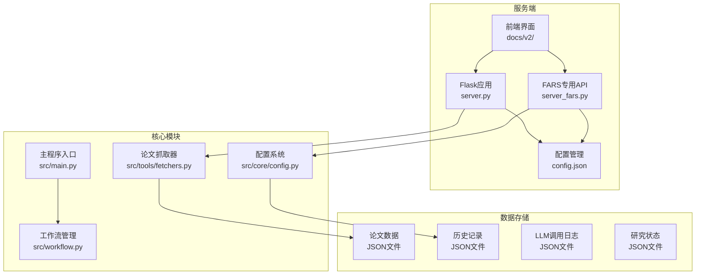
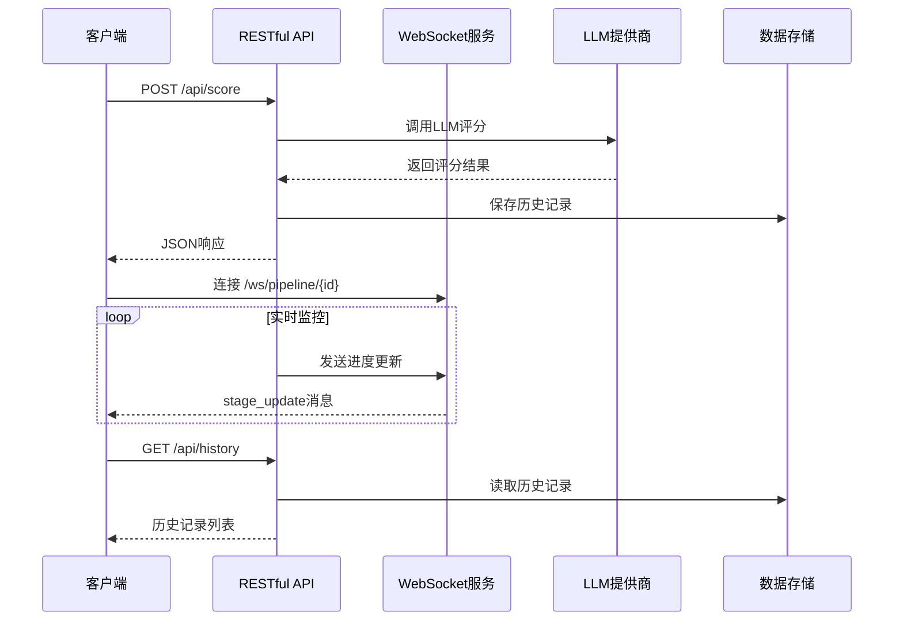
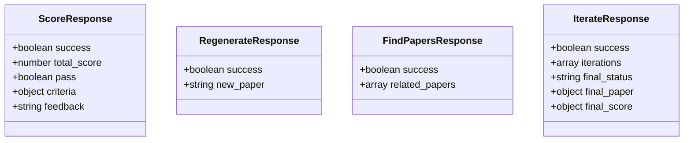
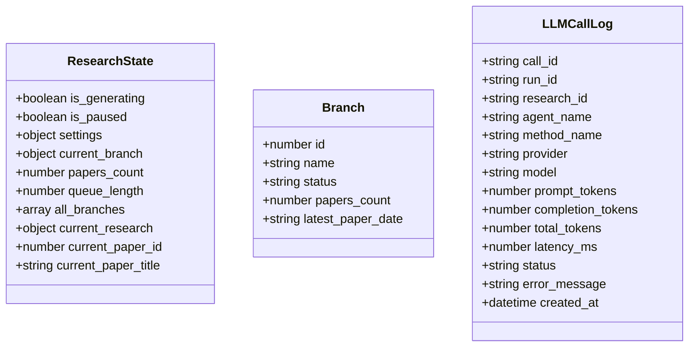
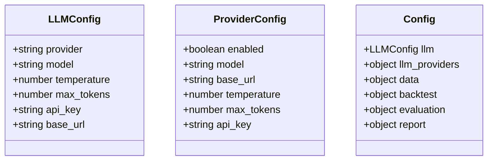
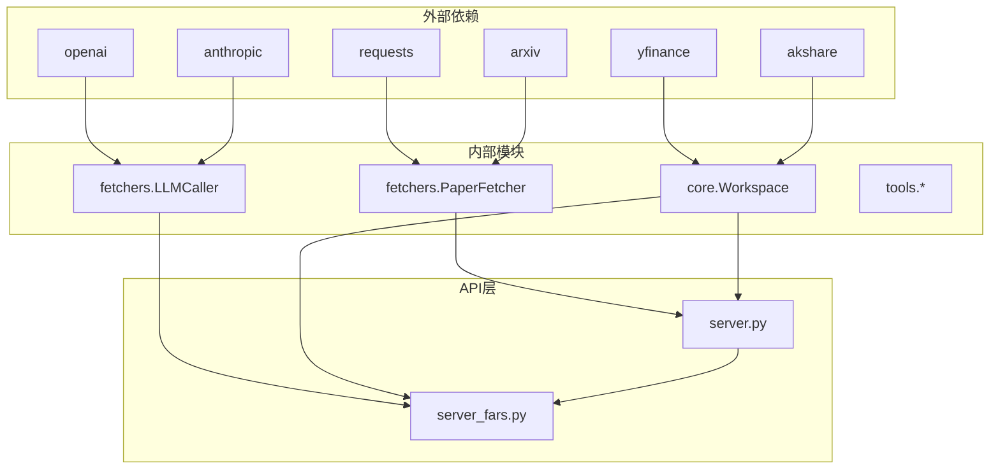

# API接口文档

<cite>
**本文档引用的文件**
- [server.py](file://server.py)
- [server_fars.py](file://server_fars.py)
- [API_SPEC.md](file://docs/API_SPEC.md)
- [config.json](file://config.json)
- [config.local.json](file://config.local.json)
- [index.html](file://docs/v2/index.html)
- [client.js](file://docs/v2/api/client.js)
- [store.js](file://docs/v2/state/store.js)
- [fetchers.py](file://src/tools/fetchers.py)
- [config.py](file://src/core/config.py)
- [main.py](file://src/main.py)
- [workflow.py](file://src/workflow.py)
</cite>

## 目录
1. [简介](#简介)
2. [项目结构](#项目结构)
3. [核心组件](#核心组件)
4. [架构概览](#架构概览)
5. [详细组件分析](#详细组件分析)
6. [依赖关系分析](#依赖关系分析)
7. [性能考虑](#性能考虑)
8. [故障排除指南](#故障排除指南)
9. [结论](#结论)
10. [附录](#附录)

## 简介

paperwriterAI是一个基于Flask的论文写作辅助系统，提供了完整的RESTful API接口和WebSocket实时通信功能。该系统专注于量化金融领域的论文生成、评分、迭代优化和质量控制。

**系统特点：**
- 支持多LLM提供商集成（OpenAI、MiniMax、Gemini等）
- 实时论文评分和迭代优化
- 完整的研究工作流管理
- WebSocket实时进度监控
- 多种论文格式支持（LaTeX、PDF、Markdown）

## 项目结构



**图表来源**
- [server.py:1-100](file://server.py#L1-L100)
- [server_fars.py:1-100](file://server_fars.py#L1-L100)
- [config.py:190-202](file://src/core/config.py#L190-L202)

**章节来源**
- [server.py:1-200](file://server.py#L1-L200)
- [server_fars.py:1-100](file://server_fars.py#L1-L100)
- [config.json:1-65](file://config.json#L1-L65)

## 核心组件

### RESTful API服务

系统提供两个主要的API服务：

1. **通用论文处理API** (`server.py`)
   - 论文搜索、下载、分析
   - 假设生成和实验管理
   - 报告生成和下载

2. **FARS专用API** (`server_fars.py`)
   - 论文评分和质量评估
   - 迭代优化流程
   - 历史记录管理
   - 研究状态监控

### WebSocket实时通信

系统支持WebSocket连接用于实时进度监控：

- 连接URL: `/ws/pipeline/{pipeline_id}`
- 消息类型: `stage_update`, `stage_complete`, `error`, `complete`
- 实时进度更新和状态通知

**章节来源**
- [server.py:1400-1650](file://server.py#L1400-L1650)
- [server_fars.py:440-623](file://server_fars.py#L440-L623)
- [API_SPEC.md:410-436](file://docs/API_SPEC.md#L410-L436)

## 架构概览



**图表来源**
- [server_fars.py:440-593](file://server_fars.py#L440-L593)
- [server.py:1400-1650](file://server.py#L1400-L1650)

## 详细组件分析

### 论文评分API

#### 端点定义
- **POST /api/score** - 论文评分
- **POST /api/regenerate** - 论文重生成  
- **POST /api/find_papers** - 查找相关论文
- **POST /api/iterate** - 完整迭代流程

#### 请求参数

```mermaid
flowchart TD
A[论文评分请求] --> B{请求体参数}
B --> C[paper: string<br/>必需 - 论文内容}
B --> D[topic: string<br/>可选 - 论文主题]
B --> E[max_iterations: number<br/>可选 - 最大迭代次数]
F[论文重生成请求] --> G{请求体参数}
G --> H[paper: string<br/>必需 - 原始论文内容]
G --> I[feedback: string<br/>必需 - 评审反馈]
G --> J[criteria: object<br/>必需 - 评分标准]
K[查找相关论文请求] --> L{请求体参数}
L --> M[topic: string<br/>必需 - 研究主题]
L --> N[failed_aspects: array<br/>必需 - 失败方面列表]
```

**图表来源**
- [server_fars.py:440-593](file://server_fars.py#L440-L593)

#### 响应格式



**图表来源**
- [server_fars.py:261-325](file://server_fars.py#L261-L325)
- [server_fars.py:328-393](file://server_fars.py#L328-L393)

**章节来源**
- [server_fars.py:440-593](file://server_fars.py#L440-L593)
- [server_fars.py:261-393](file://server_fars.py#L261-L393)

### 研究状态管理API

#### 端点定义
- **GET /api/research/state** - 获取研究状态
- **GET /api/branches** - 获取分支列表
- **GET /api/llm-calls** - 获取LLM调用记录
- **GET /api/history** - 获取历史记录列表

#### 研究状态响应



**图表来源**
- [server_fars.py:627-657](file://server_fars.py#L627-L657)
- [server_fars.py:660-673](file://server_fars.py#L660-L673)
- [server_fars.py:678-757](file://server_fars.py#L678-L757)

**章节来源**
- [server_fars.py:627-757](file://server_fars.py#L627-L757)

### LLM配置管理

#### 配置结构



**图表来源**
- [config.json:1-65](file://config.json#L1-L65)
- [config.local.json:1-36](file://config.local.json#L1-L36)

#### 支持的LLM提供商

| 提供商 | 默认模型 | 基础URL | 特性 |
|--------|----------|---------|------|
| minimax | MiniMax-M2.7-highspeed | https://minnimax.chat/v1 | 高速推理 |
| openai | gpt-4o | https://api.openai.com/v1 | GPT系列 |
| gemini | gemini-2.0-flash | https://generativelanguage.googleapis.com/v1beta | Gemini模型 |
| custom | 自定义 | 用户配置 | 任意OpenAI兼容API |

**章节来源**
- [config.json:1-65](file://config.json#L1-L65)
- [config.local.json:1-36](file://config.local.json#L1-L36)

## 依赖关系分析



**图表来源**
- [requirements.txt:1-39](file://requirements.txt#L1-L39)
- [fetchers.py:1-100](file://src/tools/fetchers.py#L1-L100)
- [config.py:204-251](file://src/core/config.py#L204-L251)

**章节来源**
- [requirements.txt:1-39](file://requirements.txt#L1-L39)
- [fetchers.py:1-800](file://src/tools/fetchers.py#L1-L800)
- [config.py:204-251](file://src/core/config.py#L204-L251)

## 性能考虑

### LLM调用优化

1. **并发控制**: 系统实现了LLM调用的并发管理和超时控制
2. **缓存机制**: 支持本地模型（Ollama）作为备选方案
3. **资源监控**: 实时跟踪LLM使用情况和Token消耗

### 数据存储优化

1. **文件系统**: 使用JSON文件存储论文、历史记录和配置
2. **增量更新**: 支持断点续传和增量处理
3. **备份管理**: 自动备份重要数据文件

### 网络通信优化

1. **WebSocket长连接**: 减少HTTP请求开销
2. **批量操作**: 支持批量论文处理
3. **异步处理**: 长任务采用异步处理模式

## 故障排除指南

### 常见错误及解决方案

| 错误类型 | 错误代码 | 描述 | 解决方案 |
|----------|----------|------|----------|
| LLM连接失败 | 500 | LLM API调用失败 | 检查API密钥和网络连接 |
| 论文内容为空 | 400 | 请求缺少必要参数 | 确保paper参数不为空 |
| 文件不存在 | 404 | 指定文件未找到 | 检查文件路径和权限 |
| 超时错误 | 504 | 请求处理超时 | 增加超时设置或减少请求负载 |

### 调试工具

1. **日志系统**: 系统内置详细的日志记录功能
2. **状态监控**: 通过WebSocket实时监控系统状态
3. **配置验证**: 提供配置文件的语法和有效性检查

**章节来源**
- [server.py:1400-1650](file://server.py#L1400-L1650)
- [server_fars.py:440-593](file://server_fars.py#L440-L593)

## 结论

paperwriterAI提供了一个完整的论文写作辅助生态系统，具有以下优势：

1. **模块化设计**: 清晰的模块分离和职责划分
2. **多平台支持**: 支持多种LLM提供商和数据源
3. **实时监控**: WebSocket实现实时状态更新
4. **可扩展性**: 易于添加新的功能和集成新的服务

系统适用于量化金融、计算机视觉和强化学习等研究领域，为研究人员提供了一套完整的自动化论文生成和优化工具链。

## 附录

### 安装和配置

1. **环境要求**: Python 3.9+, pip包管理器
2. **安装依赖**: `pip install -r requirements.txt`
3. **配置LLM**: 在`config.local.json`中设置API密钥
4. **启动服务**: `python server.py`

### 客户端实现指南

1. **RESTful API调用**: 使用标准HTTP客户端库
2. **WebSocket连接**: 使用浏览器WebSocket API或相应库
3. **错误处理**: 实现重试机制和异常处理
4. **状态管理**: 维护会话状态和认证信息

### 版本信息

- **当前版本**: 1.0
- **基础URL**: `http://localhost:8000/api/v1`
- **协议**: HTTP/HTTPS + WebSocket
- **认证**: Bearer Token (待实现)