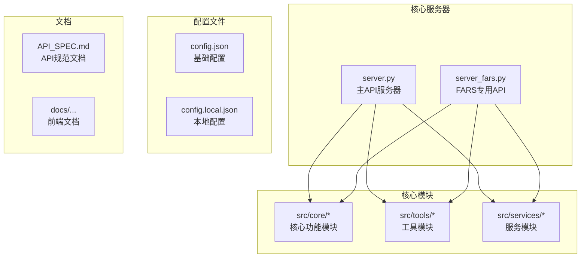
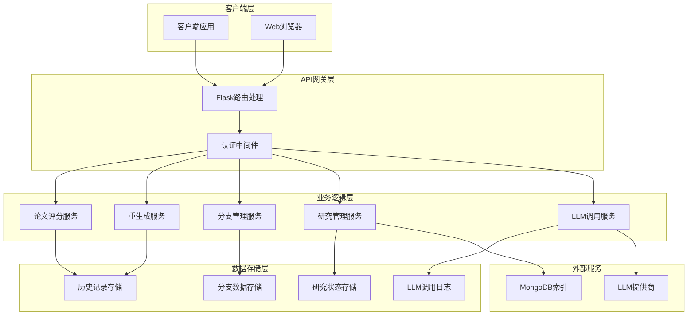
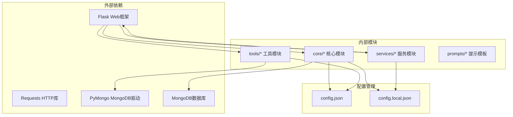
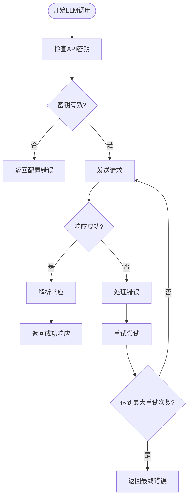

# RESTful API规范

<cite>
**本文档引用的文件**
- [server.py](file://server.py)
- [server_fars.py](file://server_fars.py)
- [API_SPEC.md](file://docs/API_SPEC.md)
- [config.json](file://config.json)
- [config.local.json](file://config.local.json)
</cite>

## 目录
1. [简介](#简介)
2. [项目结构](#项目结构)
3. [核心组件](#核心组件)
4. [架构概览](#架构概览)
5. [详细组件分析](#详细组件分析)
6. [依赖关系分析](#依赖关系分析)
7. [性能考虑](#性能考虑)
8. [故障排除指南](#故障排除指南)
9. [结论](#结论)

## 简介

paperwriterAI是一个基于Flask框架构建的论文写作辅助系统，提供了完整的RESTful API接口。该系统专注于量化交易策略研究，通过集成大型语言模型(Large Language Models)来自动化论文生成、评分、重生成和迭代优化流程。

系统采用模块化设计，包含多个核心功能模块：
- 论文评分与迭代重生成
- 分支研究管理系统
- LLM调用监控与统计
- 研究状态跟踪
- 论文生成流水线

## 项目结构

项目采用分层架构设计，主要文件组织如下：



**图表来源**
- [server.py:1-100](file://server.py#L1-L100)
- [server_fars.py:1-50](file://server_fars.py#L1-L50)

**章节来源**
- [server.py:1-200](file://server.py#L1-L200)
- [server_fars.py:1-100](file://server_fars.py#L1-L100)

## 核心组件

### 主要API端点分类

系统提供以下主要API端点分类：

1. **论文评分与重生成API**
   - `/api/score` - 论文评分
   - `/api/regenerate` - 论文重生成
   - `/api/find_papers` - 查找相关论文
   - `/api/iterate` - 完整迭代流程

2. **研究状态管理API**
   - `/api/research/state` - 获取研究状态
   - `/api/research/run` - 获取运行状态
   - `/api/research/checkpoints` - 获取检查点
   - `/api/research/resume/<research_id>` - 恢复研究

3. **分支管理API**
   - `/api/branches` - 分支列表与创建
   - `/api/branches/<int:branch_id>` - 分支详情
   - `/api/branches/switch/<int:branch_id>` - 切换分支

4. **LLM调用监控API**
   - `/api/llm-calls` - LLM调用记录列表
   - `/api/llm-calls/<call_id>` - 单条调用详情
   - `/api/llm-calls/stats` - LLM调用统计

5. **历史记录API**
   - `/api/history` - 历史记录列表
   - `/api/history/<int:record_id>` - 历史记录详情

**章节来源**
- [server.py:1524-1706](file://server.py#L1524-L1706)
- [server.py:1866-2293](file://server.py#L1866-L2293)

## 架构概览

系统采用微服务架构，主要组件交互如下：



**图表来源**
- [server.py:706-948](file://server.py#L706-L948)
- [server.py:1134-1176](file://server.py#L1134-L1176)

## 详细组件分析

### 论文评分API

#### 端点定义
- **URL**: `/api/score`
- **方法**: POST
- **认证**: Bearer Token

#### 请求参数
| 参数 | 类型 | 必需 | 说明 |
|------|------|------|------|
| paper | string | 是 | 要评分的论文内容 |

#### 请求体格式
```json
{
  "paper": "论文的完整内容"
}
```

#### 成功响应
```json
{
  "total_score": 8.5,
  "pass": true,
  "criteria": {
    "innovation": {
      "score": 3,
      "max": 3,
      "comment": "创新性描述"
    },
    "methodology": {
      "score": 2,
      "max": 2,
      "comment": "方法论描述"
    },
    "experiment": {
      "score": 2,
      "max": 2,
      "comment": "实验验证描述"
    },
    "writing": {
      "score": 2,
      "max": 2,
      "comment": "写作质量描述"
    },
    "overfitting": {
      "score": 1,
      "max": 1,
      "comment": "过拟合风险描述"
    }
  },
  "feedback": "总体评审意见"
}
```

#### 错误响应
```json
{
  "error": "论文内容不能为空"
}
```

**章节来源**
- [server.py:1524-1543](file://server.py#L1524-L1543)

### 论文重生成API

#### 端点定义
- **URL**: `/api/regenerate`
- **方法**: POST
- **认证**: Bearer Token

#### 请求参数
| 参数 | 类型 | 必需 | 说明 |
|------|------|------|------|
| paper | string | 是 | 原始论文内容 |
| feedback | string | 是 | 评审反馈意见 |
| criteria | object | 是 | 评分标准对象 |

#### 请求体格式
```json
{
  "paper": "原始论文内容",
  "feedback": "评审反馈意见",
  "criteria": {
    "total_score": 6.5,
    "pass": false,
    "criteria": {
      "innovation": {"score": 2, "max": 3, "comment": "创新性描述"},
      "methodology": {"score": 1, "max": 2, "comment": "方法论描述"},
      "experiment": {"score": 1, "max": 2, "comment": "实验验证描述"},
      "writing": {"score": 1.5, "max": 2, "comment": "写作质量描述"},
      "overfitting": {"score": 1, "max": 1, "comment": "过拟合风险描述"}
    },
    "feedback": "总体评审意见"
  }
}
```

#### 成功响应
```json
{
  "new_paper": "重生成后的论文内容"
}
```

**章节来源**
- [server.py:1546-1569](file://server.py#L1546-L1569)

### 查找相关论文API

#### 端点定义
- **URL**: `/api/find_papers`
- **方法**: POST
- **认证**: Bearer Token

#### 请求参数
| 参数 | 类型 | 必需 | 说明 |
|------|------|------|------|
| topic | string | 是 | 论文主题 |
| failed_aspects | array | 否 | 失败方面列表 |

#### 请求体格式
```json
{
  "topic": "量化交易策略",
  "failed_aspects": ["创新性不足", "方法论存在缺陷"]
}
```

#### 成功响应
```json
{
  "related_papers": [
    {
      "title": "相关论文标题",
      "reason": "为什么有帮助的解释"
    }
  ]
}
```

**章节来源**
- [server.py:1572-1592](file://server.py#L1572-L1592)

### 完整迭代流程API

#### 端点定义
- **URL**: `/api/iterate`
- **方法**: POST
- **认证**: Bearer Token

#### 请求参数
| 参数 | 类型 | 必需 | 默认值 | 说明 |
|------|------|------|--------|------|
| paper | string | 是 | - | 原始论文内容 |
| topic | string | 否 | "量化交易策略" | 论文主题 |
| max_iterations | integer | 否 | 3 | 最大迭代次数 |

#### 请求体格式
```json
{
  "paper": "原始论文内容",
  "topic": "量化交易策略",
  "max_iterations": 3
}
```

#### 成功响应
```json
{
  "iterations": [
    {
      "iteration": 1,
      "score": {
        "total_score": 6.5,
        "pass": false,
        "criteria": {
          "innovation": {"score": 2, "max": 3, "comment": "创新性描述"},
          "methodology": {"score": 1, "max": 2, "comment": "方法论描述"},
          "experiment": {"score": 1, "max": 2, "comment": "实验验证描述"},
          "writing": {"score": 1.5, "max": 2, "comment": "写作质量描述"},
          "overfitting": {"score": 1, "max": 1, "comment": "过拟合风险描述"}
        },
        "feedback": "总体评审意见"
      },
      "paper": "论文内容预览...",
      "related_papers": [...],
      "failed_aspects": ["创新性不足"],
      "new_paper_preview": "重生成后的内容预览...",
      "action": "已重生成，进入下一轮"
    }
  ],
  "final_status": "passed",
  "final_paper": "最终论文内容",
  "final_score": {
    "total_score": 8.5,
    "pass": true,
    "criteria": {...},
    "feedback": "最终评审意见"
  }
}
```

**章节来源**
- [server.py:1595-1677](file://server.py#L1595-L1677)

### 研究状态API

#### 端点定义
- **URL**: `/api/research/state`
- **方法**: GET
- **认证**: Bearer Token

#### 查询参数
| 参数 | 类型 | 说明 |
|------|------|------|
| - | - | 无查询参数 |

#### 成功响应
```json
{
  "success": true,
  "is_generating": false,
  "is_paused": false,
  "settings": {
    "auto_continue": true,
    "pause_after_next": false
  },
  "current_branch": {
    "id": 1,
    "name": "默认研究分支",
    "created_at": "2026-06-20T10:00:00Z",
    "review_content": "种子综述内容",
    "parent_branch_id": null,
    "paper_ids": [],
    "status": "active",
    "iterations_count": 0
  },
  "papers": [],
  "papers_count": 0,
  "hypotheses": [],
  "experiments": [],
  "run_metrics": {},
  "llm_inflight": null,
  "live_graphs": {},
  "current_run": null,
  "runs": [],
  "research_activity": {
    "phase": "idle",
    "message": "等待开始",
    "progress": 0,
    "updated_at": "2026-06-20T10:00:00Z"
  },
  "last_active_at": "2026-06-20T10:00:00Z",
  "last_active_source": "research_activity",
  "stall_seconds": 0,
  "self_heal": null,
  "queue_length": 0,
  "all_branches": [],
  "workflow": {
    "version": "2.0",
    "project_name": "",
    "created_at": "2026-06-20T10:00:00Z",
    "updated_at": "2026-06-20T10:00:00Z",
    "status": "idle",
    "current_phase": "initialization",
    "phase_history": [],
    "literature_review": {
      "papers_read": [],
      "papers_to_read": [],
      "key_themes": [],
      "research_questions": []
    },
    "research_progress": {
      "current_iteration": 0,
      "total_iterations_planned": 3,
      "iterations": []
    }
  },
  "data_registry_summary": {
    "seed_papers_count": 0,
    "research_archives_count": 0
  }
}
```

**章节来源**
- [server.py:1866-1920](file://server.py#L1866-L1920)

### 分支管理API

#### 分支列表API
- **URL**: `/api/branches`
- **方法**: GET
- **认证**: Bearer Token

#### 分支创建API
- **URL**: `/api/branches`
- **方法**: POST
- **认证**: Bearer Token

#### 分支详情API
- **URL**: `/api/branches/<int:branch_id>`
- **方法**: GET
- **认证**: Bearer Token

#### 切换分支API
- **URL**: `/api/branches/switch/<int:branch_id>`
- **方法**: POST
- **认证**: Bearer Token

**章节来源**
- [server.py:2110-2293](file://server.py#L2110-L2293)

### LLM调用监控API

#### 调用记录列表API
- **URL**: `/api/llm-calls`
- **方法**: GET
- **认证**: Bearer Token

#### 查询参数
| 参数 | 类型 | 说明 |
|------|------|------|
| limit | integer | 返回记录数量，默认100 |
| offset | integer | 偏移量，默认0 |
| agent | string | Agent名称过滤 |
| status | string | 状态过滤 |
| research_id | string | 研究ID过滤 |

#### 单条调用详情API
- **URL**: `/api/llm-calls/<call_id>`
- **方法**: GET
- **认证**: Bearer Token

#### 调用统计API
- **URL**: `/api/llm-calls/stats`
- **方法**: GET
- **认证**: Bearer Token

**章节来源**
- [server.py:2132-2247](file://server.py#L2132-L2247)

## 依赖关系分析

系统的核心依赖关系如下：



**图表来源**
- [server.py:23-74](file://server.py#L23-L74)
- [config.json:1-65](file://config.json#L1-L65)

**章节来源**
- [server.py:21-74](file://server.py#L21-L74)
- [config.json:1-65](file://config.json#L1-L65)

## 性能考虑

### LLM调用优化

系统实现了多层LLM调用优化机制：

1. **API密钥轮换**: 支持多个API密钥的自动轮换
2. **超时控制**: 统一的请求超时机制（默认600秒）
3. **重试机制**: 自动重试失败的请求
4. **令牌统计**: 详细的使用量统计和监控

### 缓存策略

- **调试缓存**: `_DBG_CACHE`用于调试信息的缓存
- **配置缓存**: 配置文件的修改时间戳缓存
- **LLM使用量缓存**: `_LLM_USAGE_BUFFER`用于批量更新使用统计

### 并发处理

- **线程安全**: 使用锁机制保护共享资源
- **异步处理**: 关键操作采用异步线程处理
- **心跳监控**: 实时监控LLM调用状态

## 故障排除指南

### 常见错误类型

| 错误代码 | HTTP状态 | 描述 | 处理建议 |
|----------|----------|------|----------|
| VALIDATION_ERROR | 400 | 请求参数验证失败 | 检查请求参数格式和必填字段 |
| UNAUTHORIZED | 401 | 未认证或认证失败 | 确认Bearer Token有效性 |
| FORBIDDEN | 403 | 权限不足 | 检查用户权限和API访问权限 |
| NOT_FOUND | 404 | 资源不存在 | 确认资源ID正确性和存在性 |
| INTERNAL_ERROR | 500 | 服务器内部错误 | 检查服务器日志和依赖服务状态 |
| LLM_ERROR | 500 | LLM调用失败 | 检查API密钥和网络连接 |

### LLM调用错误处理

系统实现了完善的LLM调用错误处理机制：



**图表来源**
- [server.py:801-948](file://server.py#L801-L948)

### 调试和监控

系统提供了丰富的调试和监控功能：

1. **调试服务器集成**: 支持远程调试服务器
2. **心跳事件**: 实时监控LLM调用状态
3. **使用量统计**: 详细的令牌使用统计
4. **错误日志**: 完整的错误追踪和日志记录

**章节来源**
- [server.py:954-966](file://server.py#L954-L966)
- [server.py:1312-1328](file://server.py#L1312-L1328)

## 结论

paperwriterAI的RESTful API设计遵循了现代Web服务的最佳实践，具有以下特点：

1. **模块化设计**: 清晰的模块分离和职责划分
2. **完整的错误处理**: 全面的错误类型定义和处理机制
3. **性能优化**: 多层次的性能优化策略
4. **监控完备**: 详细的使用量统计和状态监控
5. **扩展性强**: 模块化的架构便于功能扩展

系统特别适合用于量化交易策略研究的自动化论文生成和评审场景，通过集成LLM技术实现了从文献检索到论文生成的完整工作流自动化。