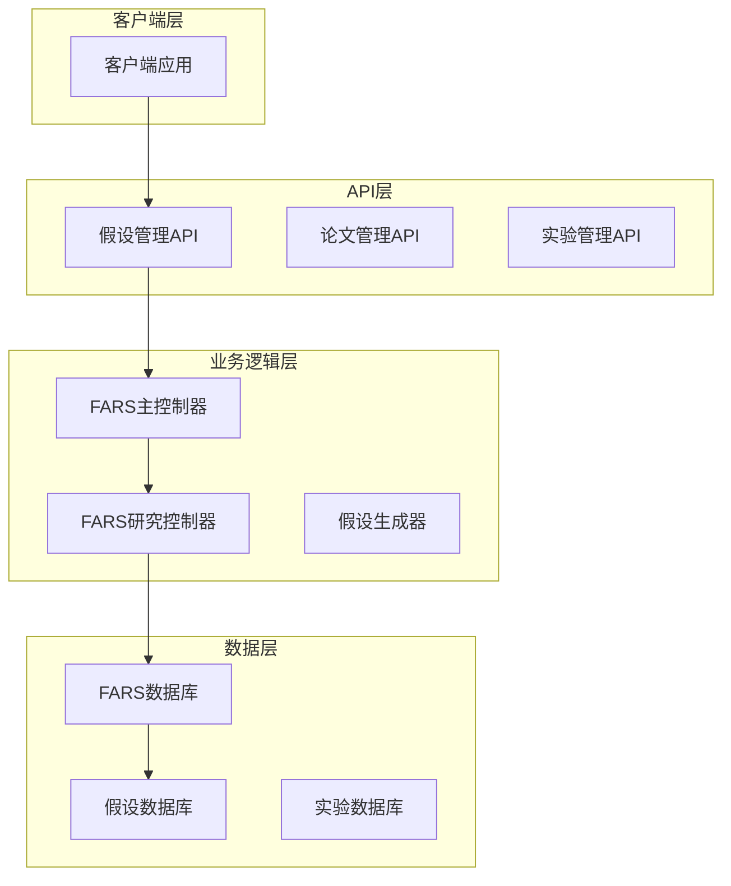
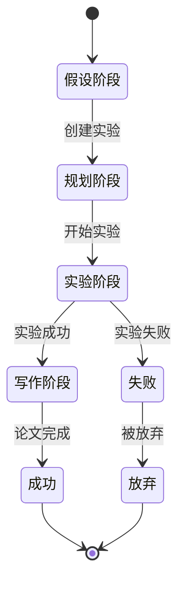
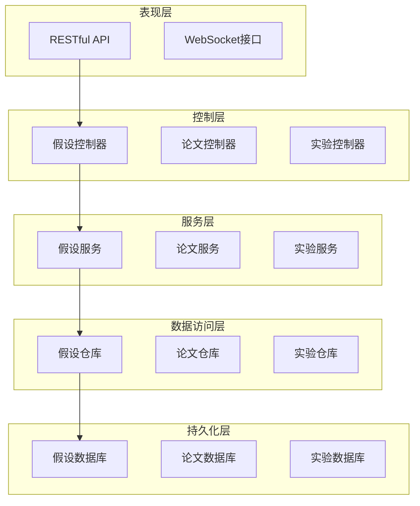
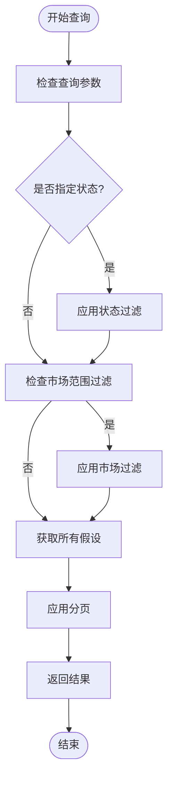
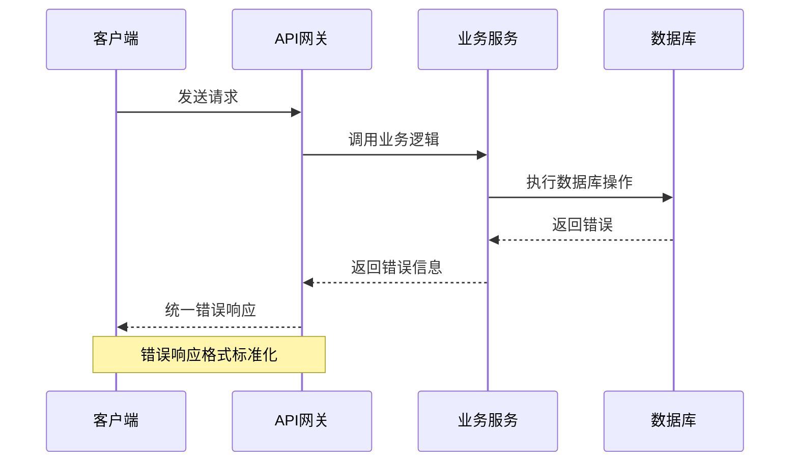
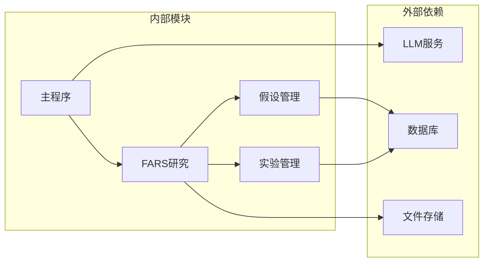
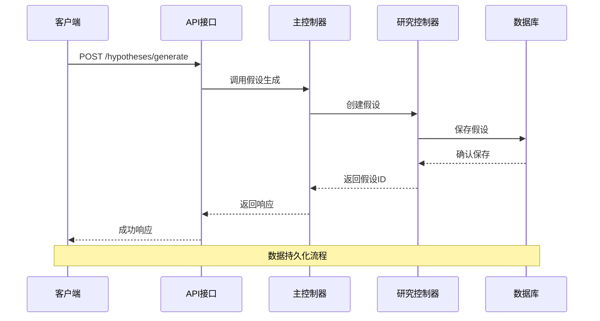
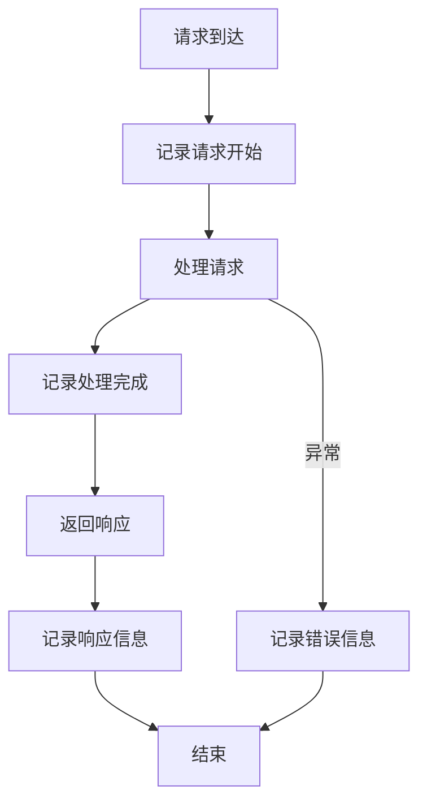

# 假设管理API

<cite>
**本文档引用的文件**
- [API规范](file://docs/API_SPEC.md)
- [主程序](file://src/main.py)
- [FARS研究模块](file://src/fars_research.py)
- [提示模板](file://src/prompts/templates.py)
- [服务器端点](file://server.py)
- [FARS服务器端点](file://server_fars.py)
</cite>

## 目录
1. [简介](#简介)
2. [项目结构](#项目结构)
3. [核心组件](#核心组件)
4. [架构概览](#架构概览)
5. [详细组件分析](#详细组件分析)
6. [依赖关系分析](#依赖关系分析)
7. [性能考虑](#性能考虑)
8. [故障排除指南](#故障排除指南)
9. [结论](#结论)

## 简介

本文档为假设管理API提供了完整的接口规范，涵盖从论文生成假设、列出假设和获取假设详情的完整功能。该API基于FARS（完全自动化研究系统）构建，专门用于量化金融领域的假设生成和管理。

## 项目结构

FARS系统采用模块化架构设计，主要包含以下核心组件：



**图表来源**
- [主程序:35-438](file://src/main.py#L35-L438)
- [FARS研究模块:335-484](file://src/fars_research.py#L335-L484)

**章节来源**
- [主程序:1-521](file://src/main.py#L1-L521)
- [FARS研究模块:1-569](file://src/fars_research.py#L1-L569)

## 核心组件

### 假设数据模型

假设管理系统的核心数据结构基于Hypothesis类设计，包含以下关键字段：

| 字段名 | 类型 | 必填 | 描述 |
|--------|------|------|------|
| hypothesis_id | string | 是 | 假设唯一标识符 |
| alpha_name | string | 是 | 交易因子名称 |
| description | string | 是 | 假设详细描述 |
| trading_logic | string | 是 | 交易逻辑说明 |
| parameters | object | 是 | 参数配置对象 |

### 状态管理

系统支持以下研究状态：



**图表来源**
- [FARS研究模块:28-36](file://src/fars_research.py#L28-L36)

**章节来源**
- [FARS研究模块:48-61](file://src/fars_research.py#L48-L61)

## 架构概览

假设管理API采用分层架构设计，确保了良好的可维护性和扩展性：



**图表来源**
- [API规范:1-436](file://docs/API_SPEC.md#L1-L436)
- [服务器端点:75-800](file://server.py#L75-L800)

## 详细组件分析

### 假设生成接口

#### 接口定义

**POST /hypotheses/generate**

**请求参数**

| 参数名 | 类型 | 必填 | 说明 |
|--------|------|------|------|
| paper_id | string | 是 | 论文唯一标识符 |
| market_universe | string | 是 | 市场范围（如：A-share、US-equities） |
| time_horizon | string | 是 | 时间范围（如：daily、hourly、intraday） |

**请求示例**
```json
{
  "paper_id": "arxiv_2409.06289",
  "market_universe": "A-share",
  "time_horizon": "daily"
}
```

**响应数据结构**

| 字段名 | 类型 | 描述 |
|--------|------|------|
| success | boolean | 操作是否成功 |
| data | object | 假设数据对象 |
| hypothesis_id | string | 生成的假设ID |
| alpha_name | string | 交易因子名称 |
| description | string | 假设描述 |
| trading_logic | string | 交易逻辑 |
| parameters | object | 参数配置 |

**响应示例**
```json
{
  "success": true,
  "data": {
    "hypothesis_id": "hyp_20260620_001",
    "alpha_name": "LLM_Sentiment_Momentum",
    "description": "基于LLM情感分析的动量策略",
    "trading_logic": "当情感分数超过阈值且动量指标向上时买入",
    "parameters": {
      "sentiment_threshold": 0.6,
      "lookback_period": 20,
      "position_size": 0.1
    }
  }
}
```

**章节来源**
- [API规范:124-154](file://docs/API_SPEC.md#L124-L154)
- [主程序:237-277](file://src/main.py#L237-L277)
- [提示模板:28-85](file://src/prompts/templates.py#L28-L85)

### 假设列表接口

#### 接口定义

**GET /hypotheses**

**查询参数**

| 参数名 | 类型 | 默认值 | 说明 |
|--------|------|--------|------|
| status | string | null | 状态过滤器 |
| universe | string | null | 市场范围过滤器 |
| page | integer | 1 | 页码 |
| page_size | integer | 20 | 每页大小 |

**分页查询逻辑**



**图表来源**
- [FARS研究模块:326-332](file://src/fars_research.py#L326-L332)

**章节来源**
- [API规范:156-174](file://docs/API_SPEC.md#L156-L174)
- [FARS研究模块:326-332](file://src/fars_research.py#L326-L332)

### 假设详情接口

#### 接口定义

**GET /hypotheses/{hypothesis_id}**

**路径参数**

| 参数名 | 类型 | 必填 | 说明 |
|--------|------|------|------|
| hypothesis_id | string | 是 | 假设唯一标识符 |

**响应数据结构**

| 字段名 | 类型 | 描述 |
|--------|------|------|
| hypothesis_id | string | 假设ID |
| title | string | 假设标题 |
| description | string | 假设描述 |
| created_at | string | 创建时间 |
| status | string | 当前状态 |
| source_paper | string | 来源论文ID |
| tags | array | 标签列表 |
| expected_outcome | string | 预期结果 |
| actual_outcome | string | 实际结果 |
| experiments | array | 实验ID列表 |

**章节来源**
- [API规范:170-174](file://docs/API_SPEC.md#L170-L174)
- [FARS研究模块:155-160](file://src/fars_research.py#L155-L160)

### 错误处理机制

系统采用统一的错误响应格式：



**错误响应格式**
```json
{
  "success": false,
  "error": {
    "code": "VALIDATION_ERROR",
    "message": "请求参数错误",
    "details": {}
  }
}
```

**错误代码映射**

| 错误代码 | HTTP状态 | 说明 |
|----------|----------|------|
| VALIDATION_ERROR | 400 | 请求参数验证失败 |
| UNAUTHORIZED | 401 | 未授权访问 |
| FORBIDDEN | 403 | 禁止访问 |
| NOT_FOUND | 404 | 资源不存在 |
| INTERNAL_ERROR | 500 | 服务器内部错误 |
| LLM_ERROR | 500 | LLM调用失败 |
| BACKTEST_ERROR | 500 | 回测执行失败 |

**章节来源**
- [API规范:383-407](file://docs/API_SPEC.md#L383-L407)

## 依赖关系分析

### 组件耦合度



**图表来源**
- [主程序:22-31](file://src/main.py#L22-L31)
- [FARS研究模块:110-146](file://src/fars_research.py#L110-L146)

### 数据流分析



**图表来源**
- [主程序:237-277](file://src/main.py#L237-L277)
- [FARS研究模块:341-361](file://src/fars_research.py#L341-L361)

**章节来源**
- [服务器端点:75-800](file://server.py#L75-L800)
- [FARS服务器端点:1-800](file://server_fars.py#L1-L800)

## 性能考虑

### 缓存策略

系统采用多级缓存机制：

1. **内存缓存**：热点数据缓存
2. **数据库缓存**：查询结果缓存
3. **文件缓存**：静态资源缓存

### 并发处理

- **线程安全**：数据库操作使用连接池
- **锁机制**：关键资源访问使用互斥锁
- **异步处理**：长耗时操作使用异步队列

### 优化建议

1. **批量操作**：支持批量查询和更新
2. **索引优化**：为常用查询字段建立索引
3. **分页优化**：大数据量场景使用游标分页
4. **压缩传输**：启用GZIP压缩减少网络传输

## 故障排除指南

### 常见问题诊断

| 问题类型 | 症状 | 可能原因 | 解决方案 |
|----------|------|----------|----------|
| 假设生成失败 | 返回错误信息 | LLM调用失败 | 检查API密钥和网络连接 |
| 查询超时 | 请求响应缓慢 | 数据库查询慢 | 优化查询语句和索引 |
| 内存泄漏 | 系统内存持续增长 | 资源未正确释放 | 检查对象生命周期管理 |
| 并发冲突 | 数据不一致 | 竞态条件 | 使用事务和锁机制 |

### 日志监控

系统提供完整的日志记录机制：



**章节来源**
- [API规范:410-433](file://docs/API_SPEC.md#L410-L433)

## 结论

假设管理API为量化金融研究提供了完整的自动化解决方案。通过标准化的接口设计和健壮的错误处理机制，系统能够高效地管理研究假设的整个生命周期。建议在生产环境中结合监控和日志系统，确保系统的稳定性和可维护性。