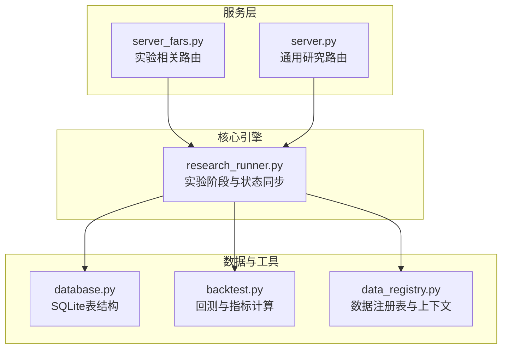
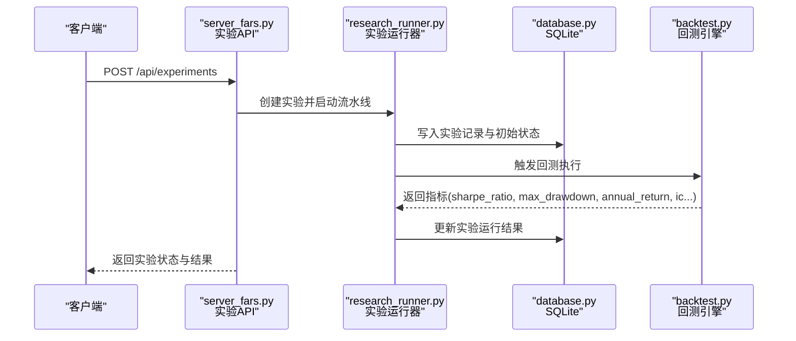
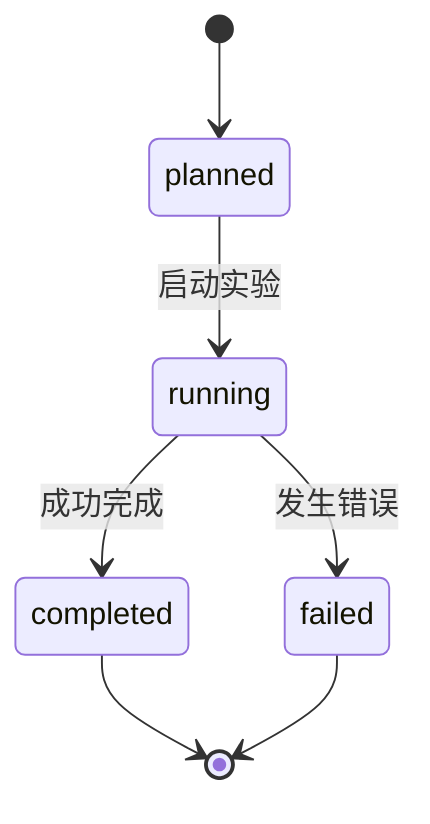
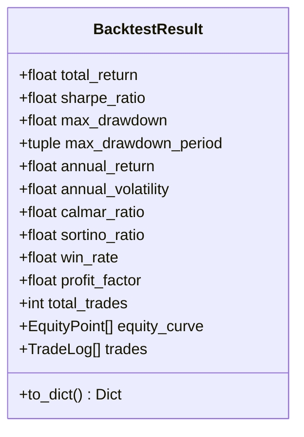
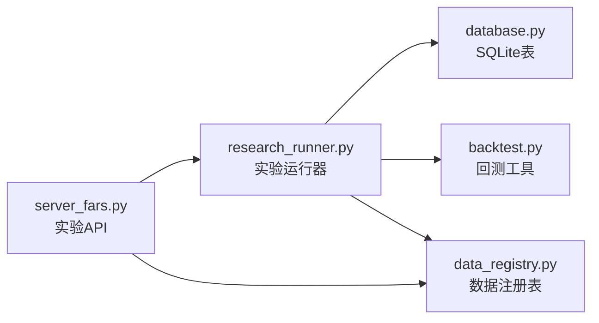

# 实验管理API

<cite>
**本文档引用的文件**
- [server.py](file://server.py)
- [server_fars.py](file://server_fars.py)
- [research_runner.py](file://src/core/research_runner.py)
- [backtest.py](file://src/tools/backtest.py)
- [database.py](file://src/core/database.py)
- [data_registry.py](file://src/core/data_registry.py)
- [fars_research.py](file://src/fars_research.py)
</cite>

## 目录
1. [简介](#简介)
2. [项目结构](#项目结构)
3. [核心组件](#核心组件)
4. [架构总览](#架构总览)
5. [详细组件分析](#详细组件分析)
6. [依赖关系分析](#依赖关系分析)
7. [性能考量](#性能考量)
8. [故障排查指南](#故障排查指南)
9. [结论](#结论)
10. [附录](#附录)

## 简介
本文件为“实验管理API”的权威接口文档，覆盖实验的创建、运行、结果获取与日志查询的完整生命周期。重点说明：
- 实验创建的请求体结构（hypothesis_id、experiment_name、backtest_period、market_universe等）
- 实验状态管理（pending、running、completed）与进度跟踪机制
- 实验结果数据结构（sharpe_ratio、max_drawdown、annual_return、ic等关键指标）
- 运行日志获取的URL模式与日志格式
- 实验取消与错误处理的业务逻辑
- 完整的API调用示例与状态转换说明

## 项目结构
实验管理API由三层组成：
- 服务层：提供REST接口（Flask路由）
- 核心引擎：负责实验流水线调度与状态同步（ResearchRunner）
- 数据与工具：数据库schema、回测工具、数据注册表

图表来源
- [server_fars.py:1542-1559](file://server_fars.py#L1542-L1559)
- [research_runner.py:278-629](file://src/core/research_runner.py#L278-L629)
- [database.py:88-119](file://src/core/database.py#L88-L119)
- [backtest.py:23-53](file://src/tools/backtest.py#L23-L53)
- [data_registry.py:48-97](file://src/core/data_registry.py#L48-L97)

章节来源
- [server_fars.py:1542-1559](file://server_fars.py#L1542-L1559)
- [research_runner.py:278-629](file://src/core/research_runner.py#L278-L629)
- [database.py:88-119](file://src/core/database.py#L88-L119)

## 核心组件
- 实验API端点：提供实验的创建、查询、运行状态与结果获取
- 实验运行器：驱动实验阶段推进、状态同步与进度计算
- 回测工具：提供回测引擎与指标计算（sharpe_ratio、max_drawdown、annual_return、ic等）
- 数据注册表：提供市场数据上下文与研究状态元数据
- 数据库schema：持久化实验、实验运行、论文与报告等实体

章节来源
- [server_fars.py:1542-1559](file://server_fars.py#L1542-L1559)
- [research_runner.py:278-629](file://src/core/research_runner.py#L278-L629)
- [backtest.py:23-53](file://src/tools/backtest.py#L23-L53)
- [data_registry.py:48-97](file://src/core/data_registry.py#L48-L97)
- [database.py:88-119](file://src/core/database.py#L88-L119)

## 架构总览
实验管理API采用“服务层-引擎层-数据层”分层架构。服务层接收HTTP请求，引擎层负责实验生命周期与状态机，数据层负责持久化与指标计算。

图表来源
- [server_fars.py:1558-1559](file://server_fars.py#L1558-L1559)
- [research_runner.py:278-629](file://src/core/research_runner.py#L278-L629)
- [database.py:88-119](file://src/core/database.py#L88-L119)
- [backtest.py:248-327](file://src/tools/backtest.py#L248-L327)

## 详细组件分析

### 实验API端点
- GET /api/experiments：获取实验列表
- GET /api/experiments/{exp_id}：获取单个实验详情
- POST /api/experiments：创建实验（请求体字段见下节）

章节来源
- [server_fars.py:1542-1559](file://server_fars.py#L1542-L1559)

### 实验创建请求体结构
- hypothesis_id：字符串，关联的研究假设标识
- experiment_name：字符串，实验名称
- backtest_period：对象，包含开始与结束日期（YYYY-MM-DD）
- market_universe：字符串，市场范围（如“中国A股”、“美股”等）
- 其他可选参数：描述、计划、数据源等

说明
- 请求体字段与数据库表结构中的experiments.plan、experiments.description等字段对应
- market_universe字段与alpha_factors.market_universe一致，便于后续因子/回测数据匹配

章节来源
- [database.py:88-100](file://src/core/database.py#L88-L100)
- [database.py:68-86](file://src/core/database.py#L68-L86)

### 实验状态管理与进度跟踪
- 状态枚举：planned（已规划）、running（运行中）、completed（已完成）、failed（失败）
- 进度计算：基于当前阶段与各阶段耗时，结合LLM调用统计与实验耗时进行综合评分
- 阶段同步：实验运行器根据当前研究阶段自动推进实验状态

图表来源
- [research_runner.py:583-629](file://src/core/research_runner.py#L583-L629)

章节来源
- [research_runner.py:583-629](file://src/core/research_runner.py#L583-L629)

### 实验结果数据结构
回测完成后，系统返回标准化指标，用于评估实验效果。关键字段如下：
- total_return：总收益率
- sharpe_ratio：夏普比率
- max_drawdown：最大回撤
- annual_return：年化收益率
- annual_volatility：年化波动率
- calmar_ratio：卡玛比率
- sortino_ratio：索提诺比率
- win_rate：胜率
- profit_factor：盈利因子
- total_trades：总交易次数
- equity_curve：权益曲线（日期-净值）
- trades：交易记录（开仓/平仓、盈亏等）

图表来源
- [backtest.py:23-53](file://src/tools/backtest.py#L23-L53)

章节来源
- [backtest.py:248-327](file://src/tools/backtest.py#L248-L327)

### 日志查询与URL模式
- 日志存储：研究日志与LLM调用记录分别保存在独立文件中
- 日志URL模式：
  - GET /api/research/state：获取研究状态与当前论文信息
  - GET /api/llm-calls：获取LLM调用记录列表（支持分页与过滤）
  - GET /api/llm-calls/{call_id}：获取单条LLM调用详情
- 日志格式：JSON对象，包含时间戳、类型、消息、持续时间、元数据等字段

章节来源
- [server_fars.py:627-657](file://server_fars.py#L627-L657)
- [server_fars.py:678-757](file://server_fars.py#L678-L757)
- [server_fars.py:763-799](file://server_fars.py#L763-L799)

### 实验取消与错误处理
- 取消机制：通过停止标志位与暂停状态控制实验进程
- 错误处理：捕获异常并记录到研究日志，同时更新实验状态为failed
- 恢复机制：支持从暂停点继续执行，恢复当前研究活动与实验状态

章节来源
- [research_runner.py:630-641](file://src/core/research_runner.py#L630-L641)
- [research_runner.py:553-562](file://src/core/research_runner.py#L553-L562)

### API调用示例与状态转换
- 创建实验
  - 方法：POST /api/experiments
  - 请求体：包含hypothesis_id、experiment_name、backtest_period、market_universe等
  - 响应：返回实验ID与初始状态（planned）
- 查询实验
  - 方法：GET /api/experiments 或 GET /api/experiments/{exp_id}
  - 响应：返回实验详情与当前状态
- 获取结果
  - 方法：GET /api/experiments/{exp_id}
  - 响应：返回回测指标与交易记录
- 获取日志
  - 方法：GET /api/research/state 或 GET /api/llm-calls
  - 响应：返回研究状态或LLM调用记录

章节来源
- [server_fars.py:1542-1559](file://server_fars.py#L1542-L1559)
- [server_fars.py:627-657](file://server_fars.py#L627-L657)
- [server_fars.py:678-757](file://server_fars.py#L678-L757)

## 依赖关系分析
实验管理API的关键依赖关系如下：

图表来源
- [server_fars.py:1542-1559](file://server_fars.py#L1542-L1559)
- [research_runner.py:278-629](file://src/core/research_runner.py#L278-L629)
- [database.py:88-119](file://src/core/database.py#L88-L119)
- [backtest.py:23-53](file://src/tools/backtest.py#L23-L53)
- [data_registry.py:48-97](file://src/core/data_registry.py#L48-L97)

章节来源
- [server_fars.py:1542-1559](file://server_fars.py#L1542-L1559)
- [research_runner.py:278-629](file://src/core/research_runner.py#L278-L629)
- [database.py:88-119](file://src/core/database.py#L88-L119)
- [backtest.py:23-53](file://src/tools/backtest.py#L23-L53)
- [data_registry.py:48-97](file://src/core/data_registry.py#L48-L97)

## 性能考量
- 回测性能：回测引擎基于Backtrader，建议合理设置数据规模与分析器数量，避免过度计算
- 索引优化：数据库为experiments、experiment_runs、alpha_factors等表建立索引，提高查询效率
- 并发控制：实验运行器内部使用锁与状态机，避免并发冲突
- 日志写入：日志文件采用追加写入，注意磁盘空间与日志轮转策略

## 故障排查指南
- 实验状态异常
  - 检查研究状态接口返回的当前阶段与进度，确认是否存在阻塞或异常
  - 查看LLM调用记录，定位失败原因
- 回测失败
  - 检查回测输入数据格式与时间范围，确保满足回测引擎要求
  - 关注回测异常日志与错误信息
- 数据库问题
  - 确认数据库初始化与表结构正确
  - 检查索引是否存在，必要时重建索引

章节来源
- [server_fars.py:627-657](file://server_fars.py#L627-L657)
- [server_fars.py:678-757](file://server_fars.py#L678-L757)
- [database.py:166-180](file://src/core/database.py#L166-L180)

## 结论
实验管理API提供了从创建、运行到结果与日志查询的完整闭环。通过标准化的实验请求体、清晰的状态机与丰富的回测指标，用户可以高效地开展量化实验，并借助日志与状态接口进行可观测性与排错。

## 附录

### 数据库表结构概览
- experiments：实验主表，包含实验ID、假设ID、名称、描述、计划、状态等
- experiment_runs：实验运行记录，包含运行ID、参数、生成代码、执行日志、结果、判断、状态、错误信息等
- alpha_factors：Alpha因子表，包含因子ID、来源论文ID、名称、描述、交易逻辑、参数、市场范围等

章节来源
- [database.py:88-119](file://src/core/database.py#L88-L119)
- [database.py:68-86](file://src/core/database.py#L68-L86)