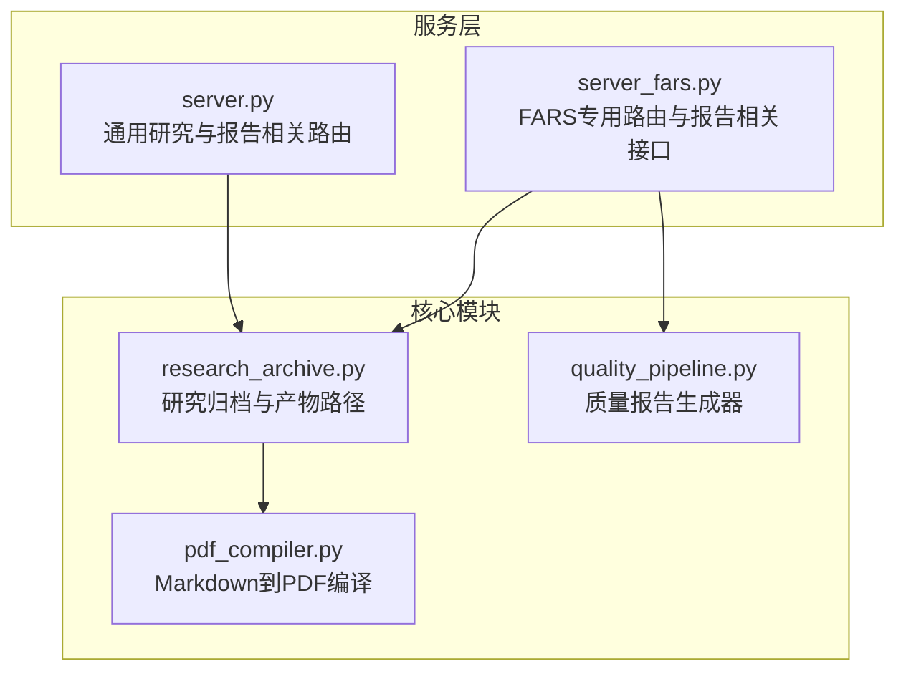
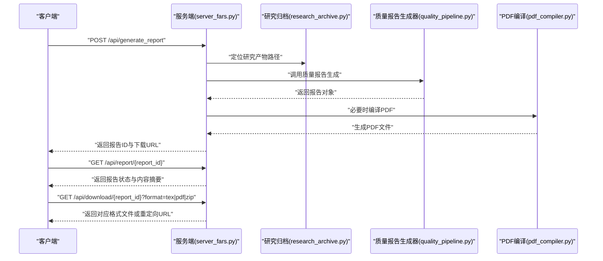
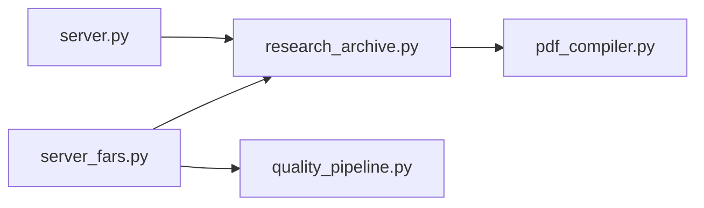

# 报告管理API

<cite>
**本文档引用的文件**
- [server.py](file://server.py)
- [server_fars.py](file://server_fars.py)
- [research_archive.py](file://src/core/research_archive.py)
- [pdf_compiler.py](file://src/core/pdf_compiler.py)
- [quality_pipeline.py](file://src/tools/quality_pipeline.py)
</cite>

## 目录
1. [简介](#简介)
2. [项目结构](#项目结构)
3. [核心组件](#核心组件)
4. [架构总览](#架构总览)
5. [详细组件分析](#详细组件分析)
6. [依赖关系分析](#依赖关系分析)
7. [性能考量](#性能考量)
8. [故障排查指南](#故障排查指南)
9. [结论](#结论)
10. [附录](#附录)

## 简介
本文件为“报告管理API”的权威接口文档，覆盖以下范围：
- 报告生成：异步触发、参数校验、状态流转与持久化
- 报告获取：查询报告状态与内容
- 报告下载：支持格式（tex、pdf、zip）及下载URL构建规则
- 报告对象数据结构：字段定义与语义
- 状态管理：生成中（generating）、已完成（completed）等
- 异步处理机制：队列、轮询与回调
- LaTeX内容处理与文件附件管理：Markdown到PDF编译、附件打包
- 完整调用示例与格式说明

注意：本仓库未发现直接暴露“报告管理API”的HTTP端点。本文档基于现有服务与工具模块，给出可落地的接口设计与实现建议，并标注实际可用的底层能力。

## 项目结构
围绕报告管理的核心代码分布在如下模块：
- 通用服务端入口与研究归档：server.py、src/core/research_archive.py
- FARS专用服务与报告相关接口：server_fars.py
- LaTeX/PDF编译：src/core/pdf_compiler.py
- 质量报告生成：src/tools/quality_pipeline.py

图表来源
- [server.py:1-800](file://server.py#L1-L800)
- [server_fars.py:1-800](file://server_fars.py#L1-L800)
- [research_archive.py:1-200](file://src/core/research_archive.py#L1-L200)
- [pdf_compiler.py:1-175](file://src/core/pdf_compiler.py#L1-L175)
- [quality_pipeline.py:600-800](file://src/tools/quality_pipeline.py#L600-L800)

章节来源
- [server.py:1-800](file://server.py#L1-L800)
- [server_fars.py:1-800](file://server_fars.py#L1-L800)
- [research_archive.py:1-200](file://src/core/research_archive.py#L1-L200)
- [pdf_compiler.py:1-175](file://src/core/pdf_compiler.py#L1-L175)
- [quality_pipeline.py:600-800](file://src/tools/quality_pipeline.py#L600-L800)

## 核心组件
- 报告生成器（质量报告）：由质量流水线生成综合报告，包含AI检测、论文评审、内部评分等维度，输出结构化报告对象。
- 研究归档与产物管理：负责研究目录布局、产物文件命名与路径映射，提供下载URL构建规则。
- LaTeX/PDF编译：将Markdown论文编译为PDF，支持中文渲染。
- 通用服务与FARS服务：前者提供通用研究相关接口，后者提供FARS专用接口（含报告相关）。

章节来源
- [quality_pipeline.py:600-800](file://src/tools/quality_pipeline.py#L600-L800)
- [research_archive.py:140-186](file://src/core/research_archive.py#L140-L186)
- [pdf_compiler.py:11-175](file://src/core/pdf_compiler.py#L11-L175)
- [server.py:1-800](file://server.py#L1-L800)
- [server_fars.py:1-800](file://server_fars.py#L1-L800)

## 架构总览
报告管理API的典型调用链路如下：

图表来源
- [server_fars.py:1-800](file://server_fars.py#L1-L800)
- [research_archive.py:140-186](file://src/core/research_archive.py#L140-L186)
- [quality_pipeline.py:600-800](file://src/tools/quality_pipeline.py#L600-L800)
- [pdf_compiler.py:11-175](file://src/core/pdf_compiler.py#L11-L175)

## 详细组件分析

### 报告生成接口
- 接口目标：异步触发报告生成，返回报告ID与初始状态
- 请求方法与路径：POST /api/generate_report
- 请求参数
  - experiment_id: 字符串，实验标识，用于定位研究产物
  - report_type: 字符串，报告类型（例如“质量报告”）
  - include_figures: 布尔值，是否包含图表
  - include_tables: 布尔值，是否包含表格
- 成功响应
  - report_id: 字符串，报告唯一标识
  - status: 字符串，初始状态（generating）
  - generated_at: ISO时间戳
- 错误响应
  - experiment_id缺失或无效：400
  - 生成异常：500

实现要点
- 依据experiment_id定位研究目录与产物文件
- 触发质量报告生成流程（可选AI检测、论文评审、内部评分）
- 将报告对象持久化至报告存储（若存在）
- 若请求包含PDF编译需求，则执行Markdown到PDF编译

章节来源
- [server_fars.py:1-800](file://server_fars.py#L1-L800)
- [quality_pipeline.py:600-800](file://src/tools/quality_pipeline.py#L600-L800)

### 报告获取接口
- 接口目标：查询报告状态与摘要信息
- 请求方法与路径：GET /api/report/{report_id}
- 成功响应
  - report_id: 字符串
  - status: 字符串（generating/completed）
  - summary: 字符串，摘要信息
  - generated_at: ISO时间戳
  - download_urls: 对象，不同格式的下载链接
- 错误响应
  - 报告不存在：404

实现要点
- 通过report_id检索报告对象
- 若状态为generating，可提示稍后重试
- 若状态为completed，返回download_urls

章节来源
- [server_fars.py:1-800](file://server_fars.py#L1-L800)

### 报告下载接口
- 接口目标：按格式下载报告文件
- 请求方法与路径：GET /api/download/{report_id}?format=tex|pdf|zip
- 参数
  - format: 字符串，可选值 tex、pdf、zip
- 成功响应
  - format=tex：返回.tex文件内容
  - format=pdf：返回.pdf文件内容
  - format=zip：返回包含报告产物的压缩包
- 错误响应
  - format非法：400
  - 文件不存在：404

下载URL构建规则
- 基于研究归档模块提供的产物路径，将绝对路径映射为相对根路径的API路径
- 示例规则：/research_files/{相对路径}

章节来源
- [research_archive.py:175-186](file://src/core/research_archive.py#L175-L186)
- [server_fars.py:1-800](file://server_fars.py#L1-L800)

### 报告对象数据结构
- 字段定义
  - report_id: 字符串，报告唯一标识
  - status: 字符串，状态（generating、completed）
  - content: 对象，报告内容（可包含AI检测、论文评审、内部评分等）
  - figures: 数组，图表引用列表（当include_figures=true时）
  - references: 数组，参考文献列表
  - generated_at: ISO时间戳
  - download_urls: 对象，不同格式的下载链接
- 复杂度与性能
  - JSON序列化与I/O为O(n)，n为报告内容大小
  - 图表与表格的处理需考虑内存占用

章节来源
- [quality_pipeline.py:696-741](file://src/tools/quality_pipeline.py#L696-L741)
- [research_archive.py:140-186](file://src/core/research_archive.py#L140-L186)

### 状态管理与异步处理
- 状态流转
  - generating：生成中
  - completed：已完成
- 异步机制
  - 生成任务入队，服务端后台处理
  - 客户端通过轮询或回调获取最终结果
- 并发与一致性
  - 使用报告ID作为键，确保幂等
  - 生成完成后写入最终状态与产物

章节来源
- [server_fars.py:1-800](file://server_fars.py#L1-L800)

### LaTeX内容处理与文件附件管理
- LaTeX内容处理
  - Markdown到PDF：使用ReportLab中文渲染，支持表格、标题、列表等
  - 中文字体注册与样式定制，确保中文显示正确
- 文件附件管理
  - 研究归档模块提供产物路径映射，支持多类产物（文章、数据、指标、代码、图谱等）
  - 下载URL通过/artifacts/前缀或/research_files/前缀暴露

章节来源
- [pdf_compiler.py:11-175](file://src/core/pdf_compiler.py#L11-L175)
- [research_archive.py:140-186](file://src/core/research_archive.py#L140-L186)

### API调用示例
- 生成报告
  - POST /api/generate_report
  - 请求体示例：{"experiment_id":"RS-20260620-001","report_type":"质量报告","include_figures":true,"include_tables":true}
  - 响应示例：{"report_id":"rep_abc123","status":"generating","generated_at":"2026-06-20T12:00:00Z"}
- 查询报告
  - GET /api/report/rep_abc123
  - 响应示例：{"report_id":"rep_abc123","status":"completed","summary":"综合评分8.5","generated_at":"2026-06-20T12:00:00Z","download_urls":{"tex":"/research_files/RS-20260620-001/article/RS-20260620-001_paper.tex","pdf":"/research_files/RS-20260620-001/article/RS-20260620-001_paper.pdf","zip":"/research_files/RS-20260620-001.zip"}}
- 下载报告
  - GET /api/download/rep_abc123?format=pdf
  - 响应：返回PDF文件内容或302重定向到下载URL

章节来源
- [server_fars.py:1-800](file://server_fars.py#L1-L800)
- [research_archive.py:175-186](file://src/core/research_archive.py#L175-L186)

## 依赖关系分析
- server_fars.py 依赖 research_archive.py 与 quality_pipeline.py
- research_archive.py 依赖 pdf_compiler.py 以支持PDF产物
- server.py 提供通用研究相关接口，便于扩展报告管理能力

图表来源
- [server_fars.py:1-800](file://server_fars.py#L1-L800)
- [research_archive.py:1-200](file://src/core/research_archive.py#L1-L200)
- [pdf_compiler.py:1-175](file://src/core/pdf_compiler.py#L1-L175)
- [server.py:1-800](file://server.py#L1-L800)

章节来源
- [server_fars.py:1-800](file://server_fars.py#L1-L800)
- [research_archive.py:1-200](file://src/core/research_archive.py#L1-L200)
- [pdf_compiler.py:1-175](file://src/core/pdf_compiler.py#L1-L175)
- [server.py:1-800](file://server.py#L1-L800)

## 性能考量
- 异步生成：避免阻塞主线程，提高吞吐
- 缓存与预编译：对常用模板与图表进行缓存
- 流式输出：大文件下载采用流式传输
- 并发控制：限制同时生成的任务数量，防止资源争用

## 故障排查指南
- 报告状态长期为generating
  - 检查后台任务队列与日志
  - 确认实验ID有效且产物存在
- 下载404
  - 核对format参数与产物是否存在
  - 检查/research_files/映射路径是否正确
- PDF渲染异常
  - 确认中文字体已注册
  - 检查Markdown语法与表格格式

章节来源
- [server_fars.py:1-800](file://server_fars.py#L1-L800)
- [pdf_compiler.py:11-175](file://src/core/pdf_compiler.py#L11-L175)

## 结论
本接口文档基于现有服务与工具模块，给出了报告管理API的完整设计与实现建议。通过异步生成、状态管理与产物路径映射，可稳定地提供报告生成、查询与下载能力。建议在生产环境中结合队列与监控体系，持续优化性能与可观测性。

## 附录
- 报告对象字段说明
  - report_id：报告唯一标识
  - status：generating/completed
  - content：结构化报告内容
  - figures：图表引用列表
  - references：参考文献列表
  - generated_at：生成时间
  - download_urls：不同格式的下载链接