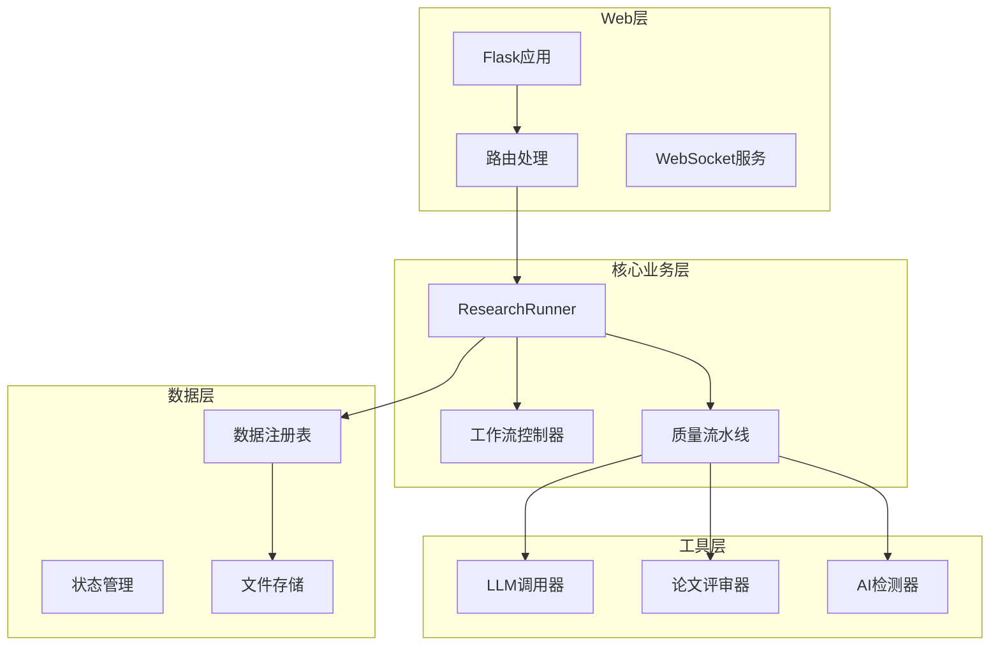
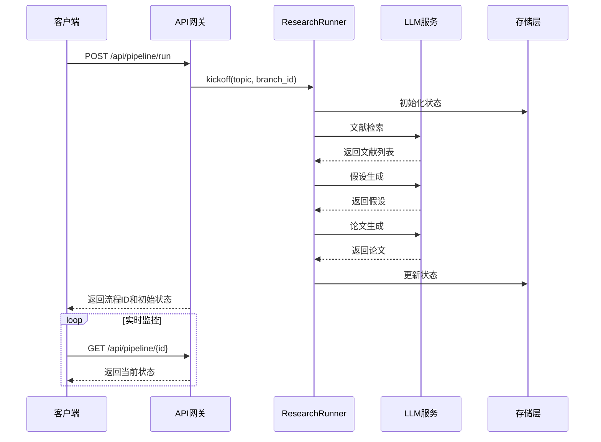
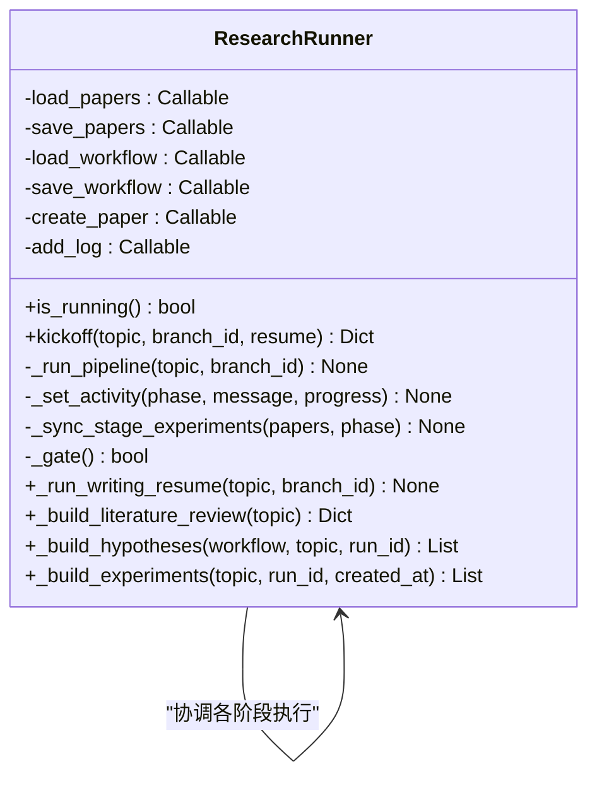
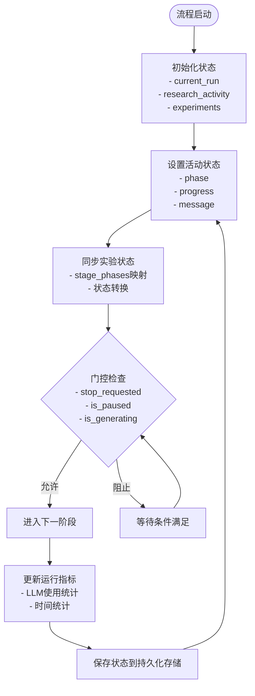
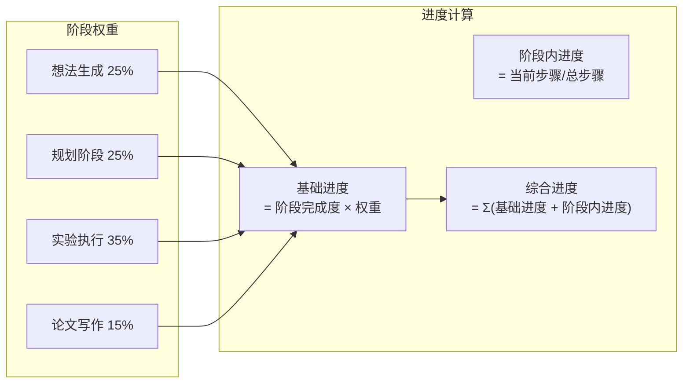
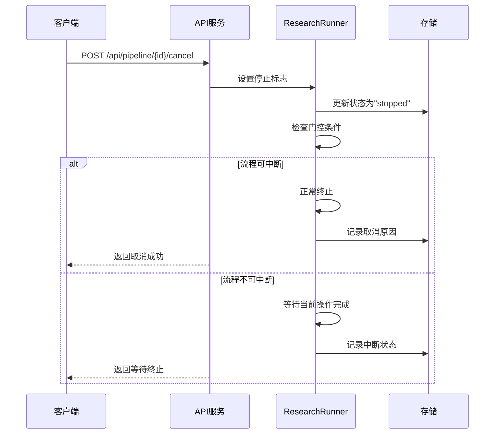
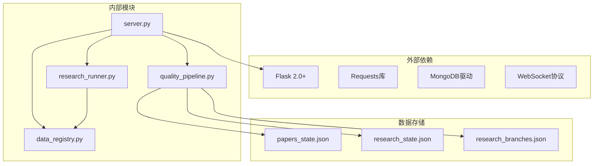
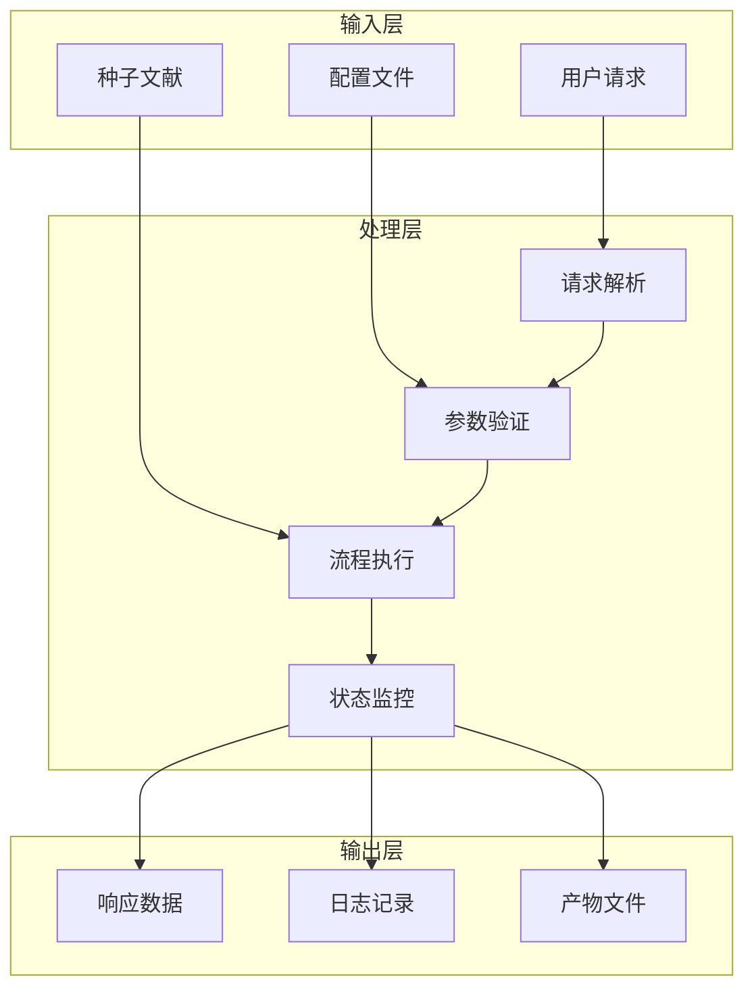

# 流程管理API

<cite>
**本文档引用的文件**
- [server.py](file://server.py)
- [API_SPEC.md](file://docs/API_SPEC.md)
- [research_runner.py](file://src/core/research_runner.py)
- [data_registry.py](file://src/core/data_registry.py)
- [workflow.py](file://src/workflow.py)
- [main.py](file://src/main.py)
</cite>

## 目录
1. [简介](#简介)
2. [项目结构](#项目结构)
3. [核心组件](#核心组件)
4. [架构概览](#架构概览)
5. [详细组件分析](#详细组件分析)
6. [依赖分析](#依赖分析)
7. [性能考虑](#性能考虑)
8. [故障排除指南](#故障排除指南)
9. [结论](#结论)

## 简介
本文档为FARS系统的流程管理API提供完整的技术规范，涵盖完整流程运行、状态查询、流程取消等核心功能。系统采用Flask作为Web框架，支持实时WebSocket通信，提供从文献检索到论文生成的全流程自动化管理。

## 项目结构
FARS系统采用模块化架构设计，主要包含以下核心模块：



**图表来源**
- [server.py:1-100](file://server.py#L1-L100)
- [research_runner.py:1-50](file://src/core/research_runner.py#L1-L50)

**章节来源**
- [server.py:1-100](file://server.py#L1-L100)
- [API_SPEC.md:1-50](file://docs/API_SPEC.md#L1-L50)

## 核心组件

### 流程管理核心接口
系统提供完整的流程生命周期管理能力：

| 接口类型 | HTTP方法 | 路径 | 功能描述 |
|---------|---------|------|----------|
| 运行完整流程 | POST | `/api/pipeline/run` | 启动完整研究流程，包含文献检索、假设生成、实验执行、论文生成 |
| 获取流程状态 | GET | `/api/pipeline/{pipeline_id}` | 查询指定流程的当前状态和进度 |
| 取消流程 | POST | `/api/pipeline/{pipeline_id}/cancel` | 取消正在执行的流程 |

### 请求参数规范
完整流程运行接口的请求体参数：

| 参数名称 | 类型 | 必填 | 默认值 | 描述 |
|---------|------|------|--------|------|
| query | string | 是 | - | 搜索关键词，用于文献检索 |
| max_papers | integer | 否 | 5 | 最大文献数量限制 |
| target_universe | string | 否 | "A-share" | 目标市场范围 |
| generate_paper | boolean | 否 | true | 是否生成论文 |

### 响应结构
流程状态响应包含完整的阶段信息：

```json
{
  "success": true,
  "data": {
    "pipeline_id": "pipe_20260620_001",
    "status": "running",
    "stages": {
      "ideation": {"status": "completed", "progress": 1.0},
      "planning": {"status": "running", "progress": 0.5},
      "experiment": {"status": "pending", "progress": 0},
      "writing": {"status": "pending", "progress": 0}
    }
  }
}
```

**章节来源**
- [API_SPEC.md:336-380](file://docs/API_SPEC.md#L336-L380)

## 架构概览

### 系统架构图


**图表来源**
- [research_runner.py:301-428](file://src/core/research_runner.py#L301-L428)
- [server.py:5280-5338](file://server.py#L5280-L5338)

### 流程阶段映射
系统将完整流程划分为四个核心阶段：

| 阶段标识 | 阶段名称 | 阶段描述 | 预期状态 |
|---------|---------|---------|---------|
| ideation | 想法生成 | 文献综述和假设生成 | completed |
| planning | 规划阶段 | 实验设计和准备工作 | running |
| experiment | 实验执行 | 实际实验和数据分析 | pending |
| writing | 论文写作 | 论文生成和优化 | pending |

**章节来源**
- [research_runner.py:239-276](file://src/core/research_runner.py#L239-L276)

## 详细组件分析

### ResearchRunner核心类
ResearchRunner是流程管理的核心控制器，负责协调整个研究流程的执行：



**图表来源**
- [research_runner.py:278-566](file://src/core/research_runner.py#L278-L566)

### 状态管理系统
系统采用分层状态管理模式，确保流程状态的一致性和可追踪性：



**图表来源**
- [research_runner.py:630-641](file://src/core/research_runner.py#L630-L641)
- [research_runner.py:567-582](file://src/core/research_runner.py#L567-L582)

### 实时通信协议
系统支持WebSocket实时状态推送，提供四种消息类型：

| 消息类型 | 数据结构 | 描述 |
|---------|---------|------|
| stage_update | `{type: "stage_update", stage: string, progress: number, message: string}` | 阶段进度更新 |
| stage_complete | `{type: "stage_complete", stage: string, message: string}` | 阶段完成通知 |
| error | `{type: "error", message: string, code: string}` | 错误状态通知 |
| complete | `{type: "complete", message: string, result: object}` | 流程完成通知 |

**章节来源**
- [API_SPEC.md:410-434](file://docs/API_SPEC.md#L410-L434)

### 进度计算机制
系统采用多维度进度计算模型：



**图表来源**
- [research_runner.py:583-629](file://src/core/research_runner.py#L583-L629)

**章节来源**
- [research_runner.py:719-735](file://src/core/research_runner.py#L719-L735)

### 取消和异常处理
系统提供完善的流程控制和异常处理机制：



**图表来源**
- [research_runner.py:630-641](file://src/core/research_runner.py#L630-L641)

**章节来源**
- [research_runner.py:630-641](file://src/core/research_runner.py#L630-L641)

## 依赖分析

### 核心依赖关系


**图表来源**
- [server.py:22-53](file://server.py#L22-L53)
- [data_registry.py:11-22](file://src/core/data_registry.py#L11-L22)

### 数据流分析
系统采用事件驱动的数据流架构：



**图表来源**
- [server.py:5280-5338](file://server.py#L5280-L5338)
- [data_registry.py:48-97](file://src/core/data_registry.py#L48-L97)

**章节来源**
- [data_registry.py:48-97](file://src/core/data_registry.py#L48-L97)

## 性能考虑
- **并发处理**: 系统支持多线程并发执行，避免阻塞操作
- **缓存机制**: 关键数据采用内存缓存，减少磁盘I/O
- **异步处理**: 长耗时操作采用异步执行，提高响应速度
- **资源管理**: 合理的资源清理和垃圾回收机制

## 故障排除指南

### 常见问题诊断
1. **流程卡死**: 检查LLM服务连接状态和API密钥配置
2. **状态不同步**: 验证数据库连接和文件权限
3. **WebSocket连接失败**: 确认防火墙设置和代理配置
4. **内存泄漏**: 监控进程内存使用情况，定期重启服务

### 错误码对照表
| 错误码 | HTTP状态 | 描述 | 处理建议 |
|-------|---------|------|---------|
| VALIDATION_ERROR | 400 | 参数验证失败 | 检查请求参数格式 |
| UNAUTHORIZED | 401 | 未授权访问 | 验证认证信息 |
| FORBIDDEN | 403 | 权限不足 | 检查用户权限 |
| NOT_FOUND | 404 | 资源不存在 | 确认资源ID正确性 |
| INTERNAL_ERROR | 500 | 服务器内部错误 | 查看服务日志 |
| LLM_ERROR | 500 | LLM调用失败 | 检查LLM服务状态 |

**章节来源**
- [API_SPEC.md:383-407](file://docs/API_SPEC.md#L383-L407)

## 结论
FARS流程管理API提供了完整的自动化研究工作流解决方案，具备良好的扩展性和可靠性。系统采用模块化设计，支持实时状态监控和灵活的流程控制，能够满足复杂研究场景的需求。通过合理的架构设计和完善的错误处理机制，确保了系统的稳定运行和用户体验。