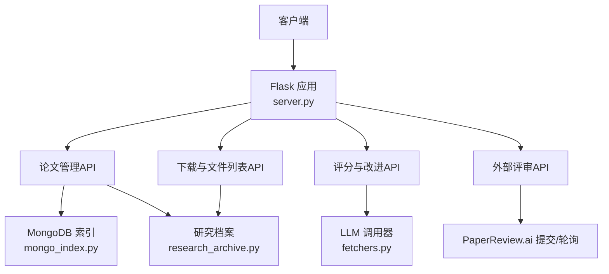
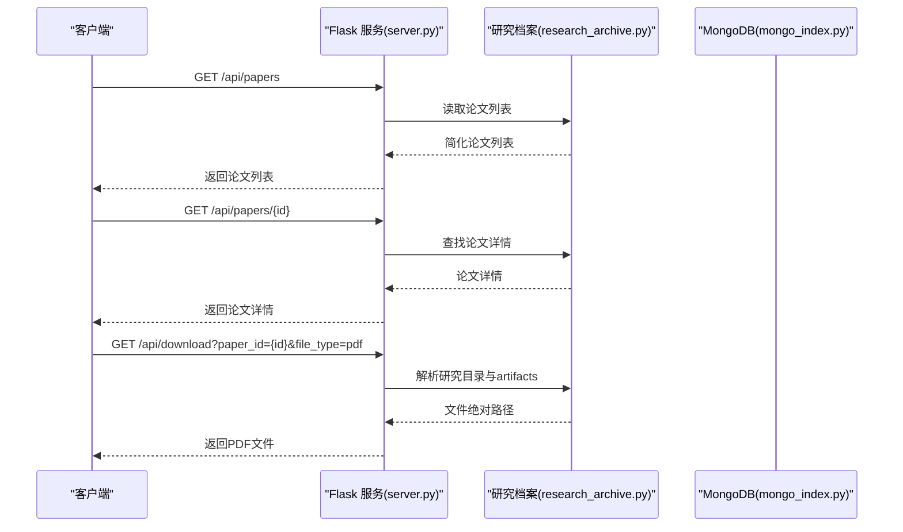
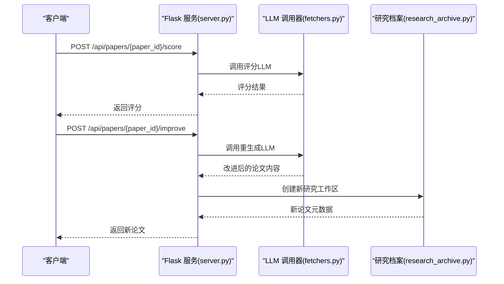
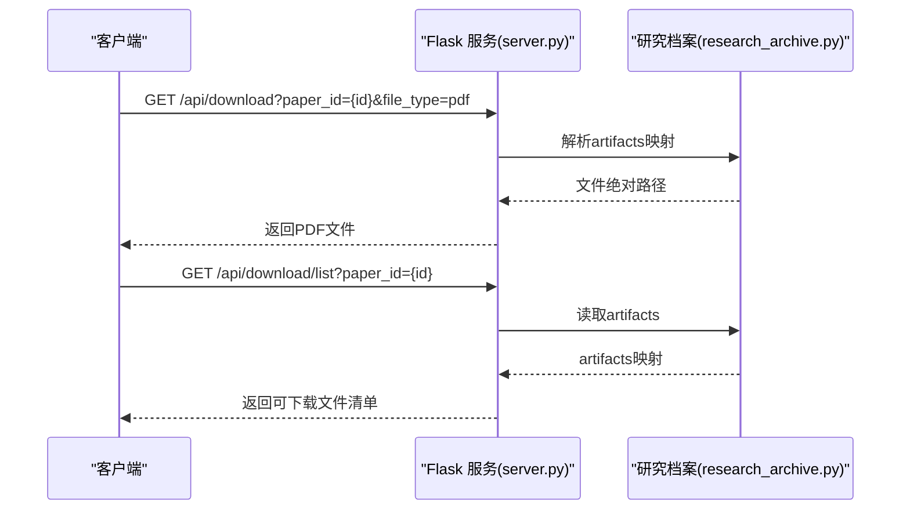
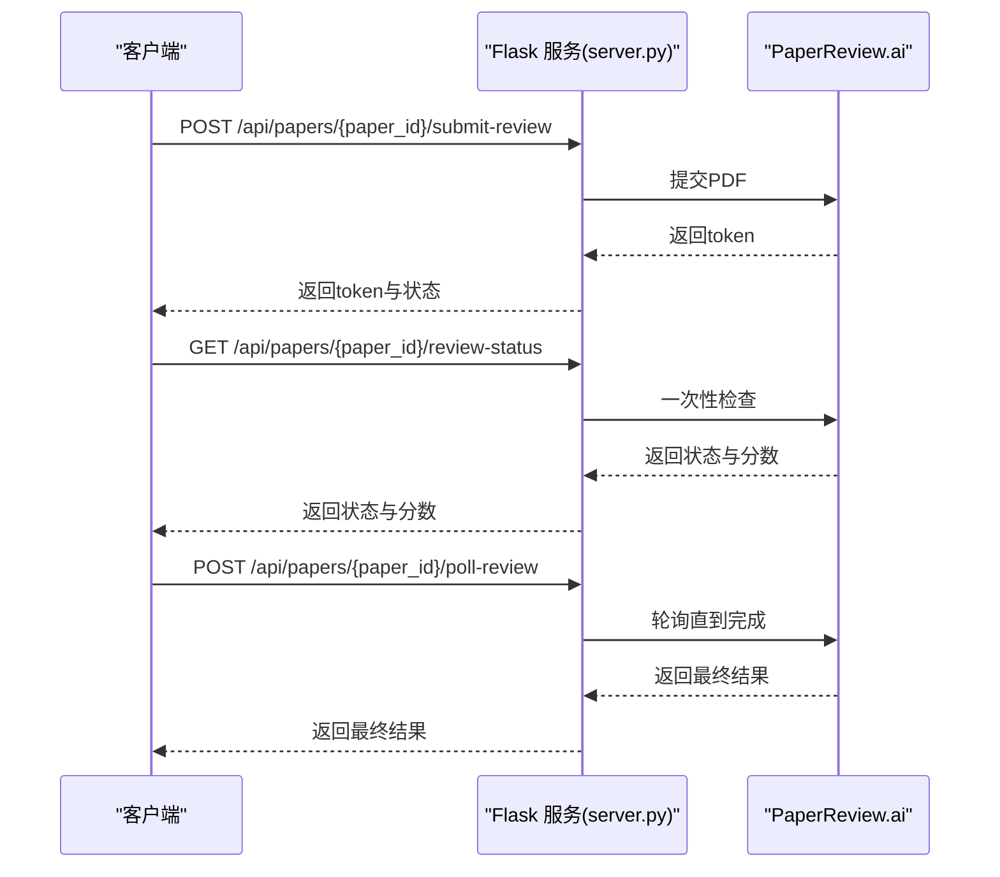
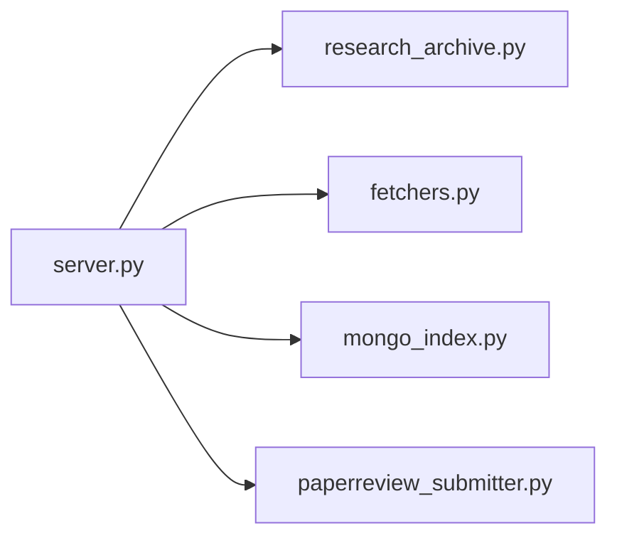

# 论文管理API

<cite>
**本文档引用的文件**
- [server.py](file://server.py)
- [server_fars.py](file://server_fars.py)
- [API_SPEC.md](file://docs/API_SPEC.md)
- [mongo_index.py](file://src/core/mongo_index.py)
- [research_archive.py](file://src/core/research_archive.py)
- [fetchers.py](file://src/tools/fetchers.py)
</cite>

## 目录
1. [简介](#简介)
2. [项目结构](#项目结构)
3. [核心组件](#核心组件)
4. [架构总览](#架构总览)
5. [详细组件分析](#详细组件分析)
6. [依赖关系分析](#依赖关系分析)
7. [性能考虑](#性能考虑)
8. [故障排除指南](#故障排除指南)
9. [结论](#结论)
10. [附录](#附录)

## 简介
本文件为论文管理API的详细接口文档，覆盖论文搜索、详情获取、PDF下载以及论文分析（评分、改进、质量报告、外部评审）等核心功能。文档基于实际代码实现，提供端点规范、参数说明、请求/响应示例、数据模型、错误处理与最佳实践。

## 项目结构
- 后端服务采用Flask框架，主入口位于server.py，提供论文管理、评分、下载、外部评审等API。
- FARS专用API位于server_fars.py，包含评分、重生成、查找相关论文等端点。
- 论文索引与查询通过MongoDB实现，位于src/core/mongo_index.py。
- 研究档案与文件组织位于src/core/research_archive.py。
- 论文抓取与数据源访问位于src/tools/fetchers.py。
- 规范化的API说明位于docs/API_SPEC.md。

图表来源
- [server.py:4304-4338](file://server.py#L4304-L4338)
- [server.py:4515-4681](file://server.py#L4515-L4681)
- [server.py:5417-5454](file://server.py#L5417-L5454)
- [server.py:5473-5686](file://server.py#L5473-L5686)
- [mongo_index.py:83-93](file://src/core/mongo_index.py#L83-L93)
- [research_archive.py:296-335](file://src/core/research_archive.py#L296-L335)
- [fetchers.py:290-449](file://src/tools/fetchers.py#L290-L449)

章节来源
- [server.py:4304-4338](file://server.py#L4304-L4338)
- [server.py:4515-4681](file://server.py#L4515-L4681)
- [server.py:5417-5454](file://server.py#L5417-L5454)
- [server.py:5473-5686](file://server.py#L5473-L5686)
- [mongo_index.py:83-93](file://src/core/mongo_index.py#L83-L93)
- [research_archive.py:296-335](file://src/core/research_archive.py#L296-L335)
- [fetchers.py:290-449](file://src/tools/fetchers.py#L290-L449)

## 核心组件
- 论文列表与详情：提供论文列表查询与单篇详情获取。
- 论文评分与改进：支持内部评分、基于评分的论文改进与新版本生成。
- PDF下载与文件列表：支持按论文ID与文件类型下载，或获取可下载文件清单。
- 质量报告：生成论文质量报告（包含AI检测、可复现性、原创性等维度）。
- 外部评审：提交论文到PaperReview.ai进行外部评分，并支持轮询与状态查询。

章节来源
- [server.py:4304-4338](file://server.py#L4304-L4338)
- [server.py:4341-4349](file://server.py#L4341-L4349)
- [server.py:4352-4383](file://server.py#L4352-L4383)
- [server.py:4386-4461](file://server.py#L4386-L4461)
- [server.py:4515-4681](file://server.py#L4515-L4681)
- [server.py:5417-5454](file://server.py#L5417-L5454)
- [server.py:5473-5686](file://server.py#L5473-L5686)

## 架构总览
论文管理API围绕“论文数据+研究档案+外部服务”三层设计：
- 数据层：论文列表与元数据存储于内存状态（JSON），并通过研究档案目录结构持久化。
- 索引层：MongoDB用于论文索引与查询，便于快速检索与统计。
- 服务层：LLM评分与改进、PDF生成与下载、PaperReview.ai外部评审集成。

图表来源
- [server.py:4304-4338](file://server.py#L4304-L4338)
- [server.py:4341-4349](file://server.py#L4341-L4349)
- [server.py:4515-4605](file://server.py#L4515-L4605)
- [research_archive.py:296-335](file://src/core/research_archive.py#L296-L335)
- [mongo_index.py:83-93](file://src/core/mongo_index.py#L83-L93)

## 详细组件分析

### 论文搜索与详情
- 端点
  - GET /api/papers
  - GET /api/papers/{paper_id}
- 查询参数
  - GET /api/papers
    - branch_id: int（可选，按分支过滤）
- 响应字段（简化列表）
  - success: bool
  - papers: array
    - id: int
    - research_id: string
    - branch_id: int
    - topic: string
    - title: string
    - status: string
    - quality_score: number|null
    - iteration_count: int
    - created_at: string
    - parent_paper_id: int|null
    - artifacts: object
    - content_preview: string
- 响应字段（详情）
  - success: bool
  - paper: object（包含完整论文信息）

章节来源
- [server.py:4304-4338](file://server.py#L4304-L4338)
- [server.py:4341-4349](file://server.py#L4341-L4349)

### 论文评分与改进
- 端点
  - POST /api/papers/{paper_id}/score
  - POST /api/papers/{paper_id}/improve
- 请求体（评分）
  - 无请求体
- 请求体（改进）
  - 无请求体（基于上次评分结果）
- 响应（评分）
  - paper_id: int
  - score: object（包含总分、各维度分数与反馈）
- 响应（改进）
  - success: bool
  - original_paper_id: int
  - new_paper: object（新生成论文）
  - message: string

图表来源
- [server.py:4352-4383](file://server.py#L4352-L4383)
- [server.py:4386-4461](file://server.py#L4386-L4461)
- [fetchers.py:290-449](file://src/tools/fetchers.py#L290-L449)
- [research_archive.py:296-335](file://src/core/research_archive.py#L296-L335)

章节来源
- [server.py:4352-4383](file://server.py#L4352-L4383)
- [server.py:4386-4461](file://server.py#L4386-L4461)
- [fetchers.py:290-449](file://src/tools/fetchers.py#L290-L449)
- [research_archive.py:296-335](file://src/core/research_archive.py#L296-L335)

### PDF下载与文件列表
- 端点
  - GET /api/download
  - GET /api/download/list
- 查询参数（下载）
  - paper_id: int（必填）
  - file_type: string（必填，支持 markdown、latex、pdf、experiment_data、indicator_sample、backtest_results、code）
- 查询参数（文件列表）
  - paper_id: int（必填）
- 响应（下载）
  - 直接返回对应文件（强制下载）
- 响应（文件列表）
  - paper_id: int
  - title: string
  - research_id: string
  - files: array（包含label、download_name、url、exists）

图表来源
- [server.py:4515-4605](file://server.py#L4515-L4605)
- [server.py:4608-4681](file://server.py#L4608-L4681)
- [research_archive.py:150-185](file://src/core/research_archive.py#L150-L185)

章节来源
- [server.py:4515-4605](file://server.py#L4515-L4605)
- [server.py:4608-4681](file://server.py#L4608-L4681)
- [research_archive.py:150-185](file://src/core/research_archive.py#L150-L185)

### 论文质量报告
- 端点
  - GET /api/papers/{paper_id}/quality-report
- 请求参数
  - 无
- 响应字段
  - success: bool
  - paper_id: int
  - title: string
  - report: object（包含综合评分、可复现性、原创性、实用性等维度与建议）
  - ai_detection_only: bool（是否仅启用AI检测）

章节来源
- [server.py:5417-5454](file://server.py#L5417-L5454)

### 外部评审（PaperReview.ai）
- 端点
  - POST /api/papers/{paper_id}/submit-review
  - GET /api/papers/{paper_id}/review-status
  - POST /api/papers/{paper_id}/poll-review
- 请求体（提交评审）
  - email: string（必填）
  - venue: string（可选，默认ICLR）
  - pdf_path: string（可选，若不提供则尝试使用已保存PDF）
- 请求体（轮询）
  - interval_minutes: number（可选，默认1）
  - max_hours: number（可选，默认24）
- 响应（提交评审）
  - success: bool
  - paper_id: int
  - token: string
  - venue: string
  - message: string
- 响应（状态查询/轮询）
  - paper_id: int
  - status: string（pending|ready|error）
  - overall_score: number|null
  - passed: bool|null
  - sections: object|null
  - error: string|null
  - message: string

图表来源
- [server.py:5473-5568](file://server.py#L5473-L5568)
- [server.py:5571-5621](file://server.py#L5571-L5621)
- [server.py:5624-5686](file://server.py#L5624-L5686)

章节来源
- [server.py:5473-5568](file://server.py#L5473-L5568)
- [server.py:5571-5621](file://server.py#L5571-L5621)
- [server.py:5624-5686](file://server.py#L5624-L5686)

### FARS专用端点（兼容性）
- 端点
  - POST /api/score
  - POST /api/regenerate
  - POST /api/find_papers
  - POST /api/iterate
  - GET /api/history
  - GET /api/history/{record_id}
- 请求体与响应与主API类似，但针对FARS流程进行了封装，适合批量迭代与历史记录管理。

章节来源
- [server_fars.py:440-486](file://server_fars.py#L440-L486)
- [server_fars.py:488-508](file://server_fars.py#L488-L508)
- [server_fars.py:511-593](file://server_fars.py#L511-L593)
- [server_fars.py:596-622](file://server_fars.py#L596-L622)

## 依赖关系分析
- 论文列表与详情依赖研究档案（artifacts解析）与内存状态（papers数组）。
- 下载接口依赖研究档案的artifacts映射与文件系统路径。
- 评分与改进依赖LLM调用器（支持多Provider自动切换）。
- 质量报告依赖质量流水线（QualityPipeline）与外部AI检测。
- 外部评审依赖PaperReview.ai服务与轮询机制。

图表来源
- [server.py:4304-4338](file://server.py#L4304-L4338)
- [server.py:4515-4605](file://server.py#L4515-L4605)
- [server.py:5417-5454](file://server.py#L5417-L5454)
- [server.py:5473-5686](file://server.py#L5473-L5686)
- [research_archive.py:150-185](file://src/core/research_archive.py#L150-L185)
- [fetchers.py:290-449](file://src/tools/fetchers.py#L290-L449)
- [mongo_index.py:83-93](file://src/core/mongo_index.py#L83-L93)

章节来源
- [server.py:4304-4338](file://server.py#L4304-L4338)
- [server.py:4515-4605](file://server.py#L4515-L4605)
- [server.py:5417-5454](file://server.py#L5417-L5454)
- [server.py:5473-5686](file://server.py#L5473-L5686)
- [research_archive.py:150-185](file://src/core/research_archive.py#L150-L185)
- [fetchers.py:290-449](file://src/tools/fetchers.py#L290-L449)
- [mongo_index.py:83-93](file://src/core/mongo_index.py#L83-L93)

## 性能考虑
- 列表接口默认不返回完整content，以减少带宽占用。
- 下载接口直接返回文件，避免额外序列化开销。
- LLM调用支持主备Provider自动切换，提高可用性。
- MongoDB索引用于论文检索与统计，建议合理设置索引字段。

## 故障排除指南
- 常见错误
  - 论文不存在：返回404，提示论文不存在。
  - 缺少参数：返回400，提示缺少必要参数。
  - 文件不存在：返回404，提示文件不存在。
  - LLM调用失败：返回500，提示LLM错误。
- 建议
  - 在调用评分/改进前确保论文内容存在。
  - 下载前确认file_type合法且artifacts中存在对应文件。
  - 外部评审需提供有效的email与PDF路径。

章节来源
- [server.py:4341-4349](file://server.py#L4341-L4349)
- [server.py:4533-4544](file://server.py#L4533-L4544)
- [server.py:5473-5568](file://server.py#L5473-L5568)
- [server.py:5624-5686](file://server.py#L5624-L5686)

## 结论
论文管理API提供了从论文检索、详情查看、PDF下载到评分、改进与外部评审的完整闭环。通过研究档案与MongoDB的结合，系统实现了高效的数据组织与查询；通过多Provider LLM与外部评审服务，满足了高质量论文产出的需求。建议在生产环境中配合缓存、限流与监控，进一步提升稳定性与性能。

## 附录

### 端点一览与规范
- 论文列表
  - 方法: GET
  - 路径: /api/papers
  - 查询参数: branch_id(int, 可选)
- 论文详情
  - 方法: GET
  - 路径: /api/papers/{paper_id}
- 论文评分
  - 方法: POST
  - 路径: /api/papers/{paper_id}/score
- 论文改进
  - 方法: POST
  - 路径: /api/papers/{paper_id}/improve
- PDF下载
  - 方法: GET
  - 路径: /api/download
  - 查询参数: paper_id(int, 必填), file_type(string, 必填)
- 下载文件列表
  - 方法: GET
  - 路径: /api/download/list
  - 查询参数: paper_id(int, 必填)
- 质量报告
  - 方法: GET
  - 路径: /api/papers/{paper_id}/quality-report
- 外部评审提交
  - 方法: POST
  - 路径: /api/papers/{paper_id}/submit-review
  - 请求体: email(string, 必填), venue(string, 可选), pdf_path(string, 可选)
- 外部评审状态
  - 方法: GET
  - 路径: /api/papers/{paper_id}/review-status
- 外部评审轮询
  - 方法: POST
  - 路径: /api/papers/{paper_id}/poll-review
  - 请求体: interval_minutes(number, 可选), max_hours(number, 可选)

章节来源
- [server.py:4304-4338](file://server.py#L4304-L4338)
- [server.py:4341-4349](file://server.py#L4341-L4349)
- [server.py:4352-4383](file://server.py#L4352-L4383)
- [server.py:4386-4461](file://server.py#L4386-L4461)
- [server.py:4515-4605](file://server.py#L4515-L4605)
- [server.py:4608-4681](file://server.py#L4608-L4681)
- [server.py:5417-5454](file://server.py#L5417-L5454)
- [server.py:5473-5568](file://server.py#L5473-L5568)
- [server.py:5571-5621](file://server.py#L5571-L5621)
- [server.py:5624-5686](file://server.py#L5624-L5686)

### 数据模型与字段定义
- 论文对象（列表简版）
  - id: int
  - research_id: string
  - branch_id: int
  - topic: string
  - title: string
  - status: string
  - quality_score: number|null
  - iteration_count: int
  - created_at: string
  - parent_paper_id: int|null
  - artifacts: object
  - content_preview: string
- 论文对象（详情）
  - 包含完整论文信息（content、artifacts等）
- 评分结果
  - total_score: number
  - pass: bool
  - criteria: object（包含各维度分数与评论）
  - feedback: string
- 质量报告
  - overall_score: number
  - merit_score: number
  - clarity_score: number
  - reproducibility_score: number
  - originality_score: number
  - utility_score: number
  - strengths: string
  - weaknesses: string
  - detailed_feedback: string
  - recommended_venue: string
  - reviewer_model: string

章节来源
- [server.py:4304-4338](file://server.py#L4304-L4338)
- [server.py:4352-4383](file://server.py#L4352-L4383)
- [server.py:5417-5454](file://server.py#L5417-L5454)

### 错误响应格式
- 格式
  - success: bool（false）
  - error: object
    - code: string
    - message: string
    - details: object（可选）

章节来源
- [server.py:4341-4349](file://server.py#L4341-L4349)
- [server.py:4533-4544](file://server.py#L4533-L4544)
- [server.py:5473-5568](file://server.py#L5473-L5568)
- [server.py:5624-5686](file://server.py#L5624-L5686)