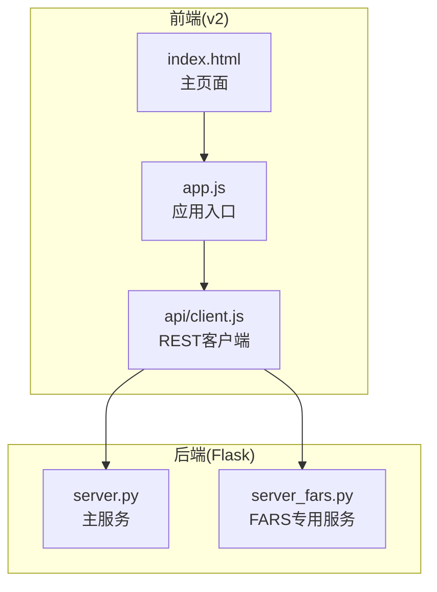
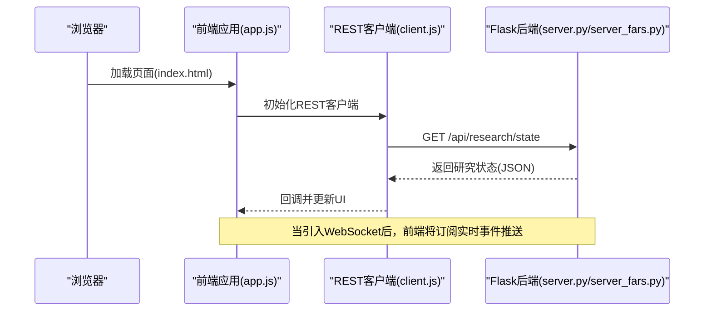
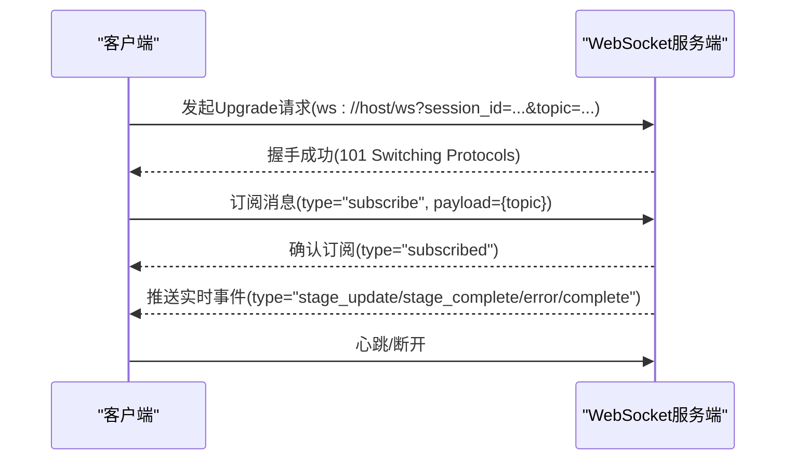
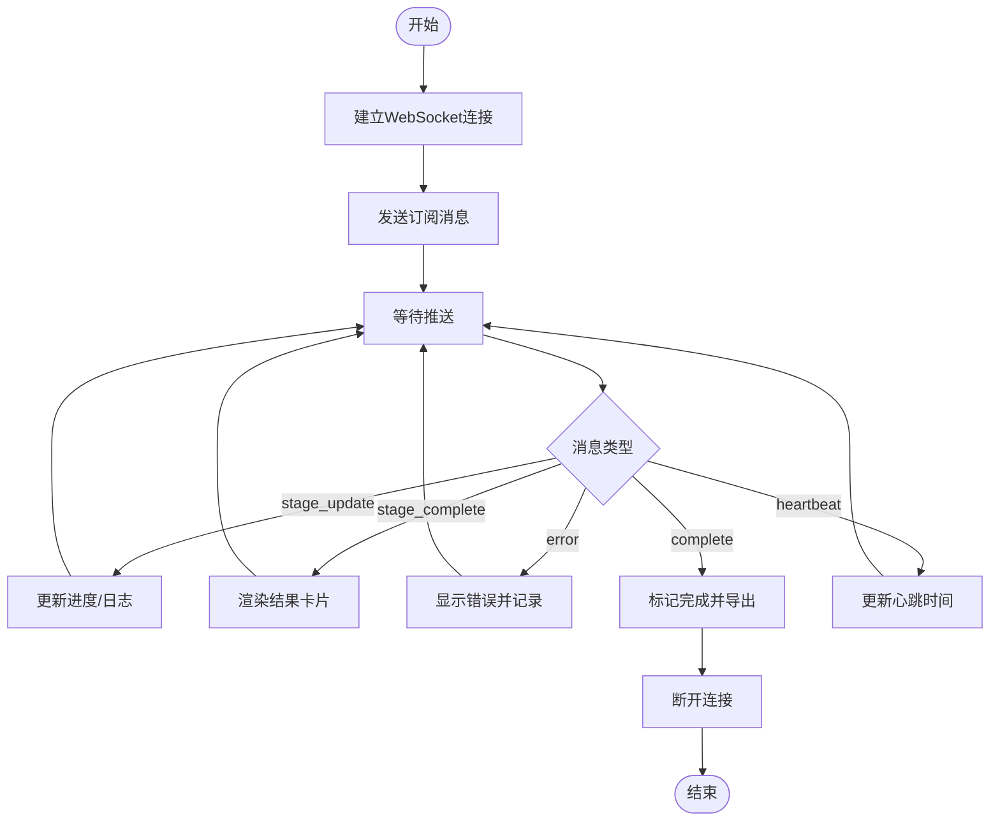
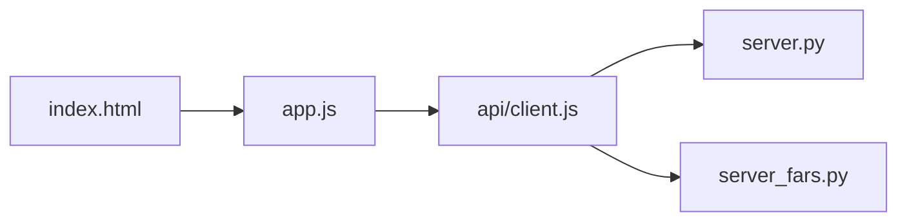

# WebSocket实时通信

<cite>
**本文档引用的文件**
- [server.py](file://server.py)
- [server_fars.py](file://server_fars.py)
- [docs/v2/index.html](file://docs/v2/index.html)
- [docs/v2/app.js](file://docs/v2/app.js)
- [docs/v2/api/client.js](file://docs/v2/api/client.js)
</cite>

## 目录
1. [简介](#简介)
2. [项目结构](#项目结构)
3. [核心组件](#核心组件)
4. [架构总览](#架构总览)
5. [详细组件分析](#详细组件分析)
6. [依赖分析](#依赖分析)
7. [性能考虑](#性能考虑)
8. [故障排查指南](#故障排查指南)
9. [结论](#结论)
10. [附录](#附录)

## 简介
本文件面向paperwriterAI系统的WebSocket实时通信能力，目标是为开发者与集成方提供一套完整、可操作的实时通信规范与最佳实践。基于现有代码库分析，当前仓库并未直接实现WebSocket服务端或客户端代码。因此，本文档将以“概念性设计”方式，给出符合系统现状与未来演进方向的WebSocket通信规范，并结合现有REST API与前端架构，提供可落地的接入建议与迁移路径。

## 项目结构
- 后端采用Flask框架，提供REST API与静态资源服务，核心业务逻辑集中在Python模块中。
- 前端v2采用模块化架构，通过独立的API客户端封装HTTP请求，配合轮询策略实现状态同步。
- 本仓库未发现WebSocket服务端或客户端实现，WebSocket通信规范为概念性设计，便于后续扩展。

**图表来源**
- [docs/v2/index.html](file://docs/v2/index.html)
- [docs/v2/app.js](file://docs/v2/app.js)
- [docs/v2/api/client.js](file://docs/v2/api/client.js)
- [server.py](file://server.py)
- [server_fars.py](file://server_fars.py)

**章节来源**
- [docs/v2/index.html](file://docs/v2/index.html)
- [docs/v2/app.js](file://docs/v2/app.js)
- [docs/v2/api/client.js](file://docs/v2/api/client.js)
- [server.py](file://server.py)
- [server_fars.py](file://server_fars.py)

## 核心组件
- 前端REST客户端：封装统一的HTTP请求、错误处理与轮询策略，用于与后端交互。
- 后端Flask服务：提供REST API端点，承载业务状态与数据。
- 状态同步策略：当前通过轮询实现，未来可替换为WebSocket推送。

说明：本节为概念性描述，用于指导WebSocket接入设计，非现有实现。

## 架构总览
下图展示从浏览器到后端的典型交互路径，以及WebSocket接入后的消息流变化。

**图表来源**
- [docs/v2/index.html](file://docs/v2/index.html)
- [docs/v2/app.js](file://docs/v2/app.js)
- [docs/v2/api/client.js](file://docs/v2/api/client.js)
- [server.py](file://server.py)
- [server_fars.py](file://server_fars.py)

## 详细组件分析

### WebSocket连接建立流程（概念性设计）
- URL模式与连接参数
  - 建议使用相对路径升级协议，例如/ws，结合当前站点根路径拼接为ws(s)://{host}:{port}/ws。
  - 连接参数建议通过查询参数传递会话标识、用户令牌、订阅主题等，例如/ws?session_id={id}&topic={research_id}。
- 升级握手
  - 客户端发起Upgrade请求，服务端校验Origin、鉴权与订阅权限。
  - 成功后建立持久连接，保持心跳与断线重连。
- 订阅管理
  - 客户端在连接建立后发送订阅消息，声明感兴趣的主题（如研究ID、阶段、任务等）。
  - 服务端维护订阅表，按主题向客户端推送增量事件。

### 消息格式规范（概念性设计）
- 通用字段
  - type: 字符串，定义消息类型（见下一节枚举）。
  - payload: 对象，承载具体数据。
  - ts: 时间戳（可选），用于排序与调试。
  - session_id: 会话标识（可选），用于多路复用与审计。
- payload结构与数据类型
  - stage_update: 阶段进度更新
    - payload.phase: 字符串，阶段名称（如"literature_review"、"writing"等）
    - payload.step: 字符串，步骤标识
    - payload.progress: 数值，百分比
    - payload.attempt: 数值，尝试次数
    - payload.elapsed_s: 数值，累计耗时(秒)
    - payload.status: 字符串，状态描述
  - stage_complete: 阶段完成
    - payload.phase: 字符串，完成阶段
    - payload.result: 对象，阶段产出摘要
  - error: 错误通知
    - payload.code: 字符串或数值，错误码
    - payload.message: 字符串，错误信息
    - payload.details: 对象，附加上下文
  - complete: 流程完成
    - payload.run_id: 字符串，运行ID
    - payload.final_status: 字符串，最终状态
    - payload.metrics: 对象，运行指标
  - subscribe: 订阅请求
    - payload.topic: 字符串，订阅主题（如"research:{id}"、"phase:{phase}"）
  - subscribed: 订阅确认
    - payload.topic: 字符串，确认的主题
  - heartbeat: 心跳
    - payload.ts: 数值，心跳时间戳

### 消息类型与语义
- stage_update：实时推送阶段进度与状态，用于前端动态更新进度条、日志面板等。
- stage_complete：阶段结束事件，携带产出摘要，便于前端渲染结果卡片。
- error：异常事件，包含错误码与上下文，便于前端弹窗提示与日志记录。
- complete：流程结束事件，汇总最终状态与指标，触发完成态UI与导出按钮。
- subscribe/subscribed：订阅控制消息，用于建立/确认订阅关系。
- heartbeat：心跳消息，用于保活与健康检测。

### 客户端接入与示例（概念性）
- 连接建立
  - 使用浏览器原生WebSocket API或兼容库，构造URL并发起连接。
  - 建议在连接失败时实现指数退避重试与最大重试次数限制。
- 订阅与断开
  - 连接建立后发送订阅消息，声明感兴趣的主题。
  - 页面卸载或不再需要时，发送断开消息并清理定时器与事件监听。
- 处理与渲染
  - 根据type分发到对应处理器，更新store或DOM。
  - 对于批量事件，建议合并渲染以减少重排。

### 连接管理策略与重连机制（概念性）
- 心跳与保活
  - 服务端周期性发送心跳，客户端收到后回传心跳确认。
  - 若超过阈值未收到心跳，视为连接异常并触发重连。
- 重连策略
  - 指数退避：首次1s，随后翻倍，上限至30s。
  - 最大重试次数：如5次，超过则提示用户手动重试。
  - 断线期间的离线事件：建议客户端缓存少量事件并在恢复后补推。
- 订阅一致性
  - 重连后自动恢复订阅，避免重复推送。
  - 服务端维护订阅表，支持广播与点播混合模式。

### 错误处理方案（概念性）
- 服务端
  - 对非法订阅、鉴权失败、消息格式错误返回错误通知。
  - 记录连接生命周期事件，便于运维排查。
- 客户端
  - 捕获连接异常、消息解码失败、超时等场景。
  - 统一错误上报与降级策略（如转为轮询兜底）。

## 依赖分析
- 前端依赖
  - index.html加载各组件脚本与样式，app.js负责应用初始化与事件分发。
  - api/client.js封装REST请求与轮询，作为WebSocket迁移的对照实现。
- 后端依赖
  - server.py与server_fars.py提供REST API，承载业务状态与数据。
  - 当引入WebSocket后，应与现有状态存储与业务逻辑解耦，避免耦合度上升。

**图表来源**
- [docs/v2/index.html](file://docs/v2/index.html)
- [docs/v2/app.js](file://docs/v2/app.js)
- [docs/v2/api/client.js](file://docs/v2/api/client.js)
- [server.py](file://server.py)
- [server_fars.py](file://server_fars.py)

**章节来源**
- [docs/v2/index.html](file://docs/v2/index.html)
- [docs/v2/app.js](file://docs/v2/app.js)
- [docs/v2/api/client.js](file://docs/v2/api/client.js)
- [server.py](file://server.py)
- [server_fars.py](file://server_fars.py)

## 性能考虑
- 消息聚合
  - 将高频事件合并为批次推送，降低网络与CPU开销。
- 压缩与二进制
  - 对大体量payload启用压缩或二进制帧，缩短传输时间。
- 背压控制
  - 客户端缓冲区满时暂停推送，待消费后再继续，避免内存压力。
- 心跳频率
  - 根据网络状况调整心跳间隔，兼顾保活与能耗。
- 订阅粒度
  - 提供细粒度订阅选项，避免不必要的广播。

## 故障排查指南
- 常见问题
  - 握手失败：检查Origin、证书、代理与防火墙。
  - 订阅无效：核对主题格式与权限，确认服务端订阅表。
  - 消息乱序：服务端按时间戳排序，客户端按序处理。
- 日志与追踪
  - 服务端记录连接建立/断开、订阅/取消、推送/丢弃统计。
  - 客户端记录重连次数、延迟分布与错误堆栈。
- 降级策略
  - WebSocket不可用时，自动回退到REST轮询，保证基本可用。

## 结论
本仓库当前未实现WebSocket，本文档提供了面向未来的WebSocket通信规范与最佳实践。建议在不影响现有REST API的前提下，逐步引入WebSocket推送能力，优先覆盖高价值场景（如阶段进度、错误通知、流程完成），并配套完善的重连、心跳与错误处理机制，确保实时性与稳定性。

## 附录
- 术语
  - 阶段：研究流程中的关键节点（如文献综述、假设构建、写作等）。
  - 会话：一次研究运行的唯一标识，贯穿整个生命周期。
  - 主题：订阅通道，用于区分不同维度的数据流（如研究ID、阶段、任务）。