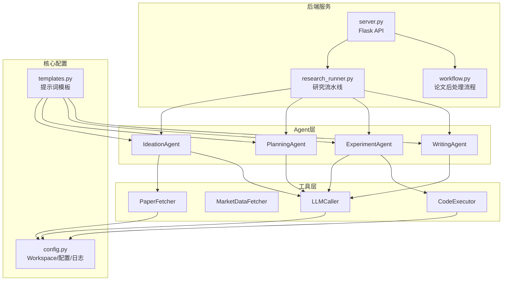
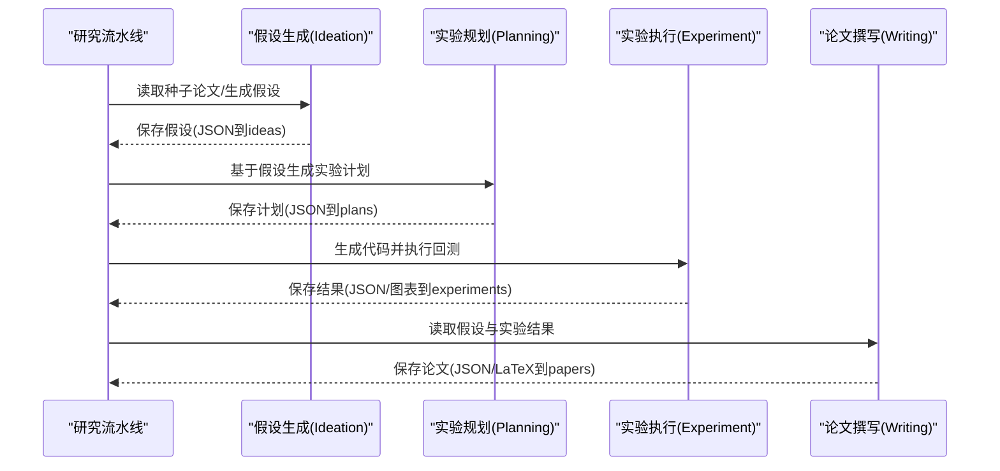
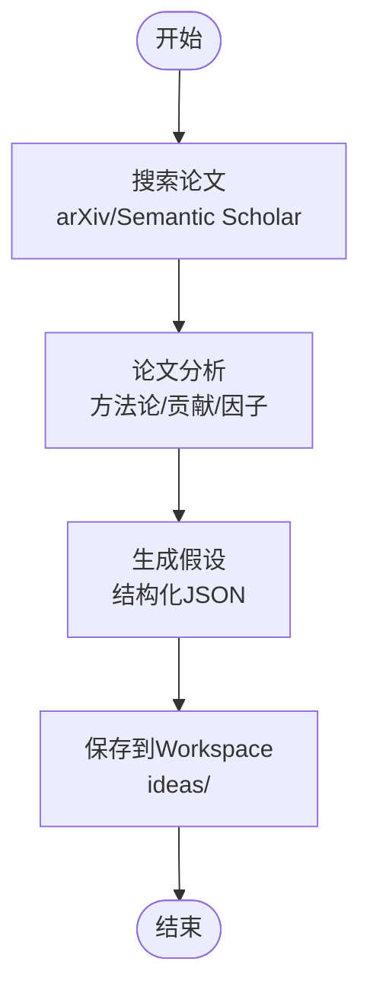
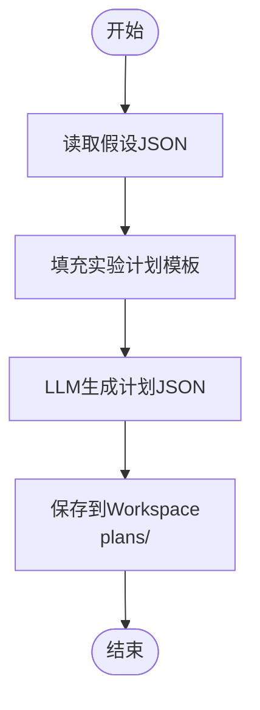
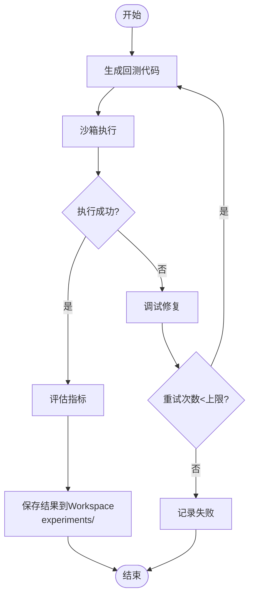
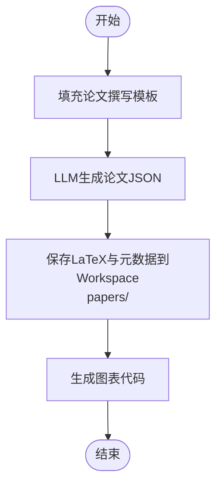
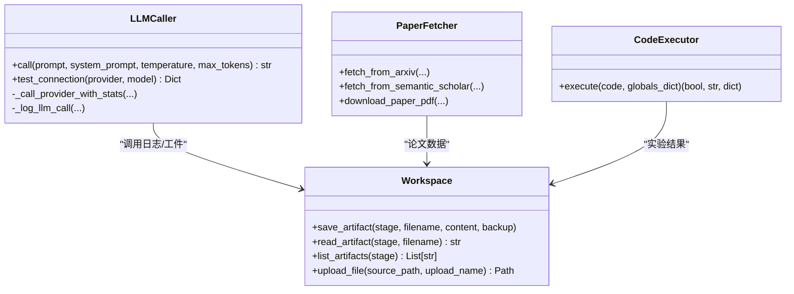
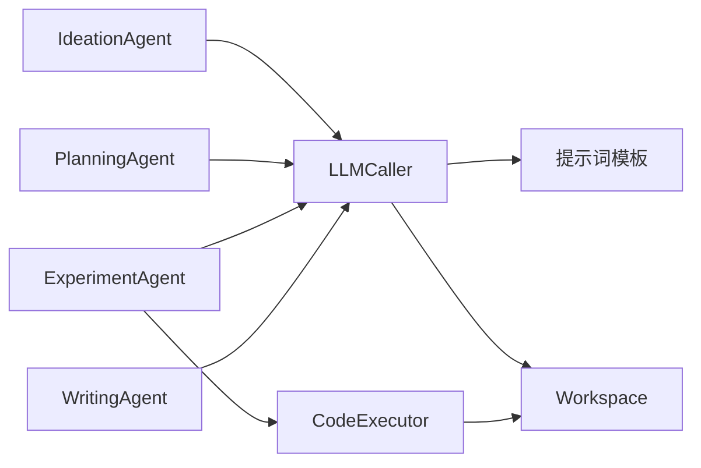

# Agent智能体系统

<cite>
**本文档引用的文件**
- [AGENTS.md](file://AGENTS.md)
- [agents.py](file://src/agents/agents.py)
- [templates.py](file://src/prompts/templates.py)
- [fetchers.py](file://src/tools/fetchers.py)
- [config.py](file://src/core/config.py)
- [research_runner.py](file://src/core/research_runner.py)
- [workflow.py](file://src/workflow.py)
- [main.py](file://src/main.py)
- [requirements.txt](file://requirements.txt)
</cite>

## 目录
1. [简介](#简介)
2. [项目结构](#项目结构)
3. [核心组件](#核心组件)
4. [架构总览](#架构总览)
5. [详细组件分析](#详细组件分析)
6. [依赖关系分析](#依赖关系分析)
7. [性能考虑](#性能考虑)
8. [故障排除指南](#故障排除指南)
9. [结论](#结论)
10. [附录](#附录)

## 简介
本文件为 paperwriterAI 的 Agent 智能体系统技术文档，聚焦四大 Agent 的设计理念与协作机制：  
- Ideation Agent（假设生成）  
- Planning Agent（实验规划）  
- Experiment Agent（实验执行）  
- Writing Agent（论文撰写）  

系统采用“提示词模板 + LLM 调用 + 工件存储”的分层架构，通过统一的工作空间（Workspace）实现 Agent 间的状态同步与结果传递；同时提供断点续跑、优雅降级、多 Provider LLM 调用、回测执行与论文生成的完整闭环。

## 项目结构
- 后端核心由 Flask 提供 API（server.py），核心业务逻辑集中在 src 目录：
  - src/agents/agents.py：四大 Agent 的实现
  - src/prompts/templates.py：7+ 个提示词模板
  - src/tools/fetchers.py：论文抓取、数据获取、LLM 调用、代码执行
  - src/core/config.py：配置管理、工作空间、日志与备份
  - src/core/research_runner.py：研究流水线与状态推进
  - src/workflow.py：论文生成后的编译、AI检测、投稿流程
  - src/main.py：CLI 主入口，支持研究方向、文件上传、LLM 连通性测试

**图表来源**
- [agents.py:23-738](file://src/agents/agents.py#L23-L738)
- [templates.py:1-758](file://src/prompts/templates.py#L1-L758)
- [fetchers.py:20-899](file://src/tools/fetchers.py#L20-L899)
- [config.py:256-563](file://src/core/config.py#L256-L563)
- [research_runner.py:278-800](file://src/core/research_runner.py#L278-L800)
- [workflow.py:19-286](file://src/workflow.py#L19-L286)

**章节来源**
- [AGENTS.md:1-157](file://AGENTS.md#L1-L157)
- [main.py:1-521](file://src/main.py#L1-L521)

## 核心组件
- LLM 调用机制
  - LLMCaller 统一封装 OpenAI、Anthropic、DeepSeek、MiniMax、Ollama 等 Provider，并支持主备自动切换与调用日志记录
  - 统一超时与重试策略，适配不同 Provider 的响应特性
- 工件存储与状态同步
  - Workspace 提供 save_artifact/read_artifact/list_artifacts/upload_file 等接口，按阶段（ideas/plans/experiments/papers/data/charts/logs/backups/uploads）组织数据
  - 研究流水线通过 ResearchRunner 管理阶段推进与实验状态同步
- 提示词模板体系
  - 为四类 Agent 设计专用模板，包括论文分析、假设生成、实验计划、代码生成、调试辅助、论文撰写、策略评估等
- 实验执行与回测
  - ExperimentAgent 生成可执行代码并通过 CodeExecutor 在沙箱中执行，支持错误自愈与重试
  - 回测引擎集成 backtrader/backtesting，输出标准化指标与图表

**章节来源**
- [fetchers.py:290-899](file://src/tools/fetchers.py#L290-L899)
- [config.py:256-384](file://src/core/config.py#L256-L384)
- [templates.py:1-758](file://src/prompts/templates.py#L1-L758)
- [agents.py:279-497](file://src/agents/agents.py#L279-L497)

## 架构总览
Agent 间的协作遵循“输入-处理-输出-持久化-传递”的闭环：  
- Ideation Agent 产出假设 JSON，保存到 ideas 目录  
- Planning Agent 基于假设生成实验计划 JSON，保存到 plans 目录  
- Experiment Agent 依据计划生成代码并执行，产出回测结果与图表，保存到 experiments 目录  
- Writing Agent 读取实验结果与假设，生成论文 JSON 与 LaTeX 源码，保存到 papers 目录  
- ResearchRunner 负责阶段推进与状态同步，保证断点续跑与优雅降级

**图表来源**
- [research_runner.py:642-800](file://src/core/research_runner.py#L642-L800)
- [agents.py:23-738](file://src/agents/agents.py#L23-L738)

## 详细组件分析

### Ideation Agent（假设生成）
- 职责
  - 从 arXiv/Semantic Scholar 搜索论文并去重
  - 深度分析论文方法论与贡献，提取可编程交易逻辑
  - 生成结构化假设 JSON，包含数学公式、Python 代码片段、预期指标与创新点
- 输入/输出
  - 输入：关键词查询、最大结果数、数据源列表
  - 输出：假设 JSON（包含多个候选假设、文献综述、研究空白）
- 工作流程
  1) 搜索论文 → 2) 分析论文 → 3) 生成假设 → 4) 保存到 Workspace
- 错误处理
  - LLM 解析失败时返回错误信息，避免中断流程
  - Workspace 自动备份同名文件，防止覆盖

**图表来源**
- [agents.py:23-195](file://src/agents/agents.py#L23-L195)
- [templates.py:28-85](file://src/prompts/templates.py#L28-L85)

**章节来源**
- [agents.py:23-195](file://src/agents/agents.py#L23-L195)
- [templates.py:28-85](file://src/prompts/templates.py#L28-L85)

### Planning Agent（实验规划）
- 职责
  - 将假设转化为可执行的实验计划
  - 设计数据配置、回测框架、评估指标与风险控制
- 输入/输出
  - 输入：假设 JSON（可选已有计划）
  - 输出：实验计划 JSON（包含实验ID、目标、数据配置、回测配置、评估指标、步骤清单）
- 工作流程
  1) 填充模板 → 2) LLM 生成 → 3) 保存到 Workspace
- 优化策略
  - 支持基于反馈的历史记录与迭代优化

**图表来源**
- [agents.py:197-277](file://src/agents/agents.py#L197-L277)
- [templates.py:160-234](file://src/prompts/templates.py#L160-L234)

**章节来源**
- [agents.py:197-277](file://src/agents/agents.py#L197-L277)
- [templates.py:160-234](file://src/prompts/templates.py#L160-L234)

### Experiment Agent（实验执行）
- 职责
  - 生成回测代码并执行
  - 错误自愈与代码调试
  - 评估策略性能（夏普比率、最大回撤、IC 等）
- 输入/输出
  - 输入：实验计划 JSON
  - 输出：回测结果 JSON（包含指标、图表路径、状态）
- 工作流程
  1) 生成代码 → 2) 沙箱执行 → 3) 评估结果 → 4) 保存到 Workspace
- 错误处理
  - 失败时触发调试模板，生成修复建议并重试
  - 支持最大重试次数与失败记录

**图表来源**
- [agents.py:279-497](file://src/agents/agents.py#L279-L497)
- [templates.py:239-352](file://src/prompts/templates.py#L239-L352)
- [fetchers.py:828-877](file://src/tools/fetchers.py#L828-L877)

**章节来源**
- [agents.py:279-497](file://src/agents/agents.py#L279-L497)
- [templates.py:239-352](file://src/prompts/templates.py#L239-L352)
- [fetchers.py:828-877](file://src/tools/fetchers.py#L828-L877)

### Writing Agent（论文撰写）
- 职责
  - 基于实验结果撰写学术论文
  - 生成 LaTeX 源码与参考文献
  - 自动生成图表与统计信息
- 输入/输出
  - 输入：实验结果 JSON、原始假设、可选原始论文
  - 输出：论文 JSON（包含 LaTeX 源码、参考文献、图表需求）
- 工作流程
  1) 填充论文模板 → 2) LLM 生成 → 3) 保存 LaTeX 与元数据到 Workspace
- 图表生成
  - 提供图表代码生成器，保存到 charts/ 目录

**图表来源**
- [agents.py:499-651](file://src/agents/agents.py#L499-L651)
- [templates.py:357-389](file://src/prompts/templates.py#L357-L389)

**章节来源**
- [agents.py:499-651](file://src/agents/agents.py#L499-L651)
- [templates.py:357-389](file://src/prompts/templates.py#L357-L389)

### LLM 调用机制与提示词模板
- LLM 调用
  - LLMCaller 支持多 Provider 自动切换、调用统计与日志记录
  - 统一超时与最大令牌数限制，适配 MiniMax 的特殊响应结构
- 提示词模板
  - 为四类 Agent 设计专用模板，确保输出结构化 JSON
  - 提供填充函数（fill_*_prompt）以注入动态上下文

**图表来源**
- [fetchers.py:290-899](file://src/tools/fetchers.py#L290-L899)
- [config.py:256-384](file://src/core/config.py#L256-L384)

**章节来源**
- [fetchers.py:290-899](file://src/tools/fetchers.py#L290-L899)
- [templates.py:677-758](file://src/prompts/templates.py#L677-L758)
- [config.py:256-384](file://src/core/config.py#L256-L384)

## 依赖关系分析
- 组件耦合
  - Agent 通过 LLMCaller 与提示词模板交互，耦合度低，便于替换 Provider
  - Workspace 作为共享中介，贯穿各阶段工件存储，耦合度中等
  - ExperimentAgent 依赖 CodeExecutor 与回测框架，耦合度较高但职责单一
- 外部依赖
  - LLM Provider：OpenAI、Anthropic、DeepSeek、MiniMax、Ollama
  - 数据与回测：yfinance、akshare、backtrader、backtesting
  - 可选：MongoDB（可选语义检索）

**图表来源**
- [agents.py:23-738](file://src/agents/agents.py#L23-L738)
- [templates.py:1-758](file://src/prompts/templates.py#L1-L758)
- [fetchers.py:290-899](file://src/tools/fetchers.py#L290-L899)
- [config.py:256-384](file://src/core/config.py#L256-L384)

**章节来源**
- [requirements.txt:1-39](file://requirements.txt#L1-L39)
- [config.py:204-251](file://src/core/config.py#L204-L251)

## 性能考虑
- LLM 调用
  - 统一超时与重试策略，避免长时间阻塞
  - 优先使用 MiniMax-M2.7-highspeed，必要时自动切换至 Ollama 本地模型
- 代码执行
  - 沙箱执行限制超时，捕获标准输出与错误输出，便于调试
- 回测效率
  - 仅在必要时下载 PDF，回测数据尽量本地化
- 存储与并发
  - Workspace 自动备份同名文件，避免覆盖
  - 研究流水线使用锁与状态推进，避免竞态

[本节为通用指导，无需特定文件引用]

## 故障排除指南
- LLM 连接失败
  - 使用 FARS.test_llm_connection() 或 CLI --test-llm 检查
  - 检查环境变量或 config.local.json 中的 API Key
- 回测执行异常
  - ExperimentAgent 会记录错误堆栈，触发调试模板生成修复建议
  - 检查数据可用性（yfinance/akshare/MongoDB）
- 论文生成失败
  - WritingAgent 会在失败时保存原始响应以便调试
  - 检查提示词长度与上下文窗口限制
- 断点续跑
  - 研究流水线记录阶段历史，支持从写作阶段续传

**章节来源**
- [main.py:88-101](file://src/main.py#L88-L101)
- [agents.py:386-462](file://src/agents/agents.py#L386-L462)
- [research_runner.py:429-566](file://src/core/research_runner.py#L429-L566)

## 结论
paperwriterAI 的 Agent 智能体系统通过清晰的职责划分、统一的提示词模板与 LLM 调用机制，实现了从论文阅读到假设生成、实验执行与论文撰写的自动化闭环。Workspace 提供稳定的状态同步与工件管理，研究流水线保障断点续跑与优雅降级。建议在生产环境中：
- 明确配置优先级与 API Key 管理
- 为不同 Provider 设置合理的超时与重试参数
- 在实验阶段启用日志与备份，确保可追溯性

[本节为总结性内容，无需特定文件引用]

## 附录

### Agent 间通信协议与状态同步
- 通信协议
  - 统一通过 Workspace 读写工件，避免直接跨模块耦合
  - 研究流水线维护 phase_history 与 experiments 列表，实现阶段推进与可视化
- 状态同步
  - 每个阶段完成后立即持久化，支持断点续跑
  - 通过 _set_activity 与 _sync_stage_experiments 更新前端进度

**章节来源**
- [config.py:368-384](file://src/core/config.py#L368-L384)
- [research_runner.py:567-629](file://src/core/research_runner.py#L567-L629)

### 配置选项与最佳实践
- 配置项
  - LLM Provider 与模型、温度、最大令牌数
  - 数据源开关（yfinance/akshare/MongoDB）
  - 回测参数（初始资金、手续费、基准）
  - 评估阈值（最小夏普比率、最大回撤、最小 IC）
- 最佳实践
  - 在 config.local.json 中配置 API Key，避免提交到仓库
  - 使用 Ollama 作为本地备选，降低对外部服务依赖
  - 严格控制提示词长度，避免超出上下文窗口

**章节来源**
- [config.py:388-417](file://src/core/config.py#L388-L417)
- [main.py:62-86](file://src/main.py#L62-L86)

### 使用案例与工作流
- CLI 模式
  - python src/main.py --direction quant_finance --topic "Transformer-based momentum trading"
- Web 界面
  - 启动 server.py 后访问 / 或 /v2/，通过前端按钮触发研究流程
- 论文后处理
  - 使用 src/workflow.py 完成 LaTeX 编译、AI 检测绕过与投稿指引生成

**章节来源**
- [main.py:443-521](file://src/main.py#L443-L521)
- [workflow.py:233-286](file://src/workflow.py#L233-L286)