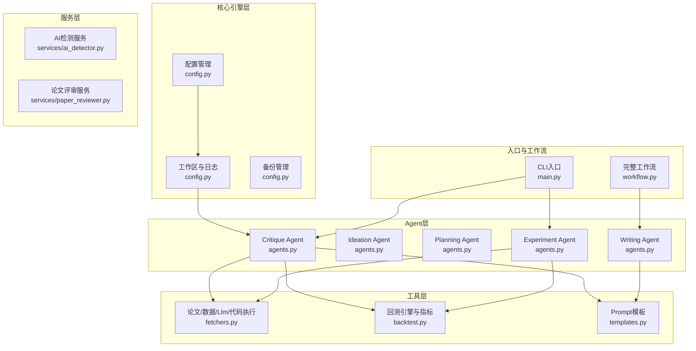
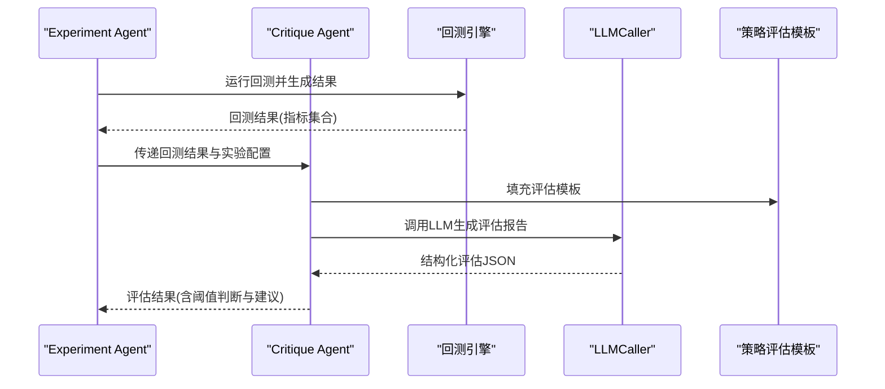
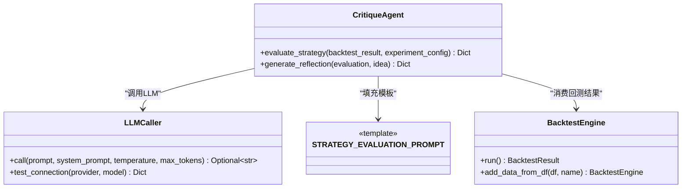
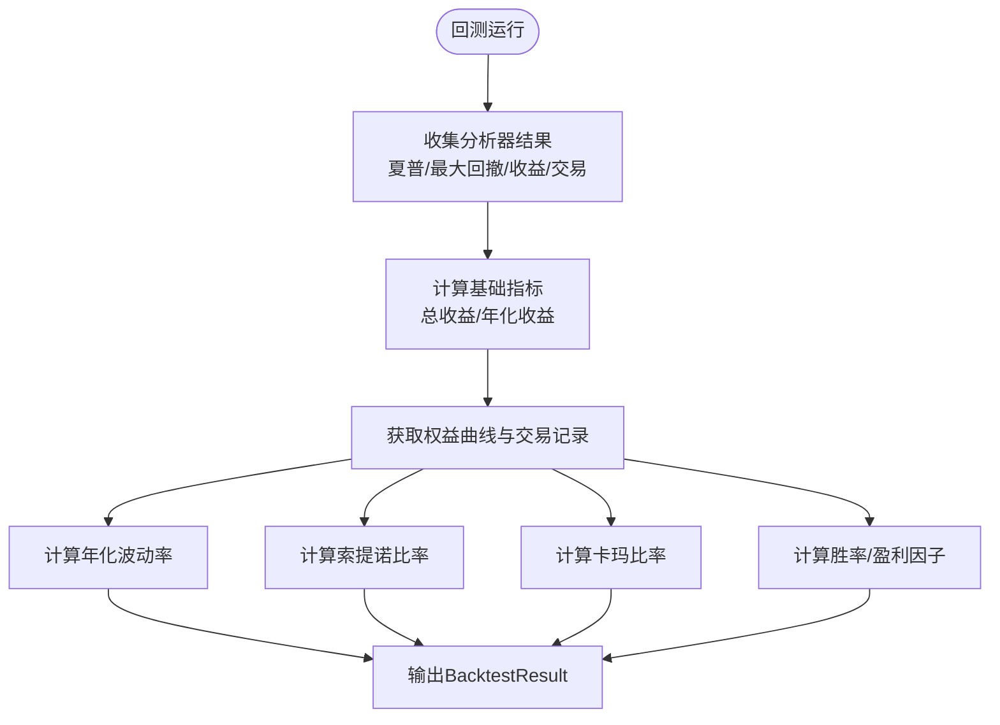
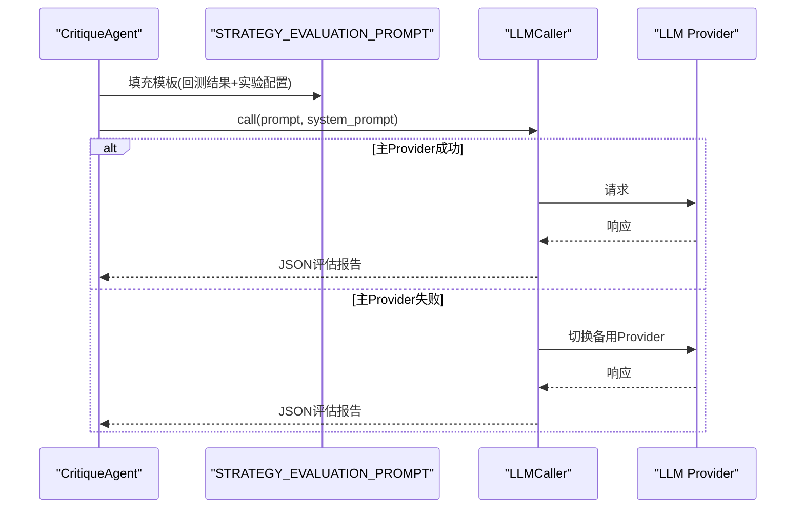
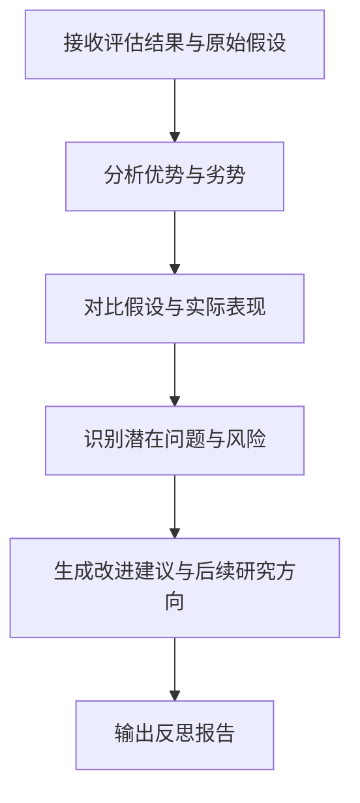
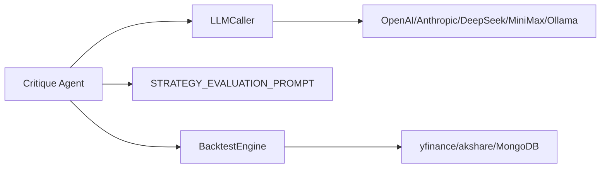

# Critique Agent（评估反思智能体）

<cite>
**本文档引用的文件**
- [src/agents/agents.py](file://src/agents/agents.py)
- [src/tools/backtest.py](file://src/tools/backtest.py)
- [src/prompts/templates.py](file://src/prompts/templates.py)
- [src/core/config.py](file://src/core/config.py)
- [src/tools/fetchers.py](file://src/tools/fetchers.py)
- [src/main.py](file://src/main.py)
- [src/workflow.py](file://src/workflow.py)
- [AGENTS.md](file://AGENTS.md)
</cite>

## 目录
1. [简介](#简介)
2. [项目结构](#项目结构)
3. [核心组件](#核心组件)
4. [架构总览](#架构总览)
5. [详细组件分析](#详细组件分析)
6. [依赖关系分析](#依赖关系分析)
7. [性能考量](#性能考量)
8. [故障排除指南](#故障排除指南)
9. [结论](#结论)
10. [附录](#附录)

## 简介
本文件为 Critique Agent（评估反思智能体）的技术文档，聚焦于量化策略的全面评估与反思分析流程。内容涵盖：性能指标评估（夏普比率、最大回撤、信息系数等）、基准对比分析、统计显著性检验；反思生成机制、问题诊断流程、优化建议制定；评估模板设计、LLM调用策略、结果解释机制；以及实际使用案例与理论实践建议。

## 项目结构
本项目采用分层架构：核心引擎层（配置、工作区、日志、备份）、Agent层（四个智能体）、工具层（论文抓取、数据获取、回测、代码执行、LLM调用）、服务层（AI检测、论文评审）、提示模板层（7+种Prompt模板）、CLI入口与完整工作流。

**图表来源**
- [src/core/config.py:256-384](file://src/core/config.py#L256-L384)
- [src/agents/agents.py:653-738](file://src/agents/agents.py#L653-L738)
- [src/tools/backtest.py:181-347](file://src/tools/backtest.py#L181-L347)
- [src/tools/fetchers.py:290-804](file://src/tools/fetchers.py#L290-L804)
- [src/prompts/templates.py:392-468](file://src/prompts/templates.py#L392-L468)
- [src/main.py:35-60](file://src/main.py#L35-L60)
- [src/workflow.py:19-37](file://src/workflow.py#L19-L37)

**章节来源**
- [AGENTS.md:18-57](file://AGENTS.md#L18-L57)

## 核心组件
- Critique Agent：负责策略评估、反思与改进建议生成，对接回测结果与实验配置，调用策略评估模板，输出结构化评估报告与可发表性判断。
- 回测引擎与指标：提供标准化的策略性能指标（总收益、夏普比率、最大回撤、年化收益、波动率、卡玛比率、索提诺比率、胜率、盈利因子、交易次数等），并支持因子IC/IR计算。
- Prompt模板：包含策略评估模板（STRATEGY_EVALUATION_PROMPT），用于指导LLM对回测结果进行多维度评估与可发表性判断。
- 配置与阈值：通过配置项定义最小夏普比率、最大回撤阈值、最小IC等评估阈值，驱动自动化决策。
- LLM调用策略：统一的LLMCaller封装，支持多Provider自动切换与调用记录，保障评估过程的稳定与可观测。

**章节来源**
- [src/agents/agents.py:653-738](file://src/agents/agents.py#L653-L738)
- [src/tools/backtest.py:23-53](file://src/tools/backtest.py#L23-L53)
- [src/prompts/templates.py:392-468](file://src/prompts/templates.py#L392-L468)
- [src/core/config.py:408-412](file://src/core/config.py#L408-L412)
- [src/tools/fetchers.py:290-449](file://src/tools/fetchers.py#L290-L449)

## 架构总览
Critique Agent位于Agent层，接收回测结果与实验配置，通过策略评估模板生成评估报告，并结合配置阈值给出可发表性判断。回测引擎提供标准化指标，Prompt模板定义评估维度，LLMCaller保证评估过程的鲁棒性。

**图表来源**
- [src/agents/agents.py:669-701](file://src/agents/agents.py#L669-L701)
- [src/tools/backtest.py:248-327](file://src/tools/backtest.py#L248-L327)
- [src/prompts/templates.py:392-468](file://src/prompts/templates.py#L392-L468)
- [src/tools/fetchers.py:391-449](file://src/tools/fetchers.py#L391-L449)

## 详细组件分析

### Critique Agent（评估反思智能体）
- 职责
  - 评估策略性能：基于回测结果与实验配置，使用策略评估模板进行多维度评估。
  - 反思与建议：基于评估结果与原始假设，生成反思与改进建议。
  - 可发表性判断：结合阈值与评估维度，给出是否值得发表及改进方向。
- 输入
  - 回测结果：包含总收益、夏普比率、最大回撤、年化收益、波动率、卡玛比率、索提诺比率、胜率、盈利因子、交易次数、权益曲线、交易记录等。
  - 实验配置：数据范围、再平衡频率、基准等。
- 输出
  - 结构化评估报告：包含总体评分、推荐等级、优势与劣势、详细指标维度评分、可发表性判断与改进清单。
- 关键实现要点
  - Prompt填充：使用STRATEGY_EVALUATION_PROMPT模板，注入回测结果与实验配置。
  - LLM调用：通过LLMCaller调用，自动切换Provider，记录调用日志。
  - 结果解析：从LLM响应中提取JSON，若失败返回错误信息。

**图表来源**
- [src/agents/agents.py:653-738](file://src/agents/agents.py#L653-L738)
- [src/tools/fetchers.py:290-449](file://src/tools/fetchers.py#L290-L449)
- [src/tools/backtest.py:181-247](file://src/tools/backtest.py#L181-L247)
- [src/prompts/templates.py:392-468](file://src/prompts/templates.py#L392-L468)

**章节来源**
- [src/agents/agents.py:653-738](file://src/agents/agents.py#L653-L738)

### 回测引擎与评估指标体系
- 标准化指标
  - 收益能力：总收益率、年化收益率、相对基准超额收益。
  - 风险控制：最大回撤、波动率、卡玛比率。
  - 风险调整收益：夏普比率、索提诺比率、信息比率（IR）。
  - 策略稳定性：胜率、盈利因子、交易次数。
- 指标计算
  - 夏普比率、最大回撤、收益、交易分析器由backtrader提供。
  - 年化波动率、索提诺比率、卡玛比率、胜率、盈利因子等基于权益曲线与交易记录计算。
- 因子评估
  - 提供IC（信息系数）、Rank IC（Spearman相关系数）、IR（IC均值/IC标准差）与多头-空头收益差等因子有效性指标。

**图表来源**
- [src/tools/backtest.py:248-327](file://src/tools/backtest.py#L248-L327)

**章节来源**
- [src/tools/backtest.py:23-53](file://src/tools/backtest.py#L23-L53)
- [src/tools/backtest.py:248-327](file://src/tools/backtest.py#L248-L327)
- [src/tools/backtest.py:351-433](file://src/tools/backtest.py#L351-L433)

### 评估模板设计与LLM调用策略
- 评估模板
  - STRATEGY_EVALUATION_PROMPT定义评估维度：收益能力、风险控制、风险调整收益、策略稳定性、可发表性判断。
  - 模板要求输出结构化JSON，包含总体评分、推荐等级、优势与劣势、详细指标维度评分、可发表性判断与改进清单。
- LLM调用策略
  - LLMCaller封装多Provider调用，支持主Provider失败时自动切换备用Provider（如Ollama本地模型）。
  - 统一记录调用日志（调用ID、Provider、模型、tokens、延迟、状态、错误信息），便于审计与性能分析。
  - 支持测试连接，快速验证可用性。

**图表来源**
- [src/prompts/templates.py:392-468](file://src/prompts/templates.py#L392-L468)
- [src/tools/fetchers.py:391-449](file://src/tools/fetchers.py#L391-L449)
- [src/tools/fetchers.py:451-501](file://src/tools/fetchers.py#L451-L501)

**章节来源**
- [src/prompts/templates.py:392-468](file://src/prompts/templates.py#L392-L468)
- [src/tools/fetchers.py:290-449](file://src/tools/fetchers.py#L290-L449)
- [src/tools/fetchers.py:806-823](file://src/tools/fetchers.py#L806-L823)

### 反思生成机制与问题诊断
- 反思输入
  - 评估结果：包含总体评分、维度评分、优势与劣势。
  - 原始假设：研究假设与预期指标，用于对比验证。
- 反思输出
  - 生成式反思：解释策略表现好坏的原因、假设正确性、改进空间、是否值得进一步研究。
  - 与评估报告协同：为后续优化提供方向与依据。

**图表来源**
- [src/agents/agents.py:703-738](file://src/agents/agents.py#L703-L738)

**章节来源**
- [src/agents/agents.py:703-738](file://src/agents/agents.py#L703-L738)

### 基准对比分析与统计显著性检验
- 基准对比
  - 实验配置中包含基准（如CSI300.SS），策略评估时对比相对基准的超额收益与风险指标。
- 统计显著性
  - 可结合IC/IR与分位数收益差异进行稳健性检验（例如滚动IC与Rank IC的稳定性、多期IR显著性检验）。
  - 若仓库未内置统计检验工具，可在评估报告中明确指出“未进行统计显著性检验”，并在建议中补充后续统计验证步骤。

**章节来源**
- [src/agents/agents.py:679-686](file://src/agents/agents.py#L679-L686)
- [src/tools/backtest.py:351-433](file://src/tools/backtest.py#L351-L433)

### 实际使用案例与最佳实践
- 案例场景
  - 动量策略回测：使用MomentumStrategy，评估总收益、夏普比率、最大回撤、胜率与盈利因子，结合基准对比超额收益。
  - 因子有效性评估：计算IC/Rank IC/IR与多头-空头收益差，判断因子稳定性与可复制性。
- 最佳实践
  - 明确阈值：在配置中设定最小夏普比率、最大回撤阈值、最小IC，作为自动化筛选标准。
  - 保留不完美结果：即使收益偏低或Sharpe不高，也应如实报告，体现学术诚信。
  - 结构化输出：严格遵循Prompt模板输出结构化JSON，便于下游处理与可视化。

**章节来源**
- [src/core/config.py:408-412](file://src/core/config.py#L408-L412)
- [src/prompts/templates.py:357-389](file://src/prompts/templates.py#L357-L389)
- [src/tools/backtest.py:126-150](file://src/tools/backtest.py#L126-L150)

## 依赖关系分析
- 组件耦合
  - Critique Agent依赖LLMCaller进行评估生成，依赖BacktestEngine提供的标准化指标。
  - Prompt模板与配置共同决定评估维度与阈值，影响自动化决策。
- 外部依赖
  - backtrader用于回测与分析器；yfinance/akshare用于市场数据；MongoDB用于数据存储（可选）。
- 潜在循环依赖
  - Agent层内部职责清晰，未见循环依赖；工具层与Agent层通过接口解耦。

**图表来源**
- [src/agents/agents.py:653-738](file://src/agents/agents.py#L653-L738)
- [src/tools/fetchers.py:290-449](file://src/tools/fetchers.py#L290-L449)
- [src/tools/backtest.py:181-247](file://src/tools/backtest.py#L181-L247)

**章节来源**
- [src/agents/agents.py:653-738](file://src/agents/agents.py#L653-L738)
- [src/tools/fetchers.py:290-449](file://src/tools/fetchers.py#L290-L449)
- [src/tools/backtest.py:181-247](file://src/tools/backtest.py#L181-L247)

## 性能考量
- LLM调用性能
  - 统一超时与重试策略，避免长时间阻塞；记录tokens与延迟，便于成本与性能分析。
- 回测性能
  - backtrader分析器开销可控；权益曲线与交易记录较大时，注意内存占用与序列化成本。
- 指标计算复杂度
  - 年化波动率、索提诺比率等基于序列计算，时间复杂度O(n)，在大规模回测中需关注批处理与缓存策略。

## 故障排除指南
- LLM连接失败
  - 使用LLMCaller.test_connection快速检测；检查API Key与网络；观察备用Provider切换日志。
- 回测结果为空或异常
  - 检查数据源可用性（yfinance/akshare/MongoDB）；确认数据格式与列名映射；核对策略参数。
- 评估报告解析失败
  - 检查Prompt模板输出格式；确保LLM返回可解析的JSON；查看调用日志中的错误详情。

**章节来源**
- [src/tools/fetchers.py:806-823](file://src/tools/fetchers.py#L806-L823)
- [src/tools/fetchers.py:324-390](file://src/tools/fetchers.py#L324-L390)

## 结论
Critique Agent通过标准化的评估模板与LLM生成能力，实现了对量化策略的全面评估与反思。结合回测引擎提供的丰富指标与配置阈值，能够自动化地判断策略的可发表性并生成改进建议。建议在实际应用中严格遵循学术诚信原则，如实报告所有实验结果，并持续优化评估维度与阈值，提升评估的可靠性与实用性。

## 附录
- 术语
  - 夏普比率：单位风险所获得的风险溢价。
  - 最大回撤：从最高净值到随后最低净值的回落幅度。
  - 信息系数（IC）：预测值与未来收益的秩相关系数。
  - 信息比率（IR）：IC的均值除以其标准差。
  - 索提诺比率：仅考虑下行风险的收益风险比。
  - 卡玛比率：年化收益与最大回撤之比。
  - 胜率：盈利交易次数占总交易次数的比例。
  - 盈利因子：总盈利与总亏损的比值。