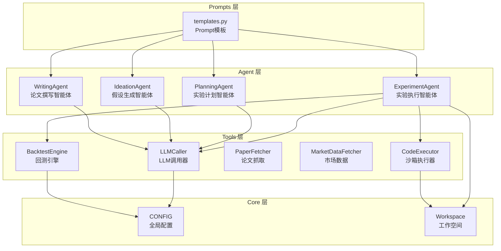
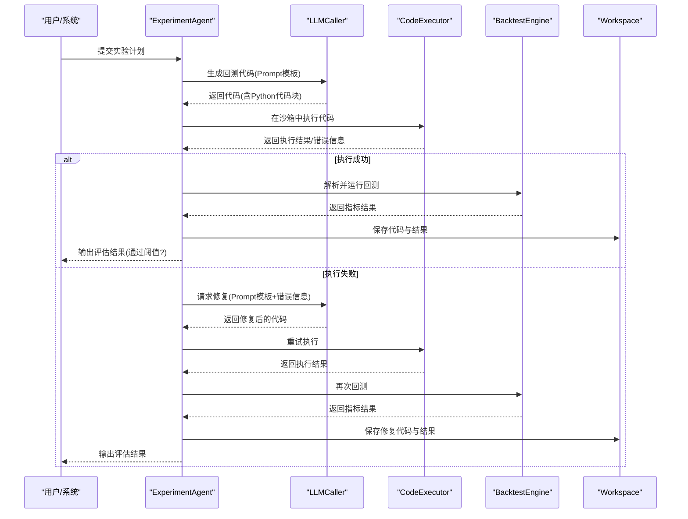
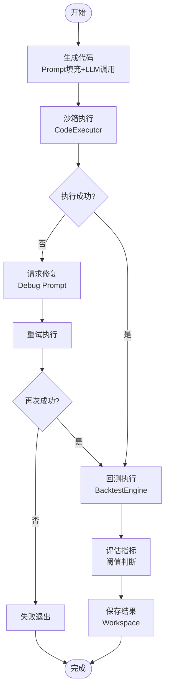
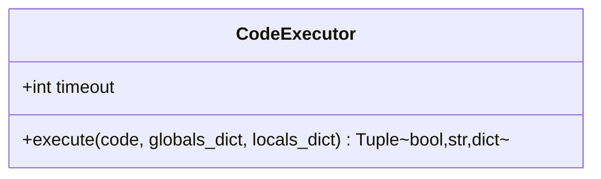
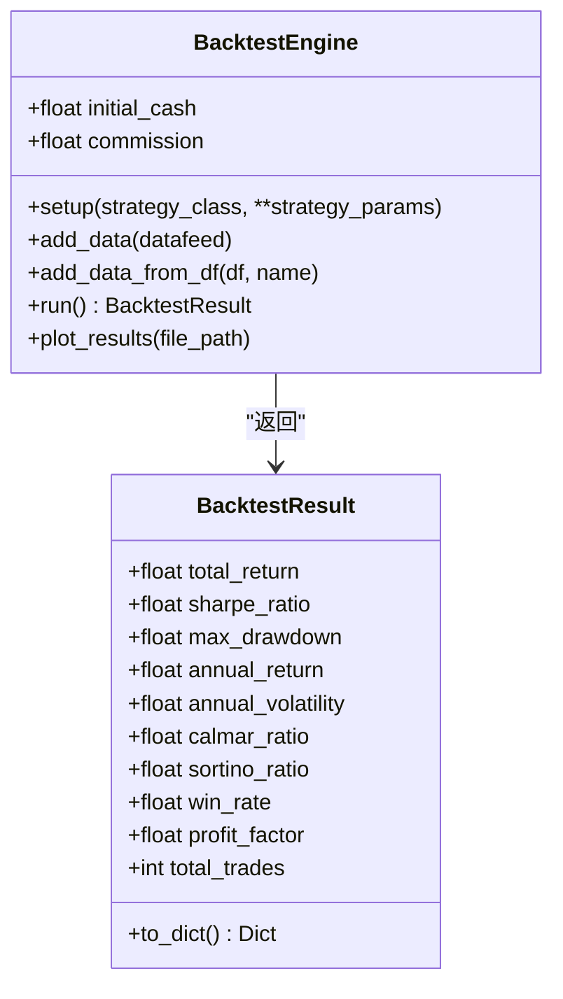
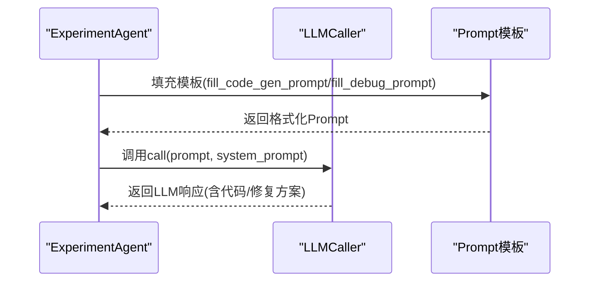
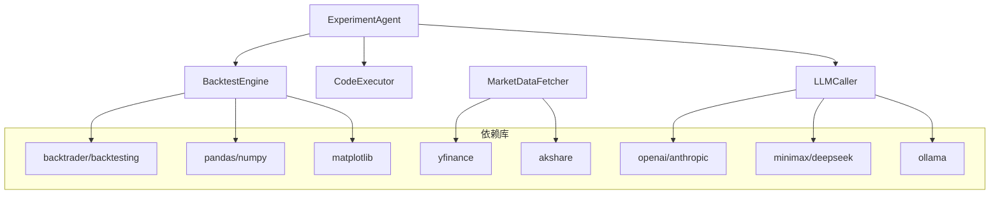

# Experiment Agent（实验执行智能体）

<cite>
**本文档引用的文件**
- [src/agents/agents.py](file://src/agents/agents.py)
- [src/tools/backtest.py](file://src/tools/backtest.py)
- [src/tools/fetchers.py](file://src/tools/fetchers.py)
- [src/prompts/templates.py](file://src/prompts/templates.py)
- [src/core/config.py](file://src/core/config.py)
- [src/main.py](file://src/main.py)
- [src/workflow.py](file://src/workflow.py)
- [requirements.txt](file://requirements.txt)
</cite>

## 目录
1. [简介](#简介)
2. [项目结构](#项目结构)
3. [核心组件](#核心组件)
4. [架构总览](#架构总览)
5. [详细组件分析](#详细组件分析)
6. [依赖关系分析](#依赖关系分析)
7. [性能考量](#性能考量)
8. [故障排查指南](#故障排查指南)
9. [结论](#结论)
10. [附录](#附录)

## 简介
本文件为 Experiment Agent（实验执行智能体）的深入技术文档，聚焦于“从实验计划到可执行代码、沙箱执行、结果评估与错误调试”的完整生命周期。文档详细阐述：
- LLM 代码生成机制与 Prompt 模板体系
- Python 沙箱执行环境与安全约束
- Backtrader 回测引擎集成与指标计算
- 实验评估指标（夏普比率、最大回撤、IC 等）与阈值判断
- 代码提取算法、错误捕获机制与自动修复流程
- 实际使用案例与失败自愈机制

## 项目结构
该项目采用分层架构：Agent 层负责任务编排与提示工程；Tools 层提供数据获取、回测与代码执行等工具；Core 层管理配置、工作空间与日志；Prompts 层提供标准化提示模板；Main 与 Workflow 提供 CLI 与完整论文工作流。



**图表来源**
- [src/agents/agents.py:279-496](file://src/agents/agents.py#L279-L496)
- [src/tools/fetchers.py:828-877](file://src/tools/fetchers.py#L828-L877)
- [src/tools/backtest.py:181-346](file://src/tools/backtest.py#L181-L346)
- [src/prompts/templates.py:237-352](file://src/prompts/templates.py#L237-L352)
- [src/core/config.py:388-417](file://src/core/config.py#L388-L417)

**章节来源**
- [src/main.py:35-438](file://src/main.py#L35-L438)
- [src/workflow.py:19-278](file://src/workflow.py#L19-L278)

## 核心组件
- ExperimentAgent：负责将实验计划转化为可执行代码、在沙箱中执行、评估结果并通过 LLM 进行自动修复。
- CodeExecutor：提供受限的 Python 执行环境，捕获 stdout/stderr，返回执行结果与局部命名空间。
- BacktestEngine：基于 Backtrader 的回测引擎，负责策略回测、指标计算与结果汇总。
- LLMCaller：统一的 LLM 调用器，支持多 Provider 自动切换与调用记录。
- Workspace：项目工作空间，负责工件保存、备份与日志记录。
- Prompt 模板：为 Experiment、Debug、Writing 等任务提供标准化提示。

**章节来源**
- [src/agents/agents.py:279-496](file://src/agents/agents.py#L279-L496)
- [src/tools/fetchers.py:828-877](file://src/tools/fetchers.py#L828-L877)
- [src/tools/backtest.py:181-346](file://src/tools/backtest.py#L181-L346)
- [src/prompts/templates.py:237-352](file://src/prompts/templates.py#L237-L352)
- [src/core/config.py:254-384](file://src/core/config.py#L254-L384)

## 架构总览
Experiment Agent 的执行流程如下：



**图表来源**
- [src/agents/agents.py:302-462](file://src/agents/agents.py#L302-L462)
- [src/tools/fetchers.py:828-877](file://src/tools/fetchers.py#L828-L877)
- [src/tools/backtest.py:248-327](file://src/tools/backtest.py#L248-L327)
- [src/prompts/templates.py:237-352](file://src/prompts/templates.py#L237-L352)

## 详细组件分析

### ExperimentAgent（实验执行智能体）
职责与流程：
- 代码生成：基于实验计划构造 Prompt，调用 LLM 生成回测代码；支持 Markdown 代码块与无标记代码两种提取方式。
- 沙箱执行：通过 CodeExecutor 在受限环境中执行代码，捕获 stdout/stderr，返回局部命名空间以便后续回测。
- 结果评估：读取回测结果中的指标，与配置中的阈值进行比较，判定是否通过。
- 自动修复：若执行失败，利用 Debug Prompt 将错误堆栈与原始代码交给 LLM，生成修复后的代码并重试。

关键实现要点：
- 代码提取算法：优先匹配 ```python ... ```，其次按 import 关键字截取。
- 错误捕获：捕获异常并返回可读的错误堆栈；同时记录输出流。
- 自动修复流程：将错误分析、修复代码与预防建议以结构化 JSON 返回，便于保存与重试。



**图表来源**
- [src/agents/agents.py](file://src/agents/agents.py#L302-L462)
- [src/tools/fetchers.py](file://src/tools/fetchers.py#L828-L877)
- [src/tools/backtest.py](file://src/tools/backtest.py#L248-L327)

**章节来源**
- [src/agents/agents.py](file://src/agents/agents.py#L279-L496)
- [src/prompts/templates.py](file://src/prompts/templates.py#L237-L352)

### CodeExecutor（沙箱执行器）
- 功能：在受限环境中执行 Python 代码，捕获标准输出与错误输出，返回布尔成功标志、输出字符串与局部命名空间。
- 安全性：通过 exec 在隔离的全局/局部命名空间中执行，避免破坏性操作；输出流重定向捕获。
- 超时与健壮性：可在调用侧设置超时（例如 300 秒），避免长时间阻塞。



**图表来源**
- [src/tools/fetchers.py](file://src/tools/fetchers.py#L828-L877)

**章节来源**
- [src/tools/fetchers.py](file://src/tools/fetchers.py#L828-L877)

### BacktestEngine（回测引擎）
- 功能：基于 Backtrader 的策略回测，支持添加策略、数据、分析器，运行并提取指标。
- 指标计算：总收益、年化收益、夏普比率、最大回撤、卡玛比率、索提诺比率、胜率、盈利因子、交易次数等。
- 数据适配：支持从 DataFrame 构造 PandasData，自动重命名列以符合 Backtrader 要求。
- 结果结构：返回 BacktestResult 数据类，包含指标字典与权益曲线、交易记录等。



**图表来源**
- [src/tools/backtest.py](file://src/tools/backtest.py#L181-L346)
- [src/tools/backtest.py](file://src/tools/backtest.py#L24-L53)

**章节来源**
- [src/tools/backtest.py](file://src/tools/backtest.py#L181-L346)

### Prompt 模板与 LLM 调用
- ExperimentAgent 代码生成：CODE_GENERATION_PROMPT，约束代码安全性、完整性与输出规范。
- Debug 修复：DEBUG_ASSISTANCE_PROMPT，接收错误堆栈与原始代码，要求分析错误、提供修复代码与预防建议。
- LLMCaller：统一封装多 Provider（OpenAI、Anthropic、MiniMax、DeepSeek、Ollama），支持自动切换与调用记录。



**图表来源**
- [src/prompts/templates.py](file://src/prompts/templates.py#L237-L352)
- [src/tools/fetchers.py](file://src/tools/fetchers.py#L290-L823)

**章节来源**
- [src/prompts/templates.py](file://src/prompts/templates.py#L237-L352)
- [src/tools/fetchers.py](file://src/tools/fetchers.py#L290-L823)

### Workspace（工作空间）
- 职责：统一管理项目目录结构（ideas/plans/experiments/papers/data/charts/logs/backups/uploads），保存/读取工件，记录步骤日志，备份文件。
- 与 ExperimentAgent 协作：保存生成的代码、修复后的代码、回测结果、图表等。

**章节来源**
- [src/core/config.py](file://src/core/config.py#L254-L384)

## 依赖关系分析
- LLM Provider：OpenAI、Anthropic、MiniMax、DeepSeek、Ollama，支持主备自动切换与调用统计。
- 数据与回测：backtrader、backtesting、pandas、numpy、matplotlib、yfinance、akshare。
- 配置与日志：全局 CONFIG、Workspace、BackupManager、日志系统。



**图表来源**
- [requirements.txt:1-39](file://requirements.txt#L1-L39)
- [src/tools/backtest.py:14-21](file://src/tools/backtest.py#L14-L21)
- [src/tools/fetchers.py:167-270](file://src/tools/fetchers.py#L167-L270)
- [src/tools/fetchers.py:290-823](file://src/tools/fetchers.py#L290-L823)

**章节来源**
- [requirements.txt:1-39](file://requirements.txt#L1-L39)
- [src/core/config.py:388-417](file://src/core/config.py#L388-L417)

## 性能考量
- 回测性能：BacktestEngine 使用 Backtrader，适合中等规模数据回测；大规模数据建议分批或使用更高性能的回测框架。
- LLM 调用：统一超时与重试策略，避免阻塞；MiniMax 等长上下文模型需注意 token 消耗与清理标签。
- 沙箱执行：CodeExecutor 仅执行受限代码，避免 IO 与系统调用；建议在容器或受限环境中进一步加固。
- 指标计算：BacktestEngine 已内置多种指标，避免重复计算；如需扩展，应考虑缓存与增量更新。

## 故障排查指南
常见问题与处理：
- LLM 调用失败：检查 API Key、Provider 可用性与网络；LLMCaller 会自动尝试备用 Provider。
- 代码执行异常：查看 CodeExecutor 返回的错误堆栈；必要时启用更详细的日志。
- 回测报错：检查数据格式（列名、索引）、策略实现与参数；确保 Backtrader 依赖可用。
- 阈值不达标：调整实验计划（数据范围、策略参数、再平衡频率）或增加对照实验。

定位与诊断建议：
- 使用 Workspace 的日志与工件保存功能，定位失败步骤与中间产物。
- 在 Debug Prompt 中提供完整错误堆栈与上下文，提高修复成功率。
- 对关键指标进行单元测试与可视化，确保评估流程稳定。

**章节来源**
- [src/tools/fetchers.py:290-823](file://src/tools/fetchers.py#L290-L823)
- [src/tools/fetchers.py:828-877](file://src/tools/fetchers.py#L828-L877)
- [src/tools/backtest.py:248-327](file://src/tools/backtest.py#L248-L327)
- [src/core/config.py:368-384](file://src/core/config.py#L368-L384)

## 结论
Experiment Agent 将 LLM 的创造性与 Backtrader 的严谨性结合，实现了从实验计划到自动化回测与评估的闭环。通过 Prompt 模板、沙箱执行与自动修复机制，系统能够在保证安全性的前提下，快速迭代策略并产出可发表级别的实验结果。建议在生产环境中进一步加强容器化与监控，以提升稳定性与可观测性。

## 附录

### 实际使用案例
- 从实验计划生成可执行代码并完成自动化回测：
  1) PlanningAgent 生成实验计划（包含数据配置、回测配置、评估指标）。
  2) ExperimentAgent 基于计划生成代码，CodeExecutor 在沙箱中执行。
  3) BacktestEngine 运行回测并计算指标。
  4) ExperimentAgent 评估阈值并通过 Workspace 保存结果。
- 失败情况下的自愈机制：
  1) 若执行失败，ExperimentAgent 调用 LLM 进行 Debug，生成修复代码。
  2) 重试执行与回测，直至通过或达到最大重试次数。

**章节来源**
- [src/agents/agents.py:302-462](file://src/agents/agents.py#L302-L462)
- [src/prompts/templates.py:237-352](file://src/prompts/templates.py#L237-L352)
- [src/tools/backtest.py:248-327](file://src/tools/backtest.py#L248-L327)