# Ideation Agent（假设生成智能体）

<cite>
**本文档引用的文件**
- [src/agents/agents.py](file://src/agents/agents.py)
- [src/tools/fetchers.py](file://src/tools/fetchers.py)
- [src/prompts/templates.py](file://src/prompts/templates.py)
- [src/core/config.py](file://src/core/config.py)
- [src/tools/backtest.py](file://src/tools/backtest.py)
- [src/main.py](file://src/main.py)
- [AGENTS.md](file://AGENTS.md)
- [README.md](file://README.md)
</cite>

## 目录
1. [简介](#简介)
2. [项目结构](#项目结构)
3. [核心组件](#核心组件)
4. [架构概览](#架构概览)
5. [详细组件分析](#详细组件分析)
6. [依赖关系分析](#依赖关系分析)
7. [性能考量](#性能考量)
8. [故障排除指南](#故障排除指南)
9. [结论](#结论)
10. [附录](#附录)

## 简介

Ideation Agent（假设生成智能体）是FARS（Fully Automated Research System）中的核心组件之一，负责从学术论文中提取可量化的交易假设。该智能体实现了从论文搜索、深度分析到假设生成的完整自动化流程，为后续的实验设计和回测验证奠定基础。

该智能体的核心职责包括：
- **论文搜索**：从arXiv和Semantic Scholar双数据源获取最新的量化金融相关论文
- **深度分析**：对论文进行方法论和贡献的深度分析
- **假设生成**：从论文中提取可量化的交易逻辑和因子假设
- **结构化输出**：生成标准化的假设JSON格式

## 项目结构

FARS系统采用模块化架构设计，Ideation Agent位于Agent层，与工具层、提示模板层和核心配置层协同工作：

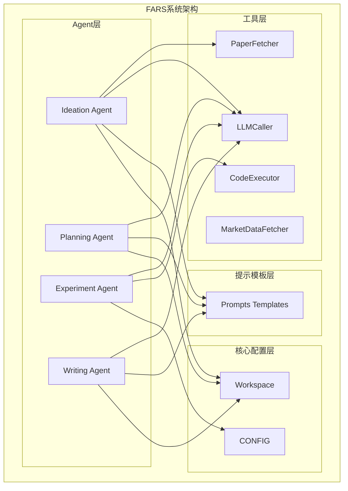

**图表来源**
- [src/agents/agents.py:23-195](file://src/agents/agents.py#L23-L195)
- [src/tools/fetchers.py:20-163](file://src/tools/fetchers.py#L20-L163)
- [src/prompts/templates.py:8-23](file://src/prompts/templates.py#L8-L23)

**章节来源**
- [AGENTS.md:18-57](file://AGENTS.md#L18-L57)
- [README.md:420-500](file://README.md#L420-L500)

## 核心组件

### Ideation Agent类

Ideation Agent是系统的核心智能体，实现了完整的假设生成流程。该类包含以下关键方法：

- **search_papers()**：执行论文搜索，支持arXiv和Semantic Scholar双数据源
- **analyze_paper()**：对单篇论文进行深度分析
- **generate_ideas()**：从论文生成交易假设
- **run_full_pipeline()**：执行完整的论文到假设流程

### PaperFetcher类

负责从多个学术数据源获取论文信息，支持：
- **arXiv API**：获取量化金融相关的论文
- **Semantic Scholar API**：获取论文的引用信息和影响力指标
- **PDF下载**：支持论文PDF文件的下载和存储

### LLMCaller类

提供统一的LLM调用接口，支持多种提供商：
- **OpenAI**：GPT系列模型
- **Anthropic**：Claude系列模型  
- **DeepSeek**：深度求索模型
- **MiniMax**：MiniMax-M2.7-highspeed
- **Ollama**：本地模型部署

**章节来源**
- [src/agents/agents.py:23-195](file://src/agents/agents.py#L23-L195)
- [src/tools/fetchers.py:20-163](file://src/tools/fetchers.py#L20-L163)
- [src/tools/fetchers.py:290-449](file://src/tools/fetchers.py#L290-L449)

## 架构概览

Ideation Agent采用分层架构设计，确保了模块间的松耦合和高内聚：

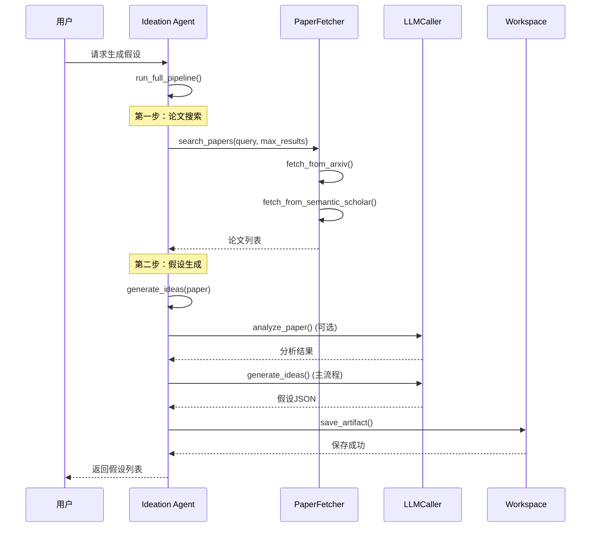

**图表来源**
- [src/agents/agents.py:164-194](file://src/agents/agents.py#L164-L194)
- [src/agents/agents.py:42-85](file://src/agents/agents.py#L42-L85)
- [src/agents/agents.py:118-162](file://src/agents/agents.py#L118-L162)

### 数据流架构

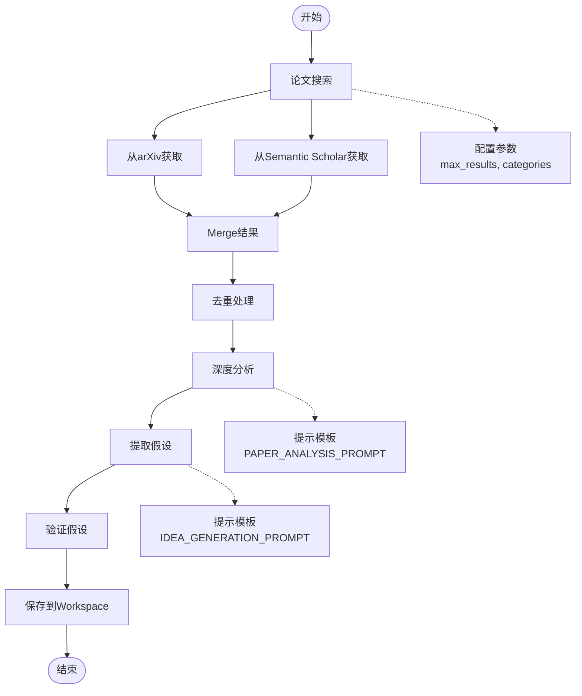

**图表来源**
- [src/agents/agents.py:42-85](file://src/agents/agents.py#L42-L85)
- [src/agents/agents.py:87-162](file://src/agents/agents.py#L87-L162)
- [src/prompts/templates.py:28-85](file://src/prompts/templates.py#L28-L85)

## 详细组件分析

### 论文搜索机制

#### 双数据源架构

Ideation Agent实现了双数据源的论文搜索机制，确保获取最全面的学术资源：

```mermaid
classDiagram
class PaperFetcher {
+fetch_from_arxiv(query, max_results, categories)
+fetch_from_semantic_scholar(query, max_results, fields)
+download_paper_pdf(arxiv_id, filename)
+parse_paper_to_json(paper_info)
-_clean_text(text)
}
class ArxivSource {
+Search(query, max_results, sort_by)
+Client()
+results(search)
+entry_id
+title
+authors
+summary
+published
+updated
+categories
+pdf_url
}
class SemanticScholarSource {
+api_url : "https : //api.semanticscholar.org/graph/v1/paper/search"
+params : {query, limit, fields}
+response.json()
+data[]
+title
+authors
+abstract
+year
+openAccessPdf
+citationCount
+arxivId
}
PaperFetcher --> ArxivSource : "使用"
PaperFetcher --> SemanticScholarSource : "使用"
```

**图表来源**
- [src/tools/fetchers.py:20-163](file://src/tools/fetchers.py#L20-L163)

#### 搜索参数配置

| 参数 | 默认值 | 说明 | arXiv支持 | Semantic Scholar支持 |
|------|--------|------|-----------|---------------------|
| query | 必填 | 搜索关键词 | ✓ | ✓ |
| max_results | 20 | 最大结果数 | ✓ | ✓ |
| categories | ["q-fin.PM","cs.LG"] | arXiv分类过滤 | ✓ | - |
| fields | ["title","authors","abstract"] | 字段选择 | - | ✓ |

**章节来源**
- [src/agents/agents.py:42-85](file://src/agents/agents.py#L42-L85)
- [src/tools/fetchers.py:27-120](file://src/tools/fetchers.py#L27-L120)

### 深度分析算法

#### 论文分析流程

Ideation Agent使用专门的提示模板对论文进行深度分析：

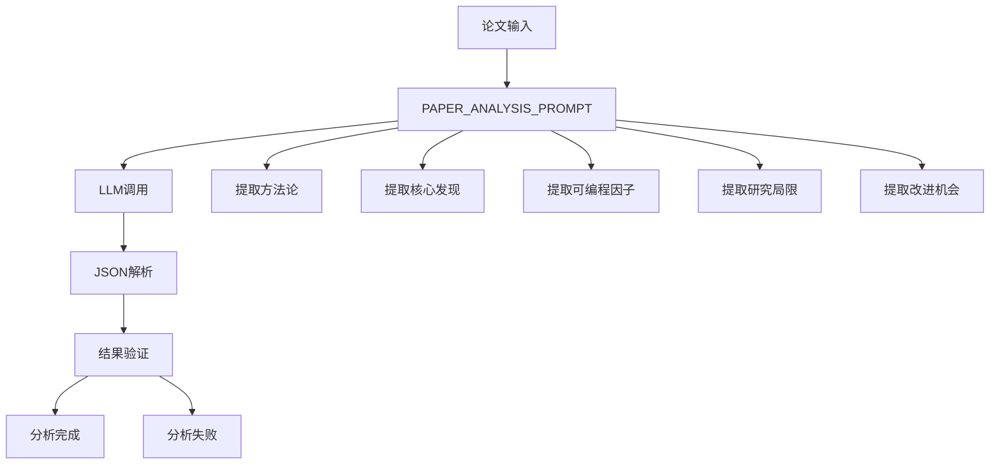

**图表来源**
- [src/agents/agents.py:87-117](file://src/agents/agents.py#L87-L117)
- [src/prompts/templates.py:88-155](file://src/prompts/templates.py#L88-L155)

#### 分析结果结构

分析结果包含以下关键信息：

| 组件 | 描述 | 示例 |
|------|------|------|
| methodology | 方法论类型 | "机器学习/统计/深度学习" |
| steps | 关键算法步骤 | ["特征工程", "模型训练", "验证评估"] |
| data_requirements | 数据需求 | ["高频数据", "基本面数据"] |
| key_findings | 核心发现 | 3-5个有数据支撑的发现 |
| extractable_factors | 可编程因子 | LaTeX公式和实现提示 |
| limitations | 研究局限 | 假设和限制条件 |
| improvement_opportunities | 改进机会 | 可能的改进方向 |

**章节来源**
- [src/agents/agents.py:87-117](file://src/agents/agents.py#L87-L117)
- [src/prompts/templates.py:88-155](file://src/prompts/templates.py#L88-L155)

### 假设生成逻辑

#### 假设生成流程

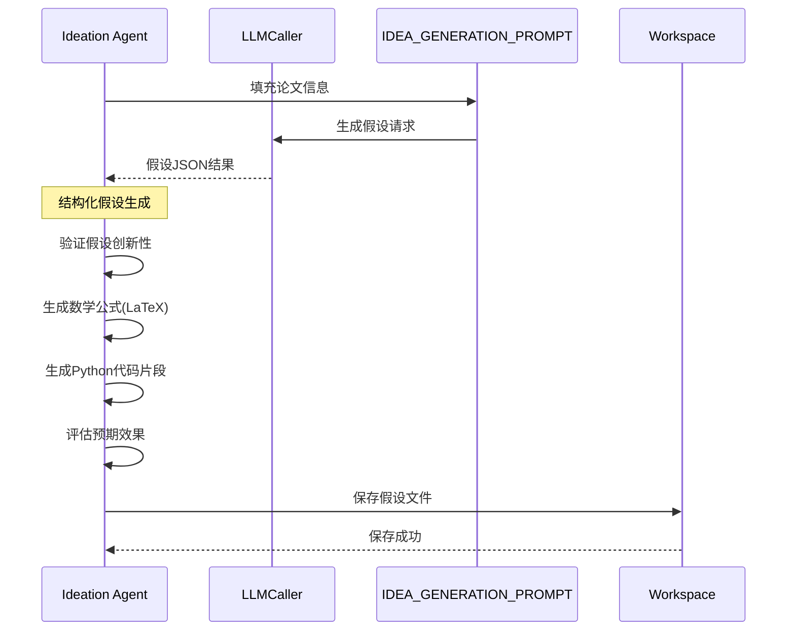

**图表来源**
- [src/agents/agents.py:118-162](file://src/agents/agents.py#L118-L162)
- [src/prompts/templates.py:28-85](file://src/prompts/templates.py#L28-L85)

#### 假设结构规范

每个生成的假设都遵循统一的JSON结构：

| 字段 | 类型 | 必填 | 描述 |
|------|------|------|------|
| paper_id | string | ✓ | 论文ID |
| ideas | array | ✓ | 假设数组 |
| literature_review | string | - | 文献关系说明 |
| research_gaps | string | - | 研究空白说明 |

**章节来源**
- [src/agents/agents.py:118-162](file://src/agents/agents.py#L118-L162)
- [src/prompts/templates.py:28-85](file://src/prompts/templates.py#L28-L85)

### 提示词模板使用

#### 系统提示设计

SCIENTIFIC_AGENT_SYSTEM_PROMPT为所有Agent提供了统一的专业指导：

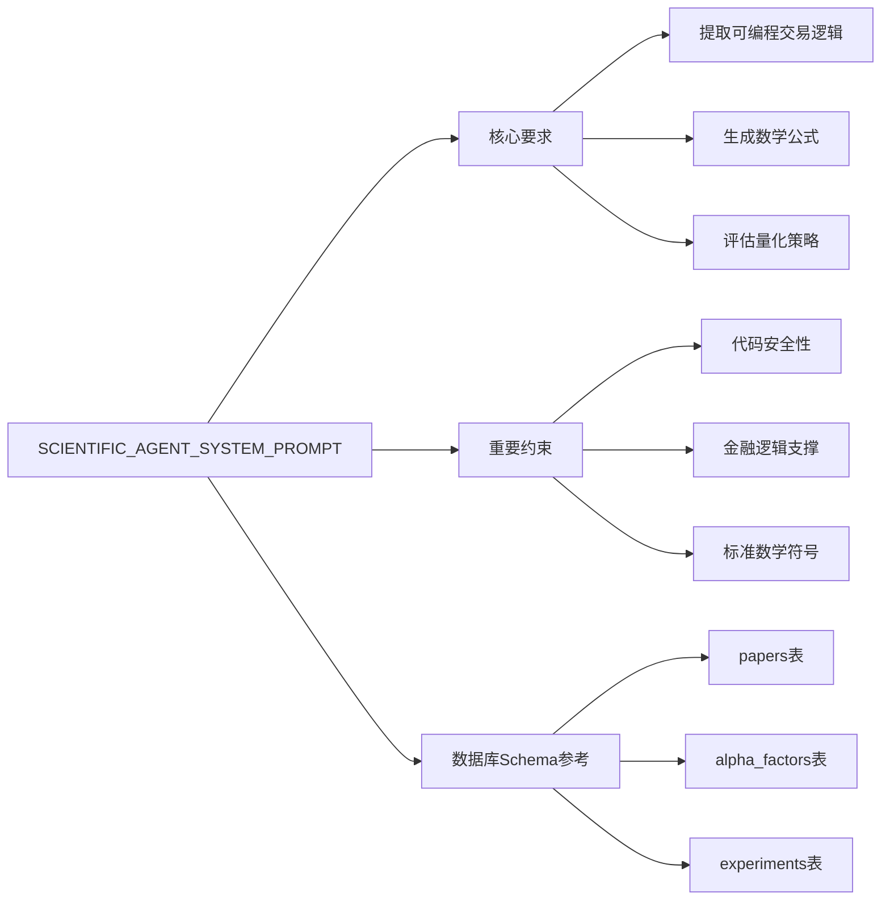

**图表来源**
- [src/prompts/templates.py:8-23](file://src/prompts/templates.py#L8-L23)

#### 模板填充机制

提示模板使用Python的format()方法进行动态填充：

| 模板类型 | 填充字段 | 用途 |
|----------|----------|------|
| IDEA_GENERATION_PROMPT | title, authors, year, abstract | 生成交易假设 |
| PAPER_ANALYSIS_PROMPT | title, abstract, methodology | 深度论文分析 |
| EXPERIMENT_PLANNING_PROMPT | idea_summary, idea_details | 实验计划制定 |
| CODE_GENERATION_PROMPT | experiment_plan | 回测代码生成 |

**章节来源**
- [src/prompts/templates.py:8-23](file://src/prompts/templates.py#L8-L23)
- [src/prompts/templates.py:679-707](file://src/prompts/templates.py#L679-L707)

### LLM调用流程

#### 统一调用接口

LLMCaller提供了统一的LLM调用接口，支持多种提供商的自动切换：

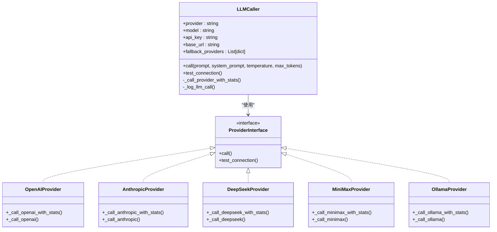

**图表来源**
- [src/tools/fetchers.py:290-449](file://src/tools/fetchers.py#L290-L449)
- [src/tools/fetchers.py:451-501](file://src/tools/fetchers.py#L451-L501)

#### 备用提供商机制

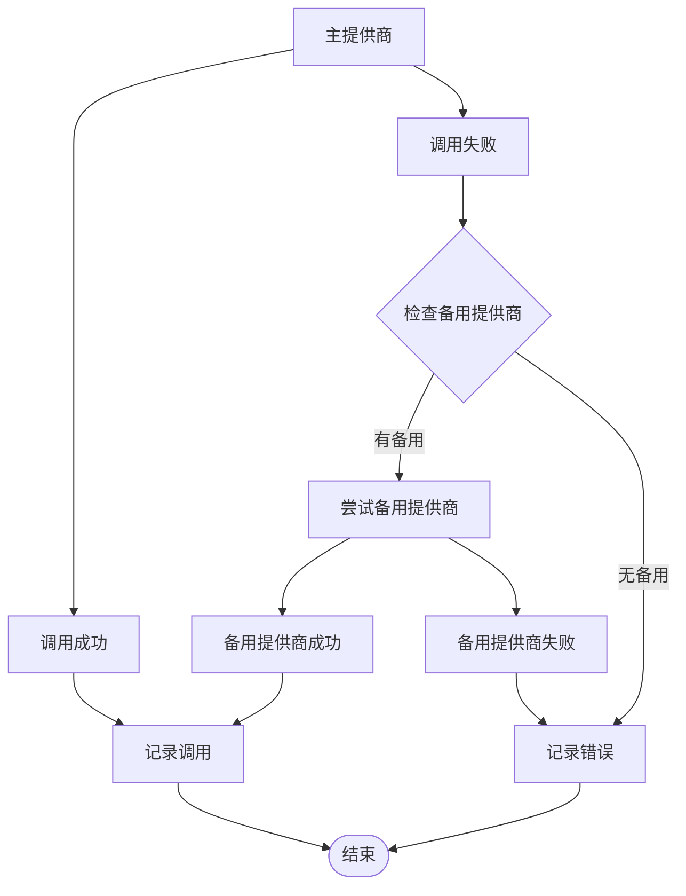

**图表来源**
- [src/tools/fetchers.py:415-449](file://src/tools/fetchers.py#L415-L449)

**章节来源**
- [src/tools/fetchers.py:290-449](file://src/tools/fetchers.py#L290-L449)
- [src/tools/fetchers.py:451-501](file://src/tools/fetchers.py#L451-L501)

### JSON解析机制

#### 结构化输出处理

Ideation Agent使用正则表达式提取JSON结构：

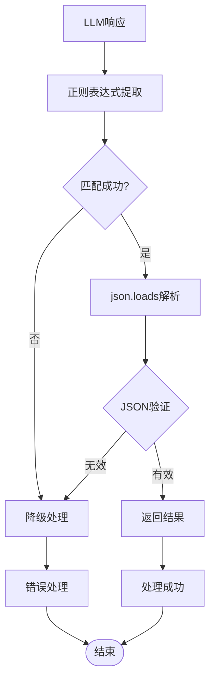

**图表来源**
- [src/agents/agents.py:107-116](file://src/agents/agents.py#L107-L116)
- [src/agents/agents.py:146-161](file://src/agents/agents.py#L146-L161)

#### 错误处理策略

| 错误类型 | 处理方式 | 返回值 |
|----------|----------|--------|
| JSON解析失败 | 返回错误信息 | {"error": "Failed to parse analysis result"} |
| LLM调用失败 | 返回错误信息 | {"error": "Failed to generate ideas"} |
| 空结果 | 返回空列表 | [] |
| 网络异常 | 重试机制 | None |

**章节来源**
- [src/agents/agents.py:107-116](file://src/agents/agents.py#L107-L116)
- [src/agents/agents.py:146-161](file://src/agents/agents.py#L146-L161)

## 依赖关系分析

### 组件耦合度

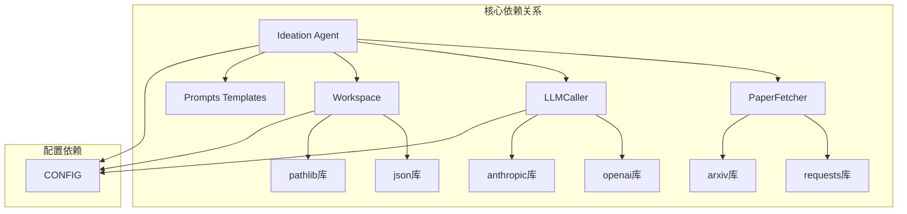

**图表来源**
- [src/agents/agents.py:12-21](file://src/agents/agents.py#L12-L21)
- [src/tools/fetchers.py:6-16](file://src/tools/fetchers.py#L6-L16)
- [src/core/config.py:388-417](file://src/core/config.py#L388-L417)

### 外部依赖

| 依赖库 | 版本 | 用途 | 安装方式 |
|--------|------|------|----------|
| arxiv | 最新 | arXiv API调用 | pip install arxiv |
| requests | 最新 | HTTP请求 | pip install requests |
| openai | 最新 | OpenAI API | pip install openai |
| anthropic | 最新 | Anthropic API | pip install anthropic |
| backtrader | 可选 | 回测框架 | pip install backtrader |
| yfinance | 可选 | 美股数据 | pip install yfinance |
| akshare | 可选 | A股数据 | pip install akshare |

**章节来源**
- [src/agents/agents.py:12-21](file://src/agents/agents.py#L12-L21)
- [src/tools/fetchers.py:6-16](file://src/tools/fetchers.py#L6-L16)

## 性能考量

### 搜索性能优化

| 优化策略 | 实现方式 | 性能提升 |
|----------|----------|----------|
| 并行搜索 | 同时调用arXiv和Semantic Scholar | 减少总等待时间 |
| 结果去重 | 基于arxiv_id或标题前缀去重 | 减少重复处理 |
| 分类过滤 | arXiv分类预过滤 | 提高相关性 |
| 缓存机制 | 临时缓存搜索结果 | 避免重复搜索 |

### LLM调用优化

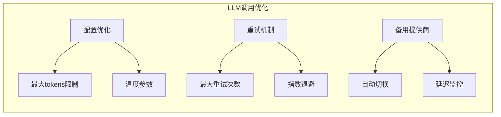

**图表来源**
- [src/tools/fetchers.py:391-449](file://src/tools/fetchers.py#L391-L449)

### 内存管理

- **批量处理**：支持批量论文处理，减少内存峰值
- **渐进式保存**：分析结果和假设逐步保存到Workspace
- **超时控制**：LLM调用设置超时，防止长时间阻塞
- **错误隔离**：单篇论文失败不影响整体流程

## 故障排除指南

### 常见问题及解决方案

#### 论文搜索问题

| 问题 | 症状 | 解决方案 |
|------|------|----------|
| arXiv API错误 | "Error fetching from arXiv" | 检查网络连接，重试请求 |
| Semantic Scholar限制 | API调用频率过高 | 降低请求频率，添加延时 |
| 结果为空 | 搜索关键词过于宽泛 | 缩小搜索范围，增加限定词 |
| 去重失败 | 重复论文过多 | 检查去重算法，优化匹配规则 |

#### LLM调用问题

| 问题 | 症状 | 解决方案 |
|------|------|----------|
| API Key错误 | 认证失败 | 检查环境变量设置 |
| 超时错误 | LLM响应超时 | 增加超时时间，检查网络 |
| JSON解析失败 | 假设生成失败 | 检查提示模板格式 |
| 备用提供商不可用 | 自动切换失败 | 配置正确的备用URL |

#### JSON处理问题

| 问题 | 症状 | 解决方案 |
|------|------|----------|
| 正则匹配失败 | 无法提取JSON | 检查响应格式，调整正则表达式 |
| JSON格式错误 | json.loads异常 | 验证提示模板输出格式 |
| 编码问题 | UnicodeDecodeError | 设置ensure_ascii=False |

**章节来源**
- [src/agents/agents.py:107-116](file://src/agents/agents.py#L107-L116)
- [src/agents/agents.py:146-161](file://src/agents/agents.py#L146-L161)
- [src/tools/fetchers.py:415-449](file://src/tools/fetchers.py#L415-L449)

### 调试技巧

1. **启用详细日志**：检查Workspace中的日志文件
2. **验证API Key**：使用test_llm_connection()方法测试连接
3. **检查网络连接**：确认arXiv和Semantic Scholar API可达
4. **验证提示模板**：确保模板格式正确，变量替换完整
5. **监控LLM调用**：查看llm_call_logs.json中的调用记录

## 结论

Ideation Agent作为FARS系统的核心组件，成功实现了从学术论文到可执行交易假设的自动化转换。该智能体具有以下特点：

**技术优势**：
- **双数据源架构**：确保论文获取的全面性和准确性
- **模块化设计**：各组件职责明确，便于维护和扩展
- **容错机制**：完善的错误处理和重试策略
- **标准化输出**：统一的假设结构，便于后续处理

**业务价值**：
- **提高效率**：自动化论文分析和假设生成
- **保证质量**：结构化的输出格式和验证机制
- **降低成本**：减少人工分析成本
- **加速创新**：快速产生可验证的交易假设

**未来发展方向**：
- **多模态分析**：支持图表和公式的理解
- **知识图谱**：构建论文间的关系网络
- **个性化定制**：根据不同用户需求调整分析重点
- **实时更新**：持续跟踪最新的研究成果

## 附录

### 实际使用案例

#### 从种子论文生成交易假设

```python
# 示例：使用Ideation Agent从种子论文生成假设
from src.agents.agents import IdeationAgent
from src.core.config import Workspace

# 初始化智能体
workspace = Workspace()
agent = IdeationAgent(workspace=workspace)

# 定义搜索查询
query = "Transformer-based momentum trading"

# 执行完整流程
ideas = agent.run_full_pipeline(
    query=query,
    max_papers=5
)

print(f"生成了 {len(ideas)} 个假设")
for i, idea in enumerate(ideas):
    print(f"假设 {i+1}: {idea['ideas'][0]['title']}")
```

#### 与其他Agent的协作

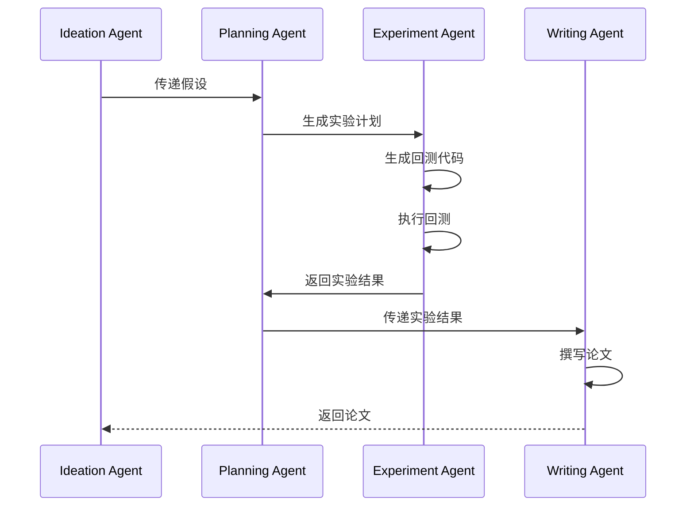

**图表来源**
- [src/agents/agents.py:197-738](file://src/agents/agents.py#L197-L738)

### 配置参数说明

| 参数 | 类型 | 默认值 | 说明 |
|------|------|--------|------|
| llm.provider | string | "minimax" | LLM提供商 |
| llm.model | string | "MiniMax-M2.7-highspeed" | 模型名称 |
| llm.temperature | float | 0.7 | 采样温度 |
| llm.max_tokens | int | 4096 | 最大输出tokens |
| backtest.initial_cash | float | 1000000.0 | 初始资金 |
| backtest.commission | float | 0.001 | 佣金费率 |
| evaluation.min_sharpe_ratio | float | 1.5 | 最小夏普比率 |
| evaluation.max_drawdown_threshold | float | -0.25 | 最大回撤阈值 |

**章节来源**
- [src/core/config.py:388-417](file://src/core/config.py#L388-L417)
- [src/tools/backtest.py:181-221](file://src/tools/backtest.py#L181-L221)