# Planning Agent（实验规划智能体）

<cite>
**本文档引用的文件**
- [src/agents/agents.py](file://src/agents/agents.py)
- [src/prompts/templates.py](file://src/prompts/templates.py)
- [src/tools/backtest.py](file://src/tools/backtest.py)
- [src/core/config.py](file://src/core/config.py)
- [src/main.py](file://src/main.py)
- [src/workflow.py](file://src/workflow.py)
- [config.json](file://config.json)
- [requirements.txt](file://requirements.txt)
</cite>

## 目录
1. [简介](#简介)
2. [项目结构](#项目结构)
3. [核心组件](#核心组件)
4. [架构概览](#架构概览)
5. [详细组件分析](#详细组件分析)
6. [依赖关系分析](#依赖关系分析)
7. [性能考虑](#性能考虑)
8. [故障排除指南](#故障排除指南)
9. [结论](#结论)

## 简介

Planning Agent（实验规划智能体）是FARS（Fully Automated Research System）系统中的核心组件之一，专门负责将理论假设转化为可执行的实验方案。该智能体能够：

- 将学术论文中的量化假设转化为详细的实验计划
- 设计对照实验和基准测试
- 设定评估指标和成功标准
- 规划实验步骤和数据需求
- 实现计划优化机制和反馈循环
- 管理实验版本控制和迭代

该智能体采用多智能体协作架构，与Ideation Agent、Experiment Agent、Writing Agent和Critique Agent协同工作，形成完整的自动化研究流水线。

## 项目结构

FARS系统采用模块化设计，主要包含以下核心模块：

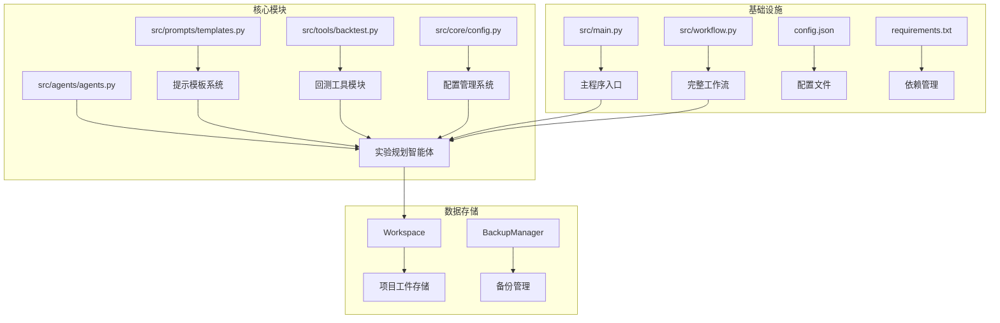

**图表来源**
- [src/agents/agents.py:197-277](file://src/agents/agents.py#L197-L277)
- [src/prompts/templates.py:158-234](file://src/prompts/templates.py#L158-L234)
- [src/tools/backtest.py:181-327](file://src/tools/backtest.py#L181-L327)

**章节来源**
- [src/agents/agents.py:197-277](file://src/agents/agents.py#L197-L277)
- [src/prompts/templates.py:158-234](file://src/prompts/templates.py#L158-L234)
- [src/tools/backtest.py:181-327](file://src/tools/backtest.py#L181-L327)

## 核心组件

### Planning Agent 主要职责

Planning Agent作为实验规划的核心，承担以下关键职责：

1. **假设到计划的转换**：将Ideation Agent生成的理论假设转化为可执行的实验计划
2. **实验设计**：设计对照实验、基准测试和参数扫描
3. **指标设定**：定义评估指标和成功标准
4. **步骤规划**：规划实验执行的具体步骤和数据需求
5. **优化机制**：实现计划的迭代优化和反馈循环

### 实验计划模板系统

系统提供了完整的实验计划模板，支持多种实验类型的设计：

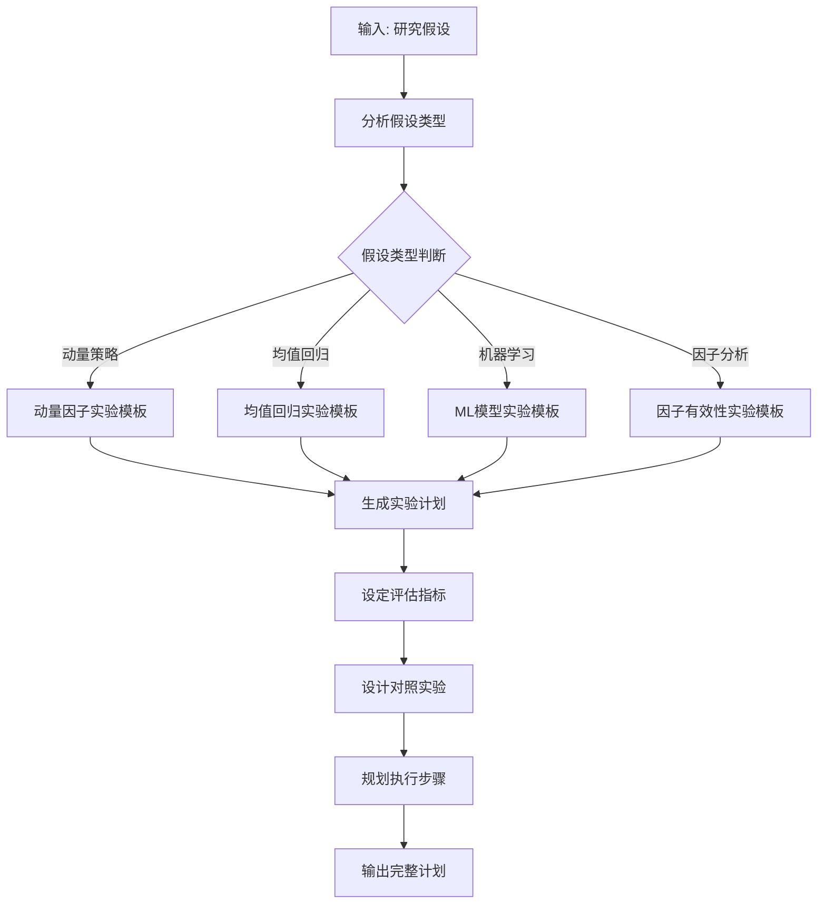

**图表来源**
- [src/prompts/templates.py:158-234](file://src/prompts/templates.py#L158-L234)
- [src/agents/agents.py:215-255](file://src/agents/agents.py#L215-L255)

**章节来源**
- [src/agents/agents.py:197-277](file://src/agents/agents.py#L197-L277)
- [src/prompts/templates.py:158-234](file://src/prompts/templates.py#L158-L234)

## 架构概览

### 多智能体协作架构

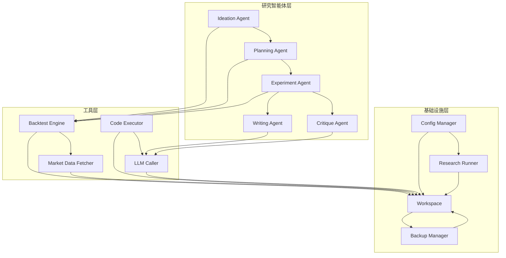

**图表来源**
- [src/agents/agents.py:23-738](file://src/agents/agents.py#L23-L738)
- [src/core/config.py:256-384](file://src/core/config.py#L256-L384)

### 实验规划流程

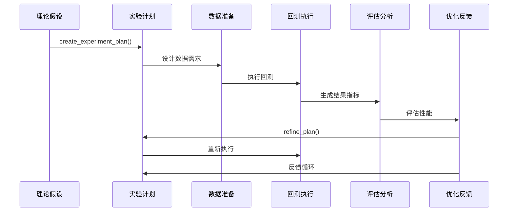

**图表来源**
- [src/agents/agents.py:215-277](file://src/agents/agents.py#L215-L277)
- [src/agents/agents.py:464-496](file://src/agents/agents.py#L464-L496)

## 详细组件分析

### Planning Agent 类实现

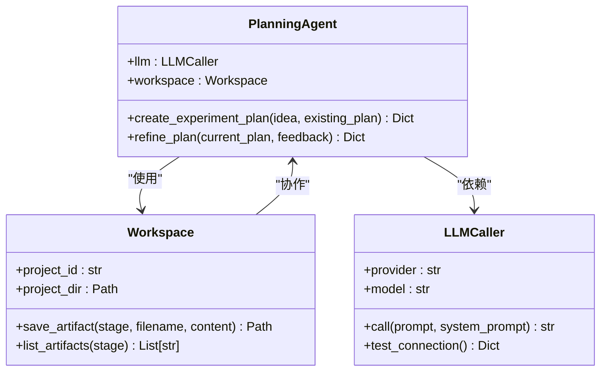

**图表来源**
- [src/agents/agents.py:197-277](file://src/agents/agents.py#L197-L277)
- [src/core/config.py:256-384](file://src/core/config.py#L256-L384)

#### 核心方法详解

**create_experiment_plan 方法**

该方法是Planning Agent的核心，负责将假设转化为详细的实验计划：

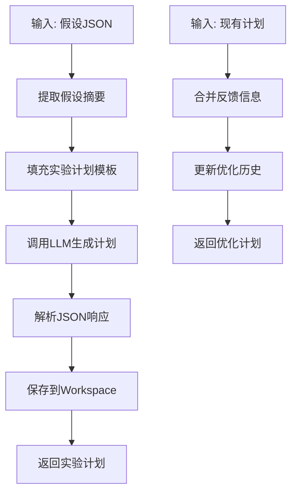

**图表来源**
- [src/agents/agents.py:215-255](file://src/agents/agents.py#L215-L255)

**refine_plan 方法**

实现计划的迭代优化和反馈循环：

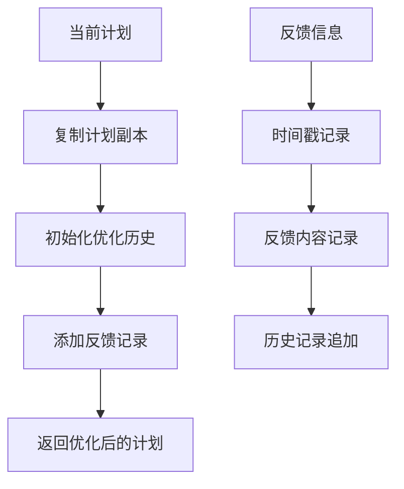

**图表来源**
- [src/agents/agents.py:257-277](file://src/agents/agents.py#L257-L277)

**章节来源**
- [src/agents/agents.py:197-277](file://src/agents/agents.py#L197-L277)

### 实验计划模板系统

#### 实验计划结构定义

系统提供了标准化的实验计划模板，包含以下关键字段：

| 字段 | 类型 | 描述 | 示例 |
|------|------|------|------|
| experiment_id | string | 实验唯一标识符 | "exp_001" |
| hypothesis | string | 研究假设描述 | "基于Transformer的动量交易策略" |
| objectives | array[string] | 实验目标列表 | ["验证夏普比率>1.5", "最大回撤<25%"] |
| data_config | object | 数据配置 | 股票池、时间范围、频率 |
| backtest_config | object | 回测配置 | 框架、初始资金、佣金 |
| evaluation_metrics | object | 评估指标阈值 | 夏普比率、最大回撤、IC值 |
| steps | array[object] | 实验步骤 | 数据准备、因子计算、回测执行 |
| alternative_strategies | array[string] | 备选策略 | 基准策略、替代因子 |

#### 评估指标体系

系统实现了完整的量化投资评估指标体系：

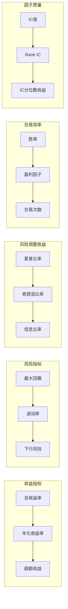

**图表来源**
- [src/tools/backtest.py:24-52](file://src/tools/backtest.py#L24-L52)
- [src/tools/backtest.py:351-432](file://src/tools/backtest.py#L351-L432)

**章节来源**
- [src/tools/backtest.py:24-52](file://src/tools/backtest.py#L24-L52)
- [src/tools/backtest.py:351-432](file://src/tools/backtest.py#L351-L432)

### 实验步骤设计

#### 标准化实验流程

系统定义了标准化的实验执行流程：

1. **数据准备阶段**
   - 数据源选择和验证
   - 股票池构建和筛选
   - 时间范围确定和数据清洗

2. **因子计算阶段**
   - 基础因子生成
   - 复合因子构建
   - 因子质量检验

3. **回测执行阶段**
   - 交易策略实施
   - 风险控制执行
   - 交易成本计算

4. **结果评估阶段**
   - 指标计算和分析
   - 统计显著性检验
   - 结果可视化

#### 对照实验设计

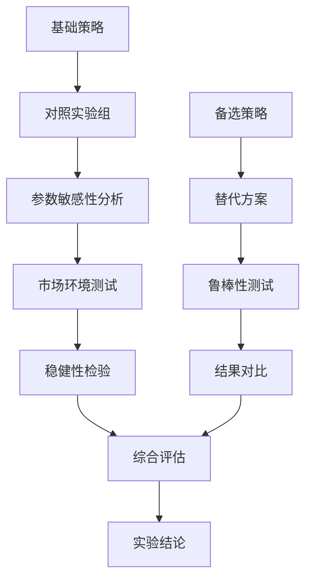

**图表来源**
- [src/prompts/templates.py:178-234](file://src/prompts/templates.py#L178-L234)

**章节来源**
- [src/prompts/templates.py:178-234](file://src/prompts/templates.py#L178-L234)

### 计划优化机制

#### 反馈循环实现

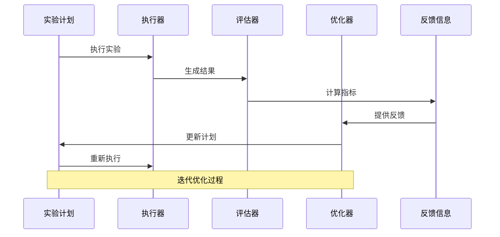

#### 版本控制管理

系统实现了实验计划的版本控制机制：

| 版本字段 | 用途 | 示例 |
|----------|------|------|
| refinement_history | 优化历史记录 | 每次反馈的时间戳和内容 |
| experiment_id | 实验标识符 | exp_001_20260620_131657 |
| version | 版本号 | 1.0, 1.1, 2.0 |
| last_updated | 更新时间 | ISO格式时间戳 |
| status | 当前状态 | draft, active, archived |

**章节来源**
- [src/agents/agents.py:257-277](file://src/agents/agents.py#L257-L277)

## 依赖关系分析

### 核心依赖关系

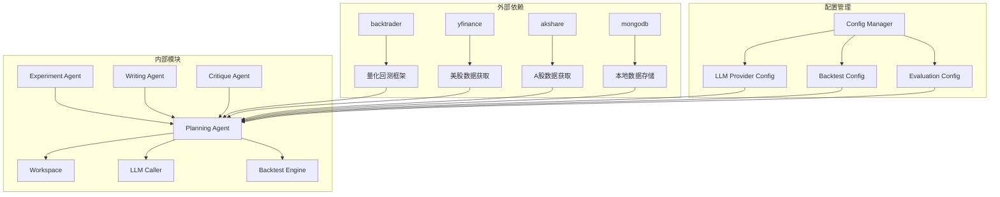

**图表来源**
- [requirements.txt:1-39](file://requirements.txt#L1-L39)
- [src/core/config.py:206-251](file://src/core/config.py#L206-L251)

### 关键配置参数

#### LLM Provider 配置

| 参数 | 默认值 | 说明 |
|------|--------|------|
| provider | minimax | LLM提供商选择 |
| model | MiniMax-M2.7-highspeed | 模型名称 |
| temperature | 0.7 | 采样温度 |
| max_tokens | 32000 | 最大生成tokens |
| base_url | API基础URL | 服务端点 |

#### 回测配置

| 参数 | 默认值 | 说明 |
|------|--------|------|
| framework | backtrader | 回测框架 |
| default_frequency | 1d | 默认数据频率 |
| benchmark | 000300.SS | 基准指数 |
| initial_cash | 1000000 | 初始资金 |
| commission | 0.001 | 交易佣金 |

#### 评估阈值配置

| 指标 | 默认阈值 | 说明 |
|------|----------|------|
| min_sharpe_ratio | 1.5 | 最小夏普比率 |
| max_drawdown_threshold | -0.25 | 最大回撤阈值 |
| min_ic | 0.02 | 最小信息系数 |

**章节来源**
- [src/core/config.py:388-417](file://src/core/config.py#L388-L417)
- [config.json:1-65](file://config.json#L1-L65)

## 性能考虑

### 实验执行性能优化

1. **数据缓存策略**
   - 实验数据本地缓存
   - 回测结果增量更新
   - 中间结果持久化

2. **并行执行机制**
   - 多因子并行计算
   - 参数网格并行测试
   - 结果汇总并行处理

3. **内存管理**
   - 大数据集分块处理
   - 内存使用监控
   - 及时释放临时对象

### LLM调用优化

1. **提示模板优化**
   - 结构化提示格式
   - 关键信息前置
   - 减少上下文冗余

2. **调用频率控制**
   - API速率限制
   - 错误重试机制
   - 成本控制策略

## 故障排除指南

### 常见问题及解决方案

#### 实验计划生成失败

**问题症状**：LLM无法生成有效的实验计划JSON

**可能原因**：
1. 提示模板格式错误
2. LLM响应解析失败
3. 假设信息不完整

**解决方案**：
1. 检查提示模板完整性
2. 验证输入数据格式
3. 增加重试机制

#### 回测执行异常

**问题症状**：回测过程中出现错误

**可能原因**：
1. 数据质量问题
2. 策略逻辑错误
3. 环境配置问题

**解决方案**：
1. 数据质量检查
2. 策略单元测试
3. 环境依赖验证

#### 评估指标异常

**问题症状**：计算的评估指标不符合预期

**可能原因**：
1. 指标计算公式错误
2. 数据处理偏差
3. 阈值设置不当

**解决方案**：
1. 指标公式验证
2. 数据处理流程检查
3. 阈值合理性评估

**章节来源**
- [src/agents/agents.py:464-496](file://src/agents/agents.py#L464-L496)
- [src/tools/backtest.py:248-327](file://src/tools/backtest.py#L248-L327)

## 结论

Planning Agent作为FARS系统的核心组件，成功实现了从理论假设到可执行实验方案的自动化转换。通过标准化的实验计划模板、完善的评估指标体系和智能化的优化机制，该智能体为量化金融研究提供了强大的技术支持。

### 主要优势

1. **标准化流程**：建立了从假设到实验的完整标准化流程
2. **智能化设计**：利用LLM技术实现智能实验设计
3. **完整指标体系**：涵盖了量化投资的全维度评估指标
4. **反馈优化机制**：实现了持续改进的闭环系统

### 应用前景

该智能体不仅适用于量化金融研究，还可扩展到其他需要实验验证的学术领域，为科学研究提供自动化的实验设计和验证支持。