# Writing Agent（论文撰写智能体）

<cite>
**本文档引用的文件**
- [src/main.py](file://src/main.py)
- [src/workflow.py](file://src/workflow.py)
- [src/fars_research.py](file://src/fars_research.py)
- [src/core/config.py](file://src/core/config.py)
- [src/prompts/templates.py](file://src/prompts/templates.py)
- [src/tools/fetchers.py](file://src/tools/fetchers.py)
- [src/core/pdf_compiler.py](file://src/core/pdf_compiler.py)
- [src/core/research_runner.py](file://src/core/research_runner.py)
- [src/core/research_graphs.py](file://src/core/research_graphs.py)
- [src/core/paper_extractor.py](file://src/core/paper_extractor.py)
- [src/tools/literature_review_engine.py](file://src/tools/literature_review_engine.py)
- [requirements.txt](file://requirements.txt)
</cite>

## 目录
1. [简介](#简介)
2. [项目结构](#项目结构)
3. [核心组件](#核心组件)
4. [架构总览](#架构总览)
5. [详细组件分析](#详细组件分析)
6. [依赖关系分析](#依赖关系分析)
7. [性能考虑](#性能考虑)
8. [故障排除指南](#故障排除指南)
9. [结论](#结论)
10. [附录](#附录)

## 简介
本项目为“Writing Agent（论文撰写智能体）”，旨在实现从量化研究到学术论文的全流程自动化：基于实验结果生成学术论文、LaTeX格式转换、图表自动生成、引用格式处理、LaTeX编译流程、元数据管理与质量控制。系统采用模块化设计，支持多研究方向（量化金融、计算机视觉、强化学习），具备工作流编排、LLM多Provider切换、研究图谱构建、文献综述生成等功能。

## 项目结构
项目采用分层架构，核心模块包括：
- 应用入口与工作流编排：src/main.py、src/workflow.py
- 研究与论文生命周期管理：src/fars_research.py
- 配置与工作空间：src/core/config.py
- 提示词模板与论文生成：src/prompts/templates.py
- 数据与工具：src/tools/fetchers.py、src/core/pdf_compiler.py、src/core/research_runner.py、src/core/research_graphs.py、src/core/paper_extractor.py、src/tools/literature_review_engine.py
- 依赖声明：requirements.txt

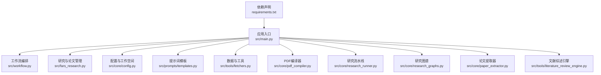

**图表来源**
- [src/main.py:1-521](file://src/main.py#L1-L521)
- [src/workflow.py:1-286](file://src/workflow.py#L1-L286)
- [src/fars_research.py:1-569](file://src/fars_research.py#L1-L569)
- [src/core/config.py:1-563](file://src/core/config.py#L1-L563)
- [src/prompts/templates.py:1-758](file://src/prompts/templates.py#L1-L758)
- [src/tools/fetchers.py:1-899](file://src/tools/fetchers.py#L1-L899)
- [src/core/pdf_compiler.py:1-175](file://src/core/pdf_compiler.py#L1-L175)
- [src/core/research_runner.py:1-1130](file://src/core/research_runner.py#L1-L1130)
- [src/core/research_graphs.py:1-264](file://src/core/research_graphs.py#L1-L264)
- [src/core/paper_extractor.py:1-398](file://src/core/paper_extractor.py#L1-L398)
- [src/tools/literature_review_engine.py:1-850](file://src/tools/literature_review_engine.py#L1-L850)
- [requirements.txt:1-39](file://requirements.txt#L1-L39)

**章节来源**
- [src/main.py:1-521](file://src/main.py#L1-L521)
- [src/workflow.py:1-286](file://src/workflow.py#L1-L286)
- [src/fars_research.py:1-569](file://src/fars_research.py#L1-L569)
- [src/core/config.py:1-563](file://src/core/config.py#L1-L563)
- [src/prompts/templates.py:1-758](file://src/prompts/templates.py#L1-L758)
- [src/tools/fetchers.py:1-899](file://src/tools/fetchers.py#L1-L899)
- [src/core/pdf_compiler.py:1-175](file://src/core/pdf_compiler.py#L1-L175)
- [src/core/research_runner.py:1-1130](file://src/core/research_runner.py#L1-L1130)
- [src/core/research_graphs.py:1-264](file://src/core/research_graphs.py#L1-L264)
- [src/core/paper_extractor.py:1-398](file://src/core/paper_extractor.py#L1-L398)
- [src/tools/literature_review_engine.py:1-850](file://src/tools/literature_review_engine.py#L1-L850)
- [requirements.txt:1-39](file://requirements.txt#L1-L39)

## 核心组件
- FARS主控制器：负责研究方向初始化、LLM调用器配置、论文搜索、分析、假设生成、论文生成、工作流执行与状态管理。
- 工作流控制器：负责LaTeX论文检查、PDF编译指导、AI检测绕过指引、投稿平台准备与ICML邮箱投稿准备。
- 研究数据库与拓扑：管理假设、实验、论文的生命周期，维护研究拓扑结构，提供统计与导出。
- 配置与工作空间：统一管理研究方向、LLM Provider、日志、备份、项目目录结构与工件存储。
- 提示词模板：定义论文生成、文献综述、评审修订等任务的提示词模板。
- 数据与工具：论文抓取、市场数据获取、LLM调用器（多Provider自动切换）、PDF编译器（Markdown→PDF）、研究图谱构建、论文文本提取与分析。
- 文献综述引擎：STORM风格的多视角生成、问题生成、证据收集、大纲生成与文献综述章节生成。

**章节来源**
- [src/main.py:35-440](file://src/main.py#L35-L440)
- [src/workflow.py:19-286](file://src/workflow.py#L19-L286)
- [src/fars_research.py:110-484](file://src/fars_research.py#L110-L484)
- [src/core/config.py:256-417](file://src/core/config.py#L256-L417)
- [src/prompts/templates.py:355-390](file://src/prompts/templates.py#L355-L390)
- [src/tools/fetchers.py:20-899](file://src/tools/fetchers.py#L20-L899)
- [src/core/pdf_compiler.py:11-175](file://src/core/pdf_compiler.py#L11-L175)
- [src/core/research_runner.py:278-800](file://src/core/research_runner.py#L278-L800)
- [src/core/research_graphs.py:16-264](file://src/core/research_graphs.py#L16-L264)
- [src/core/paper_extractor.py:53-398](file://src/core/paper_extractor.py#L53-L398)
- [src/tools/literature_review_engine.py:18-850](file://src/tools/literature_review_engine.py#L18-L850)

## 架构总览
系统采用“控制器-工具-模板-数据”分层架构：
- 控制器层：FARS主控制器与工作流控制器协调各模块。
- 工具层：PaperFetcher、MarketDataFetcher、LLMCaller、PDF编译器等。
- 模板层：提示词模板驱动论文生成与评审。
- 数据层：研究数据库、工作空间、论文提取与图谱构建。

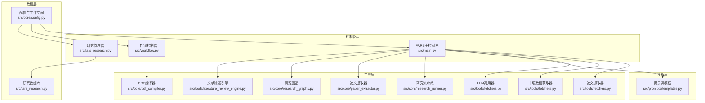

**图表来源**
- [src/main.py:35-440](file://src/main.py#L35-L440)
- [src/workflow.py:19-286](file://src/workflow.py#L19-L286)
- [src/fars_research.py:110-484](file://src/fars_research.py#L110-L484)
- [src/core/config.py:256-417](file://src/core/config.py#L256-L417)
- [src/prompts/templates.py:355-390](file://src/prompts/templates.py#L355-L390)
- [src/tools/fetchers.py:20-899](file://src/tools/fetchers.py#L20-L899)
- [src/core/pdf_compiler.py:11-175](file://src/core/pdf_compiler.py#L11-L175)
- [src/core/research_runner.py:278-800](file://src/core/research_runner.py#L278-L800)
- [src/core/research_graphs.py:16-264](file://src/core/research_graphs.py#L16-L264)
- [src/core/paper_extractor.py:53-398](file://src/core/paper_extractor.py#L53-L398)
- [src/tools/literature_review_engine.py:18-850](file://src/tools/literature_review_engine.py#L18-L850)

## 详细组件分析

### FARS主控制器（论文生成与工作流）
- 功能职责：初始化研究方向与工作空间、配置LLM Provider（支持主备切换）、论文搜索与分析、假设生成、论文生成（LaTeX）、工作流执行与状态记录。
- 关键流程：
  - 初始化：加载配置、创建工作空间、初始化LLM调用器（支持Ollama备选）。
  - 论文搜索：基于arXiv API按研究方向调整分类，返回论文列表。
  - 论文分析：调用LLM解析论文，提取方法论、关键发现、可编程因子等。
  - 假设生成：从论文中生成可验证的交易假设，包含数学公式与Python代码片段。
  - 论文生成：基于实验结果生成LaTeX论文，包含标题、摘要、引言、方法论、实证结果、结论、参考文献与图表清单。
  - 工作流：支持all/search/analyze/generate四种模式，记录步骤日志与状态。
- 质量控制：提示词模板严格约束输出格式（JSON/LaTeX），异常时保存原始响应便于调试。

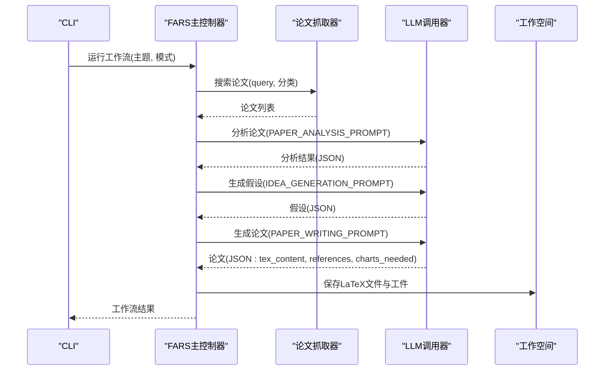

**图表来源**
- [src/main.py:170-427](file://src/main.py#L170-L427)
- [src/prompts/templates.py:88-155](file://src/prompts/templates.py#L88-L155)
- [src/prompts/templates.py:279-305](file://src/prompts/templates.py#L279-L305)
- [src/prompts/templates.py:355-390](file://src/prompts/templates.py#L355-L390)

**章节来源**
- [src/main.py:35-440](file://src/main.py#L35-L440)
- [src/prompts/templates.py:88-155](file://src/prompts/templates.py#L88-L155)
- [src/prompts/templates.py:279-305](file://src/prompts/templates.py#L279-L305)
- [src/prompts/templates.py:355-390](file://src/prompts/templates.py#L355-L390)

### 工作流控制器（LaTeX编译与投稿准备）
- 功能职责：检查LaTeX文件、编译PDF（指导用户使用Overleaf或pdflatex/xelatex）、AI检测绕过指引、paperreview.ai投稿准备、ICML邮箱投稿准备。
- 关键流程：
  - Step1：检查paper.tex是否存在与基本信息。
  - Step2：生成compile_info.json，指导用户使用Overleaf或本地TeX环境编译。
  - Step3：生成ai_bypass_info.json，提供JustDone等工具的使用步骤。
  - Step4：生成paperreview_submission.json，包含登录、上传、填写元数据等步骤。
  - Step5：生成icml_submission.json，包含邮件主题、正文、附件清单与截止日期提醒。
- 用户交互：通过日志文件与JSON输出指导用户完成后续步骤。

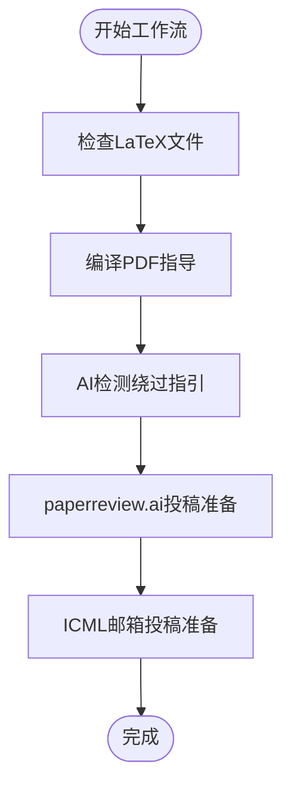

**图表来源**
- [src/workflow.py:38-214](file://src/workflow.py#L38-L214)

**章节来源**
- [src/workflow.py:19-286](file://src/workflow.py#L19-L286)

### 研究数据库与拓扑（假设-实验-论文生命周期）
- 数据模型：Hypothesis、Experiment、Paper、ResearchTopology。
- 数据库操作：增删改查假设、实验、论文；更新拓扑结构；统计成功率、平均质量分、状态分布；导出JSON。
- 拓扑构建：基于假设-实验-论文的关联关系生成节点与边，统计关键指标。

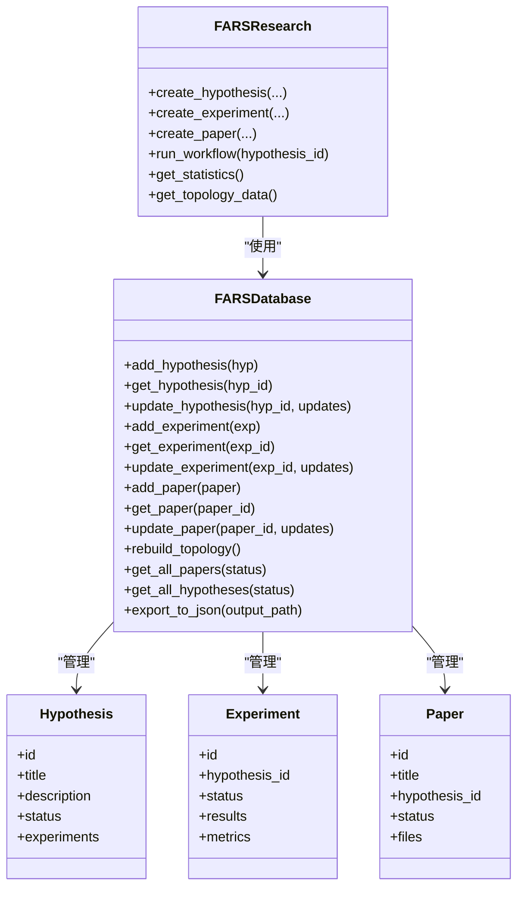

**图表来源**
- [src/fars_research.py:110-484](file://src/fars_research.py#L110-L484)

**章节来源**
- [src/fars_research.py:110-484](file://src/fars_research.py#L110-L484)

### 配置与工作空间（研究方向、LLM Provider、日志备份）
- 研究方向：量化金融、计算机视觉、强化学习，支持不同关键词、适用会议、论文格式与主指标。
- LLM Provider：OpenAI、Anthropic、DeepSeek、MiniMax、Ollama，支持主备切换与环境变量注入。
- 工作空间：统一项目目录结构（ideas、plans、experiments、papers、data、charts、logs、backups、uploads），提供工件保存、读取、上传、备份与日志记录。
- 配置合并：支持基础配置与本地配置合并，自动注入API Key。

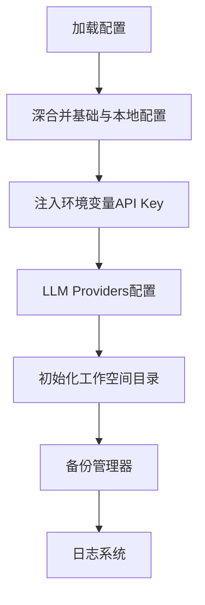

**图表来源**
- [src/core/config.py:420-514](file://src/core/config.py#L420-L514)
- [src/core/config.py:256-417](file://src/core/config.py#L256-L417)

**章节来源**
- [src/core/config.py:18-57](file://src/core/config.py#L18-L57)
- [src/core/config.py:204-251](file://src/core/config.py#L204-L251)
- [src/core/config.py:256-417](file://src/core/config.py#L256-L417)
- [src/core/config.py:420-514](file://src/core/config.py#L420-L514)

### 提示词模板（论文生成与评审）
- 论文生成提示：基于实验结果生成LaTeX论文，包含标题、摘要、引言、方法论、实证结果、结论、参考文献与图表清单。
- 文献综述提示：多视角生成、问题生成、证据收集、大纲生成、文献综述章节生成。
- 评审与修订提示：论文质量评审与修订建议生成。

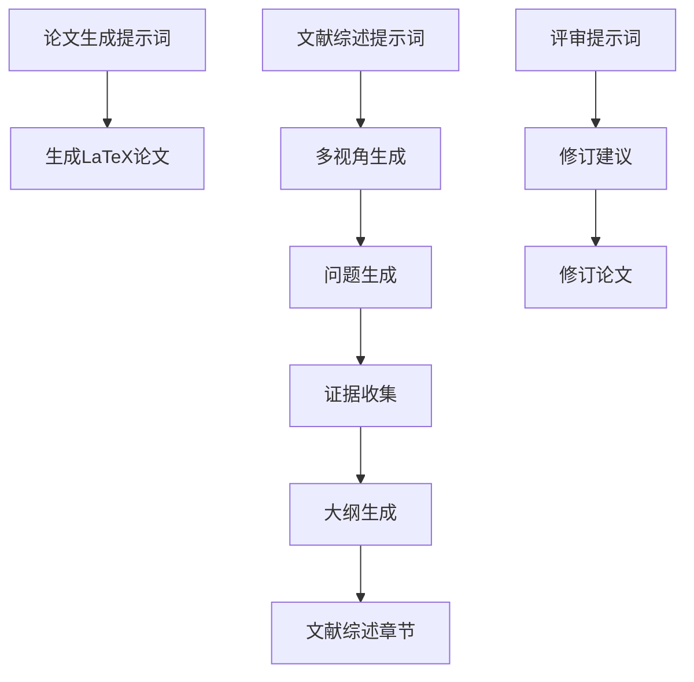

**图表来源**
- [src/prompts/templates.py:355-390](file://src/prompts/templates.py#L355-L390)
- [src/prompts/templates.py:471-573](file://src/prompts/templates.py#L471-L573)
- [src/prompts/templates.py:577-637](file://src/prompts/templates.py#L577-L637)

**章节来源**
- [src/prompts/templates.py:355-390](file://src/prompts/templates.py#L355-L390)
- [src/prompts/templates.py:471-573](file://src/prompts/templates.py#L471-L573)
- [src/prompts/templates.py:577-637](file://src/prompts/templates.py#L577-L637)

### 数据与工具（论文抓取、市场数据、LLM调用、PDF编译）
- 论文抓取：arXiv搜索、Semantic Scholar检索、PDF下载、结构化解析。
- 市场数据：yfinance、akshare数据获取，支持美股、A股、指数数据。
- LLM调用：OpenAI、Anthropic、DeepSeek、MiniMax、Ollama多Provider自动切换，记录调用日志。
- PDF编译：Markdown转PDF（ReportLab），支持中文、表格、标题、列表样式。

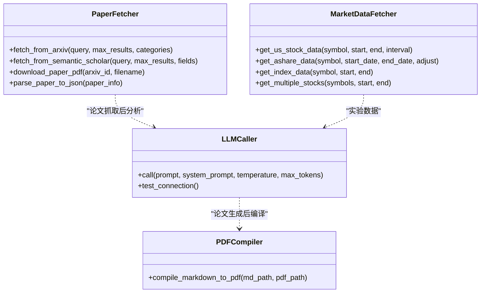

**图表来源**
- [src/tools/fetchers.py:20-270](file://src/tools/fetchers.py#L20-L270)
- [src/tools/fetchers.py:290-899](file://src/tools/fetchers.py#L290-L899)
- [src/core/pdf_compiler.py:11-175](file://src/core/pdf_compiler.py#L11-L175)

**章节来源**
- [src/tools/fetchers.py:20-270](file://src/tools/fetchers.py#L20-L270)
- [src/tools/fetchers.py:290-899](file://src/tools/fetchers.py#L290-L899)
- [src/core/pdf_compiler.py:11-175](file://src/core/pdf_compiler.py#L11-L175)

### 研究流水线（文献综述与论文生成）
- 流程阶段：文献综述（视角生成、问题生成、证据收集、大纲生成）、论文生成（方法论、实证结果、讨论、结论）。
- 主题检测：基于关键词与模式匹配识别研究主题，构建研究问题与创新点。
- 实验构建：生成实验阶段（literature_review、hypothesis、experimenting、writing）与指标统计。

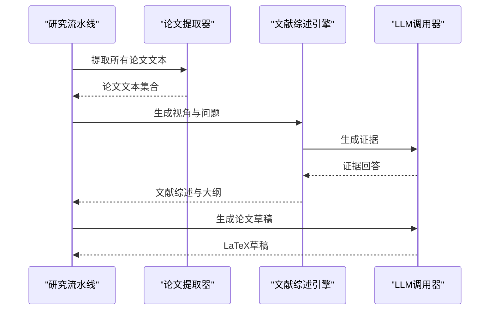

**图表来源**
- [src/core/research_runner.py:69-162](file://src/core/research_runner.py#L69-L162)
- [src/core/research_runner.py:195-275](file://src/core/research_runner.py#L195-L275)
- [src/core/paper_extractor.py:149-223](file://src/core/paper_extractor.py#L149-L223)
- [src/tools/literature_review_engine.py:557-631](file://src/tools/literature_review_engine.py#L557-L631)

**章节来源**
- [src/core/research_runner.py:69-162](file://src/core/research_runner.py#L69-L162)
- [src/core/research_runner.py:195-275](file://src/core/research_runner.py#L195-L275)
- [src/core/paper_extractor.py:149-223](file://src/core/paper_extractor.py#L149-L223)
- [src/tools/literature_review_engine.py:557-631](file://src/tools/literature_review_engine.py#L557-L631)

### 研究图谱（作者网络与引用关系）
- 作者合作网络：从种子论文PDF首页提取机构信息，构建作者、机构、论文与合作边。
- 引用关系网络：基于标题与主题词重叠计算参考文献耦合，构建AI论文与参考文献的引用边与共同引用边。

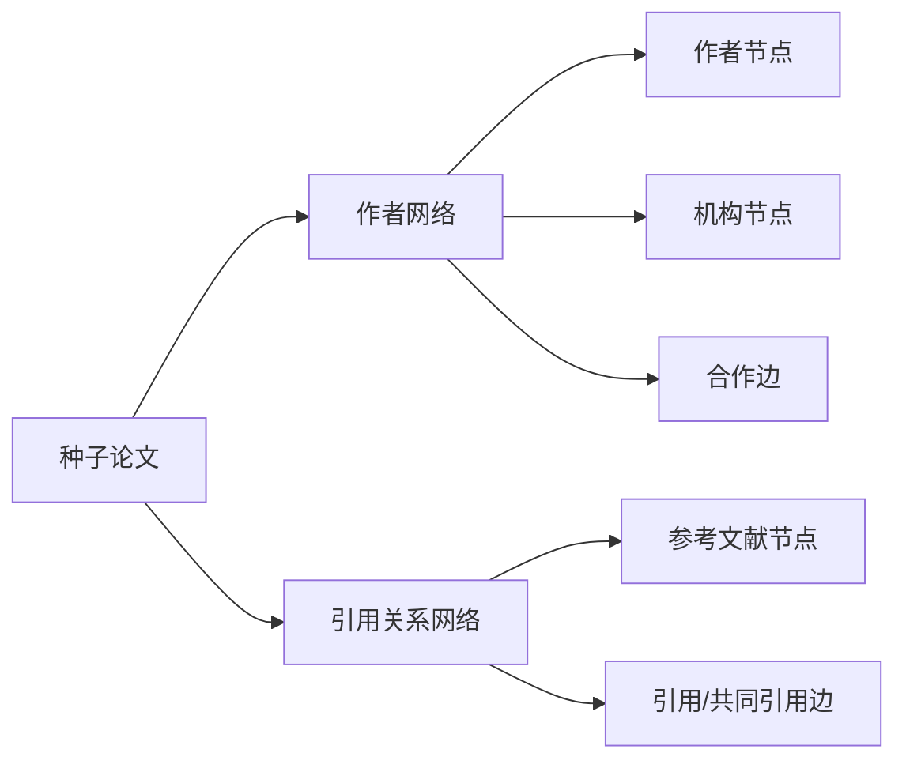

**图表来源**
- [src/core/research_graphs.py:16-264](file://src/core/research_graphs.py#L16-L264)

**章节来源**
- [src/core/research_graphs.py:16-264](file://src/core/research_graphs.py#L16-L264)

### 文献综述引擎（STORM风格）
- 多视角生成：从主题出发生成多个学术视角，包含研究问题、方法论与潜在贡献。
- 问题生成：为每个视角生成深度研究问题，涵盖背景、比较、因果、评估四类。
- 证据收集：为问题生成回答与证据，支持从已有论文中综合证据。
- 大纲生成：生成论文结构化大纲，包含章节与关键要点。
- 文献综述章节：生成LaTeX格式的文献综述章节，包含分类讨论、批判性分析与研究空白。

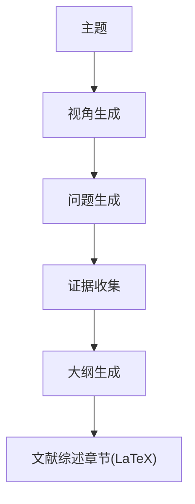

**图表来源**
- [src/tools/literature_review_engine.py:128-631](file://src/tools/literature_review_engine.py#L128-L631)

**章节来源**
- [src/tools/literature_review_engine.py:128-631](file://src/tools/literature_review_engine.py#L128-L631)

## 依赖关系分析
- LLM Provider：OpenAI、Anthropic、DeepSeek、MiniMax、Ollama，支持主备切换与环境变量注入。
- 数据与回测：yfinance、akshare、backtrader、backtesting、matplotlib、seaborn、scikit-learn。
- AI检测：transformers、torch、accelerate（Fast-DetectGPT）。
- 工具与库：arxiv、requests、pymongo、python-dateutil、tqdm、rich。

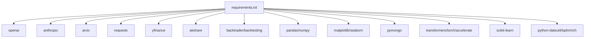

**图表来源**
- [requirements.txt:1-39](file://requirements.txt#L1-L39)

**章节来源**
- [requirements.txt:1-39](file://requirements.txt#L1-L39)

## 性能考虑
- LLM调用：通过多Provider自动切换与环境变量注入减少API Key硬编码风险；记录调用日志便于成本与延迟分析。
- 文本提取：pdfplumber按页提取，限制最大页数（MAX_PAGES=20）平衡信息量与速度；合并去重避免重复处理。
- 图谱构建：基于关键词与主题词重叠计算，避免全量对比；作者合作网络仅从PDF首页提取机构信息。
- PDF编译：Markdown→PDF使用ReportLab，注册中文字体与样式，支持表格与列表渲染。

## 故障排除指南
- LLM连接失败：检查API Key与Base URL配置，系统会自动尝试备选Provider（如Ollama gemma4）。
- LaTeX编译：系统生成compile_info.json指导用户使用Overleaf或本地pdflatex/xelatex；若无pdflatex则回退到xelatex。
- AI检测绕过：生成ai_bypass_info.json，提供JustDone等工具的使用步骤与替代工具链接。
- 论文生成异常：系统捕获异常并保存原始响应至debug文件，便于定位问题。
- 数据获取：yfinance/akshare不可用时，系统给出警告并跳过对应数据获取步骤。

**章节来源**
- [src/main.py:88-100](file://src/main.py#L88-L100)
- [src/workflow.py:66-96](file://src/workflow.py#L66-L96)
- [src/workflow.py:98-134](file://src/workflow.py#L98-L134)
- [src/main.py:339-351](file://src/main.py#L339-L351)
- [src/tools/fetchers.py:174-287](file://src/tools/fetchers.py#L174-L287)

## 结论
Writing Agent（论文撰写智能体）通过模块化设计实现了从量化研究到学术论文的自动化：以提示词模板驱动论文生成，以研究数据库管理生命周期，以工作流控制器指导LaTeX编译与投稿准备，以LLM多Provider切换保障稳定性与成本控制。系统支持多研究方向、图表自动生成、引用格式处理与元数据管理，为量化研究者提供了高效、可复现的论文生产流水线。

## 附录
- 使用案例：基于实验结果生成LaTeX论文，保存至papers目录，随后使用工作流控制器指导PDF编译与投稿准备。
- 实现细节：论文结构设计遵循ICML格式，内容组织策略基于提示词模板，质量控制机制包括提示词约束、异常调试与日志记录。
- 实际应用：将量化研究结果转化为符合学术规范的完整论文，自动化生成LaTeX文档并提供编译与投稿指导。