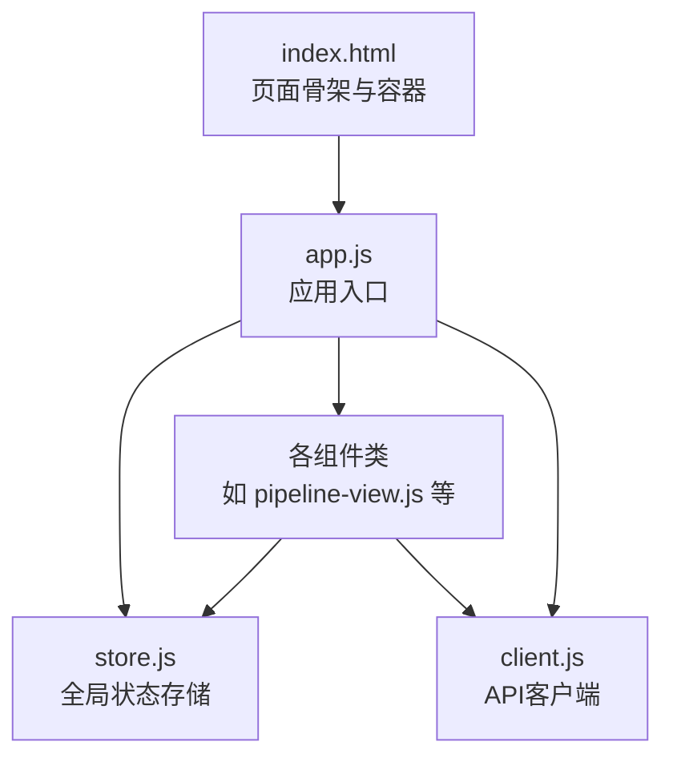
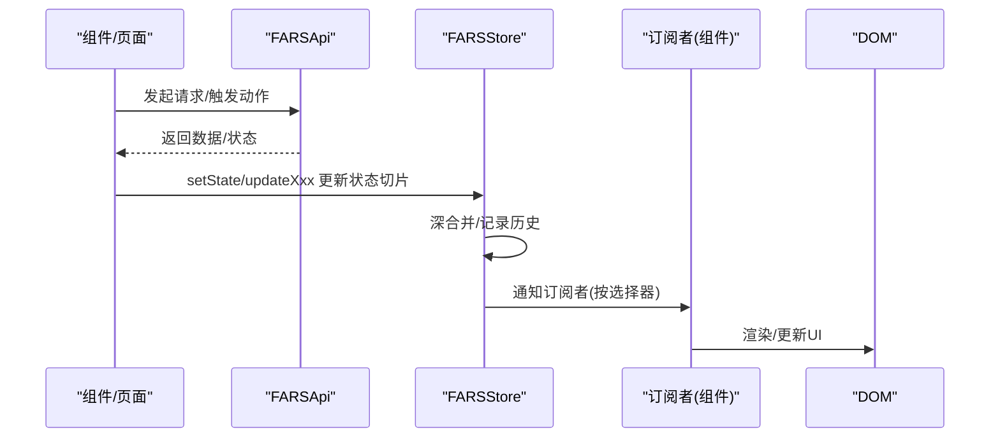
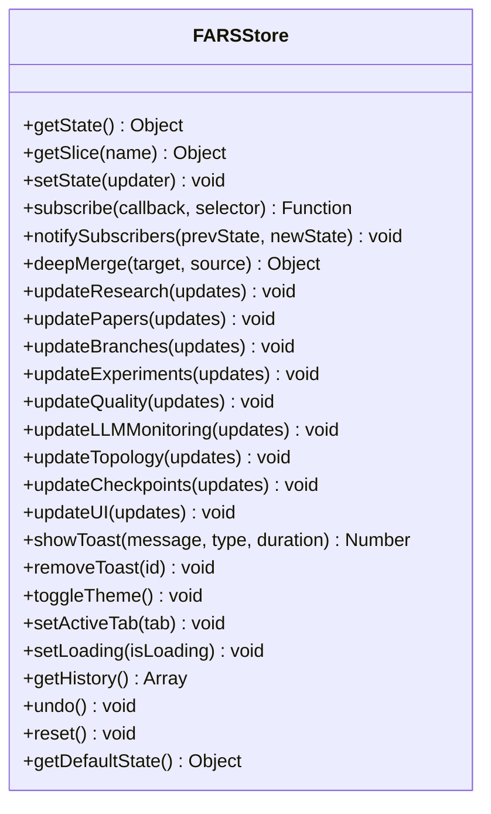
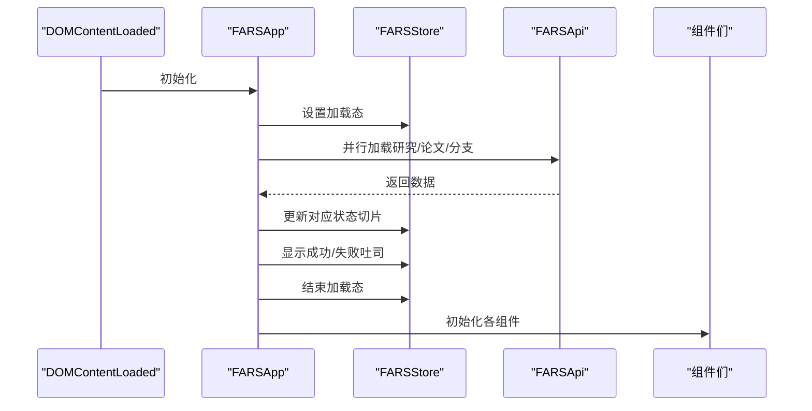
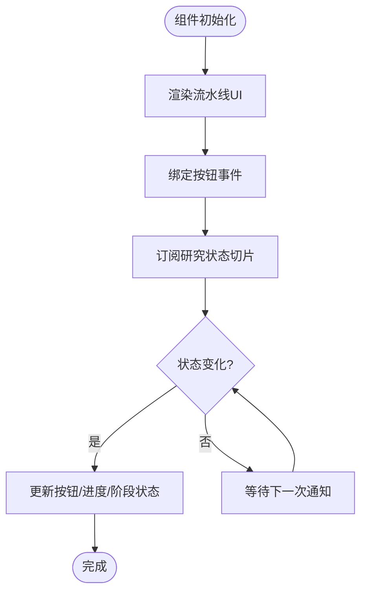
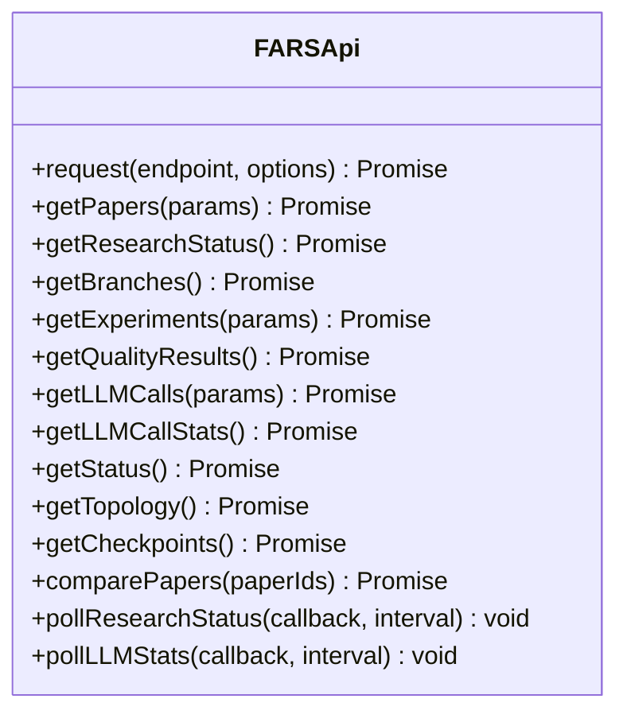
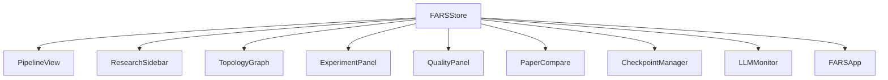

# UI状态管理

<cite>
**本文引用的文件**
- [store.js](file://docs/v2/state/store.js)
- [app.js](file://docs/v2/app.js)
- [index.html](file://docs/v2/index.html)
- [client.js](file://docs/v2/api/client.js)
- [pipeline-view.js](file://docs/v2/components/pipeline-view.js)
- [research-sidebar.js](file://docs/v2/components/research-sidebar.js)
- [topology-graph.js](file://docs/v2/components/topology-graph.js)
- [experiment-panel.js](file://docs/v2/components/experiment-panel.js)
- [quality-panel.js](file://docs/v2/components/quality-panel.js)
- [paper-compare.js](file://docs/v2/components/paper-compare.js)
- [checkpoint-manager.js](file://docs/v2/components/checkpoint-manager.js)
- [llm-monitor.js](file://docs/v2/components/llm-monitor.js)
</cite>

## 目录
1. [简介](#简介)
2. [项目结构](#项目结构)
3. [核心组件](#核心组件)
4. [架构总览](#架构总览)
5. [详细组件分析](#详细组件分析)
6. [依赖关系分析](#依赖关系分析)
7. [性能考量](#性能考量)
8. [故障排查指南](#故障排查指南)
9. [结论](#结论)
10. [附录](#附录)

## 简介
本文件面向paperwriterAI前端v2版本的UI状态管理系统，系统采用集中式状态管理模式，围绕全局状态存储器提供统一的状态结构、订阅/通知机制、历史与撤销能力，并通过组件按需订阅实现响应式渲染。本文将从设计模式、状态结构、更新策略、订阅机制、状态分类、持久化与重置、快照与调试等方面进行全面技术说明，并给出架构图、状态流转图与订阅关系图，同时提供性能优化建议与最佳实践。

## 项目结构
前端v2采用“页面模板 + 组件 + 状态存储 + API客户端”的分层组织：
- 页面模板：index.html定义页面骨架与容器，负责挂载各组件。
- 应用入口：app.js负责事件绑定、初始数据加载、主题与通知容器初始化。
- 组件：各功能面板以类组件形式存在，各自维护UI状态并订阅全局状态。
- 状态存储：store.js提供全局状态、订阅、历史与撤销、主题切换等能力。
- API客户端：client.js封装REST接口，供应用与组件调用后更新状态。



**图表来源**
- [index.html:1-118](file://docs/v2/index.html#L1-L118)
- [app.js:1-259](file://docs/v2/app.js#L1-L259)
- [store.js:1-371](file://docs/v2/state/store.js#L1-L371)
- [client.js:1-274](file://docs/v2/api/client.js#L1-L274)

**章节来源**
- [index.html:1-118](file://docs/v2/index.html#L1-L118)
- [app.js:1-259](file://docs/v2/app.js#L1-L259)

## 核心组件
- 全局状态存储器（FARSStore）
  - 提供状态读取、切片读取、深合并更新、订阅注册、通知广播、历史记录、撤销、重置、主题切换、标签页切换、加载状态、吐司通知等能力。
  - 内置UI状态（主题、活动标签、加载态、吐司队列）与业务状态（研究、论文、分支、实验、质量、LLM监控、拓扑、断点）。
- 应用入口（FARSApp）
  - 负责事件监听、初始数据加载、主题与吐司容器初始化、组件生命周期管理。
- 组件类
  - 各功能面板均以类组件形式存在，负责渲染、事件绑定、订阅状态、调用API并更新对应状态切片。
- API客户端（FARSApi）
  - 封装REST接口，提供统一的请求方法与端点映射，支持轮询等异步状态拉取。

**章节来源**
- [store.js:1-371](file://docs/v2/state/store.js#L1-L371)
- [app.js:1-259](file://docs/v2/app.js#L1-L259)
- [client.js:1-274](file://docs/v2/api/client.js#L1-L274)

## 架构总览
集中式状态管理采用“单向数据流”：
- 组件通过API获取数据或触发动作，更新对应状态切片。
- 状态更新通过深合并写入全局状态，触发订阅回调。
- 订阅回调根据切片选择器决定是否渲染，实现最小化重绘。
- 历史记录支持撤销；主题与吐司由UI切片统一管理。



**图表来源**
- [store.js:86-132](file://docs/v2/state/store.js#L86-L132)
- [client.js:56-76](file://docs/v2/api/client.js#L56-L76)
- [pipeline-view.js:165-172](file://docs/v2/components/pipeline-view.js#L165-L172)
- [research-sidebar.js:152-159](file://docs/v2/components/research-sidebar.js#L152-L159)

## 详细组件分析

### 全局状态存储器（FARSStore）
- 状态结构
  - 研究状态：运行/暂停/当前主题/开始时间/耗时
  - 论文状态：列表/当前ID/总数
  - 分支状态：列表/当前ID
  - 实验状态：列表/当前ID
  - 质量状态：结果集/最近检查时间
  - LLM监控：调用记录/统计/当前选中调用
  - 拓扑状态：节点/边
  - 断点状态：列表/当前ID
  - UI状态：活动标签/主题/加载态/吐司队列
- 更新策略
  - setState支持函数式更新与对象合并，内部执行深合并，避免浅拷贝导致的共享引用问题。
  - 历史记录保留最近N条变更，支持撤销。
- 订阅机制
  - subscribe返回注销函数；notifySubscribers支持可选的选择器，仅在切片变化时触发回调。
- UI辅助
  - 主题切换写入localStorage并同步DOM属性；活动标签与加载态统一管理；吐司消息自动过期移除。
- 重置与快照
  - reset恢复默认状态；getHistory提供历史快照；undo弹出最后变更并回滚。



**图表来源**
- [store.js:6-365](file://docs/v2/state/store.js#L6-L365)

**章节来源**
- [store.js:6-371](file://docs/v2/state/store.js#L6-L371)

### 应用入口（FARSApp）
- 事件绑定：导航标签、主题切换、设置按钮、模态框关闭、键盘快捷键。
- 初始数据加载：并行加载研究、论文、分支数据，展示加载态与吐司反馈。
- 主题与吐司：根据store初始化主题属性，订阅吐司队列并渲染容器。
- 工具方法：格式化日期/时间/时长。



**图表来源**
- [app.js:60-83](file://docs/v2/app.js#L60-L83)
- [app.js:240-259](file://docs/v2/app.js#L240-L259)

**章节来源**
- [app.js:1-259](file://docs/v2/app.js#L1-L259)

### 组件类（以PipelineView为例）
- 渲染：根据状态切片渲染流水线阶段、进度条与按钮状态。
- 事件：开始/暂停/停止研究按钮绑定API调用与吐司反馈。
- 订阅：仅订阅research切片，减少不必要的重绘。
- UI更新：根据状态计算整体进度、阶段进度与状态文本。



**图表来源**
- [pipeline-view.js:23-27](file://docs/v2/components/pipeline-view.js#L23-L27)
- [pipeline-view.js:165-172](file://docs/v2/components/pipeline-view.js#L165-L172)
- [pipeline-view.js:174-216](file://docs/v2/components/pipeline-view.js#L174-L216)

**章节来源**
- [pipeline-view.js:1-233](file://docs/v2/components/pipeline-view.js#L1-L233)

### API客户端（FARSApi）
- 端点映射：覆盖论文、研究、分支、实验、质量、LLM监控、系统、拓扑、断点、对比等。
- 请求封装：统一headers与错误处理，抛出可捕获的错误。
- 轮询：提供研究状态与LLM统计的轮询方法，便于组件持续更新。



**图表来源**
- [client.js:6-274](file://docs/v2/api/client.js#L6-L274)

**章节来源**
- [client.js:1-274](file://docs/v2/api/client.js#L1-L274)

## 依赖关系分析
- 组件对Store的依赖：所有组件通过window.farsStore访问全局状态，部分组件通过window.farsApi调用后更新状态。
- Store对组件的反向影响：订阅机制使组件能响应状态变化，形成单向数据流。
- App对Store与API的依赖：负责初始化、事件绑定、初始数据加载与主题/吐司管理。
- HTML对组件的依赖：index.html提供容器与脚本加载顺序，确保组件在Store与API之后初始化。

```mermaid
graph LR
Store["FARSStore"] <- --> Components["各组件类"]
App["FARSApp"] --> Store
App --> API["FARSApi"]
Components --> Store
Components --> API
Index["index.html"] --> Components
Index --> App
```

**图表来源**
- [store.js:367-371](file://docs/v2/state/store.js#L367-L371)
- [app.js:1-259](file://docs/v2/app.js#L1-L259)
- [index.html:105-117](file://docs/v2/index.html#L105-L117)

**章节来源**
- [index.html:1-118](file://docs/v2/index.html#L1-L118)
- [app.js:1-259](file://docs/v2/app.js#L1-L259)
- [store.js:1-371](file://docs/v2/state/store.js#L1-L371)

## 性能考量
- 订阅粒度
  - 使用选择器仅订阅必要切片，避免全状态变更导致的过度渲染。
  - 示例：PipelineView仅订阅research切片，ResearchSidebar订阅全状态但内部再细分更新。
- 深合并与不可变更新
  - 深合并避免共享引用引发的意外副作用，但应尽量减少深层嵌套以降低合并成本。
- 历史与撤销
  - 历史记录限制长度，防止内存膨胀；撤销操作会回滚状态并再次通知订阅者，注意避免在撤销过程中产生额外副作用。
- 吐司与加载态
  - 吐司自动过期移除，避免无限增长；加载态用于控制交互与渲染，减少无效请求。
- 组件渲染
  - 仅在状态变化时更新UI，避免重复渲染；对复杂图表组件（如拓扑图）建议在更新前进行必要的数据校验与边界计算。

[本节为通用性能指导，不直接分析具体文件]

## 故障排查指南
- 状态未更新
  - 检查组件是否正确订阅状态切片与选择器；确认Store的setState调用路径是否正确。
  - 参考：组件订阅与Store通知逻辑。
- 主题切换无效
  - 确认localStorage写入与DOM属性设置是否执行；检查toggleTheme调用链。
- 吐司不消失
  - 检查showToast的duration参数与removeToast调用时机；确认定时器是否被清理。
- 数据加载失败
  - 查看API请求错误与console输出；确认端点映射与请求配置。
- 撤销/重置异常
  - 检查历史记录长度与撤销栈；确认reset是否恢复默认状态。

**章节来源**
- [store.js:280-296](file://docs/v2/state/store.js#L280-L296)
- [store.js:298-316](file://docs/v2/state/store.js#L298-L316)
- [app.js:152-187](file://docs/v2/app.js#L152-L187)
- [client.js:56-76](file://docs/v2/api/client.js#L56-L76)

## 结论
paperwriterAI前端v2的UI状态管理采用集中式、订阅驱动的架构，具备清晰的状态结构、完善的订阅/通知机制、历史与撤销能力以及良好的UI辅助（主题、吐司、加载态）。通过组件按需订阅与深合并更新，系统实现了高效的响应式渲染与可维护的状态管理。建议在后续迭代中进一步细化状态切片边界、引入更细粒度的缓存与去抖策略，并完善调试工具与性能监控埋点。

[本节为总结性内容，不直接分析具体文件]

## 附录

### 状态结构与分类
- 用户界面状态（UI）
  - 活动标签、主题、加载态、吐司队列
- 应用状态（业务域）
  - 研究、论文、分支、实验、质量、LLM监控、拓扑、断点
- 组件状态（局部）
  - 各组件内部的临时UI状态（如选中项、过滤条件、展开/收起等），通过订阅全局状态实现解耦

**章节来源**
- [store.js:8-69](file://docs/v2/state/store.js#L8-L69)

### 状态更新策略与派发流程
- 函数式更新：传入函数以旧状态为基础计算新状态，保证原子性。
- 对象合并：传入对象进行深合并，避免浅拷贝共享引用。
- 选择器通知：订阅者可指定选择器，仅在切片变化时回调，减少渲染开销。

**章节来源**
- [store.js:86-132](file://docs/v2/state/store.js#L86-L132)

### 订阅关系图


**图表来源**
- [pipeline-view.js:165-172](file://docs/v2/components/pipeline-view.js#L165-L172)
- [research-sidebar.js:152-159](file://docs/v2/components/research-sidebar.js#L152-L159)
- [topology-graph.js:1-348](file://docs/v2/components/topology-graph.js#L1-L348)
- [experiment-panel.js:282-289](file://docs/v2/components/experiment-panel.js#L282-L289)
- [quality-panel.js:314-321](file://docs/v2/components/quality-panel.js#L314-L321)
- [paper-compare.js:284-291](file://docs/v2/components/paper-compare.js#L284-L291)
- [checkpoint-manager.js:270-277](file://docs/v2/components/checkpoint-manager.js#L270-L277)
- [llm-monitor.js:342-349](file://docs/v2/components/llm-monitor.js#L342-L349)
- [app.js:162-168](file://docs/v2/app.js#L162-L168)

### 状态持久化与重置
- 持久化
  - 主题：localStorage持久化，应用启动时读取并设置DOM属性。
  - 吐司：内存队列，自动过期移除。
- 重置
  - reset恢复默认状态；适合在需要清空所有业务状态时使用。

**章节来源**
- [store.js:280-286](file://docs/v2/state/store.js#L280-L286)
- [store.js:312-316](file://docs/v2/state/store.js#L312-L316)
- [app.js:147-150](file://docs/v2/app.js#L147-L150)

### 快照与调试
- 历史快照
  - getHistory返回最近N条变更，可用于调试与审计。
- 调试建议
  - 在关键更新处打印prevState/newState差异；
  - 使用浏览器开发者工具断点观察订阅回调触发频率；
  - 对高频轮询组件（如LLM监控）增加节流与去抖。

**章节来源**
- [store.js:298-301](file://docs/v2/state/store.js#L298-L301)
- [llm-monitor.js:380-385](file://docs/v2/components/llm-monitor.js#L380-L385)

### 最佳实践与常见陷阱
- 最佳实践
  - 使用选择器订阅最小必要切片；
  - 将UI辅助（主题、吐司、加载态）集中在UI切片；
  - 对复杂数据结构采用深合并，避免共享引用；
  - 对外暴露专门的updateXxx方法，统一更新路径。
- 常见陷阱
  - 浅拷贝导致的共享引用；
  - 订阅全状态造成过度渲染；
  - 忘记注销订阅导致内存泄漏；
  - 吐司未及时移除造成UI堆积。

[本节为通用指导，不直接分析具体文件]