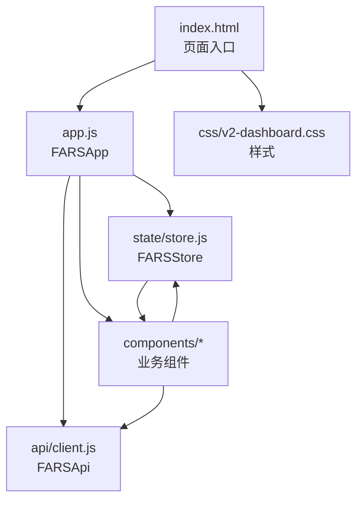
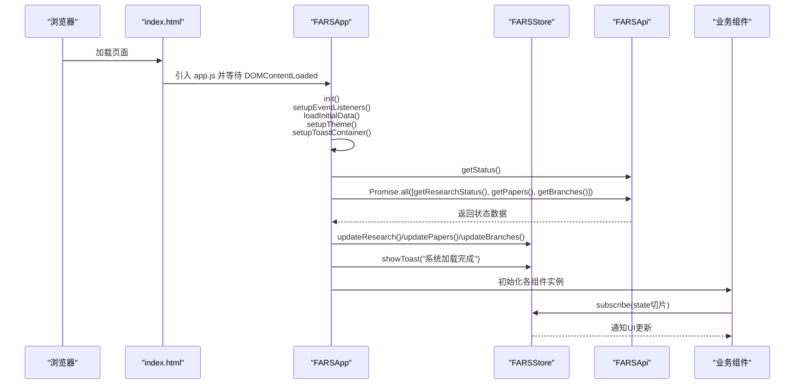
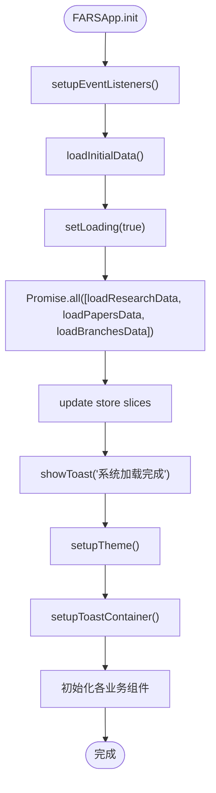
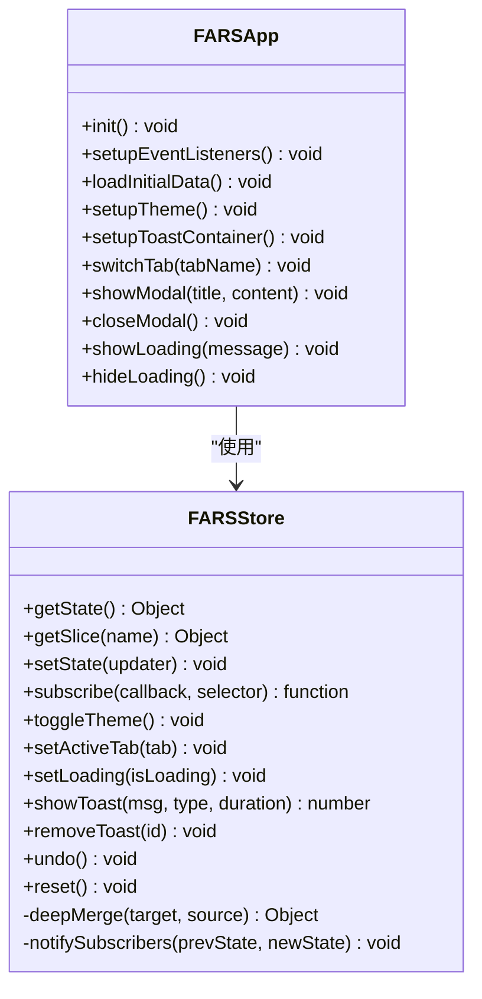
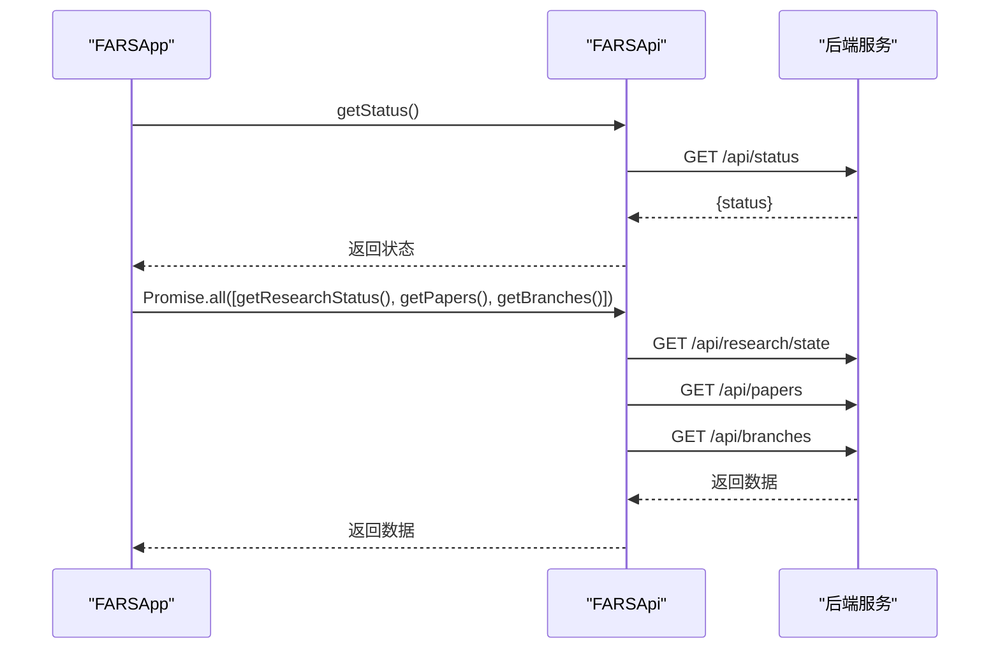
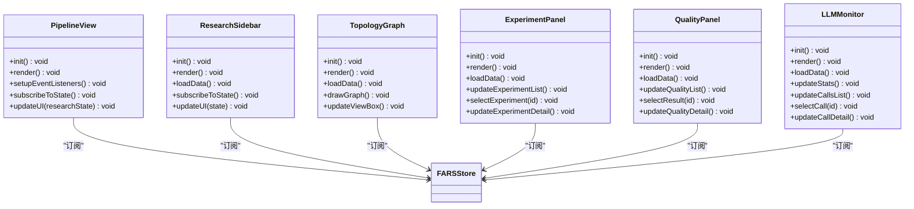
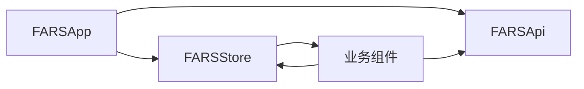
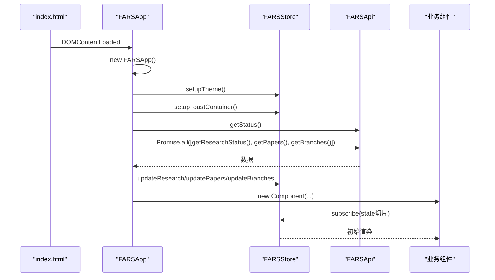
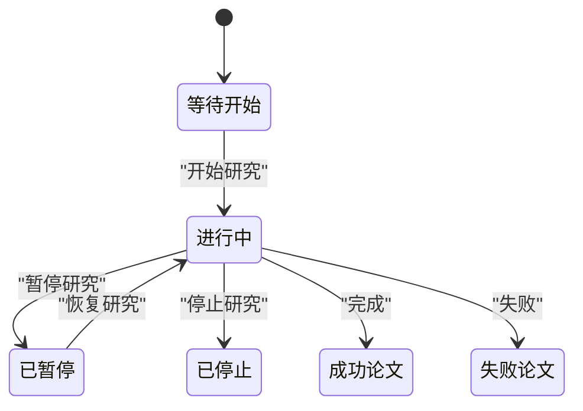

# Vue.js应用架构

<cite>
**本文档引用的文件**
- [app.js](file://docs/v2/app.js)
- [store.js](file://docs/v2/state/store.js)
- [client.js](file://docs/v2/api/client.js)
- [index.html](file://docs/v2/index.html)
- [test.html](file://docs/v2/test.html)
- [v2-dashboard.css](file://docs/v2/css/v2-dashboard.css)
- [FARS_ARCHITECTURE.md](file://docs/FARS_ARCHITECTURE.md)
- [pipeline-view.js](file://docs/v2/components/pipeline-view.js)
- [research-sidebar.js](file://docs/v2/components/research-sidebar.js)
- [topology-graph.js](file://docs/v2/components/topology-graph.js)
- [experiment-panel.js](file://docs/v2/components/experiment-panel.js)
- [quality-panel.js](file://docs/v2/components/quality-panel.js)
- [llm-monitor.js](file://docs/v2/components/llm-monitor.js)
</cite>

## 目录
1. [简介](#简介)
2. [项目结构](#项目结构)
3. [核心组件](#核心组件)
4. [架构总览](#架构总览)
5. [详细组件分析](#详细组件分析)
6. [依赖关系分析](#依赖关系分析)
7. [性能考虑](#性能考虑)
8. [故障排除指南](#故障排除指南)
9. [结论](#结论)
10. [附录](#附录)

## 简介
本文件为 paperwriterAI 的 Vue.js 应用架构技术文档，聚焦于主应用入口 FARSApp 的设计与实现，涵盖初始化流程、事件监听器设置、主题切换机制；深入解析状态管理模式（全局 store 结构、状态订阅机制、UI 状态管理）；阐述应用生命周期管理、异步数据加载策略、错误处理机制；记录组件初始化流程、DOM 操作最佳实践、内存泄漏防护措施；并提供应用启动时序图、状态流转图，以及性能优化建议与调试技巧。

## 项目结构
该前端采用“单页应用 + 组件化”架构，通过 HTML 页面引入多个 JS 组件，形成以 FARSApp 为核心的前端系统：
- 入口页面：index.html
- 主应用：app.js 中的 FARSApp 类
- 全局状态：state/store.js 中的 FARSStore 类
- API 客户端：api/client.js 中的 FARSApi 类
- 组件：components/ 下的各功能组件（流水线、研究侧边栏、拓扑图、实验面板、质量面板、LLM 监控等）
- 样式：css/v2-dashboard.css
- 架构文档：FARS_ARCHITECTURE.md

**图表来源**
- [index.html:1-118](file://docs/v2/index.html#L1-L118)
- [app.js:1-259](file://docs/v2/app.js#L1-L259)
- [store.js:1-371](file://docs/v2/state/store.js#L1-L371)
- [client.js:1-274](file://docs/v2/api/client.js#L1-L274)

**章节来源**
- [index.html:1-118](file://docs/v2/index.html#L1-L118)
- [app.js:1-259](file://docs/v2/app.js#L1-L259)
- [store.js:1-371](file://docs/v2/state/store.js#L1-L371)
- [client.js:1-274](file://docs/v2/api/client.js#L1-L274)
- [v2-dashboard.css:1-200](file://docs/v2/css/v2-dashboard.css#L1-L200)

## 核心组件
本节聚焦主应用入口 FARSApp 与全局状态管理 FARSStore 的职责与协作方式。

- FARSApp 职责
  - 初始化：设置事件监听器、加载初始数据、主题与提示框容器
  - 生命周期：在 DOMContentLoaded 后实例化并初始化所有组件
  - 交互：标签切换、模态框、键盘快捷键、加载状态管理
  - 数据：并发加载研究、论文、分支数据，统一写入 store
  - 主题：基于 store 的 UI 状态切换主题并持久化

- FARSStore 职责
  - 状态结构：包含 research、papers、branches、experiments、quality、llmMonitoring、topology、checkpoints、ui 等切片
  - 订阅机制：subscribe 提供按切片选择器的细粒度通知
  - 更新策略：setState 支持函数式或对象式更新，深合并保证不可变性
  - UI 管理：主题切换、活动标签、加载状态、Toast 通知队列
  - 历史与撤销：历史记录与 undo 能力

**章节来源**
- [app.js:6-237](file://docs/v2/app.js#L6-L237)
- [store.js:6-365](file://docs/v2/state/store.js#L6-L365)

## 架构总览
下图展示了应用启动时序与组件间的数据流：

**图表来源**
- [index.html:105-116](file://docs/v2/index.html#L105-L116)
- [app.js:14-83](file://docs/v2/app.js#L14-L83)
- [store.js:109-132](file://docs/v2/state/store.js#L109-L132)
- [client.js:56-76](file://docs/v2/api/client.js#L56-L76)

## 详细组件分析

### FARSApp 主应用
- 初始化流程
  - 构造函数注入全局 store 与 API 客户端
  - init() 调用 setupEventListeners、loadInitialData、setupTheme、setupToastContainer
- 事件监听器
  - 导航标签点击：切换 active 类与 store 活动标签
  - 主题切换：触发 store.toggleTheme
  - 设置按钮：显示提示（开发中）
  - 模态框：关闭按钮、遮罩层点击、Esc 键
  - 键盘快捷键：Esc 关闭模态框
- 异步数据加载
  - 并发加载研究、论文、分支状态，使用 Promise.all
  - 统一设置 loading 状态并在 finally 清除
- 主题与提示
  - 从 store 读取主题并设置到 <html> 属性
  - 订阅 UI.toasts，渲染 toast 容器
- 组件初始化
  - 在 DOMContentLoaded 后实例化各业务组件

**图表来源**
- [app.js:14-83](file://docs/v2/app.js#L14-L83)
- [app.js:147-169](file://docs/v2/app.js#L147-L169)

**章节来源**
- [app.js:6-237](file://docs/v2/app.js#L6-L237)

### FARSStore 全局状态管理
- 状态结构
  - research、papers、branches、experiments、quality、llmMonitoring、topology、checkpoints、ui
- 订阅机制
  - subscribe(callback, selector) 返回取消订阅函数
  - notifySubscribers 仅在选择器返回值变化时回调
- 更新策略
  - setState 支持函数式更新，内部深合并
  - 历史记录最多保留固定条目，支持 undo
- UI 状态
  - 主题切换：localStorage 持久化，更新 <html> data-theme
  - 活动标签、加载状态、Toast 队列
- 便捷更新器
  - updateResearch/updatePapers/updateBranches 等针对各切片的浅合并更新

**图表来源**
- [store.js:6-365](file://docs/v2/state/store.js#L6-L365)
- [app.js:6-237](file://docs/v2/app.js#L6-L237)

**章节来源**
- [store.js:6-365](file://docs/v2/state/store.js#L6-L365)

### API 客户端 FARSApi
- 端点定义：覆盖 papers、research、branches、experiments、quality、llm、system、topology、checkpoints、compare 等
- 请求封装：request 方法统一处理 headers、响应校验与错误抛出
- 业务方法：提供各资源的 CRUD 与状态控制接口
- 轮询工具：pollResearchStatus、pollLLMStats 支持后台状态轮询

**图表来源**
- [client.js:56-76](file://docs/v2/api/client.js#L56-L76)
- [client.js:109-136](file://docs/v2/api/client.js#L109-L136)
- [client.js:139-158](file://docs/v2/api/client.js#L139-L158)
- [client.js:244-270](file://docs/v2/api/client.js#L244-L270)

**章节来源**
- [client.js:6-274](file://docs/v2/api/client.js#L6-L274)

### 业务组件
- PipelineView（流水线视图）
  - 渲染五阶段流水线，根据研究状态动态计算阶段与进度
  - 事件：开始/暂停/停止研究，按钮状态随状态切换
  - 订阅：仅订阅 research 切片，避免全量重渲染
- ResearchSidebar（研究侧边栏）
  - 统计卡片、假设列表、论文列表、研究进度
  - 订阅：订阅全量状态，按需更新 UI
- TopologyGraph（拓扑图）
  - SVG 图形绘制节点与边，支持缩放、重置、悬停提示
  - 数据：优先拉取后端拓扑数据，失败则生成演示数据
- ExperimentPanel（实验面板）
  - 实验列表与详情，支持筛选、选中、查看代码/日志/回测
- QualityPanel（质量面板）
  - 质量评估结果列表与详情，包含 AI 检测、学术规范、创新性、完整性评分
- LLMMonitor（LLM 监控）
  - 统计卡片与调用记录列表，支持筛选、详情查看、自动刷新

**图表来源**
- [pipeline-view.js:6-200](file://docs/v2/components/pipeline-view.js#L6-L200)
- [research-sidebar.js:6-200](file://docs/v2/components/research-sidebar.js#L6-L200)
- [topology-graph.js:6-200](file://docs/v2/components/topology-graph.js#L6-L200)
- [experiment-panel.js:6-200](file://docs/v2/components/experiment-panel.js#L6-L200)
- [quality-panel.js:6-200](file://docs/v2/components/quality-panel.js#L6-L200)
- [llm-monitor.js:6-200](file://docs/v2/components/llm-monitor.js#L6-L200)

**章节来源**
- [pipeline-view.js:1-200](file://docs/v2/components/pipeline-view.js#L1-L200)
- [research-sidebar.js:1-200](file://docs/v2/components/research-sidebar.js#L1-L200)
- [topology-graph.js:1-200](file://docs/v2/components/topology-graph.js#L1-L200)
- [experiment-panel.js:1-200](file://docs/v2/components/experiment-panel.js#L1-L200)
- [quality-panel.js:1-200](file://docs/v2/components/quality-panel.js#L1-L200)
- [llm-monitor.js:1-200](file://docs/v2/components/llm-monitor.js#L1-L200)

## 依赖关系分析
- 组件耦合
  - 所有组件均依赖全局 store 与 API 客户端，通过订阅驱动 UI 更新
  - FARSApp 作为协调者，负责初始化与事件绑定
- 外部依赖
  - Chart.js、DOMPurify（在 index.html 中引入）
  - CSS 主题变量通过 data-theme 控制
- 潜在循环依赖
  - 无直接循环依赖，组件通过 store 解耦
- 接口契约
  - store 的 subscribe(selector) 用于细粒度更新，降低不必要的渲染

**图表来源**
- [app.js:6-237](file://docs/v2/app.js#L6-L237)
- [store.js:6-365](file://docs/v2/state/store.js#L6-L365)
- [client.js:6-274](file://docs/v2/api/client.js#L6-L274)

**章节来源**
- [app.js:6-237](file://docs/v2/app.js#L6-L237)
- [store.js:6-365](file://docs/v2/state/store.js#L6-L365)
- [client.js:6-274](file://docs/v2/api/client.js#L6-L274)

## 性能考虑
- 渲染优化
  - 组件订阅使用选择器，仅在相关切片变化时更新 UI
  - 使用模板字符串拼接 DOM，避免频繁重排
- 异步加载
  - 使用 Promise.all 并发加载多源数据，减少总等待时间
  - 加载状态与 Toast 提示提升用户体验
- 主题与样式
  - CSS 变量与 data-theme 属性切换，避免重绘样式表
- 内存与事件
  - 组件内事件绑定在初始化阶段完成，避免重复绑定
  - 模态框与 Toast 使用一次性渲染，减少 DOM 节点数量

[本节为通用性能建议，不直接分析具体文件]

## 故障排除指南
- 加载失败
  - FARSApp.loadInitialData 捕获异常并显示错误 Toast，同时清除 loading 状态
  - API 客户端 request 对非 OK 响应抛出错误，便于上层捕获
- 主题切换无效
  - 确认 localStorage 中存在主题键，store.toggleTheme 是否被调用
  - 检查 <html> 的 data-theme 属性是否更新
- 组件不更新
  - 确认组件是否正确订阅了对应的状态切片
  - 检查 store.setState 的更新路径是否命中选择器
- 模态框无法关闭
  - 检查遮罩层点击与 Esc 键事件是否绑定
  - 确认 modal-overlay 的 hidden 类切换逻辑

**章节来源**
- [app.js:60-83](file://docs/v2/app.js#L60-L83)
- [client.js:56-76](file://docs/v2/api/client.js#L56-L76)
- [store.js:280-286](file://docs/v2/state/store.js#L280-L286)

## 结论
paperwriterAI 的前端采用轻量级类组织模式，通过 FARSApp 协调组件与状态，借助 FARSStore 的订阅机制实现高效、可维护的 UI 更新。API 客户端提供完善的 REST 封装与轮询能力，业务组件围绕状态切片进行局部更新，整体架构清晰、扩展性强。建议后续可引入更严格的类型约束与单元测试，进一步提升可维护性与稳定性。

[本节为总结性内容，不直接分析具体文件]

## 附录

### 应用启动时序图（补充）

**图表来源**
- [index.html:105-116](file://docs/v2/index.html#L105-L116)
- [app.js:240-259](file://docs/v2/app.js#L240-L259)
- [store.js:149-180](file://docs/v2/state/store.js#L149-L180)
- [client.js:109-158](file://docs/v2/api/client.js#L109-L158)

### 状态流转图（研究状态）

**图表来源**
- [pipeline-view.js:84-104](file://docs/v2/components/pipeline-view.js#L84-L104)
- [research-sidebar.js:162-180](file://docs/v2/components/research-sidebar.js#L162-L180)

### 调试技巧
- 在浏览器控制台中直接访问 window.farsStore 与 window.farsApi，观察状态与 API 行为
- 使用浏览器开发者工具的 Network 面板查看 API 请求与响应
- 在组件中增加 console.log 或使用浏览器断点定位状态更新路径
- 利用 store.getHistory() 查看最近变更，结合 undo 进行快速回滚验证

**章节来源**
- [store.js:298-316](file://docs/v2/state/store.js#L298-L316)