# 前端界面系统

<cite>
**本文引用的文件**
- [docs/v2/index.html](file://docs/v2/index.html)
- [docs/v2/app.js](file://docs/v2/app.js)
- [docs/v2/state/store.js](file://docs/v2/state/store.js)
- [docs/v2/components/pipeline-view.js](file://docs/v2/components/pipeline-view.js)
- [docs/v2/components/research-sidebar.js](file://docs/v2/components/research-sidebar.js)
- [docs/v2/components/topology-graph.js](file://docs/v2/components/topology-graph.js)
- [docs/v2/components/experiment-panel.js](file://docs/v2/components/experiment-panel.js)
- [docs/v2/components/quality-panel.js](file://docs/v2/components/quality-panel.js)
- [docs/v2/components/paper-compare.js](file://docs/v2/components/paper-compare.js)
- [docs/v2/components/checkpoint-manager.js](file://docs/v2/components/checkpoint-manager.js)
- [docs/v2/components/llm-monitor.js](file://docs/v2/components/llm-monitor.js)
- [docs/v2/css/v2-dashboard.css](file://docs/v2/css/v2-dashboard.css)
- [docs/API_SPEC.md](file://docs/API_SPEC.md)
</cite>

## 目录
1. [简介](#简介)
2. [项目结构](#项目结构)
3. [核心组件](#核心组件)
4. [架构总览](#架构总览)
5. [详细组件分析](#详细组件分析)
6. [依赖分析](#依赖分析)
7. [性能考虑](#性能考虑)
8. [故障排查指南](#故障排查指南)
9. [结论](#结论)
10. [附录](#附录)

## 简介
本文件面向paperwriterAI的前端界面系统，系统采用原生JavaScript构建，不依赖Vue.js，但具备清晰的组件化架构与集中式状态管理。系统以“流水线-研究-拓扑-实验-质量-对比-断点-LLM监控”八大功能模块为核心，通过统一的状态存储与事件驱动实现数据流与交互逻辑。本文档覆盖组件树结构、状态管理、路由配置、核心组件设计与实现、视觉外观与交互模式、响应式与无障碍建议、样式与主题定制、跨浏览器与性能优化等内容。

## 项目结构
前端位于docs/v2目录，主要文件组织如下：
- 页面入口与布局：index.html
- 应用主控制器：app.js
- 集中式状态管理：state/store.js
- 组件：components/*.js（共8个）
- 样式：css/v2-dashboard.css
- API规范：docs/API_SPEC.md

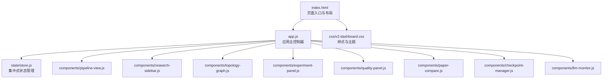

**图表来源**
- [docs/v2/index.html:1-118](file://docs/v2/index.html#L1-L118)
- [docs/v2/app.js:1-259](file://docs/v2/app.js#L1-L259)
- [docs/v2/state/store.js:1-371](file://docs/v2/state/store.js#L1-L371)
- [docs/v2/components/pipeline-view.js:1-233](file://docs/v2/components/pipeline-view.js#L1-L233)
- [docs/v2/components/research-sidebar.js:1-299](file://docs/v2/components/research-sidebar.js#L1-L299)
- [docs/v2/components/topology-graph.js:1-348](file://docs/v2/components/topology-graph.js#L1-L348)
- [docs/v2/components/experiment-panel.js:1-314](file://docs/v2/components/experiment-panel.js#L1-L314)
- [docs/v2/components/quality-panel.js:1-346](file://docs/v2/components/quality-panel.js#L1-L346)
- [docs/v2/components/paper-compare.js:1-316](file://docs/v2/components/paper-compare.js#L1-L316)
- [docs/v2/components/checkpoint-manager.js:1-302](file://docs/v2/components/checkpoint-manager.js#L1-L302)
- [docs/v2/components/llm-monitor.js:1-391](file://docs/v2/components/llm-monitor.js#L1-L391)
- [docs/v2/css/v2-dashboard.css:1-732](file://docs/v2/css/v2-dashboard.css#L1-L732)

**章节来源**
- [docs/v2/index.html:1-118](file://docs/v2/index.html#L1-L118)
- [docs/v2/app.js:1-259](file://docs/v2/app.js#L1-L259)
- [docs/v2/state/store.js:1-371](file://docs/v2/state/store.js#L1-L371)

## 核心组件
- 研究流水线（PipelineView）：展示五阶段流水线状态与进度，提供启动/暂停/停止控制。
- 研究侧边栏（ResearchSidebar）：统计卡片、假设列表、论文列表、研究进度。
- 拓扑图（TopologyGraph）：作者/假设/实验/论文关系网络图，支持缩放与平移。
- 实验面板（ExperimentPanel）：实验列表与详情，包含概览、代码、日志、回测。
- 质量面板（QualityPanel）：质量评估结果列表与详情，包含AI检测、同行评审、改进建议。
- 论文对比（PaperCompare）：多论文对比分析，支持选择与对比。
- 断点管理（CheckpointManager）：断点时间线与详情，包含内容与日志。
- LLM监控（LLMMonitor）：LLM调用统计与调用记录，支持筛选与详情查看。
- 主应用（FARSApp）：初始化、事件绑定、主题切换、Toast通知容器、初始数据加载。
- 状态管理（FARSStore）：集中式状态、订阅/发布、历史与撤销、主题切换、Toast管理。

**章节来源**
- [docs/v2/components/pipeline-view.js:1-233](file://docs/v2/components/pipeline-view.js#L1-L233)
- [docs/v2/components/research-sidebar.js:1-299](file://docs/v2/components/research-sidebar.js#L1-L299)
- [docs/v2/components/topology-graph.js:1-348](file://docs/v2/components/topology-graph.js#L1-L348)
- [docs/v2/components/experiment-panel.js:1-314](file://docs/v2/components/experiment-panel.js#L1-L314)
- [docs/v2/components/quality-panel.js:1-346](file://docs/v2/components/quality-panel.js#L1-L346)
- [docs/v2/components/paper-compare.js:1-316](file://docs/v2/components/paper-compare.js#L1-L316)
- [docs/v2/components/checkpoint-manager.js:1-302](file://docs/v2/components/checkpoint-manager.js#L1-L302)
- [docs/v2/components/llm-monitor.js:1-391](file://docs/v2/components/llm-monitor.js#L1-L391)
- [docs/v2/app.js:1-259](file://docs/v2/app.js#L1-L259)
- [docs/v2/state/store.js:1-371](file://docs/v2/state/store.js#L1-L371)

## 架构总览
系统采用“页面入口 -> 应用控制器 -> 组件 -> 状态管理”的单向数据流：
- 页面入口负责挂载各组件容器与引入脚本。
- 应用控制器负责事件绑定、主题切换、Toast容器、初始数据加载与标签切换。
- 组件通过订阅状态变化更新UI，同时通过API客户端触发后端交互。
- 状态管理提供深合并更新、历史记录、撤销、主题持久化与Toast队列。

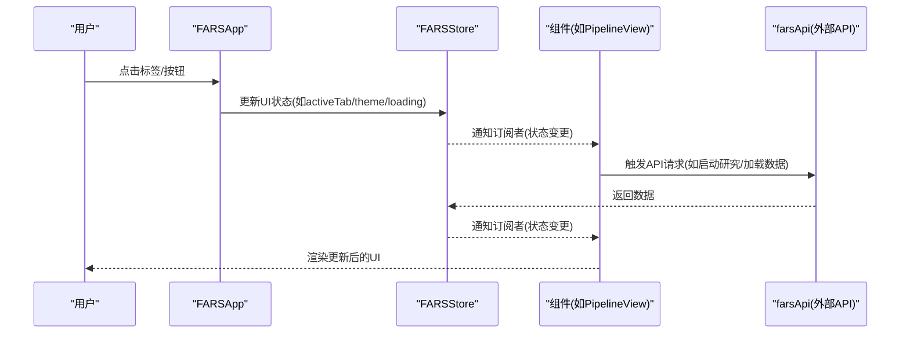

**图表来源**
- [docs/v2/app.js:1-259](file://docs/v2/app.js#L1-L259)
- [docs/v2/state/store.js:1-371](file://docs/v2/state/store.js#L1-L371)
- [docs/v2/components/pipeline-view.js:1-233](file://docs/v2/components/pipeline-view.js#L1-L233)

## 详细组件分析

### 研究流水线（PipelineView）
- 功能要点
  - 展示五阶段流水线：创意构思、计划制定、实验执行、论文撰写、质量评估。
  - 显示整体进度条与阶段进度，根据运行状态动态更新。
  - 提供启动/暂停/停止研究按钮，调用后端API并反馈Toast。
- 关键实现
  - 阶段状态计算：根据elapsed时间推算当前阶段与阶段内进度。
  - UI更新：按钮禁用状态、进度百分比、阶段状态徽标与进度条。
  - 事件绑定：按钮点击触发API调用，失败时Toast提示。
- 使用示例
  - 在页面加载完成后，实例化组件并渲染到容器。
- 代码片段路径
  - [docs/v2/components/pipeline-view.js:1-233](file://docs/v2/components/pipeline-view.js#L1-L233)

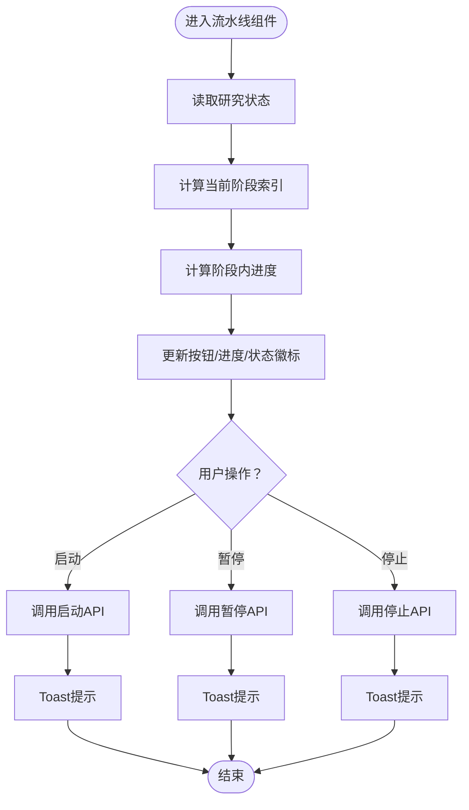

**图表来源**
- [docs/v2/components/pipeline-view.js:84-121](file://docs/v2/components/pipeline-view.js#L84-L121)
- [docs/v2/components/pipeline-view.js:133-163](file://docs/v2/components/pipeline-view.js#L133-L163)

**章节来源**
- [docs/v2/components/pipeline-view.js:1-233](file://docs/v2/components/pipeline-view.js#L1-L233)

### 研究侧边栏（ResearchSidebar）
- 功能要点
  - 统计卡片：论文总数、成功/失败论文、假设数量。
  - 假设列表：模拟数据，展示置信度与状态。
  - 论文列表：按状态过滤，点击选择当前论文。
  - 研究进度：当前阶段、运行时间、完成率。
- 关键实现
  - 加载数据：论文列表与研究状态，更新统计与进度。
  - UI更新：根据状态映射中文文本，格式化时间。
  - 事件绑定：刷新按钮、筛选下拉框、论文项点击。
- 使用示例
  - 在页面加载完成后，实例化组件并渲染到容器。
- 代码片段路径
  - [docs/v2/components/research-sidebar.js:1-299](file://docs/v2/components/research-sidebar.js#L1-L299)

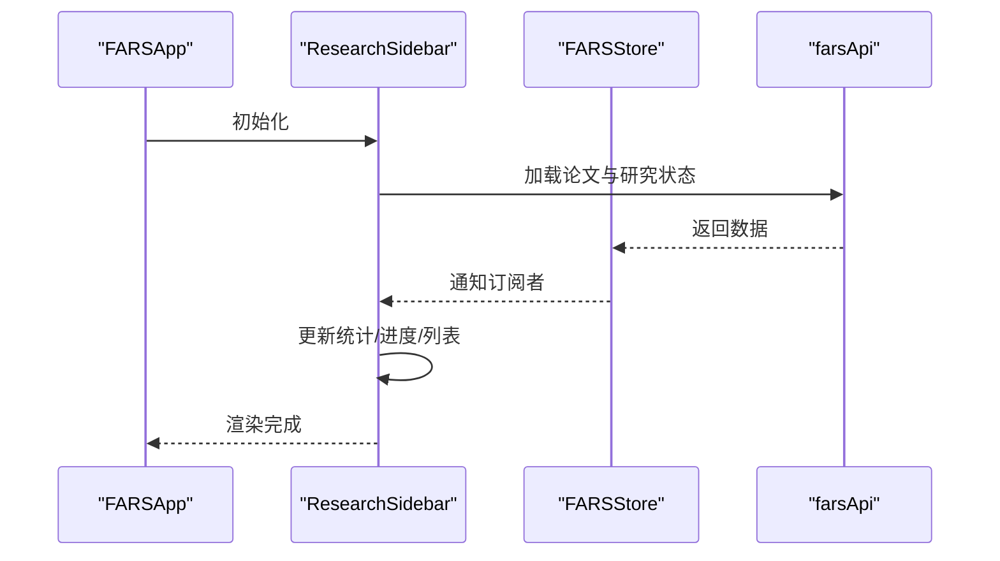

**图表来源**
- [docs/v2/components/research-sidebar.js:111-137](file://docs/v2/components/research-sidebar.js#L111-L137)
- [docs/v2/components/research-sidebar.js:161-187](file://docs/v2/components/research-sidebar.js#L161-L187)

**章节来源**
- [docs/v2/components/research-sidebar.js:1-299](file://docs/v2/components/research-sidebar.js#L1-L299)

### 拓扑图（TopologyGraph）
- 功能要点
  - SVG绘制节点与连线，支持缩放、平移、悬停提示。
  - 图例标识不同节点类型与状态。
  - 节点点击反馈Toast。
- 关键实现
  - 数据加载：优先后端数据，失败则生成演示数据。
  - 视图控制：zoom/group/viewBox更新；鼠标滚轮缩放与拖拽平移。
  - 交互：节点hover显示tooltip，click选择节点。
- 使用示例
  - 在页面加载完成后，实例化组件并渲染到容器。
- 代码片段路径
  - [docs/v2/components/topology-graph.js:1-348](file://docs/v2/components/topology-graph.js#L1-L348)

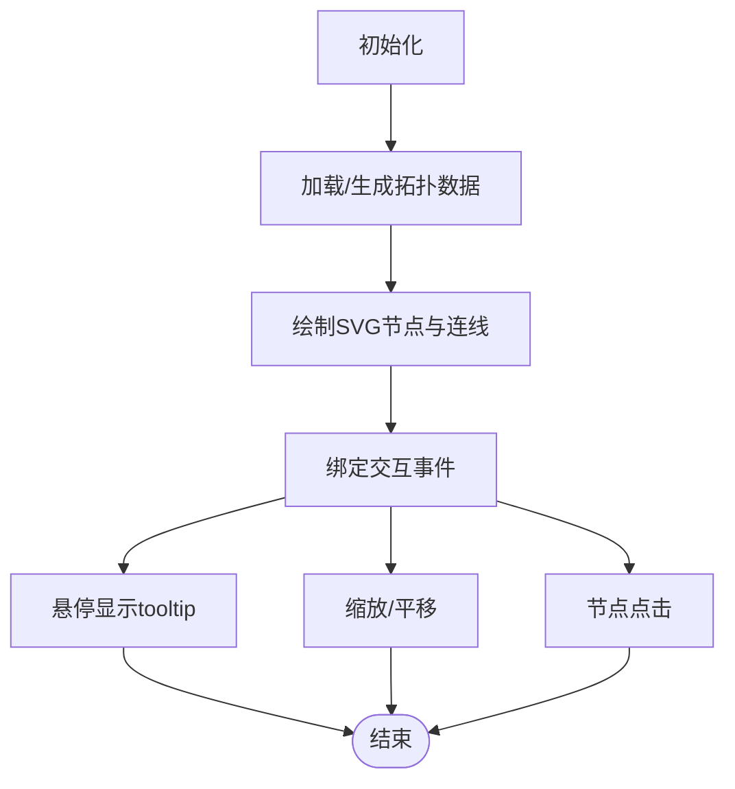

**图表来源**
- [docs/v2/components/topology-graph.js:83-102](file://docs/v2/components/topology-graph.js#L83-L102)
- [docs/v2/components/topology-graph.js:129-185](file://docs/v2/components/topology-graph.js#L129-L185)
- [docs/v2/components/topology-graph.js:255-313](file://docs/v2/components/topology-graph.js#L255-L313)

**章节来源**
- [docs/v2/components/topology-graph.js:1-348](file://docs/v2/components/topology-graph.js#L1-L348)

### 实验面板（ExperimentPanel）
- 功能要点
  - 实验列表：按状态筛选，点击查看详情。
  - 详情页：概览、代码、日志、回测四个标签页。
  - 交互：标签切换、运行/编辑/删除等按钮占位。
- 关键实现
  - 列表渲染：根据状态映射徽标颜色与文本。
  - 详情渲染：动态生成概览网格、代码块、日志条目、回测结果卡片与图表占位。
  - 事件绑定：标签页切换、刷新按钮。
- 使用示例
  - 在页面加载完成后，实例化组件并渲染到容器。
- 代码片段路径
  - [docs/v2/components/experiment-panel.js:1-314](file://docs/v2/components/experiment-panel.js#L1-L314)

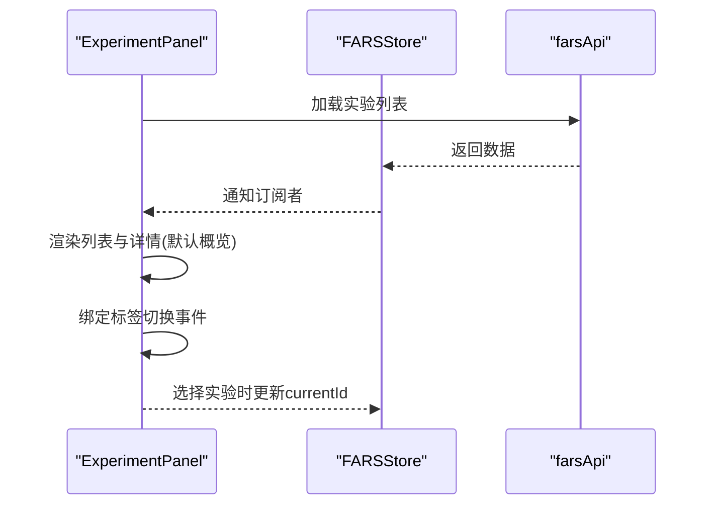

**图表来源**
- [docs/v2/components/experiment-panel.js:59-74](file://docs/v2/components/experiment-panel.js#L59-L74)
- [docs/v2/components/experiment-panel.js:114-118](file://docs/v2/components/experiment-panel.js#L114-L118)
- [docs/v2/components/experiment-panel.js:238-257](file://docs/v2/components/experiment-panel.js#L238-L257)

**章节来源**
- [docs/v2/components/experiment-panel.js:1-314](file://docs/v2/components/experiment-panel.js#L1-L314)

### 质量面板（QualityPanel）
- 功能要点
  - 质量结果列表：按综合评分与类型筛选，点击查看详情。
  - 详情页：综合评分与各项指标（AI检测、学术规范、创新性、完整性）。
  - 三个标签页：AI检测、同行评审、改进建议。
- 关键实现
  - 评分等级：根据分数映射优秀/良好/一般/较差徽标。
  - 详情渲染：检测结果、评审摘要与评论、改进建议列表。
  - 事件绑定：标签切换、刷新按钮。
- 使用示例
  - 在页面加载完成后，实例化组件并渲染到容器。
- 代码片段路径
  - [docs/v2/components/quality-panel.js:1-346](file://docs/v2/components/quality-panel.js#L1-L346)

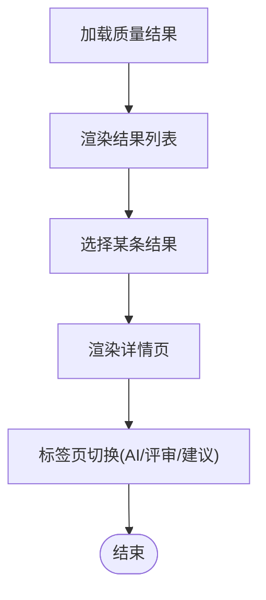

**图表来源**
- [docs/v2/components/quality-panel.js:59-74](file://docs/v2/components/quality-panel.js#L59-L74)
- [docs/v2/components/quality-panel.js:114-117](file://docs/v2/components/quality-panel.js#L114-L117)
- [docs/v2/components/quality-panel.js:238-293](file://docs/v2/components/quality-panel.js#L238-L293)

**章节来源**
- [docs/v2/components/quality-panel.js:1-346](file://docs/v2/components/quality-panel.js#L1-L346)

### 论文对比（PaperCompare）
- 功能要点
  - 论文列表：复选框选择2-4篇论文。
  - 对比按钮：触发对比分析，返回对比结果与洞察。
  - 结果页：对比摘要、表格、雷达图与柱状图占位、洞察列表。
- 关键实现
  - 选择逻辑：限制选择数量，更新按钮可用状态。
  - 对比流程：调用API，成功后渲染结果，失败Toast提示。
  - 事件绑定：对比按钮、清除选择。
- 使用示例
  - 在页面加载完成后，实例化组件并渲染到容器。
- 代码片段路径
  - [docs/v2/components/paper-compare.js:1-316](file://docs/v2/components/paper-compare.js#L1-L316)

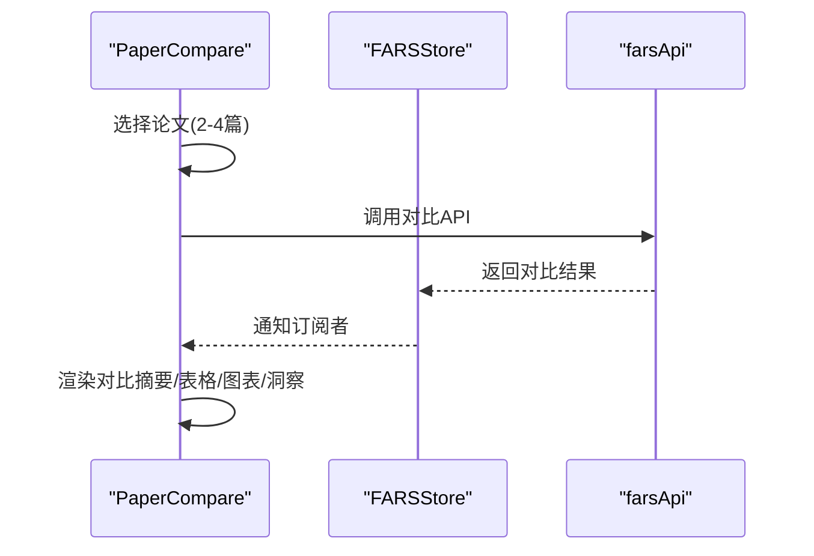

**图表来源**
- [docs/v2/components/paper-compare.js:143-164](file://docs/v2/components/paper-compare.js#L143-L164)
- [docs/v2/components/paper-compare.js:166-261](file://docs/v2/components/paper-compare.js#L166-L261)

**章节来源**
- [docs/v2/components/paper-compare.js:1-316](file://docs/v2/components/paper-compare.js#L1-L316)

### 断点管理（CheckpointManager）
- 功能要点
  - 断点时间线：按时间倒序排列，标记类型与状态。
  - 详情页：断点类型、时间、大小、描述、包含内容、日志。
- 关键实现
  - 时间线渲染：marker线与dot，类型徽标。
  - 内容与日志渲染：图标映射、格式化大小与时长。
  - 事件绑定：刷新按钮、内容点击。
- 使用示例
  - 在页面加载完成后，实例化组件并渲染到容器。
- 代码片段路径
  - [docs/v2/components/checkpoint-manager.js:1-302](file://docs/v2/components/checkpoint-manager.js#L1-L302)

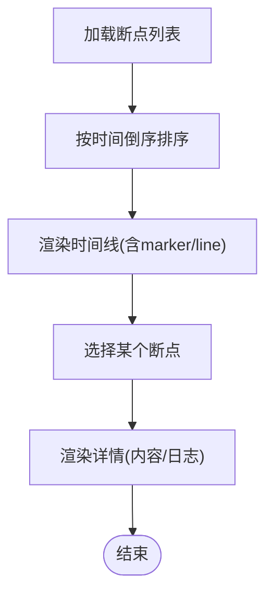

**图表来源**
- [docs/v2/components/checkpoint-manager.js:76-128](file://docs/v2/components/checkpoint-manager.js#L76-L128)
- [docs/v2/components/checkpoint-manager.js:130-200](file://docs/v2/components/checkpoint-manager.js#L130-L200)

**章节来源**
- [docs/v2/components/checkpoint-manager.js:1-302](file://docs/v2/components/checkpoint-manager.js#L1-L302)

### LLM监控（LLMMonitor）
- 功能要点
  - 统计卡片：总调用次数、成功率、总Token数、平均延迟。
  - 调用记录：按状态筛选，点击查看详情。
  - 详情页：请求/响应/Token详情/错误信息四标签页。
  - 自动刷新：每30秒拉取一次数据。
- 关键实现
  - 统计更新：根据stats更新数值。
  - 列表渲染：状态徽标、时间戳、Token与延迟。
  - 详情渲染：JSON格式化、Token拆解、错误堆栈。
  - 事件绑定：刷新按钮、清除日志、筛选下拉框。
- 使用示例
  - 在页面加载完成后，实例化组件并渲染到容器。
- 代码片段路径
  - [docs/v2/components/llm-monitor.js:1-391](file://docs/v2/components/llm-monitor.js#L1-L391)

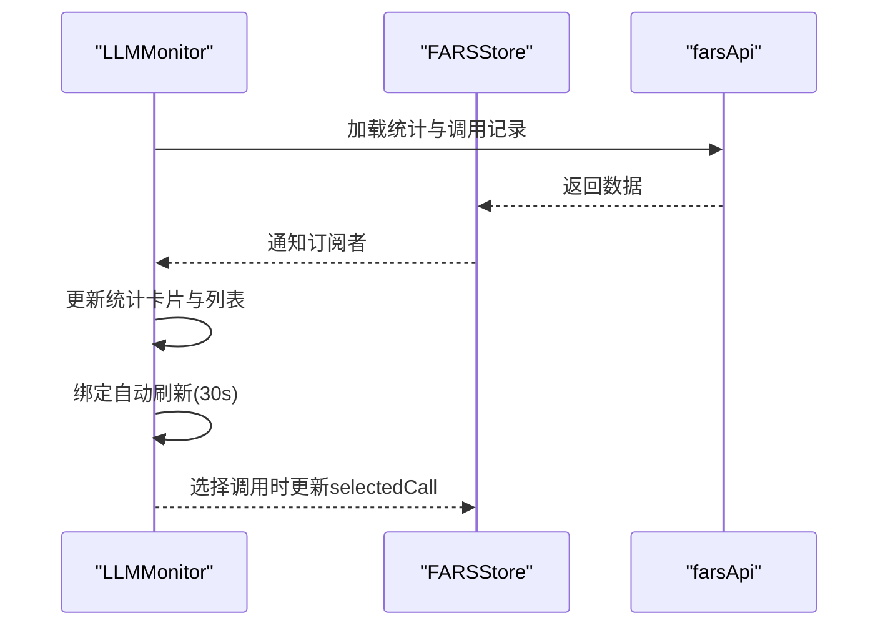

**图表来源**
- [docs/v2/components/llm-monitor.js:89-110](file://docs/v2/components/llm-monitor.js#L89-L110)
- [docs/v2/components/llm-monitor.js:168-172](file://docs/v2/components/llm-monitor.js#L168-L172)
- [docs/v2/components/llm-monitor.js:380-385](file://docs/v2/components/llm-monitor.js#L380-L385)

**章节来源**
- [docs/v2/components/llm-monitor.js:1-391](file://docs/v2/components/llm-monitor.js#L1-L391)

### 主应用（FARSApp）与状态管理（FARSStore）
- 主应用职责
  - 初始化事件监听（标签切换、主题切换、设置按钮、模态框关闭、键盘快捷键）。
  - 初始数据加载：系统状态、研究数据、论文数据、分支数据并发加载。
  - 主题设置：根据store状态设置data-theme属性。
  - Toast容器：订阅UI层toast队列并渲染。
  - 工具函数：日期/时间格式化。
- 状态管理职责
  - 集中式状态：研究、论文、分支、实验、质量、LLM监控、拓扑、断点、UI。
  - 订阅/发布：按slice粒度订阅，避免全量渲染。
  - 深合并更新：setState对嵌套对象进行深合并。
  - 历史与撤销：记录历史，支持undo。
  - 主题持久化：localStorage保存主题，切换后更新DOM属性。
  - Toast管理：入队、去重、定时移除。
- 使用示例
  - 页面加载完成后，创建FARSApp实例并初始化所有组件。
- 代码片段路径
  - [docs/v2/app.js:1-259](file://docs/v2/app.js#L1-L259)
  - [docs/v2/state/store.js:1-371](file://docs/v2/state/store.js#L1-L371)

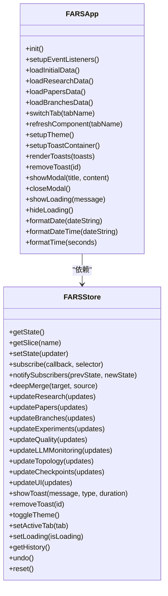

**图表来源**
- [docs/v2/state/store.js:6-365](file://docs/v2/state/store.js#L6-L365)
- [docs/v2/app.js:6-237](file://docs/v2/app.js#L6-L237)

**章节来源**
- [docs/v2/app.js:1-259](file://docs/v2/app.js#L1-L259)
- [docs/v2/state/store.js:1-371](file://docs/v2/state/store.js#L1-L371)

## 依赖分析
- 组件间依赖
  - 组件均依赖全局store与api客户端，通过订阅状态驱动UI更新。
  - 主应用负责事件绑定与全局初始化，组件各自管理局部交互。
- 外部依赖
  - Chart.js（页面引入）、DOMPurify（页面引入）。
- 潜在循环依赖
  - 无直接循环依赖，组件通过store解耦。
- 接口契约
  - 组件通过API客户端调用后端接口，遵循API规范。

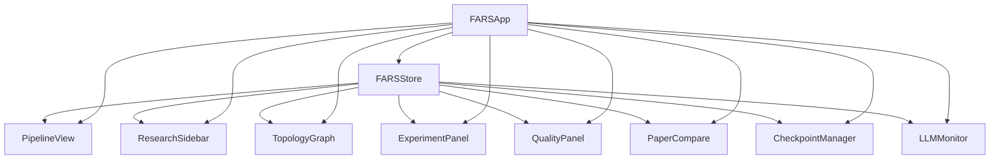

**图表来源**
- [docs/v2/state/store.js:1-371](file://docs/v2/state/store.js#L1-L371)
- [docs/v2/app.js:240-259](file://docs/v2/app.js#L240-L259)

**章节来源**
- [docs/v2/state/store.js:1-371](file://docs/v2/state/store.js#L1-L371)
- [docs/v2/app.js:1-259](file://docs/v2/app.js#L1-L259)
- [docs/API_SPEC.md:1-436](file://docs/API_SPEC.md#L1-L436)

## 性能考虑
- 渲染优化
  - 使用订阅切片（selector）减少不必要的重渲染。
  - 列表渲染采用虚拟滚动思想（滚动容器与固定高度），避免大量DOM节点一次性渲染。
- 网络优化
  - 并发加载初始数据（Promise.all）。
  - LLM监控组件30秒自动刷新，避免频繁轮询造成压力。
- 计算优化
  - 进度计算与时间格式化在前端完成，避免重复计算。
  - 拓扑图缩放与平移通过viewBox更新，避免重建SVG元素。
- 存储优化
  - 状态历史限制长度，避免内存膨胀。
  - 主题与Toast持久化于localStorage与内存，减少IO开销。

[本节为通用指导，无需特定文件引用]

## 故障排查指南
- 无法加载初始数据
  - 检查API是否可达与返回格式是否符合预期。
  - 查看控制台错误与Toast提示。
- 主题切换无效
  - 确认data-theme属性是否正确写入DOM。
  - 检查localStorage中主题值是否更新。
- 组件不更新
  - 确认组件是否正确订阅对应状态slice。
  - 检查store的setState是否被调用且深合并生效。
- 拓扑图交互异常
  - 检查SVG容器尺寸与viewBox更新逻辑。
  - 确认事件绑定顺序与防抖处理。
- LLM监控无数据
  - 检查stats与calls是否正确写入store。
  - 确认自动刷新定时器是否生效。

**章节来源**
- [docs/v2/app.js:60-83](file://docs/v2/app.js#L60-L83)
- [docs/v2/state/store.js:119-132](file://docs/v2/state/store.js#L119-L132)
- [docs/v2/components/llm-monitor.js:380-385](file://docs/v2/components/llm-monitor.js#L380-L385)

## 结论
该前端界面系统以原生JavaScript实现了清晰的组件化架构与集中式状态管理，具备良好的扩展性与可维护性。通过统一的应用控制器与状态管理，组件间解耦良好，交互流畅。建议后续可引入Vue或React以进一步提升开发效率与组件复用能力，同时保持现有状态管理与API契约不变。

[本节为总结性内容，无需特定文件引用]

## 附录

### 组件树结构与路由配置
- 组件树结构
  - 页面根容器包含头部、导航标签、主内容区与Toast/模态框。
  - 主内容区为多个标签页，每个标签页对应一个组件容器。
- 路由配置
  - 采用原生标签页切换而非SPA路由，通过切换active类与store状态实现视图切换。
  - 支持键盘快捷键（Esc关闭模态框）。

**章节来源**
- [docs/v2/index.html:35-88](file://docs/v2/index.html#L35-L88)
- [docs/v2/app.js:124-145](file://docs/v2/app.js#L124-L145)

### 视觉外观与交互模式
- 主题系统
  - 深色/浅色双主题，通过data-theme属性与CSS变量切换。
  - 主题切换持久化至localStorage。
- 交互模式
  - 悬停高亮、点击选择、禁用态按钮、加载Spinner。
  - Toast通知、模态框弹窗、空状态占位。
- 响应式设计
  - 移动端适配：网格与布局在小屏下自动调整。

**章节来源**
- [docs/v2/css/v2-dashboard.css:1-732](file://docs/v2/css/v2-dashboard.css#L1-L732)
- [docs/v2/app.js:147-150](file://docs/v2/app.js#L147-L150)
- [docs/v2/state/store.js:280-286](file://docs/v2/state/store.js#L280-L286)

### 样式自定义与主题支持
- CSS变量
  - 使用:root与[data-theme="light"]定义主题变量，便于主题切换。
- 组件样式
  - 卡片、按钮、列表、表格、图表占位等统一风格。
- 主题扩展
  - 新增主题时仅需补充CSS变量与切换逻辑。

**章节来源**
- [docs/v2/css/v2-dashboard.css:2-25](file://docs/v2/css/v2-dashboard.css#L2-L25)
- [docs/v2/state/store.js:280-286](file://docs/v2/state/store.js#L280-L286)

### 跨浏览器兼容性与无障碍建议
- 兼容性
  - 使用现代ES6语法与标准DOM API，确保主流浏览器可用。
  - SVG交互与CSS变量在现代浏览器中表现稳定。
- 无障碍建议
  - 为按钮与交互元素提供aria-label与title。
  - 为表格与列表提供语义化结构与可读性增强。
  - 为模态框提供焦点管理与键盘导航支持。

[本节为通用指导，无需特定文件引用]

### API集成与数据流
- API规范
  - 文档定义了完整的REST API与WebSocket消息类型。
- 数据流
  - 组件通过API客户端发起请求，后端返回数据写入store，组件订阅后更新UI。
- 错误处理
  - 统一的错误响应格式，组件捕获错误并通过Toast提示。

**章节来源**
- [docs/API_SPEC.md:1-436](file://docs/API_SPEC.md#L1-L436)
- [docs/v2/components/pipeline-view.js:135-142](file://docs/v2/components/pipeline-view.js#L135-L142)