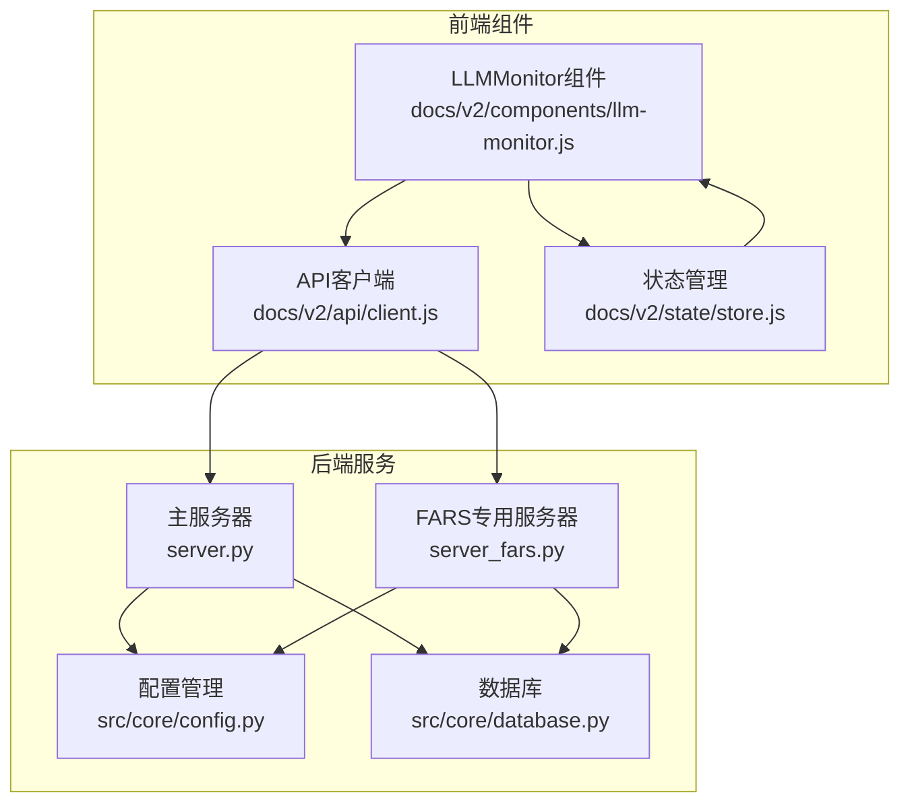
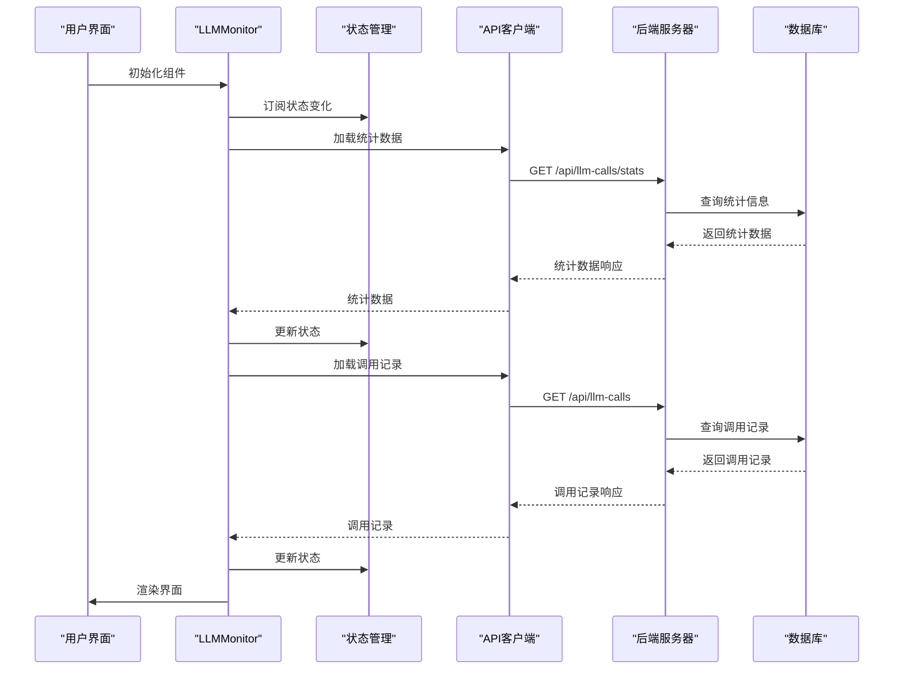
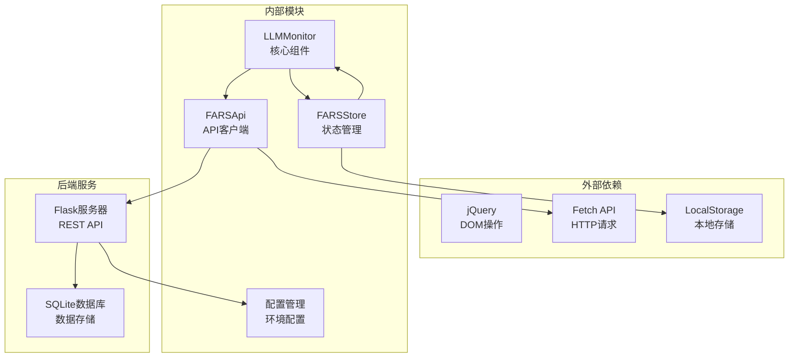

# LLM监控器组件

<cite>
**本文档引用的文件**
- [llm-monitor.js](file://docs/v2/components/llm-monitor.js)
- [client.js](file://docs/v2/api/client.js)
- [store.js](file://docs/v2/state/store.js)
- [config.py](file://src/core/config.py)
- [database.py](file://src/core/database.py)
- [server.py](file://server.py)
- [server_fars.py](file://server_fars.py)
</cite>

## 目录
1. [简介](#简介)
2. [项目结构](#项目结构)
3. [核心组件](#核心组件)
4. [架构概览](#架构概览)
5. [详细组件分析](#详细组件分析)
6. [依赖关系分析](#依赖关系分析)
7. [性能考虑](#性能考虑)
8. [故障排除指南](#故障排除指南)
9. [结论](#结论)

## 简介

LLMMonitor LLM监控器组件是FARS v2系统中的重要组成部分，负责监控和展示大语言模型的调用情况。该组件提供了完整的LLM调用监控解决方案，包括请求统计、响应时间分析、成本计算、实时数据展示等功能。

该监控器采用前后端分离的设计模式，前端使用JavaScript构建交互式界面，后端通过Flask API提供数据服务。组件支持多种LLM提供商的集成，包括OpenAI、MiniMax、Anthropic等主流平台。

## 项目结构

LLM监控器组件在项目中的组织结构如下：

**图表来源**
- [llm-monitor.js:1-391](file://docs/v2/components/llm-monitor.js#L1-L391)
- [client.js:1-274](file://docs/v2/api/client.js#L1-L274)
- [store.js:1-371](file://docs/v2/state/store.js#L1-L371)

**章节来源**
- [llm-monitor.js:1-391](file://docs/v2/components/llm-monitor.js#L1-L391)
- [client.js:1-274](file://docs/v2/api/client.js#L1-L274)
- [store.js:1-371](file://docs/v2/state/store.js#L1-L371)

## 核心组件

### LLMMonitor类

LLMMonitor是监控器的核心类，负责管理整个监控界面的生命周期和数据流。

**主要功能特性：**
- 实时数据加载和更新
- 用户界面渲染和交互
- 状态管理和事件处理
- 数据过滤和排序
- 统计信息计算和展示

**关键属性：**
- `container`: DOM容器元素
- `store`: 全局状态管理器
- `api`: API客户端实例
- `llmCalls`: LLM调用记录数组
- `selectedCall`: 当前选中的调用记录
- `stats`: 统计数据对象

**章节来源**
- [llm-monitor.js:6-17](file://docs/v2/components/llm-monitor.js#L6-L17)

### API客户端

FARSApi类封装了所有与后端通信的REST API调用。

**主要API端点：**
- `/api/llm-calls` - 获取LLM调用记录
- `/api/llm-calls/{id}` - 获取特定调用详情
- `/api/llm-calls/stats` - 获取统计信息

**章节来源**
- [client.js:34-53](file://docs/v2/api/client.js#L34-L53)
- [client.js:188-200](file://docs/v2/api/client.js#L188-L200)

### 状态管理系统

FARSStore提供集中式的状态管理，支持订阅/发布模式。

**监控相关状态：**
- `llmMonitoring.calls`: LLM调用记录列表
- `llmMonitoring.stats`: 统计数据
- `llmMonitoring.selectedCall`: 当前选中的调用

**章节来源**
- [store.js:43-48](file://docs/v2/state/store.js#L43-L48)
- [store.js:204-213](file://docs/v2/state/store.js#L204-L213)

## 架构概览

LLM监控器采用三层架构设计：

**图表来源**
- [llm-monitor.js:19-24](file://docs/v2/components/llm-monitor.js#L19-L24)
- [llm-monitor.js:89-110](file://docs/v2/components/llm-monitor.js#L89-L110)
- [client.js:56-76](file://docs/v2/api/client.js#L56-L76)

**章节来源**
- [llm-monitor.js:19-110](file://docs/v2/components/llm-monitor.js#L19-L110)
- [client.js:56-200](file://docs/v2/api/client.js#L56-L200)

## 详细组件分析

### 数据收集机制

LLM监控器的数据收集机制分为两个层面：

#### 前端数据收集
- **自动刷新**: 每30秒自动从后端拉取最新数据
- **手动刷新**: 用户点击刷新按钮触发数据更新
- **状态订阅**: 通过store订阅机制实现实时状态同步

#### 后端数据收集
- **LLM使用统计**: 通过`_bump_llm_usage`函数累积调用统计
- **进行中调用跟踪**: 使用`_LLM_INFLIGHT`字典跟踪活跃的LLM请求
- **错误计数**: 统计失败的LLM调用次数

**章节来源**
- [llm-monitor.js:380-385](file://docs/v2/components/llm-monitor.js#L380-L385)
- [server.py:489-553](file://server.py#L489-L553)
- [server.py:568-620](file://server.py#L568-L620)

### 存储策略

系统采用多层存储策略确保数据的可靠性和性能：

#### 前端存储
- **内存缓存**: 使用store.js的内存状态管理
- **本地持久化**: 利用localStorage进行配置持久化

#### 后端存储
- **SQLite数据库**: 使用轻量级SQLite存储论文、实验等数据
- **文件系统**: 配置文件和日志文件的存储

**章节来源**
- [database.py:23-189](file://src/core/database.py#L23-L189)
- [store.js:280-286](file://docs/v2/state/store.js#L280-L286)

### 实时展示机制

LLM监控器提供了丰富的实时展示功能：

#### 统计面板
- 总调用次数
- 成功率百分比
- 总Token数
- 平均延迟

#### 调用记录列表
- 支持按状态过滤（全部、成功、失败、进行中）
- 实时更新调用状态
- 点击查看详情

#### 详细信息面板
- 请求内容展示
- 响应内容展示
- Token使用详情
- 错误信息展示

**章节来源**
- [llm-monitor.js:37-56](file://docs/v2/components/llm-monitor.js#L37-L56)
- [llm-monitor.js:121-166](file://docs/v2/components/llm-monitor.js#L121-L166)
- [llm-monitor.js:174-294](file://docs/v2/components/llm-monitor.js#L174-L294)

### 性能指标计算

系统实现了全面的性能指标计算：

#### 基础统计指标
- **调用次数**: 总调用次数统计
- **成功率**: 成功调用占总调用的比例
- **Token使用**: 提示词Token和完成Token的统计
- **延迟分析**: 平均响应时间和延迟分布

#### 高级分析指标
- **成本估算**: 基于Token使用的成本计算
- **趋势分析**: 时间序列的趋势变化
- **异常检测**: 基于阈值的异常调用识别

**章节来源**
- [llm-monitor.js:112-119](file://docs/v2/components/llm-monitor.js#L112-L119)
- [server.py:700-717](file://server.py#L700-L717)

### 配额管理与限流控制

系统提供了灵活的配额管理和限流控制机制：

#### 配额管理
- **多API密钥支持**: 支持配置多个API密钥
- **负载均衡**: 在多个API密钥间分配请求
- **使用统计**: 实时跟踪每个密钥的使用情况

#### 限流控制
- **请求频率限制**: 防止过度请求
- **并发控制**: 限制同时进行的LLM调用数量
- **超时处理**: 统一的请求超时设置

**章节来源**
- [config.py:447-484](file://src/core/config.py#L447-L484)
- [server.py:370-390](file://server.py#L370-L390)

### 错误重试机制

系统实现了智能的错误重试机制：

#### 重试策略
- **指数退避**: 逐步增加重试间隔
- **最大重试次数**: 防止无限重试循环
- **错误分类**: 区分可重试和不可重试错误

#### 错误处理
- **自动重试**: 网络错误和临时故障的自动恢复
- **降级处理**: 在服务不可用时的降级方案
- **用户通知**: 通过toast消息通知用户重试状态

**章节来源**
- [store.js:248-267](file://docs/v2/state/store.js#L248-L267)
- [server.py:773-800](file://server.py#L773-L800)

### 配置参数

LLM监控器支持丰富的配置参数：

#### LLM提供商配置
- **提供商类型**: 支持OpenAI、MiniMax、Anthropic等
- **模型选择**: 不同提供商的可用模型列表
- **基础URL**: API端点的基础URL
- **上下文窗口**: 模型的最大上下文长度

#### 监控配置
- **刷新间隔**: 自动刷新的时间间隔
- **数据保留**: 历史数据的保留策略
- **告警阈值**: 性能和使用量的告警阈值

**章节来源**
- [config.py:204-251](file://src/core/config.py#L204-L251)
- [config.py:388-417](file://src/core/config.py#L388-L417)

### 与不同LLM提供商的集成

系统支持多种LLM提供商的无缝集成：

#### 已支持的提供商
- **OpenAI**: GPT系列模型支持
- **MiniMax**: MiniMax M2系列模型
- **Anthropic**: Claude系列模型
- **DeepSeek**: DeepSeek聊天和代码模型
- **Ollama**: 本地模型推理支持

#### API适配
- **统一接口**: 所有提供商使用相同的API接口
- **参数映射**: 不同提供商间的参数转换
- **错误处理**: 统一的错误处理机制

**章节来源**
- [config.py:206-250](file://src/core/config.py#L206-L250)
- [server.py:428-454](file://server.py#L428-L454)

### 日志记录与审计追踪

系统提供了完善的日志记录和审计追踪功能：

#### 日志级别
- **调试日志**: 详细的系统运行信息
- **信息日志**: 一般性的操作记录
- **警告日志**: 潜在问题的预警
- **错误日志**: 错误和异常信息

#### 审计追踪
- **操作日志**: 记录所有重要的用户操作
- **系统事件**: 记录系统状态变化
- **性能监控**: 记录性能相关的指标

**章节来源**
- [config.py:62-95](file://src/core/config.py#L62-L95)
- [database.py:150-163](file://src/core/database.py#L150-L163)

## 依赖关系分析

LLM监控器组件的依赖关系如下：

**图表来源**
- [llm-monitor.js:7-11](file://docs/v2/components/llm-monitor.js#L7-L11)
- [client.js:56-76](file://docs/v2/api/client.js#L56-L76)
- [store.js:368-371](file://docs/v2/state/store.js#L368-L371)

**章节来源**
- [llm-monitor.js:7-11](file://docs/v2/components/llm-monitor.js#L7-L11)
- [client.js:56-76](file://docs/v2/api/client.js#L56-L76)
- [store.js:368-371](file://docs/v2/state/store.js#L368-L371)

## 性能考虑

### 前端性能优化

#### 渲染优化
- **虚拟滚动**: 大数据集的高效渲染
- **防抖处理**: 频繁操作的防抖机制
- **懒加载**: 按需加载数据和资源

#### 内存管理
- **对象池**: 复用DOM元素和数据对象
- **垃圾回收**: 及时清理不再使用的资源
- **内存泄漏防护**: 防止事件监听器泄漏

### 后端性能优化

#### 数据库优化
- **索引策略**: 为常用查询字段建立索引
- **查询优化**: 减少不必要的数据传输
- **连接池**: 管理数据库连接的复用

#### 缓存策略
- **Redis缓存**: 热点数据的缓存
- **浏览器缓存**: 前端静态资源的缓存
- **CDN加速**: 静态资源的全球分发

## 故障排除指南

### 常见问题诊断

#### 数据不更新
1. **检查网络连接**: 确认前端能够访问后端API
2. **验证API权限**: 确认API密钥配置正确
3. **查看浏览器控制台**: 检查JavaScript错误信息

#### 性能问题
1. **监控CPU使用率**: 检查是否有过多的DOM操作
2. **分析网络请求**: 查看是否有重复或不必要的请求
3. **检查内存泄漏**: 使用浏览器开发者工具分析内存使用

#### 配置问题
1. **验证环境变量**: 确认所有必需的环境变量已设置
2. **检查配置文件**: 验证config.json的格式和内容
3. **重启服务**: 在修改配置后重启相关服务

**章节来源**
- [llm-monitor.js:106-110](file://docs/v2/components/llm-monitor.js#L106-L110)
- [store.js:248-267](file://docs/v2/state/store.js#L248-L267)

### 调试技巧

#### 前端调试
- **使用浏览器开发者工具**: 设置断点和观察变量变化
- **启用详细日志**: 在开发环境中启用更多的日志输出
- **模拟网络条件**: 测试在不同网络环境下的表现

#### 后端调试
- **查看服务器日志**: 分析Flask应用的运行日志
- **监控数据库查询**: 使用慢查询日志分析数据库性能
- **使用调试模式**: 在开发环境中启用调试模式

## 结论

LLMMonitor LLM监控器组件是一个功能完整、架构清晰的监控解决方案。它成功地将前端交互、后端服务和数据存储有机结合，为用户提供了一个直观、实时的LLM调用监控界面。

该组件的主要优势包括：

1. **全面的功能覆盖**: 从基本的调用统计到高级的性能分析
2. **灵活的配置选项**: 支持多种LLM提供商和自定义配置
3. **良好的用户体验**: 实时更新、响应式设计和友好的交互界面
4. **可靠的架构设计**: 前后端分离、状态管理清晰、错误处理完善

未来可以考虑的改进方向：
- 增加更多的可视化图表和仪表板
- 实现更精细的告警和通知机制
- 添加更多的性能指标和分析功能
- 优化大数据集的处理性能