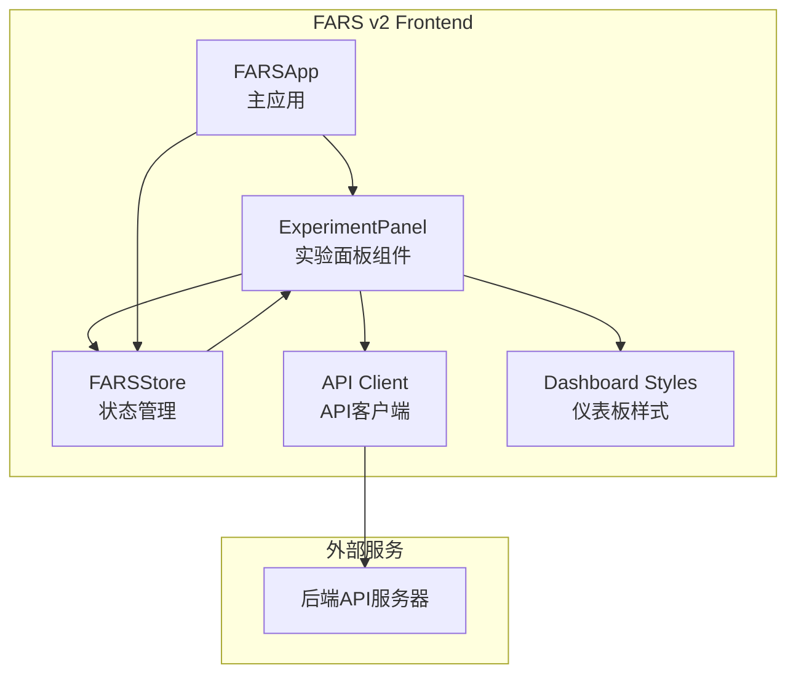
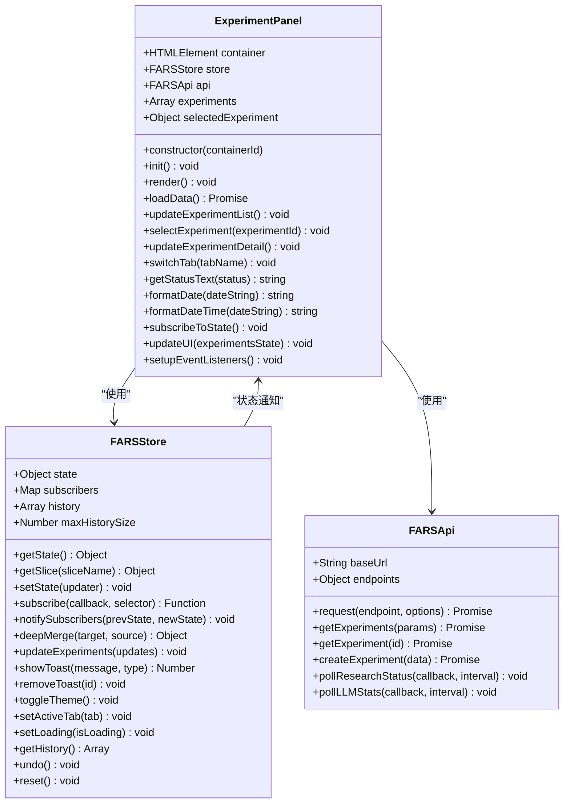
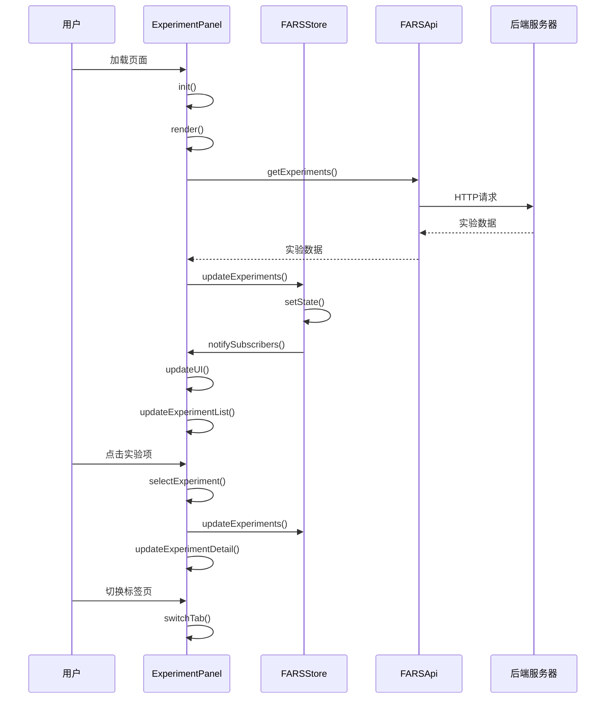
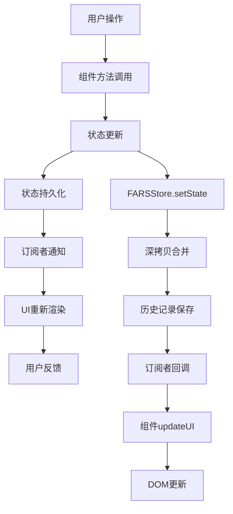
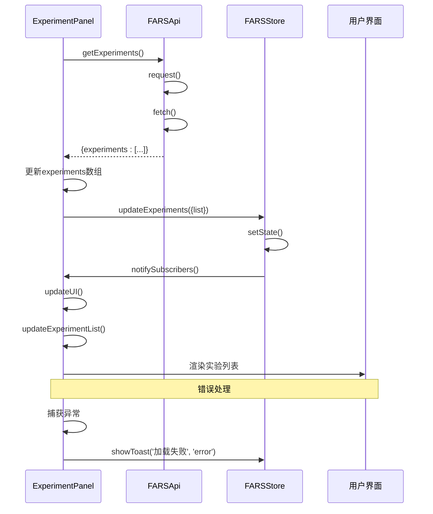
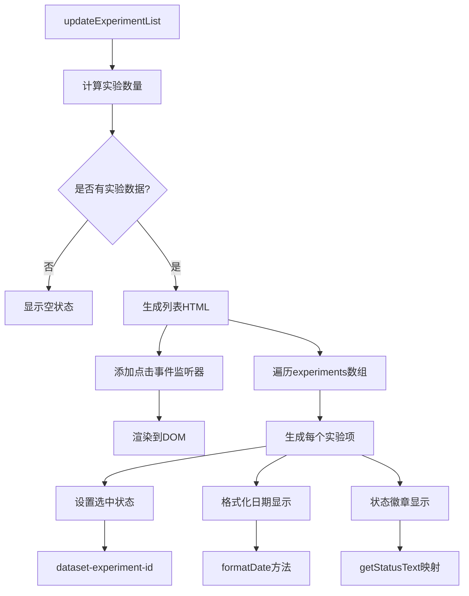
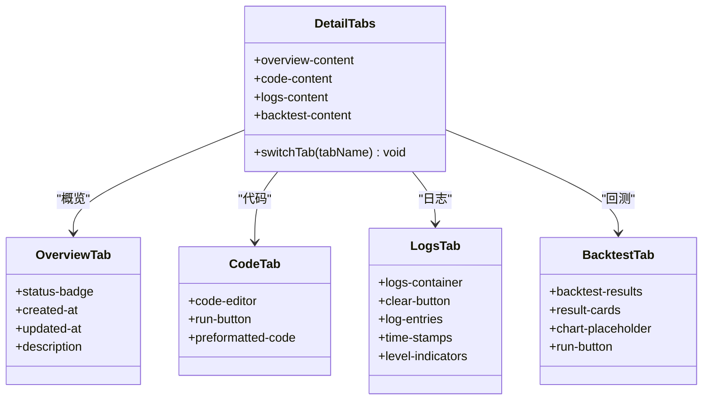
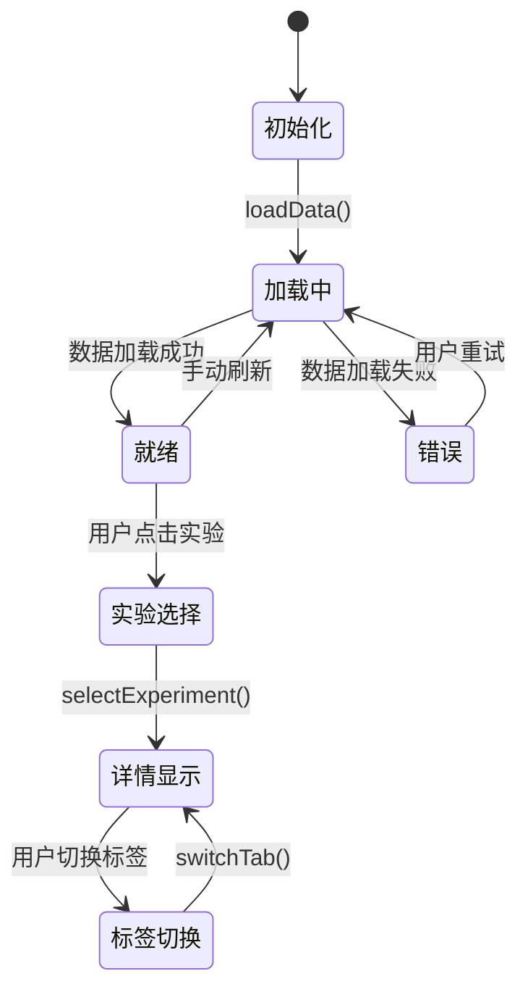
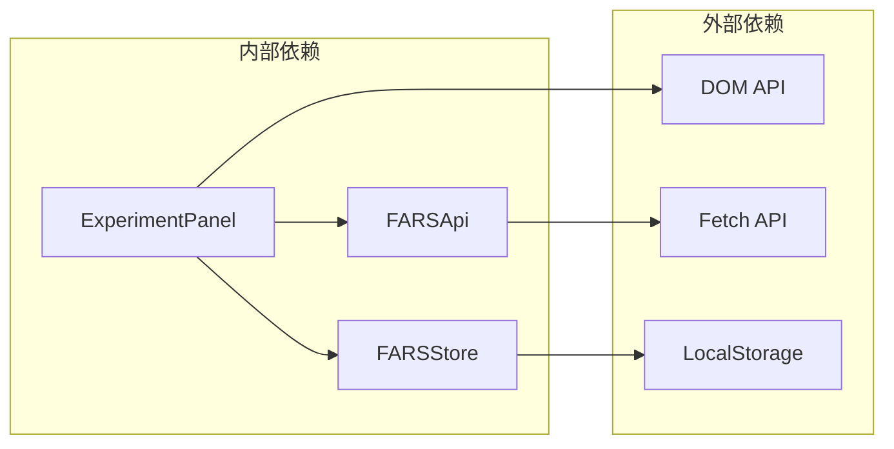
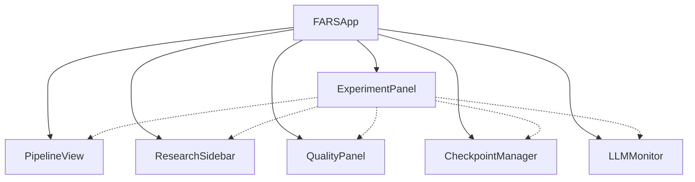

# 实验面板组件

<cite>
**本文档引用的文件**
- [experiment-panel.js](file://docs/v2/components/experiment-panel.js)
- [store.js](file://docs/v2/state/store.js)
- [client.js](file://docs/v2/api/client.js)
- [v2-dashboard.css](file://docs/v2/css/v2-dashboard.css)
- [app.js](file://docs/v2/app.js)
</cite>

## 目录
1. [简介](#简介)
2. [项目结构](#项目结构)
3. [核心组件](#核心组件)
4. [架构概览](#架构概览)
5. [详细组件分析](#详细组件分析)
6. [依赖关系分析](#依赖关系分析)
7. [性能考虑](#性能考虑)
8. [故障排除指南](#故障排除指南)
9. [结论](#结论)

## 简介

ExperimentPanel实验面板组件是FARS v2全自动科研系统中的核心组件之一，负责管理和展示实验数据。该组件提供了完整的实验生命周期管理功能，包括实验列表渲染、实验详情展示、状态切换机制等。组件采用现代化的前端架构设计，集成了响应式布局、状态管理、API通信等功能特性。

## 项目结构

ExperimentPanel组件位于FARS v2项目的组件目录中，与状态管理、API客户端、样式文件协同工作：



**图表来源**
- [experiment-panel.js:1-314](file://docs/v2/components/experiment-panel.js#L1-L314)
- [store.js:1-371](file://docs/v2/state/store.js#L1-L371)
- [client.js:1-274](file://docs/v2/api/client.js#L1-L274)

**章节来源**
- [experiment-panel.js:1-314](file://docs/v2/components/experiment-panel.js#L1-L314)
- [store.js:1-371](file://docs/v2/state/store.js#L1-L371)
- [client.js:1-274](file://docs/v2/api/client.js#L1-L274)

## 核心组件

### 组件架构设计

ExperimentPanel采用类组件模式，实现了完整的MVC架构模式：



**图表来源**
- [experiment-panel.js:6-309](file://docs/v2/components/experiment-panel.js#L6-L309)
- [store.js:6-365](file://docs/v2/state/store.js#L6-L365)
- [client.js:6-271](file://docs/v2/api/client.js#L6-L271)

### 数据模型

组件维护的核心数据结构：

| 字段名 | 类型 | 描述 | 默认值 |
|--------|------|------|--------|
| experiments | Array | 实验数据数组 | [] |
| selectedExperiment | Object | 当前选中的实验 | null |
| container | HTMLElement | DOM容器元素 | - |
| store | FARSStore | 状态管理实例 | - |
| api | FARSApi | API客户端实例 | - |

**章节来源**
- [experiment-panel.js:7-16](file://docs/v2/components/experiment-panel.js#L7-L16)
- [store.js:31-35](file://docs/v2/state/store.js#L31-L35)

## 架构概览

### 整体架构流程



**图表来源**
- [experiment-panel.js:18-296](file://docs/v2/components/experiment-panel.js#L18-L296)
- [store.js:109-132](file://docs/v2/state/store.js#L109-L132)
- [client.js:160-168](file://docs/v2/api/client.js#L160-L168)

### 状态管理模式

组件采用单向数据流的状态管理模式：



**图表来源**
- [store.js:86-107](file://docs/v2/state/store.js#L86-L107)
- [store.js:119-132](file://docs/v2/state/store.js#L119-L132)

**章节来源**
- [experiment-panel.js:18-296](file://docs/v2/components/experiment-panel.js#L18-L296)
- [store.js:86-132](file://docs/v2/state/store.js#L86-L132)

## 详细组件分析

### 初始化流程

组件的初始化过程遵循标准的MVC初始化模式：

```mermaid
flowchart TD
A[构造函数调用] --> B[获取DOM容器]
B --> C[获取全局store和api]
C --> D[初始化属性]
D --> E[init()方法]
E --> F[render()渲染DOM]
F --> G[loadData()加载数据]
G --> H[subscribeToState()订阅状态]
H --> I[就绪状态]
G --> J[API.getExperiments]
J --> K[更新store.experiments]
K --> L[触发状态变更]
L --> M[组件updateUI]
M --> N[更新实验列表]
```

**图表来源**
- [experiment-panel.js:7-22](file://docs/v2/components/experiment-panel.js#L7-L22)
- [experiment-panel.js:59-74](file://docs/v2/components/experiment-panel.js#L59-L74)
- [experiment-panel.js:282-289](file://docs/v2/components/experiment-panel.js#L282-L289)

#### 初始化步骤详解

1. **构造函数阶段**：接收容器ID，初始化内部属性
2. **init()阶段**：执行渲染、数据加载、状态订阅
3. **渲染阶段**：生成基础DOM结构
4. **数据加载阶段**：通过API获取实验数据
5. **状态订阅阶段**：建立与全局状态的双向通信

**章节来源**
- [experiment-panel.js:7-22](file://docs/v2/components/experiment-panel.js#L7-L22)

### 数据加载机制

组件的数据加载采用异步模式，确保用户体验流畅：



**图表来源**
- [experiment-panel.js:59-74](file://docs/v2/components/experiment-panel.js#L59-L74)
- [client.js:160-164](file://docs/v2/api/client.js#L160-L164)
- [store.js:182-191](file://docs/v2/state/store.js#L182-L191)

#### 数据加载特点

- **异步处理**：使用Promise和async/await模式
- **错误处理**：统一的错误捕获和用户提示
- **状态同步**：数据更新后自动同步到全局状态
- **性能优化**：避免重复渲染，只在必要时更新DOM

**章节来源**
- [experiment-panel.js:59-74](file://docs/v2/components/experiment-panel.js#L59-L74)
- [client.js:160-164](file://docs/v2/api/client.js#L160-L164)

### 实验列表渲染

实验列表采用响应式设计，支持动态内容更新：



**图表来源**
- [experiment-panel.js:76-112](file://docs/v2/components/experiment-panel.js#L76-L112)
- [experiment-panel.js:259-280](file://docs/v2/components/experiment-panel.js#L259-L280)

#### 列表渲染特性

- **动态更新**：状态变化时自动重新渲染
- **选中状态管理**：当前选中实验高亮显示
- **状态可视化**：不同状态对应不同颜色徽章
- **交互性**：支持点击选择实验

**章节来源**
- [experiment-panel.js:76-112](file://docs/v2/components/experiment-panel.js#L76-L112)

### 实验详情展示

详情页面采用多标签页设计，提供完整的实验信息展示：



**图表来源**
- [experiment-panel.js:120-245](file://docs/v2/components/experiment-panel.js#L120-L245)

#### 标签页功能

1. **概览标签**：显示实验基本信息和状态
2. **代码标签**：展示实验代码，支持运行操作
3. **日志标签**：实时显示实验执行日志
4. **回测标签**：展示回测结果和图表

**章节来源**
- [experiment-panel.js:120-245](file://docs/v2/components/experiment-panel.js#L120-L245)

### 状态切换机制

组件实现了完整的状态管理机制：



**图表来源**
- [experiment-panel.js:114-118](file://docs/v2/components/experiment-panel.js#L114-L118)
- [experiment-panel.js:247-257](file://docs/v2/components/experiment-panel.js#L247-L257)

#### 状态转换逻辑

- **初始化状态**：组件创建但未加载数据
- **加载中状态**：正在从API获取数据
- **就绪状态**：数据加载完成，可交互
- **错误状态**：数据加载失败，显示错误信息
- **实验选择状态**：用户选择了某个实验
- **详情显示状态**：正在显示所选实验的详情

**章节来源**
- [experiment-panel.js:114-118](file://docs/v2/components/experiment-panel.js#L114-L118)
- [experiment-panel.js:247-257](file://docs/v2/components/experiment-panel.js#L247-L257)

### 时间格式化功能

组件提供了完善的时间处理功能：

| 方法 | 输入 | 输出 | 用途 |
|------|------|------|------|
| formatDate | dateString | "YYYY-MM-DD" | 显示实验创建日期 |
| formatDateTime | dateString | "YYYY-MM-DD HH:mm:ss" | 显示详细时间戳 |
| getStatusText | status | 中文状态文本 | 状态徽章显示 |

**章节来源**
- [experiment-panel.js:270-280](file://docs/v2/components/experiment-panel.js#L270-L280)

## 依赖关系分析

### 外部依赖

组件依赖于以下外部系统：



**图表来源**
- [experiment-panel.js:8-10](file://docs/v2/components/experiment-panel.js#L8-L10)
- [store.js:368-368](file://docs/v2/state/store.js#L368-L368)
- [client.js:66-76](file://docs/v2/api/client.js#L66-L76)

### 内部耦合度

组件与其他组件的交互关系：



**图表来源**
- [app.js:246-253](file://docs/v2/app.js#L246-L253)

**章节来源**
- [experiment-panel.js:8-10](file://docs/v2/components/experiment-panel.js#L8-L10)
- [app.js:246-253](file://docs/v2/app.js#L246-L253)

## 性能考虑

### 渲染优化

组件采用了多项性能优化策略：

1. **条件渲染**：空状态和加载状态的差异化处理
2. **事件委托**：使用事件冒泡减少事件监听器数量
3. **DOM缓存**：缓存频繁访问的DOM元素
4. **按需更新**：只在状态变化时更新相关DOM

### 内存管理

- **事件监听器清理**：组件销毁时移除所有事件监听器
- **循环引用避免**：使用弱引用避免内存泄漏
- **定时器管理**：及时清理可能存在的定时器

### 网络优化

- **错误重试机制**：网络请求失败时的自动重试
- **超时控制**：合理的请求超时设置
- **缓存策略**：避免重复的API调用

## 故障排除指南

### 常见问题及解决方案

#### 实验数据无法加载

**症状**：实验列表显示"加载中"或"暂无实验数据"

**可能原因**：
1. API服务器不可达
2. 网络连接问题
3. 认证失败
4. 数据格式不正确

**解决步骤**：
1. 检查浏览器开发者工具的网络面板
2. 验证API端点是否可达
3. 确认认证令牌有效
4. 查看控制台错误信息

#### 状态更新不生效

**症状**：修改实验状态后UI没有更新

**可能原因**：
1. 状态订阅未正确设置
2. 状态更新方法调用错误
3. 订阅者过滤条件不匹配

**解决步骤**：
1. 检查`subscribeToState()`方法调用
2. 验证`updateUI()`方法的实现
3. 确认状态选择器函数正确

#### 样式显示异常

**症状**：组件样式错乱或显示不正确

**可能原因**：
1. CSS文件未正确加载
2. 主题配置冲突
3. 响应式断点问题

**解决步骤**：
1. 检查CSS文件路径
2. 验证主题变量设置
3. 测试不同屏幕尺寸下的显示效果

**章节来源**
- [experiment-panel.js:70-74](file://docs/v2/components/experiment-panel.js#L70-L74)
- [store.js:248-278](file://docs/v2/state/store.js#L248-L278)

### 调试技巧

1. **启用详细日志**：在开发环境中启用console.log输出
2. **使用浏览器调试器**：设置断点检查变量状态
3. **验证API响应**：检查网络面板中的API响应格式
4. **测试边界条件**：验证空数据、错误数据的处理

## 结论

ExperimentPanel实验面板组件是一个功能完整、架构清晰的前端组件。它成功地实现了实验数据的管理、展示和交互功能，采用了现代化的前端开发最佳实践。组件的设计充分考虑了用户体验、性能优化和可维护性，为FARS v2系统的实验管理提供了坚实的基础。

组件的主要优势包括：
- **模块化设计**：清晰的职责分离和依赖管理
- **响应式交互**：流畅的用户交互体验
- **状态管理**：完善的单向数据流架构
- **错误处理**：健壮的异常处理机制
- **性能优化**：高效的渲染和内存管理

未来可以考虑的改进方向：
- 添加更多的实验操作功能
- 增强实时数据更新能力
- 优化移动端用户体验
- 扩展实验模板系统