# 拓扑图组件

<cite>
**本文档引用的文件**
- [topology-graph.js](file://docs/v2/components/topology-graph.js)
- [index.html](file://docs/v2/index.html)
- [store.js](file://docs/v2/state/store.js)
- [client.js](file://docs/v2/api/client.js)
- [app.js](file://docs/v2/app.js)
- [v2-dashboard.css](file://docs/v2/css/v2-dashboard.css)
</cite>

## 目录
1. [简介](#简介)
2. [项目结构](#项目结构)
3. [核心组件](#核心组件)
4. [架构概览](#架构概览)
5. [详细组件分析](#详细组件分析)
6. [依赖关系分析](#依赖关系分析)
7. [性能考虑](#性能考虑)
8. [故障排除指南](#故障排除指南)
9. [结论](#结论)

## 简介

TopologyGraph是FARS v2系统中的核心可视化组件，用于展示研究项目的拓扑关系网络。该组件采用SVG渲染技术，实现了节点布局、边连接、交互操作等功能，为用户提供直观的研究流程可视化界面。

该组件支持多种节点类型（假设、实验、论文），每种类型具有不同的视觉表现和状态标识。通过集中式状态管理，组件能够响应数据变化并动态更新视图。

## 项目结构

FARS v2采用模块化架构设计，TopologyGraph作为独立组件集成在整体dashboard中：

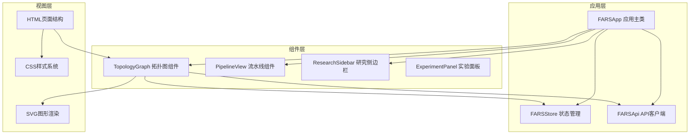

**图表来源**
- [index.html:1-118](file://docs/v2/index.html#L1-L118)
- [app.js:1-259](file://docs/v2/app.js#L1-L259)
- [topology-graph.js:1-348](file://docs/v2/components/topology-graph.js#L1-L348)

**章节来源**
- [index.html:1-118](file://docs/v2/index.html#L1-L118)
- [app.js:1-259](file://docs/v2/app.js#L1-L259)

## 核心组件

### 数据结构设计

TopologyGraph采用简洁而高效的数据结构来表示图数据：

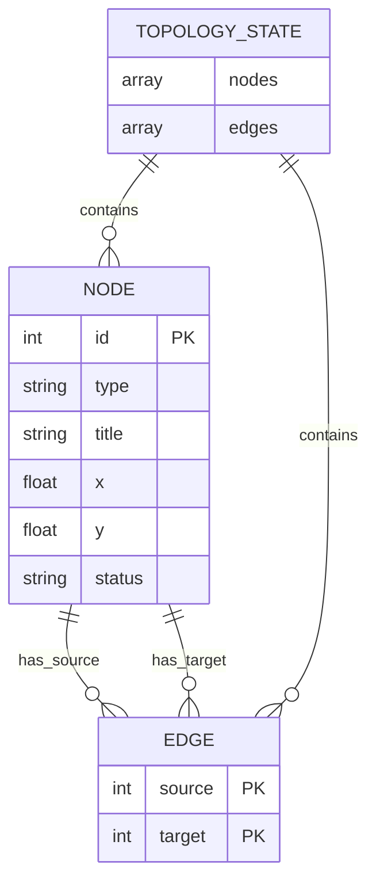

**图表来源**
- [topology-graph.js:104-127](file://docs/v2/components/topology-graph.js#L104-L127)
- [store.js:50-54](file://docs/v2/state/store.js#L50-L54)

### 渲染引擎架构

组件采用SVG作为渲染引擎，通过原生DOM操作实现高性能图形渲染：

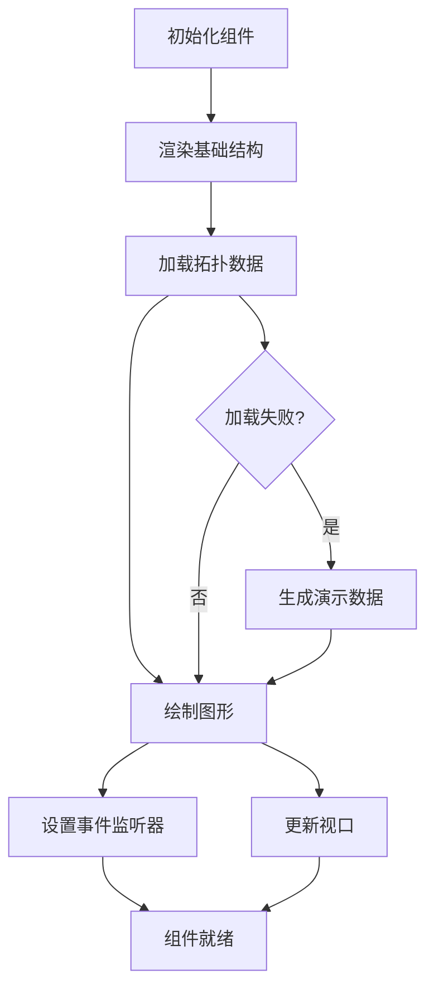

**图表来源**
- [topology-graph.js:20-24](file://docs/v2/components/topology-graph.js#L20-L24)
- [topology-graph.js:83-102](file://docs/v2/components/topology-graph.js#L83-L102)
- [topology-graph.js:129-185](file://docs/v2/components/topology-graph.js#L129-L185)

**章节来源**
- [topology-graph.js:6-348](file://docs/v2/components/topology-graph.js#L6-L348)
- [store.js:50-54](file://docs/v2/state/store.js#L50-L54)

## 架构概览

### 系统架构图

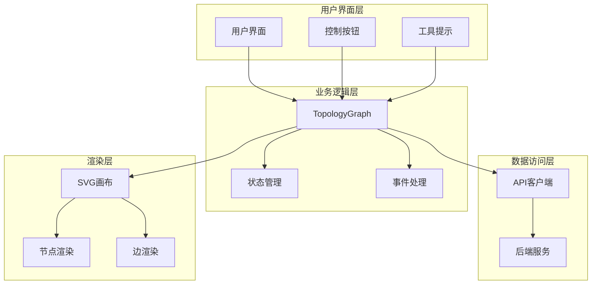

**图表来源**
- [topology-graph.js:1-348](file://docs/v2/components/topology-graph.js#L1-L348)
- [store.js:1-371](file://docs/v2/state/store.js#L1-L371)
- [client.js:1-274](file://docs/v2/api/client.js#L1-L274)

### 数据流架构

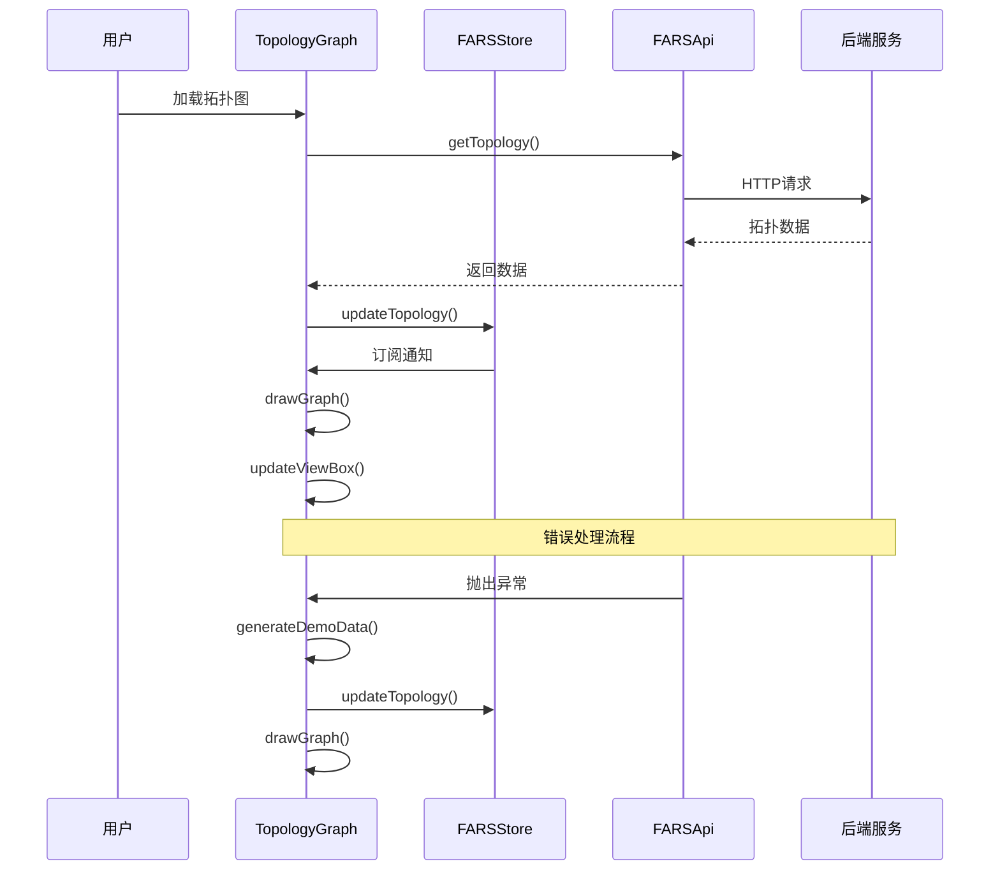

**图表来源**
- [topology-graph.js:83-102](file://docs/v2/components/topology-graph.js#L83-L102)
- [topology-graph.js:104-127](file://docs/v2/components/topology-graph.js#L104-L127)
- [store.js:215-224](file://docs/v2/state/store.js#L215-L224)

**章节来源**
- [topology-graph.js:1-348](file://docs/v2/components/topology-graph.js#L1-L348)
- [store.js:1-371](file://docs/v2/state/store.js#L1-L371)

## 详细组件分析

### 类架构设计

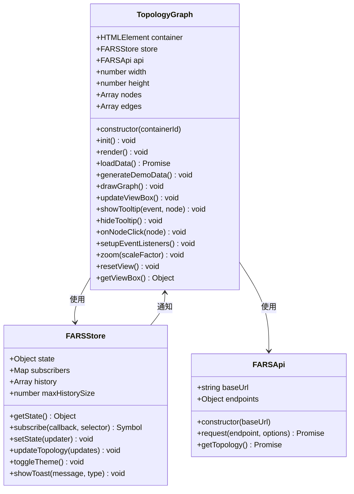

**图表来源**
- [topology-graph.js:6-348](file://docs/v2/components/topology-graph.js#L6-L348)
- [store.js:6-371](file://docs/v2/state/store.js#L6-L371)
- [client.js:6-274](file://docs/v2/api/client.js#L6-L274)

### 节点布局算法

TopologyGraph采用静态布局算法，所有节点位置由后端数据直接提供：

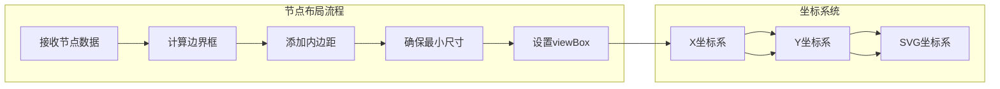

**图表来源**
- [topology-graph.js:187-217](file://docs/v2/components/topology-graph.js#L187-L217)

### 边连接逻辑

组件通过简单的直线连接两个节点的中心点：

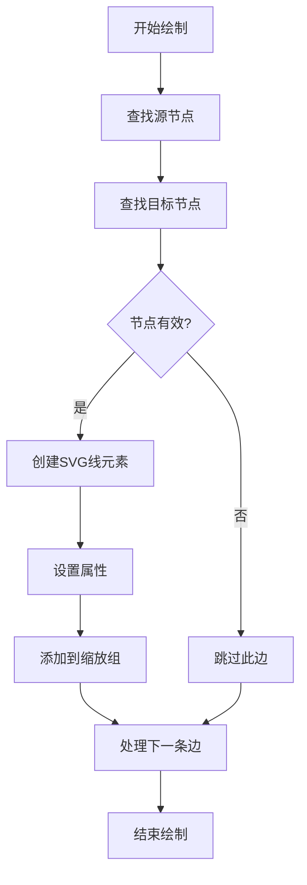

**图表来源**
- [topology-graph.js:138-152](file://docs/v2/components/topology-graph.js#L138-L152)

**章节来源**
- [topology-graph.js:1-348](file://docs/v2/components/topology-graph.js#L1-L348)

### 交互操作功能

#### 缩放平移机制

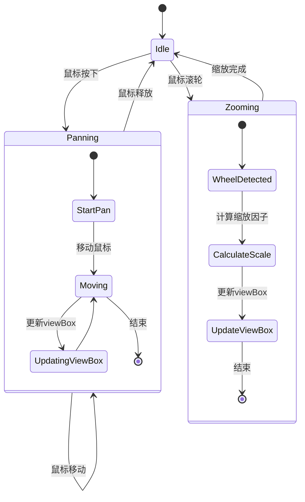

**图表来源**
- [topology-graph.js:269-313](file://docs/v2/components/topology-graph.js#L269-L313)
- [topology-graph.js:315-330](file://docs/v2/components/topology-graph.js#L315-L330)

#### 节点选择与拖拽

组件支持节点点击反馈和悬停提示功能：

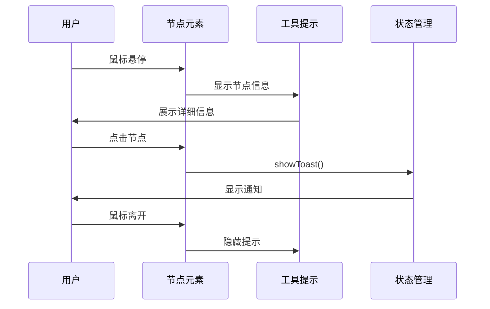

**图表来源**
- [topology-graph.js:177-181](file://docs/v2/components/topology-graph.js#L177-L181)
- [topology-graph.js:219-244](file://docs/v2/components/topology-graph.js#L219-L244)

**章节来源**
- [topology-graph.js:255-343](file://docs/v2/components/topology-graph.js#L255-L343)

### 动画效果

组件采用CSS过渡和JavaScript动画实现流畅的用户体验：

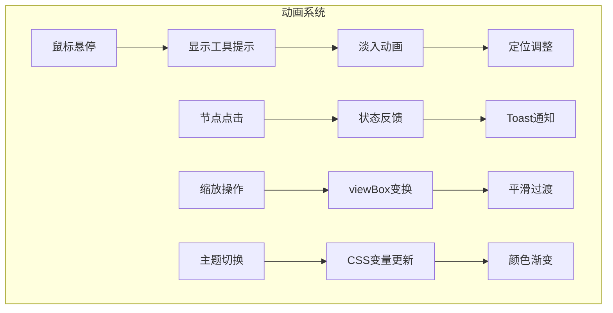

**图表来源**
- [v2-dashboard.css:240-243](file://docs/v2/css/v2-dashboard.css#L240-L243)
- [store.js:280-286](file://docs/v2/state/store.js#L280-L286)

**章节来源**
- [v2-dashboard.css:1-732](file://docs/v2/css/v2-dashboard.css#L1-L732)

## 依赖关系分析

### 组件间依赖

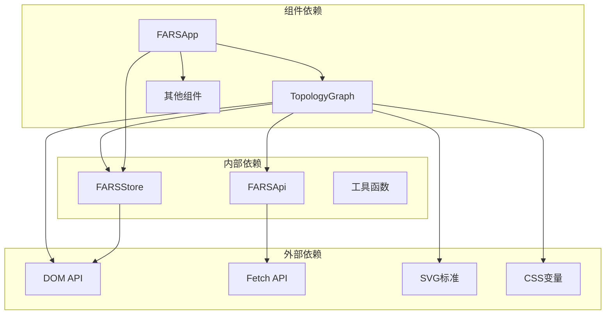

**图表来源**
- [topology-graph.js:1-348](file://docs/v2/components/topology-graph.js#L1-L348)
- [store.js:1-371](file://docs/v2/state/store.js#L1-L371)
- [client.js:1-274](file://docs/v2/api/client.js#L1-L274)

### 数据更新策略

组件采用响应式更新机制，通过状态订阅实现数据驱动的视图更新：

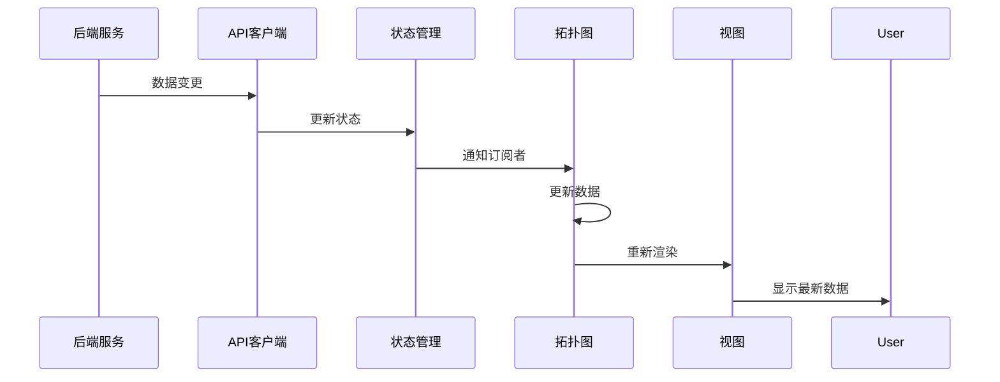

**图表来源**
- [store.js:119-132](file://docs/v2/state/store.js#L119-L132)
- [topology-graph.js:20-24](file://docs/v2/components/topology-graph.js#L20-L24)

**章节来源**
- [store.js:1-371](file://docs/v2/state/store.js#L1-L371)
- [client.js:1-274](file://docs/v2/api/client.js#L1-L274)

## 性能考虑

### 渲染优化

TopologyGraph采用以下性能优化策略：

1. **批量DOM操作**：在单个渲染周期内完成所有DOM更新
2. **事件委托**：使用事件冒泡减少事件监听器数量
3. **虚拟视口**：通过viewBox实现高效的缩放和平移
4. **条件渲染**：仅在数据变化时重新绘制

### 内存管理

组件遵循最佳实践避免内存泄漏：
- 及时清理事件监听器
- 合理使用闭包避免循环引用
- 及时释放DOM引用

### 响应式设计

组件支持不同屏幕尺寸的自适应布局，通过CSS媒体查询实现：

```css
@media (max-width: 768px) {
    #topology-container {
        height: 400px;
    }
}
```

## 故障排除指南

### 常见问题及解决方案

#### 数据加载失败

当后端API不可用时，组件会自动降级到演示数据模式：

```javascript
try {
    const topologyData = await this.api.getTopology();
    // 正常处理流程
} catch (error) {
    console.error('Failed to load topology data:', error);
    this.generateDemoData(); // 降级到演示数据
}
```

#### 视图显示异常

如果节点坐标超出预期范围，组件会自动调整视口：

```javascript
// 计算边界框并添加内边距
const padding = 50;
minX -= padding;
minY -= padding;
maxX += padding;
maxY += padding;
```

#### 交互功能失效

检查事件监听器是否正确绑定：

```javascript
// 确保DOM元素存在后再绑定事件
document.getElementById('zoom-in')?.addEventListener('click', handler);
```

**章节来源**
- [topology-graph.js:96-101](file://docs/v2/components/topology-graph.js#L96-L101)
- [topology-graph.js:187-217](file://docs/v2/components/topology-graph.js#L187-L217)
- [topology-graph.js:255-313](file://docs/v2/components/topology-graph.js#L255-L313)

## 结论

TopologyGraph组件展现了现代前端开发的最佳实践，通过清晰的架构设计、高效的渲染机制和丰富的交互功能，为用户提供了优秀的可视化体验。

组件的主要优势包括：
- **模块化设计**：独立的组件架构便于维护和扩展
- **响应式更新**：基于状态管理的自动更新机制
- **性能优化**：SVG渲染和事件优化确保流畅体验
- **错误处理**：完善的降级策略保证系统稳定性
- **主题支持**：CSS变量系统支持深色/浅色主题切换

未来可以考虑的改进方向：
- 实现动态布局算法支持自动节点排列
- 添加更多交互功能如节点拖拽、边编辑等
- 优化大数据集的渲染性能
- 增强移动端触摸支持
- 扩展导出功能支持图片和PDF格式