# 核心组件详解

<cite>
**本文档引用的文件**
- [experiment-panel.js](file://docs/v2/components/experiment-panel.js)
- [quality-panel.js](file://docs/v2/components/quality-panel.js)
- [research-sidebar.js](file://docs/v2/components/research-sidebar.js)
- [topology-graph.js](file://docs/v2/components/topology-graph.js)
- [paper-compare.js](file://docs/v2/components/paper-compare.js)
- [checkpoint-manager.js](file://docs/v2/components/checkpoint-manager.js)
- [llm-monitor.js](file://docs/v2/components/llm-monitor.js)
- [store.js](file://docs/v2/state/store.js)
- [client.js](file://docs/v2/api/client.js)
- [app.js](file://docs/v2/app.js)
- [index.html](file://docs/v2/index.html)
- [pipeline-view.js](file://docs/v2/components/pipeline-view.js)
</cite>

## 目录
1. [简介](#简介)
2. [项目结构](#项目结构)
3. [核心组件](#核心组件)
4. [架构总览](#架构总览)
5. [详细组件分析](#详细组件分析)
6. [依赖关系分析](#依赖关系分析)
7. [性能考量](#性能考量)
8. [故障排查指南](#故障排查指南)
9. [结论](#结论)
10. [附录](#附录)

## 简介
本文件面向paperwriterAI的前端核心组件系统，围绕实验面板、质量面板、研究侧边栏、拓扑图、论文对比、检查点管理器、LLM监控器等组件，系统阐述其设计理念、实现细节、交互流程、状态管理与数据绑定方式，并给出组件间通信机制、扩展点与最佳实践建议。文档同时提供关键流程的时序图与类图，帮助读者快速理解与上手。

## 项目结构
前端采用“组件 + 状态管理 + API客户端”的分层架构：
- 组件层：各功能面板以独立类组件形式存在，负责渲染、事件绑定、UI交互与数据展示。
- 状态管理层：集中式FARSStore提供统一状态存储、订阅/发布机制与历史回放能力。
- API客户端层：封装REST接口，提供统一的请求方法与轮询工具。
- 应用入口：初始化全局实例、注册组件、处理主题与通知等横切关注点。

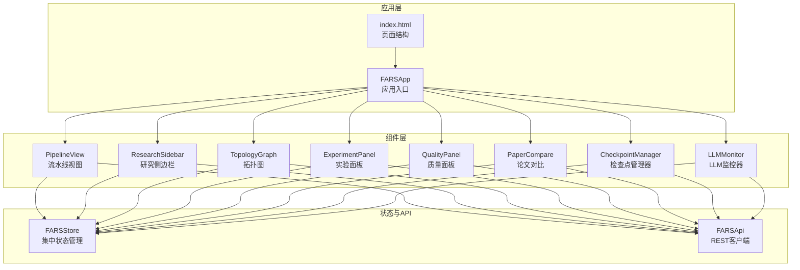

**图表来源**
- [index.html:1-118](file://docs/v2/index.html#L1-L118)
- [app.js:1-259](file://docs/v2/app.js#L1-L259)
- [store.js:1-371](file://docs/v2/state/store.js#L1-L371)
- [client.js:1-274](file://docs/v2/api/client.js#L1-L274)

**章节来源**
- [index.html:1-118](file://docs/v2/index.html#L1-L118)
- [app.js:1-259](file://docs/v2/app.js#L1-L259)

## 核心组件
本节概述各组件职责与交互要点：
- 实验面板：实验列表与详情、代码/日志/回测三栏切换、状态映射与时间格式化。
- 质量面板：评估结果列表与详情、AI检测/同行评审/改进建议三栏切换、评分可视化。
- 研究侧边栏：统计卡片、假设列表、论文列表、研究进度（运行时间/完成率）。
- 拓扑图：SVG绘制节点与连线、缩放/平移/悬停提示、节点点击反馈。
- 论文对比：多选论文、对比分析、表格与图表占位、洞察展示。
- 检查点管理器：断点时间线、断点详情、内容清单与日志。
- LLM监控器：调用统计、调用记录列表、详情页四栏切换、自动刷新。
- 状态管理：集中状态、订阅回调、深合并、历史回放、主题切换、加载态与通知。
- API客户端：REST端点封装、请求工具、轮询工具。

**章节来源**
- [experiment-panel.js:1-314](file://docs/v2/components/experiment-panel.js#L1-L314)
- [quality-panel.js:1-346](file://docs/v2/components/quality-panel.js#L1-L346)
- [research-sidebar.js:1-299](file://docs/v2/components/research-sidebar.js#L1-L299)
- [topology-graph.js:1-348](file://docs/v2/components/topology-graph.js#L1-L348)
- [paper-compare.js:1-316](file://docs/v2/components/paper-compare.js#L1-L316)
- [checkpoint-manager.js:1-302](file://docs/v2/components/checkpoint-manager.js#L1-L302)
- [llm-monitor.js:1-391](file://docs/v2/components/llm-monitor.js#L1-L391)
- [store.js:1-371](file://docs/v2/state/store.js#L1-L371)
- [client.js:1-274](file://docs/v2/api/client.js#L1-L274)

## 架构总览
组件通过全局store与api实例进行解耦，采用“单向数据流”：组件从API拉取数据，写入store，再由store触发订阅者更新UI。部分组件支持自动刷新（如LLM监控器），应用层负责主题与通知容器的渲染。

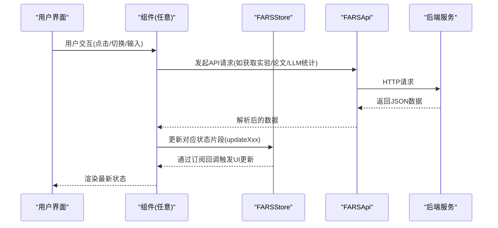

**图表来源**
- [store.js:109-132](file://docs/v2/state/store.js#L109-L132)
- [client.js:56-76](file://docs/v2/api/client.js#L56-L76)
- [experiment-panel.js:59-74](file://docs/v2/components/experiment-panel.js#L59-L74)
- [llm-monitor.js:89-110](file://docs/v2/components/llm-monitor.js#L89-L110)

## 详细组件分析

### 实验面板（ExperimentPanel）
- 设计理念：以“列表 + 详情”的双栏布局承载实验全生命周期管理，支持概览、代码、日志、回测四类内容的标签切换。
- 数据绑定与状态管理：
  - 初始化时渲染模板、加载数据、订阅store变化。
  - 列表项点击选择实验，详情区根据选中实验动态渲染。
  - 使用状态映射函数将内部状态码转换为中文显示文本。
- 交互设计：
  - 新建/刷新按钮、列表项点击、标签切换、代码/日志/回测区域的按钮。
  - 支持空状态与加载状态提示。
- API集成：
  - 通过全局API实例获取实验列表，错误时通过store发出toast通知。
- 生命周期钩子：
  - init/render/loadData/subscribeToState/updateUI/setupEventListeners。
- 可复用性与扩展点：
  - 可扩展更多标签页（如配置、资源、图表）。
  - 可接入更多实验状态与操作按钮。

```mermaid
classDiagram
class ExperimentPanel {
+constructor(containerId)
+init()
+render()
+loadData()
+updateExperimentList()
+selectExperiment(experimentId)
+updateExperimentDetail()
+switchTab(tabName)
+getStatusText(status)
+formatDate(dateString)
+formatDateTime(dateString)
+subscribeToState()
+updateUI(experimentsState)
+setupEventListeners()
}
class FARSStore {
+getState()
+subscribe(callback, selector)
+updateExperiments(updates)
+showToast(message, type, duration)
}
class FARSApi {
+getExperiments()
}
ExperimentPanel --> FARSStore : "订阅/更新"
ExperimentPanel --> FARSApi : "调用API"
```

**图表来源**
- [experiment-panel.js:6-314](file://docs/v2/components/experiment-panel.js#L6-L314)
- [store.js:109-132](file://docs/v2/state/store.js#L109-L132)
- [client.js:160-168](file://docs/v2/api/client.js#L160-L168)

**章节来源**
- [experiment-panel.js:1-314](file://docs/v2/components/experiment-panel.js#L1-L314)

### 质量面板（QualityPanel）
- 设计理念：以“评估结果列表 + 详情”呈现论文质量评估，支持AI检测、同行评审、改进建议三栏详情。
- 数据绑定与状态管理：
  - 加载质量结果，更新store中的quality片段。
  - 详情页按标签切换展示不同维度的评估信息。
  - 评分条形图与等级映射用于直观展示各项得分。
- 交互设计：
  - 运行质量检查/刷新按钮、列表项点击、标签切换、导出报告/重新评估按钮。
- API集成：
  - 获取质量结果与错误处理，toast提示。
- 生命周期钩子：
  - init/render/loadData/updateQualityList/selectResult/updateQualityDetail/subscribeToState/updateUI/setupEventListeners。
- 可复用性与扩展点：
  - 可新增评估维度或可视化图表。
  - 可接入更多评审模型与建议生成算法。

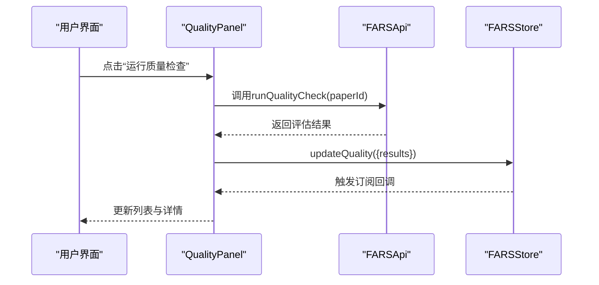

**图表来源**
- [quality-panel.js:1-346](file://docs/v2/components/quality-panel.js#L1-L346)
- [client.js:182-186](file://docs/v2/api/client.js#L182-L186)
- [store.js:193-202](file://docs/v2/state/store.js#L193-L202)

**章节来源**
- [quality-panel.js:1-346](file://docs/v2/components/quality-panel.js#L1-L346)

### 研究侧边栏（ResearchSidebar）
- 设计理念：以统计卡片、假设列表、论文列表与研究进度为核心，提供研究概览与导航。
- 数据绑定与状态管理：
  - 同步加载论文与研究状态，更新store中的papers与research片段。
  - 动态计算完成率、运行时间与统计卡片数值。
  - 支持论文筛选（全部/成功/失败/待处理）。
- 交互设计：
  - 刷新按钮、添加假设按钮、论文项点击选择、过滤下拉。
- API集成：
  - 获取论文列表、研究状态，错误时toast提示。
- 生命周期钩子：
  - init/render/loadData/updateStats/subscribeToState/updateUI/updatePaperList/updateHypothesisList。
- 可复用性与扩展点：
  - 假设列表可替换为真实后端数据源。
  - 进度条可扩展为更细粒度的阶段指标。

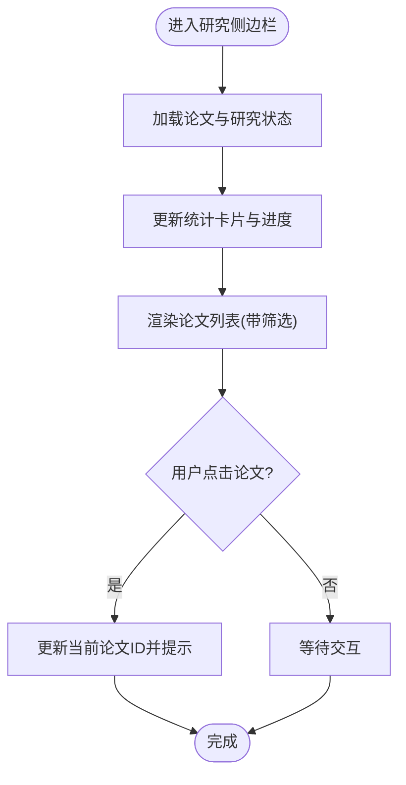

**图表来源**
- [research-sidebar.js:111-137](file://docs/v2/components/research-sidebar.js#L111-L137)
- [research-sidebar.js:161-187](file://docs/v2/components/research-sidebar.js#L161-L187)

**章节来源**
- [research-sidebar.js:1-299](file://docs/v2/components/research-sidebar.js#L1-L299)

### 拓扑图（TopologyGraph）
- 设计理念：以SVG绘制作者/假设/实验/论文的关系网络，支持缩放、平移、悬停提示与节点点击反馈。
- 数据绑定与状态管理：
  - 加载节点与边，更新store中的topology片段。
  - 无数据时生成演示数据并绘制。
- 交互设计：
  - 缩放/缩小/重置视图按钮、鼠标滚轮缩放、拖拽平移、节点悬停提示、节点点击反馈。
- API集成：
  - 获取拓扑数据，错误时生成演示数据。
- 生命周期钩子：
  - init/render/loadData/generateDemoData/drawGraph/updateViewBox/showTooltip/hideTooltip/onNodeClick/setupEventListeners/zoom/resetView/getViewBox。
- 可复用性与扩展点：
  - 可接入力导向布局算法优化节点分布。
  - 可扩展节点类型与样式映射。

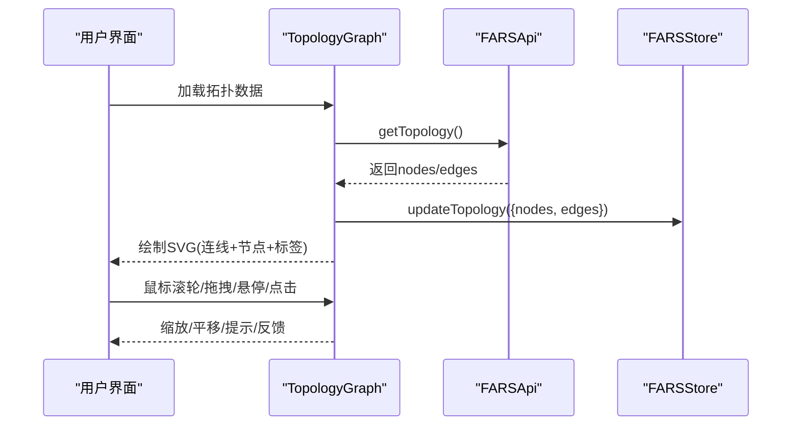

**图表来源**
- [topology-graph.js:83-102](file://docs/v2/components/topology-graph.js#L83-L102)
- [topology-graph.js:129-185](file://docs/v2/components/topology-graph.js#L129-L185)
- [topology-graph.js:255-313](file://docs/v2/components/topology-graph.js#L255-L313)

**章节来源**
- [topology-graph.js:1-348](file://docs/v2/components/topology-graph.js#L1-L348)

### 论文对比（PaperCompare）
- 设计理念：支持2-4篇论文的对比分析，提供表格、图表占位与洞察展示。
- 数据绑定与状态管理：
  - 加载论文列表，维护选中论文集合，调用对比API后更新结果。
  - 通过store控制加载态与toast提示。
- 交互设计：
  - 复选框选择论文、对比按钮、清除选择、导出/保存按钮。
- API集成：
  - comparePapers(paperIds)返回对比结果。
- 生命周期钩子：
  - init/render/loadData/updatePaperList/togglePaperSelection/updateSelectionCount/runComparison/updateComparisonResults/clearSelection/subscribeToState/updateUI/setupEventListeners。
- 可复用性与扩展点：
  - 可扩展更多对比维度与可视化图表。
  - 可持久化对比任务与结果。

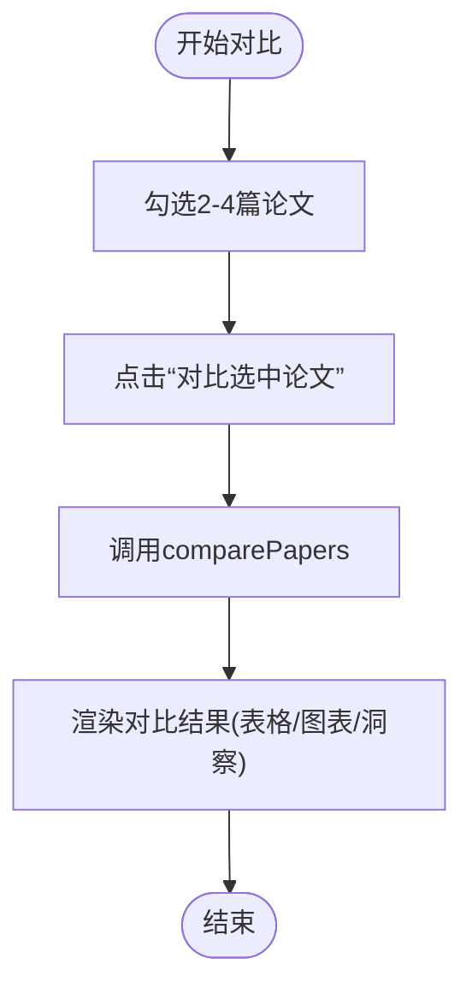

**图表来源**
- [paper-compare.js:143-164](file://docs/v2/components/paper-compare.js#L143-L164)
- [paper-compare.js:166-261](file://docs/v2/components/paper-compare.js#L166-L261)

**章节来源**
- [paper-compare.js:1-316](file://docs/v2/components/paper-compare.js#L1-L316)

### 检查点管理器（CheckpointManager）
- 设计理念：以时间线形式展示断点，支持查看断点详情、包含内容与日志。
- 数据绑定与状态管理：
  - 加载断点列表，排序并高亮选中项，更新store中的checkpoints片段。
- 交互设计：
  - 创建断点/刷新按钮、时间线项点击、编辑/恢复/删除按钮。
- API集成：
  - 获取断点列表，错误时toast提示。
- 生命周期钩子：
  - init/render/loadData/updateCheckpointTimeline/selectCheckpoint/updateCheckpointDetail/renderContentsList/renderLogs/getContentIcon/getTypeText/formatSize/formatDateTime/subscribeToState/updateUI/setupEventListeners。
- 可复用性与扩展点：
  - 可扩展断点类型与内容类型枚举。
  - 可接入断点恢复与清理策略。

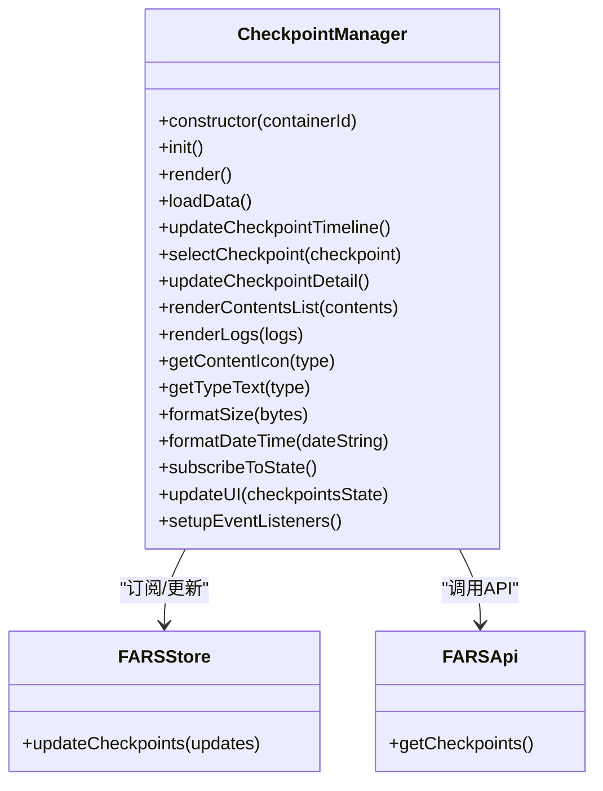

**图表来源**
- [checkpoint-manager.js:6-297](file://docs/v2/components/checkpoint-manager.js#L6-L297)
- [store.js:226-235](file://docs/v2/state/store.js#L226-L235)
- [client.js:220-227](file://docs/v2/api/client.js#L220-L227)

**章节来源**
- [checkpoint-manager.js:1-302](file://docs/v2/components/checkpoint-manager.js#L1-L302)

### LLM监控器（LLMMonitor）
- 设计理念：实时监控LLM调用，提供统计卡片、调用记录列表与详情页四栏切换。
- 数据绑定与状态管理：
  - 加载统计与调用记录，更新store中的llmMonitoring片段。
  - 自动每30秒刷新一次，支持手动刷新与清空日志占位。
- 交互设计：
  - 刷新/清空日志按钮、筛选下拉、调用记录点击、详情页标签切换。
- API集成：
  - getLLMCallStats/getLLMCalls/getLLMCallDetail，轮询工具pollLLMStats。
- 生命周期钩子：
  - init/render/loadData/updateStats/updateCallsList/selectCall/updateCallDetail/switchTab/formatJSON/getStatusText/formatTime/formatDateTime/subscribeToState/updateUI/setupEventListeners/setupAutoRefresh。
- 可复用性与扩展点：
  - 可扩展更多统计维度（成本、并发、错误分类）。
  - 可接入图表库展示调用趋势与Token分布。

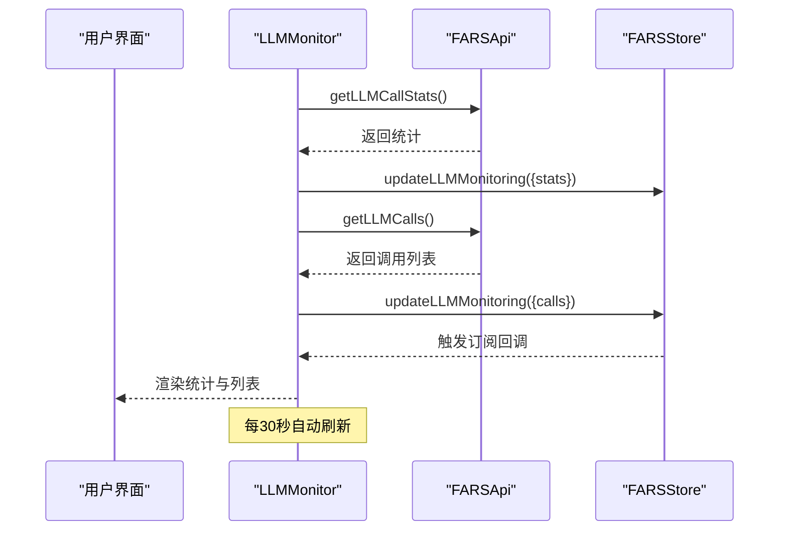

**图表来源**
- [llm-monitor.js:89-110](file://docs/v2/components/llm-monitor.js#L89-L110)
- [llm-monitor.js:380-385](file://docs/v2/components/llm-monitor.js#L380-L385)
- [client.js:188-200](file://docs/v2/api/client.js#L188-L200)
- [client.js:259-270](file://docs/v2/api/client.js#L259-L270)

**章节来源**
- [llm-monitor.js:1-391](file://docs/v2/components/llm-monitor.js#L1-L391)

### 状态管理（FARSStore）
- 设计理念：集中式状态管理，支持深合并、历史记录、订阅回调与主题切换。
- 关键能力：
  - getState/getSlice：获取完整或指定状态片段。
  - setState：深合并更新，记录历史，通知订阅者。
  - subscribe：按选择器订阅特定状态片段变化。
  - updateXxx系列方法：针对各域的状态更新。
  - UI工具：toast、主题切换、加载态、活动标签。
  - 历史与撤销：history队列、undo/reset。
- 扩展点：
  - 可新增状态域（如branches、pipelines）与对应的updateXxx方法。
  - 可接入中间件（如日志、持久化）。

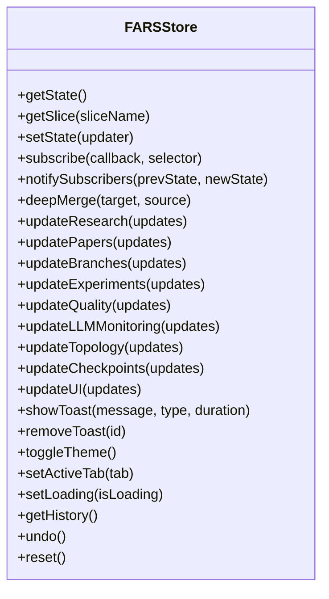

**图表来源**
- [store.js:6-365](file://docs/v2/state/store.js#L6-L365)

**章节来源**
- [store.js:1-371](file://docs/v2/state/store.js#L1-L371)

### API客户端（FARSApi）
- 设计理念：统一REST客户端，封装常用端点与轮询工具。
- 关键能力：
  - 端点定义：papers/branches/experiments/quality/llm/topology/checkpoints/compare等。
  - request工具：统一fetch封装与错误处理。
  - 轮询工具：pollResearchStatus/pollLLMStats。
- 扩展点：
  - 可新增端点与请求拦截器。
  - 可接入鉴权与重试策略。

**章节来源**
- [client.js:1-274](file://docs/v2/api/client.js#L1-L274)

### 应用入口（FARSApp）
- 设计理念：应用入口负责初始化、事件绑定、主题与通知容器渲染、初始数据加载。
- 关键能力：
  - setupEventListeners：标签切换、主题切换、设置按钮、模态框关闭。
  - loadInitialData：并行加载研究、论文、分支数据。
  - setupTheme/setupToastContainer：主题持久化与toast容器渲染。
  - 切换标签时通过store更新活动标签并触发组件刷新。
- 扩展点：
  - 可接入更多初始化流程（健康检查、配置加载）。
  - 可扩展模态框与快捷键系统。

**章节来源**
- [app.js:1-259](file://docs/v2/app.js#L1-L259)

## 依赖关系分析
- 组件对store的依赖：所有组件均通过store进行状态更新与订阅，形成单向数据流。
- 组件对API的依赖：各组件通过全局API实例发起HTTP请求，错误统一处理并通过store发出toast。
- 组件间通信：通过store共享状态，无需直接互相调用；应用层负责主题与通知容器的统一渲染。
- 外部依赖：Chart.js（用于图表）、DOMPurify（用于内容净化）。

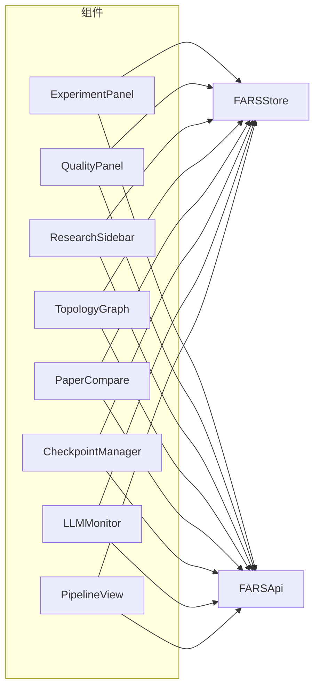

**图表来源**
- [experiment-panel.js:8-11](file://docs/v2/components/experiment-panel.js#L8-L11)
- [quality-panel.js:8-11](file://docs/v2/components/quality-panel.js#L8-L11)
- [research-sidebar.js:8-11](file://docs/v2/components/research-sidebar.js#L8-L11)
- [topology-graph.js:8-11](file://docs/v2/components/topology-graph.js#L8-L11)
- [paper-compare.js:8-11](file://docs/v2/components/paper-compare.js#L8-L11)
- [checkpoint-manager.js:8-11](file://docs/v2/components/checkpoint-manager.js#L8-L11)
- [llm-monitor.js:8-11](file://docs/v2/components/llm-monitor.js#L8-L11)
- [pipeline-view.js:8-11](file://docs/v2/components/pipeline-view.js#L8-L11)

**章节来源**
- [index.html:105-117](file://docs/v2/index.html#L105-L117)
- [app.js:240-259](file://docs/v2/app.js#L240-L259)

## 性能考量
- 异步加载与并行请求：应用入口使用Promise.all并行加载初始数据，减少首屏等待。
- 自动刷新策略：LLM监控器每30秒轮询一次，避免频繁刷新带来的压力。
- UI渲染优化：组件内部仅在状态变化时更新相关DOM，避免不必要的重绘。
- 图表与大列表：拓扑图与论文对比组件提供占位符，实际图表可在后续版本接入轻量图表库。
- 错误降级：拓扑图在API失败时生成演示数据，保证用户体验连续性。

## 故障排查指南
- 加载失败：
  - 实验/质量/论文/断点等组件在API调用失败时会通过store发出toast提示，检查网络与后端服务状态。
- UI不更新：
  - 确认组件是否正确订阅store（subscribeToState），以及是否调用了updateUI。
- LLM监控无数据：
  - 确认轮询是否正常工作（setupAutoRefresh），检查getLLMCallStats接口可用性。
- 拓扑图空白：
  - 确认API返回的nodes/edges是否为空，必要时检查generateDemoData路径。
- 主题切换无效：
  - 检查localStorage中主题键值与toggleTheme逻辑，确认DOM属性data-theme是否更新。

**章节来源**
- [experiment-panel.js:70-74](file://docs/v2/components/experiment-panel.js#L70-L74)
- [llm-monitor.js:380-385](file://docs/v2/components/llm-monitor.js#L380-L385)
- [topology-graph.js:96-101](file://docs/v2/components/topology-graph.js#L96-L101)
- [store.js:280-286](file://docs/v2/state/store.js#L280-L286)

## 结论
paperwriterAI的核心组件系统以组件化与集中式状态管理为核心，实现了清晰的职责分离与良好的可扩展性。通过统一的API客户端与应用入口，组件间通信简洁高效，具备良好的复用性与扩展点。建议在后续迭代中引入更完善的图表库、错误分类与审计日志，进一步提升可观测性与用户体验。

## 附录
- 组件初始化顺序：应用入口在DOM加载完成后依次初始化各组件实例。
- 页面结构：index.html定义了导航标签与各组件容器，应用入口负责挂载组件。
- 全局实例：window.farsStore/window.farsApi/window.farsApp作为跨组件共享的全局对象。

**章节来源**
- [index.html:47-88](file://docs/v2/index.html#L47-L88)
- [app.js:240-259](file://docs/v2/app.js#L240-L259)