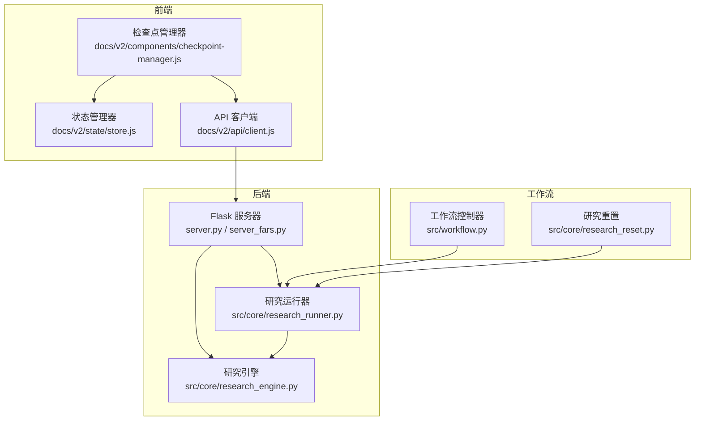
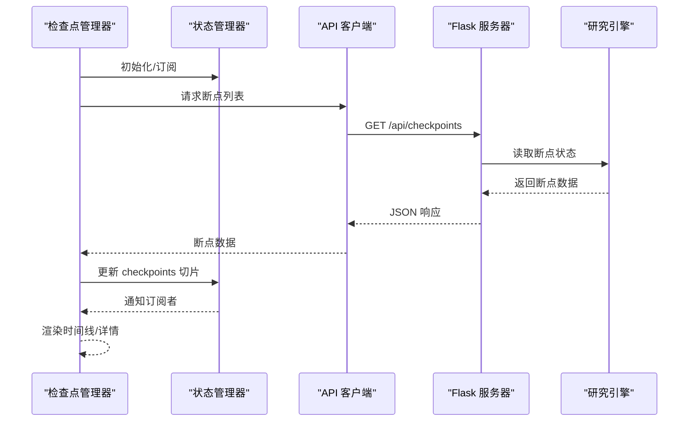
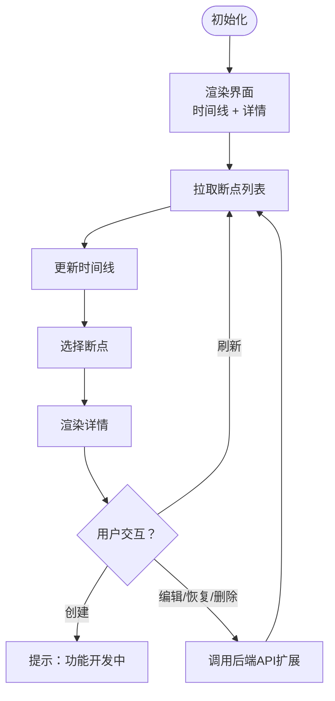
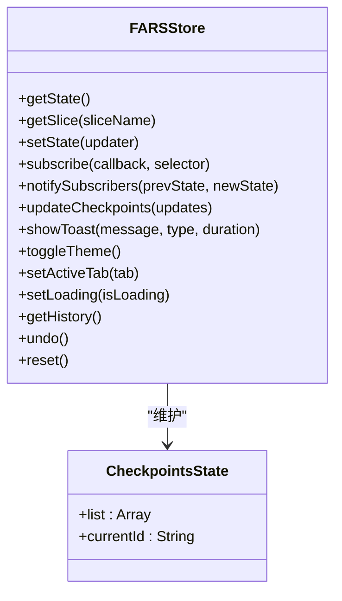
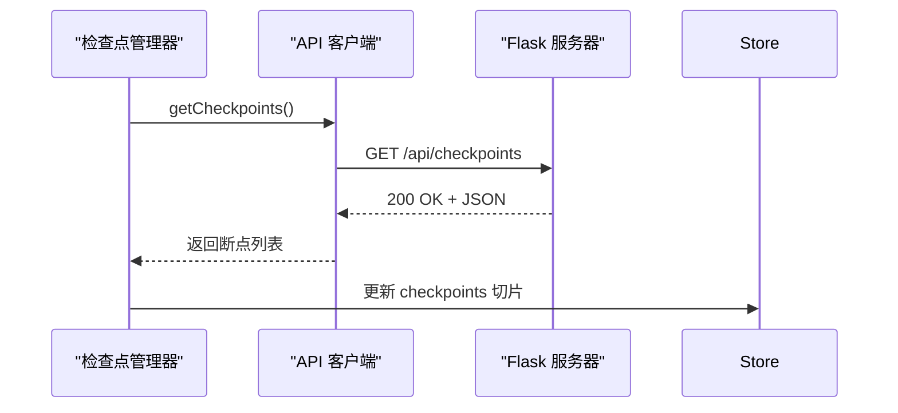
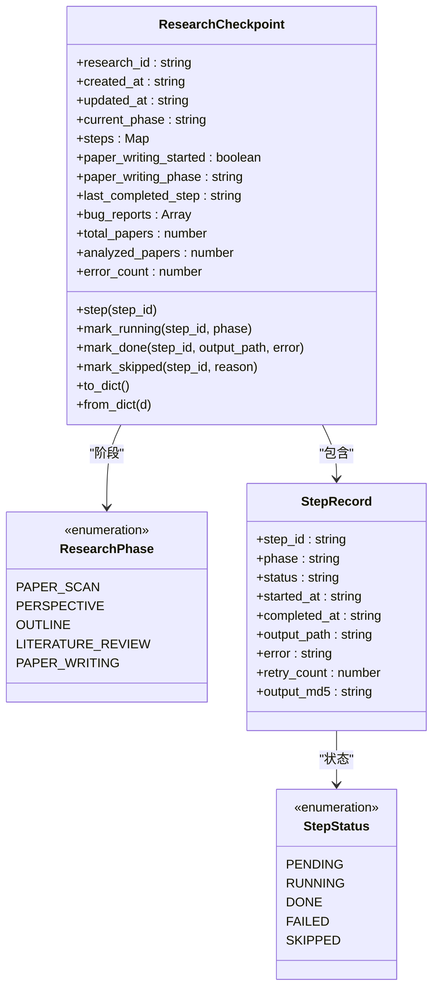
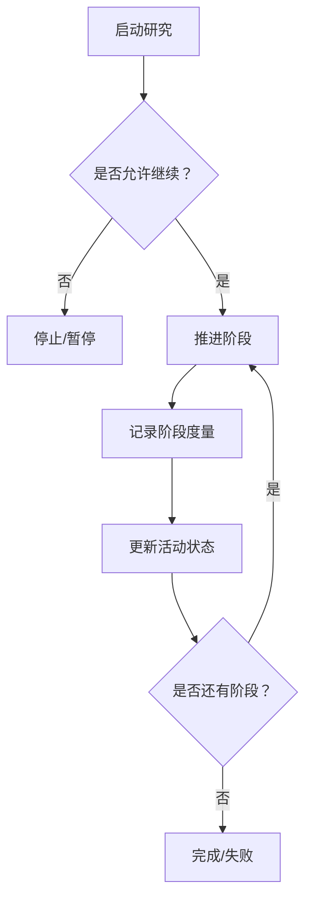
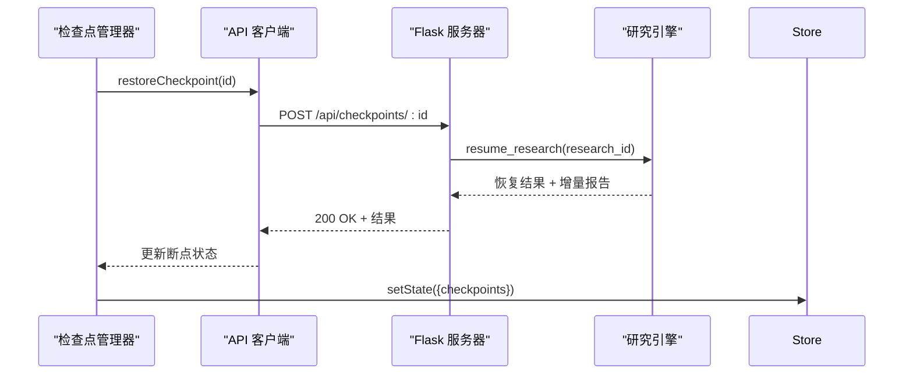
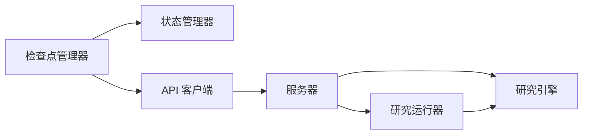

# 检查点管理器组件

<cite>
**本文档引用的文件**
- [checkpoint-manager.js](file://docs/v2/components/checkpoint-manager.js)
- [store.js](file://docs/v2/state/store.js)
- [client.js](file://docs/v2/api/client.js)
- [research_engine.py](file://src/core/research_engine.py)
- [research_runner.py](file://src/core/research_runner.py)
- [research_reset.py](file://src/core/research_reset.py)
- [server.py](file://server.py)
- [server_fars.py](file://server_fars.py)
- [workflow.py](file://src/workflow.py)
</cite>

## 目录
1. [简介](#简介)
2. [项目结构](#项目结构)
3. [核心组件](#核心组件)
4. [架构总览](#架构总览)
5. [详细组件分析](#详细组件分析)
6. [依赖分析](#依赖分析)
7. [性能考虑](#性能考虑)
8. [故障排查指南](#故障排查指南)
9. [结论](#结论)
10. [附录](#附录)

## 简介
本文件为“检查点管理器组件”的技术文档，聚焦于断点设置、状态保存、恢复机制、数据结构设计、序列化策略、版本兼容性、自动/手动干预、批量操作、中断处理与优雅降级、错误恢复策略、配置选项、触发条件、存储位置、与后端服务通信协议、状态同步与并发控制、调试与日志、性能监控等。

该组件由前端组件、集中式状态管理、后端API与持久化引擎共同构成，既支持前端可视化管理断点，也支持后端研究流程的断点续分析与降级写作。

## 项目结构
- 前端组件
  - 检查点管理器：负责断点列表渲染、详情展示、基础交互（创建/刷新），并与全局状态管理器联动。
  - 全局状态管理器：集中管理应用状态切片（含 checkpoints 切片），提供订阅/发布机制。
  - API 客户端：封装后端 REST 接口，统一请求与轮询。
- 后端引擎
  - 研究引擎：定义断点状态机、步骤状态、持久化读写、断点续分析、降级写作、作者/引用网络等。
  - 研究运行器：驱动研究流水线，推进阶段与活动，记录断点阶段信息。
  - 服务器：提供断点查询、恢复、删除等 API，并与前端状态同步。
- 工作流
  - 研究重置：提供备份与重置能力，保障断点数据安全。

**图表来源**
- [checkpoint-manager.js:1-302](file://docs/v2/components/checkpoint-manager.js#L1-L302)
- [store.js:1-371](file://docs/v2/state/store.js#L1-L371)
- [client.js:1-274](file://docs/v2/api/client.js#L1-L274)
- [research_engine.py:1-800](file://src/core/research_engine.py#L1-L800)
- [research_runner.py:1-800](file://src/core/research_runner.py#L1-L800)
- [server.py:1-800](file://server.py#L1-L800)
- [server_fars.py:1661-1710](file://server_fars.py#L1661-L1710)
- [workflow.py:1-286](file://src/workflow.py#L1-L286)
- [research_reset.py:1-147](file://src/core/research_reset.py#L1-L147)

**章节来源**
- [checkpoint-manager.js:1-302](file://docs/v2/components/checkpoint-manager.js#L1-L302)
- [store.js:1-371](file://docs/v2/state/store.js#L1-L371)
- [client.js:1-274](file://docs/v2/api/client.js#L1-L274)
- [research_engine.py:1-800](file://src/core/research_engine.py#L1-L800)
- [research_runner.py:1-800](file://src/core/research_runner.py#L1-L800)
- [server.py:1-800](file://server.py#L1-L800)
- [server_fars.py:1661-1710](file://server_fars.py#L1661-L1710)
- [workflow.py:1-286](file://src/workflow.py#L1-L286)
- [research_reset.py:1-147](file://src/core/research_reset.py#L1-L147)

## 核心组件
- 检查点管理器（前端）
  - 渲染断点时间线、详情面板、空态与加载态。
  - 与状态管理器订阅/发布联动，响应断点列表变更。
  - 与 API 客户端交互，拉取断点列表、刷新数据。
- 状态管理器（前端）
  - 维护 checkpoints 切片，提供更新与历史记录能力。
  - 支持主题切换、加载状态、消息提示等 UI 状态。
- API 客户端（前端）
  - 统一封装 REST 接口，包含断点查询、恢复、删除等端点。
  - 提供轮询工具方法，便于持续监听后端状态。
- 研究引擎（后端）
  - 定义断点状态机与步骤状态枚举，支持持久化读写。
  - 提供断点续分析、降级写作、增量报告生成、作者/引用网络构建。
- 研究运行器（后端）
  - 驱动研究流水线，推进阶段与活动，记录断点阶段信息。
- 服务器（后端）
  - 提供断点查询、恢复、删除等 API。
  - 与前端状态管理器保持状态同步。

**章节来源**
- [checkpoint-manager.js:1-302](file://docs/v2/components/checkpoint-manager.js#L1-L302)
- [store.js:56-235](file://docs/v2/state/store.js#L56-L235)
- [client.js:47-233](file://docs/v2/api/client.js#L47-L233)
- [research_engine.py:55-190](file://src/core/research_engine.py#L55-L190)
- [research_engine.py:205-240](file://src/core/research_engine.py#L205-L240)
- [research_engine.py:494-581](file://src/core/research_engine.py#L494-L581)
- [research_engine.py:430-487](file://src/core/research_engine.py#L430-L487)
- [research_runner.py:278-582](file://src/core/research_runner.py#L278-L582)
- [server.py:2041-2090](file://server.py#L2041-L2090)
- [server_fars.py:1661-1710](file://server_fars.py#L1661-L1710)

## 架构总览
检查点管理器贯穿前后端：前端负责展示与交互，后端负责断点状态机与持久化，二者通过 REST API 协议通信，配合状态管理器实现前端 UI 与后端状态的双向同步。

**图表来源**
- [checkpoint-manager.js:18-74](file://docs/v2/components/checkpoint-manager.js#L18-L74)
- [store.js:109-132](file://docs/v2/state/store.js#L109-L132)
- [client.js:220-223](file://docs/v2/api/client.js#L220-L223)
- [server_fars.py:1661-1666](file://server_fars.py#L1661-L1666)
- [research_engine.py:205-214](file://src/core/research_engine.py#L205-L214)

## 详细组件分析

### 检查点管理器（前端）
- 功能职责
  - 渲染断点时间线与详情面板，支持空态与加载态。
  - 加载断点列表，排序显示，点击选中查看详情。
  - 与状态管理器订阅/发布联动，响应断点列表变更。
  - 与 API 客户端交互，刷新断点数据。
- 数据与事件
  - 维护内部断点数组与选中项，渲染时序标记与内容列表。
  - 事件绑定：创建断点（预留）、刷新按钮、时间线项点击。
- 可扩展点
  - 创建断点按钮当前仅提示“开发中”，可接入后端创建接口。
  - 详情面板支持编辑、恢复、删除按钮，可扩展为实际操作。

**图表来源**
- [checkpoint-manager.js:18-128](file://docs/v2/components/checkpoint-manager.js#L18-L128)
- [checkpoint-manager.js:130-200](file://docs/v2/components/checkpoint-manager.js#L130-L200)
- [checkpoint-manager.js:286-296](file://docs/v2/components/checkpoint-manager.js#L286-L296)

**章节来源**
- [checkpoint-manager.js:1-302](file://docs/v2/components/checkpoint-manager.js#L1-L302)

### 状态管理器（前端）
- 功能职责
  - 维护集中状态，提供深合并更新、历史记录、撤销、重置等能力。
  - 专门维护 checkpoints 切片，支持更新断点列表。
  - 提供主题切换、加载状态、消息提示等 UI 状态。
- 订阅/发布
  - 订阅函数接收选择器，仅在目标切片变化时回调。
  - 通知时比较前后值，避免无效渲染。

**图表来源**
- [store.js:6-132](file://docs/v2/state/store.js#L6-L132)
- [store.js:226-235](file://docs/v2/state/store.js#L226-L235)

**章节来源**
- [store.js:1-371](file://docs/v2/state/store.js#L1-L371)

### API 客户端（前端）
- 功能职责
  - 统一封装 REST 接口，包含断点查询、恢复、删除等端点。
  - 提供轮询工具方法，便于持续监听后端状态。
- 端点清单（与检查点相关）
  - 查询断点列表：GET /api/checkpoints
  - 查询单个断点：GET /api/checkpoints/:id
  - 恢复断点：POST /api/checkpoints/:id
  - 删除断点：DELETE /api/checkpoints/:id

**图表来源**
- [client.js:220-233](file://docs/v2/api/client.js#L220-L233)
- [server_fars.py:1661-1666](file://server_fars.py#L1661-L1666)

**章节来源**
- [client.js:1-274](file://docs/v2/api/client.js#L1-L274)

### 研究引擎（后端）
- 断点状态机
  - 步骤状态：PENDING、RUNNING、DONE、FAILED、SKIPPED。
  - 研究阶段：paper_scan、perspective、outline、literature_review、paper_writing。
  - 断点数据结构：包含研究ID、创建/更新时间、当前阶段、步骤映射、并发写作状态、Bug 报告、统计信息等。
- 持久化
  - 断点文件：workspace/research/{research_id}_checkpoint/checkpoint.json。
  - 读写函数：load_checkpoint、save_checkpoint、create_checkpoint。
- 断点续分析
  - 识别待处理/失败步骤，按阶段顺序继续执行，生成增量报告。
- 降级写作
  - 卡顿时并发写论文，同时生成 Bug 报告，标注缺失内容。
- 作者/引用网络
  - 构建作者-论文-引用关系网络，辅助研究导航与空白识别。

**图表来源**
- [research_engine.py:55-190](file://src/core/research_engine.py#L55-L190)
- [research_engine.py:205-240](file://src/core/research_engine.py#L205-L240)

**章节来源**
- [research_engine.py:1-800](file://src/core/research_engine.py#L1-L800)

### 研究运行器（后端）
- 功能职责
  - 驱动研究流水线，推进阶段与活动，记录断点阶段信息。
  - 与实验阶段同步，维护当前运行状态与活动消息。
- 关键流程
  - 启动/续传：根据参数决定新建或续传，推进到相应阶段。
  - 活动设置：设置当前阶段、进度与消息，更新实验阶段。
  - 阶段推进：按阶段顺序推进，记录阶段度量与耗时。

**图表来源**
- [research_runner.py:301-427](file://src/core/research_runner.py#L301-L427)
- [research_runner.py:567-581](file://src/core/research_runner.py#L567-L581)

**章节来源**
- [research_runner.py:1-800](file://src/core/research_runner.py#L1-L800)

### 服务器（后端）
- 断点 API
  - GET /api/research/checkpoints：列出研究断点。
  - GET /api/research/checkpoints/<research_id>：获取断点详情。
  - POST /api/research/checkpoints/<research_id>：恢复断点。
  - DELETE /api/research/checkpoints/<research_id>：删除断点。
- 状态同步
  - 服务器与前端通过 API 交互，前端状态管理器订阅后端状态变化。
  - 研究运行器更新当前运行状态，服务器暴露健康/状态接口。

**图表来源**
- [client.js:229-233](file://docs/v2/api/client.js#L229-L233)
- [server.py:2090-2090](file://server.py#L2090-L2090)
- [research_engine.py:494-581](file://src/core/research_engine.py#L494-L581)

**章节来源**
- [server.py:2041-2090](file://server.py#L2041-L2090)
- [server_fars.py:1661-1710](file://server_fars.py#L1661-L1710)

### 工作流与重置
- 工作流控制器
  - 提供完整研究论文工作流的步骤与日志记录，便于与断点机制协同。
- 研究重置
  - 提供备份与重置能力，避免误删种子文献与研究档案，保障断点数据安全。

**章节来源**
- [workflow.py:1-286](file://src/workflow.py#L1-L286)
- [research_reset.py:69-147](file://src/core/research_reset.py#L69-L147)

## 依赖分析
- 前端依赖
  - 检查点管理器依赖状态管理器与 API 客户端。
  - 状态管理器依赖订阅/发布机制与历史记录。
- 后端依赖
  - 研究引擎依赖数据注册表、论文提取器等模块。
  - 研究运行器依赖研究引擎与实验阶段同步。
  - 服务器依赖研究引擎与研究运行器，提供 REST API。
- 耦合与内聚
  - 前端组件与状态管理器耦合度低，通过订阅/发布解耦。
  - 后端引擎与运行器内聚高，共同推进研究流程。

**图表来源**
- [checkpoint-manager.js:7-16](file://docs/v2/components/checkpoint-manager.js#L7-L16)
- [store.js:109-132](file://docs/v2/state/store.js#L109-L132)
- [client.js:6-54](file://docs/v2/api/client.js#L6-L54)
- [server.py:59-64](file://server.py#L59-L64)
- [research_runner.py:278-295](file://src/core/research_runner.py#L278-L295)

**章节来源**
- [checkpoint-manager.js:1-302](file://docs/v2/components/checkpoint-manager.js#L1-L302)
- [store.js:1-371](file://docs/v2/state/store.js#L1-L371)
- [client.js:1-274](file://docs/v2/api/client.js#L1-L274)
- [server.py:1-800](file://server.py#L1-L800)
- [research_runner.py:1-800](file://src/core/research_runner.py#L1-L800)

## 性能考虑
- 前端
  - 时间线渲染采用排序与模板拼接，建议在大数据量时引入虚拟滚动与懒加载。
  - Toast 通知自动移除，避免内存泄漏。
- 后端
  - 断点续分析按阶段顺序处理，失败步骤可降级继续写作，减少阻塞。
  - 批量分析时限制并发与 IO 延迟，避免过载。
  - 增量报告生成仅输出变化部分，降低 IO 压力。
- 并发控制
  - 研究运行器使用锁与状态门控，避免竞态与重复执行。
  - 服务器端 LLM 使用心跳与用量统计，便于监控与限流。

[本节为通用指导，无需特定文件引用]

## 故障排查指南
- 断点加载失败
  - 检查 API 是否可达，确认断点端点可用。
  - 查看前端状态管理器历史记录，定位更新异常。
- 断点恢复失败
  - 检查后端断点是否存在，确认研究ID正确。
  - 查看断点续分析日志与增量报告，定位失败步骤。
- 写作降级
  - 若分析卡顿，系统会并发写作并生成 Bug 报告，检查降级输出与缺失论文列表。
- 研究重置
  - 使用重置功能备份现有数据，避免误删种子文献与研究档案。

**章节来源**
- [client.js:220-233](file://docs/v2/api/client.js#L220-L233)
- [research_engine.py:430-487](file://src/core/research_engine.py#L430-L487)
- [research_engine.py:584-634](file://src/core/research_engine.py#L584-L634)
- [research_reset.py:69-147](file://src/core/research_reset.py#L69-L147)

## 结论
检查点管理器组件通过前端可视化与后端断点状态机实现了研究流程的可控性与韧性：断点设置、状态保存、恢复机制、降级写作与增量报告生成，共同构成了高可靠的研究自动化体系。前端与后端通过 REST API 协议紧密协作，状态管理器确保 UI 与业务状态的一致性。建议在生产环境中结合日志与监控完善可观测性，并持续优化断点续分析与降级策略以提升用户体验。

[本节为总结性内容，无需特定文件引用]

## 附录

### 数据结构与序列化
- 断点数据结构
  - 包含研究ID、创建/更新时间、当前阶段、步骤映射、并发写作状态、Bug 报告、统计信息等。
  - 步骤记录包含步骤ID、阶段、状态、时间戳、输出路径与MD5等。
- 序列化策略
  - 使用 JSON 文件持久化，字段名与枚举值保持稳定，便于跨版本兼容。
- 版本兼容性
  - 建议在新增字段时提供默认值，避免解析失败；对枚举值扩展采用向后兼容策略。

**章节来源**
- [research_engine.py:86-190](file://src/core/research_engine.py#L86-L190)
- [research_engine.py:205-240](file://src/core/research_engine.py#L205-L240)

### 自动保存与手动干预
- 自动保存
  - 研究引擎在每步完成后立即持久化断点，确保中断可恢复。
- 手动干预
  - 前端提供断点详情操作入口（编辑/恢复/删除），可扩展为实际操作。
  - 后端支持断点恢复与删除 API，便于运维与调试。

**章节来源**
- [research_engine.py:121-139](file://src/core/research_engine.py#L121-L139)
- [checkpoint-manager.js:149-200](file://docs/v2/components/checkpoint-manager.js#L149-L200)
- [client.js:229-233](file://docs/v2/api/client.js#L229-L233)

### 批量操作支持
- 批量分析
  - 研究引擎支持批量分析种子论文，断点续分析按步骤顺序恢复。
- 增量报告
  - 生成增量分析报告，汇总成功/失败/跳过步骤与最近 Bug 报告。

**章节来源**
- [research_engine.py:331-383](file://src/core/research_engine.py#L331-L383)
- [research_engine.py:584-634](file://src/core/research_engine.py#L584-L634)

### 中断处理与优雅降级
- 中断处理
  - 研究运行器通过门控与状态检查，避免重复执行与竞态。
- 优雅降级
  - 分析卡顿时并发写作，生成降级论文并记录 Bug 报告。

**章节来源**
- [research_runner.py:630-641](file://src/core/research_runner.py#L630-L641)
- [research_engine.py:430-487](file://src/core/research_engine.py#L430-L487)

### 错误恢复策略
- 失败步骤重试与降级
  - 断点续分析对失败步骤生成 Bug 报告并继续写作。
- 研究重置
  - 提供备份与重置能力，保障数据安全。

**章节来源**
- [research_engine.py:533-541](file://src/core/research_engine.py#L533-L541)
- [research_reset.py:69-147](file://src/core/research_reset.py#L69-L147)

### 配置选项、触发条件与存储位置
- 配置选项
  - LLM 提供商与端点配置、超时设置等，影响断点续分析与写作过程。
- 触发条件
  - 研究启动/续传、断点恢复、手动刷新等。
- 存储位置
  - 断点文件：workspace/research/{research_id}_checkpoint/checkpoint.json。

**章节来源**
- [server.py:392-425](file://server.py#L392-L425)
- [research_engine.py:196-203](file://src/core/research_engine.py#L196-L203)

### 与后端服务通信协议、状态同步与并发控制
- 通信协议
  - REST API，统一 Content-Type 与错误处理。
- 状态同步
  - 前端订阅状态变化，后端通过 API 暴露最新状态。
- 并发控制
  - 研究运行器使用锁与门控，服务器端 LLM 使用心跳与用量统计。

**章节来源**
- [client.js:56-76](file://docs/v2/api/client.js#L56-L76)
- [store.js:109-132](file://docs/v2/state/store.js#L109-L132)
- [research_runner.py:278-295](file://src/core/research_runner.py#L278-L295)

### 调试功能、日志记录与性能监控
- 调试功能
  - 服务器端提供调试日志与远程上报，便于定位问题。
- 日志记录
  - 研究引擎与工作流控制器均提供日志记录，便于审计与排错。
- 性能监控
  - 服务器端 LLM 使用心跳与用量统计，便于监控与限流。

**章节来源**
- [server.py:90-193](file://server.py#L90-L193)
- [workflow.py:30-37](file://src/workflow.py#L30-L37)
- [server.py:498-566](file://server.py#L498-L566)