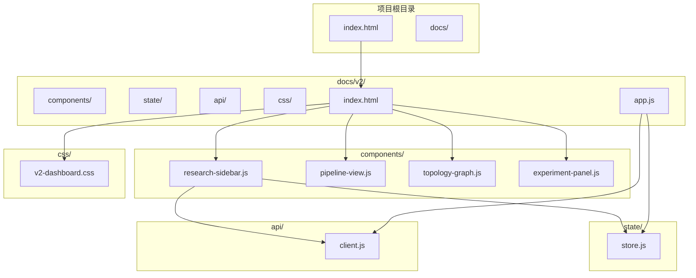
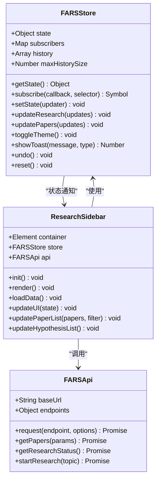
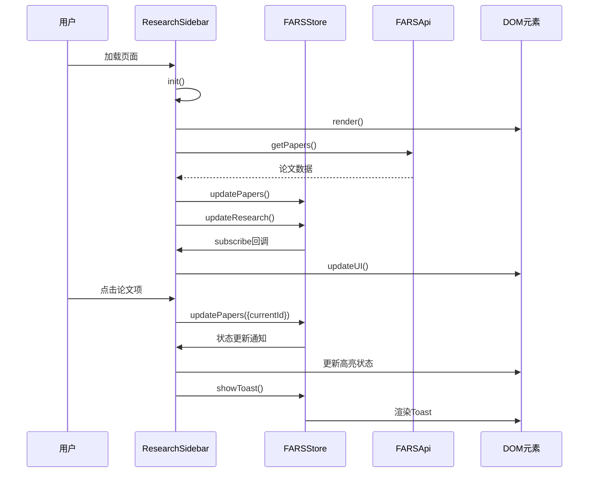
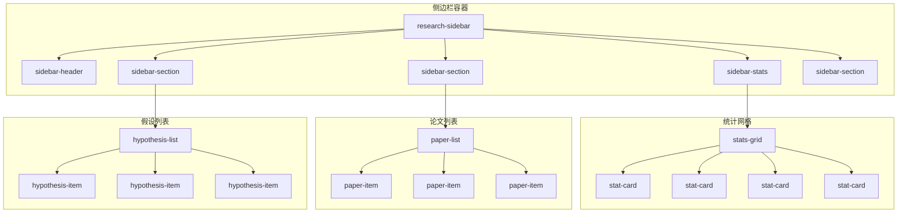
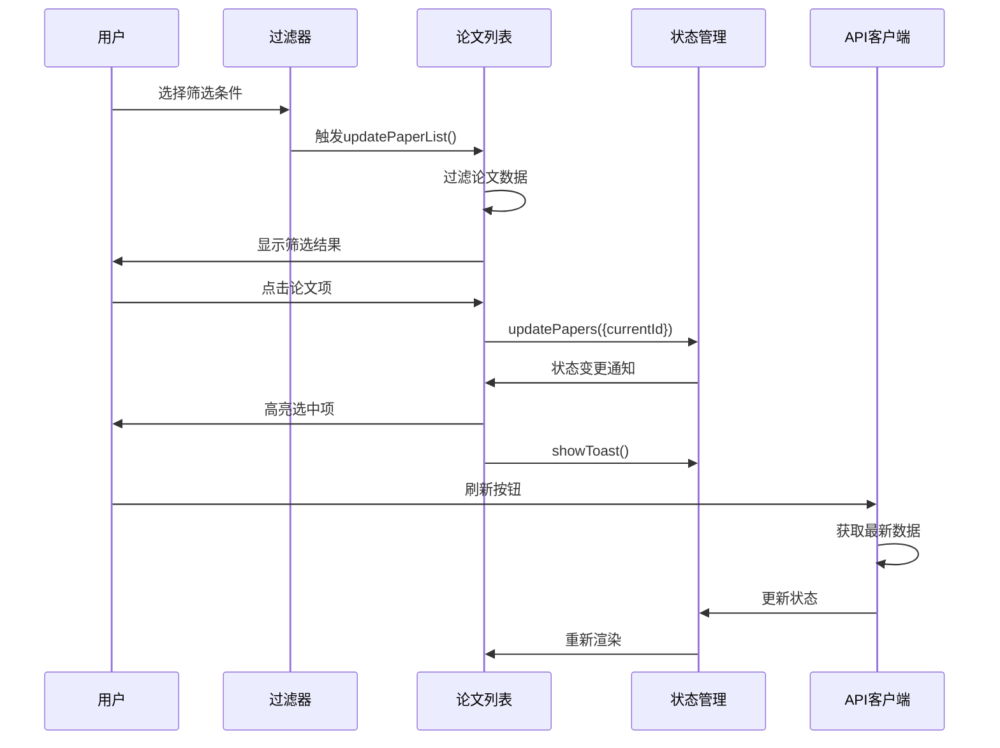
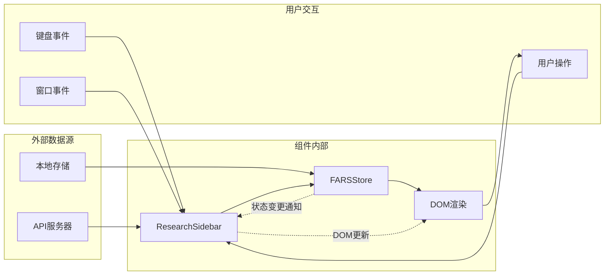
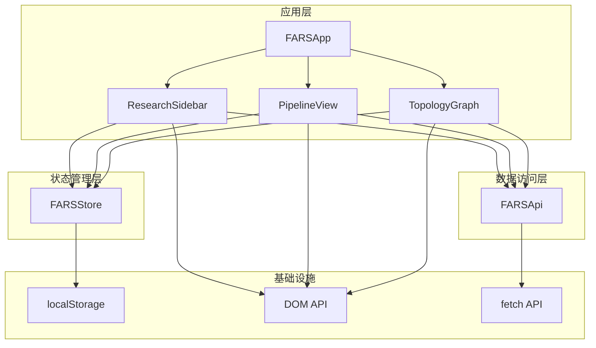
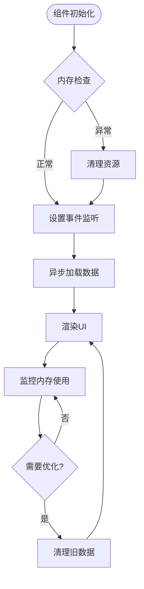
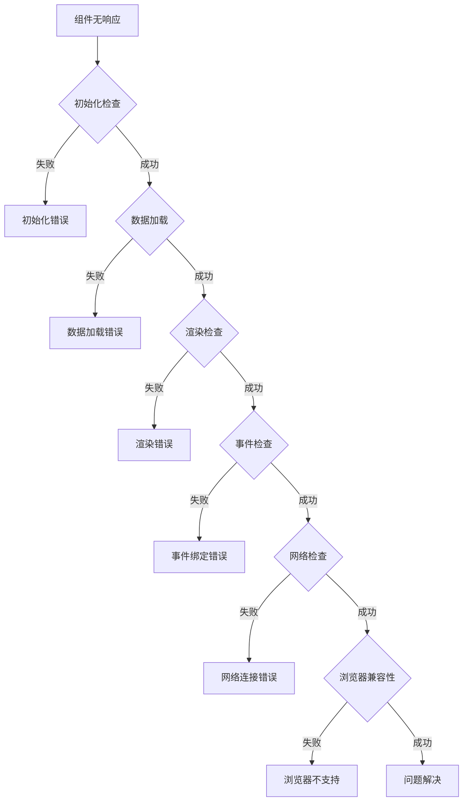

# 研究侧边栏组件

<cite>
**本文档引用的文件**
- [research-sidebar.js](file://docs/v2/components/research-sidebar.js)
- [store.js](file://docs/v2/state/store.js)
- [app.js](file://docs/v2/app.js)
- [index.html](file://docs/v2/index.html)
- [client.js](file://docs/v2/api/client.js)
- [v2-dashboard.css](file://docs/v2/css/v2-dashboard.css)
- [pipeline-view.js](file://docs/v2/components/pipeline-view.js)
</cite>

## 目录
1. [简介](#简介)
2. [项目结构](#项目结构)
3. [核心组件](#核心组件)
4. [架构概览](#架构概览)
5. [详细组件分析](#详细组件分析)
6. [依赖关系分析](#依赖关系分析)
7. [性能考虑](#性能考虑)
8. [故障排除指南](#故障排除指南)
9. [结论](#结论)

## 简介

ResearchSidebar研究侧边栏组件是FARS v2全自动科研系统的核心界面组件之一，负责提供研究项目的可视化管理和交互控制。该组件采用现代化的前端架构设计，集成了状态管理、响应式布局、实时数据更新和丰富的用户交互功能。

该组件主要包含以下核心功能模块：
- **统计信息面板**：显示研究项目的总体统计指标
- **研究假设管理**：提供假设的创建、查看和状态跟踪
- **论文列表管理**：展示和筛选研究过程中的论文数据
- **进度监控**：实时显示研究进程的状态和统计数据
- **主题切换**：支持深色和浅色主题模式

## 项目结构

FARS v2项目采用模块化架构设计，ResearchSidebar组件位于`docs/v2/components/`目录下，与状态管理、API客户端和样式文件形成清晰的分层结构。



**图表来源**
- [index.html:1-118](file://docs/v2/index.html#L1-L118)
- [research-sidebar.js:1-299](file://docs/v2/components/research-sidebar.js#L1-L299)
- [store.js:1-371](file://docs/v2/state/store.js#L1-L371)

**章节来源**
- [index.html:1-118](file://docs/v2/index.html#L1-L118)
- [research-sidebar.js:1-299](file://docs/v2/components/research-sidebar.js#L1-L299)

## 核心组件

### 状态管理系统

ResearchSidebar组件通过FARSStore集中管理应用状态，实现了单向数据流和响应式更新机制。



**图表来源**
- [store.js:6-365](file://docs/v2/state/store.js#L6-L365)
- [research-sidebar.js:6-299](file://docs/v2/components/research-sidebar.js#L6-L299)
- [client.js:6-274](file://docs/v2/api/client.js#L6-L274)

### 数据结构设计

组件采用扁平化的数据结构设计，确保状态的一致性和可预测性：

| 状态切片 | 字段 | 类型 | 描述 |
|---------|------|------|------|
| research | isRunning | Boolean | 研究是否正在运行 |
| research | isPaused | Boolean | 研究是否已暂停 |
| research | currentTopic | String | 当前研究主题 |
| research | startTime | Date | 研究开始时间 |
| research | elapsed | Number | 已运行时间(秒) |
| papers | list | Array | 论文列表 |
| papers | currentId | String | 当前选中论文ID |
| papers | totalCount | Number | 论文总数 |
| ui | theme | String | 主题模式('dark'/'light') |
| ui | toasts | Array | 通知消息队列 |

**章节来源**
- [store.js:8-69](file://docs/v2/state/store.js#L8-L69)
- [research-sidebar.js:152-187](file://docs/v2/components/research-sidebar.js#L152-L187)

## 架构概览

ResearchSidebar组件遵循MVVM架构模式，实现了清晰的关注点分离和数据绑定机制。



**图表来源**
- [research-sidebar.js:15-137](file://docs/v2/components/research-sidebar.js#L15-L137)
- [store.js:109-132](file://docs/v2/state/store.js#L109-L132)
- [client.js:78-136](file://docs/v2/api/client.js#L78-L136)

### 组件生命周期

组件采用渐进式初始化策略，确保资源的有效利用和用户体验的流畅性：

```mermaid
flowchart TD
Start([组件创建]) --> Init[init(): 初始化]
Init --> Render[render(): 渲染模板]
Render --> LoadData[loadData(): 加载数据]
LoadData --> Subscribe[subscribeToState(): 订阅状态]
Subscribe --> Ready[就绪状态]
Ready --> UserAction{用户操作?}
UserAction --> |点击论文| UpdateCurrent[更新当前论文]
UserAction --> |筛选论文| FilterPapers[过滤论文列表]
UserAction --> |刷新数据| RefreshData[重新加载数据]
UpdateCurrent --> StoreUpdate[Store.updatePapers()]
FilterPapers --> UIUpdate[updatePaperList()]
RefreshData --> LoadData
StoreUpdate --> Notify[notifySubscribers()]
Notify --> UIUpdate
UIUpdate --> Ready
```

**图表来源**
- [research-sidebar.js:15-19](file://docs/v2/components/research-sidebar.js#L15-L19)
- [research-sidebar.js:152-187](file://docs/v2/components/research-sidebar.js#L152-L187)

**章节来源**
- [research-sidebar.js:15-19](file://docs/v2/components/research-sidebar.js#L15-L19)
- [research-sidebar.js:152-187](file://docs/v2/components/research-sidebar.js#L152-L187)

## 详细组件分析

### 布局设计与响应式适配

ResearchSidebar采用Flexbox布局系统，结合CSS Grid实现复杂的响应式设计。



**图表来源**
- [research-sidebar.js:21-109](file://docs/v2/components/research-sidebar.js#L21-L109)
- [v2-dashboard.css:352-379](file://docs/v2/css/v2-dashboard.css#L352-L379)

#### 响应式断点设计

组件针对不同屏幕尺寸提供了优化的布局策略：

| 断点 | 屏幕宽度 | 布局特性 | 组件调整 |
|------|----------|----------|----------|
| 移动端 | ≤768px | 单列布局 | 统计卡片2列，实验面板1列 |
| 平板端 | 769-1024px | 适度压缩 | 统计卡片2列，实验面板1列 |
| 桌面端 | 1025-1440px | 标准布局 | 统计卡片自适应 |
| 大屏端 | ≥1440px | 扩展布局 | 统计卡片自适应 |

**章节来源**
- [v2-dashboard.css:644-732](file://docs/v2/css/v2-dashboard.css#L644-L732)

### 交互行为与事件处理

组件实现了丰富的用户交互功能，包括数据筛选、状态切换和实时更新。



**图表来源**
- [research-sidebar.js:189-231](file://docs/v2/components/research-sidebar.js#L189-L231)
- [research-sidebar.js:224-230](file://docs/v2/components/research-sidebar.js#L224-L230)

#### 事件处理机制

组件采用事件委托和直接绑定相结合的方式，确保事件处理的效率和可靠性：

| 事件类型 | 监听目标 | 处理逻辑 | 性能影响 |
|----------|----------|----------|----------|
| DOMContentLoaded | 文档 | 初始化组件 | 一次性 |
| click | 刷新按钮 | loadData() | 异步请求 |
| click | 论文项 | 更新当前论文 | 状态更新 |
| change | 筛选下拉框 | 过滤论文列表 | 同步操作 |
| resize | 窗口 | 响应式调整 | 防抖处理 |

**章节来源**
- [research-sidebar.js:296-299](file://docs/v2/components/research-sidebar.js#L296-L299)
- [research-sidebar.js:189-231](file://docs/v2/components/research-sidebar.js#L189-L231)

### 数据流与状态同步

组件通过单向数据流确保状态的一致性和可追踪性。



**图表来源**
- [research-sidebar.js:111-137](file://docs/v2/components/research-sidebar.js#L111-L137)
- [store.js:109-132](file://docs/v2/state/store.js#L109-L132)

#### 状态同步策略

组件采用选择性订阅和深度合并机制，避免不必要的重渲染：

| 状态切片 | 订阅粒度 | 更新策略 | 性能优化 |
|----------|----------|----------|----------|
| research | 整体 | 全量更新 | 部分UI更新 |
| papers | 整体 | 全量更新 | 条件渲染 |
| ui | 整体 | 全量更新 | 精确匹配 |
| 特定字段 | 选择性 | 部分更新 | 函数式更新 |

**章节来源**
- [store.js:109-132](file://docs/v2/state/store.js#L109-L132)
- [research-sidebar.js:152-187](file://docs/v2/components/research-sidebar.js#L152-L187)

### 研究项目组织方式

组件支持多种研究项目的组织和管理模式：

```mermaid
graph TB
subgraph "研究项目层次结构"
A[研究主题]
B[分支(Branches)]
C[实验(Experiments)]
D[论文(Papers)]
E[假设(Hypotheses)]
end
subgraph "项目属性"
F[状态(Status)]
G[元数据(Metadata)]
H[进度(Progress)]
I[质量(Quality)]
end
A --> B
B --> C
C --> D
D --> E
A --> F
B --> G
C --> H
D --> I
```

**图表来源**
- [store.js:8-69](file://docs/v2/state/store.js#L8-L69)

#### 文件树结构

组件支持的研究项目文件树结构：

| 层级 | 类型 | 描述 | 示例 |
|------|------|------|------|
| 一级 | 研究主题 | 根节点 | "量化投资策略研究" |
| 二级 | 分支 | 主要分支 | "因子分析分支" |
| 三级 | 实验 | 具体实验 | "多因子模型实验" |
| 四级 | 论文 | 研究成果 | "因子有效性验证论文" |
| 五级 | 假设 | 研究假设 | "市场有效性假设" |

**章节来源**
- [store.js:18-69](file://docs/v2/state/store.js#L18-L69)

### 快速访问功能

组件提供了多种快速访问和导航机制：

| 功能 | 实现方式 | 用户体验 | 性能特征 |
|------|----------|----------|----------|
| 标签页导航 | 选择器切换 | 即时响应 | O(1)复杂度 |
| 论文筛选 | 下拉选择器 | 实时反馈 | O(n)过滤 |
| 状态切换 | 按钮操作 | 直观易用 | 异步处理 |
| 主题切换 | 图标按钮 | 即时生效 | 本地存储 |
| 刷新机制 | 手动触发 | 可控更新 | 缓存策略 |

**章节来源**
- [research-sidebar.js:72-78](file://docs/v2/components/research-sidebar.js#L72-L78)
- [research-sidebar.js:26-32](file://docs/v2/components/research-sidebar.js#L26-L32)

## 依赖关系分析

### 组件间依赖关系



**图表来源**
- [app.js:6-259](file://docs/v2/app.js#L6-L259)
- [research-sidebar.js:6-299](file://docs/v2/components/research-sidebar.js#L6-L299)
- [store.js:6-371](file://docs/v2/state/store.js#L6-L371)
- [client.js:6-274](file://docs/v2/api/client.js#L6-L274)

### 外部依赖分析

组件对外部依赖的管理策略：

| 依赖类型 | 依赖库 | 版本 | 用途 | 替代方案 |
|----------|--------|------|------|----------|
| 样式框架 | Chart.js | 4.4.0 | 图表渲染 | Canvas API |
| 安全库 | DOMPurify | 3.0.6 | HTML清理 | 自定义净化 |
| 核心库 | 原生JavaScript | ES6+ | 核心功能 | Polyfill方案 |

**章节来源**
- [index.html:7-9](file://docs/v2/index.html#L7-L9)
- [app.js:1-259](file://docs/v2/app.js#L1-L259)

## 性能考虑

### 内存管理策略

组件采用渐进式加载和懒加载机制，避免内存泄漏和性能瓶颈：



### 性能优化技术

| 优化类别 | 技术实现 | 性能收益 | 实现复杂度 |
|----------|----------|----------|------------|
| DOM操作 | 事件委托 | 减少监听器数量 | 低 |
| 数据渲染 | 模板缓存 | 避免重复渲染 | 中 |
| 网络请求 | 请求合并 | 减少HTTP请求数 | 中 |
| 内存管理 | 对象池 | 复用DOM元素 | 高 |
| 响应式设计 | 媒体查询 | 优化移动端体验 | 低 |

**章节来源**
- [research-sidebar.js:224-230](file://docs/v2/components/research-sidebar.js#L224-L230)
- [research-sidebar.js:111-137](file://docs/v2/components/research-sidebar.js#L111-L137)

### 缓存策略

组件实现了多层次的缓存机制：

| 缓存层级 | 缓存类型 | 存储位置 | 生命周期 | 清理策略 |
|----------|----------|----------|----------|----------|
| 应用层 | 状态缓存 | 内存 | 组件实例 | 组件销毁 |
| 浏览器层 | 本地存储 | localStorage | 永久 | 用户手动清理 |
| 网络层 | HTTP缓存 | 浏览器 | TTL | 自动过期 |
| UI层 | DOM缓存 | 内存 | 页面会话 | 页面刷新 |

**章节来源**
- [store.js:280-286](file://docs/v2/state/store.js#L280-L286)
- [client.js:244-270](file://docs/v2/api/client.js#L244-L270)

## 故障排除指南

### 常见问题诊断



### 错误处理机制

组件采用多层次的错误处理策略：

| 错误类型 | 处理方式 | 用户反馈 | 日志记录 |
|----------|----------|----------|----------|
| 网络错误 | 重试机制 | Toast提示 | 控制台日志 |
| 数据错误 | 数据验证 | 错误边界 | 详细日志 |
| 渲染错误 | 降级渲染 | 空状态 | 错误报告 |
| 事件错误 | 事件恢复 | 用户提示 | 异常捕获 |

**章节来源**
- [research-sidebar.js:133-137](file://docs/v2/components/research-sidebar.js#L133-L137)
- [store.js:248-278](file://docs/v2/state/store.js#L248-L278)

### 调试工具使用

推荐的调试工具和方法：

| 调试场景 | 工具选择 | 使用方法 | 效果评估 |
|----------|----------|----------|----------|
| 状态检查 | 浏览器开发者工具 | Console中输入`farsStore.getState()` | 即时可见 |
| 网络监控 | Network面板 | 查看API请求响应 | 性能分析 |
| 性能分析 | Performance面板 | 录制用户交互流程 | 优化建议 |
| 内存分析 | Memory面板 | 捕获内存快照 | 泄漏检测 |

**章节来源**
- [store.js:298-310](file://docs/v2/state/store.js#L298-L310)

## 结论

ResearchSidebar研究侧边栏组件展现了现代前端开发的最佳实践，通过精心设计的状态管理、响应式布局和事件处理机制，为用户提供了一个功能丰富且性能优异的研究管理界面。

### 核心优势

1. **架构清晰**：采用MVVM模式和单向数据流，确保代码的可维护性和可扩展性
2. **用户体验**：响应式设计和即时反馈机制，提供流畅的交互体验
3. **性能优化**：多层缓存策略和内存管理，确保长时间使用的稳定性
4. **可扩展性**：模块化设计和插件化架构，便于功能扩展和定制

### 改进建议

1. **增强错误处理**：增加更详细的错误边界和恢复机制
2. **性能监控**：集成性能指标监控和告警机制
3. **国际化支持**：添加多语言支持和本地化配置
4. **无障碍访问**：完善键盘导航和屏幕阅读器支持

该组件为FARS v2系统提供了坚实的基础，通过持续的优化和改进，将继续为自动化科研工作提供强大的技术支持。