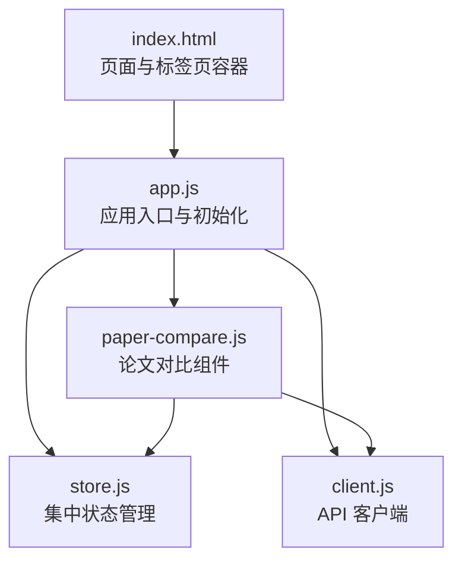
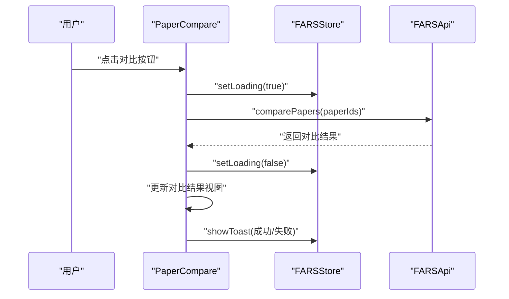
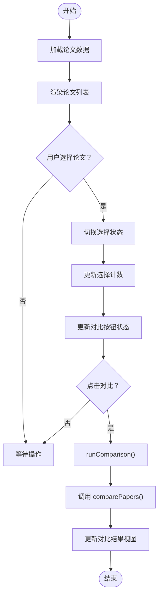
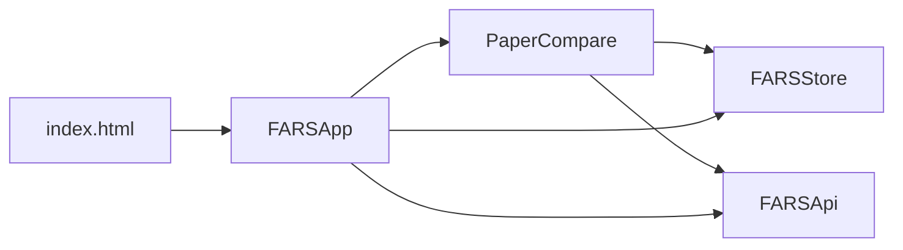

# 论文对比组件

<cite>
**本文引用的文件**
- [paper-compare.js](file://docs/v2/components/paper-compare.js)
- [store.js](file://docs/v2/state/store.js)
- [client.js](file://docs/v2/api/client.js)
- [index.html](file://docs/v2/index.html)
- [app.js](file://docs/v2/app.js)
</cite>

## 目录
1. [简介](#简介)
2. [项目结构](#项目结构)
3. [核心组件](#核心组件)
4. [架构总览](#架构总览)
5. [详细组件分析](#详细组件分析)
6. [依赖关系分析](#依赖关系分析)
7. [性能考虑](#性能考虑)
8. [故障排查指南](#故障排查指南)
9. [结论](#结论)
10. [附录](#附录)

## 简介
本文件为 PaperCompare 论文对比组件的技术文档，聚焦于多论文对比分析的前端实现，涵盖以下方面：
- 文本差异分析与对比策略：当前实现侧重于指标对比与统计摘要，未直接暴露底层差异算法细节；可扩展接入 diff 库以实现逐字/逐句级差异可视化。
- 版本管理与历史追踪：前端未内置版本控制或变更追踪逻辑；可通过后端 API 提供的历史版本接口扩展“历史版本比较”能力。
- 可视化展示：提供表格、雷达图与柱状图占位区域，便于后续集成图表库。
- 交互特性：选择论文、清空选择、对比执行、加载状态与提示通知等。
- 文本预处理与格式兼容：当前未见专门的文本清洗与编码转换逻辑；建议在对比前统一文本格式与编码。
- 配置参数与输出格式：组件支持导出报告与保存对比，具体格式由后端决定；前端可扩展为多种输出格式。
- 性能优化与大数据集：当前未见分页或虚拟滚动；建议对长文本与大量论文场景采用懒加载与增量渲染。
- 文件系统与云同步：组件通过 API 客户端访问后端，未直接操作本地文件系统；可结合后端实现本地/云端同步。

## 项目结构
PaperCompare 组件位于前端 v2 子目录，配合集中式状态管理与 API 客户端共同工作。页面通过标签页组织，对比功能位于“compare”标签页容器内。

**图表来源**
- [index.html:1-118](file://docs/v2/index.html#L1-L118)
- [app.js:1-259](file://docs/v2/app.js#L1-L259)
- [store.js:1-371](file://docs/v2/state/store.js#L1-L371)
- [client.js:1-274](file://docs/v2/api/client.js#L1-L274)
- [paper-compare.js:1-316](file://docs/v2/components/paper-compare.js#L1-L316)

**章节来源**
- [index.html:1-118](file://docs/v2/index.html#L1-L118)
- [app.js:240-259](file://docs/v2/app.js#L240-L259)

## 核心组件
- PaperCompare：负责论文列表渲染、选择管理、对比请求与结果展示。
- FARSStore：集中状态管理，提供订阅/发布、历史回退、主题与加载状态等。
- FARSApi：封装 REST API，提供论文、分支、实验、质量、LLM 监控、系统状态等接口，包含对比端点。
- FARSApp：应用入口，负责事件绑定、初始数据加载、主题与通知容器渲染。

关键职责划分：
- 视图层：PaperCompare 渲染 UI 并响应用户交互。
- 状态层：FARSStore 管理 papers、ui、toasts 等状态切片。
- 数据层：FARSApi 封装网络请求，调用后端对比接口。
- 应用层：FARSApp 初始化组件并协调各模块。

**章节来源**
- [paper-compare.js:6-316](file://docs/v2/components/paper-compare.js#L6-L316)
- [store.js:6-371](file://docs/v2/state/store.js#L6-L371)
- [client.js:6-274](file://docs/v2/api/client.js#L6-L274)
- [app.js:6-237](file://docs/v2/app.js#L6-L237)

## 架构总览
PaperCompare 的运行时交互流程如下：

**图表来源**
- [paper-compare.js:143-164](file://docs/v2/components/paper-compare.js#L143-L164)
- [store.js:294-296](file://docs/v2/state/store.js#L294-L296)
- [client.js:235-241](file://docs/v2/api/client.js#L235-L241)

## 详细组件分析

### PaperCompare 组件
职责与行为：
- 初始化：挂载容器、获取全局 store 与 api、渲染界面、加载论文数据、订阅状态变化。
- 论文列表：从后端获取论文列表，渲染为可勾选项，支持单击切换选择状态。
- 选择管理：维护 selectedPapers 列表，动态更新“已选择数量”与“对比按钮”可用状态。
- 对比执行：调用 API 进行多论文对比，展示结果汇总、表格与洞察，并通过 store 发送 toast 通知。
- 结果展示：渲染对比摘要卡片、评分表格、图表占位区与洞察内容。
- 清空操作：重置选择与结果，刷新 UI。

交互流程（选择与对比）：

**图表来源**
- [paper-compare.js:18-164](file://docs/v2/components/paper-compare.js#L18-L164)

**章节来源**
- [paper-compare.js:6-316](file://docs/v2/components/paper-compare.js#L6-L316)

### 状态管理（FARSStore）
- 状态切片：包含 research、papers、branches、experiments、quality、llmMonitoring、topology、checkpoints、ui 等。
- 订阅机制：subscribe 支持按 selector 精准订阅特定切片，避免全量重渲染。
- 历史管理：setState 后记录历史快照，支持 undo 回退。
- UI 辅助：提供 setLoading、toggleTheme、showToast 等便捷方法。

与 PaperCompare 的协作：
- PaperCompare 在加载/对比前后通过 store.setLoading 控制加载态。
- 错误与成功消息通过 store.showToast 展示。

**章节来源**
- [store.js:6-371](file://docs/v2/state/store.js#L6-L371)
- [paper-compare.js:150-163](file://docs/v2/components/paper-compare.js#L150-L163)

### API 客户端（FARSApi）
- 端点定义：包含 papers、research、branches、experiments、quality、llm-calls、topology、checkpoints、compare 等。
- 请求封装：request 方法统一封装 fetch，处理错误与 JSON 解析。
- 对比接口：comparePapers 接收 paper_ids 数组，向后端发起 POST 请求。

与 PaperCompare 的协作：
- PaperCompare 调用 api.comparePapers(selectedPapers) 获取对比结果。

**章节来源**
- [client.js:6-274](file://docs/v2/api/client.js#L6-L274)
- [paper-compare.js:152](file://docs/v2/components/paper-compare.js#L152)

### 应用入口（FARSApp）
- 初始化：绑定事件、加载初始数据、设置主题、创建 toast 容器。
- 组件初始化：在 DOMContentLoaded 后实例化各组件，包括 PaperCompare。
- 通知渲染：订阅 ui.toasts，动态渲染 toast。

**章节来源**
- [app.js:6-237](file://docs/v2/app.js#L6-L237)
- [app.js:240-259](file://docs/v2/app.js#L240-L259)

## 依赖关系分析
组件间依赖关系如下：

**图表来源**
- [paper-compare.js:7-11](file://docs/v2/components/paper-compare.js#L7-L11)
- [app.js:240-259](file://docs/v2/app.js#L240-L259)
- [index.html:105-116](file://docs/v2/index.html#L105-L116)

**章节来源**
- [paper-compare.js:7-11](file://docs/v2/components/paper-compare.js#L7-L11)
- [app.js:240-259](file://docs/v2/app.js#L240-L259)
- [index.html:105-116](file://docs/v2/index.html#L105-L116)

## 性能考虑
- 加载与提示：通过 store.setLoading 控制加载态，避免重复请求与闪烁。
- 通知管理：toast 自动移除，减少 DOM 节点堆积。
- 列表渲染：当前为一次性渲染全部论文列表；对于大量论文，建议引入虚拟滚动或分页。
- 图表渲染：雷达图与柱状图目前为占位符；建议延迟初始化与按需渲染，避免阻塞主线程。
- 对比结果：表格与洞察内容一次性渲染；若数据量大，可考虑分块渲染与懒加载。
- 内存管理：组件销毁时应移除事件监听；当前未见显式的清理逻辑，建议在组件生命周期中补充。

[本节为通用性能建议，不直接分析具体文件]

## 故障排查指南
常见问题与定位要点：
- 对比按钮不可用：检查 selectedPapers 是否至少包含 2 个 ID。
- 加载失败：查看控制台错误与 store.showToast 的错误提示。
- 网络异常：确认 FARSApi.request 的响应状态与后端接口连通性。
- UI 不更新：确认 FARSStore 的订阅是否正确，以及 selector 是否返回不同值以触发回调。

**章节来源**
- [paper-compare.js:144-147](file://docs/v2/components/paper-compare.js#L144-L147)
- [paper-compare.js:70-74](file://docs/v2/components/paper-compare.js#L70-L74)
- [client.js:66-76](file://docs/v2/api/client.js#L66-L76)
- [store.js:120-132](file://docs/v2/state/store.js#L120-L132)

## 结论
PaperCompare 当前实现了论文选择、对比请求与结果展示的基本闭环，具备良好的状态管理与 API 集成。为进一步完善，建议：
- 引入差异算法与可视化（如 diff 库），实现逐字/逐句级差异高亮。
- 扩展版本管理与历史对比能力，结合后端版本接口实现变更追踪。
- 优化大数据集下的渲染性能，采用虚拟滚动、分页与懒加载。
- 明确文本预处理与编码兼容策略，确保对比输入的一致性。
- 完善配置参数与输出格式选项，满足多样化导出需求。

[本节为总结性内容，不直接分析具体文件]

## 附录

### 组件配置与对比选项
- 选择范围：支持 2-4 篇论文进行对比。
- 对比策略：当前为指标对比与统计摘要；可扩展为基于 diff 的差异分析。
- 输出格式：提供“导出报告”与“保存对比”按钮，具体格式由后端决定。

**章节来源**
- [paper-compare.js:205-261](file://docs/v2/components/paper-compare.js#L205-L261)

### 交互特性
- 差异高亮：当前未实现逐字/逐句级差异高亮；建议引入 diff 库并在结果面板中渲染差异标记。
- 滚动同步：当前未实现多面板滚动同步；可在差异面板中加入滚动联动逻辑。
- 折叠展开：当前未实现折叠/展开；可在洞察与表格中增加折叠/展开交互。

[本节为概念性建议，不直接分析具体文件]

### 文本预处理与格式兼容
- 编码转换：当前未见专门的编码处理逻辑；建议在对比前统一编码（如 UTF-8）。
- 格式兼容：建议对标题、摘要、正文进行标准化处理（去除多余空白、统一换行等）。

[本节为概念性建议，不直接分析具体文件]

### 与文件系统及云同步
- 文件系统：组件通过 API 客户端访问后端，未直接操作本地文件系统。
- 本地存储：可利用浏览器本地存储（localStorage）缓存用户偏好与临时数据。
- 云端同步：可通过后端接口实现论文与对比结果的云端同步。

[本节为概念性建议，不直接分析具体文件]