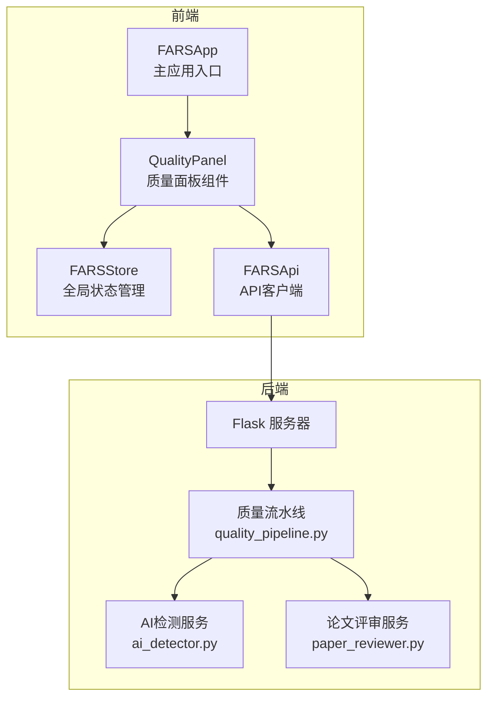
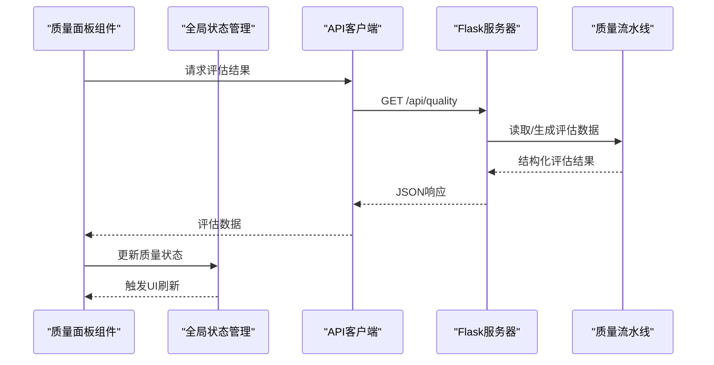
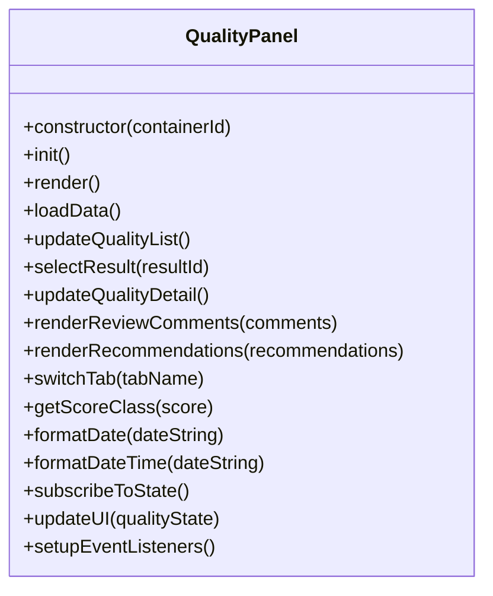
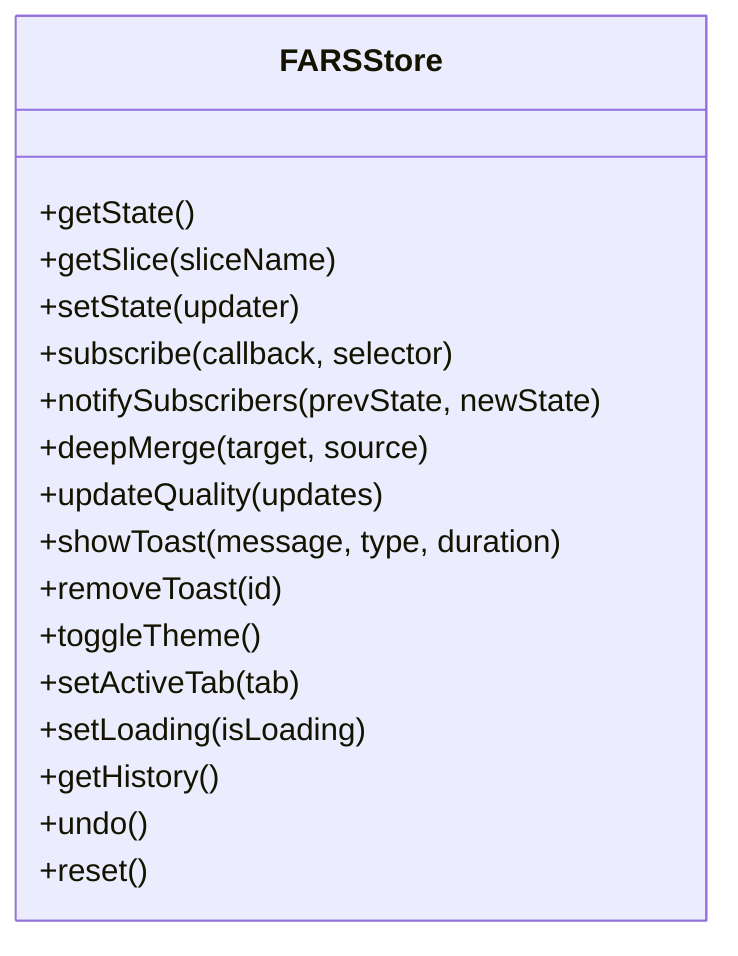
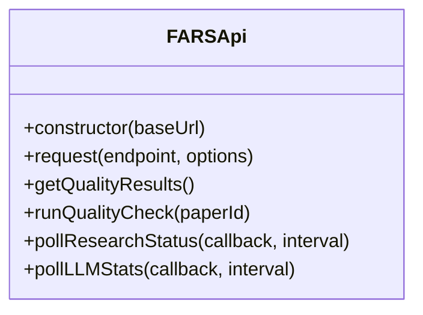
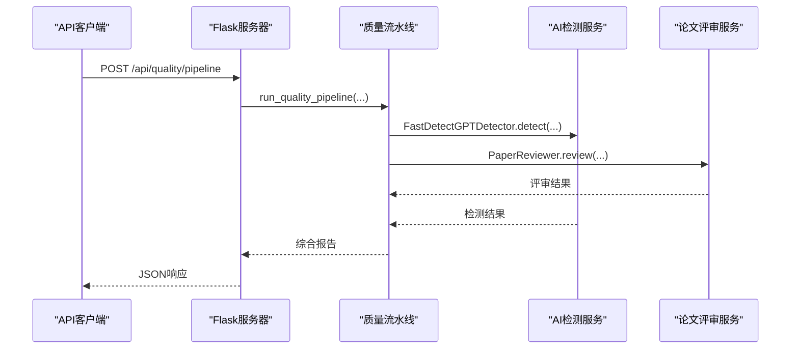
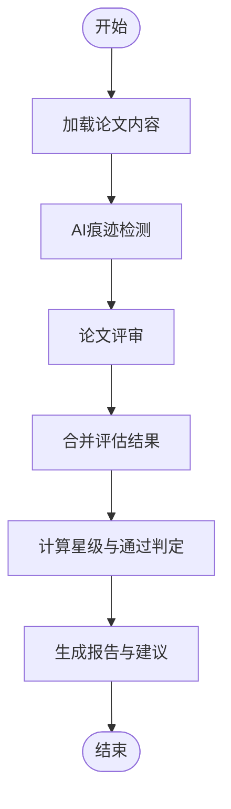
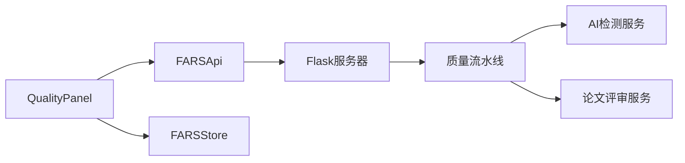

# 质量面板组件

<cite>
**本文档引用的文件**
- [quality-panel.js](file://docs/v2/components/quality-panel.js)
- [store.js](file://docs/v2/state/store.js)
- [client.js](file://docs/v2/api/client.js)
- [app.js](file://docs/v2/app.js)
- [quality_pipeline.py](file://src/tools/quality_pipeline.py)
- [ai_detector.py](file://src/services/ai_detector.py)
- [paper_reviewer.py](file://src/services/paper_reviewer.py)
- [server.py](file://server.py)
</cite>

## 目录
1. [简介](#简介)
2. [项目结构](#项目结构)
3. [核心组件](#核心组件)
4. [架构总览](#架构总览)
5. [详细组件分析](#详细组件分析)
6. [依赖关系分析](#依赖关系分析)
7. [性能考虑](#性能考虑)
8. [故障排除指南](#故障排除指南)
9. [结论](#结论)
10. [附录](#附录)

## 简介
质量面板组件负责展示论文质量评估结果，涵盖AI痕迹检测与论文评审两大核心能力。前端通过组件化界面呈现评估列表与详情页，后端提供REST API支撑质量流水线的运行与报告生成。组件采用集中状态管理模式，支持实时刷新与交互操作。

## 项目结构
质量面板位于前端组件层，配合全局状态管理与API客户端，形成完整的数据流闭环。后端服务器提供质量相关接口，调用Python工具模块完成AI检测与论文评审。

**图表来源**
- [quality-panel.js:1-346](file://docs/v2/components/quality-panel.js#L1-L346)
- [store.js:1-371](file://docs/v2/state/store.js#L1-L371)
- [client.js:1-274](file://docs/v2/api/client.js#L1-L274)
- [app.js:1-259](file://docs/v2/app.js#L1-L259)
- [quality_pipeline.py:1-807](file://src/tools/quality_pipeline.py#L1-L807)
- [ai_detector.py:1-358](file://src/services/ai_detector.py#L1-L358)
- [paper_reviewer.py:1-473](file://src/services/paper_reviewer.py#L1-L473)
- [server.py:5280-5460](file://server.py#L5280-L5460)

**章节来源**
- [quality-panel.js:1-346](file://docs/v2/components/quality-panel.js#L1-L346)
- [store.js:1-371](file://docs/v2/state/store.js#L1-L371)
- [client.js:1-274](file://docs/v2/api/client.js#L1-L274)
- [app.js:1-259](file://docs/v2/app.js#L1-L259)
- [server.py:5280-5460](file://server.py#L5280-L5460)

## 核心组件
- 质量面板组件：负责渲染评估列表、详情页与交互控制，订阅全局状态以实现数据驱动的UI更新。
- 全局状态管理：集中维护质量评估结果、UI状态与通知提示，支持深度合并与历史回放。
- API客户端：封装REST端点，提供质量评估相关请求方法，统一错误处理与响应解析。
- 服务器端质量流水线：整合AI检测与论文评审，生成综合质量报告，提供独立的检测与评审接口。

**章节来源**
- [quality-panel.js:6-346](file://docs/v2/components/quality-panel.js#L6-L346)
- [store.js:6-371](file://docs/v2/state/store.js#L6-L371)
- [client.js:6-274](file://docs/v2/api/client.js#L6-L274)
- [quality_pipeline.py:26-807](file://src/tools/quality_pipeline.py#L26-L807)

## 架构总览
质量面板的前端-后端交互遵循“组件-状态-API-服务”的分层设计。组件通过API客户端发起请求，后端路由根据请求参数调用质量流水线模块，最终返回结构化的评估结果。

**图表来源**
- [quality-panel.js:59-74](file://docs/v2/components/quality-panel.js#L59-L74)
- [client.js:177-186](file://docs/v2/api/client.js#L177-L186)
- [server.py:5280-5337](file://server.py#L5280-L5337)
- [quality_pipeline.py:748-807](file://src/tools/quality_pipeline.py#L748-L807)

## 详细组件分析

### 质量面板组件（QualityPanel）
- 初始化与渲染：构造函数注入容器、全局状态与API客户端，初始化渲染与数据加载。
- 数据加载：通过API获取评估结果，更新全局状态，并刷新列表视图。
- 列表与详情：支持点击选择评估项，切换至详情页展示综合评分、维度得分与报告标签页。
- 交互与事件：提供刷新按钮与占位的“运行质量检查”按钮，绑定事件处理器。
- 状态订阅：订阅质量状态变化，实现UI的自动更新。
- 工具方法：评分等级映射、日期格式化、标签页切换等辅助逻辑。

**图表来源**
- [quality-panel.js:6-346](file://docs/v2/components/quality-panel.js#L6-L346)

**章节来源**
- [quality-panel.js:6-346](file://docs/v2/components/quality-panel.js#L6-L346)

### 全局状态管理（FARSStore）
- 状态切片：维护研究、论文、分支、实验、质量、LLM监控、拓扑、检查点与UI等状态切片。
- 更新机制：提供深度合并的状态更新方法，支持选择器订阅与变更通知。
- 通知系统：提供Toast消息队列，支持自动移除与主题切换。
- 历史回放：记录状态变更历史，支持撤销与重置。

**图表来源**
- [store.js:6-371](file://docs/v2/state/store.js#L6-L371)

**章节来源**
- [store.js:6-371](file://docs/v2/state/store.js#L6-L371)

### API客户端（FARSApi）
- 端点定义：集中管理REST端点，包括论文、研究、分支、实验、质量、LLM监控、系统、拓扑与检查点等。
- 请求封装：统一请求头与错误处理，提供质量相关方法（获取结果、运行检查）。
- 轮询工具：提供研究状态与LLM统计的轮询方法，便于异步任务状态跟踪。

**图表来源**
- [client.js:6-274](file://docs/v2/api/client.js#L6-L274)

**章节来源**
- [client.js:6-274](file://docs/v2/api/client.js#L6-L274)

### 服务器端质量流水线（后端）
- 路由接口：提供质量流水线、AI检测、论文评审与论文质量报告查询等端点。
- 数据处理：从论文数据源读取内容，调用质量流水线模块生成综合报告。
- 错误处理：捕获异常并返回标准化错误信息，便于前端提示。

**图表来源**
- [server.py:5280-5460](file://server.py#L5280-L5460)
- [quality_pipeline.py:748-807](file://src/tools/quality_pipeline.py#L748-L807)
- [ai_detector.py:237-297](file://src/services/ai_detector.py#L237-L297)
- [paper_reviewer.py:159-180](file://src/services/paper_reviewer.py#L159-L180)

**章节来源**
- [server.py:5280-5460](file://server.py#L5280-L5460)
- [quality_pipeline.py:26-807](file://src/tools/quality_pipeline.py#L26-L807)
- [ai_detector.py:1-358](file://src/services/ai_detector.py#L1-L358)
- [paper_reviewer.py:1-473](file://src/services/paper_reviewer.py#L1-L473)

### 质量指标与评分标准
- 综合评分：前端采用等级映射（优秀/良好/一般/较差），后端综合AI检测概率与评审维度计算星级与通过判定。
- AI检测：基于Fast-DetectGPT的条件概率曲率，输出AI概率、置信度与可疑段落。
- 论文评审：多维度评分（学术价值、清晰度、可复现性、原创性、实用性），支持外部PaperReview.ai评分。
- 报告生成：汇总AI检测与评审结果，生成建议与摘要，支持导出与重新评估。

**图表来源**
- [quality_pipeline.py:612-694](file://src/tools/quality_pipeline.py#L612-L694)
- [ai_detector.py:237-297](file://src/services/ai_detector.py#L237-L297)
- [paper_reviewer.py:159-180](file://src/services/paper_reviewer.py#L159-L180)

**章节来源**
- [quality_panel.py:612-694](file://src/tools/quality_pipeline.py#L612-L694)
- [ai_detector.py:237-297](file://src/services/ai_detector.py#L237-L297)
- [paper_reviewer.py:159-180](file://src/services/paper_reviewer.py#L159-L180)

## 依赖关系分析
- 组件耦合：质量面板依赖API客户端与全局状态管理，保持UI与数据层解耦。
- 状态管理：通过选择器订阅质量切片，减少不必要的UI重绘。
- 后端集成：服务器路由直接调用质量流水线模块，确保评估逻辑集中与可测试。

**图表来源**
- [quality-panel.js:6-346](file://docs/v2/components/quality-panel.js#L6-L346)
- [client.js:6-274](file://docs/v2/api/client.js#L6-L274)
- [store.js:6-371](file://docs/v2/state/store.js#L6-L371)
- [server.py:5280-5460](file://server.py#L5280-L5460)
- [quality_pipeline.py:26-807](file://src/tools/quality_pipeline.py#L26-L807)

**章节来源**
- [quality-panel.js:6-346](file://docs/v2/components/quality-panel.js#L6-L346)
- [client.js:6-274](file://docs/v2/api/client.js#L6-L274)
- [store.js:6-371](file://docs/v2/state/store.js#L6-L371)
- [server.py:5280-5460](file://server.py#L5280-L5460)
- [quality_pipeline.py:26-807](file://src/tools/quality_pipeline.py#L26-L807)

## 性能考虑
- 前端渲染：列表与详情页采用条件渲染与懒加载策略，避免大文本重复渲染。
- 状态更新：使用选择器订阅，仅在质量切片变化时触发UI更新，降低重绘成本。
- 后端处理：AI检测与评审涉及外部API调用，建议在服务器端增加缓存与并发控制，避免重复计算。
- 网络请求：API客户端统一错误处理与超时控制，建议在前端增加请求去抖与重试机制。

## 故障排除指南
- 加载失败：前端捕获API错误并通过Toast提示，检查网络连接与后端服务状态。
- 评估结果为空：确认论文内容存在且格式正确，检查服务器端质量流水线是否正常运行。
- 评审失败：若缺少API密钥，评审将回退至模拟结果，需配置Anthropic或DeepSeek API密钥。
- 本地检测不可用：Fast-DetectGPT本地模型未安装或缓存缺失时，自动降级为统计检测方法。

**章节来源**
- [quality-panel.js:60-74](file://docs/v2/components/quality-panel.js#L60-L74)
- [paper_reviewer.py:168-180](file://src/services/paper_reviewer.py#L168-L180)
- [quality_pipeline.py:118-144](file://src/tools/quality_pipeline.py#L118-L144)

## 结论
质量面板组件通过清晰的前后端分层与集中状态管理，实现了论文质量评估的可视化与自动化。AI检测与论文评审双引擎协同，结合灵活的报告生成与导出能力，为用户提供全面的质量洞察。后续可在性能优化、错误恢复与扩展接口方面进一步完善。

## 附录
- 配置选项：可通过环境变量配置API密钥与模型参数，影响AI检测与评审的准确性与速度。
- 自定义参数：支持调整检测阈值、评审维度权重与报告模板，满足不同场景需求。
- 扩展接口：新增评估模块时，遵循统一的API契约与状态更新规范，确保组件兼容性。