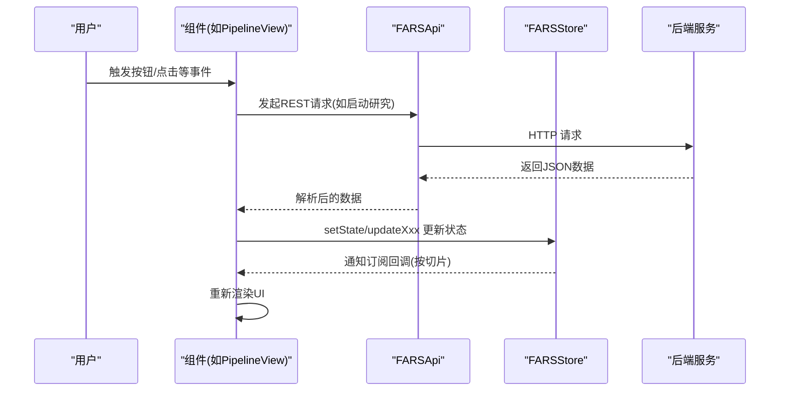
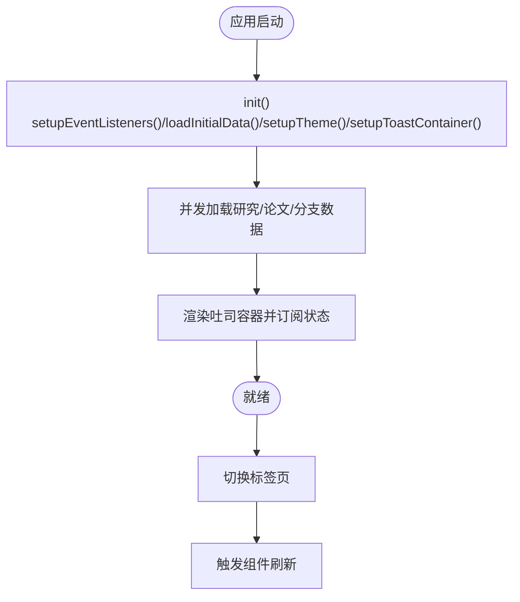
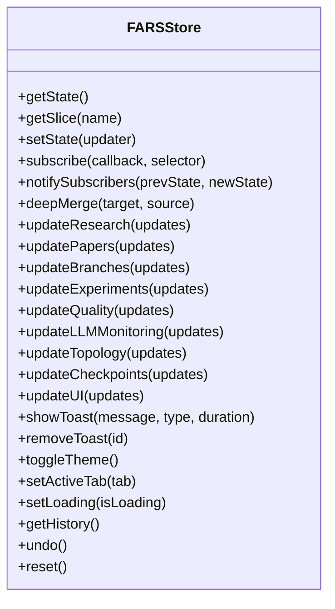
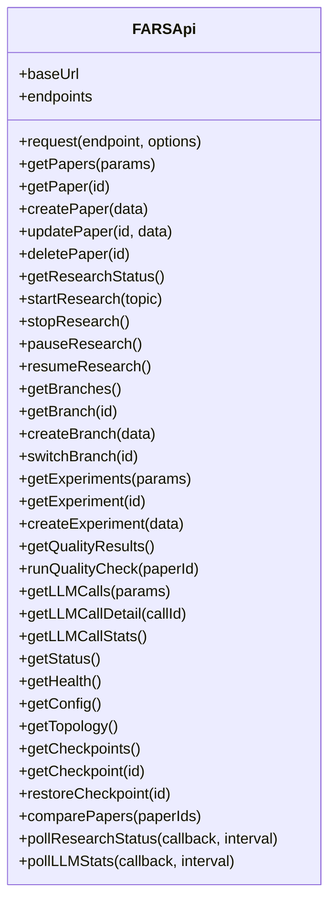
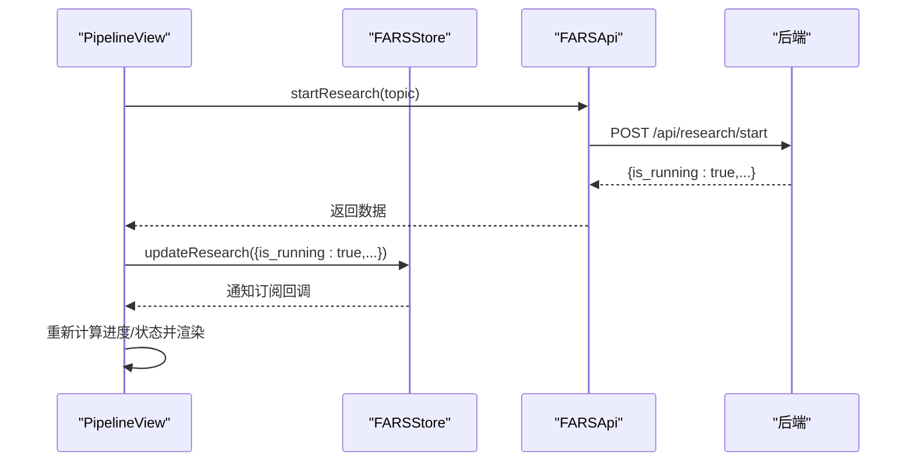
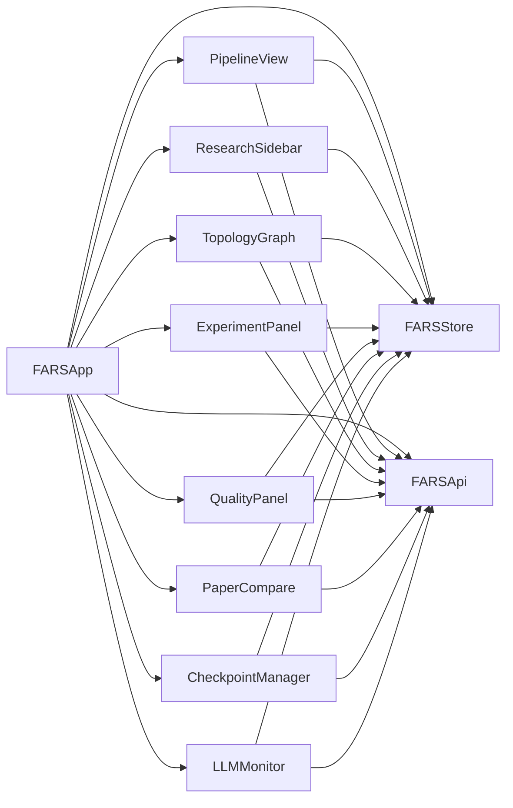

# 组件间交互与通信

<cite>
**本文引用的文件**
- [docs/v2/index.html](file://docs/v2/index.html)
- [docs/v2/app.js](file://docs/v2/app.js)
- [docs/v2/state/store.js](file://docs/v2/state/store.js)
- [docs/v2/api/client.js](file://docs/v2/api/client.js)
- [docs/v2/components/pipeline-view.js](file://docs/v2/components/pipeline-view.js)
- [docs/v2/components/research-sidebar.js](file://docs/v2/components/research-sidebar.js)
- [docs/v2/components/topology-graph.js](file://docs/v2/components/topology-graph.js)
- [docs/v2/components/experiment-panel.js](file://docs/v2/components/experiment-panel.js)
- [docs/v2/components/quality-panel.js](file://docs/v2/components/quality-panel.js)
- [docs/v2/components/paper-compare.js](file://docs/v2/components/paper-compare.js)
- [docs/v2/components/checkpoint-manager.js](file://docs/v2/components/checkpoint-manager.js)
- [docs/v2/components/llm-monitor.js](file://docs/v2/components/llm-monitor.js)
</cite>

## 目录
1. [引言](#引言)
2. [项目结构](#项目结构)
3. [核心组件](#核心组件)
4. [架构总览](#架构总览)
5. [详细组件分析](#详细组件分析)
6. [依赖关系分析](#依赖关系分析)
7. [性能考量](#性能考量)
8. [故障排查指南](#故障排查指南)
9. [结论](#结论)
10. [附录](#附录)

## 引言
本文件聚焦于paperwriterAI前端v2版本的组件间交互与通信机制，系统梳理组件间通信模式（父子、兄弟、跨层级）、事件总线与状态共享、消息传递协议、生命周期管理、数据流控制与状态同步策略，并给出时序图、数据流图与状态变更图，帮助开发者快速理解与扩展系统。

## 项目结构
v2采用“单页应用 + 组件化 + 集中式状态”的架构：HTML负责布局与容器挂载；主应用类负责初始化、事件绑定与全局状态联动；集中式状态管理器提供订阅/发布能力；各业务组件通过API客户端拉取/推送数据；组件内部通过store订阅实现UI自动更新。

```mermaid
graph TB
HTML["index.html<br/>页面与容器"] --> APP["app.js<br/>FARSApp 主应用"]
APP --> STORE["state/store.js<br/>FARSStore 集中式状态"]
APP --> API["api/client.js<br/>FARSApi REST客户端"]
APP --> CMPS["各组件<br/>pipeline-view.js / research-sidebar.js / topology-graph.js / experiment-panel.js / quality-panel.js / paper-compare.js / checkpoint-manager.js / llm-monitor.js"]
STORE <- --> CMPS
API <- --> CMPS
```

**图表来源**
- [docs/v2/index.html](file://docs/v2/index.html)
- [docs/v2/app.js](file://docs/v2/app.js)
- [docs/v2/state/store.js](file://docs/v2/state/store.js)
- [docs/v2/api/client.js](file://docs/v2/api/client.js)
- [docs/v2/components/pipeline-view.js](file://docs/v2/components/pipeline-view.js)
- [docs/v2/components/research-sidebar.js](file://docs/v2/components/research-sidebar.js)
- [docs/v2/components/topology-graph.js](file://docs/v2/components/topology-graph.js)
- [docs/v2/components/experiment-panel.js](file://docs/v2/components/experiment-panel.js)
- [docs/v2/components/quality-panel.js](file://docs/v2/components/quality-panel.js)
- [docs/v2/components/paper-compare.js](file://docs/v2/components/paper-compare.js)
- [docs/v2/components/checkpoint-manager.js](file://docs/v2/components/checkpoint-manager.js)
- [docs/v2/components/llm-monitor.js](file://docs/v2/components/llm-monitor.js)

**章节来源**
- [docs/v2/index.html](file://docs/v2/index.html)
- [docs/v2/app.js](file://docs/v2/app.js)

## 核心组件
- 主应用层：负责全局事件绑定、初始数据加载、主题与通知容器、标签页切换与组件刷新触发。
- 集中式状态层：提供深合并setState、按需切片订阅、历史记录与撤销、UI状态（主题、加载、吐司）管理。
- API客户端层：封装40+REST端点，统一fetch请求、错误处理与轮询工具。
- 业务组件层：各Tab对应组件，均持有store与api引用，负责渲染、事件处理与状态订阅。

**章节来源**
- [docs/v2/app.js](file://docs/v2/app.js)
- [docs/v2/state/store.js](file://docs/v2/state/store.js)
- [docs/v2/api/client.js](file://docs/v2/api/client.js)

## 架构总览
下图展示从用户交互到数据更新的完整链路：用户操作触发组件事件 → 组件通过API客户端发起请求 → 后端返回数据 → 组件更新store → store通知订阅者 → 所有订阅该切片的组件自动重绘。



**图表来源**
- [docs/v2/components/pipeline-view.js](file://docs/v2/components/pipeline-view.js)
- [docs/v2/api/client.js](file://docs/v2/api/client.js)
- [docs/v2/state/store.js](file://docs/v2/state/store.js)

## 详细组件分析

### 主应用层（FARSApp）
- 职责：初始化、事件监听（导航、主题、设置、模态框、键盘）、初始数据并发加载、主题与吐司容器、标签页切换与组件刷新触发。
- 关键交互：loadInitialData并发加载研究/论文/分支数据；switchTab切换活动Tab并更新store；setupToastContainer订阅ui.toasts自动渲染。
- 生命周期：DOM加载完成后实例化，随后初始化各组件。



**图表来源**
- [docs/v2/app.js](file://docs/v2/app.js)

**章节来源**
- [docs/v2/app.js](file://docs/v2/app.js)

### 集中式状态层（FARSStore）
- 职责：集中管理研究、论文、分支、实验、质量、LLM监控、拓扑、断点、UI等状态；提供订阅/通知；深合并更新；历史记录与撤销；UI工具方法（主题、吐司、加载）。
- 订阅机制：subscribe(callback, selector)按切片订阅，仅在切片变化时回调；notifySubscribers遍历订阅者。
- 状态更新：setState支持函数式更新与深合并；history记录最近50步以便undo。



**图表来源**
- [docs/v2/state/store.js](file://docs/v2/state/store.js)

**章节来源**
- [docs/v2/state/store.js](file://docs/v2/state/store.js)

### API客户端层（FARSApi）
- 职责：统一REST端点定义与请求封装；提供研究、分支、实验、质量、LLM监控、拓扑、断点、系统等API；提供轮询工具pollResearchStatus/pollLLMStats。
- 错误处理：统一fetch封装，非OK抛出错误；组件捕获并提示。



**图表来源**
- [docs/v2/api/client.js](file://docs/v2/api/client.js)

**章节来源**
- [docs/v2/api/client.js](file://docs/v2/api/client.js)

### 业务组件（以PipelineView为例）
- 职责：渲染流水线阶段、进度条、控制按钮；根据store.research切片更新UI；通过api触发研究启停；订阅状态变化自动重绘。
- 通信模式：组件内持有store与api引用；通过store.updateXxx更新状态；通过store.subscribe订阅切片；通过api调用后端。



**图表来源**
- [docs/v2/components/pipeline-view.js](file://docs/v2/components/pipeline-view.js)
- [docs/v2/api/client.js](file://docs/v2/api/client.js)
- [docs/v2/state/store.js](file://docs/v2/state/store.js)

**章节来源**
- [docs/v2/components/pipeline-view.js](file://docs/v2/components/pipeline-view.js)

### 其他组件（ResearchSidebar/TopologyGraph/ExperimentPanel/QualityPanel/PaperCompare/CheckpointManager/LLMMonitor）
- 共同特征：均在init中render、loadData、subscribeToState；通过store.updateXxx切片更新；通过store.subscribe按需订阅；通过api获取数据或触发动作。
- 通信模式：组件间通过store共享状态，无需直接互相调用；跨Tab组件通过store.ui.activeTab等UI切片协调显示；部分组件内置轮询或定时刷新。

**章节来源**
- [docs/v2/components/research-sidebar.js](file://docs/v2/components/research-sidebar.js)
- [docs/v2/components/topology-graph.js](file://docs/v2/components/topology-graph.js)
- [docs/v2/components/experiment-panel.js](file://docs/v2/components/experiment-panel.js)
- [docs/v2/components/quality-panel.js](file://docs/v2/components/quality-panel.js)
- [docs/v2/components/paper-compare.js](file://docs/v2/components/paper-compare.js)
- [docs/v2/components/checkpoint-manager.js](file://docs/v2/components/checkpoint-manager.js)
- [docs/v2/components/llm-monitor.js](file://docs/v2/components/llm-monitor.js)

## 依赖关系分析
- 组件对store的依赖：所有组件均通过window.farsStore访问状态；组件内部通过store.subscribe实现UI响应式更新。
- 组件对api的依赖：组件通过window.farsApi调用REST接口；主应用在初始化时并发加载数据。
- 主应用对组件的依赖：主应用在DOM加载完成后实例化各组件；主应用负责全局事件与主题/吐司容器。



**图表来源**
- [docs/v2/app.js](file://docs/v2/app.js)
- [docs/v2/state/store.js](file://docs/v2/state/store.js)
- [docs/v2/api/client.js](file://docs/v2/api/client.js)
- [docs/v2/components/pipeline-view.js](file://docs/v2/components/pipeline-view.js)
- [docs/v2/components/research-sidebar.js](file://docs/v2/components/research-sidebar.js)
- [docs/v2/components/topology-graph.js](file://docs/v2/components/topology-graph.js)
- [docs/v2/components/experiment-panel.js](file://docs/v2/components/experiment-panel.js)
- [docs/v2/components/quality-panel.js](file://docs/v2/components/quality-panel.js)
- [docs/v2/components/paper-compare.js](file://docs/v2/components/paper-compare.js)
- [docs/v2/components/checkpoint-manager.js](file://docs/v2/components/checkpoint-manager.js)
- [docs/v2/components/llm-monitor.js](file://docs/v2/components/llm-monitor.js)

**章节来源**
- [docs/v2/app.js](file://docs/v2/app.js)
- [docs/v2/state/store.js](file://docs/v2/state/store.js)
- [docs/v2/api/client.js](file://docs/v2/api/client.js)

## 性能考量
- 并发加载：主应用在初始化时并发加载研究/论文/分支数据，减少首屏等待。
- 深合并更新：store.setState采用深合并，避免浅拷贝导致的遗漏更新。
- 切片订阅：组件按需订阅状态切片，降低无关UI抖动。
- 自动刷新：LLMMonitor内置30秒轮询，保证监控面板实时性。
- 本地存储：主题持久化至localStorage，减少重复计算。
- 条件渲染与空态：组件在无数据时渲染空态，避免无效DOM。

[本节为通用性能建议，不直接分析具体文件]

## 故障排查指南
- API请求失败：检查FARSApi.request的错误处理与组件try/catch；确认后端端点可用与跨域配置。
- 状态未更新：确认组件是否正确调用store.updateXxx；检查subscribe的selector是否匹配状态切片。
- UI不刷新：确认store.notifySubscribers是否被调用；检查切片是否发生变化。
- 吐司不显示：确认setupToastContainer是否已订阅ui.toasts；检查store.showToast调用与去重逻辑。
- 轮询不生效：检查pollResearchStatus/pollLLMStats的回调与interval参数。

**章节来源**
- [docs/v2/api/client.js](file://docs/v2/api/client.js)
- [docs/v2/state/store.js](file://docs/v2/state/store.js)
- [docs/v2/components/llm-monitor.js](file://docs/v2/components/llm-monitor.js)

## 结论
paperwriterAI v2通过“主应用 + 集中式状态 + 组件化 + REST API”的清晰分层，实现了组件间低耦合、高内聚的通信机制。集中式状态提供统一的数据源与订阅通知，组件通过store与api进行数据交互，形成稳定的父子组件通信与跨层级状态共享模式。配合并发加载、切片订阅与自动刷新，系统在复杂业务场景下仍保持良好的可维护性与用户体验。

## 附录

### 组件间通信模式与消息协议
- 父子组件通信：组件通过store.updateXxx向父（store）写入状态，子（订阅者）自动接收并渲染。
- 兄弟组件通信：通过共享store切片实现，无需直接调用。
- 跨层级通信：通过store作为唯一真相源，任何组件均可读写，实现跨层级广播/订阅。
- 事件总线模式：组件内事件（按钮点击、输入变更）经由组件方法处理，最终落到store更新，属于“事件驱动 + 状态驱动”的混合模式。
- 状态共享机制：store.getState/getSlice提供只读访问；组件通过updateXxx写入；history支持撤销。
- 消息传递协议：组件通过api封装的REST端点发送请求，后端返回JSON；组件解析后调用store更新。

**章节来源**
- [docs/v2/state/store.js](file://docs/v2/state/store.js)
- [docs/v2/api/client.js](file://docs/v2/api/client.js)

### 组件生命周期管理与数据流控制
- 初始化：组件init中render、loadData、subscribeToState。
- 数据加载：组件内部调用api.*获取数据，再通过store.updateXxx写入。
- 状态同步：store.notifySubscribers按切片通知订阅者，组件updateUI重绘。
- 条件渲染优化：组件在无数据时渲染空态，减少DOM开销。

**章节来源**
- [docs/v2/components/research-sidebar.js](file://docs/v2/components/research-sidebar.js)
- [docs/v2/components/paper-compare.js](file://docs/v2/components/paper-compare.js)

### 组件注册机制与动态加载
- 注册机制：主应用在DOMContentLoaded后逐一实例化各组件，挂载到window对象，便于全局访问。
- 动态组件加载：组件在init中按需渲染与订阅，符合懒加载特性。
- 条件渲染：组件根据store状态决定显示内容与禁用状态。

**章节来源**
- [docs/v2/app.js](file://docs/v2/app.js)
- [docs/v2/index.html](file://docs/v2/index.html)

### 常见通信问题与优化技巧
- 问题：组件未收到状态更新
  - 排查：确认selector是否正确；确认切片字段是否存在；确认store.setState是否被调用。
- 优化：减少不必要的重绘
  - 使用切片订阅；避免全量状态订阅；合理使用深合并。
- 问题：API调用频繁导致卡顿
  - 优化：合并请求、使用轮询间隔、缓存短期数据。
- 问题：主题切换不生效
  - 排查：确认store.updateUI与documentElement.data-theme设置；确认本地存储读取。

**章节来源**
- [docs/v2/state/store.js](file://docs/v2/state/store.js)
- [docs/v2/app.js](file://docs/v2/app.js)