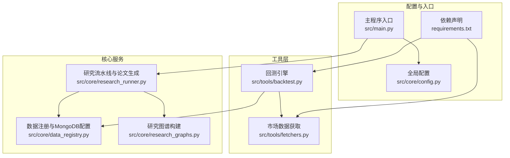
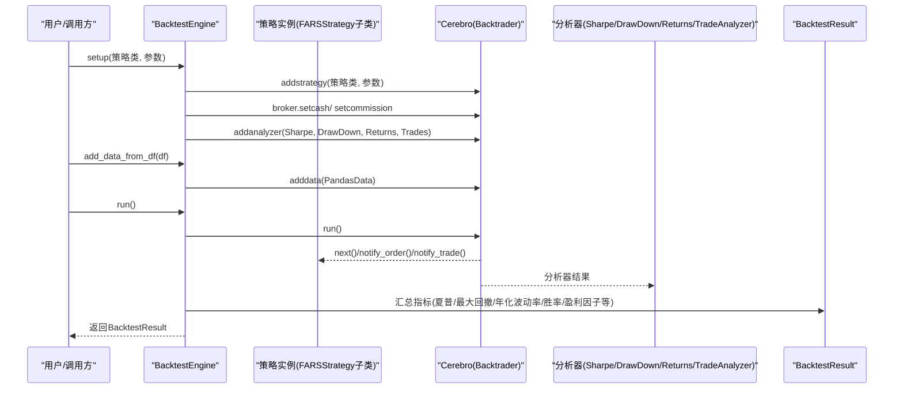
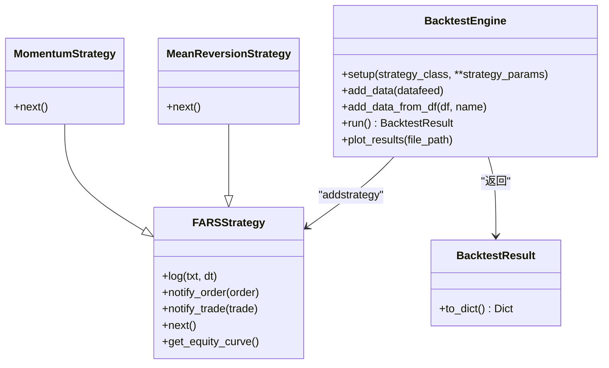
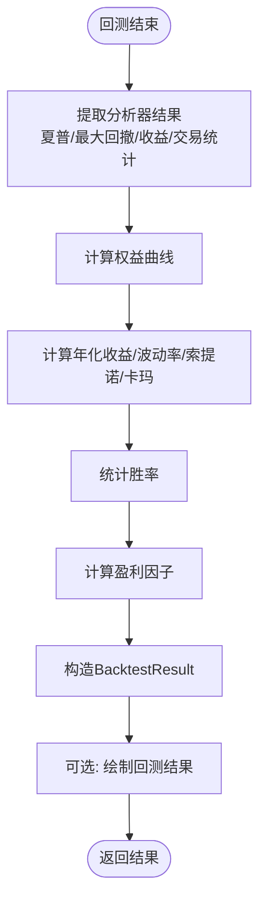
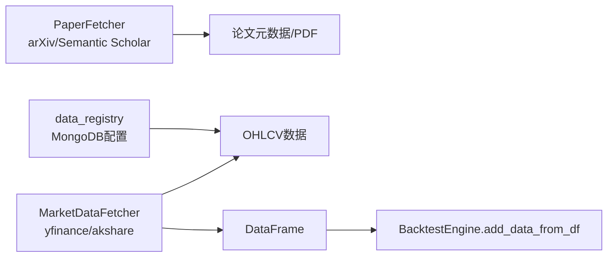
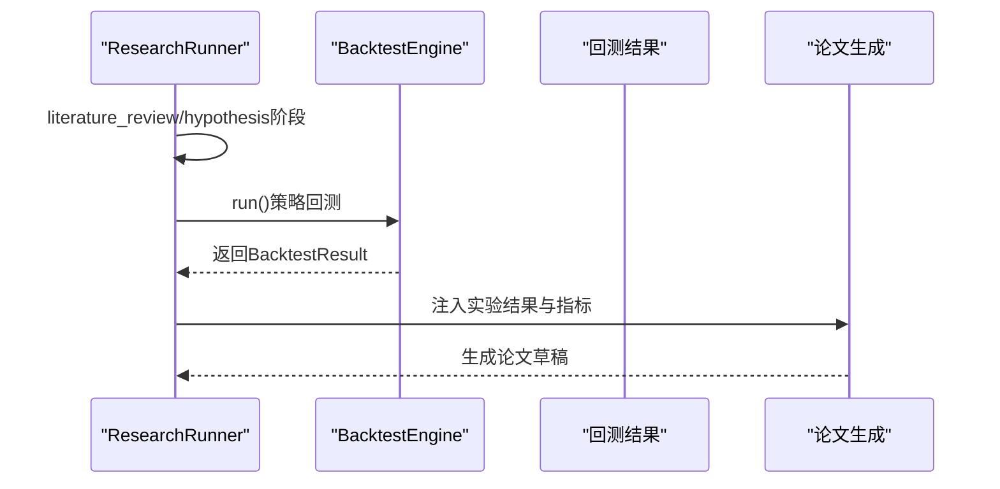
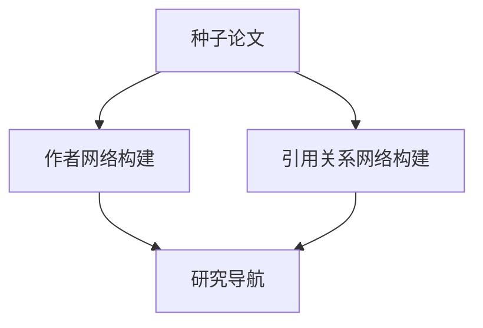
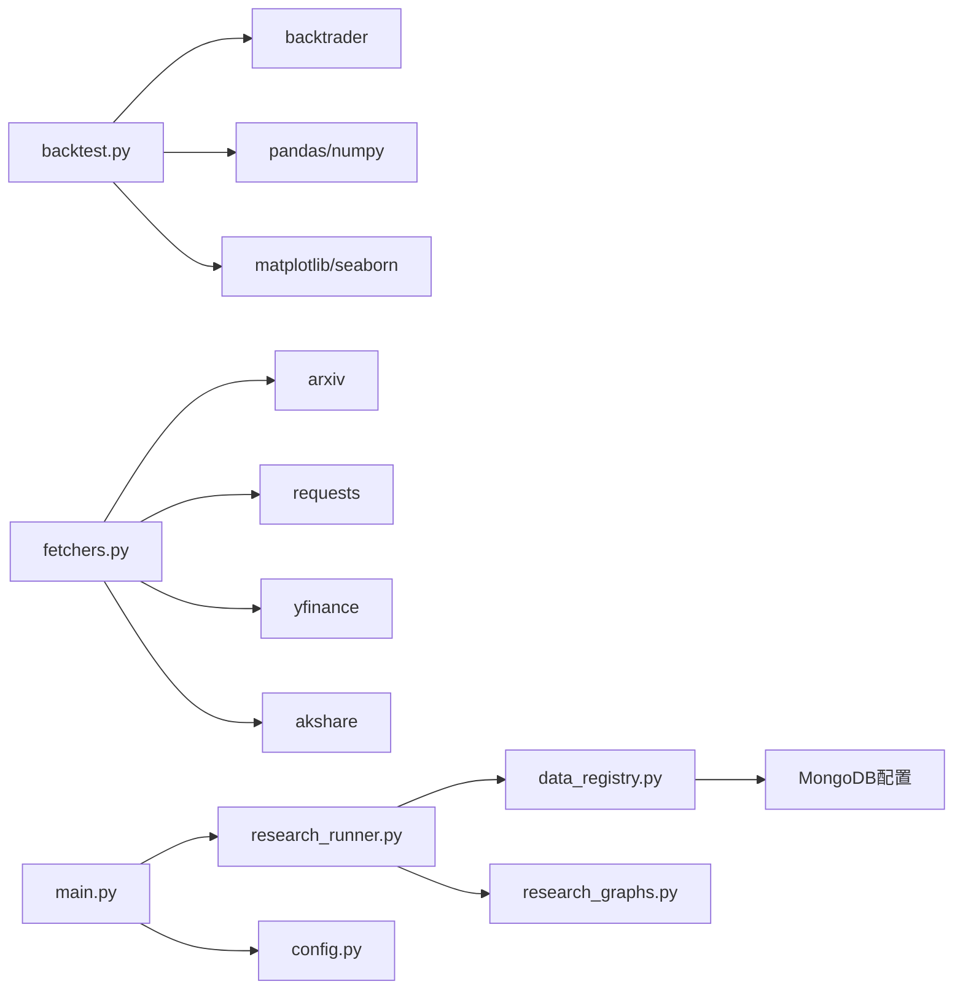

# 回测引擎

<cite>
**本文档引用的文件**
- [backtest.py](file://src/tools/backtest.py)
- [fetchers.py](file://src/tools/fetchers.py)
- [data_registry.py](file://src/core/data_registry.py)
- [research_runner.py](file://src/core/research_runner.py)
- [research_graphs.py](file://src/core/research_graphs.py)
- [config.py](file://src/core/config.py)
- [main.py](file://src/main.py)
- [requirements.txt](file://requirements.txt)
</cite>

## 目录
1. [简介](#简介)
2. [项目结构](#项目结构)
3. [核心组件](#核心组件)
4. [架构总览](#架构总览)
5. [详细组件分析](#详细组件分析)
6. [依赖关系分析](#依赖关系分析)
7. [性能考量](#性能考量)
8. [故障排查指南](#故障排查指南)
9. [结论](#结论)
10. [附录](#附录)

## 简介
本文件面向paperwriterAI的回测引擎，系统性阐述量化策略回测的实现原理与工程实践，涵盖策略执行、数据处理、结果评估、指标计算、与Backtrader等框架的集成方式、策略参数配置、回测结果可视化以及最佳实践与性能优化建议。文档同时给出与项目内其他模块（论文检索、数据获取、研究流水线、图谱构建）的衔接方式，帮助读者在统一的工程体系中完成“从文献到实验再到论文”的闭环。

## 项目结构
回测引擎位于src/tools/backtest.py，配套的数据获取与市场数据工具位于src/tools/fetchers.py；数据注册与MongoDB配置位于src/core/data_registry.py；研究流水线与论文生成位于src/core/research_runner.py；图谱构建位于src/core/research_graphs.py；全局配置位于src/core/config.py；主程序入口位于src/main.py；依赖声明位于requirements.txt。

图表来源
- [backtest.py:1-433](file://src/tools/backtest.py#L1-L433)
- [fetchers.py:1-899](file://src/tools/fetchers.py#L1-L899)
- [data_registry.py:1-189](file://src/core/data_registry.py#L1-L189)
- [research_runner.py:1-1130](file://src/core/research_runner.py#L1-L1130)
- [research_graphs.py:1-264](file://src/core/research_graphs.py#L1-L264)
- [config.py:1-563](file://src/core/config.py#L1-L563)
- [main.py:1-521](file://src/main.py#L1-L521)
- [requirements.txt:1-39](file://requirements.txt#L1-L39)

章节来源
- [backtest.py:1-433](file://src/tools/backtest.py#L1-L433)
- [fetchers.py:1-899](file://src/tools/fetchers.py#L1-L899)
- [data_registry.py:1-189](file://src/core/data_registry.py#L1-L189)
- [research_runner.py:1-1130](file://src/core/research_runner.py#L1-L1130)
- [research_graphs.py:1-264](file://src/core/research_graphs.py#L1-L264)
- [config.py:1-563](file://src/core/config.py#L1-L563)
- [main.py:1-521](file://src/main.py#L1-L521)
- [requirements.txt:1-39](file://requirements.txt#L1-L39)

## 核心组件
- 回测引擎与策略基类：FARSStrategy、MomentumStrategy、MeanReversionStrategy、BacktestEngine
- 回测结果数据类：BacktestResult
- 指标计算工具：IC、IR、Rank IC、因子评估
- 市场数据获取：PaperFetcher、MarketDataFetcher
- 数据注册与MongoDB配置：data_registry
- 研究流水线：research_runner
- 图谱构建：research_graphs
- 全局配置：config
- 主程序入口：main

章节来源
- [backtest.py:23-327](file://src/tools/backtest.py#L23-L327)
- [backtest.py:55-179](file://src/tools/backtest.py#L55-L179)
- [backtest.py:181-347](file://src/tools/backtest.py#L181-L347)
- [backtest.py:351-433](file://src/tools/backtest.py#L351-L433)
- [fetchers.py:20-139](file://src/tools/fetchers.py#L20-L139)
- [fetchers.py:167-261](file://src/tools/fetchers.py#L167-L261)
- [data_registry.py:48-97](file://src/core/data_registry.py#L48-L97)
- [research_runner.py:69-162](file://src/core/research_runner.py#L69-L162)
- [research_graphs.py:16-179](file://src/core/research_graphs.py#L16-L179)
- [config.py:388-417](file://src/core/config.py#L388-L417)
- [main.py:35-87](file://src/main.py#L35-L87)

## 架构总览
回测引擎以Backtrader为核心，通过BacktestEngine封装策略实例化、数据接入、分析器注册与回测执行，并在run()中汇总指标与交易记录，输出BacktestResult。策略基类FARSStrategy提供订单通知、交易记录、权益曲线采集等通用能力；示例策略MomentumStrategy与MeanReversionStrategy演示了典型信号生成逻辑。数据获取模块提供从arXiv、Semantic Scholar、yfinance、akshare等多源数据的统一接口，便于在研究流水线中直接调用。

图表来源
- [backtest.py:193-257](file://src/tools/backtest.py#L193-L257)
- [backtest.py:248-327](file://src/tools/backtest.py#L248-L327)
- [backtest.py:55-124](file://src/tools/backtest.py#L55-L124)

章节来源
- [backtest.py:181-347](file://src/tools/backtest.py#L181-L347)

## 详细组件分析

### 回测引擎与策略基类
- FARSStrategy：继承自Backtrader的Strategy，提供日志、订单通知、交易记录、权益曲线采集等通用能力。子类需实现next()以生成买卖信号。
- MomentumStrategy：基于动量信号，按lookback_period与threshold判断趋势反转并下单。
- MeanReversionStrategy：基于SMA与阈值判断偏离度，做多/做空回归交易。
- BacktestEngine：封装Backtrader的初始化、数据接入、分析器注册与回测执行，run()中计算并返回BacktestResult。

图表来源
- [backtest.py:55-179](file://src/tools/backtest.py#L55-L179)
- [backtest.py:181-347](file://src/tools/backtest.py#L181-L347)
- [backtest.py:23-52](file://src/tools/backtest.py#L23-L52)

章节来源
- [backtest.py:55-179](file://src/tools/backtest.py#L55-L179)
- [backtest.py:181-347](file://src/tools/backtest.py#L181-L347)

### 回测结果与指标计算
- BacktestResult：封装总收益、夏普比率、最大回撤、年化收益/波动率、卡玛比率、索提诺比率、胜率、盈利因子、交易次数、权益曲线、交易记录等。
- run()中计算：
  - 年化收益：基于总收益与bar数量折算
  - 年化波动率：基于权益曲线日收益率的标准差×√252
  - 索提诺比率：仅考虑下行波动率
  - 卡玛比率：年化收益/最大回撤
  - 胜率：胜平负交易数统计
  - 盈利因子：总盈利/总亏损
- plot_results()：调用Backtrader绘图接口保存图像。

图表来源
- [backtest.py:248-327](file://src/tools/backtest.py#L248-L327)

章节来源
- [backtest.py:248-327](file://src/tools/backtest.py#L248-L327)

### 数据获取与市场数据接入
- PaperFetcher：从arXiv、Semantic Scholar抓取论文元数据，支持下载PDF与解析为结构化JSON。
- MarketDataFetcher：封装yfinance与akshare，提供美股、A股、指数等OHLCV数据获取，兼容多Provider自动切换。
- data_registry：提供MongoDB配置与数据目录清单，描述市场数据在MongoDB中的集合位置，便于实验代码直接读取。

图表来源
- [fetchers.py:20-139](file://src/tools/fetchers.py#L20-L139)
- [fetchers.py:167-261](file://src/tools/fetchers.py#L167-L261)
- [data_registry.py:38-45](file://src/core/data_registry.py#L38-L45)
- [backtest.py:222-246](file://src/tools/backtest.py#L222-L246)

章节来源
- [fetchers.py:20-139](file://src/tools/fetchers.py#L20-L139)
- [fetchers.py:167-261](file://src/tools/fetchers.py#L167-L261)
- [data_registry.py:38-45](file://src/core/data_registry.py#L38-L45)
- [backtest.py:222-246](file://src/tools/backtest.py#L222-L246)

### 研究流水线与论文生成中的回测
- research_runner：构建文献综述、生成假设、实验阶段与论文写作的流水线，其中“实验”阶段可对接回测引擎，将backtest_results纳入论文实验章节。
- main：主程序入口，负责初始化LLM、工作区、上传论文、搜索与生成论文，可作为回测结果进入论文生成的桥接点。

图表来源
- [research_runner.py:69-162](file://src/core/research_runner.py#L69-L162)
- [research_runner.py:642-800](file://src/core/research_runner.py#L642-L800)
- [main.py:353-427](file://src/main.py#L353-L427)

章节来源
- [research_runner.py:69-162](file://src/core/research_runner.py#L69-L162)
- [research_runner.py:642-800](file://src/core/research_runner.py#L642-L800)
- [main.py:353-427](file://src/main.py#L353-L427)

### 图谱构建与研究导航
- research_graphs：从种子论文构建作者合作网络与引用关系网络，辅助识别研究热点、合作关系与空白区域，为回测策略的主题选择与假设生成提供导航信号。

图表来源
- [research_graphs.py:16-179](file://src/core/research_graphs.py#L16-L179)
- [research_graphs.py:188-263](file://src/core/research_graphs.py#L188-L263)

章节来源
- [research_graphs.py:16-179](file://src/core/research_graphs.py#L16-L179)
- [research_graphs.py:188-263](file://src/core/research_graphs.py#L188-L263)

### 配置与依赖
- config：定义研究方向、LLM Provider、数据与回测框架配置、评估阈值等；回测框架默认使用Backtrader。
- requirements：声明backtrader、backtesting、yfinance、akshare、matplotlib、seaborn等依赖。

章节来源
- [config.py:388-417](file://src/core/config.py#L388-L417)
- [requirements.txt:15-23](file://requirements.txt#L15-L23)

## 依赖关系分析
- 回测引擎依赖Backtrader进行策略回测与可视化；依赖pandas/numpy进行数据处理与指标计算；依赖matplotlib/seaborn进行图表绘制。
- 数据获取模块依赖arxiv、requests、yfinance、akshare；MongoDB配置由data_registry提供。
- 研究流水线与论文生成模块通过Workspace与配置系统协调，回测结果可直接注入论文生成流程。

图表来源
- [backtest.py:6-19](file://src/tools/backtest.py#L6-L19)
- [fetchers.py:8-13](file://src/tools/fetchers.py#L8-L13)
- [data_registry.py:38-45](file://src/core/data_registry.py#L38-L45)
- [research_runner.py:14-21](file://src/core/research_runner.py#L14-L21)
- [main.py:22-29](file://src/main.py#L22-L29)
- [config.py:388-417](file://src/core/config.py#L388-L417)

章节来源
- [backtest.py:6-19](file://src/tools/backtest.py#L6-L19)
- [fetchers.py:8-13](file://src/tools/fetchers.py#L8-L13)
- [data_registry.py:38-45](file://src/core/data_registry.py#L38-L45)
- [research_runner.py:14-21](file://src/core/research_runner.py#L14-L21)
- [main.py:22-29](file://src/main.py#L22-L29)
- [config.py:388-417](file://src/core/config.py#L388-L417)

## 性能考量
- 数据预处理：add_data_from_df会将列名标准化为open/high/low/close/volume，并确保索引为DatetimeIndex，避免后续回测中时间轴错位。
- 指标计算：run()中对年化波动率、索提诺比率、卡玛比率等采用向量化计算（pandas/numpy），注意在长序列上计算成本。
- 可视化：plot_results()调用Backtrader绘图接口，建议在调试阶段使用，生产环境可关闭或限制输出频率。
- 多Provider数据源：MarketDataFetcher对yfinance/akshare进行可用性检查，避免无效调用导致阻塞。
- 线程安全：研究流水线使用锁与状态机控制并发，回测引擎本身为单次执行，无需额外并发保护。

[本节为通用指导，不直接分析具体文件]

## 故障排查指南
- 缺少Backtrader：若未安装backtrader，回测引擎初始化会抛出ImportError。请安装依赖并确认版本满足要求。
- 数据格式不符：add_data_from_df要求DataFrame包含OHLCV列或可转换为datetime的index。若列名不匹配或索引类型错误，需先规范化。
- MongoDB连接：data_registry提供MongoDB配置，若实验代码需要直接读取数据库，请检查URI、数据库名与集合名。
- LLM调用失败：main中的LLMCaller支持多Provider自动切换与降级，若主Provider失败会尝试备选（如Ollama）。请检查API密钥与网络连通性。
- 回测结果异常：若出现NaN或异常值，检查输入数据是否存在缺失值、异常波动或极端值；确认策略参数（如lookback_period、threshold）是否合理。

章节来源
- [backtest.py:14-21](file://src/tools/backtest.py#L14-L21)
- [backtest.py:222-246](file://src/tools/backtest.py#L222-L246)
- [data_registry.py:38-45](file://src/core/data_registry.py#L38-L45)
- [main.py:69-84](file://src/main.py#L69-L84)

## 结论
paperwriterAI的回测引擎以Backtrader为核心，提供了策略基类、示例策略与统一的回测执行流程，能够便捷地计算主流量化指标并生成可视化结果。配合PaperFetcher、MarketDataFetcher与data_registry，可在研究流水线中无缝接入真实市场数据；通过research_runner与main，回测结果可直接进入论文生成环节，形成“文献—假设—实验—论文”的闭环。建议在实际工程中关注数据预处理、指标计算的数值稳定性与可视化输出的成本控制，并充分利用多Provider数据源与配置系统以提升鲁棒性与可维护性。

[本节为总结性内容，不直接分析具体文件]

## 附录

### 策略类型与参数配置
- 动量策略（MomentumStrategy）：lookback_period（回看周期）、threshold（阈值）
- 均值回归策略（MeanReversionStrategy）：lookback_period（SMA周期）、threshold（偏离阈值）
- 回测引擎（BacktestEngine）：initial_cash（初始资金）、commission（佣金比例）

章节来源
- [backtest.py:126-150](file://src/tools/backtest.py#L126-L150)
- [backtest.py:152-179](file://src/tools/backtest.py#L152-L179)
- [backtest.py:184-205](file://src/tools/backtest.py#L184-L205)

### 数据源与集成方式
- arXiv/Semantic Scholar：PaperFetcher提供统一接口，支持分类筛选与PDF下载。
- yfinance/akshare：MarketDataFetcher提供美股/A股/指数数据，自动适配不同Provider。
- MongoDB：data_registry提供集合位置描述，便于实验代码直接读取。

章节来源
- [fetchers.py:27-75](file://src/tools/fetchers.py#L27-L75)
- [fetchers.py:76-121](file://src/tools/fetchers.py#L76-L121)
- [fetchers.py:188-261](file://src/tools/fetchers.py#L188-L261)
- [data_registry.py:38-45](file://src/core/data_registry.py#L38-L45)

### 因子评估与IC/IR计算
- calculate_ic/calculate_rank_ic：计算信息系数与秩相关系数
- calculate_ir：计算信息比率（简化实现）
- evaluate_factor：按因子分组计算收益并返回多维度指标

章节来源
- [backtest.py:351-433](file://src/tools/backtest.py#L351-L433)

### 回测结果可视化
- plot_results：调用Backtrader绘图接口保存图像，便于快速审阅策略表现。

章节来源
- [backtest.py:343-347](file://src/tools/backtest.py#L343-L347)