# 工具模块系统

<cite>
**本文档引用的文件**
- [README.md](file://README.md)
- [requirements.txt](file://requirements.txt)
- [src/tools/quality_pipeline.py](file://src/tools/quality_pipeline.py)
- [src/tools/backtest.py](file://src/tools/backtest.py)
- [src/tools/literature_review_engine.py](file://src/tools/literature_review_engine.py)
- [src/tools/fetchers.py](file://src/tools/fetchers.py)
- [src/tools/paperreview_submitter.py](file://src/tools/paperreview_submitter.py)
- [src/services/ai_detector.py](file://src/services/ai_detector.py)
- [src/services/paper_reviewer.py](file://src/services/paper_reviewer.py)
- [src/core/config.py](file://src/core/config.py)
- [src/tools/__init__.py](file://src/tools/__init__.py)
</cite>

## 目录
1. [简介](#简介)
2. [项目结构](#项目结构)
3. [核心组件](#核心组件)
4. [架构概览](#架构概览)
5. [详细组件分析](#详细组件分析)
6. [依赖关系分析](#依赖关系分析)
7. [性能考虑](#性能考虑)
8. [故障排除指南](#故障排除指南)
9. [结论](#结论)
10. [附录](#附录)

## 简介

paperwriterAI的工具模块系统是一套完整的学术论文自动化处理工具集，专注于量化金融和金融科技领域的论文生成与质量控制。该系统集成了AI痕迹检测、论文评审、回测引擎、文献综述引擎和论文抓取器等多个核心模块，为用户提供从种子论文分析到最终论文发布的全流程自动化解决方案。

系统采用模块化设计，每个工具模块都具备独立的功能和清晰的接口定义，支持灵活的组合使用和扩展开发。通过标准化的数据结构和统一的配置管理，确保各模块间能够高效协作，形成完整的论文质量控制流水线。

## 项目结构

工具模块系统位于`src/tools/`目录下，包含以下核心模块：

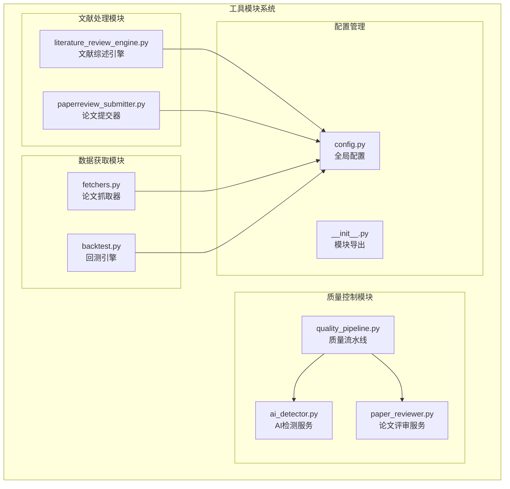

**图表来源**
- [src/tools/quality_pipeline.py:1-807](file://src/tools/quality_pipeline.py#L1-L807)
- [src/tools/fetchers.py:1-899](file://src/tools/fetchers.py#L1-L899)
- [src/tools/backtest.py:1-433](file://src/tools/backtest.py#L1-L433)
- [src/tools/literature_review_engine.py:1-850](file://src/tools/literature_review_engine.py#L1-L850)
- [src/tools/paperreview_submitter.py:1-461](file://src/tools/paperreview_submitter.py#L1-L461)
- [src/services/ai_detector.py:1-358](file://src/services/ai_detector.py#L1-L358)
- [src/services/paper_reviewer.py:1-473](file://src/services/paper_reviewer.py#L1-L473)
- [src/core/config.py:1-563](file://src/core/config.py#L1-L563)
- [src/tools/__init__.py:1-37](file://src/tools/__init__.py#L1-L37)

**章节来源**
- [README.md:420-500](file://README.md#L420-L500)
- [src/tools/__init__.py:1-37](file://src/tools/__init__.py#L1-L37)

## 核心组件

### 质量控制流水线

质量控制流水线是系统的核心模块，集成了AI痕迹检测、论文评审和综合报告生成三大功能：

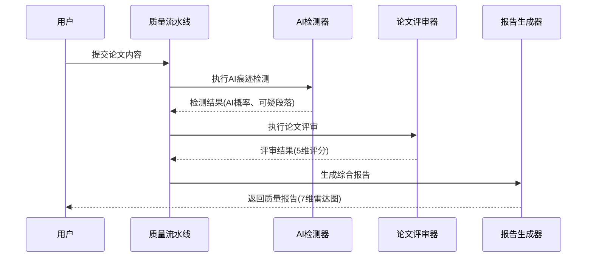

**图表来源**
- [src/tools/quality_pipeline.py:748-807](file://src/tools/quality_pipeline.py#L748-L807)

质量流水线包含三个核心组件：
- **AI痕迹检测器**：基于Fast-DetectGPT算法，支持本地模型和远程API两种检测模式
- **论文评审器**：集成Claude API和DeepSeek API，提供结构化5维评分
- **报告生成器**：生成7维雷达图和综合质量报告

**章节来源**
- [src/tools/quality_pipeline.py:26-81](file://src/tools/quality_pipeline.py#L26-L81)
- [src/tools/quality_pipeline.py:87-435](file://src/tools/quality_pipeline.py#L87-L435)

### 回测引擎

回测引擎基于Backtrader框架，提供完整的量化策略回测功能：

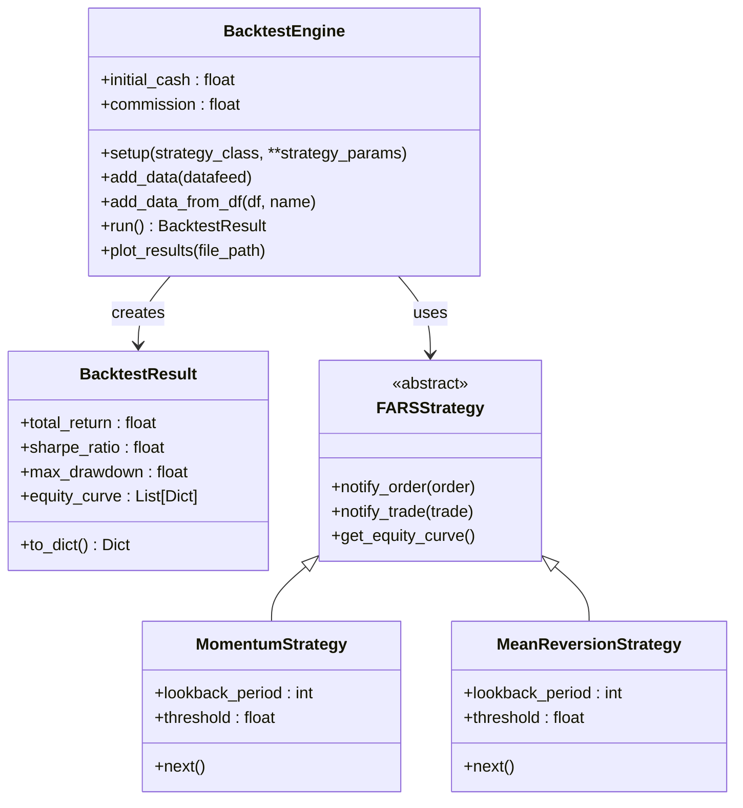

**图表来源**
- [src/tools/backtest.py:23-347](file://src/tools/backtest.py#L23-L347)

**章节来源**
- [src/tools/backtest.py:181-347](file://src/tools/backtest.py#L181-L347)

### 文献综述引擎

文献综述引擎采用STORM风格的多视角调研方法：

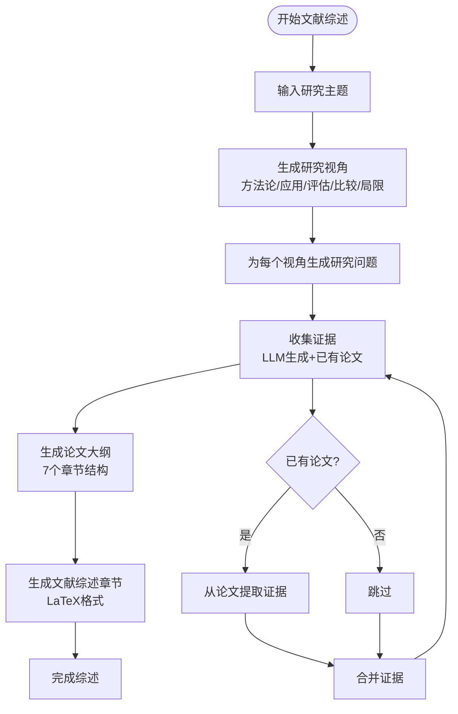

**图表来源**
- [src/tools/literature_review_engine.py:18-631](file://src/tools/literature_review_engine.py#L18-L631)

**章节来源**
- [src/tools/literature_review_engine.py:18-631](file://src/tools/literature_review_engine.py#L18-L631)

### 论文抓取器

论文抓取器支持多数据源集成，提供统一的论文获取接口：

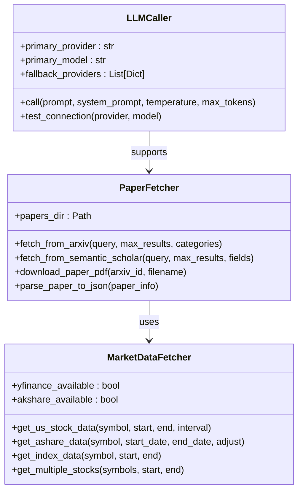

**图表来源**
- [src/tools/fetchers.py:20-899](file://src/tools/fetchers.py#L20-L899)

**章节来源**
- [src/tools/fetchers.py:20-899](file://src/tools/fetchers.py#L20-L899)

## 架构概览

系统采用分层架构设计，各模块间通过标准化接口进行通信：

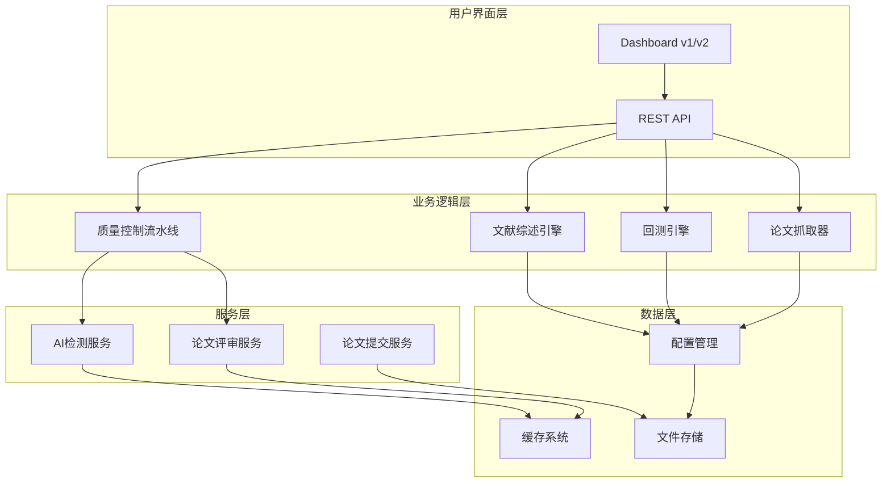

**图表来源**
- [README.md:50-88](file://README.md#L50-L88)
- [src/core/config.py:388-417](file://src/core/config.py#L388-L417)

系统支持多种部署模式：
- **本地部署**：所有模块在单机环境下运行
- **分布式部署**：模块可独立部署，通过API进行通信
- **混合部署**：核心模块本地运行，外部服务通过API调用

## 详细组件分析

### 质量控制流水线详解

#### AI痕迹检测模块

AI痕迹检测模块提供了多层次的检测能力：

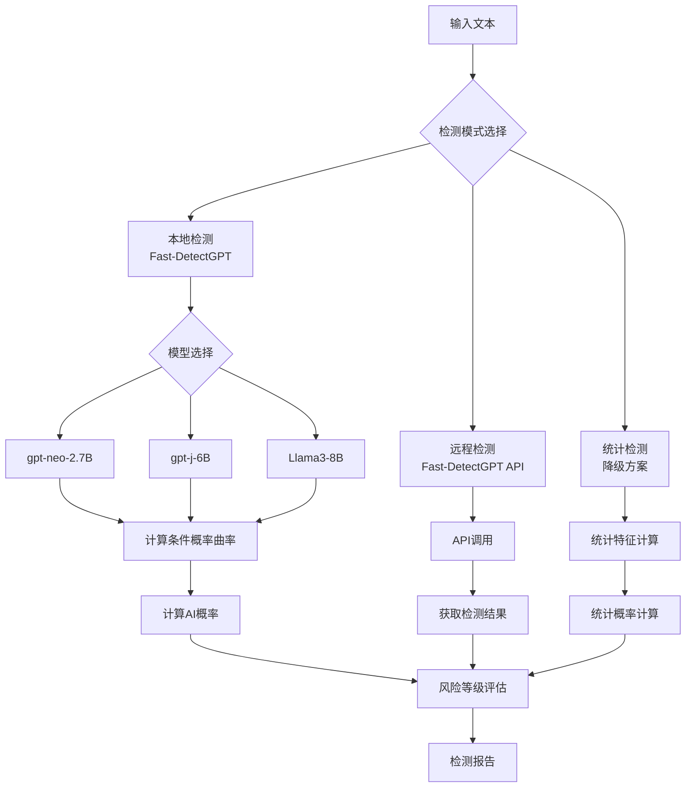

**图表来源**
- [src/tools/quality_pipeline.py:87-435](file://src/tools/quality_pipeline.py#L87-L435)

检测算法特点：
- **条件概率曲率检测**：基于ICLR 2024论文的Fast-DetectGPT算法
- **多模型支持**：支持gpt-neo-2.7B、gpt-j-6B、Llama3-8B三种模型
- **阈值设定**：默认阈值1.9299，AI概率>0.5判定为AI生成
- **风险评估**：提供低、中、高三个风险等级

#### 论文评审模块

论文评审模块提供结构化的5维评分体系：

| 评审维度 | 评分范围 | 说明 |
|---------|---------|------|
| 学术价值 | 1-10分 | 论文的学术贡献和重要性 |
| 清晰度 | 1-10分 | 论文写作的清晰性和结构合理性 |
| 可复现性 | 1-10分 | 实验设置的充分性和方法的可复现性 |
| 原创性 | 1-10分 | 研究的独特贡献和创新程度 |
| 实用性 | 1-10分 | 研究结果对领域的实际应用价值 |

评审流程：
1. **内容截断**：避免超过API限制的长文本
2. **结构化提示**：使用标准化的JSON格式提示词
3. **结果解析**：自动提取和验证评审结果
4. **降级处理**：API不可用时提供模拟评审

**章节来源**
- [src/tools/quality_pipeline.py:441-603](file://src/tools/quality_pipeline.py#L441-L603)

### 回测引擎详解

回测引擎基于Backtrader框架，提供完整的量化策略测试环境：

#### 核心组件

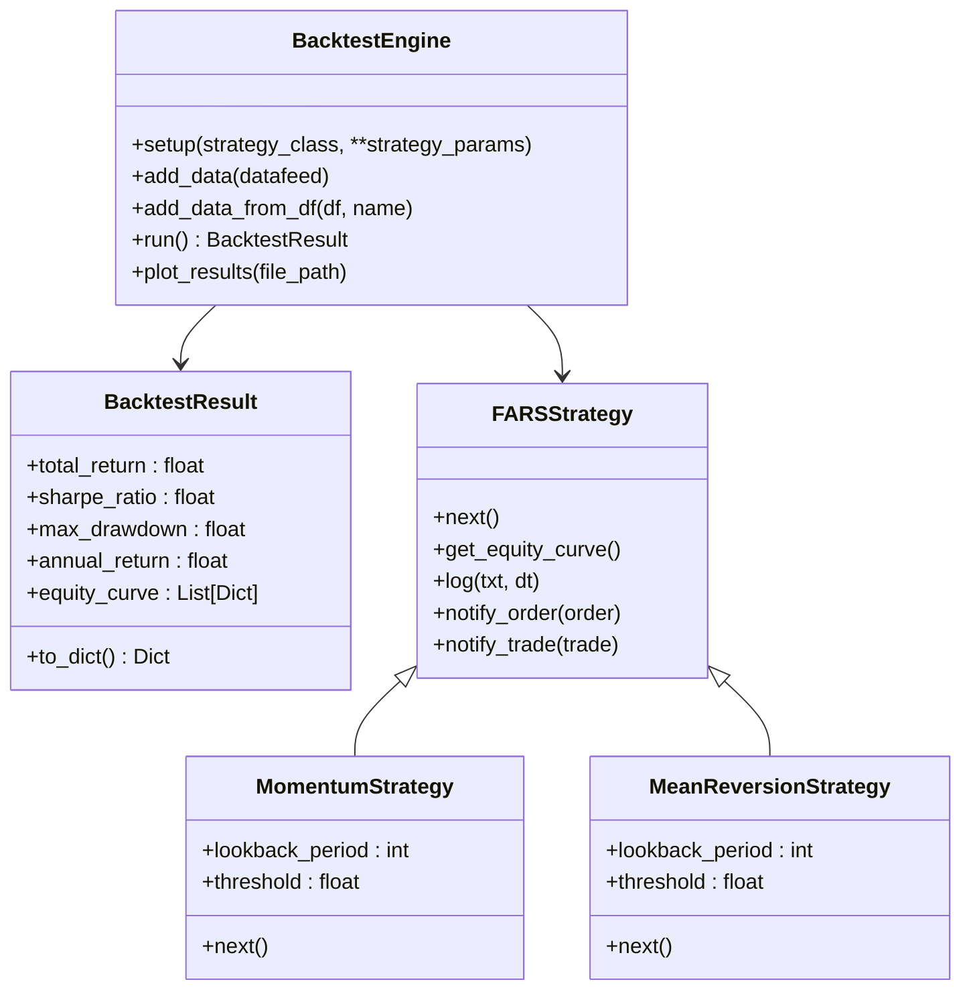

**图表来源**
- [src/tools/backtest.py:55-347](file://src/tools/backtest.py#L55-L347)

#### 指标计算

回测引擎提供丰富的风险调整收益指标：

| 指标名称 | 计算公式 | 用途 |
|---------|---------|------|
| 夏普比率 | (平均收益-无风险利率)/收益标准差 | 风险调整收益衡量 |
| 最大回撤 | 最大连续亏损幅度 | 风险控制指标 |
| 年化收益率 | (1+总收益)^(252/天数)-1 | 收益率衡量 |
| 卡玛比率 | 年化收益率/最大回撤 | 风险调整收益 |
| 索提诺比率 | 平均收益/下行标准差 | 下行风险衡量 |
| 胜率 | 盈利交易数/总交易数 | 交易质量指标 |
| 盈利因子 | 盈利总额/亏损总额 | 盈亏平衡指标 |

**章节来源**
- [src/tools/backtest.py:181-347](file://src/tools/backtest.py#L181-L347)

### 文献综述引擎详解

文献综述引擎采用STORM方法论，提供多视角的深度调研：

#### STORM流程

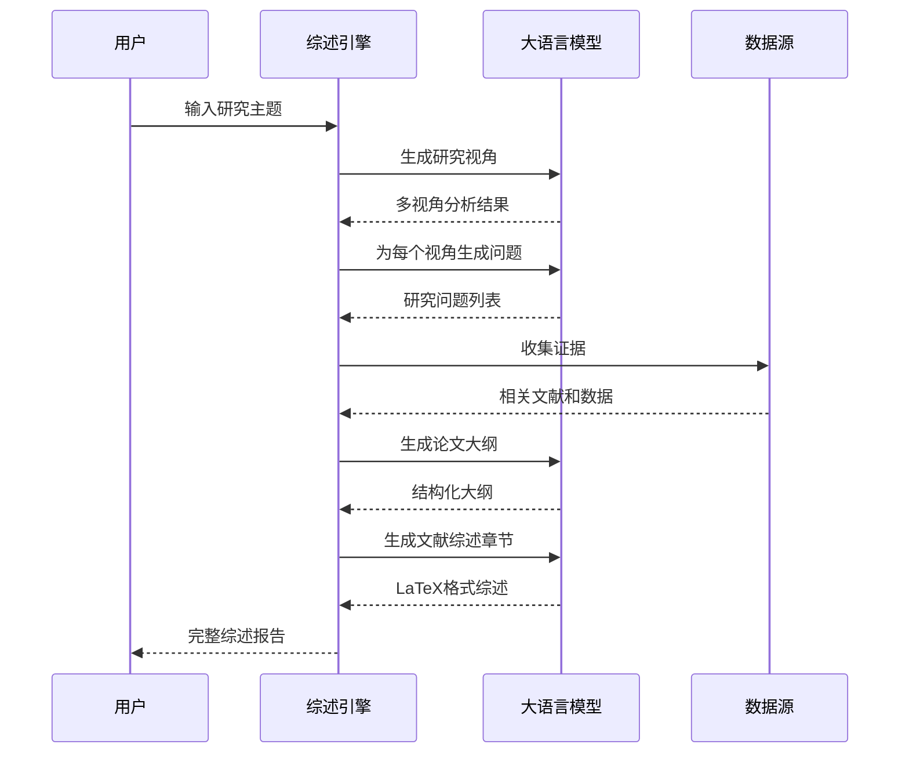

**图表来源**
- [src/tools/literature_review_engine.py:557-631](file://src/tools/literature_review_engine.py#L557-L631)

#### Review-Revision循环

系统还实现了GPT Researcher风格的评审修订循环：

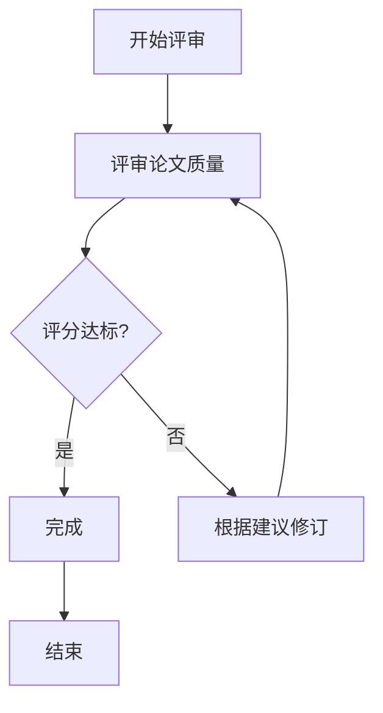

**图表来源**
- [src/tools/literature_review_engine.py:787-800](file://src/tools/literature_review_engine.py#L787-L800)

**章节来源**
- [src/tools/literature_review_engine.py:18-800](file://src/tools/literature_review_engine.py#L18-L800)

### 论文抓取器详解

论文抓取器提供统一的多数据源接口：

#### 支持的数据源

| 数据源 | API类型 | 功能特性 |
|--------|---------|----------|
| arXiv | 官方API | 学术论文全文，支持分类筛选 |
| Semantic Scholar | Graph API | 引用信息，影响因子统计 |
| yfinance | REST API | 美股市场数据，实时行情 |
| akshare | REST API | A股市场数据，中国金融市场 |

#### 数据处理流程

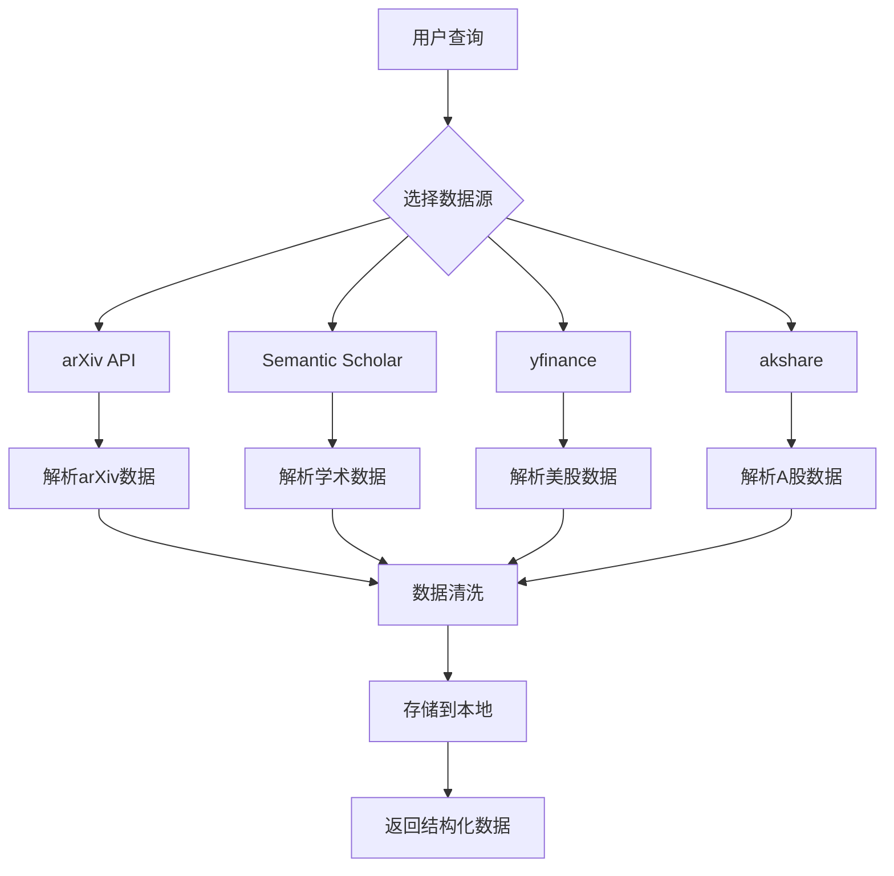

**图表来源**
- [src/tools/fetchers.py:20-899](file://src/tools/fetchers.py#L20-L899)

**章节来源**
- [src/tools/fetchers.py:20-899](file://src/tools/fetchers.py#L20-L899)

## 依赖关系分析

系统依赖关系呈现清晰的层次结构：

```mermaid
graph TB
subgraph "核心依赖"
PyTorch[Torch >= 2.0.0]
Transformers[Transformers >= 4.35.0]
Backtrader[Backtrader >= 1.9.0]
Pandas[Pandas >= 2.0.0]
end
subgraph "API依赖"
OpenAI[OpenAI >= 1.0.0]
Anthropic[Anthropic >= 0.20.0]
Requests[Requests >= 2.31.0]
end
subgraph "数据依赖"
Arxiv[Arixv >= 0.6.2]
YFinance[YFinance >= 0.2.0]
AkShare[AkShare >= 1.12.0]
end
subgraph "可视化依赖"
Matplotlib[Matplotlib >= 3.7.0]
Seaborn[Seaborn >= 0.12.0]
end
subgraph "工具依赖"
Dateutil[Dateutil >= 2.8.0]
TQDM[TQDM >= 4.65.0]
Rich[Rich >= 13.0.0]
end
QualityPipeline --> PyTorch
QualityPipeline --> Transformers
BacktestEngine --> Backtrader
BacktestEngine --> Pandas
LLMCaller --> OpenAI
LLMCaller --> Anthropic
LLMCaller --> Requests
Fetchers --> Arxiv
Fetchers --> YFinance
Fetchers --> AkShare
Plotting --> Matplotlib
Plotting --> Seaborn
Utils --> Dateutil
Utils --> TQDM
Utils --> Rich
```

**图表来源**
- [requirements.txt:1-39](file://requirements.txt#L1-L39)

**章节来源**
- [requirements.txt:1-39](file://requirements.txt#L1-L39)

## 性能考虑

### 内存优化

质量控制流水线在处理大型论文时采用分段处理策略：

- **AI检测分段**：默认500字符分段，避免内存溢出
- **论文评审截断**：Claude API限制50000字符
- **回测数据优化**：使用pandas DataFrame进行高效数据处理

### 并发处理

系统支持多线程和异步处理：

- **并发论文抓取**：同时从多个数据源获取论文
- **并行策略回测**：支持多策略并行回测
- **异步降级处理**：在API超时时自动降级

### 缓存策略

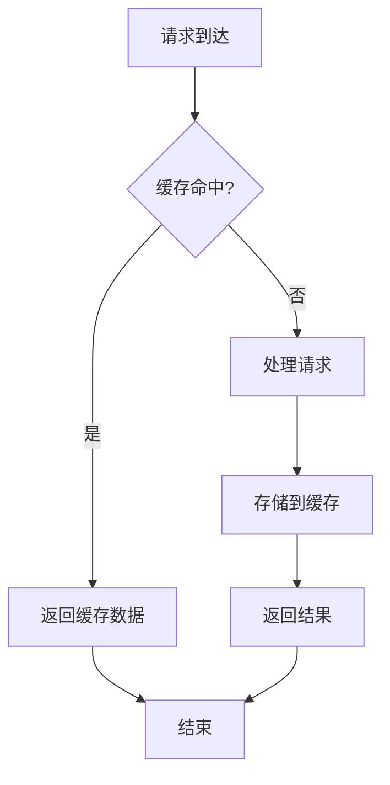

**图表来源**
- [src/tools/quality_pipeline.py:118-144](file://src/tools/quality_pipeline.py#L118-L144)

## 故障排除指南

### 常见问题及解决方案

#### AI检测模块问题

| 问题 | 可能原因 | 解决方案 |
|------|----------|----------|
| Fast-DetectGPT模型加载失败 | 模型文件缺失或损坏 | 运行`setup-fast-detectgpt.sh`重新安装 |
| 检测速度慢 | 模型过大或硬件性能不足 | 降低模型复杂度或升级硬件 |
| 检测准确率低 | 阈值设置不当 | 调整阈值或使用更高精度模型 |

#### 论文评审模块问题

| 问题 | 可能原因 | 解决方案 |
|------|----------|----------|
| API调用失败 | 网络连接问题 | 检查网络连接和API密钥 |
| 评审结果不稳定 | 模型参数随机性 | 固定随机种子或使用确定性模型 |
| 降级模式频繁触发 | API配额限制 | 增加API配额或优化调用频率 |

#### 回测引擎问题

| 问题 | 可能原因 | 解决方案 |
|------|----------|----------|
| 回测数据不完整 | 数据源异常 | 检查数据源可用性和网络连接 |
| 回测速度慢 | 数据量过大 | 优化数据处理或使用数据采样 |
| 图表显示异常 | Matplotlib版本问题 | 更新Matplotlib到最新版本 |

**章节来源**
- [src/tools/quality_pipeline.py:146-165](file://src/tools/quality_pipeline.py#L146-L165)
- [src/tools/backtest.py:181-212](file://src/tools/backtest.py#L181-L212)

## 结论

paperwriterAI的工具模块系统通过模块化设计和标准化接口，为学术论文自动化处理提供了完整的解决方案。系统的主要优势包括：

1. **功能完整性**：涵盖从论文抓取到质量控制的全流程
2. **模块化设计**：各模块独立运行，支持灵活组合
3. **多数据源支持**：统一接口支持多种数据源
4. **性能优化**：内存管理和并发处理确保高效运行
5. **扩展性强**：标准化接口便于新模块集成

系统适用于量化金融、计算机视觉、强化学习等多个研究方向，为研究人员提供了强大的自动化工具支持。

## 附录

### API接口参考

#### 质量控制API

| 端点 | 方法 | 描述 |
|------|------|------|
| `/api/quality/pipeline` | POST | 完整流水线 (Step 4+5+6) |
| `/api/quality/detect-ai` | POST | AI 痕迹检测 (Fast-DetectGPT) |
| `/api/quality/review-paper` | POST | 论文评审 (Claude/DeepSeek) |
| `/api/quality/ai-detection` | POST | AI 检测（兼容旧端点） |

#### 回测API

| 端点 | 方法 | 描述 |
|------|------|------|
| `/api/backtest/run` | POST | 运行回测策略 |
| `/api/backtest/strategies` | GET | 获取策略列表 |
| `/api/backtest/results` | GET | 获取回测结果 |

#### 文献综述API

| 端点 | 方法 | 描述 |
|------|------|------|
| `/api/literature/generate` | POST | 生成文献综述 |
| `/api/literature/review-revise` | POST | Review-Revision循环 |
| `/api/literature/sections` | GET | 获取综述章节 |

### 配置参数说明

#### LLM配置

| 参数 | 类型 | 默认值 | 说明 |
|------|------|--------|------|
| provider | string | minimax | LLM提供商 |
| model | string | MiniMax-M2.7-highspeed | 模型名称 |
| temperature | float | 0.7 | 生成温度 |
| max_tokens | int | 4096 | 最大token数 |
| api_key | string | None | API密钥 |

#### 回测配置

| 参数 | 类型 | 默认值 | 说明 |
|------|------|--------|------|
| framework | string | backtrader | 回测框架 |
| default_frequency | string | 1d | 默认频率 |
| benchmark | string | 000300.SS | 基准指数 |

**章节来源**
- [src/core/config.py:388-417](file://src/core/config.py#L388-L417)
- [README.md:650-658](file://README.md#L650-L658)