# 文献综述引擎

<cite>
**本文档引用的文件**
- [literature_review_engine.py](file://src/tools/literature_review_engine.py)
- [research_runner.py](file://src/core/research_runner.py)
- [paper_extractor.py](file://src/core/paper_extractor.py)
- [fetchers.py](file://src/tools/fetchers.py)
- [config.py](file://src/core/config.py)
- [quality_pipeline.py](file://src/tools/quality_pipeline.py)
- [paper_reviewer.py](file://src/services/paper_reviewer.py)
- [data_registry.py](file://src/core/data_registry.py)
- [README.md](file://README.md)
- [FARS_ARCHITECTURE.md](file://docs/FARS_ARCHITECTURE.md)
- [FARS_LITERATURE_REVIEW_PLAN.md](file://docs/FARS_LITERATURE_REVIEW_PLAN.md)
- [requirements.txt](file://requirements.txt)
</cite>

## 目录
1. [简介](#简介)
2. [项目结构](#项目结构)
3. [核心组件](#核心组件)
4. [架构概览](#架构概览)
5. [详细组件分析](#详细组件分析)
6. [依赖分析](#依赖分析)
7. [性能考虑](#性能考虑)
8. [故障排除指南](#故障排除指南)
9. [结论](#结论)
10. [附录](#附录)

## 简介

paperwriterAI的文献综述引擎是一个基于STORM风格的自动化文献综述系统，集成了多视角生成、深度问题提问、证据收集和结构化输出等功能。该引擎采用GPT Researcher风格的Review-Revision循环，实现了从种子论文到完整学术论文的端到端自动化流程。

系统的核心特色包括：
- **多源数据整合**：支持arXiv、Semantic Scholar等多个学术数据源
- **多视角分析**：从方法论、应用、评估、比较、局限性五个维度分析主题
- **深度问题生成**：为每个视角生成5-8个深度研究问题
- **证据收集与整合**：并行收集证据，支持已有论文的综合分析
- **结构化输出**：生成LaTeX格式的文献综述章节
- **质量控制循环**：集成Review-Revision循环进行持续优化

## 项目结构

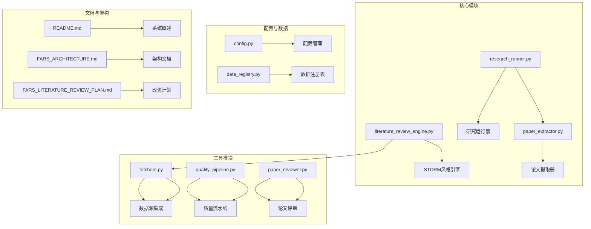

**图表来源**
- [literature_review_engine.py:1-850](file://src/tools/literature_review_engine.py#L1-L850)
- [research_runner.py:1-1130](file://src/core/research_runner.py#L1-L1130)
- [fetchers.py:1-899](file://src/tools/fetchers.py#L1-L899)

**章节来源**
- [README.md:1-732](file://README.md#L1-L732)
- [FARS_ARCHITECTURE.md:1-257](file://docs/FARS_ARCHITECTURE.md#L1-L257)

## 核心组件

### 文献综述引擎 (LiteratureReviewEngine)

LiteratureReviewEngine是系统的核心组件，实现了STORM风格的文献综述生成流程：

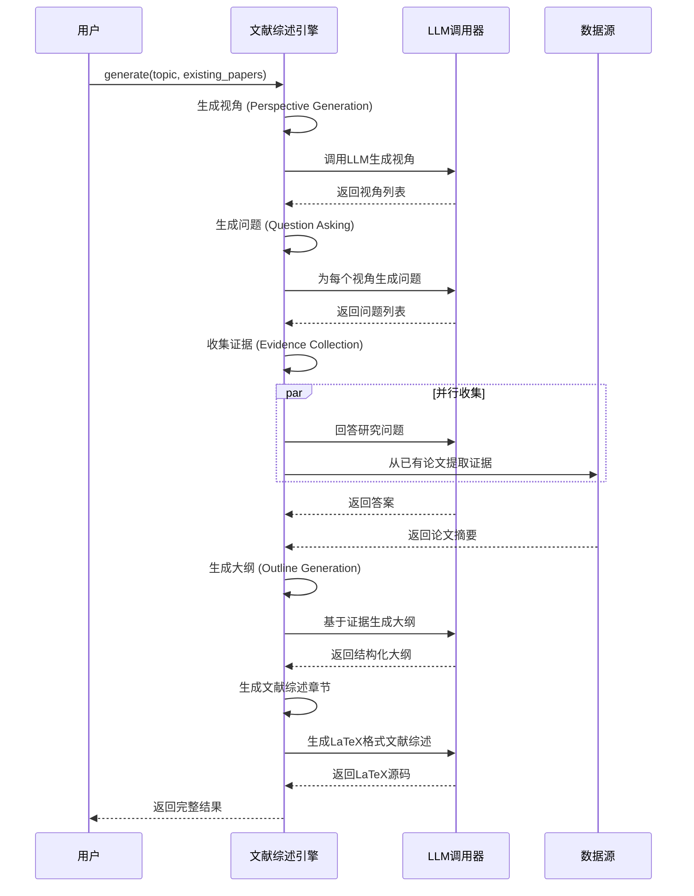

**图表来源**
- [literature_review_engine.py:557-631](file://src/tools/literature_review_engine.py#L557-L631)

### 研究运行器 (ResearchRunner)

ResearchRunner负责协调整个研究流程，实现了断点续传和优雅降级机制：

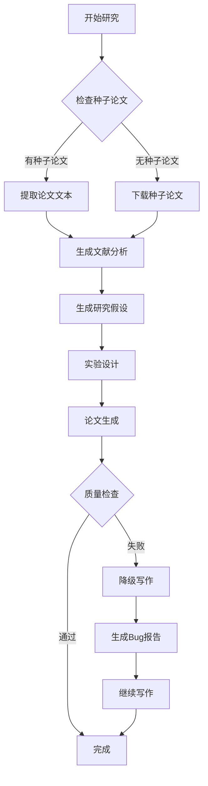

**图表来源**
- [research_runner.py:642-807](file://src/core/research_runner.py#L642-L807)

### 数据提取器 (PaperExtractor)

PaperExtractor负责从PDF文件中提取文本内容，支持批量处理和去重：

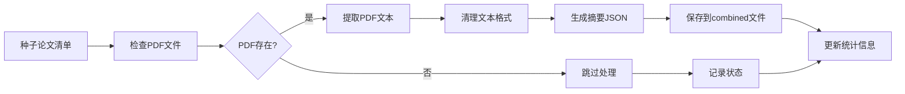

**图表来源**
- [paper_extractor.py:149-223](file://src/core/paper_extractor.py#L149-L223)

**章节来源**
- [literature_review_engine.py:18-850](file://src/tools/literature_review_engine.py#L18-L850)
- [research_runner.py:278-1130](file://src/core/research_runner.py#L278-L1130)
- [paper_extractor.py:149-398](file://src/core/paper_extractor.py#L149-L398)

## 架构概览

系统采用模块化架构，各个组件职责明确：

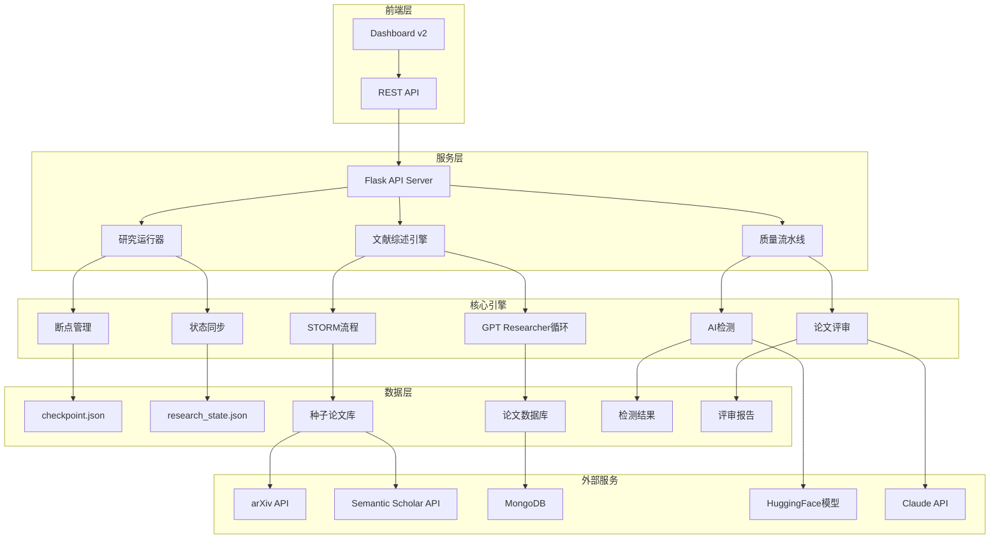

**图表来源**
- [FARS_ARCHITECTURE.md:23-57](file://docs/FARS_ARCHITECTURE.md#L23-L57)
- [README.md:50-122](file://README.md#L50-L122)

## 详细组件分析

### STORM风格文献综述流程

系统实现了STORM论文写作系统的完整流程，包括预写作阶段和写作阶段：

#### 预写作阶段 (Phase 1)

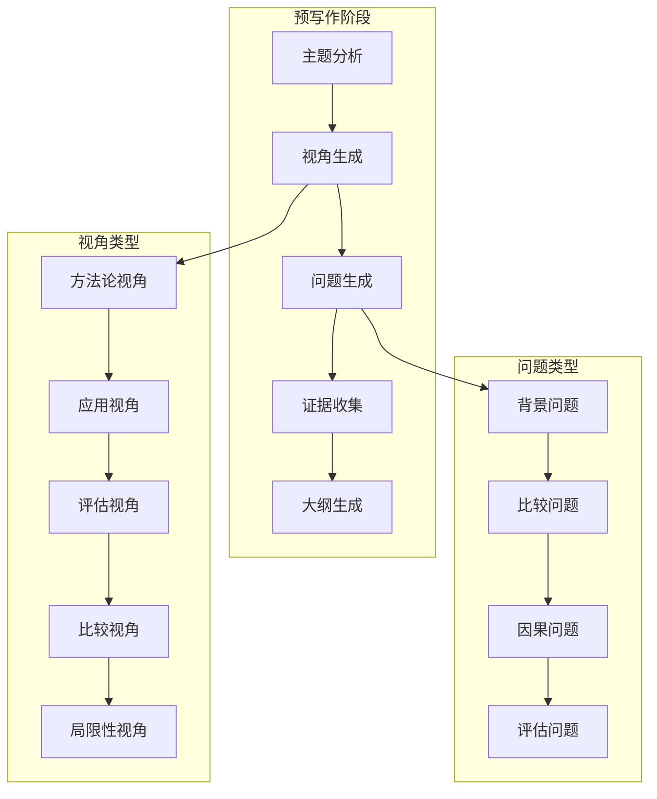

**图表来源**
- [FARS_LITERATURE_REVIEW_PLAN.md:25-44](file://docs/FARS_LITERATURE_REVIEW_PLAN.md#L25-L44)

#### 写作阶段 (Phase 2)

写作阶段采用分块生成策略，将论文分解为8个独立章节：

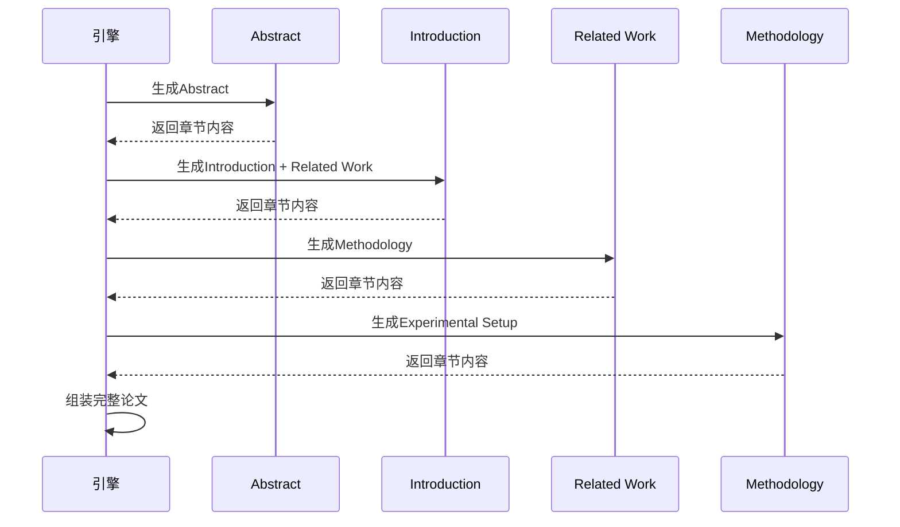

**图表来源**
- [FARS_ARCHITECTURE.md:89-106](file://docs/FARS_ARCHITECTURE.md#L89-L106)

### 数据源集成

系统支持多个学术数据源的集成：

#### arXiv集成

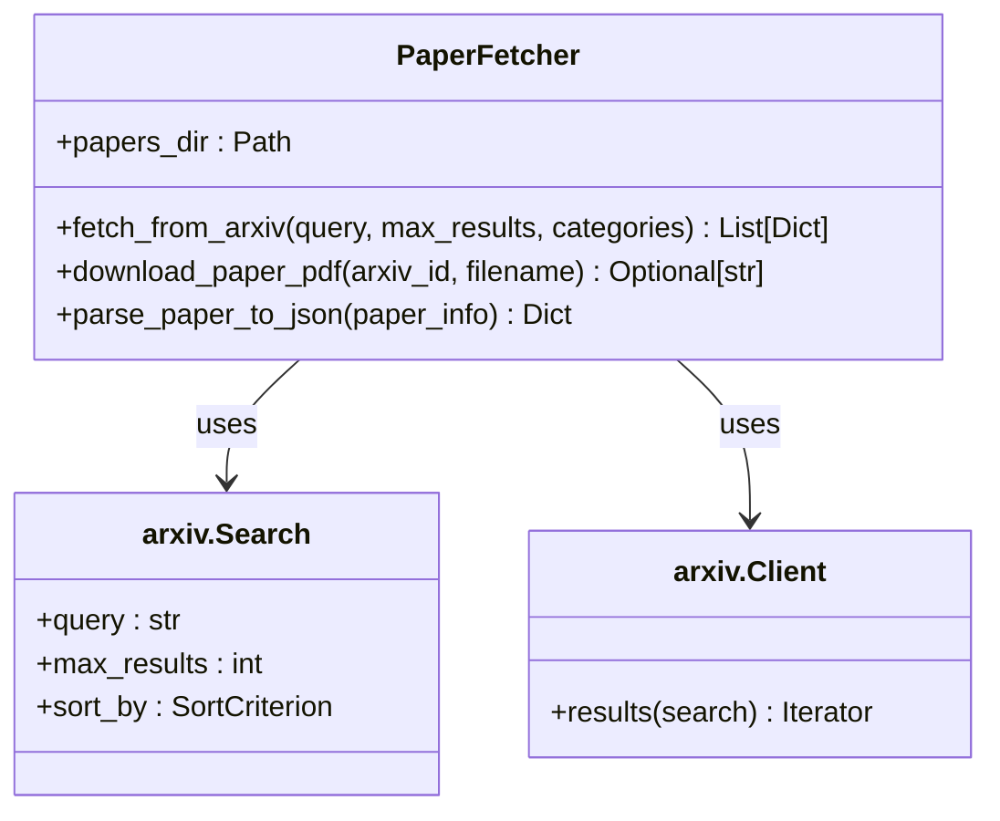

**图表来源**
- [fetchers.py:20-139](file://src/tools/fetchers.py#L20-L139)

#### Semantic Scholar集成

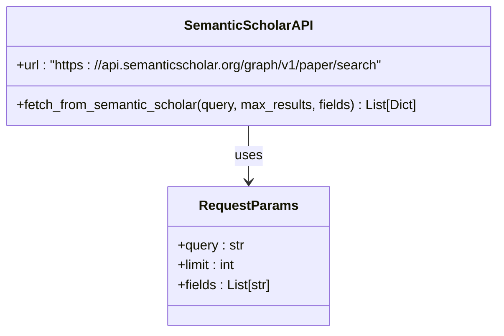

**图表来源**
- [fetchers.py:76-120](file://src/tools/fetchers.py#L76-L120)

### 质量控制流水线

系统集成了完整的论文质量控制流水线：

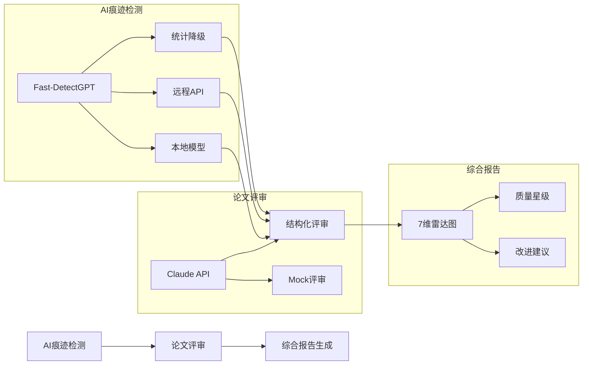

**图表来源**
- [quality_pipeline.py:87-807](file://src/tools/quality_pipeline.py#L87-L807)

**章节来源**
- [literature_review_engine.py:128-554](file://src/tools/literature_review_engine.py#L128-L554)
- [fetchers.py:20-163](file://src/tools/fetchers.py#L20-L163)
- [quality_pipeline.py:87-807](file://src/tools/quality_pipeline.py#L87-L807)

## 依赖分析

### 外部依赖

系统依赖多个第三方库和服务：

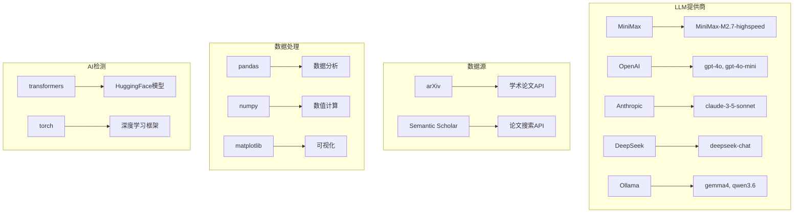

**图表来源**
- [requirements.txt:1-39](file://requirements.txt#L1-L39)
- [config.py:215-251](file://src/core/config.py#L215-L251)

### 内部组件依赖

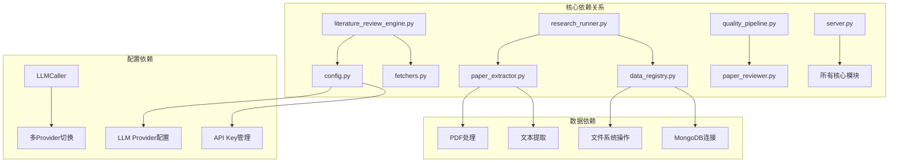

**图表来源**
- [config.py:462-514](file://src/core/config.py#L462-L514)
- [data_registry.py:48-97](file://src/core/data_registry.py#L48-L97)

**章节来源**
- [requirements.txt:1-39](file://requirements.txt#L1-L39)
- [config.py:204-251](file://src/core/config.py#L204-L251)

## 性能考虑

### Token限制解决方案

系统针对不同LLM提供商的Token限制进行了专门优化：

| Provider | Context Window | 输出限制 | 解决方案 |
|----------|----------------|----------|----------|
| MiniMax | 196,608 tokens | 131,072 tokens | 分块生成，8个独立章节 |
| OpenAI GPT-4o | 128,000 tokens | 4,096 tokens | 分块生成，上下文控制 |
| Anthropic Claude | 200,000 tokens | 4,096 tokens | 分块生成，摘要传递 |
| DeepSeek | 128,000 tokens | 4,096 tokens | 分块生成，上下文优化 |

### 并行处理优化

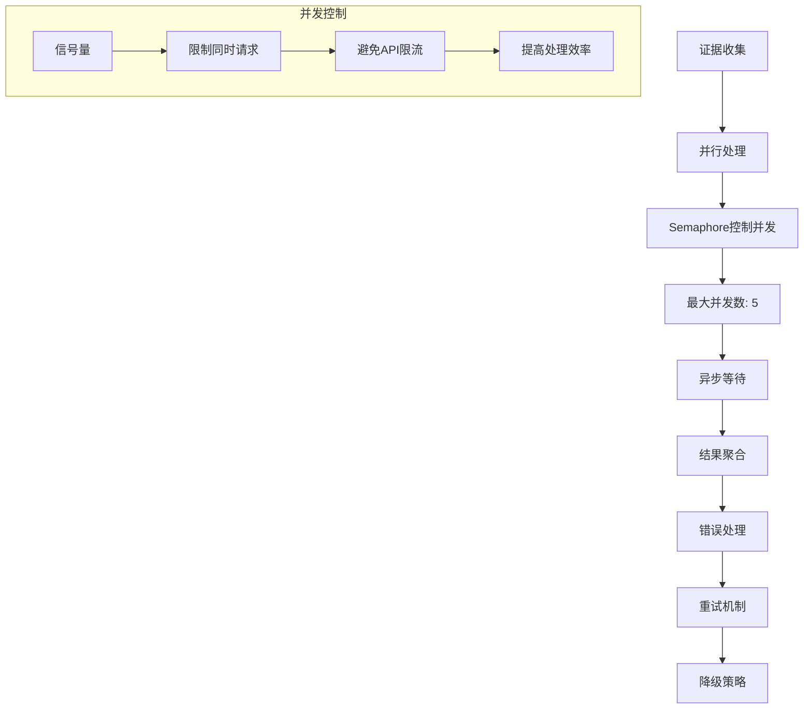

**图表来源**
- [FARS_LITERATURE_REVIEW_PLAN.md:238-249](file://docs/FARS_LITERATURE_REVIEW_PLAN.md#L238-L249)

### 缓存和去重机制

系统实现了多层次的缓存和去重机制：

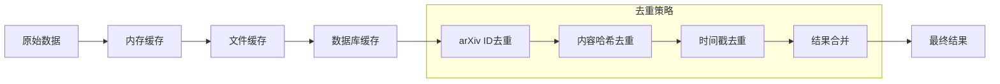

## 故障排除指南

### 常见问题及解决方案

#### LLM API调用失败

**问题症状**：LLM调用返回None或抛出异常

**解决方案**：
1. 检查API Key配置
2. 验证网络连接
3. 查看备用Provider配置
4. 检查请求频率限制

#### Token限制错误

**问题症状**：生成过程中出现Token超限错误

**解决方案**：
1. 启用分块生成模式
2. 调整上下文窗口大小
3. 优化提示词长度
4. 使用摘要传递机制

#### PDF提取失败

**问题症状**：PDF文件无法正确提取文本

**解决方案**：
1. 检查PDF文件完整性
2. 验证PDF密码保护
3. 尝试不同的提取参数
4. 检查pdfplumber安装状态

#### 数据源访问问题

**问题症状**：无法从arXiv或Semantic Scholar获取数据

**解决方案**：
1. 检查网络连接
2. 验证API访问权限
3. 查看API限流状态
4. 使用备用数据源

**章节来源**
- [literature_review_engine.py:65-95](file://src/tools/literature_review_engine.py#L65-L95)
- [paper_extractor.py:53-79](file://src/core/paper_extractor.py#L53-L79)
- [quality_pipeline.py:438-551](file://src/tools/quality_pipeline.py#L438-L551)

## 结论

paperwriterAI的文献综述引擎成功实现了STORM风格的自动化文献综述系统，具备以下核心优势：

1. **完整的STORM流程**：实现了从多视角分析到结构化输出的完整工作流
2. **多数据源集成**：支持arXiv、Semantic Scholar等多个学术数据源
3. **质量控制机制**：集成AI痕迹检测和论文评审的双重质量保障
4. **优雅降级策略**：在网络不稳定或API限流时能够继续工作
5. **模块化架构**：清晰的组件划分便于维护和扩展

该系统为量化金融和相关领域的研究提供了强大的自动化工具，能够显著提高文献综述的效率和质量。

## 附录

### 配置选项

系统支持丰富的配置选项：

| 配置项 | 默认值 | 说明 |
|--------|--------|------|
| LLM Provider | minimax | LLM提供商选择 |
| Model | MiniMax-M2.7-highspeed | 模型名称 |
| Temperature | 0.7 | 生成温度参数 |
| Max Tokens | 4096 | 最大输出tokens |
| API Key | None | LLM API密钥 |
| Base URL | None | 自定义API地址 |

### 扩展方法

系统提供了多种扩展途径：

1. **新的数据源集成**：通过PaperFetcher类扩展新的学术数据源
2. **自定义LLM提供商**：通过LLMCaller类支持新的LLM提供商
3. **质量检测算法**：通过QualityPipeline类集成新的质量检测方法
4. **论文格式模板**：通过LaTeX模板系统支持新的论文格式

### 使用示例

```python
# 基本使用
engine = LiteratureReviewEngine()
result = engine.generate("量化交易中的机器学习应用")

# 自定义配置
engine = LiteratureReviewEngine(
    provider="openai",
    model="gpt-4o",
    api_key="your-api-key"
)
result = engine.generate("主题", num_perspectives=8)
```