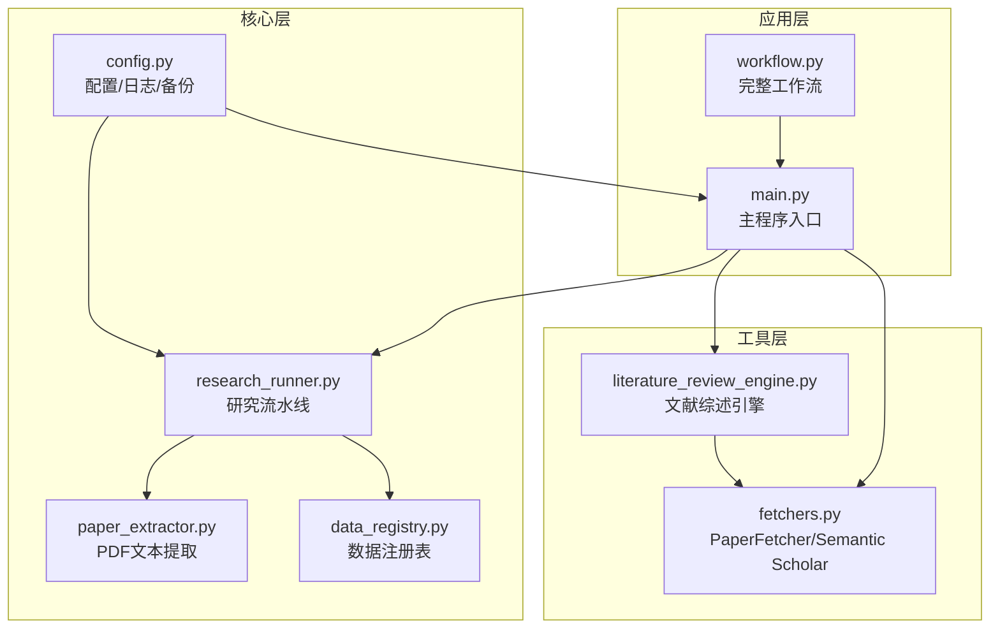
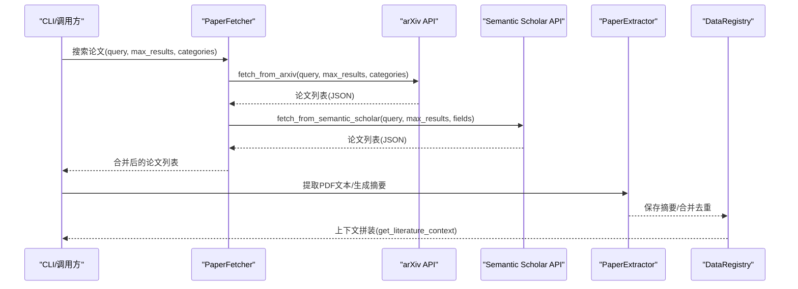
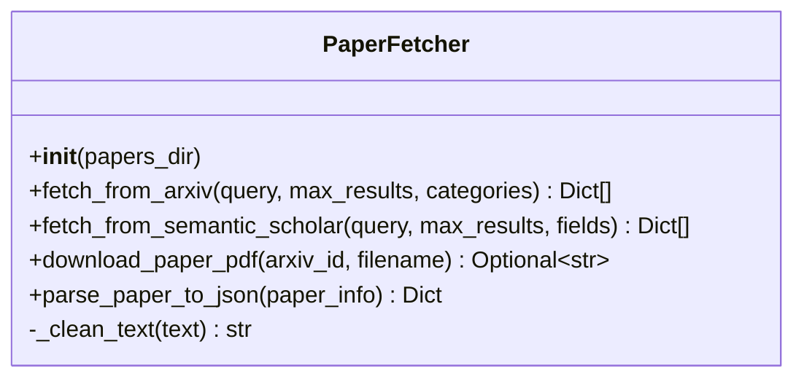
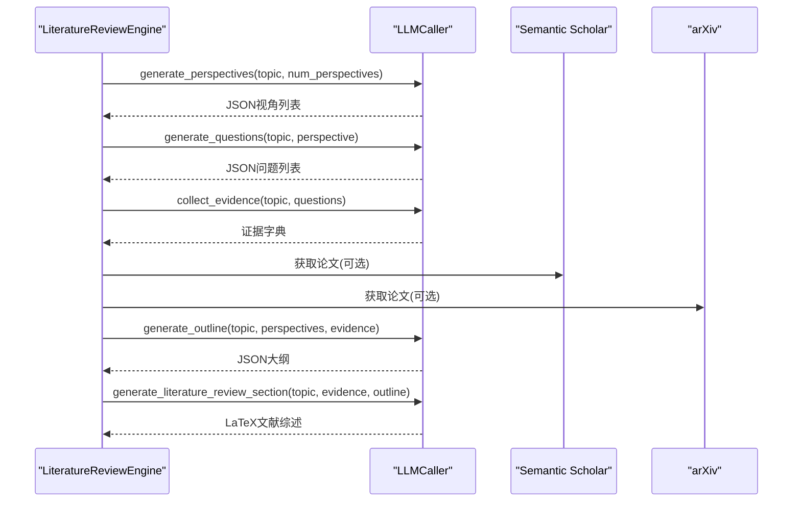
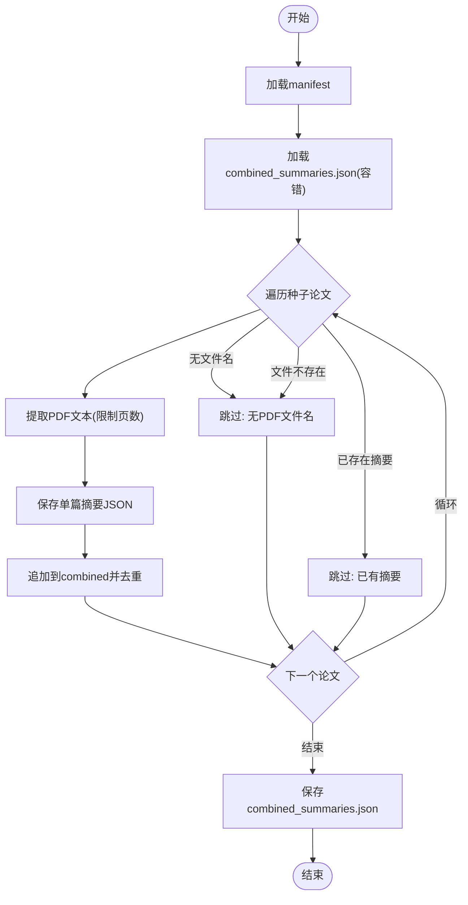
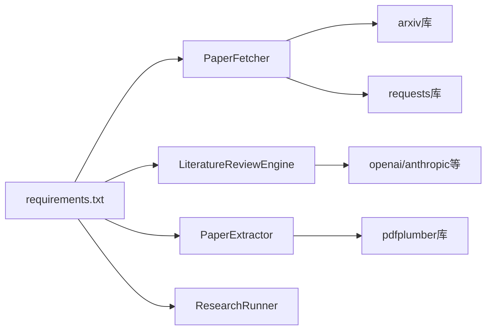

# 论文抓取器

<cite>
**本文档引用的文件**
- [fetchers.py](file://src/tools/fetchers.py)
- [literature_review_engine.py](file://src/tools/literature_review_engine.py)
- [paper_extractor.py](file://src/core/paper_extractor.py)
- [research_runner.py](file://src/core/research_runner.py)
- [data_registry.py](file://src/core/data_registry.py)
- [config.py](file://src/core/config.py)
- [main.py](file://src/main.py)
- [workflow.py](file://src/workflow.py)
- [requirements.txt](file://requirements.txt)
</cite>

## 目录
1. [简介](#简介)
2. [项目结构](#项目结构)
3. [核心组件](#核心组件)
4. [架构总览](#架构总览)
5. [详细组件分析](#详细组件分析)
6. [依赖关系分析](#依赖关系分析)
7. [性能考虑](#性能考虑)
8. [故障排除指南](#故障排除指南)
9. [结论](#结论)
10. [附录](#附录)

## 简介
本文件面向paperwriterAI的论文抓取器，系统性阐述多数据源论文抓取的实现机制，涵盖arXiv、Semantic Scholar等平台的数据获取策略，数据抓取流程、API调用方式、数据格式转换、错误处理机制，以及论文元数据提取、全文下载、数据清洗等关键步骤。同时提供配置参数说明、使用示例、性能优化技巧和故障排除指南，并包含数据源限制、速率控制和反爬虫应对策略。

## 项目结构
该项目采用模块化分层设计：
- 工具层：论文抓取、市场数据获取、LLM调用封装
- 核心层：论文文本提取、研究流水线、数据注册表
- 应用层：主程序入口、工作流编排、CLI交互
- 配置层：全局配置、日志、备份管理

图表来源
- [main.py:1-521](file://src/main.py#L1-L521)
- [workflow.py:1-286](file://src/workflow.py#L1-L286)
- [fetchers.py:1-899](file://src/tools/fetchers.py#L1-L899)
- [literature_review_engine.py:1-850](file://src/tools/literature_review_engine.py#L1-L850)
- [paper_extractor.py:1-398](file://src/core/paper_extractor.py#L1-L398)
- [research_runner.py:1-1130](file://src/core/research_runner.py#L1-L1130)
- [data_registry.py:1-189](file://src/core/data_registry.py#L1-L189)
- [config.py:1-563](file://src/core/config.py#L1-L563)

章节来源
- [main.py:1-521](file://src/main.py#L1-L521)
- [workflow.py:1-286](file://src/workflow.py#L1-L286)

## 核心组件
- 论文抓取器（PaperFetcher）：支持arXiv和Semantic Scholar，提供论文检索、PDF下载、元数据解析与清洗
- 文献综述引擎（LiteratureReviewEngine）：基于LLM的视角生成、问题生成、证据收集、大纲生成与文献综述章节生成
- 论文文本提取器（PaperExtractor）：从PDF中提取文本、生成摘要、合并去重、生成分析报告
- 研究流水线（ResearchRunner）：驱动文献分析、假设生成、实验与论文写作的完整流程
- 数据注册表（DataRegistry）：统一管理数据路径、MongoDB配置、工作流状态与上下文拼装
- 配置系统（Config）：LLM提供商配置、日志、备份、数据库schema定义
- 工作流（Workflow）：论文生成后的编译、AI检测绕过、投稿流程编排

章节来源
- [fetchers.py:20-163](file://src/tools/fetchers.py#L20-L163)
- [literature_review_engine.py:18-631](file://src/tools/literature_review_engine.py#L18-L631)
- [paper_extractor.py:53-320](file://src/core/paper_extractor.py#L53-L320)
- [research_runner.py:69-162](file://src/core/research_runner.py#L69-L162)
- [data_registry.py:48-189](file://src/core/data_registry.py#L48-L189)
- [config.py:204-251](file://src/core/config.py#L204-L251)
- [workflow.py:19-286](file://src/workflow.py#L19-L286)

## 架构总览
论文抓取器的整体架构由“数据源层”、“抓取与解析层”、“数据处理层”、“应用层”构成。数据源层负责arXiv与Semantic Scholar的API访问；抓取与解析层负责请求发送、响应解析、元数据标准化与文本清洗；数据处理层负责PDF文本提取、摘要生成与上下文拼装；应用层负责工作流编排与CLI交互。

图表来源
- [fetchers.py:27-120](file://src/tools/fetchers.py#L27-L120)
- [paper_extractor.py:149-223](file://src/core/paper_extractor.py#L149-L223)
- [data_registry.py:100-166](file://src/core/data_registry.py#L100-L166)

## 详细组件分析

### 论文抓取器（PaperFetcher）
- 功能职责
  - arXiv检索：支持关键词、最大结果数、分类过滤，返回标准化论文列表
  - Semantic Scholar检索：支持关键词、最大结果数、字段选择，返回标准化论文列表
  - PDF下载：按arXiv ID下载PDF至本地目录
  - 元数据解析与清洗：将不同来源的元数据统一为内部结构化JSON
- 关键实现要点
  - arXiv客户端：使用arxiv库的Search与Client，按SubmittedDate排序
  - Semantic Scholar：GET请求，限制limit≤100，字段白名单
  - PDF下载：使用arxiv.Search(id_list=[arxiv_id])定位论文并下载
  - 文本清洗：正则去多余空白、换行替换为空格
- 错误处理
  - 捕获异常并打印错误信息，返回空结果或None，避免中断流程

图表来源
- [fetchers.py:20-163](file://src/tools/fetchers.py#L20-L163)

章节来源
- [fetchers.py:27-120](file://src/tools/fetchers.py#L27-L120)
- [fetchers.py:122-163](file://src/tools/fetchers.py#L122-L163)

### 文献综述引擎（LiteratureReviewEngine）
- 功能职责
  - 视角生成：从主题出发生成多个研究视角及核心问题
  - 问题生成：为每个视角生成深度研究问题
  - 证据收集：基于问题生成答案与证据，或从已有论文中综合
  - 大纲生成：生成论文结构化大纲
  - 文献综述章节：生成LaTeX格式的文献综述章节
  - Review-Revision循环：评审与修订论文草稿
- 关键实现要点
  - LLM调用：通过LLMCaller自动切换主备Provider
  - JSON解析：支持从LLM响应中提取JSON块或直接JSON
  - 默认回退：当LLM不可用时返回降级响应
- 错误处理
  - LLM调用失败时记录失败日志并返回降级结果

图表来源
- [literature_review_engine.py:18-631](file://src/tools/literature_review_engine.py#L18-L631)

章节来源
- [literature_review_engine.py:18-631](file://src/tools/literature_review_engine.py#L18-L631)

### 论文文本提取器（PaperExtractor）
- 功能职责
  - PDF文本提取：逐页提取文本，限制最大页数，返回结构化结果
  - 单篇摘要生成：汇总页数、字符数、首段预览、文本预览
  - 全部提取：遍历manifest中的种子论文，去重保存摘要
  - 状态查询：返回PDF存在、摘要存在、缺失PDF等状态
  - 文本获取：按arXiv ID获取已提取文本片段
  - 分析报告重建：基于摘要数据重建Markdown分析报告
- 关键实现要点
  - 去重策略：基于arxiv_id去重，优先写入seed_papers目录，失败则写入research目录
  - 容错机制：文件不存在、IO异常、JSON解析异常均返回安全结果
  - 修复旧记录：从文件名补全arxiv_id字段
- 性能与可靠性
  - 限制每篇PDF最多读取前N页，平衡信息量与速度
  - 提取完成后统一保存combined_summaries.json，减少重复IO

图表来源
- [paper_extractor.py:149-223](file://src/core/paper_extractor.py#L149-L223)

章节来源
- [paper_extractor.py:53-320](file://src/core/paper_extractor.py#L53-L320)

### 研究流水线（ResearchRunner）
- 功能职责
  - 文献综述构建：提取PDF、生成分析、主题检测、研究问题与创新点生成
  - 假设生成：基于文献空白与主题生成可验证假设
  - 实验设计：构建实验阶段与流程映射
  - 状态管理：多线程运行、活动状态同步、阶段记录
- 关键实现要点
  - 主题检测：基于关键词模式匹配，支持去重与回退
  - 时间统计：记录读取与分析耗时，计算平均耗时
  - 阶段记录：记录phase_history与run_metrics，便于追踪

章节来源
- [research_runner.py:69-162](file://src/core/research_runner.py#L69-L162)
- [research_runner.py:195-236](file://src/core/research_runner.py#L195-L236)
- [research_runner.py:239-275](file://src/core/research_runner.py#L239-L275)

### 数据注册表（DataRegistry）
- 功能职责
  - 统一路径管理：data、research、seed_papers、manifest等路径
  - MongoDB配置：提供连接参数与集合名称
  - 文献上下文拼装：从工作流与摘要中拼装提示词上下文
  - 市场数据提示：提供MongoDB市场数据位置提示
- 关键实现要点
  - 容错加载：JSON解析失败或文件不存在时返回空或默认值
  - 上下文裁剪：限制最大字符数，避免超出LLM上下文窗口

章节来源
- [data_registry.py:48-189](file://src/core/data_registry.py#L48-L189)

### 配置系统（Config）
- 功能职责
  - LLM提供商配置：支持Minimax、OpenAI、Anthropic、DeepSeek、Ollama
  - 日志系统：控制台与文件双通道，自动创建日志文件
  - 备份管理：文件与配置备份、列表、恢复
  - 数据Schema：定义papers、alpha_factors、experiments等数据结构
- 关键实现要点
  - 环境变量注入：根据Provider自动注入API Key
  - 工作空间：项目级目录结构、工件保存、上传、日志步进

章节来源
- [config.py:204-251](file://src/core/config.py#L204-L251)
- [config.py:62-95](file://src/core/config.py#L62-L95)
- [config.py:98-187](file://src/core/config.py#L98-L187)
- [config.py:516-563](file://src/core/config.py#L516-L563)

### 工作流（Workflow）
- 功能职责
  - LaTeX检查：验证paper.tex是否存在与内容
  - PDF编译：生成编译信息，指导使用Overleaf或本地TeX环境
  - AI检测绕过：生成JustDone等工具的使用指南
  - 投稿流程：生成paperreview.ai与ICML邮箱投稿的步骤与模板
- 关键实现要点
  - 手动步骤：编译与AI检测绕过需人工操作
  - 元数据提取：从LaTeX中提取标题等元数据

章节来源
- [workflow.py:38-96](file://src/workflow.py#L38-L96)
- [workflow.py:98-134](file://src/workflow.py#L98-L134)
- [workflow.py:136-214](file://src/workflow.py#L136-L214)

## 依赖关系分析
- 外部依赖
  - arxiv：用于arXiv论文检索与PDF下载
  - requests：用于Semantic Scholar API调用
  - pdfplumber：用于PDF文本提取
  - openai/anthropic等：用于LLM调用
- 内部依赖
  - fetchers依赖arxiv、requests
  - literature_review_engine依赖fetchers中的LLMCaller
  - paper_extractor依赖pdfplumber与data_registry
  - research_runner依赖paper_extractor、data_registry
  - main与workflow依赖config与data_registry

图表来源
- [requirements.txt:1-39](file://requirements.txt#L1-L39)
- [fetchers.py:1-18](file://src/tools/fetchers.py#L1-L18)
- [paper_extractor.py:15-17](file://src/core/paper_extractor.py#L15-L17)
- [literature_review_engine.py:12-16](file://src/tools/literature_review_engine.py#L12-L16)

章节来源
- [requirements.txt:1-39](file://requirements.txt#L1-L39)

## 性能考虑
- PDF提取性能
  - 限制每篇PDF最多读取前N页（默认20页），平衡信息量与速度
  - 提取完成后统一保存combined_summaries.json，避免重复IO
- LLM调用性能
  - 支持主备Provider自动切换，提升可用性
  - 对LLM响应进行JSON解析与降级处理，避免失败导致流程中断
- 网络请求
  - Semantic Scholar限制limit≤100，避免超限
  - arXiv与Semantic Scholar均设置超时，捕获异常并记录
- 并发与状态
  - 研究流水线采用多线程与锁，避免并发冲突
  - 阶段记录与运行指标统一管理，便于监控

[本节为通用性能建议，无需特定文件引用]

## 故障排除指南
- arXiv API错误
  - 现象：检索或下载失败
  - 处理：检查网络连通性、API可用性；查看异常日志
  - 参考：[fetchers.py:71-74](file://src/tools/fetchers.py#L71-L74)
- Semantic Scholar API错误
  - 现象：返回空结果或异常
  - 处理：检查查询参数、字段列表、limit限制；查看异常日志
  - 参考：[fetchers.py:117-120](file://src/tools/fetchers.py#L117-L120)
- PDF提取失败
  - 现象：文件不存在、IO异常、解析异常
  - 处理：确认PDF路径正确；检查磁盘权限；查看错误详情
  - 参考：[paper_extractor.py:77-78](file://src/core/paper_extractor.py#L77-L78)
- LLM调用失败
  - 现象：Provider不可用或响应异常
  - 处理：检查API Key与Base URL；查看备选Provider切换日志
  - 参考：[literature_review_engine.py:85-87](file://src/tools/literature_review_engine.py#L85-L87)
- 工作流卡住
  - 现象：状态未更新或线程阻塞
  - 处理：检查_stop_requested与_is_paused标志；查看phase_history
  - 参考：[research_runner.py:630-641](file://src/core/research_runner.py#L630-L641)

章节来源
- [fetchers.py:71-120](file://src/tools/fetchers.py#L71-L120)
- [paper_extractor.py:77-78](file://src/core/paper_extractor.py#L77-L78)
- [literature_review_engine.py:85-87](file://src/tools/literature_review_engine.py#L85-L87)
- [research_runner.py:630-641](file://src/core/research_runner.py#L630-L641)

## 结论
paperwriterAI的论文抓取器通过模块化设计实现了多数据源论文抓取、元数据标准化、PDF文本提取与文献综述生成的完整链路。其具备良好的错误处理与降级机制、灵活的LLM Provider切换能力、完善的日志与备份体系，能够支撑从论文检索到论文生成的全流程自动化。建议在生产环境中结合速率控制、缓存策略与反爬虫应对措施，持续优化性能与稳定性。

[本节为总结性内容，无需特定文件引用]

## 附录

### 使用示例
- CLI启动与模式
  - 搜索论文：python src/main.py --search --topic "deep learning stock prediction"
  - 生成论文：python src/main.py --topic "Transformer-based momentum trading"
  - 测试LLM连接：python src/main.py --test-llm
  - 查看系统状态：python src/main.py --status
- 工作流编排
  - 完整工作流：python src/workflow.py
  - 手动步骤：LaTeX编译、AI检测绕过、投稿

章节来源
- [main.py:443-517](file://src/main.py#L443-L517)
- [workflow.py:233-286](file://src/workflow.py#L233-L286)

### 配置参数说明
- LLM提供商配置
  - 支持Minimax、OpenAI、Anthropic、DeepSeek、Ollama
  - 可配置模型、base_url、温度、最大tokens
- 数据与评估
  - MongoDB连接参数、回测框架、基准指数
  - 评估阈值：最小夏普比率、最大回撤阈值、最小信息系数
- 研究方向
  - 主方向：量化金融；次方向：计算机视觉、强化学习
  - 关键词、适用会议、论文格式、主指标

章节来源
- [config.py:204-251](file://src/core/config.py#L204-L251)
- [config.py:388-417](file://src/core/config.py#L388-L417)
- [config.py:18-57](file://src/core/config.py#L18-L57)

### 数据源限制与反爬虫策略
- arXiv
  - 使用arxiv库的标准客户端，按SubmittedDate排序
  - 分类筛选：根据研究方向自动设置分类列表
- Semantic Scholar
  - GET请求，limit≤100，字段白名单
  - 超时设置与异常捕获
- 反爬虫与速率控制
  - 建议：增加请求间隔、随机化User-Agent、使用代理池
  - 本项目未内置显式的速率限制与反爬虫机制，需在部署时补充

章节来源
- [fetchers.py:27-120](file://src/tools/fetchers.py#L27-L120)