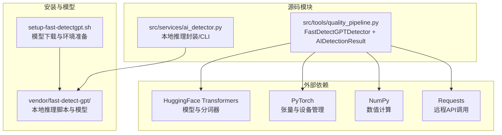
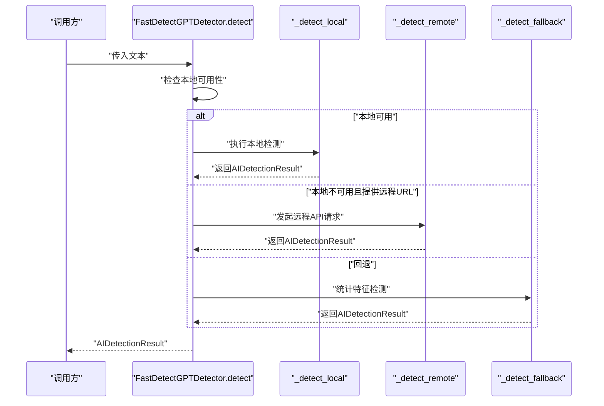
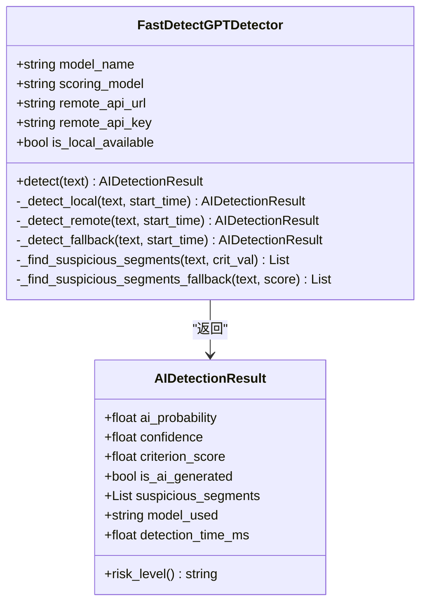
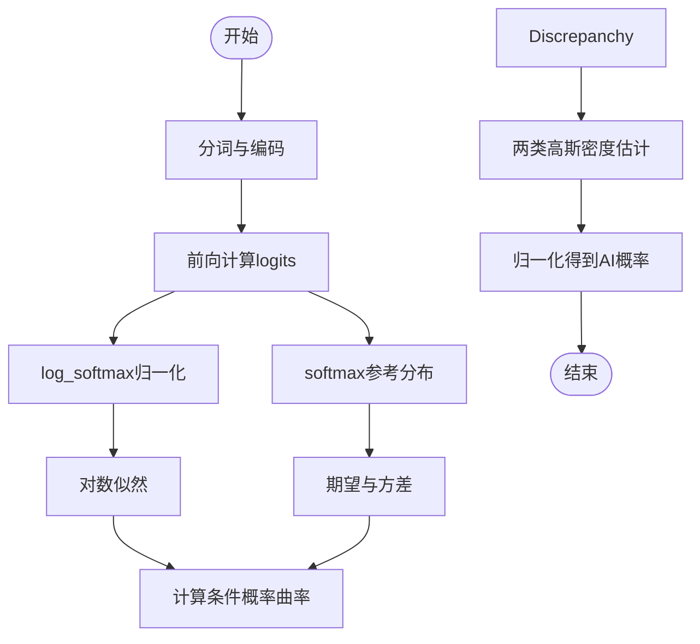
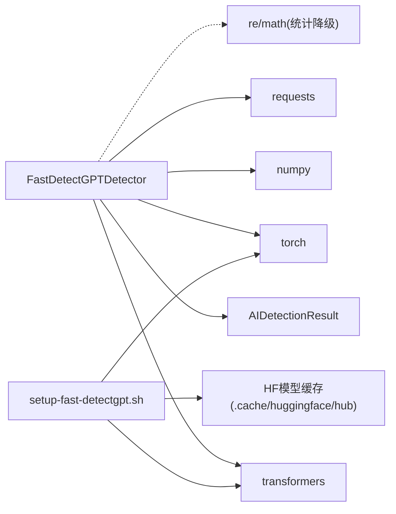

# AI痕迹检测模块

<cite>
**本文引用的文件**
- [src/tools/quality_pipeline.py](file://src/tools/quality_pipeline.py)
- [src/services/ai_detector.py](file://src/services/ai_detector.py)
- [setup-fast-detectgpt.sh](file://setup-fast-detectgpt.sh)
- [README.md](file://README.md)
</cite>

## 目录
1. [简介](#简介)
2. [项目结构](#项目结构)
3. [核心组件](#核心组件)
4. [架构概览](#架构概览)
5. [详细组件分析](#详细组件分析)
6. [依赖关系分析](#依赖关系分析)
7. [性能考虑](#性能考虑)
8. [故障排除指南](#故障排除指南)
9. [结论](#结论)
10. [附录](#附录)

## 简介
本文件面向paperwriterAI中的AI痕迹检测模块，系统性阐述FastDetectGPTDetector类的实现原理与使用方法。该模块提供三种检测模式：
- 本地模型检测：基于transformers加载gpt-j-6B、gpt-neo-2.7B、Llama3-8B等模型，采用条件概率曲率检测算法。
- 远程API检测：通过fastdetect.net提供的远程接口进行检测。
- 统计降级检测：在本地与远程均不可用时，基于统计特征的启发式规则进行快速检测。

同时，文档详细解释条件概率曲率检测算法的数学原理、get_sampling_discrepancy_analytic函数的实现思路、AI概率计算公式，以及AIDetectionResult数据结构各字段的含义与用途。最后提供完整的配置选项、使用示例、性能优化建议与故障排除指南。

## 项目结构
AI痕迹检测模块位于src/tools/quality_pipeline.py中，核心类为FastDetectGPTDetector；配套的本地推理封装位于src/services/ai_detector.py；安装与模型准备脚本为setup-fast-detectgpt.sh；README.md提供了模块说明与安装指引。

图表来源
- [src/tools/quality_pipeline.py:87-165](file://src/tools/quality_pipeline.py#L87-L165)
- [src/services/ai_detector.py:146-183](file://src/services/ai_detector.py#L146-L183)
- [setup-fast-detectgpt.sh:1-149](file://setup-fast-detectgpt.sh#L1-L149)

章节来源
- [src/tools/quality_pipeline.py:1-200](file://src/tools/quality_pipeline.py#L1-L200)
- [src/services/ai_detector.py:1-358](file://src/services/ai_detector.py#L1-L358)
- [setup-fast-detectgpt.sh:1-149](file://setup-fast-detectgpt.sh#L1-L149)
- [README.md:348-539](file://README.md#L348-L539)

## 核心组件
- FastDetectGPTDetector：主检测器，支持本地模型、远程API与统计降级三种模式，统一返回AIDetectionResult。
- AIDetectionResult：检测结果数据结构，包含ai_probability、confidence、criterion_score、is_ai_generated、suspicious_segments、model_used、detection_time_ms等字段。
- 本地推理封装（ai_detector.py）：提供基于vendor/fast-detect-gpt的本地推理能力，便于独立测试与批量处理。
- 安装脚本（setup-fast-detectgpt.sh）：负责模型下载、虚拟环境与依赖安装。

章节来源
- [src/tools/quality_pipeline.py:26-45](file://src/tools/quality_pipeline.py#L26-L45)
- [src/tools/quality_pipeline.py:87-165](file://src/tools/quality_pipeline.py#L87-L165)
- [src/services/ai_detector.py:30-54](file://src/services/ai_detector.py#L30-L54)
- [setup-fast-detectgpt.sh:1-149](file://setup-fast-detectgpt.sh#L1-L149)

## 架构概览
FastDetectGPTDetector的检测流程遵循“优先本地、其次远程、最后统计”的策略。本地模式通过transformers加载指定模型，计算条件概率曲率作为判据，再基于高斯分布参数推导AI概率；远程模式通过HTTP请求调用远端API；统计降级模式基于句法与词汇统计特征进行启发式判断。

图表来源
- [src/tools/quality_pipeline.py:146-165](file://src/tools/quality_pipeline.py#L146-L165)
- [src/tools/quality_pipeline.py:166-277](file://src/tools/quality_pipeline.py#L166-L277)
- [src/tools/quality_pipeline.py:278-307](file://src/tools/quality_pipeline.py#L278-L307)
- [src/tools/quality_pipeline.py:308-391](file://src/tools/quality_pipeline.py#L308-L391)

## 详细组件分析

### FastDetectGPTDetector类
- 模型优先级：gpt-j-6B > gpt-neo-2.7B > falcon-7b（注：具体模型名称以构造参数为准）。
- 检测模式选择逻辑：
  - 本地可用：使用transformers加载模型，计算条件概率曲率，推导AI概率。
  - 远程可用：向remote_api_url发送JSON请求，解析响应为AIDetectionResult。
  - 统计降级：基于句法与词汇统计特征，启发式估算AI概率。
- 关键内部函数：
  - get_sampling_discrepancy_analytic：计算条件概率曲率的数学实现。
  - _find_suspicious_segments：识别可疑段落（主要针对本地模式）。
  - _find_suspicious_segments_fallback：降级模式下的可疑段落识别。

图表来源
- [src/tools/quality_pipeline.py:26-45](file://src/tools/quality_pipeline.py#L26-L45)
- [src/tools/quality_pipeline.py:87-165](file://src/tools/quality_pipeline.py#L87-L165)
- [src/tools/quality_pipeline.py:166-277](file://src/tools/quality_pipeline.py#L166-L277)
- [src/tools/quality_pipeline.py:278-307](file://src/tools/quality_pipeline.py#L278-L307)
- [src/tools/quality_pipeline.py:308-391](file://src/tools/quality_pipeline.py#L308-L391)

章节来源
- [src/tools/quality_pipeline.py:87-165](file://src/tools/quality_pipeline.py#L87-L165)
- [src/tools/quality_pipeline.py:166-277](file://src/tools/quality_pipeline.py#L166-L277)
- [src/tools/quality_pipeline.py:278-307](file://src/tools/quality_pipeline.py#L278-L307)
- [src/tools/quality_pipeline.py:308-391](file://src/tools/quality_pipeline.py#L308-L391)

### 条件概率曲率检测算法与数学原理
- 输入：文本经分词器编码后的logits（评分模型输出）。
- 核心函数：get_sampling_discrepancy_analytic
  - 计算步骤要点：
    - 对评分模型logits进行log_softmax归一化得到对数概率。
    - 对参考模型logits进行softmax得到概率分布。
    - 计算对数似然与期望、方差，得到条件概率曲率discrepancy。
    - discrepancy即为criterion_score，作为AI生成的判据。
- AI概率计算：
  - 使用两类高斯分布参数（人类与AI）对crit值进行概率密度估计，归一化得到ai_probability。
  - 参数来源于训练/统计拟合（具体数值在实现中给出）。

图表来源
- [src/tools/quality_pipeline.py:176-195](file://src/tools/quality_pipeline.py#L176-L195)
- [src/tools/quality_pipeline.py:244-251](file://src/tools/quality_pipeline.py#L244-L251)

章节来源
- [src/tools/quality_pipeline.py:176-195](file://src/tools/quality_pipeline.py#L176-L195)
- [src/tools/quality_pipeline.py:244-251](file://src/tools/quality_pipeline.py#L244-L251)

### AIDetectionResult数据结构字段说明
- ai_probability：AI生成概率，范围[0,1]，越大越可能是AI生成。
- confidence：置信度，范围[0,1]，表示检测器对该概率的可信程度。
- criterion_score：判据分数（条件概率曲率），用于阈值判定。
- is_ai_generated：基于阈值的二分类判定。
- suspicious_segments：可疑段落列表，包含触发可疑标记的句子片段及位置信息。
- model_used：使用的模型标识（本地/远程/降级）。
- detection_time_ms：检测耗时（毫秒）。

章节来源
- [src/tools/quality_pipeline.py:26-45](file://src/tools/quality_pipeline.py#L26-L45)

### 本地模型检测（基于transformers）
- 支持模型：gpt-neo-2.7B（默认，CPU友好）、gpt-j-6B（推荐GPU）、Llama3-8B（需要授权与GPU）。
- 设备选择：gpt-neo-2.7B在MPS上可能OOM，强制使用CPU；CUDA用户可改为GPU。
- 模型加载：延迟加载至实例，使用HuggingFace缓存目录，避免重复下载。
- 检测流程：分词→前向→计算曲率→概率推导→结果封装。

章节来源
- [src/tools/quality_pipeline.py:107-117](file://src/tools/quality_pipeline.py#L107-L117)
- [src/tools/quality_pipeline.py:196-199](file://src/tools/quality_pipeline.py#L196-L199)
- [src/tools/quality_pipeline.py:200-219](file://src/tools/quality_pipeline.py#L200-L219)
- [src/tools/quality_pipeline.py:234-262](file://src/tools/quality_pipeline.py#L234-L262)

### 远程API检测（fastdetect.net）
- 请求方式：POST /detect，JSON负载包含text与model。
- 返回字段：ai_probability、confidence、criterion、is_ai_generated、suspicious_segments等。
- 错误处理：请求异常或解析失败时回退到统计降级。

章节来源
- [src/tools/quality_pipeline.py:278-307](file://src/tools/quality_pipeline.py#L278-L307)

### 统计降级检测
- 特征工程：
  - 句子长度方差（AI文本更一致）
  - 词汇丰富度（Type-Token Ratio）
  - 常见AI套话模式（正则匹配）
  - 数字与引号密度
- 综合评分：加权求和，范围归一化到[0,1]。
- 可疑段落：基于AI套话出现频率与长度阈值筛选。

章节来源
- [src/tools/quality_pipeline.py:308-391](file://src/tools/quality_pipeline.py#L308-L391)

### 本地推理封装（ai_detector.py）
- 提供：
  - run_local_infer：调用vendor/fast-detect-gpt的local_infer.py进行检测。
  - detect_ai_text：主检测函数，返回FastDetectResult对象。
  - detect_text_segments：分段检测，返回每段的AI概率与判定。
  - batch_detect：批量检测多个文本。
  - detect_paper_ai_content：论文级检测，汇总整体概率与高风险段落。
- CLI入口：支持命令行参数选择模型、分段检测与输出格式。

章节来源
- [src/services/ai_detector.py:61-144](file://src/services/ai_detector.py#L61-L144)
- [src/services/ai_detector.py:146-183](file://src/services/ai_detector.py#L146-L183)
- [src/services/ai_detector.py:186-218](file://src/services/ai_detector.py#L186-L218)
- [src/services/ai_detector.py:221-232](file://src/services/ai_detector.py#L221-L232)
- [src/services/ai_detector.py:237-297](file://src/services/ai_detector.py#L237-L297)
- [src/services/ai_detector.py:302-358](file://src/services/ai_detector.py#L302-L358)

## 依赖关系分析
- 内部依赖：
  - FastDetectGPTDetector依赖AIDetectionResult进行结果封装。
  - 本地模式依赖transformers、torch、numpy。
  - 远程模式依赖requests。
  - 统计降级模式依赖re、math、numpy。
- 外部依赖：
  - HuggingFace Transformers：模型与分词器。
  - PyTorch：张量运算与设备管理。
  - NumPy：数值计算。
  - Requests：HTTP客户端。
- 安装与模型：
  - setup-fast-detectgpt.sh负责模型下载与环境准备，确保transformers模型缓存存在。

图表来源
- [src/tools/quality_pipeline.py:87-165](file://src/tools/quality_pipeline.py#L87-L165)
- [src/tools/quality_pipeline.py:166-277](file://src/tools/quality_pipeline.py#L166-L277)
- [src/tools/quality_pipeline.py:278-307](file://src/tools/quality_pipeline.py#L278-L307)
- [src/tools/quality_pipeline.py:308-391](file://src/tools/quality_pipeline.py#L308-L391)
- [setup-fast-detectgpt.sh:88-123](file://setup-fast-detectgpt.sh#L88-L123)

章节来源
- [src/tools/quality_pipeline.py:87-165](file://src/tools/quality_pipeline.py#L87-L165)
- [src/tools/quality_pipeline.py:166-277](file://src/tools/quality_pipeline.py#L166-L277)
- [src/tools/quality_pipeline.py:278-307](file://src/tools/quality_pipeline.py#L278-L307)
- [src/tools/quality_pipeline.py:308-391](file://src/tools/quality_pipeline.py#L308-L391)
- [setup-fast-detectgpt.sh:88-123](file://setup-fast-detectgpt.sh#L88-L123)

## 性能考虑
- 模型选择与显存：
  - gpt-neo-2.7B：使用float16以降低显存占用，适合CPU/MPS。
  - gpt-j-6B/Llama3-8B：建议使用GPU，注意显存大小。
- 设备选择：
  - gpt-neo-2.7B在MPS上可能OOM，强制使用CPU；CUDA用户可改为GPU。
- 检测粒度：
  - 对长文本进行分段检测，减少单次计算时间与内存压力。
- 远程API：
  - 设置合理超时（如30秒），在网络不稳定时快速失败并回退。
- 统计降级：
  - 作为兜底方案，开销极低，适合短文本或紧急场景。

## 故障排除指南
- 本地模型不可用：
  - 确认setup-fast-detectgpt.sh已执行并完成模型下载。
  - 检查~/.cache/huggingface/hub中是否存在对应模型缓存。
  - 若MPS OOM，确认未强制使用GPU；必要时改用gpt-neo-2.7B。
- 远程API失败：
  - 检查remote_api_url与网络连通性。
  - 如需鉴权，确保remote_api_key正确。
  - 观察返回JSON结构是否包含必需字段。
- 统计降级异常：
  - 确认输入文本非空且长度足够。
  - 检查正则表达式是否被意外修改。
- 输出解析错误（本地封装）：
  - vendor/fast-detect-gpt输出格式变化可能导致解析失败。
  - 查看错误日志并核对输出字符串匹配逻辑。

章节来源
- [src/tools/quality_pipeline.py:118-144](file://src/tools/quality_pipeline.py#L118-L144)
- [src/tools/quality_pipeline.py:278-307](file://src/tools/quality_pipeline.py#L278-L307)
- [src/tools/quality_pipeline.py:308-391](file://src/tools/quality_pipeline.py#L308-L391)
- [src/services/ai_detector.py:74-144](file://src/services/ai_detector.py#L74-L144)

## 结论
AI痕迹检测模块通过“本地模型→远程API→统计降级”的三层策略，实现了高鲁棒性的AI生成文本检测。本地模式基于条件概率曲率与高斯密度估计，具备较强的判别能力；远程模式提供云端一致性；统计降级保证在极端条件下仍能给出合理结果。结合分段检测与合理的模型选择，可在不同硬件环境下取得良好的性能与稳定性。

## 附录

### 配置选项
- 构造参数
  - model_name：主模型名称（影响初始化与显示）。
  - scoring_model：评分模型名称（决定实际检测所用模型）。
  - remote_api_url：远程API基础URL（可选）。
  - remote_api_key：远程API访问密钥（可选）。
- 本地检测关键行为
  - 设备选择：CPU（gpt-neo-2.7B）或GPU（其他模型）。
  - 模型精度：gpt-neo-2.7B使用float16，其他使用float32。
- 远程检测关键行为
  - 超时：默认30秒。
  - 请求路径：/detect。
- 统计降级关键行为
  - 特征权重：套话、词汇丰富度、句子长度方差、平均词长、特殊字符比例。
  - 短文本惩罚：对少于50/100词的文本进行概率下调。

章节来源
- [src/tools/quality_pipeline.py:107-117](file://src/tools/quality_pipeline.py#L107-L117)
- [src/tools/quality_pipeline.py:196-199](file://src/tools/quality_pipeline.py#L196-L199)
- [src/tools/quality_pipeline.py:200-219](file://src/tools/quality_pipeline.py#L200-L219)
- [src/tools/quality_pipeline.py:278-307](file://src/tools/quality_pipeline.py#L278-L307)
- [src/tools/quality_pipeline.py:308-391](file://src/tools/quality_pipeline.py#L308-L391)

### 使用示例
- 本地检测（质量流水线）
  - 初始化：FastDetectGPTDetector(model_name="gpt-neo-2.7B", scoring_model="gpt-neo-2.7B")
  - 调用：detector.detect("你的文本")
  - 获取结果：AIDetectionResult.ai_probability、criterion_score、is_ai_generated等
- 本地封装（独立脚本）
  - detect_ai_text("你的文本", sampling_model="gpt-neo-2.7B", threshold=1.9299)
  - detect_paper_ai_content("论文全文", sampling_model="gpt-neo-2.7B", segment_length=500)
- CLI
  - python -m src.services.ai_detector "你的文本" --model gpt-neo-2.7B --segment --format json

章节来源
- [src/tools/quality_pipeline.py:146-165](file://src/tools/quality_pipeline.py#L146-L165)
- [src/services/ai_detector.py:146-183](file://src/services/ai_detector.py#L146-L183)
- [src/services/ai_detector.py:237-297](file://src/services/ai_detector.py#L237-L297)
- [src/services/ai_detector.py:302-358](file://src/services/ai_detector.py#L302-L358)

### 风险等级与阈值
- 风险等级划分（依据ai_probability）
  - 低风险：< 30%
  - 中风险：30% - 70%
  - 高风险：> 70%
- 判定阈值（criterion_score）
  - 默认阈值：1.9299（来自Fast-DetectGPT）

章节来源
- [README.md:374-381](file://README.md#L374-L381)
- [src/tools/quality_pipeline.py:105](file://src/tools/quality_pipeline.py#L105)