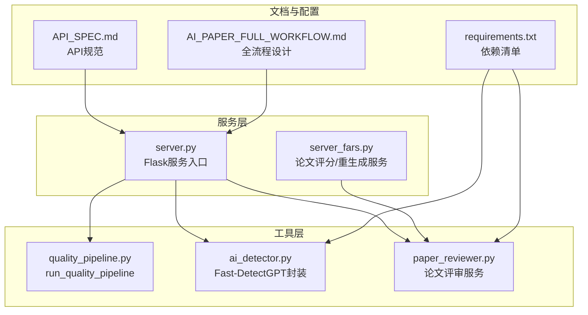
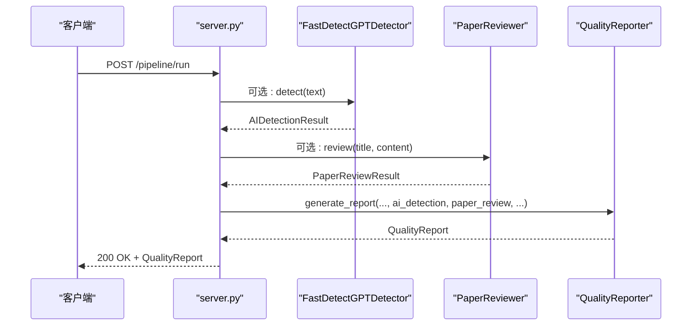
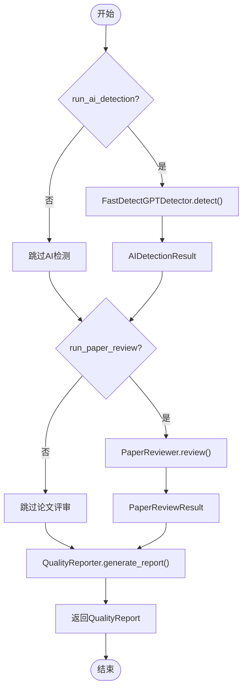
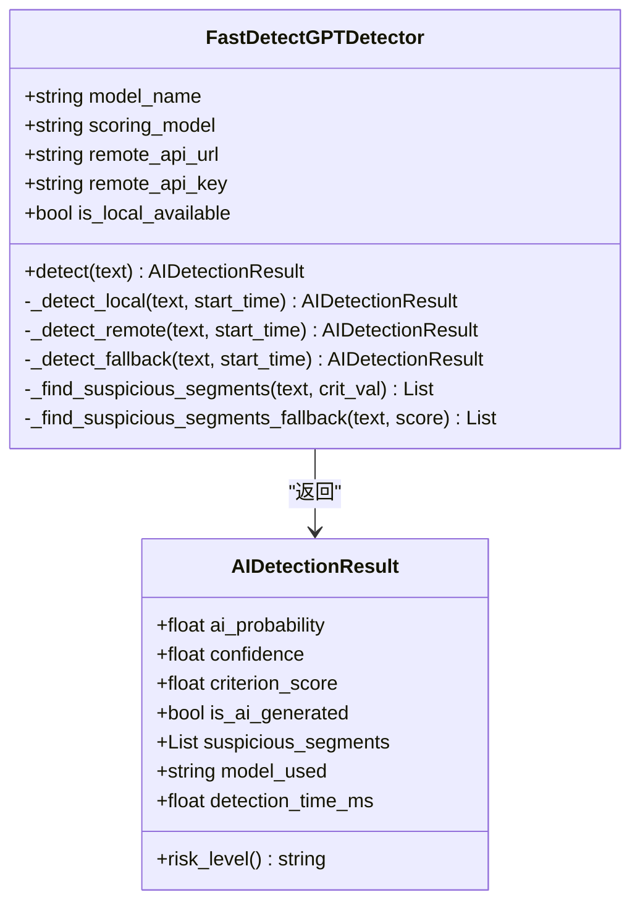
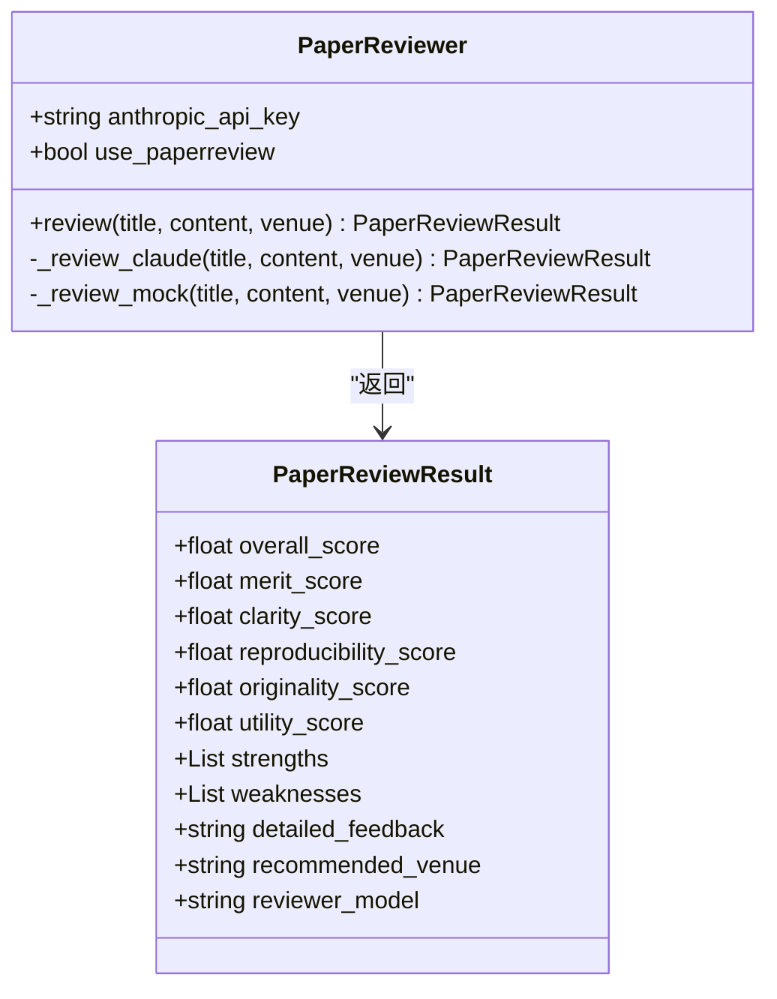
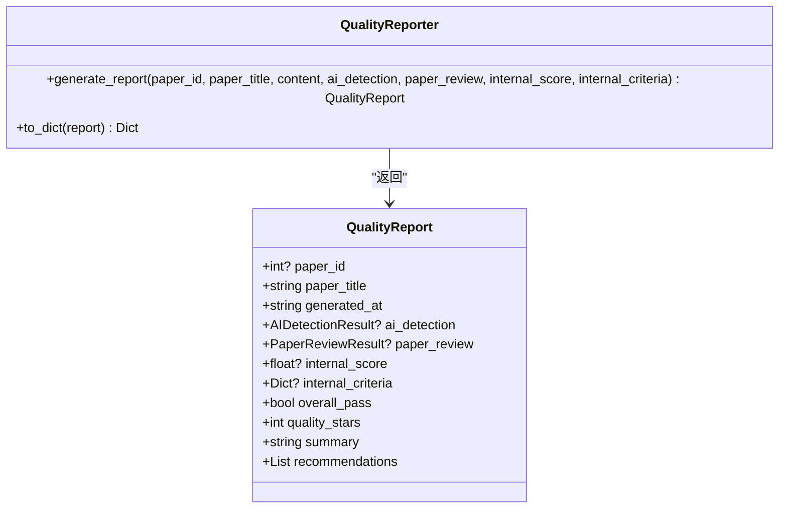
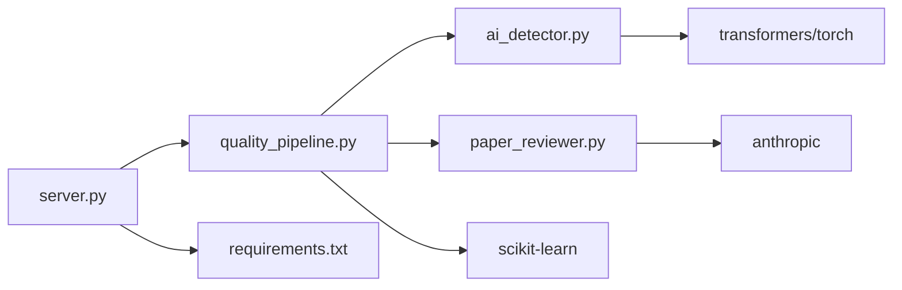

# 流水线集成与使用

<cite>
**本文档引用的文件**
- [quality_pipeline.py](file://src/tools/quality_pipeline.py)
- [ai_detector.py](file://src/services/ai_detector.py)
- [paper_reviewer.py](file://src/services/paper_reviewer.py)
- [server.py](file://server.py)
- [server_fars.py](file://server_fars.py)
- [API_SPEC.md](file://docs/API_SPEC.md)
- [AI_PAPER_FULL_WORKFLOW.md](file://docs/AI_PAPER_FULL_WORKFLOW.md)
- [requirements.txt](file://requirements.txt)
</cite>

## 目录
1. [简介](#简介)
2. [项目结构](#项目结构)
3. [核心组件](#核心组件)
4. [架构总览](#架构总览)
5. [详细组件分析](#详细组件分析)
6. [依赖分析](#依赖分析)
7. [性能考量](#性能考量)
8. [故障排查指南](#故障排查指南)
9. [结论](#结论)
10. [附录](#附录)

## 简介
本文件面向paperwriterAI质量控制流水线的集成使用，聚焦run_quality_pipeline函数的完整工作流程，涵盖参数配置、模块调用顺序、错误处理机制。文档详细说明流水线的三个阶段：Step 4 AI痕迹检测、Step 5 论文评审、Step 6 综合报告生成的集成方式；解释可选性配置run_ai_detection、run_paper_review、run_internal_score及其不同组合的使用场景；提供完整的API接口说明（参数类型、返回值、异常处理）；并给出性能优化策略（并行处理、缓存机制、资源管理）、实际使用案例、配置示例、常见问题解决方案与调试技巧。

## 项目结构
paperwriterAI采用模块化组织，质量控制流水线位于src/tools目录，配套的AI检测与论文评审服务分别位于src/services目录，HTTP服务入口位于server.py与server_fars.py，API规范与流程设计文档位于docs目录。

图表来源
- [quality_pipeline.py:748-807](file://src/tools/quality_pipeline.py#L748-L807)
- [ai_detector.py:1-358](file://src/services/ai_detector.py#L1-L358)
- [paper_reviewer.py:1-473](file://src/services/paper_reviewer.py#L1-L473)
- [server.py:1-800](file://server.py#L1-L800)
- [server_fars.py:1-800](file://server_fars.py#L1-L800)
- [API_SPEC.md:1-436](file://docs/API_SPEC.md#L1-L436)
- [AI_PAPER_FULL_WORKFLOW.md:1-301](file://docs/AI_PAPER_FULL_WORKFLOW.md#L1-L301)
- [requirements.txt:1-39](file://requirements.txt#L1-L39)

章节来源
- [quality_pipeline.py:1-807](file://src/tools/quality_pipeline.py#L1-L807)
- [ai_detector.py:1-358](file://src/services/ai_detector.py#L1-L358)
- [paper_reviewer.py:1-473](file://src/services/paper_reviewer.py#L1-L473)
- [server.py:1-800](file://server.py#L1-L800)
- [server_fars.py:1-800](file://server_fars.py#L1-L800)
- [API_SPEC.md:1-436](file://docs/API_SPEC.md#L1-L436)
- [AI_PAPER_FULL_WORKFLOW.md:1-301](file://docs/AI_PAPER_FULL_WORKFLOW.md#L1-L301)
- [requirements.txt:1-39](file://requirements.txt#L1-L39)

## 核心组件
- run_quality_pipeline：统一调度AI痕迹检测、论文评审与综合报告生成的入口函数，支持可选阶段开关。
- FastDetectGPTDetector：Step 4的AI痕迹检测器，支持本地transformers模型、远程API与统计降级方案。
- PaperReviewer：Step 5的论文评审器，优先Claude API，降级为本地模拟评审。
- QualityReporter：Step 6的综合报告生成器，整合检测与评审结果，产出质量星数、综合判定与建议。
- HTTP服务：server.py提供质量流水线的HTTP接口，server_fars.py提供论文评分与重生成接口。

章节来源
- [quality_pipeline.py:748-807](file://src/tools/quality_pipeline.py#L748-L807)
- [ai_detector.py:1-358](file://src/services/ai_detector.py#L1-L358)
- [paper_reviewer.py:1-473](file://src/services/paper_reviewer.py#L1-L473)
- [server.py:1-800](file://server.py#L1-L800)
- [server_fars.py:1-800](file://server_fars.py#L1-L800)

## 架构总览
质量控制流水线在HTTP服务中以run_quality_pipeline为核心，按需调用AI痕迹检测与论文评审模块，最终生成综合质量报告。系统支持可选阶段，便于在不同环境下灵活启用。

图表来源
- [server.py:1-800](file://server.py#L1-L800)
- [quality_pipeline.py:748-807](file://src/tools/quality_pipeline.py#L748-L807)
- [ai_detector.py:1-358](file://src/services/ai_detector.py#L1-L358)
- [paper_reviewer.py:1-473](file://src/services/paper_reviewer.py#L1-L473)

## 详细组件分析

### run_quality_pipeline函数工作流
- 输入参数
  - paper_id: 可选论文标识
  - paper_title: 论文标题
  - content: 论文正文
  - anthropic_api_key: Claude API密钥（可选）
  - fast_detectgpt_remote_url/fast_detectgpt_remote_key: 远程Fast-DetectGPT服务地址与密钥（可选）
  - run_ai_detection: 是否运行AI痕迹检测（默认True）
  - run_paper_review: 是否运行论文评审（默认True）
  - run_internal_score: 是否启用内部评分（默认False）

- 执行流程
  1) 可选：AI痕迹检测（FastDetectGPT）
     - 优先本地transformers模型（自动检测环境与缓存）
     - 其次远程Fast-DetectGPT API
     - 最后统计降级方案
  2) 可选：论文评审（Claude/PaperReview）
     - 优先Anthropic Claude API
     - 降级为本地模拟评审
  3) 综合报告生成
     - 基于检测与评审结果进行综合判定
     - 生成质量星数、建议与摘要

- 返回值
  - QualityReport对象，包含AI检测、论文评审、内部评分、综合判定、质量星数、摘要与建议等字段

- 错误处理
  - 检测阶段：本地模型导入失败或异常时降级为统计方案
  - 评审阶段：API调用失败时降级为本地模拟评审
  - 报告阶段：综合判定与评分基于现有输入，若为空则相应字段为空

图表来源
- [quality_pipeline.py:748-807](file://src/tools/quality_pipeline.py#L748-L807)

章节来源
- [quality_pipeline.py:748-807](file://src/tools/quality_pipeline.py#L748-L807)

### AI痕迹检测（Step 4）组件
- FastDetectGPTDetector
  - 本地优先：transformers加载模型，CPU设备，float16节省显存
  - 远程优先：fastdetect.net API
  - 降级方案：统计特征（词汇丰富度、句子长度方差、AI套话、数字与引号密度等）
  - 可配置项：model_name、scoring_model、remote_api_url、remote_api_key
  - 输出：AIDetectionResult（包含AI概率、置信度、判据值、是否AI生成、可疑段落、模型名称、耗时）

图表来源
- [quality_pipeline.py:87-434](file://src/tools/quality_pipeline.py#L87-L434)

章节来源
- [quality_pipeline.py:87-434](file://src/tools/quality_pipeline.py#L87-L434)

### 论文评审（Step 5）组件
- PaperReviewer
  - 优先：Anthropic Claude API（基于anthropic库）
  - 降级：本地模拟评审（基于内容特征与随机扰动）
  - 可配置项：anthropic_api_key、use_paperreview（预留）
  - 输出：PaperReviewResult（包含综合与六维评分、优缺点、详细反馈、推荐会议等）

图表来源
- [quality_pipeline.py:441-603](file://src/tools/quality_pipeline.py#L441-L603)

章节来源
- [quality_pipeline.py:441-603](file://src/tools/quality_pipeline.py#L441-L603)

### 综合报告生成（Step 6）组件
- QualityReporter
  - 综合判定：基于AI痕迹概率、评审分数与内部评分（若提供）
  - 质量星数：综合AI痕迹与评审/内部评分得出
  - 建议：基于阈值与维度分数生成针对性建议
  - 输出：QualityReport（包含paper_id、paper_title、generated_at、ai_detection、paper_review、internal_score、internal_criteria、overall_pass、quality_stars、summary、recommendations）

图表来源
- [quality_pipeline.py:609-742](file://src/tools/quality_pipeline.py#L609-L742)

章节来源
- [quality_pipeline.py:609-742](file://src/tools/quality_pipeline.py#L609-L742)

### API接口说明
- HTTP服务入口：server.py
  - 路由：/pipeline/run（POST）
  - 请求体字段：query、max_papers、target_universe、generate_paper（与质量流水线参数对应）
  - 响应：pipeline_id、status、stages等
- 质量流水线调用：在server.py中导入并调用run_quality_pipeline
- 论文评分与重生成：server_fars.py提供/score、/regenerate、/find_papers、/iterate等接口

章节来源
- [API_SPEC.md:334-380](file://docs/API_SPEC.md#L334-L380)
- [server.py:1-800](file://server.py#L1-L800)
- [server_fars.py:440-594](file://server_fars.py#L440-L594)

## 依赖分析
- 第三方依赖
  - transformers、torch、accelerate：本地Fast-DetectGPT推理
  - anthropic：Claude API调用
  - scikit-learn：文本相似度计算（质量管道）
  - requests：HTTP请求（远程检测与评审）
- 模块耦合
  - server.py直接依赖quality_pipeline.py中的类与函数
  - quality_pipeline.py内部模块（FastDetectGPTDetector、PaperReviewer、QualityReporter）相互独立，通过run_quality_pipeline统一编排

图表来源
- [server.py:1-800](file://server.py#L1-L800)
- [quality_pipeline.py:1-807](file://src/tools/quality_pipeline.py#L1-L807)
- [ai_detector.py:1-358](file://src/services/ai_detector.py#L1-L358)
- [paper_reviewer.py:1-473](file://src/services/paper_reviewer.py#L1-L473)
- [requirements.txt:1-39](file://requirements.txt#L1-L39)

章节来源
- [requirements.txt:1-39](file://requirements.txt#L1-L39)
- [quality_pipeline.py:1-807](file://src/tools/quality_pipeline.py#L1-L807)

## 性能考量
- 并行处理
  - 当前run_quality_pipeline按顺序执行三阶段。若需并行，可在调用侧对AI检测与论文评审进行并发（注意API速率限制与资源占用）。
- 缓存机制
  - Fast-DetectGPT本地检测器对transformers模型与tokenizer进行实例缓存，减少重复加载开销。
  - HuggingFace模型缓存目录（~/.cache/huggingface/hub）可显著缩短首次加载时间。
- 资源管理
  - 本地推理默认使用CPU，避免GPU OOM；如使用CUDA需自行调整设备参数。
  - float16用于gpt-neo-2.7B以节省显存；其他模型使用float32。
  - Claude API调用设置合理超时（默认60秒以上），避免阻塞。
- I/O与网络
  - 远程Fast-DetectGPT API与Claude API需考虑网络抖动与超时重试策略。
  - 本地检测与评审结果可序列化为JSON，便于后续处理与持久化。

章节来源
- [quality_pipeline.py:118-144](file://src/tools/quality_pipeline.py#L118-L144)
- [quality_pipeline.py:200-218](file://src/tools/quality_pipeline.py#L200-L218)
- [paper_reviewer.py:183-238](file://src/services/paper_reviewer.py#L183-L238)

## 故障排查指南
- AI痕迹检测失败
  - 症状：本地模型导入失败或异常
  - 处理：检查transformers与torch版本；确认HuggingFace缓存目录存在；切换至远程API或统计降级方案
- 论文评审失败
  - 症状：Claude API调用失败
  - 处理：检查ANTHROPIC_API_KEY；确认网络可达；降级为本地模拟评审
- 综合报告异常
  - 症状：综合判定或星数异常
  - 处理：检查输入的AI检测与评审结果；确认阈值与权重逻辑符合预期
- HTTP服务异常
  - 症状：/pipeline/run返回错误
  - 处理：检查server.py中run_quality_pipeline调用参数；查看日志与异常栈

章节来源
- [quality_pipeline.py:264-276](file://src/tools/quality_pipeline.py#L264-L276)
- [quality_pipeline.py:547-550](file://src/tools/quality_pipeline.py#L547-L550)
- [server.py:1-800](file://server.py#L1-L800)

## 结论
paperwriterAI的质量控制流水线通过run_quality_pipeline实现了AI痕迹检测、论文评审与综合报告生成的有机集成。系统具备良好的可选性与降级能力，能够在不同环境与资源条件下稳定运行。通过合理的参数配置、错误处理与性能优化策略，用户可以在保证质量的同时提升处理效率。

## 附录

### 使用场景与组合示例
- 场景A：仅做AI痕迹检测
  - 设置run_ai_detection=True，run_paper_review=False，run_internal_score=False
- 场景B：仅做论文评审
  - 设置run_ai_detection=False，run_paper_review=True，run_internal_score=False
- 场景C：启用内部评分
  - 设置run_ai_detection=True/False，run_paper_review=True，run_internal_score=True
- 场景D：完整流水线
  - 默认开启三项，适合严格质量把关

章节来源
- [quality_pipeline.py:748-807](file://src/tools/quality_pipeline.py#L748-L807)

### 配置示例
- 环境变量
  - ANTHROPIC_API_KEY：Claude API密钥
  - OPENAI_API_KEY / OPENAI_API_KEYS：备用LLM调用
- 本地Fast-DetectGPT
  - 确保transformers与torch版本满足requirements.txt
  - 模型缓存目录：~/.cache/huggingface/hub
- 远程Fast-DetectGPT
  - fast_detectgpt_remote_url与fast_detectgpt_remote_key用于启用远程检测

章节来源
- [requirements.txt:1-39](file://requirements.txt#L1-L39)
- [quality_pipeline.py:107-115](file://src/tools/quality_pipeline.py#L107-L115)

### 实际使用案例
- 案例A：在server.py中新增路由调用run_quality_pipeline，返回JSON格式的QualityReport
- 案例B：结合server_fars.py的论文评分与重生成接口，形成“评分-重生成-再评分”的迭代闭环

章节来源
- [server.py:1-800](file://server.py#L1-L800)
- [server_fars.py:440-594](file://server_fars.py#L440-L594)