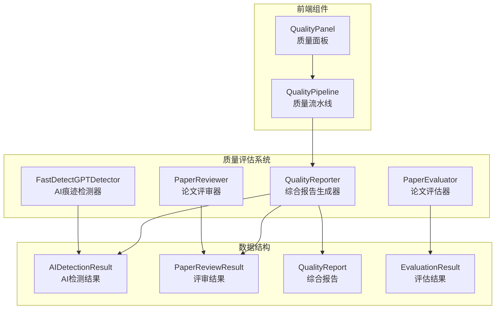
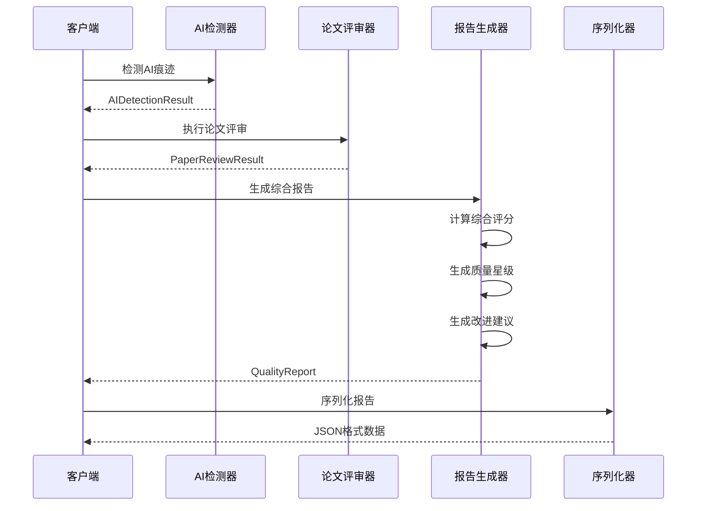
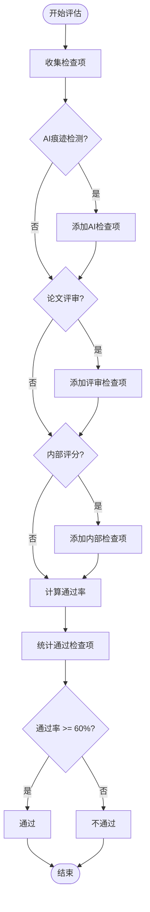
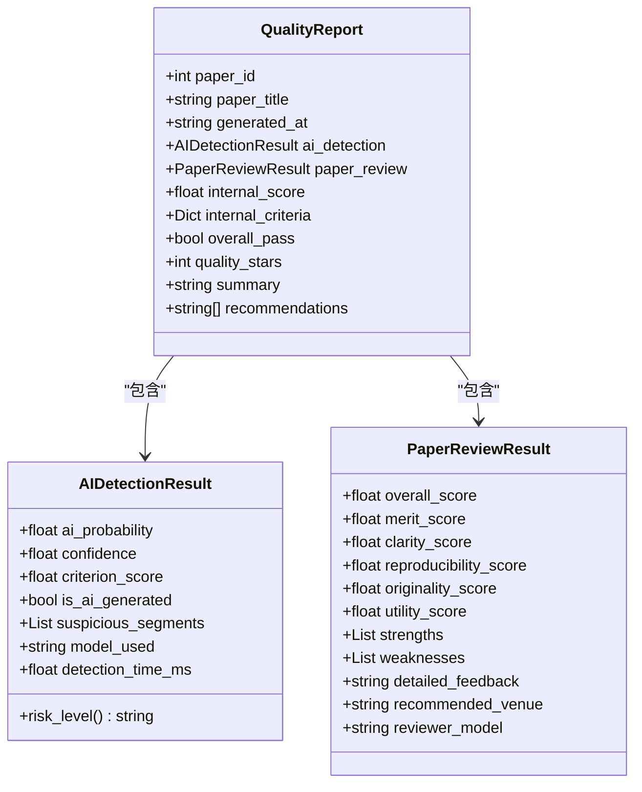
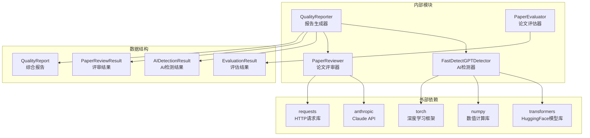

# 综合报告生成模块

<cite>
**本文档引用的文件**
- [quality_pipeline.py](file://src/tools/quality_pipeline.py)
- [quality-panel.js](file://docs/v2/components/quality-panel.js)
- [quality_gated_generator.py](file://scripts/quality_gated_generator.py)
- [paper_evaluator.py](file://scripts/paper_evaluator.py)
</cite>

## 目录
1. [简介](#简介)
2. [项目结构](#项目结构)
3. [核心组件](#核心组件)
4. [架构概览](#架构概览)
5. [详细组件分析](#详细组件分析)
6. [依赖关系分析](#依赖关系分析)
7. [性能考虑](#性能考虑)
8. [故障排除指南](#故障排除指南)
9. [结论](#结论)

## 简介

综合报告生成模块是paperwriterAI系统中的核心质量评估组件，负责整合AI痕迹检测、论文评审和内部评分，生成全面的综合质量报告。该模块实现了多维度的质量评估算法，包括AI生成内容检测、学术价值评估、创新性分析、可复现性检查和内部评分体系。

模块的核心目标是为量化研究论文提供标准化的质量评估，确保生成的论文达到可发表的学术标准。通过综合多个评估维度，系统能够识别论文的优势和不足，为作者提供针对性的改进建议。

## 项目结构

综合报告生成模块位于项目的工具层，与前端界面组件协同工作，形成完整的质量评估生态系统：

**图表来源**
- [quality_pipeline.py:609-742](file://src/tools/quality_pipeline.py#L609-L742)
- [quality-panel.js:6-346](file://docs/v2/components/quality-panel.js#L6-L346)

**章节来源**
- [quality_pipeline.py:1-807](file://src/tools/quality_pipeline.py#L1-L807)
- [quality-panel.js:1-346](file://docs/v2/components/quality-panel.js#L1-L346)

## 核心组件

### QualityReporter类

QualityReporter是综合报告生成模块的核心类，负责整合各种评估结果并生成最终的综合报告。该类实现了复杂的评分算法和判定逻辑。

#### 主要职责
- 综合AI痕迹检测结果
- 整合论文评审结果
- 应用内部评分体系
- 生成质量星级评价
- 提供改进建议
- 序列化报告数据

#### 关键方法
- `generate_report()`: 主要的报告生成方法
- `to_dict()`: 将报告转换为字典格式

**章节来源**
- [quality_pipeline.py:609-742](file://src/tools/quality_pipeline.py#L609-L742)

### 数据结构设计

模块使用Python的dataclass模式定义了多个核心数据结构，确保数据的一致性和类型安全：

#### AIDetectionResult
AI痕迹检测的结果数据结构，包含检测概率、置信度、可疑段落等信息。

#### PaperReviewResult  
论文评审结果的数据结构，涵盖五个评估维度的分数和评审意见。

#### QualityReport
综合质量报告的核心数据结构，包含所有评估结果和生成的建议。

**章节来源**
- [quality_pipeline.py:26-81](file://src/tools/quality_pipeline.py#L26-L81)

## 架构概览

综合报告生成模块采用分层架构设计，每个层次都有明确的职责分工：

**图表来源**
- [quality_pipeline.py:748-807](file://src/tools/quality_pipeline.py#L748-L807)
- [quality_pipeline.py:609-742](file://src/tools/quality_pipeline.py#L609-L742)

## 详细组件分析

### AI痕迹检测系统

AI痕迹检测系统是质量评估的重要组成部分，通过Fast-DetectGPT算法检测论文的AI生成概率。

#### 检测算法
系统实现了多层次的检测策略：

1. **本地模型检测**：使用transformers库加载本地模型
2. **远程API检测**：支持远程Fast-DetectGPT服务
3. **统计降级检测**：基于统计特征的AI文本识别

#### 风险等级划分
- 低风险：AI概率 < 30%
- 中风险：AI概率 30%-70%
- 高风险：AI概率 > 70%

**章节来源**
- [quality_pipeline.py:87-435](file://src/tools/quality_pipeline.py#L87-L435)

### 论文评审系统

论文评审系统提供结构化的学术论文评估，涵盖五个核心维度：

#### 评审维度及权重
- **学术价值 (Merit)**: 25% - 学术贡献的重要性
- **清晰度 (Clarity)**: 20% - 写作清晰度和结构合理性
- **可复现性 (Reproducibility)**: 20% - 实验设置的充分性
- **原创性 (Originality)**: 15% - 独特贡献的程度
- **实用性 (Utility)**: 10% - 实际应用价值

#### 评审流程
1. 构建结构化评审提示词
2. 调用Claude API进行智能评审
3. 解析JSON格式的评审结果
4. 生成详细的评审意见

**章节来源**
- [quality_pipeline.py:441-603](file://src/tools/quality_pipeline.py#L441-L603)

### 综合评分算法

综合评分算法是QualityReporter的核心，实现了多维度的综合评估。

#### 通过判定逻辑
系统采用"多数通过"原则，要求通过的检查项达到总检查项的60%以上：

**图表来源**
- [quality_pipeline.py:624-644](file://src/tools/quality_pipeline.py#L624-L644)

#### 质量星级计算规则
质量星级通过以下规则计算：

1. **AI痕迹影响**：AI概率 < 30% +1星
2. **评审分数影响**：评审总分/2（向下取整）
3. **内部评分影响**：内部评分/2（向下取整）
4. **星级范围**：1-5星之间

**章节来源**
- [quality_pipeline.py:645-655](file://src/tools/quality_pipeline.py#L645-L655)

### QualityReport数据结构详解

QualityReport是综合报告的核心数据结构，设计遵循JSON序列化的要求。

#### 字段生成逻辑

| 字段名 | 生成来源 | 生成逻辑 |
|--------|----------|----------|
| paper_id | 输入参数 | 直接传递论文ID |
| paper_title | 输入参数 | 直接传递论文标题 |
| generated_at | 系统时间 | 当前ISO格式时间 |
| ai_detection | AI检测结果 | 可选，包含检测详情 |
| paper_review | 论文评审结果 | 可选，包含评审详情 |
| internal_score | 内部评分 | 可选，数值评分 |
| internal_criteria | 内部评分标准 | 可选，评分细则 |
| overall_pass | 综合判定 | 通过检查项比例计算 |
| quality_stars | 质量星级 | 综合评分星级计算 |
| summary | 摘要 | 各维度摘要信息拼接 |
| recommendations | 建议 | 基于问题的改进建议 |

#### JSON序列化逻辑

to_dict方法实现了完整的JSON序列化，确保所有嵌套对象都能正确转换：

**图表来源**
- [quality_pipeline.py:63-81](file://src/tools/quality_pipeline.py#L63-L81)
- [quality_pipeline.py:27-61](file://src/tools/quality_pipeline.py#L27-L61)

**章节来源**
- [quality_pipeline.py:63-81](file://src/tools/quality_pipeline.py#L63-L81)
- [quality_pipeline.py:696-741](file://src/tools/quality_pipeline.py#L696-L741)

### 建议生成算法

建议生成算法基于检测到的问题自动生成针对性的改进建议。

#### AI痕迹风险提示
- AI概率 > 50%：建议人工润色
- 风险等级高：提供具体的润色建议

#### 评审维度改进建议
- 创新性不足：建议强化创新点描述
- 可复现性待提升：建议补充实现细节
- 清晰度待改进：建议精简表述

#### 内部评分优化建议
- 内部评分 < 7.0：建议迭代优化
- 提供具体的优化方向

**章节来源**
- [quality_pipeline.py:656-669](file://src/tools/quality_pipeline.py#L656-L669)

## 依赖关系分析

综合报告生成模块的依赖关系体现了清晰的分层架构：

**图表来源**
- [quality_pipeline.py:10-20](file://src/tools/quality_pipeline.py#L10-L20)
- [quality_pipeline.py:441-485](file://src/tools/quality_pipeline.py#L441-L485)

**章节来源**
- [quality_pipeline.py:10-20](file://src/tools/quality_pipeline.py#L10-L20)

## 性能考虑

### 模型加载优化
- 本地模型延迟加载，首次使用时才初始化
- 模型权重缓存到用户主目录
- 设备选择优化（CPU优先，GPU可选）

### API调用优化
- Claude API调用超时控制
- 失败重试机制
- 请求频率限制

### 内存管理
- 检测器实例缓存
- 大文本处理的内存优化
- 临时对象及时释放

## 故障排除指南

### 常见问题及解决方案

#### AI检测失败
- **症状**：AI检测结果异常或报错
- **原因**：模型加载失败、依赖缺失
- **解决**：检查模型缓存、安装依赖包

#### 评审API失败
- **症状**：论文评审结果为空
- **原因**：API密钥无效、网络连接问题
- **解决**：验证API密钥、检查网络连接

#### 性能问题
- **症状**：处理速度慢
- **原因**：模型过大、硬件资源不足
- **解决**：使用降级方案、升级硬件

**章节来源**
- [quality_pipeline.py:264-277](file://src/tools/quality_pipeline.py#L264-L277)
- [quality_pipeline.py:547-551](file://src/tools/quality_pipeline.py#L547-L551)

## 结论

综合报告生成模块通过多维度的质量评估，为量化研究论文提供了全面的质量保障。模块的设计体现了以下特点：

1. **模块化设计**：清晰的职责分离，便于维护和扩展
2. **多层检测**：AI痕迹检测、论文评审、内部评分的综合评估
3. **智能化建议**：基于检测结果的自动改进建议
4. **标准化输出**：统一的JSON格式，便于系统集成

该模块为paperwriterAI系统提供了坚实的质量基础，确保生成的论文达到学术发表的标准。通过持续的优化和改进，系统能够在保证质量的同时提高处理效率。