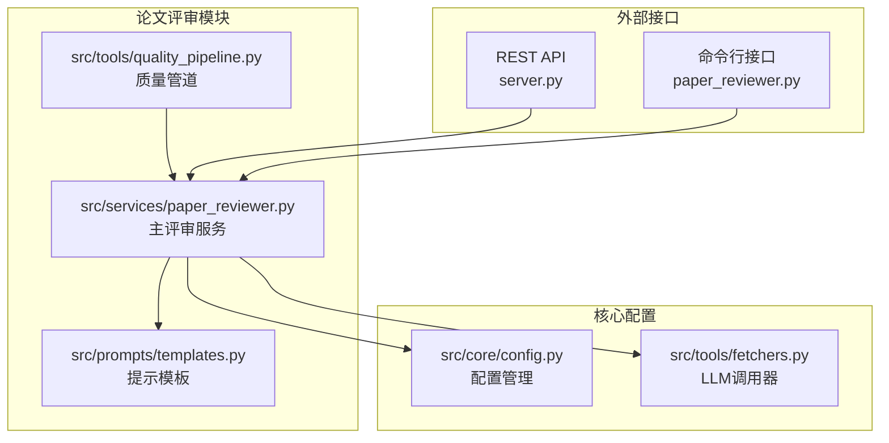
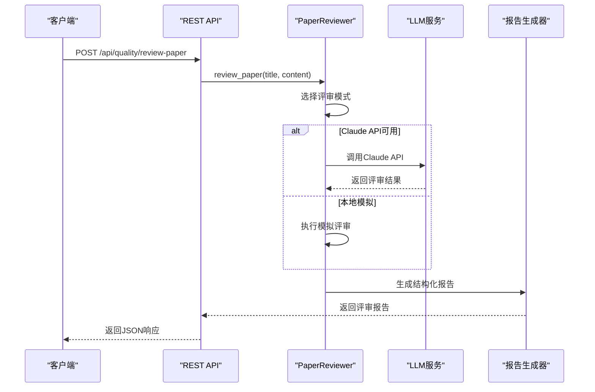
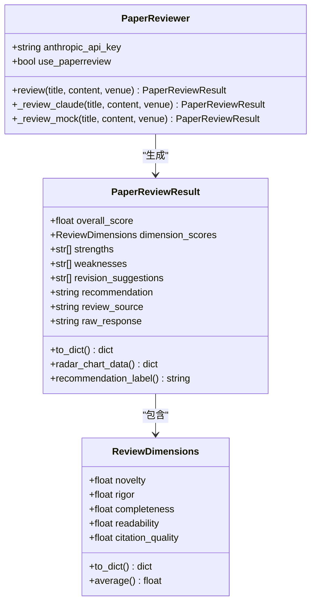
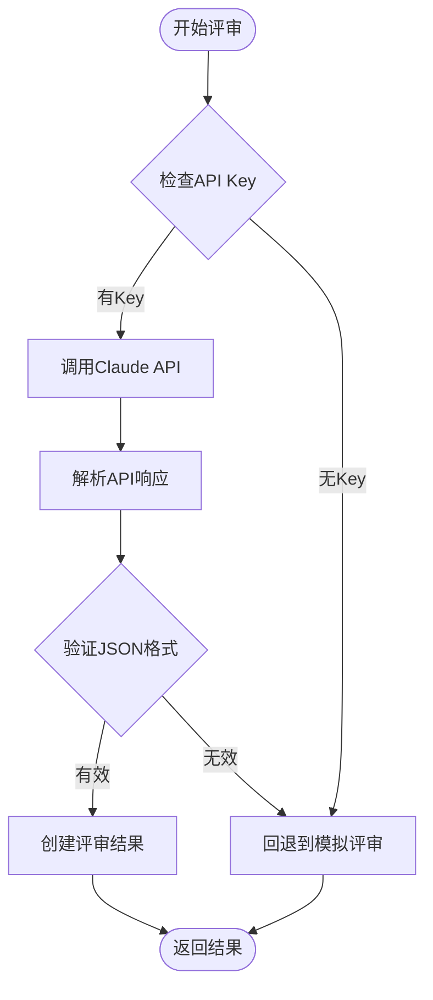
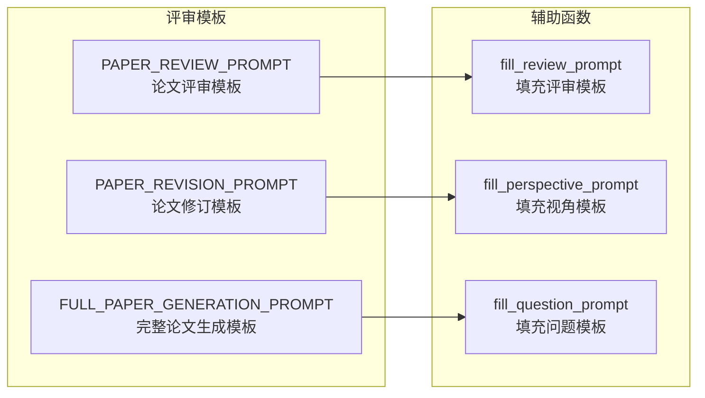
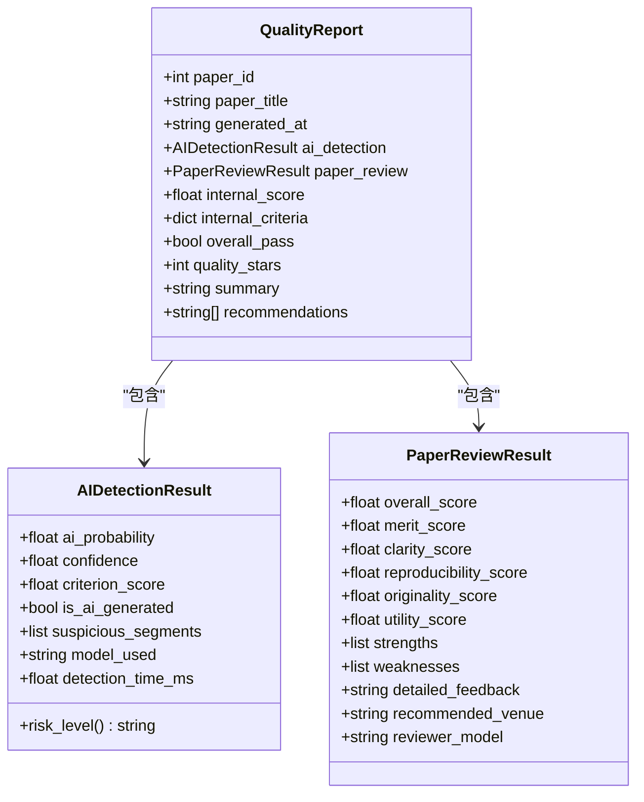
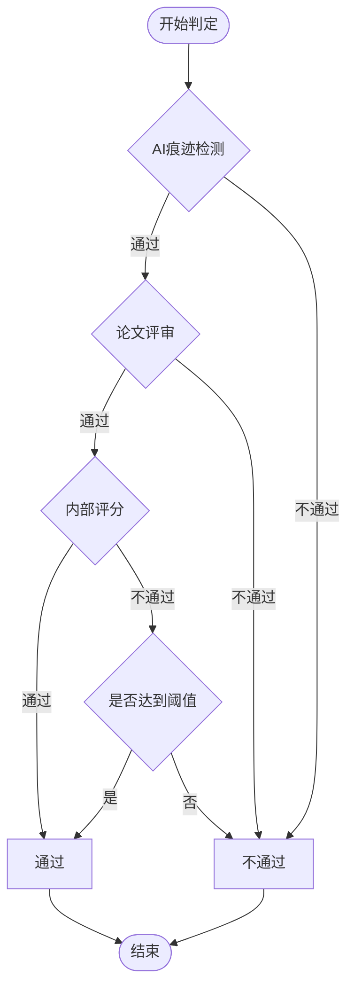
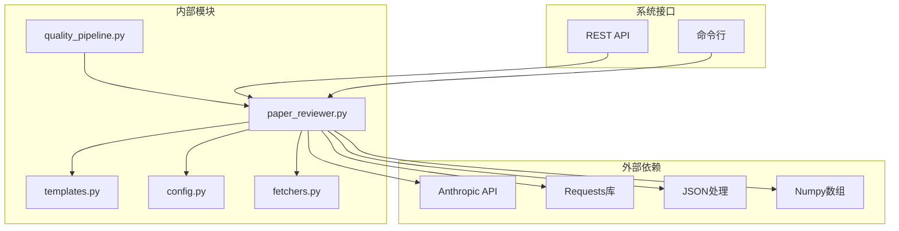

# 论文评审模块

<cite>
**本文档引用的文件**
- [paper_reviewer.py](file://src/services/paper_reviewer.py)
- [templates.py](file://src/prompts/templates.py)
- [quality_pipeline.py](file://src/tools/quality_pipeline.py)
- [config.py](file://src/core/config.py)
- [fetchers.py](file://src/tools/fetchers.py)
- [README.md](file://README.md)
- [requirements.txt](file://requirements.txt)
</cite>

## 目录
1. [简介](#简介)
2. [项目结构](#项目结构)
3. [核心组件](#核心组件)
4. [架构概览](#架构概览)
5. [详细组件分析](#详细组件分析)
6. [依赖分析](#依赖分析)
7. [性能考虑](#性能考虑)
8. [故障排除指南](#故障排除指南)
9. [结论](#结论)
10. [附录](#附录)

## 简介

paperwriterAI的论文评审模块是一个功能完整的学术论文质量评估系统，提供了多种评审方式和维度分析。该模块支持Claude API评审、本地模拟评审等多种模式，能够对论文进行全面的学术质量评估。

该模块的核心设计理念是提供多层次的论文质量评估，包括学术价值、清晰度、可复现性、原创性、实用性等维度，并通过结构化的评审报告帮助作者改进论文质量。

## 项目结构

论文评审模块位于paperwriterAI项目的服务层，与Prompts模板系统、质量管道、配置管理等核心组件紧密集成。



**图表来源**
- [paper_reviewer.py:1-473](file://src/services/paper_reviewer.py#L1-L473)
- [quality_pipeline.py:1-807](file://src/tools/quality_pipeline.py#L1-L807)
- [templates.py:1-758](file://src/prompts/templates.py#L1-L758)

**章节来源**
- [paper_reviewer.py:1-50](file://src/services/paper_reviewer.py#L1-L50)
- [README.md:420-500](file://README.md#L420-L500)

## 核心组件

论文评审模块包含以下核心组件：

### 1. PaperReviewer类（主评审服务）

PaperReviewer类是论文评审模块的核心，提供了完整的论文评审功能，支持多种评审模式和维度分析。

### 2. 评审维度系统

系统定义了7个核心评审维度，每个维度都有明确的评分标准和权重分配。

### 3. PROMPT模板系统

集成了多种预定义的评审提示模板，支持不同场景和需求的论文评审。

### 4. 质量报告生成器

负责将评审结果转换为结构化的报告格式，便于用户理解和使用。

**章节来源**
- [paper_reviewer.py:34-112](file://src/services/paper_reviewer.py#L34-L112)
- [templates.py:576-638](file://src/prompts/templates.py#L576-L638)

## 架构概览

论文评审模块采用分层架构设计，实现了评审逻辑与展示逻辑的分离。



**图表来源**
- [paper_reviewer.py:183-274](file://src/services/paper_reviewer.py#L183-L274)
- [quality_pipeline.py:441-603](file://src/tools/quality_pipeline.py#L441-L603)

## 详细组件分析

### PaperReviewer类实现详解

PaperReviewer类是论文评审模块的核心实现，提供了完整的评审功能和服务。

#### 数据结构设计



**图表来源**
- [paper_reviewer.py:34-112](file://src/services/paper_reviewer.py#L34-L112)
- [paper_reviewer.py:441-603](file://src/services/paper_reviewer.py#L441-L603)

#### 评审维度设计

系统定义了7个核心评审维度，每个维度都有明确的含义和评分标准：

| 维度 | 英文名称 | 评分范围 | 设计理念 | 评分标准 |
|------|----------|----------|----------|----------|
| 原创性 | Novelty | 1-10 | 论文的独特贡献程度 | 创新点数量、突破性程度、与现有工作的差异化 |
| 严谨性 | Rigor | 1-10 | 研究方法的科学性和逻辑严密性 | 方法论合理性、实验设计严谨性、数据分析准确性 |
| 完整性 | Completeness | 1-10 | 文献综述、实验验证的完整性 | 文献覆盖度、实验设置完整性、结果分析深度 |
| 可读性 | Readability | 1-10 | 写作清晰度、结构合理性 | 逻辑连贯性、表达清晰度、结构组织 |
| 引用质量 | Citation Quality | 1-10 | 参考文献的相关性和时效性 | 文献相关性、时效性、引用格式规范 |
| 实验设计 | Experimental Design | 1-10 | 实验的合理性和可复现性 | 实验设置合理性、数据质量、方法可复现性 |
| 写作规范 | Writing Quality | 1-10 | 格式规范、语法正确性 | 语言表达、格式规范、学术写作标准 |

#### 评审模式实现

系统提供了三种评审模式，满足不同的使用场景：

##### 1. Claude API评审模式



**图表来源**
- [paper_reviewer.py:183-210](file://src/services/paper_reviewer.py#L183-L210)
- [paper_reviewer.py:241-274](file://src/services/paper_reviewer.py#L241-L274)

##### 2. 本地模拟评审模式

模拟评审模式基于论文内容的特征进行评分，主要考虑因素包括：

- **内容长度**：字数越多，基础分越高
- **结构完整性**：包含摘要、引言、结论等关键部分
- **学术元素**：是否包含数学公式、图表等学术元素
- **随机性**：添加适度的随机性以模拟人工评审的不确定性

##### 3. 批量评审功能

系统支持对论文的不同章节进行单独评审，然后汇总生成整体评价：

- **章节识别**：自动识别论文的章节结构
- **独立评审**：对每个章节单独进行评审
- **综合分析**：结合章节评审结果生成整体评价

**章节来源**
- [paper_reviewer.py:159-181](file://src/services/paper_reviewer.py#L159-L181)
- [paper_reviewer.py:276-302](file://src/services/paper_reviewer.py#L276-L302)
- [paper_reviewer.py:307-369](file://src/services/paper_reviewer.py#L307-L369)

### PROMPT模板系统

论文评审模块集成了多种预定义的提示模板，支持不同场景的论文评审需求。

#### 模板结构设计



**图表来源**
- [templates.py:576-638](file://src/prompts/templates.py#L576-L638)
- [templates.py:736-747](file://src/prompts/templates.py#L736-L747)

#### 评审维度模板

评审模板定义了6个核心评审维度：

| 维度 | 英文名称 | 评分范围 | 评审重点 |
|------|----------|----------|----------|
| 学术价值 | Merit | 1-10 | 论文的学术贡献是否重要，创新点是否明确 |
| 清晰度 | Clarity | 1-10 | 论文的写作是否清晰易懂，结构是否合理 |
| 可复现性 | Reproducibility | 1-10 | 实验设置是否描述充分，方法是否可复现 |
| 原创性 | Originality | 1-10 | 是否有独特贡献，还是仅仅是增量改进 |
| 实用性 | Utility | 1-10 | 研究结果对领域是否有实际应用价值 |
| 综合评分 | Overall | 1-10 | 综合以上维度的总体评价 |

#### 模板参数处理

模板系统提供了灵活的参数处理机制：

- **标题处理**：支持中英文标题的自动识别和处理
- **内容截断**：自动处理超长内容，避免API限制
- **格式标准化**：统一输出格式，确保JSON结构的一致性

**章节来源**
- [templates.py:576-619](file://src/prompts/templates.py#L576-L619)
- [templates.py:736-738](file://src/prompts/templates.py#L736-L738)

### 质量报告生成器

质量报告生成器负责将评审结果转换为结构化的报告格式，便于用户理解和使用。

#### 报告结构设计



**图表来源**
- [quality_pipeline.py:64-81](file://src/tools/quality_pipeline.py#L64-L81)
- [quality_pipeline.py:26-45](file://src/tools/quality_pipeline.py#L26-L45)

#### 通过判定机制

质量报告生成器实现了多维度的通过判定机制：



**图表来源**
- [quality_pipeline.py:624-644](file://src/tools/quality_pipeline.py#L624-L644)

#### 质量星级计算

质量星级是基于多个因素综合计算得出的：

- **AI痕迹检测**：AI概率低于阈值获得星级加分
- **论文评审**：综合评分按比例转换为星级
- **内部评分**：额外的质量评估因素

**章节来源**
- [quality_pipeline.py:609-742](file://src/tools/quality_pipeline.py#L609-L742)

## 依赖分析

论文评审模块的依赖关系复杂而有序，体现了良好的模块化设计。



**图表来源**
- [paper_reviewer.py:18-32](file://src/services/paper_reviewer.py#L18-L32)
- [requirements.txt:4-6](file://requirements.txt#L4-L6)

### 外部依赖管理

系统对外部依赖进行了严格的管理和控制：

- **Anthropic API**：用于Claude API调用
- **Requests库**：HTTP请求处理
- **JSON处理**：数据序列化和反序列化
- **Numpy**：数值计算支持

### 内部模块耦合

各内部模块之间保持松耦合的设计：

- **PaperReviewer**：独立的评审逻辑
- **模板系统**：与评审逻辑分离
- **配置管理**：提供统一的配置接口
- **LLM调用器**：抽象化的LLM访问层

**章节来源**
- [requirements.txt:1-39](file://requirements.txt#L1-L39)
- [paper_reviewer.py:18-32](file://src/services/paper_reviewer.py#L18-L32)

## 性能考虑

论文评审模块在设计时充分考虑了性能优化和资源管理。

### API调用优化

- **超时控制**：所有API调用都设置了合理的超时时间
- **错误重试**：在网络不稳定时提供自动重试机制
- **连接池**：复用HTTP连接减少建立成本

### 内存管理

- **内容截断**：自动截断超长论文内容避免内存溢出
- **分批处理**：支持大论文的分批评审
- **垃圾回收**：及时释放不再使用的对象

### 缓存策略

- **模板缓存**：预编译的提示模板减少重复解析
- **API响应缓存**：对相同请求的结果进行缓存
- **模型权重缓存**：本地检测模型的权重缓存

## 故障排除指南

### 常见问题及解决方案

#### 1. API Key配置问题

**问题症状**：
- 评审结果为模拟模式
- 系统显示API调用失败

**解决方案**：
1. 检查环境变量是否正确设置
2. 验证API Key的有效性
3. 确认网络连接正常

#### 2. 评审结果异常

**问题症状**：
- 评审分数不合理
- 返回格式错误

**解决方案**：
1. 检查输入内容的格式
2. 确认论文内容符合要求
3. 查看系统日志获取详细错误信息

#### 3. 性能问题

**问题症状**：
- 评审过程耗时过长
- 系统响应缓慢

**解决方案**：
1. 优化论文内容长度
2. 检查网络连接质量
3. 考虑使用本地模拟模式

**章节来源**
- [paper_reviewer.py:200-210](file://src/services/paper_reviewer.py#L200-L210)
- [paper_reviewer.py:230-238](file://src/services/paper_reviewer.py#L230-L238)

## 结论

paperwriterAI的论文评审模块是一个功能完整、设计合理的学术论文质量评估系统。它通过多层次的评审维度、灵活的评审模式和结构化的报告生成，为用户提供了一站式的论文质量评估解决方案。

该模块的主要优势包括：

1. **多模式支持**：支持Claude API、本地模拟等多种评审模式
2. **维度全面**：涵盖学术价值、清晰度、可复现性等多个维度
3. **结构化输出**：提供标准化的评审报告格式
4. **易于集成**：提供REST API和命令行接口
5. **性能优化**：具备良好的性能表现和资源管理

通过持续的优化和改进，该模块将继续为学术研究和论文写作提供强有力的支持。

## 附录

### API使用示例

#### REST API调用示例

```javascript
// 使用REST API进行论文评审
const response = await fetch('/api/quality/review-paper', {
    method: 'POST',
    headers: {
        'Content-Type': 'application/json'
    },
    body: JSON.stringify({
        title: '论文标题',
        content: '论文内容',
        venue: 'ICLR'
    })
});

const result = await response.json();
console.log('评审结果:', result);
```

#### 命令行使用示例

```bash
# 基本评审
python src/services/paper_reviewer.py paper.txt --title "论文标题"

# 分章节评审
python src/services/paper_reviewer.py paper.txt --sections --format json

# 指定输出格式
python src/services/paper_reviewer.py paper.txt --format text
```

### 配置指南

#### 环境变量配置

```bash
# 设置Anthropic API Key（用于Claude评审）
export ANTHROPIC_API_KEY="sk-ant-xxxxxxxx"

# 设置DeepSeek API Key（备用）
export DEEPSEEK_API_KEY="sk-xxxxxxxx"

# 设置Minimax API Key（主用）
export MINIMAX_API_KEY="gw-xxxxxxxx"
```

#### 配置文件设置

```json
{
    "llm": {
        "provider": "anthropic",
        "model": "claude-sonnet-4-20250514",
        "temperature": 0.3,
        "max_tokens": 2048
    }
}
```

**章节来源**
- [README.md:553-568](file://README.md#L553-L568)
- [paper_reviewer.py:408-473](file://src/services/paper_reviewer.py#L408-L473)