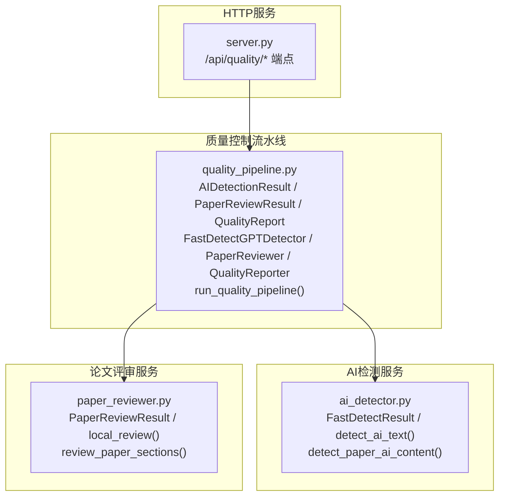
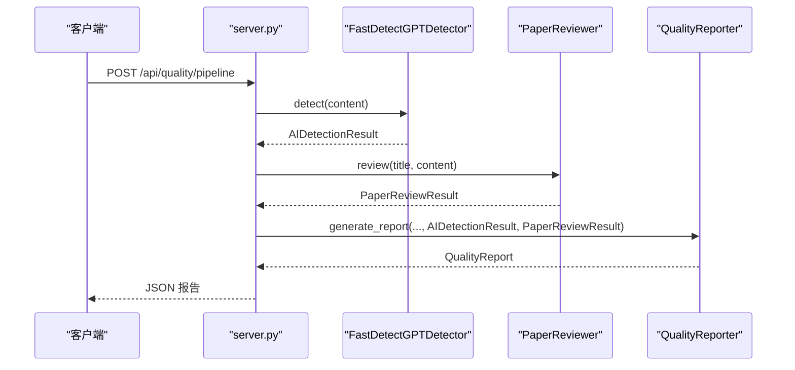
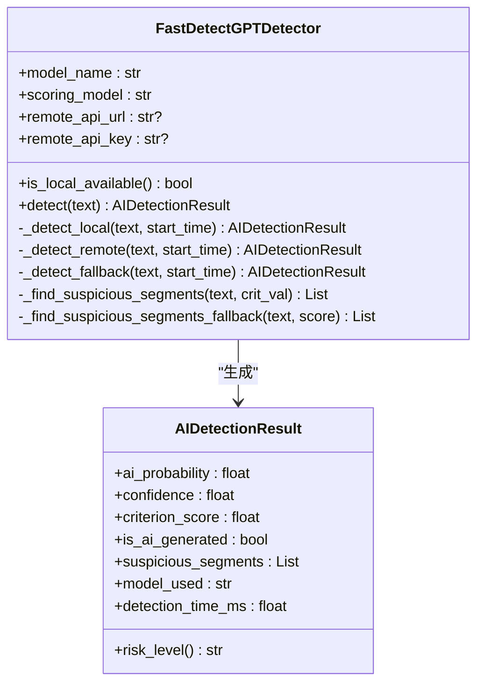
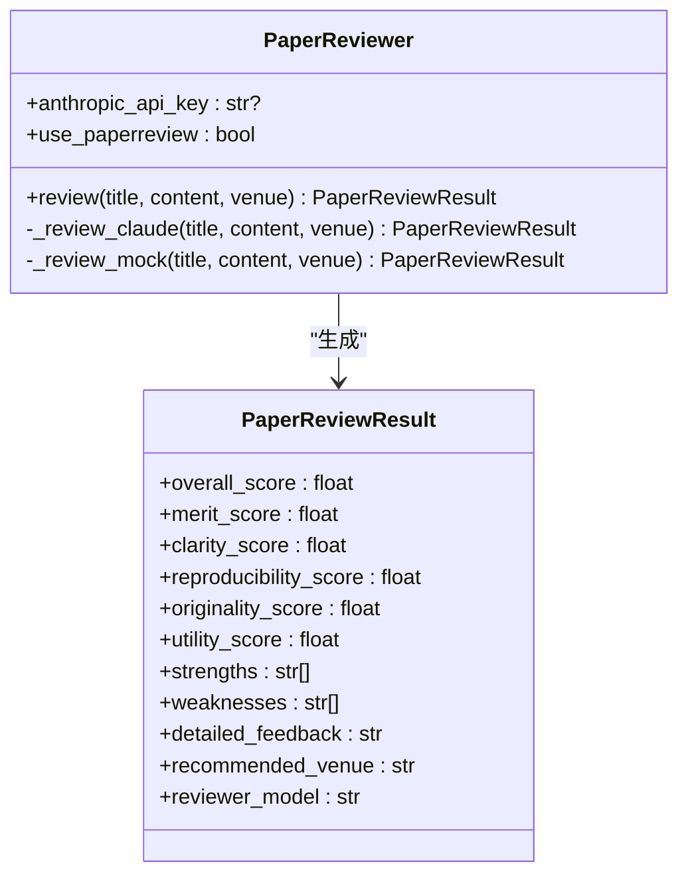
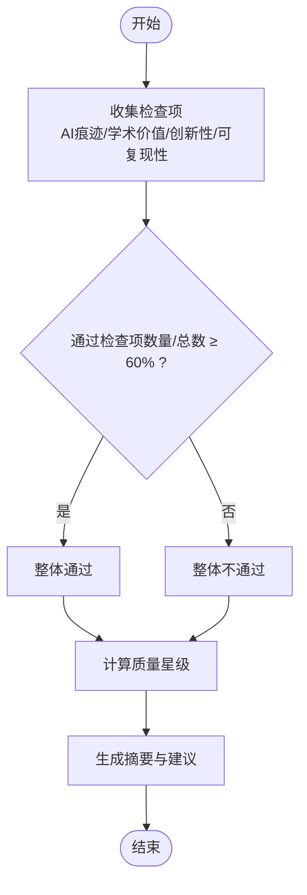
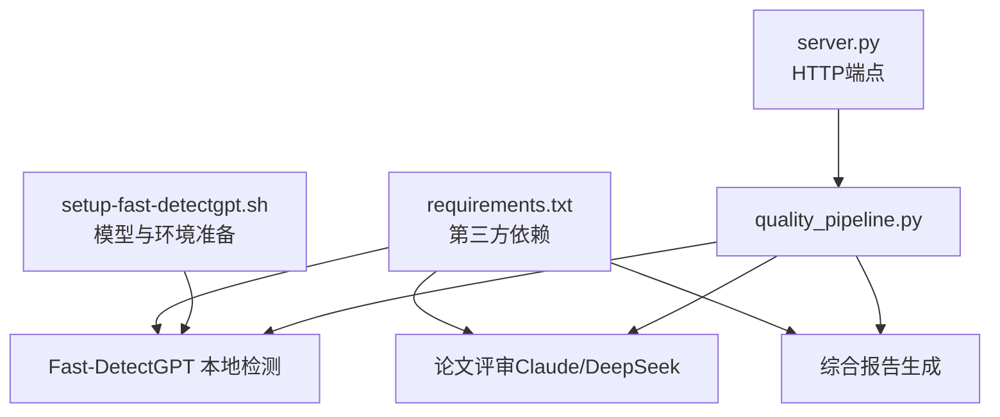

# 质量控制流水线

<cite>
**本文档引用的文件**
- [src/tools/quality_pipeline.py](file://src/tools/quality_pipeline.py)
- [src/services/ai_detector.py](file://src/services/ai_detector.py)
- [src/services/paper_reviewer.py](file://src/services/paper_reviewer.py)
- [server.py](file://server.py)
- [setup-fast-detectgpt.sh](file://setup-fast-detectgpt.sh)
- [requirements.txt](file://requirements.txt)
- [docs/API_SPEC.md](file://docs/API_SPEC.md)
</cite>

## 目录
1. [简介](#简介)
2. [项目结构](#项目结构)
3. [核心组件](#核心组件)
4. [架构总览](#架构总览)
5. [详细组件分析](#详细组件分析)
6. [依赖关系分析](#依赖关系分析)
7. [性能考虑](#性能考虑)
8. [故障排除指南](#故障排除指南)
9. [结论](#结论)
10. [附录](#附录)

## 简介
本文件面向paperwriterAI的质量控制流水线，系统性阐述AI痕迹检测（Fast-DetectGPT本地检测器）、论文评审（Claude API/PaperReview.ai）与综合报告生成的完整实现。重点包括：
- AIDetectionResult、PaperReviewResult、QualityReport等数据结构的设计与使用
- FastDetectGPTDetector的三种检测模式（本地模型、远程API、统计降级）
- PaperReviewer的评审流程与PaperReview.ai外部评分对接
- QualityReporter的综合评分算法与报告生成策略
- 完整的API接口说明、配置参数、使用示例与性能优化建议

## 项目结构
质量控制流水线位于src/tools/quality_pipeline.py，配套的AI检测与评审服务分别位于src/services/ai_detector.py与src/services/paper_reviewer.py。HTTP服务端点集中在server.py，提供REST API以调用质量流水线。

**图表来源**
- [src/tools/quality_pipeline.py:26-81](file://src/tools/quality_pipeline.py#L26-L81)
- [src/services/ai_detector.py:30-54](file://src/services/ai_detector.py#L30-L54)
- [src/services/paper_reviewer.py:50-112](file://src/services/paper_reviewer.py#L50-L112)
- [server.py:5200-5399](file://server.py#L5200-L5399)

**章节来源**
- [src/tools/quality_pipeline.py:1-807](file://src/tools/quality_pipeline.py#L1-L807)
- [src/services/ai_detector.py:1-358](file://src/services/ai_detector.py#L1-L358)
- [src/services/paper_reviewer.py:1-473](file://src/services/paper_reviewer.py#L1-L473)
- [server.py:5200-5579](file://server.py#L5200-L5579)

## 核心组件
- AIDetectionResult：封装Fast-DetectGPT检测结果，包含AI概率、置信度、判据值、风险等级、可疑段落、模型标识与检测耗时。
- PaperReviewResult：封装论文评审结果，包含综合评分与多维度评分、优缺点、详细反馈、推荐发表会议等。
- QualityReport：综合质量报告，整合AI检测与论文评审结果，输出整体通过判定、质量星级、摘要与改进建议。

上述数据结构在质量流水线中承担“输入-处理-输出”的关键角色，贯穿Step 4（AI痕迹检测）与Step 5（论文评审），并在Step 6（综合报告）统一呈现。

**章节来源**
- [src/tools/quality_pipeline.py:26-81](file://src/tools/quality_pipeline.py#L26-L81)

## 架构总览
质量控制流水线采用“模块化+可插拔”的设计：AI检测模块、论文评审模块与报告生成模块彼此解耦，既支持独立调用，也可通过run_quality_pipeline串联执行。HTTP层提供REST API，便于前端或外部系统集成。

**图表来源**
- [server.py:5200-5258](file://server.py#L5200-L5258)
- [src/tools/quality_pipeline.py:747-800](file://src/tools/quality_pipeline.py#L747-L800)

**章节来源**
- [server.py:5200-5258](file://server.py#L5200-L5258)
- [src/tools/quality_pipeline.py:747-800](file://src/tools/quality_pipeline.py#L747-L800)

## 详细组件分析

### FastDetectGPTDetector（AI痕迹检测）
- 三种检测模式：
  - 本地模型：优先使用，基于transformers加载gpt-neo-2.7B/gpt-j-6B/Llama3-8B，计算条件概率曲率并映射为AI概率。
  - 远程API：调用远端Fast-DetectGPT服务，适合无本地GPU或希望使用云端资源的场景。
  - 统计降级：在本地不可用且无远端API时，基于统计特征（套话、词汇丰富度、句子长度方差等）进行粗略判断。
- 关键能力：
  - 风险等级划分（低/中/高）
  - 可疑段落定位（基于AI套话标记）
  - 分段检测与整体概率聚合
- 性能与稳定性：
  - 本地模式对显存敏感，gpt-neo-2.7B在MPS上OOM，建议CPU或CUDA环境。
  - 降级模式保证可用性，但置信度较低。

**图表来源**
- [src/tools/quality_pipeline.py:87-434](file://src/tools/quality_pipeline.py#L87-L434)
- [src/tools/quality_pipeline.py:26-45](file://src/tools/quality_pipeline.py#L26-L45)

**章节来源**
- [src/tools/quality_pipeline.py:87-434](file://src/tools/quality_pipeline.py#L87-L434)

### PaperReviewer（论文评审）
- 评审维度（6维）：Merits、Clarity、Reproducibility、Originality、Utility、Overall。
- 评审来源：
  - Claude API（优先）：通过anthropic SDK调用claude-sonnet-4-20250514。
  - 降级方案：无API Key时返回模拟评审结果，便于离线测试。
- 分章节评审：自动识别章节并分别评分，再汇总总体报告。
- 输出PaperReviewResult，包含维度得分、优缺点、详细反馈与推荐会议。

**图表来源**
- [src/tools/quality_pipeline.py:441-603](file://src/tools/quality_pipeline.py#L441-L603)
- [src/tools/quality_pipeline.py:48-61](file://src/tools/quality_pipeline.py#L48-L61)

**章节来源**
- [src/tools/quality_pipeline.py:441-603](file://src/tools/quality_pipeline.py#L441-L603)

### QualityReporter（综合报告生成）
- 综合判定规则：
  - AI痕迹：ai_probability < 0.6视为通过
  - 学术价值：overall_score ≥ 5.0
  - 创新性：originality_score ≥ 4.0
  - 可复现性：reproducibility_score ≥ 4.0
  - 通过阈值：≥60%的检查项通过即整体通过
- 质量星级：基于AI概率与评审综合评分计算，1-5星
- 输出QualityReport，包含摘要与改进建议

**图表来源**
- [src/tools/quality_pipeline.py:609-694](file://src/tools/quality_pipeline.py#L609-L694)

**章节来源**
- [src/tools/quality_pipeline.py:609-694](file://src/tools/quality_pipeline.py#L609-L694)

### API接口说明
- /api/quality/pipeline：运行完整质量流水线（AI检测+论文评审），返回综合报告
- /api/quality/detect-ai：仅运行AI痕迹检测
- /api/quality/review-paper：仅运行论文评审（需提供ANTHROPIC_API_KEY）
- /api/papers/{paper_id}/quality-report：根据paper_id获取质量报告
- /api/papers/{paper_id}/submit-review：提交论文PDF至PaperReview.ai
- /api/papers/{paper_id}/review-status：一次性查询PaperReview.ai评分状态
- /api/papers/{paper_id}/poll-review：轮询PaperReview.ai评分结果

请求体与响应体详见server.py中的路由实现与注释。

**章节来源**
- [server.py:5200-5579](file://server.py#L5200-L5579)

## 依赖关系分析
- 第三方依赖：openai、anthropic、transformers、torch、accelerate、scikit-learn等
- 本地安装：setup-fast-detectgpt.sh提供Fast-DetectGPT模型与环境准备脚本
- 服务间耦合：质量流水线模块内聚，HTTP层仅负责编排与序列化

**图表来源**
- [requirements.txt:1-39](file://requirements.txt#L1-L39)
- [setup-fast-detectgpt.sh:1-149](file://setup-fast-detectgpt.sh#L1-L149)
- [server.py:5200-5579](file://server.py#L5200-L5579)
- [src/tools/quality_pipeline.py:1-807](file://src/tools/quality_pipeline.py#L1-L807)

**章节来源**
- [requirements.txt:1-39](file://requirements.txt#L1-L39)
- [setup-fast-detectgpt.sh:1-149](file://setup-fast-detectgpt.sh#L1-L149)

## 性能考虑
- AI检测
  - 本地模式建议使用gpt-j-6B或Llama3-8B（需GPU），gpt-neo-2.7B在MPS上可能OOM
  - 通过分段检测减少上下文长度，提高吞吐
  - 降级模式适合大批量筛查，但准确率较低
- 论文评审
  - Claude API受速率限制，建议控制并发与重试策略
  - 评审内容截断避免超出上下文窗口
- 综合报告
  - 检查项权重可根据业务需求调整
  - 质量星级计算可引入动态阈值

[本节为通用指导，无需特定文件引用]

## 故障排除指南
- Fast-DetectGPT未安装或模型缺失
  - 使用setup-fast-detectgpt.sh初始化vendor/fast-detect-gpt并下载所需模型
  - 确认transformers与torch版本满足要求
- Claude API密钥无效
  - 确认ANTHROPIC_API_KEY环境变量或请求体参数正确
  - 检查网络连通性与API配额
- 本地检测失败回退
  - 若本地模型加载异常，系统自动切换至统计降级模式
- PaperReview.ai提交失败
  - 检查PDF路径与邮箱参数
  - 使用/status轮询或一次性check接口确认状态

**章节来源**
- [setup-fast-detectgpt.sh:1-149](file://setup-fast-detectgpt.sh#L1-L149)
- [server.py:5394-5579](file://server.py#L5394-L5579)

## 结论
paperwriterAI的质量控制流水线通过模块化设计实现了AI痕迹检测、论文评审与综合报告的自动化闭环。FastDetectGPTDetector提供多模式检测能力，PaperReviewer结合Claude API与降级方案保障评审质量，QualityReporter以可配置的判定规则生成权威报告。配合完善的HTTP API与部署脚本，系统可在不同硬件与网络环境下稳定运行，并支持进一步扩展与定制。

[本节为总结性内容，无需特定文件引用]

## 附录

### 使用示例（基于API）
- 运行完整质量流水线
  - POST /api/quality/pipeline
  - 请求体包含paper_id/content/title、run_ai_detection/run_paper_review、anthropic_api_key等
- 仅运行AI检测
  - POST /api/quality/detect-ai
  - 请求体包含content
- 仅运行论文评审
  - POST /api/quality/review-paper
  - 请求体包含title、content、anthropic_api_key
- 获取论文质量报告
  - GET /api/papers/{paper_id}/quality-report
- 提交PaperReview.ai评分
  - POST /api/papers/{paper_id}/submit-review
  - 请求体包含email、venue、pdf_path（可选）

**章节来源**
- [server.py:5200-5579](file://server.py#L5200-L5579)
- [docs/API_SPEC.md:1-436](file://docs/API_SPEC.md#L1-L436)