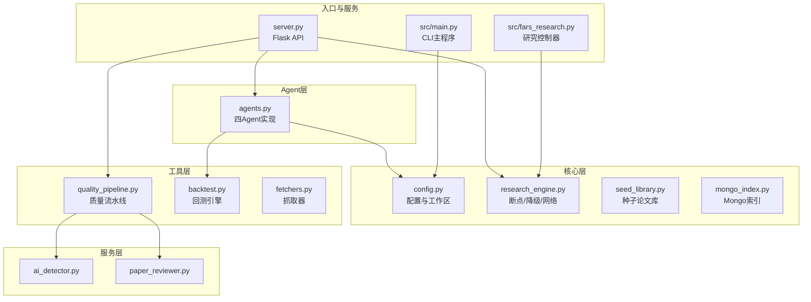
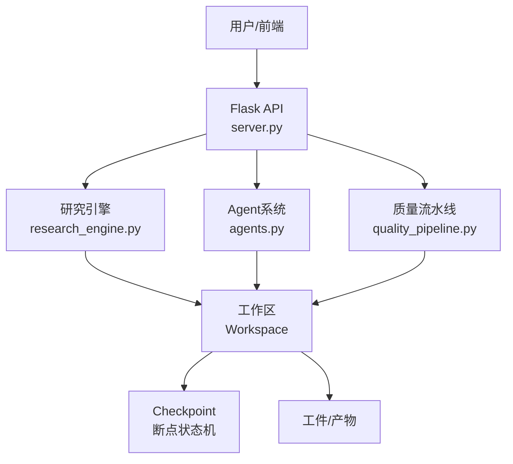
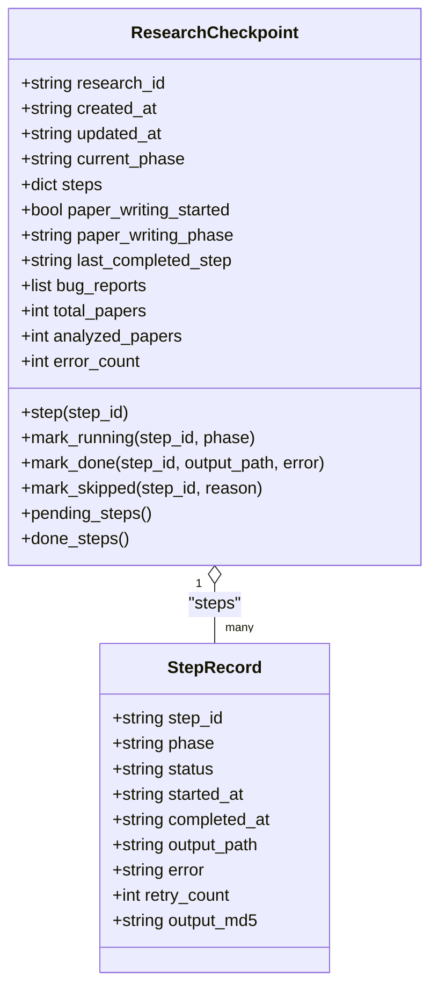
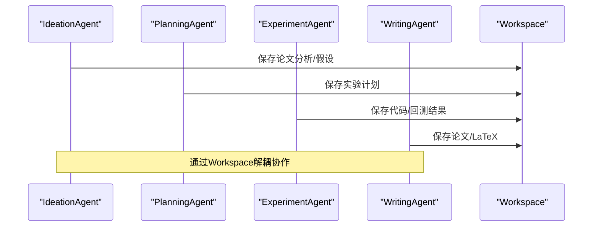
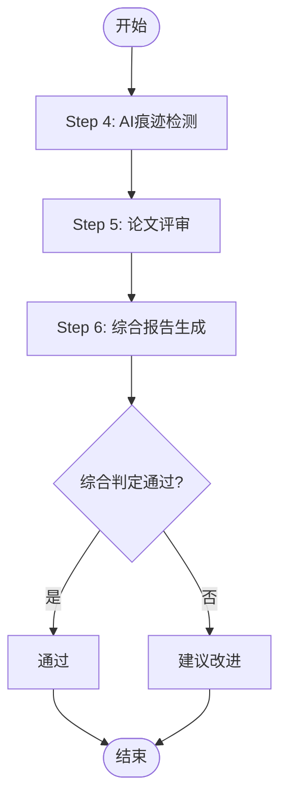
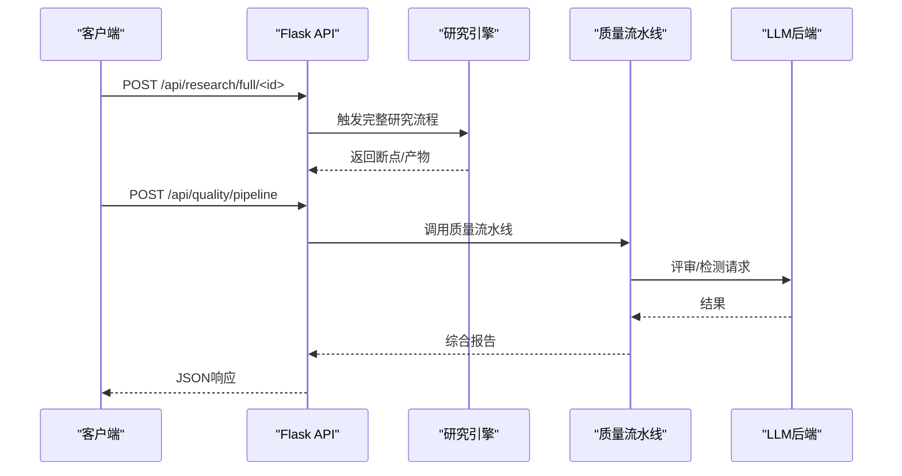
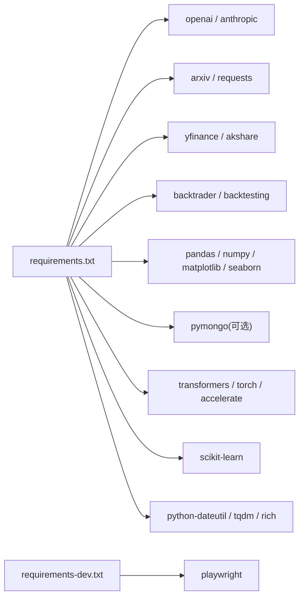

# 开发指南

<cite>
**本文引用的文件**
- [README.md](file://README.md)
- [requirements.txt](file://requirements.txt)
- [requirements-dev.txt](file://requirements-dev.txt)
- [src/main.py](file://src/main.py)
- [src/fars_research.py](file://src/fars_research.py)
- [src/core/config.py](file://src/core/config.py)
- [src/core/research_engine.py](file://src/core/research_engine.py)
- [src/agents/agents.py](file://src/agents/agents.py)
- [src/tools/quality_pipeline.py](file://src/tools/quality_pipeline.py)
- [server.py](file://server.py)
</cite>

## 目录
1. [简介](#简介)
2. [项目结构](#项目结构)
3. [核心组件](#核心组件)
4. [架构总览](#架构总览)
5. [详细组件分析](#详细组件分析)
6. [依赖关系分析](#依赖关系分析)
7. [性能考量](#性能考量)
8. [故障排查指南](#故障排查指南)
9. [结论](#结论)
10. [附录](#附录)

## 简介
本指南面向paperwriterAI项目的开发者，提供从环境搭建、代码结构、编码规范、测试策略到扩展开发（插件、Agent、工具模块）的全流程开发手册。内容涵盖：
- 开发环境与依赖安装
- 项目结构与模块职责
- 核心架构与设计模式
- 扩展开发与最佳实践
- 调试技巧、性能分析与错误处理
- 贡献流程与代码审查标准
- API变更与向后兼容性
- 开发工具链与IDE配置建议

## 项目结构
项目采用“分层+功能域”混合组织方式：
- 核心层（src/core）：配置、研究引擎、数据注册表、Mongo索引、种子库、PDF编译、研究运行器等
- Agent层（src/agents）：多智能体（创意、规划、实验、写作、评审）
- 工具层（src/tools）：回测、质量流水线（AI检测、论文评审、综合报告）、文献综述引擎、抓取器
- Prompts（src/prompts）：提示模板
- 服务层（src/services）：AI检测器、论文评审器
- 顶层入口（src/main.py、src/fars_research.py）
- Web服务（server.py、server_fars.py）
- 文档与前端（docs/）

**图表来源**
- [src/core/config.py:254-384](file://src/core/config.py#L254-L384)
- [src/core/research_engine.py:1-120](file://src/core/research_engine.py#L1-L120)
- [src/agents/agents.py:23-738](file://src/agents/agents.py#L23-L738)
- [src/tools/quality_pipeline.py:1-120](file://src/tools/quality_pipeline.py#L1-L120)
- [src/main.py:34-100](file://src/main.py#L34-L100)
- [src/fars_research.py:335-484](file://src/fars_research.py#L335-L484)
- [server.py:75-120](file://server.py#L75-L120)

**章节来源**
- [README.md: 420-500:420-500](file://README.md#L420-L500)

## 核心组件
- 配置与工作区（config.py）
  - 研究方向枚举、LLM提供商配置、工作区目录结构、日志与备份管理
- 研究引擎（research_engine.py）
  - Checkpoint状态机、断点续分析、Graceful Degradation、作者/引用网络、多论文比对
- Agent系统（agents.py）
  - Ideation/Planning/Experiment/Writing/Critique五Agent协作
- 质量流水线（quality_pipeline.py）
  - Fast-DetectGPT本地/远程检测、Claude/PaperReview评审、综合报告生成
- Web服务（server.py）
  - Flask API路由、LLM调用封装、调试上报、LLM用量统计

**章节来源**
- [src/core/config.py: 18-563:18-563](file://src/core/config.py#L18-L563)
- [src/core/research_engine.py: 55-190:55-190](file://src/core/research_engine.py#L55-L190)
- [src/agents/agents.py: 23-738:23-738](file://src/agents/agents.py#L23-L738)
- [src/tools/quality_pipeline.py: 26-800:26-800](file://src/tools/quality_pipeline.py#L26-L800)
- [server.py: 75-800:75-800](file://server.py#L75-L800)

## 架构总览
系统采用“研究工作流 + 多Agent协作 + 质量控制”的三层架构：
- 研究工作流：论文扫描、视角分析、大纲生成、文献综述、论文写作
- 多Agent协作：各Agent负责不同阶段任务，通过Workspace共享中间产物
- 质量控制：AI痕迹检测、论文评审、综合报告，贯穿写作与迭代

**图表来源**
- [server.py: 75-120:75-120](file://server.py#L75-L120)
- [src/core/research_engine.py: 86-L190:86-190](file://src/core/research_engine.py#L86-L190)
- [src/tools/quality_pipeline.py: 87-L120:87-120](file://src/tools/quality_pipeline.py#L87-L120)
- [src/agents/agents.py: 23-L70:23-70](file://src/agents/agents.py#L23-L70)

## 详细组件分析

### 组件A：研究引擎（容错与断点）
- 核心机制
  - Checkpoint状态机：每步完成后持久化，支持pending/running/done/failed/skipped
  - Graceful Degradation：卡顿时并发写作+Bug报告，保证产出
  - 断点续分析：按阶段顺序恢复，生成增量报告
  - 作者/引用网络：跨论文关系与主题聚类
- 关键流程
  - analyze_paper/analyze_all_papers：单/批量论文分析
  - writing_with_degradation：降级写作
  - resume_research：断点续分析
  - build_author_network：作者网络构建
- 数据结构
  - ResearchCheckpoint/StepRecord：断点与步骤记录
  - ResearchPhase/StepStatus：阶段与状态枚举

**图表来源**
- [src/core/research_engine.py: 86-L190:86-190](file://src/core/research_engine.py#L86-L190)

**章节来源**
- [src/core/research_engine.py: 246-L384:246-384](file://src/core/research_engine.py#L246-L384)
- [src/core/research_engine.py: 430-L487:430-487](file://src/core/research_engine.py#L430-L487)
- [src/core/research_engine.py: 494-L581:494-581](file://src/core/research_engine.py#L494-L581)
- [src/core/research_engine.py: 641-L736:641-736](file://src/core/research_engine.py#L641-L736)

### 组件B：Agent系统（多智能体协作）
- 四Agent职责
  - Ideation Agent：论文搜索、分析、假设生成
  - Planning Agent：实验计划制定与优化
  - Experiment Agent：代码生成、回测执行、调试修复、结果评估
  - Writing Agent：论文撰写、图表生成、LaTeX输出
  - Critique Agent：策略评估与反思
- 协作模式
  - 通过Workspace共享中间产物（ideas/plans/experiments/papers）
  - LLM调用统一由LLMCaller封装，支持主备与本地Ollama备选

**图表来源**
- [src/agents/agents.py: 23-L738:23-738](file://src/agents/agents.py#L23-L738)
- [src/core/config.py: 254-L384:254-384](file://src/core/config.py#L254-L384)

**章节来源**
- [src/agents/agents.py: 23-L195:23-195](file://src/agents/agents.py#L23-L195)
- [src/agents/agents.py: 197-L497:197-497](file://src/agents/agents.py#L197-L497)
- [src/agents/agents.py: 499-L738:499-738](file://src/agents/agents.py#L499-L738)

### 组件C：质量流水线（AI检测+评审+报告）
- Step 4：Fast-DetectGPT本地/远程检测，输出AI概率、置信度、可疑段落
- Step 5：Claude/PaperReview评审，6维评分与建议
- Step 6：综合报告，7维度雷达图与PDF导出
- 数据结构：AIDetectionResult、PaperReviewResult、QualityReport

**图表来源**
- [src/tools/quality_pipeline.py: 87-L120:87-120](file://src/tools/quality_pipeline.py#L87-L120)
- [src/tools/quality_pipeline.py: 441-L603:441-603](file://src/tools/quality_pipeline.py#L441-L603)
- [src/tools/quality_pipeline.py: 609-L741:609-741](file://src/tools/quality_pipeline.py#L609-L741)

**章节来源**
- [src/tools/quality_pipeline.py: 26-L800:26-800](file://src/tools/quality_pipeline.py#L26-L800)

### 组件D：Web服务（Flask API）
- 路由覆盖：研究状态、断点与恢复、论文分析、作者网络、文献综述、论文管理、质量流水线、分支管理、种子论文、研究日志等
- LLM调用封装：统一endpoint、超时控制、心跳上报、用量统计
- 调试上报：写入trae-debug-log-*.ndjson，支持远程上报

**图表来源**
- [server.py: 75-L120:75-120](file://server.py#L75-L120)
- [server.py: 653-L800:653-800](file://server.py#L653-L800)
- [src/core/research_engine.py: 246-L384:246-384](file://src/core/research_engine.py#L246-L384)
- [src/tools/quality_pipeline.py: 748-L800:748-800](file://src/tools/quality_pipeline.py#L748-L800)

**章节来源**
- [server.py: 75-L800:75-800](file://server.py#L75-L800)
- [README.md: 592-L700:592-700](file://README.md#L592-L700)

## 依赖关系分析
- 运行时依赖（requirements.txt）
  - LLM提供商：openai、anthropic
  - 论文抓取：arxiv、requests
  - 市场数据：yfinance、akshare
  - 回测：backtrader、backtesting
  - 数据处理：pandas、numpy、matplotlib、seaborn
  - 数据库（可选）：pymongo
  - AI检测：transformers、torch、accelerate
  - 质量管道：scikit-learn
  - 工具：python-dateutil、tqdm、rich
- 开发依赖（requirements-dev.txt）
  - playwright

**图表来源**
- [requirements.txt: 1-L39:1-39](file://requirements.txt#L1-L39)
- [requirements-dev.txt: 1-L2:1-2](file://requirements-dev.txt#L1-L2)

**章节来源**
- [requirements.txt: 1-L39:1-39](file://requirements.txt#L1-L39)
- [requirements-dev.txt: 1-L2:1-2](file://requirements-dev.txt#L1-L2)

## 性能考量
- LLM调用优化
  - 统一超时控制与心跳上报，writing阶段限制最长600s
  - 按阶段统计LLM用量（调用次数、Token估算、错误数）
- IO与并发
  - 分批分析论文，适当延迟避免IO过载
  - 降级写作并发生成，避免阻塞主流程
- 模型与检测
  - Fast-DetectGPT优先本地CPU推理，必要时远程API或统计降级
- 数据处理
  - 使用pandas/numpy高效处理回测与指标计算

[本节为通用指导，无需具体文件引用]

## 故障排查指南
- 环境与依赖
  - 确认API Key通过环境变量注入，config.json中对应字段留空
  - 安装Fast-DetectGPT模型（~10GB），确保缓存目录可写
- 日志与调试
  - 服务端启用调试上报，查看trae-debug-log-*.ndjson
  - Workspace日志与备份便于回溯
- 常见问题
  - LLM超时：增大LLM_REQUEST_TIMEOUT_S或调整provider/base_url
  - 断点异常：检查checkpoint.json完整性与MD5一致性
  - AI检测失败：切换远程API或启用统计降级

**章节来源**
- [README.md: 553-L577:553-577](file://README.md#L553-L577)
- [src/core/config.py: 98-L187:98-187](file://src/core/config.py#L98-L187)
- [src/tools/quality_pipeline.py: 118-L165:118-165](file://src/tools/quality_pipeline.py#L118-L165)
- [server.py: 160-L193:160-193](file://server.py#L160-L193)

## 结论
本指南提供了paperwriterAI的开发全景：从环境搭建、代码结构、设计模式到扩展开发与质量保障。建议在新增功能时遵循“分层清晰、职责单一、通过Workspace解耦、断点与降级优先”的原则，结合质量流水线与调试上报体系，确保系统的稳定性与可维护性。

[本节为总结，无需具体文件引用]

## 附录

### A. 开发环境搭建
- 安装依赖
  - pip install -r requirements.txt
  - 可选：pip install -r requirements-dev.txt
- 配置API Key
  - 设置环境变量：MINIMAX_API_KEY、DEEPSEEK_API_KEY、ANTHROPIC_API_KEY
  - config.json中对应provider的api_key字段留空
- 安装Fast-DetectGPT（可选）
  - bash setup-fast-detectgpt.sh
- 启动服务
  - python server.py
  - 访问 http://localhost:8080/docs/fars_dashboard.html

**章节来源**
- [README.md: 544-L590:544-590](file://README.md#L544-L590)

### B. 编码规范与测试策略
- 编码规范
  - 模块职责单一，接口稳定，错误显式抛出与捕获
  - 使用Workspace统一保存/读取中间产物，避免全局状态
  - LLM调用统一封装，支持主备与本地Ollama
- 测试策略
  - 单元测试：针对核心函数（如质量检测、回测评估）编写最小可验证用例
  - 集成测试：端到端触发研究流程，验证断点/降级/续分析链路
  - 前端测试：Playwright自动化（requirements-dev.txt）

**章节来源**
- [requirements-dev.txt: 1-L2:1-2](file://requirements-dev.txt#L1-L2)

### C. 扩展开发指南
- 插件开发
  - 在src/tools下新增模块，遵循现有数据结构与调用约定
  - 通过Workspace读写工件，保持与Agent/引擎解耦
- 新Agent添加
  - 在src/agents/agents.py中新增Agent类，实现相应职责
  - 在src/prompts/templates.py中补充提示模板
- 工具模块扩展
  - 回测：在src/tools/backtest.py中扩展策略与评估指标
  - 文献综述：在src/tools/literature_review_engine.py中扩展检索与生成逻辑

**章节来源**
- [src/agents/agents.py: 23-L738:23-738](file://src/agents/agents.py#L23-L738)
- [src/tools/quality_pipeline.py: 26-L800:26-800](file://src/tools/quality_pipeline.py#L26-L800)

### D. API变更与向后兼容
- 变更管理
  - 通过config.json与config.local.json分层配置，避免硬编码
  - LLM调用封装统一入口，便于替换provider/base_url
- 兼容性
  - 保留旧端点（如/api/quality/ai-detection），新增端点在README/API参考中标注
  - 断点与产物命名遵循固定规则，便于增量升级

**章节来源**
- [src/core/config.py: 420-L514:420-514](file://src/core/config.py#L420-L514)
- [README.md: 650-L667:650-667](file://README.md#L650-L667)

### E. 贡献指南与代码审查
- 提交规范
  - 分离功能提交，附带测试与文档更新
  - 保持断点与降级机制不变，确保可恢复性
- Pull Request流程
  - fork -> 分支 -> 提交PR -> 代码审查 -> 合并
- 代码审查标准
  - 可读性、健壮性、性能、安全性、可测试性

[本节为通用指导，无需具体文件引用]

### F. 开发工具链与IDE配置
- 推荐工具
  - Python 3.12+、Flask、PyCharm/VSCode
  - Playwright（前端自动化）
- IDE建议
  - 启用type hints与lint（如flake8/ruff/pyright）
  - 配置断点调试与远程日志查看

[本节为通用指导，无需具体文件引用]