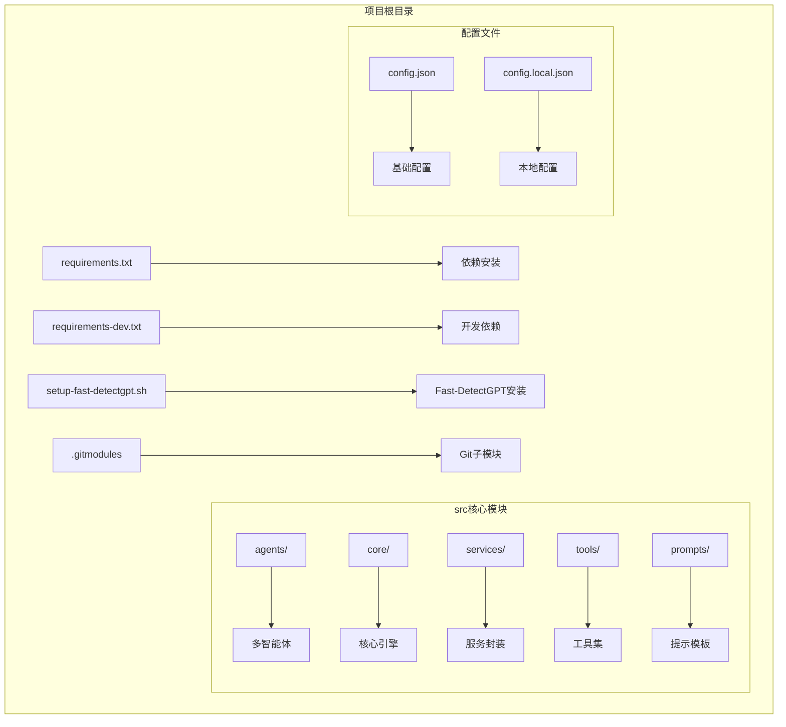
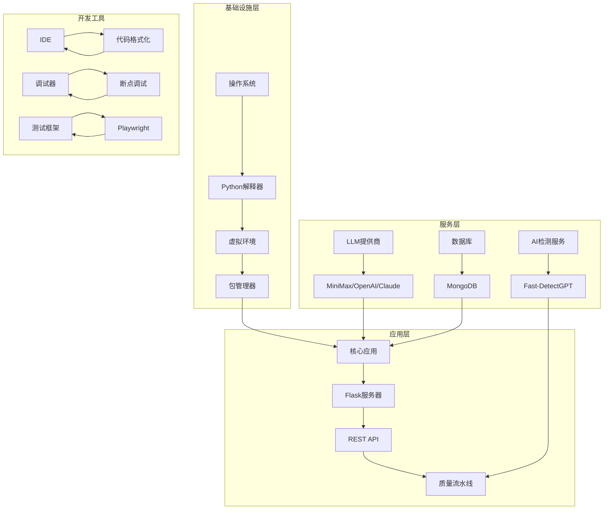
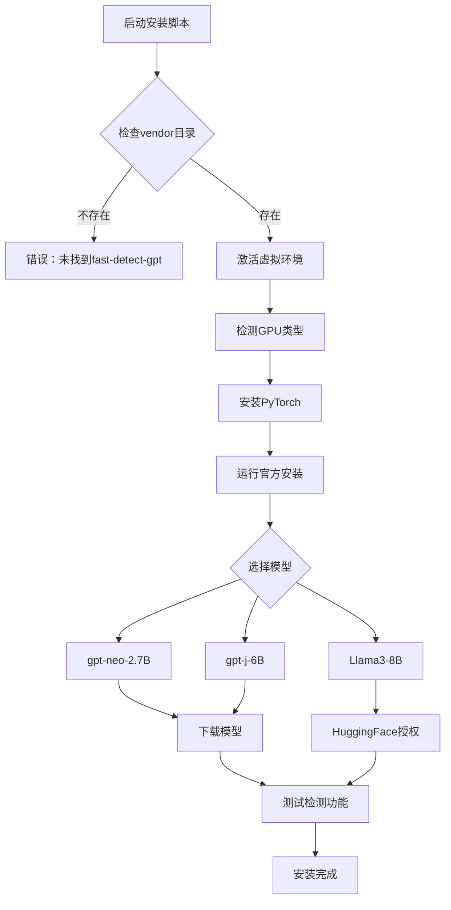
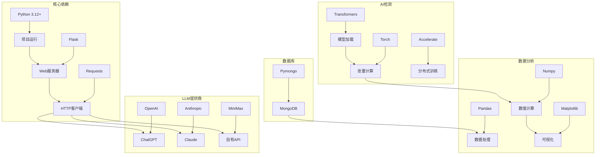

# 开发环境搭建

<cite>
**本文档引用的文件**
- [requirements.txt](file://requirements.txt)
- [requirements-dev.txt](file://requirements-dev.txt)
- [setup-fast-detectgpt.sh](file://setup-fast-detectgpt.sh)
- [.gitmodules](file://.gitmodules)
- [README.md](file://README.md)
- [config.json](file://config.json)
- [config.local.json](file://config.local.json)
- [src/core/config.py](file://src/core/config.py)
- [src/tools/quality_pipeline.py](file://src/tools/quality_pipeline.py)
- [server.py](file://server.py)
</cite>

## 目录
1. [简介](#简介)
2. [项目结构](#项目结构)
3. [核心组件](#核心组件)
4. [架构概览](#架构概览)
5. [详细组件分析](#详细组件分析)
6. [依赖分析](#依赖分析)
7. [性能考虑](#性能考虑)
8. [故障排除指南](#故障排除指南)
9. [结论](#结论)
10. [附录](#附录)

## 简介
本指南面向paperwriterAI项目的开发者，提供从零开始搭建完整开发环境的详细步骤。内容涵盖Python环境配置、虚拟环境创建、依赖安装、开发工具链配置（IDE设置、代码格式化、调试环境）、Git子模块初始化、Fast-DetectGPT安装过程、环境验证方法以及常见问题排查。通过遵循本指南，您将能够快速建立稳定且高效的开发环境。

## 项目结构
paperwriterAI采用模块化组织方式，核心代码位于src目录下，包含多个功能模块：
- agents：多智能体协作模块
- core：核心引擎与配置管理
- services：服务层封装
- tools：工具集与质量流水线
- prompts：提示模板



**图表来源**
- [requirements.txt](file://requirements.txt)
- [requirements-dev.txt](file://requirements-dev.txt)
- [setup-fast-detectgpt.sh](file://setup-fast-detectgpt.sh)
- [.gitmodules](file://.gitmodules)

**章节来源**
- [README.md](file://README.md)
- [config.json](file://config.json)

## 核心组件
本节介绍开发环境中最重要的组件及其作用：

### Python环境要求
- Python版本：3.12+
- 推荐使用Python 3.12.x系列以获得最佳兼容性
- 建议使用虚拟环境隔离项目依赖

### 依赖管理策略
项目采用双重依赖管理机制：
- 生产环境依赖：requirements.txt（包含所有必需包）
- 开发环境依赖：requirements-dev.txt（Playwright等开发工具）

### LLM配置系统
项目内置灵活的LLM配置系统，支持多种提供商：
- MiniMax（主用）
- OpenAI
- Anthropic
- Gemini
- DeepSeek
- Ollama（本地模型）

**章节来源**
- [README.md](file://README.md)
- [config.json](file://config.json)
- [src/core/config.py](file://src/core/config.py)

## 架构概览
开发环境架构分为三层：基础设施层、应用层和服务层。



**图表来源**
- [server.py](file://server.py)
- [src/tools/quality_pipeline.py](file://src/tools/quality_pipeline.py)
- [config.json](file://config.json)

## 详细组件分析

### Python环境配置
#### 1. Python版本选择
- 推荐使用Python 3.12.x系列
- 确保pip版本为最新
- 验证Python安装：`python --version`

#### 2. 虚拟环境创建
```bash
# 创建虚拟环境
python -m venv .venv

# 激活虚拟环境
# Linux/macOS:
source .venv/bin/activate
# Windows:
.venv\Scripts\activate

# 升级pip
pip install --upgrade pip
```

#### 3. 依赖安装流程
```bash
# 安装生产环境依赖
pip install -r requirements.txt

# 安装开发环境依赖
pip install -r requirements-dev.txt

# 验证安装
pip list
```

**章节来源**
- [requirements.txt](file://requirements.txt)
- [requirements-dev.txt](file://requirements-dev.txt)

### Git子模块初始化
Fast-DetectGPT作为Git子模块被集成到项目中：

```bash
# 初始化子模块
git submodule update --init --recursive

# 或者手动克隆
git clone https://github.com/baoguangsheng/fast-detect-gpt vendor/fast-detect-gpt

# 验证子模块状态
git submodule status
```

**章节来源**
- [.gitmodules](file://.gitmodules)
- [setup-fast-detectgpt.sh](file://setup-fast-detectgpt.sh)

### Fast-DetectGPT安装过程
Fast-DetectGPT是AI痕迹检测的核心组件，支持多种模型：



**图表来源**
- [setup-fast-detectgpt.sh](file://setup-fast-detectgpt.sh)

#### 安装步骤详解
1. **环境准备**
   ```bash
   # 检查Python版本
   python --version
   
   # 确认Git子模块已初始化
   ls vendor/fast-detect-gpt
   ```

2. **GPU检测与PyTorch安装**
   - NVIDIA GPU：安装CUDA版本
   - Apple Silicon：安装Metal版本
   - CPU：安装CPU版本

3. **模型选择**
   - gpt-neo-2.7B：最小模型，CPU可用
   - gpt-j-6B：推荐GPU模型
   - Llama3-8B：最佳模型，需要HuggingFace授权

4. **验证安装**
   ```bash
   # 测试检测功能
   echo "This is a test sentence written by a human." | python scripts/local_infer.py --sampling_model_name gpt-neo-2.7B
   ```

**章节来源**
- [setup-fast-detectgpt.sh](file://setup-fast-detectgpt.sh)

### 开发工具链配置

#### IDE设置建议
推荐使用Visual Studio Code：
1. **Python解释器选择**
   - 选择虚拟环境中的Python解释器
   - 设置Python路径：`.venv/bin/python`

2. **扩展推荐**
   - Python（Microsoft）
   - Pylance
   - Black Formatter
   - Flake8
   - GitLens

3. **工作区配置**
   ```json
   {
       "python.defaultInterpreterPath": "./.venv/bin/python",
       "python.linting.enabled": true,
       "python.linting.flake8Enabled": true,
       "python.formatting.provider": "black",
       "editor.formatOnSave": true
   }
   ```

#### 代码格式化工具
项目使用Black进行代码格式化：
```bash
# 安装Black
pip install black

# 格式化整个项目
black .

# 检查格式问题
black --check .
```

#### 调试环境配置
1. **VS Code调试配置**
   ```json
   {
       "version": "0.2.0",
       "configurations": [
           {
               "name": "Python: Current File",
               "type": "python",
               "request": "launch",
               "program": "${file}",
               "console": "integratedTerminal",
               "justMyCode": true
           }
       ]
   }
   ```

2. **Flask应用调试**
   ```bash
   # 启动开发服务器
   export FLASK_APP=server.py
   export FLASK_ENV=development
   flask run --host=0.0.0.0 --port=8080
   ```

**章节来源**
- [README.md](file://README.md)

### 环境验证方法

#### 1. 基础环境验证
```bash
# 验证Python版本
python --version

# 验证虚拟环境
which python
pip list

# 验证依赖安装
pip check
```

#### 2. LLM配置验证
```bash
# 设置API密钥
export MINIMAX_API_KEY="your_key_here"

# 测试LLM连接
python -c "
from src.main import FARS
fars = FARS()
result = fars.test_llm_connection()
print('LLM连接:', result)
"
```

#### 3. Fast-DetectGPT验证
```bash
# 检查模型缓存
ls ~/.cache/huggingface/hub/

# 测试AI检测
python -c "
from src.tools.quality_pipeline import FastDetectGPTDetector
detector = FastDetectGPTDetector()
result = detector.detect('Test text for AI detection')
print('检测结果:', result.ai_probability)
"
```

#### 4. 服务器启动验证
```bash
# 启动Flask服务器
python server.py

# 访问健康检查端点
curl http://localhost:8080/api/health
```

**章节来源**
- [src/main.py](file://src/main.py)
- [src/tools/quality_pipeline.py](file://src/tools/quality_pipeline.py)
- [server.py](file://server.py)

## 依赖分析

### 核心依赖关系
项目依赖采用分层架构设计：



**图表来源**
- [requirements.txt](file://requirements.txt)
- [config.json](file://config.json)

### 依赖版本管理
项目使用精确版本控制确保环境一致性：
- LLM提供商：固定版本号
- 数据处理：兼容版本范围
- AI检测：最新稳定版本
- 工具库：定期更新

**章节来源**
- [requirements.txt](file://requirements.txt)
- [config.json](file://config.json)

## 性能考虑
1. **内存优化**
   - Fast-DetectGPT模型使用float16以减少内存占用
   - PyTorch设备选择优化（CPU/MPS/CUDA）

2. **并发处理**
   - Flask应用支持多线程
   - LLM调用使用异步模式

3. **缓存策略**
   - HuggingFace模型缓存
   - MongoDB查询缓存
   - 本地文件系统缓存

## 故障排除指南

### 常见问题及解决方案

#### 1. 依赖安装失败
**问题**：pip安装过程中出现错误
**解决方案**：
```bash
# 清理pip缓存
pip cache purge

# 使用国内镜像源
pip install -r requirements.txt -i https://pypi.tuna.tsinghua.edu.cn/simple/

# 升级setuptools和wheel
pip install --upgrade setuptools wheel
```

#### 2. Fast-DetectGPT安装问题
**问题**：模型下载失败或GPU不兼容
**解决方案**：
```bash
# 检查GPU状态
nvidia-smi  # NVIDIA
sysctl -a | grep machdep.cpu.brand_string  # Apple Silicon

# 重新安装PyTorch
pip uninstall torch torchvision torchaudio
pip install torch torchvision torchaudio

# 使用CPU版本
bash setup-fast-detectgpt.sh --model gpt-neo-2.7B
```

#### 3. LLM API密钥问题
**问题**：API调用失败
**解决方案**：
```bash
# 检查环境变量
echo $MINIMAX_API_KEY
echo $OPENAI_API_KEY
echo $ANTHROPIC_API_KEY

# 验证配置文件
cat config.local.json

# 测试连接
python -c "
import os
from src.core.config import get_effective_llm_config
cfg = get_effective_llm_config()
print('有效配置:', cfg)
"
```

#### 4. 数据库连接问题
**问题**：MongoDB连接失败
**解决方案**：
```bash
# 检查MongoDB服务
brew services list | grep mongodb
sudo systemctl status mongod

# 测试连接
mongo --host localhost --port 27017

# 更新配置
vim config.json
# 修改mongodb_uri为正确的连接字符串
```

#### 5. 端口冲突
**问题**：服务器启动失败（端口占用）
**解决方案**：
```bash
# 检查端口占用
lsof -i :8080
netstat -an | grep :8080

# 更改端口
export FLASK_RUN_PORT=8081
flask run
```

**章节来源**
- [setup-fast-detectgpt.sh](file://setup-fast-detectgpt.sh)
- [src/core/config.py](file://src/core/config.py)
- [config.json](file://config.json)

## 结论
通过遵循本指南，您已经完成了paperwriterAI项目的完整开发环境搭建。项目采用模块化设计，支持多种LLM提供商和AI检测工具，具备良好的扩展性和维护性。建议定期更新依赖包，保持开发环境的最新状态，并根据项目需求调整配置参数。

## 附录

### 快速参考清单
- [ ] Python 3.12+安装完成
- [ ] 虚拟环境创建并激活
- [ ] requirements.txt依赖安装完成
- [ ] Git子模块初始化完成
- [ ] Fast-DetectGPT安装完成
- [ ] LLM API密钥配置完成
- [ ] 服务器启动验证通过

### 相关文档
- 项目完整文档：[README.md](file://README.md)
- API参考文档：[README.md](file://README.md)
- 设计文档：[README.md](file://README.md)