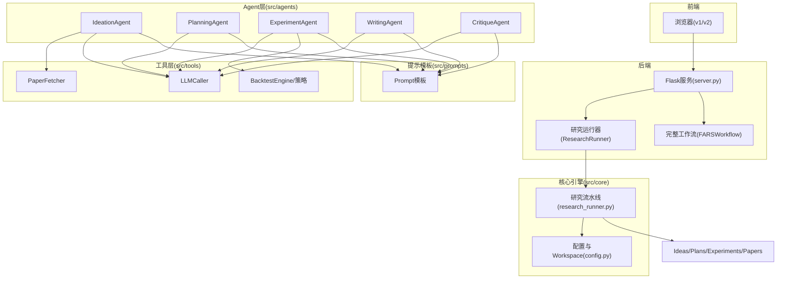
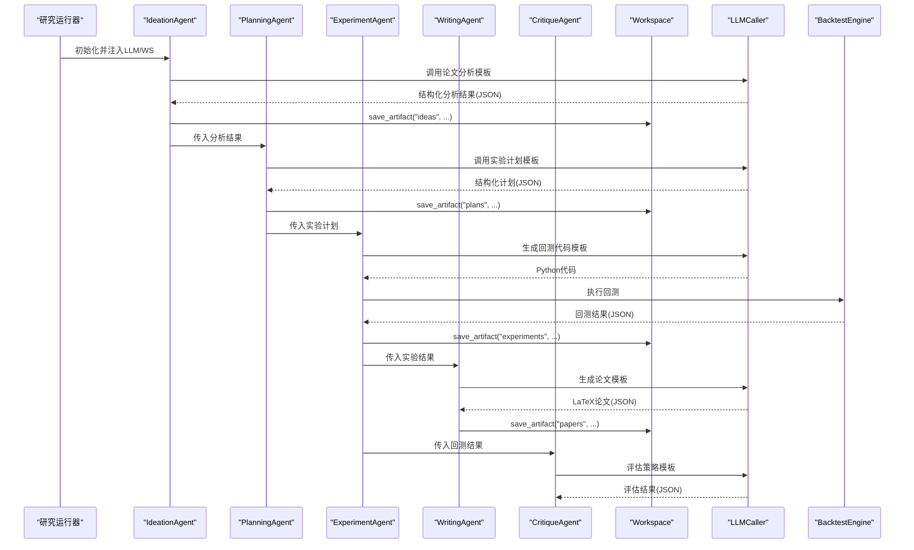
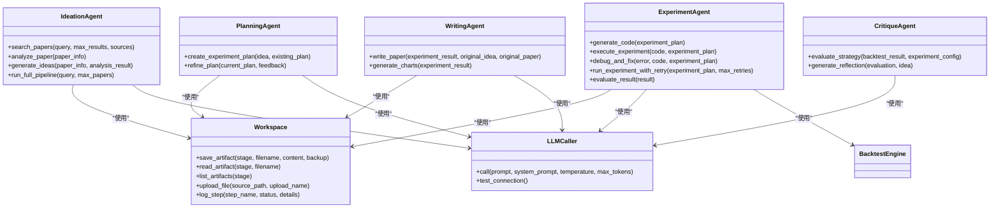
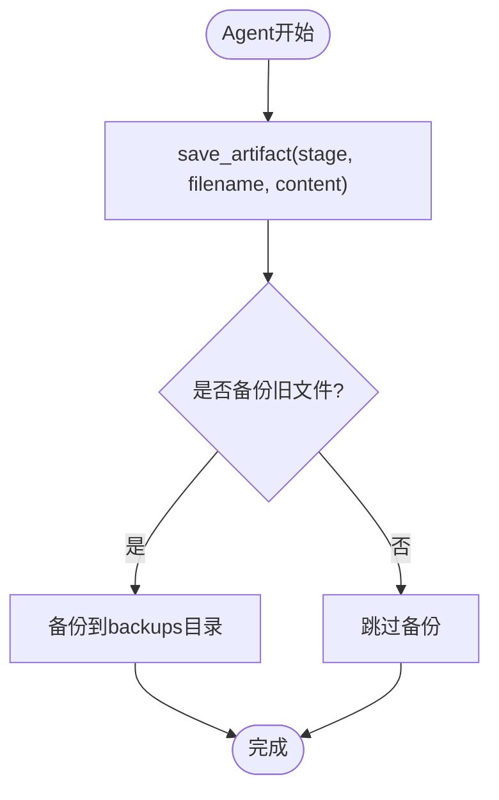
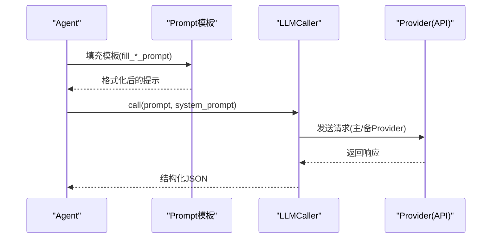
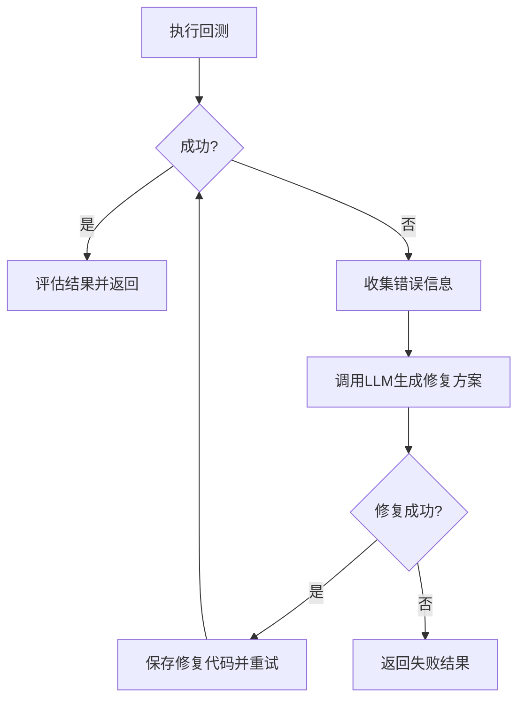
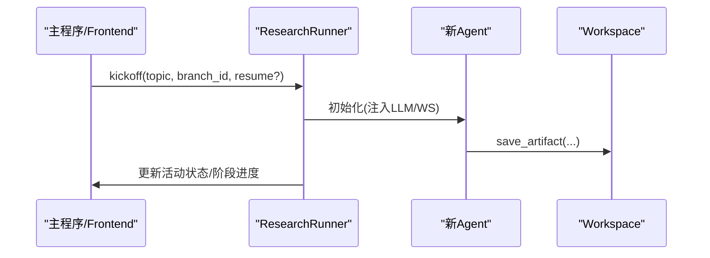
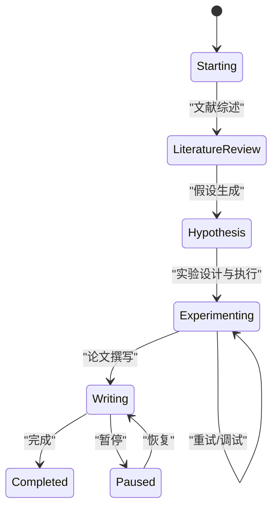
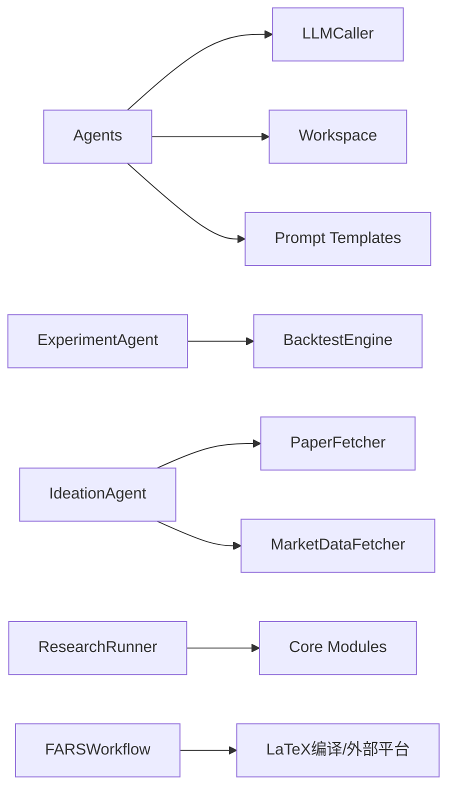

# Agent智能体扩展

<cite>
**本文引用的文件**
- [src/agents/agents.py](file://src/agents/agents.py)
- [AGENTS.md](file://AGENTS.md)
- [src/core/config.py](file://src/core/config.py)
- [src/prompts/templates.py](file://src/prompts/templates.py)
- [src/tools/fetchers.py](file://src/tools/fetchers.py)
- [src/tools/backtest.py](file://src/tools/backtest.py)
- [src/main.py](file://src/main.py)
- [src/workflow.py](file://src/workflow.py)
- [server.py](file://server.py)
- [src/core/research_runner.py](file://src/core/research_runner.py)
</cite>

## 目录
1. [简介](#简介)
2. [项目结构](#项目结构)
3. [核心组件](#核心组件)
4. [架构总览](#架构总览)
5. [详细组件分析](#详细组件分析)
6. [依赖关系分析](#依赖关系分析)
7. [性能考量](#性能考量)
8. [故障排查指南](#故障排查指南)
9. [结论](#结论)
10. [附录](#附录)

## 简介
本指南面向希望在paperwriterAI系统中扩展Agent智能体的开发者，提供从接口定义、生命周期管理、初始化参数配置，到Agent间交互模式、消息传递机制、Workspace共享、状态同步与结果传递的完整实践路径。文档同时给出Prompt模板设计、工具调用模式、错误处理策略的具体示例，并说明Agent注册与配置方法及在研究流程中的集成方式。

## 项目结构
paperwriterAI采用“工具层-核心引擎层-Agent层-服务层”的分层架构，Agent层集中于单文件实现四大Agent，配合Workspace实现跨Agent的工件共享与状态持久化；核心引擎负责研究流程编排与断点续跑；工具层提供论文抓取、数据获取、回测执行、LLM调用等基础能力；服务层提供质量流水线与评审服务；Prompts层提供标准化的提示模板。

**图表来源**
- [server.py:1-200](file://server.py#L1-L200)
- [src/core/research_runner.py:278-800](file://src/core/research_runner.py#L278-L800)
- [src/agents/agents.py:23-738](file://src/agents/agents.py#L23-L738)
- [src/core/config.py:254-384](file://src/core/config.py#L254-L384)
- [src/prompts/templates.py:1-758](file://src/prompts/templates.py#L1-L758)
- [src/tools/fetchers.py:20-800](file://src/tools/fetchers.py#L20-L800)
- [src/tools/backtest.py:181-433](file://src/tools/backtest.py#L181-L433)

**章节来源**
- [AGENTS.md:18-157](file://AGENTS.md#L18-L157)
- [src/agents/agents.py:23-738](file://src/agents/agents.py#L23-L738)
- [src/core/config.py:254-384](file://src/core/config.py#L254-L384)

## 核心组件
- Agent基类与四大Agent：Ideation、Planning、Experiment、Writing、Critique，均通过构造函数注入LLMCaller与Workspace，实现跨Agent工件共享与状态持久化。
- Workspace：统一的共享工作空间，提供save_artifact/read_artifact/list_artifacts/upload_file等方法，按阶段目录组织工件。
- Prompt模板：为每个Agent提供标准化的提示模板与填充函数，保证输出结构化JSON。
- 工具层：PaperFetcher、MarketDataFetcher、LLMCaller、CodeExecutor、BacktestEngine等，支撑Agent的输入输出与执行。
- 研究运行器：ResearchRunner负责研究流程的启动、阶段推进、状态同步与断点续跑。
- 完整工作流：FARSWorkflow负责论文生成后的编译、AI检测、投稿等后续流程。

**章节来源**
- [src/agents/agents.py:23-738](file://src/agents/agents.py#L23-L738)
- [src/core/config.py:254-384](file://src/core/config.py#L254-L384)
- [src/prompts/templates.py:1-758](file://src/prompts/templates.py#L1-L758)
- [src/tools/fetchers.py:20-800](file://src/tools/fetchers.py#L20-L800)
- [src/tools/backtest.py:181-433](file://src/tools/backtest.py#L181-L433)
- [src/core/research_runner.py:278-800](file://src/core/research_runner.py#L278-L800)
- [src/workflow.py:19-286](file://src/workflow.py#L19-L286)

## 架构总览
Agent智能体扩展遵循“职责单一、接口一致、共享状态、模板驱动”的原则。每个Agent通过LLMCaller调用统一的提示模板，将中间产物以结构化JSON形式保存到Workspace对应阶段目录，供下游Agent消费。ExperimentAgent还通过BacktestEngine执行回测并将结果传递给WritingAgent与CritiqueAgent。

**图表来源**
- [src/agents/agents.py:23-738](file://src/agents/agents.py#L23-L738)
- [src/core/config.py:254-384](file://src/core/config.py#L254-L384)
- [src/prompts/templates.py:1-758](file://src/prompts/templates.py#L1-L758)
- [src/tools/backtest.py:181-433](file://src/tools/backtest.py#L181-L433)

## 详细组件分析

### Agent接口定义与生命周期
- 接口形态：每个Agent均提供构造函数注入LLMCaller与Workspace；典型方法包括search_papers、analyze_paper、generate_ideas、create_experiment_plan、generate_code、execute_experiment、debug_and_fix、run_experiment_with_retry、evaluate_result、write_paper、generate_charts、evaluate_strategy、generate_reflection等。
- 生命周期管理：Agent内部通过正则提取JSON、异常捕获与回退、重试机制、状态记录等方式保障鲁棒性；Workspace提供log_step记录步骤状态，便于断点续跑与审计。
- 初始化参数配置：支持通过构造函数显式注入LLMCaller与Workspace；若未注入，则使用默认配置（来自CONFIG）与默认Workspace实例。

**图表来源**
- [src/agents/agents.py:23-738](file://src/agents/agents.py#L23-L738)
- [src/core/config.py:254-384](file://src/core/config.py#L254-L384)
- [src/tools/fetchers.py:290-800](file://src/tools/fetchers.py#L290-L800)
- [src/tools/backtest.py:181-433](file://src/tools/backtest.py#L181-L433)

**章节来源**
- [src/agents/agents.py:23-738](file://src/agents/agents.py#L23-L738)
- [src/core/config.py:254-384](file://src/core/config.py#L254-L384)

### Workspace共享与状态同步
- 工件存储：Workspace.save_artifact(stage, filename, content, backup)按阶段目录保存工件，支持备份同名文件；list_artifacts与read_artifact提供查询与读取能力。
- 状态记录：log_step用于记录工作流步骤的状态与细节，便于断点续跑与审计。
- 目录结构：初始化时创建ideas、plans、experiments、papers、data、charts、logs、backups、uploads等子目录，确保Agent间工件隔离与有序管理。

**图表来源**
- [src/core/config.py:280-323](file://src/core/config.py#L280-L323)

**章节来源**
- [src/core/config.py:254-384](file://src/core/config.py#L254-L384)

### Prompt模板设计与工具调用模式
- 模板体系：SCIENTIFIC_AGENT_SYSTEM_PROMPT提供通用系统提示；各Agent拥有专用模板（如IDEA_GENERATION_PROMPT、PAPER_ANALYSIS_PROMPT、EXPERIMENT_PLANNING_PROMPT、CODE_GENERATION_PROMPT、DEBUG_ASSISTANCE_PROMPT、PAPER_WRITING_PROMPT、STRATEGY_EVALUATION_PROMPT）。
- 填充函数：提供fill_idea_prompt、fill_code_gen_prompt、fill_debug_prompt等辅助函数，将动态参数注入模板。
- 工具调用：Agent通过LLMCaller统一调用不同Provider（OpenAI、Anthropic、DeepSeek、MiniMax、Ollama），支持主备切换与调用统计记录。

**图表来源**
- [src/prompts/templates.py:1-758](file://src/prompts/templates.py#L1-L758)
- [src/tools/fetchers.py:290-800](file://src/tools/fetchers.py#L290-L800)

**章节来源**
- [src/prompts/templates.py:1-758](file://src/prompts/templates.py#L1-L758)
- [src/tools/fetchers.py:290-800](file://src/tools/fetchers.py#L290-L800)

### 错误处理策略
- JSON提取与解析：Agent普遍采用正则提取JSON块并捕获JSONDecodeError，失败时返回结构化错误信息，避免崩溃。
- 回测执行与调试：ExperimentAgent在执行失败时调用debug_and_fix，基于错误追踪与原始代码生成修复建议，并保存修复后的代码。
- 重试机制：run_experiment_with_retry支持最大重试次数，失败时记录错误并返回结果。
- LLM调用：LLMCaller支持主备Provider自动切换与调用历史记录，便于问题定位与成本统计。

**图表来源**
- [src/agents/agents.py:386-462](file://src/agents/agents.py#L386-L462)
- [src/tools/fetchers.py:290-800](file://src/tools/fetchers.py#L290-L800)

**章节来源**
- [src/agents/agents.py:386-462](file://src/agents/agents.py#L386-L462)
- [src/tools/fetchers.py:290-800](file://src/tools/fetchers.py#L290-L800)

### Agent注册与配置方法
- 注册方式：四大Agent集中在src/agents/agents.py中，无需额外注册；新增Agent可在此文件中定义并复用现有Workspace与LLMCaller。
- 配置加载：通过load_effective_config合并config.json与config.local.json，支持环境变量覆盖；LLMCaller根据配置选择Provider与模型。
- 研究运行器：ResearchRunner负责启动与推进研究流程，新增Agent可在相应阶段接入（如在文献综述、假设生成、实验执行、论文撰写等阶段插入新Agent）。

**图表来源**
- [src/core/research_runner.py:301-427](file://src/core/research_runner.py#L301-L427)
- [src/agents/agents.py:23-738](file://src/agents/agents.py#L23-L738)
- [src/core/config.py:462-514](file://src/core/config.py#L462-L514)

**章节来源**
- [src/core/research_runner.py:301-427](file://src/core/research_runner.py#L301-L427)
- [src/core/config.py:462-514](file://src/core/config.py#L462-L514)

### 在研究流程中集成新Agent
- 研究流程：文献综述→假设生成→实验设计→回测执行→论文撰写→质量评估与迭代→投稿。
- 集成点：可在ResearchRunner的阶段推进逻辑中插入新Agent；也可在Agent内部通过Workspace共享工件，实现并行或串行协作。
- 完整工作流：FARSWorkflow负责论文生成后的编译、AI检测、投稿等步骤，新Agent产出的工件可直接参与后续流程。

**图表来源**
- [src/core/research_runner.py:642-1129](file://src/core/research_runner.py#L642-L1129)
- [src/workflow.py:233-286](file://src/workflow.py#L233-L286)

**章节来源**
- [src/core/research_runner.py:642-1129](file://src/core/research_runner.py#L642-L1129)
- [src/workflow.py:233-286](file://src/workflow.py#L233-L286)

## 依赖关系分析
- Agent依赖：Ideation/Planning/Experiment/Writing/Critique均依赖LLMCaller与Workspace；ExperimentAgent还依赖BacktestEngine；PaperFetcher与MarketDataFetcher为数据源。
- Prompt依赖：各Agent依赖templates中的模板与填充函数；templates依赖SCIENTIFIC_AGENT_SYSTEM_PROMPT。
- 运行器依赖：ResearchRunner依赖PaperExtractor、SeedLibrary、ResearchGraphs等核心模块；FARSWorkflow依赖LaTeX编译与外部平台。

**图表来源**
- [src/agents/agents.py:23-738](file://src/agents/agents.py#L23-L738)
- [src/prompts/templates.py:1-758](file://src/prompts/templates.py#L1-L758)
- [src/tools/fetchers.py:20-800](file://src/tools/fetchers.py#L20-L800)
- [src/tools/backtest.py:181-433](file://src/tools/backtest.py#L181-L433)
- [src/core/research_runner.py:278-800](file://src/core/research_runner.py#L278-L800)
- [src/workflow.py:19-286](file://src/workflow.py#L19-L286)

**章节来源**
- [src/agents/agents.py:23-738](file://src/agents/agents.py#L23-L738)
- [src/prompts/templates.py:1-758](file://src/prompts/templates.py#L1-L758)
- [src/tools/fetchers.py:20-800](file://src/tools/fetchers.py#L20-L800)
- [src/tools/backtest.py:181-433](file://src/tools/backtest.py#L181-L433)
- [src/core/research_runner.py:278-800](file://src/core/research_runner.py#L278-L800)
- [src/workflow.py:19-286](file://src/workflow.py#L19-L286)

## 性能考量
- LLM调用：统一超时与重试策略，避免阻塞；记录调用统计与成本，便于优化与预算控制。
- 回测执行：BacktestEngine提供多种分析器指标，建议在Agent中仅计算必要指标，减少计算开销。
- 工件存储：save_artifact支持备份，避免覆盖导致的数据丢失；建议按阶段与文件名规范命名，便于检索与清理。
- 线程与并发：ResearchRunner使用线程推进流程，注意避免竞态与资源争用；Workspace与LLM调用应具备幂等性与防重能力。

[本节为通用指导，无需特定文件引用]

## 故障排查指南
- LLM连接失败：使用LLMCaller.test_connection()快速诊断；检查Provider配置、API Key与网络连通性。
- JSON解析失败：Agent普遍采用正则提取JSON块，若失败返回错误信息；可通过Workspace保存原始响应用于调试。
- 回测执行异常：ExperimentAgent记录错误并尝试修复；检查代码生成模板、数据可用性与依赖库版本。
- 研究流程卡住：通过Workspace.log_step与ResearchRunner的活动状态查看当前阶段；必要时使用断点续跑功能。

**章节来源**
- [src/tools/fetchers.py:806-823](file://src/tools/fetchers.py#L806-L823)
- [src/agents/agents.py:386-462](file://src/agents/agents.py#L386-L462)
- [src/core/research_runner.py:567-582](file://src/core/research_runner.py#L567-L582)

## 结论
通过统一的Workspace与Prompt模板体系，paperwriterAI实现了Agent间的无缝协作与可扩展性。新增Agent只需遵循相同的接口约定、提示模板与工具调用模式，即可在研究流程中稳定集成。建议在扩展过程中重点关注错误处理、状态记录与性能优化，确保系统在复杂研究场景下的可靠性与可维护性。

[本节为总结性内容，无需特定文件引用]

## 附录

### 新Agent扩展示例要点
- 继承与构造：在src/agents/agents.py中定义新类，构造函数注入LLMCaller与Workspace；若未注入，使用默认配置。
- Prompt设计：基于SCIENTIFIC_AGENT_SYSTEM_PROMPT与现有模板，设计Agent专属模板与填充函数。
- 工具调用：通过LLMCaller统一调用不同Provider；回测与数据获取使用BacktestEngine与PaperFetcher/MarketDataFetcher。
- 工件保存：使用Workspace.save_artifact按阶段保存结构化JSON；必要时使用log_step记录步骤状态。
- 错误处理：采用正则提取JSON、异常捕获与回退、重试与调试修复相结合的策略。
- 集成方式：在ResearchRunner的阶段推进逻辑中插入新Agent；或在Agent内部通过Workspace实现跨Agent协作。

**章节来源**
- [src/agents/agents.py:23-738](file://src/agents/agents.py#L23-L738)
- [src/prompts/templates.py:1-758](file://src/prompts/templates.py#L1-L758)
- [src/tools/fetchers.py:290-800](file://src/tools/fetchers.py#L290-L800)
- [src/tools/backtest.py:181-433](file://src/tools/backtest.py#L181-L433)
- [src/core/research_runner.py:642-1129](file://src/core/research_runner.py#L642-L1129)