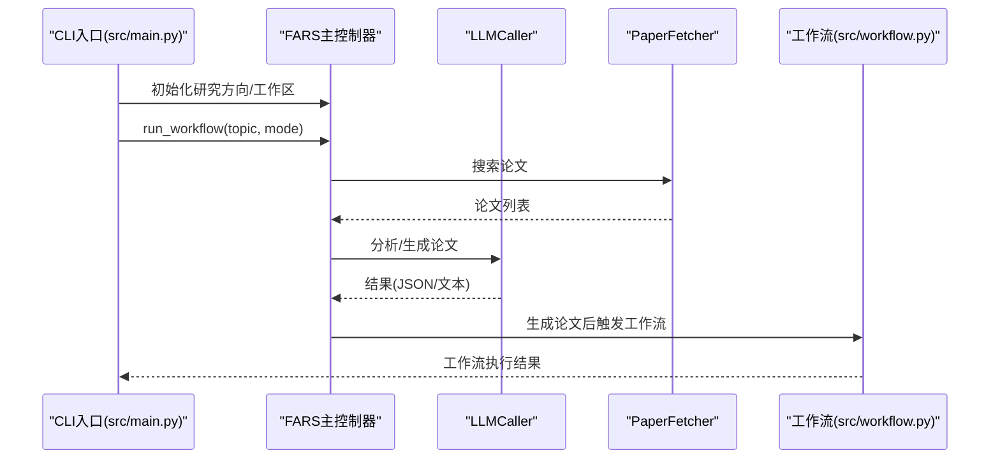
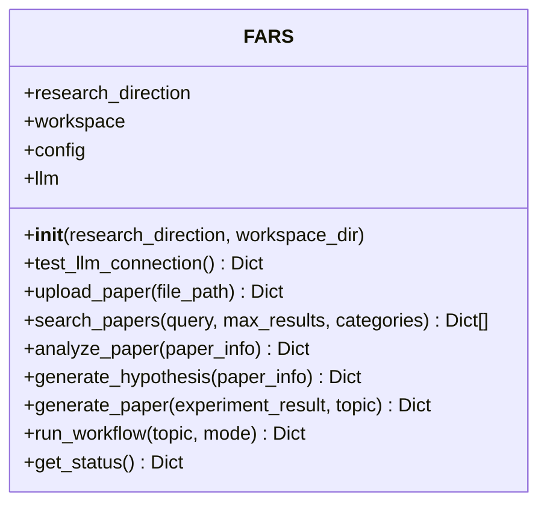
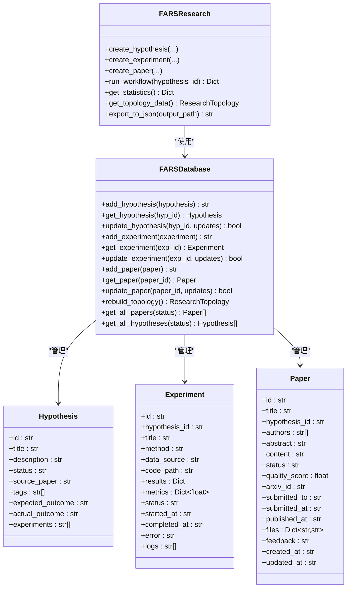
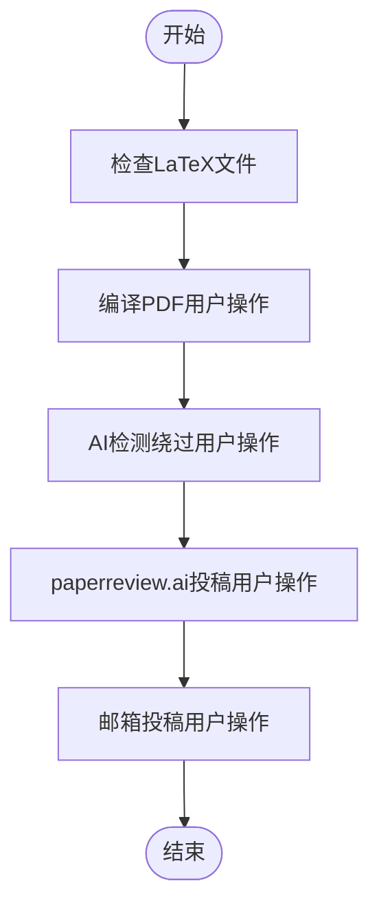
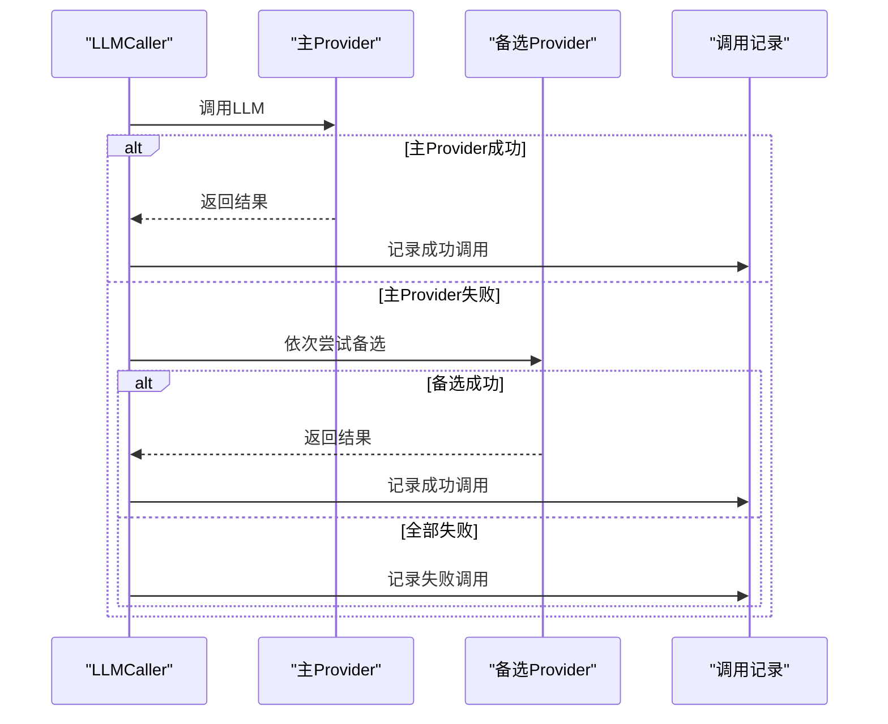
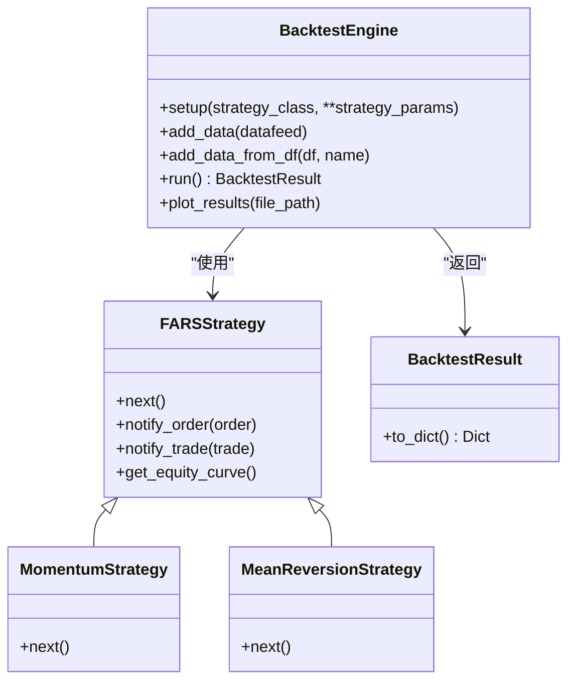
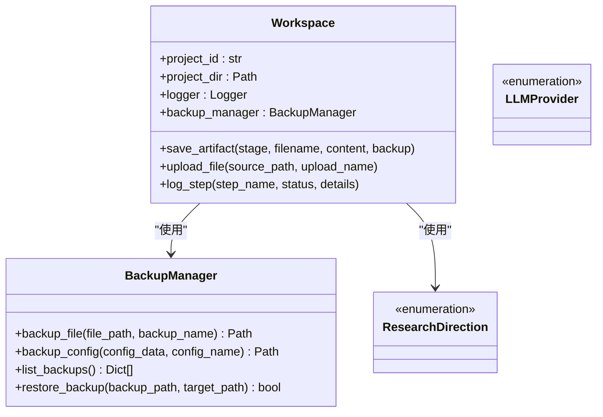
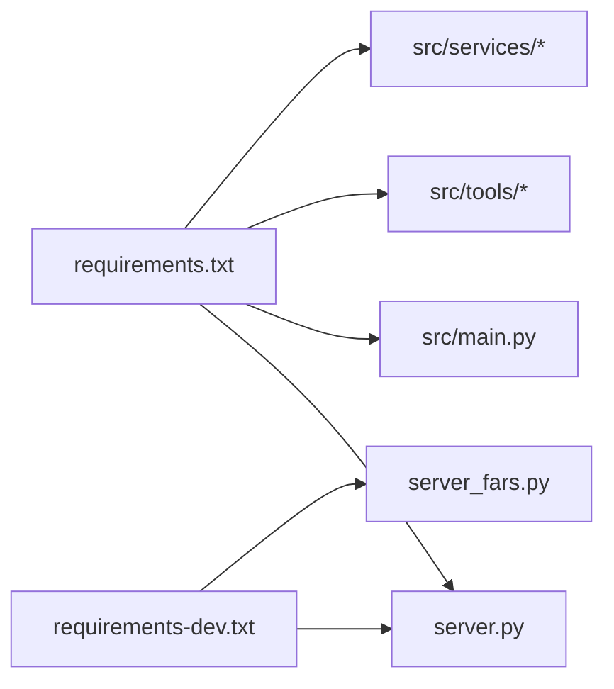

# 代码规范与最佳实践

<cite>
**本文引用的文件**
- [src/main.py](file://src/main.py)
- [src/fars_research.py](file://src/fars_research.py)
- [src/workflow.py](file://src/workflow.py)
- [server.py](file://server.py)
- [server_fars.py](file://server_fars.py)
- [src/core/config.py](file://src/core/config.py)
- [src/tools/fetchers.py](file://src/tools/fetchers.py)
- [src/tools/backtest.py](file://src/tools/backtest.py)
- [src/prompts/templates.py](file://src/prompts/templates.py)
- [requirements.txt](file://requirements.txt)
- [requirements-dev.txt](file://requirements-dev.txt)
- [AGENTS.md](file://AGENTS.md)
</cite>

## 目录
1. [简介](#简介)
2. [项目结构](#项目结构)
3. [核心组件](#核心组件)
4. [架构总览](#架构总览)
5. [详细组件分析](#详细组件分析)
6. [依赖关系分析](#依赖关系分析)
7. [性能考量](#性能考量)
8. [故障排查指南](#故障排查指南)
9. [结论](#结论)
10. [附录](#附录)

## 简介
本指南面向paperwriterAI项目，旨在建立统一的代码规范与最佳实践，涵盖代码组织原则、命名规范、模块依赖管理、注释与文档标准、错误处理模式、Agent实现模式、工具模块设计、配置管理最佳实践、代码审查标准、测试覆盖率要求、性能优化技巧、重构指导原则、技术债务管理与向后兼容性维护策略。文档同时提供具体示例与可视化图示，帮助不同技术背景的读者快速理解与落地。

## 项目结构
项目采用“分层+功能域”的组织方式：
- 层次划分：核心引擎层(core)、Agent层(agents)、工具层(tools)、服务层(services)、提示模板(prompts)、入口(main/cli)、工作流(workflow)、服务器(server)
- 功能域划分：研究方向(量化金融/计算机视觉/强化学习)、论文生成与评审、回测与因子评估、LLM调用与日志、工作流编排与发布

```mermaid
graph TB
subgraph "入口与服务器"
MAIN["src/main.py"]
SERVER["server.py"]
SERVER_FARS["server_fars.py"]
end
subgraph "核心引擎层"
CORE_CFG["src/core/config.py"]
CORE_DB["src/core/database.py"]
CORE_DATA["src/core/data_registry.py"]
CORE_GRAPH["src/core/research_graphs.py"]
CORE_RESET["src/core/research_reset.py"]
CORE_RUNNER["src/core/research_runner.py"]
CORE_ENGINE["src/core/research_engine.py"]
CORE_ARCHIVE["src/core/research_archive.py"]
CORE_SEED["src/core/seed_library.py"]
CORE_PDF["src/core/pdf_compiler.py"]
CORE_EXTRACT["src/core/paper_extractor.py"]
CORE_INDEX["src/core/mongo_index.py"]
end
subgraph "Agent层"
AGENTS["src/agents/agents.py"]
end
subgraph "工具层"
TOOLS_FETCH["src/tools/fetchers.py"]
TOOLS_BACKTEST["src/tools/backtest.py"]
TOOLS_QUALITY["src/tools/quality_pipeline.py"]
TOOLS_LIT["src/tools/literature_review_engine.py"]
TOOLS_SUBMIT["src/tools/paperreview_submitter.py"]
end
subgraph "服务层"
SVC_AI["src/services/ai_detector.py"]
SVC_REV["src/services/paper_reviewer.py"]
end
subgraph "提示模板"
PROMPTS["src/prompts/templates.py"]
end
subgraph "工作流"
WF["src/workflow.py"]
end
MAIN --> CORE_CFG
MAIN --> TOOLS_FETCH
MAIN --> PROMPTS
SERVER --> CORE_CFG
SERVER --> CORE_DB
SERVER --> CORE_DATA
SERVER --> CORE_GRAPH
SERVER --> CORE_RESET
SERVER --> CORE_RUNNER
SERVER --> CORE_ENGINE
SERVER --> CORE_ARCHIVE
SERVER --> CORE_SEED
SERVER --> CORE_PDF
SERVER --> CORE_EXTRACT
SERVER --> CORE_INDEX
SERVER --> TOOLS_FETCH
SERVER --> TOOLS_BACKTEST
SERVER --> TOOLS_QUALITY
SERVER --> TOOLS_LIT
SERVER --> TOOLS_SUBMIT
SERVER --> SVC_AI
SERVER --> SVC_REV
SERVER --> PROMPTS
SERVER --> WF
SERVER_FARS --> TOOLS_FETCH
SERVER_FARS --> TOOLS_BACKTEST
SERVER_FARS --> TOOLS_QUALITY
SERVER_FARS --> SVC_AI
SERVER_FARS --> SVC_REV
SERVER_FARS --> PROMPTS
```

**图表来源**
- [src/main.py:1-521](file://src/main.py#L1-L521)
- [server.py:1-800](file://server.py#L1-L800)
- [server_fars.py:1-800](file://server_fars.py#L1-L800)
- [src/core/config.py:1-563](file://src/core/config.py#L1-L563)
- [src/tools/fetchers.py:1-899](file://src/tools/fetchers.py#L1-L899)
- [src/tools/backtest.py:1-433](file://src/tools/backtest.py#L1-L433)
- [src/prompts/templates.py:1-758](file://src/prompts/templates.py#L1-L758)
- [src/workflow.py:1-286](file://src/workflow.py#L1-L286)

**章节来源**
- [AGENTS.md:1-157](file://AGENTS.md#L1-L157)

## 核心组件
- FARS主控制器：负责CLI入口、研究方向初始化、LLM初始化、论文搜索/分析/生成、工作流编排与状态查询
- 研究数据库与拓扑：以数据类为核心的数据模型，提供假设/实验/论文的增删改查与拓扑统计
- 工作流编排：从LaTeX到PDF、AI检测绕过、投稿平台的完整流程
- LLM调用器：统一封装多Provider调用、自动切换、调用记录与统计
- 回测引擎：基于Backtrader的策略基类、示例策略与指标计算工具
- 配置管理：研究方向、LLM Provider、Workspace、日志与备份、全局配置合并与生效

**章节来源**
- [src/main.py:35-521](file://src/main.py#L35-L521)
- [src/fars_research.py:28-569](file://src/fars_research.py#L28-L569)
- [src/workflow.py:19-286](file://src/workflow.py#L19-L286)
- [src/tools/fetchers.py:290-899](file://src/tools/fetchers.py#L290-L899)
- [src/tools/backtest.py:23-433](file://src/tools/backtest.py#L23-L433)
- [src/core/config.py:18-563](file://src/core/config.py#L18-L563)

## 架构总览
系统采用“服务器+CLI双入口”模式，核心由server.py承载API与研究流程编排，src/main.py提供命令行体验；工具层与服务层分别承担数据获取、回测、质量流水线与评审；提示模板统一Agent行为；工作流模块负责论文产出后的编译、AI检测与投稿。

**图表来源**
- [src/main.py:353-427](file://src/main.py#L353-L427)
- [src/tools/fetchers.py:20-163](file://src/tools/fetchers.py#L20-L163)
- [src/tools/fetchers.py:290-449](file://src/tools/fetchers.py#L290-L449)
- [src/workflow.py:233-278](file://src/workflow.py#L233-L278)

## 详细组件分析

### FARS主控制器（CLI入口）
- 职责：初始化研究方向与工作区、加载配置、初始化LLM、提供论文搜索/分析/生成、工作流编排、状态查询
- 关键点：
  - 研究方向枚举与描述映射
  - LLM初始化与备选Provider（Ollama）
  - 文件上传与类型处理
  - 工作流步骤记录与日志
  - CLI参数解析与帮助信息

**图表来源**
- [src/main.py:35-521](file://src/main.py#L35-L521)

**章节来源**
- [src/main.py:35-521](file://src/main.py#L35-L521)

### 研究数据库与拓扑（FARSResearch/FARSDatabase）
- 职责：以数据类定义假设、实验、论文实体，提供CRUD与拓扑统计（成功率、平均质量分、状态分布）
- 关键点：
  - 假设/实验/论文的增删改查
  - 拓扑重建：节点与边的构建
  - 统计指标计算
  - 数据持久化与导出

**图表来源**
- [src/fars_research.py:48-569](file://src/fars_research.py#L48-L569)

**章节来源**
- [src/fars_research.py:110-569](file://src/fars_research.py#L110-L569)

### 工作流编排（FARSWorkflow）
- 职责：从LaTeX到PDF、AI检测绕过、投稿平台的完整流程，提供步骤日志与人工干预提示
- 关键点：
  - 步骤1：检查LaTeX文件
  - 步骤2：编译PDF（提示用户使用Overleaf或本地TeX环境）
  - 步骤3：AI检测绕过（JustDone等工具）
  - 步骤4：paperreview.ai投稿
  - 步骤5：邮箱投稿（如ICML）

**图表来源**
- [src/workflow.py:19-286](file://src/workflow.py#L19-L286)

**章节来源**
- [src/workflow.py:19-286](file://src/workflow.py#L19-L286)

### LLM调用器（LLMCaller）
- 职责：统一封装多Provider调用（OpenAI、Anthropic、DeepSeek、MiniMax、Ollama），支持主备自动切换、调用记录与统计
- 关键点：
  - Provider切换与错误处理
  - 调用记录持久化与内存缓存
  - Token统计与延迟记录
  - Ollama本地模型支持

**图表来源**
- [src/tools/fetchers.py:290-449](file://src/tools/fetchers.py#L290-L449)

**章节来源**
- [src/tools/fetchers.py:290-899](file://src/tools/fetchers.py#L290-L899)

### 回测引擎（BacktestEngine）
- 职责：基于Backtrader的策略基类、示例策略（动量/均值回归）、指标计算工具
- 关键点：
  - 策略基类与通知回调
  - 回测运行与指标提取
  - 权益曲线与交易记录
  - IC/IR/Rank IC等因子评估工具

**图表来源**
- [src/tools/backtest.py:23-433](file://src/tools/backtest.py#L23-L433)

**章节来源**
- [src/tools/backtest.py:181-433](file://src/tools/backtest.py#L181-L433)

### 配置管理（Workspace/BackupManager/Config）
- 职责：研究方向枚举与描述、日志系统、备份管理、Workspace目录结构、全局配置合并与生效
- 关键点：
  - 研究方向优先级与描述
  - 日志格式与文件落盘
  - 备份策略与恢复
  - Workspace工件保存与上传
  - 配置加载优先级（local > base > env）

**图表来源**
- [src/core/config.py:18-563](file://src/core/config.py#L18-L563)

**章节来源**
- [src/core/config.py:98-563](file://src/core/config.py#L98-L563)

### 提示模板（Prompts）
- 职责：为四个Agent提供标准化Prompt模板，包括论文分析、假设生成、实验计划、代码生成、论文写作、评审与修订等
- 关键点：
  - 通用系统提示与Agent专用提示
  - 填充函数与格式约束
  - 输出JSON结构与LaTeX格式

**章节来源**
- [src/prompts/templates.py:1-758](file://src/prompts/templates.py#L1-L758)

## 依赖关系分析
- 服务器端（server.py）依赖核心引擎、工具层、服务层与提示模板，形成完整研究流程编排
- CLI端（src/main.py）依赖核心配置、工具层与提示模板，提供命令行体验
- 工具层与服务层相互独立，通过接口契约耦合，便于替换与扩展
- 依赖版本集中在requirements.txt与requirements-dev.txt

**图表来源**
- [requirements.txt:1-39](file://requirements.txt#L1-L39)
- [requirements-dev.txt:1-2](file://requirements-dev.txt#L1-L2)

**章节来源**
- [requirements.txt:1-39](file://requirements.txt#L1-L39)
- [requirements-dev.txt:1-2](file://requirements-dev.txt#L1-L2)

## 性能考量
- LLM调用性能
  - 统一超时与重试策略，避免阻塞
  - Token统计与延迟记录，便于性能监控
  - Provider自动切换，提高可用性
- 回测性能
  - Backtrader批量化数据与策略实现
  - 指标计算尽量向量化，减少循环开销
- 文件与IO
  - 备份与日志落盘前加锁与原子写
  - 大文件上传与编译提示用户操作，避免阻塞主线程

[本节为通用指导，无需特定文件引用]

## 故障排查指南
- LLM调用失败
  - 检查API Key与Provider配置
  - 查看调用记录文件与内存历史
  - 启用备选Provider（如Ollama）
- 论文生成异常
  - 检查Prompt输出JSON格式
  - 保存原始响应用于调试
- 回测异常
  - 检查数据格式与列名映射
  - 确认策略实现与通知回调
- 服务器端异常
  - 查看日志文件与调试上下文
  - 检查配置文件合并与环境变量

**章节来源**
- [src/tools/fetchers.py:324-449](file://src/tools/fetchers.py#L324-L449)
- [src/main.py:312-351](file://src/main.py#L312-L351)
- [server.py:160-193](file://server.py#L160-L193)

## 结论
本指南从代码组织、命名规范、模块依赖、注释与文档、错误处理、Agent与工具设计、配置管理、代码审查、测试与性能、重构与兼容性等方面，为paperwriterAI提供了系统性的规范与最佳实践。建议团队在开发过程中遵循这些规范，并结合项目实际持续演进。

[本节为总结性内容，无需特定文件引用]

## 附录

### 代码规范与最佳实践清单
- 代码组织
  - 按功能域与层次划分模块，避免跨层依赖
  - 使用数据类封装状态，提供统一的CRUD接口
- 命名规范
  - 类名：PascalCase；方法/变量：snake_case；常量：UPPER_SNAKE_CASE
  - 文件名与模块名：小写，必要时使用下划线
- 模块依赖管理
  - 明确依赖方向，避免循环依赖
  - 通过__all__导出公共接口
- 注释与文档
  - 模块与类：简要说明职责与边界
  - 方法：参数、返回值、异常、复杂逻辑说明
  - 公共接口：文档字符串与类型注解
- 错误处理
  - 明确异常类型与传播路径
  - 记录调用日志与错误详情
- Agent实现模式
  - 以数据类为中心，围绕数据流转设计Agent
  - Prompt模板标准化，输出结构化JSON
- 工具模块设计
  - 统一封装外部依赖（LLM、数据源、回测）
  - 提供可插拔的Provider与回退策略
- 配置管理最佳实践
  - 配置文件分离（默认/本地/环境变量）
  - 加载顺序与合并策略明确
- 代码审查标准
  - 可读性、健壮性、可测试性、可维护性
  - 依赖变更与接口兼容性
- 测试覆盖率要求
  - 核心模块（工具、配置、数据类）覆盖率≥80%
  - 关键流程（LLM调用、回测、工作流）具备集成测试
- 性能优化技巧
  - LLM调用超时与重试、Token统计
  - 回测向量化、缓存中间结果
- 重构指导原则
  - 保持接口稳定，逐步替换内部实现
  - 通过测试保障重构质量
- 技术债务管理
  - 记录债务项与解决计划
  - 限定债务规模与偿还周期
- 向后兼容性维护策略
  - 版本化接口与弃用策略
  - 配置兼容与迁移脚本

[本节为通用指导，无需特定文件引用]