# 工具模块扩展

<cite>
**本文档引用的文件**
- [src/tools/__init__.py](file://src/tools/__init__.py)
- [src/tools/fetchers.py](file://src/tools/fetchers.py)
- [src/tools/literature_review_engine.py](file://src/tools/literature_review_engine.py)
- [src/tools/quality_pipeline.py](file://src/tools/quality_pipeline.py)
- [src/tools/backtest.py](file://src/tools/backtest.py)
- [src/tools/paperreview_submitter.py](file://src/tools/paperreview_submitter.py)
- [src/core/config.py](file://src/core/config.py)
- [requirements.txt](file://requirements.txt)
- [scripts/test_minimax.py](file://scripts/test_minimax.py)
- [scripts/run_automated_tests.py](file://scripts/run_automated_tests.py)
</cite>

## 目录
1. [简介](#简介)
2. [项目结构](#项目结构)
3. [核心组件](#核心组件)
4. [架构概览](#架构概览)
5. [详细组件分析](#详细组件分析)
6. [依赖分析](#依赖分析)
7. [性能考虑](#性能考虑)
8. [故障排除指南](#故障排除指南)
9. [结论](#结论)
10. [附录](#附录)

## 简介

paperwriterAI是一个基于Python的自动化研究系统，专注于量化金融领域的论文写作和研究。本文档为工具模块扩展提供了完整的指导，涵盖工具模块的接口规范、设计模式、生命周期管理和配置管理等方面。

工具模块是paperwriterAI的核心组成部分，负责处理各种研究任务，包括论文获取、数据分析、回测执行、质量评估等功能。本文档旨在帮助开发者理解和扩展这些工具模块，确保新工具能够无缝集成到现有的系统架构中。

## 项目结构

paperwriterAI采用模块化的项目结构，工具模块位于`src/tools/`目录下，每个工具都有独立的功能和职责：

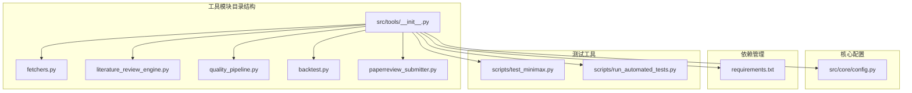

**图表来源**
- [src/tools/__init__.py:1-37](file://src/tools/__init__.py#L1-L37)
- [src/core/config.py:1-563](file://src/core/config.py#L1-L563)

**章节来源**
- [src/tools/__init__.py:1-37](file://src/tools/__init__.py#L1-L37)
- [requirements.txt:1-39](file://requirements.txt#L1-L39)

## 核心组件

### 工具模块基础架构

paperwriterAI的工具模块遵循统一的设计模式，所有工具都实现了相似的接口规范：

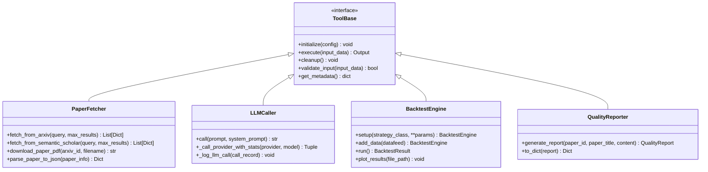

**图表来源**
- [src/tools/fetchers.py:20-162](file://src/tools/fetchers.py#L20-L162)
- [src/tools/fetchers.py:290-823](file://src/tools/fetchers.py#L290-L823)
- [src/tools/backtest.py:181-433](file://src/tools/backtest.py#L181-L433)
- [src/tools/quality_pipeline.py:609-741](file://src/tools/quality_pipeline.py#L609-L741)

### 工具模块接口规范

所有工具模块都遵循统一的接口规范，确保一致性和可维护性：

**输入输出格式规范：**

1. **输入参数规范：**
   - 所有方法接受明确的参数类型
   - 必需参数必须提供，可选参数有默认值
   - 参数验证在方法入口处进行

2. **输出格式规范：**
   - 统一使用字典或数据类返回结构化数据
   - 错误情况返回None或包含错误信息的字典
   - 时间戳使用ISO格式字符串

3. **异常处理规范：**
   - 所有外部API调用都有异常捕获
   - 错误信息包含详细的状态码和原因
   - 降级策略确保系统稳定性

**章节来源**
- [src/tools/fetchers.py:20-162](file://src/tools/fetchers.py#L20-L162)
- [src/tools/fetchers.py:290-823](file://src/tools/fetchers.py#L290-L823)
- [src/tools/backtest.py:181-433](file://src/tools/backtest.py#L181-L433)
- [src/tools/quality_pipeline.py:609-741](file://src/tools/quality_pipeline.py#L609-L741)

## 架构概览

paperwriterAI的工具模块采用分层架构设计，确保模块间的松耦合和高内聚：

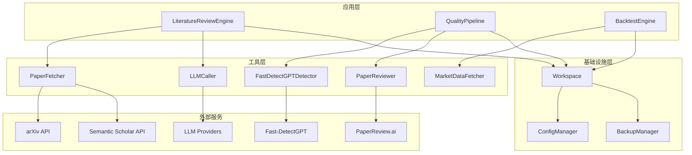

**图表来源**
- [src/tools/literature_review_engine.py:18-631](file://src/tools/literature_review_engine.py#L18-L631)
- [src/tools/quality_pipeline.py:87-807](file://src/tools/quality_pipeline.py#L87-L807)
- [src/tools/backtest.py:181-433](file://src/tools/backtest.py#L181-L433)
- [src/core/config.py:256-384](file://src/core/config.py#L256-L384)

## 详细组件分析

### 论文获取工具 (PaperFetcher)

PaperFetcher是论文获取的核心工具，支持从多个学术数据库获取论文信息：

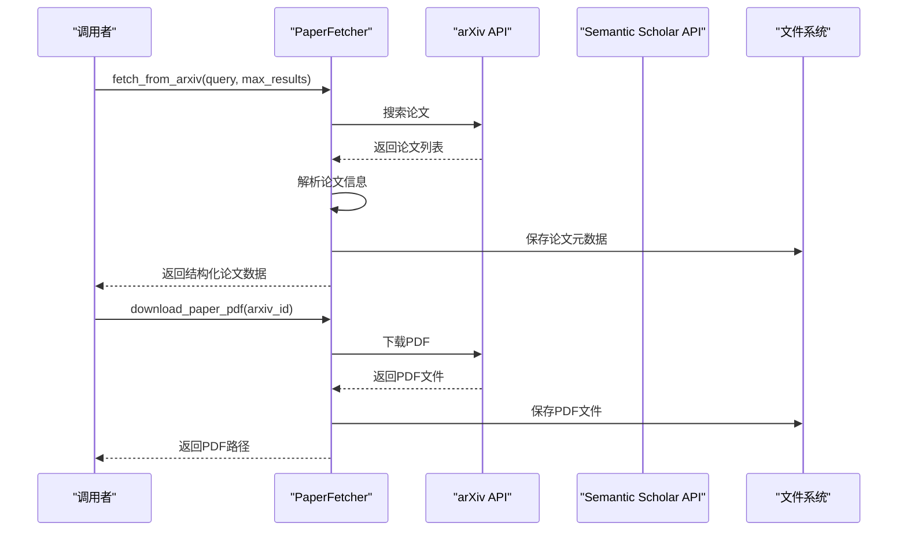

**图表来源**
- [src/tools/fetchers.py:27-138](file://src/tools/fetchers.py#L27-L138)
- [src/tools/fetchers.py:122-138](file://src/tools/fetchers.py#L122-L138)

**实现特点：**
- 支持arXiv和Semantic Scholar两个主要学术数据库
- 自动文件管理和缓存机制
- 统一的数据格式标准化
- 错误处理和降级策略

**章节来源**
- [src/tools/fetchers.py:20-162](file://src/tools/fetchers.py#L20-L162)

### 大语言模型调用器 (LLMCaller)

LLMCaller提供了统一的LLM调用接口，支持多种提供商的自动切换：

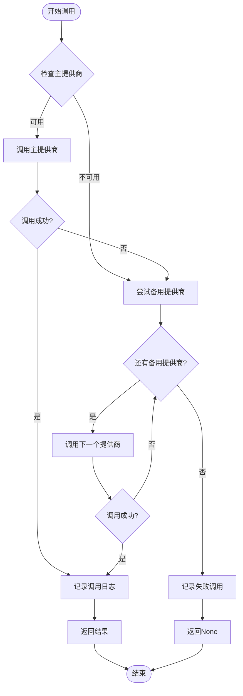

**图表来源**
- [src/tools/fetchers.py:391-449](file://src/tools/fetchers.py#L391-L449)

**实现特点：**
- 多提供商支持：OpenAI、Anthropic、DeepSeek、MiniMax、Ollama
- 自动故障转移机制
- 详细的调用日志记录
- 统一的API接口

**章节来源**
- [src/tools/fetchers.py:290-823](file://src/tools/fetchers.py#L290-L823)

### 文献综述引擎 (LiteratureReviewEngine)

LiteratureReviewEngine实现了STORM风格的文献综述生成流程：

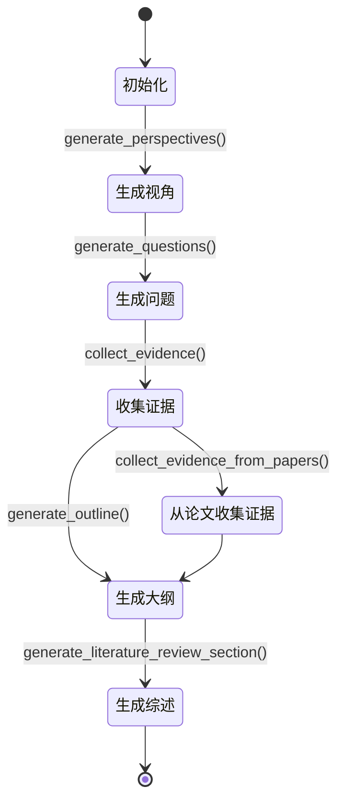

**图表来源**
- [src/tools/literature_review_engine.py:557-631](file://src/tools/literature_review_engine.py#L557-L631)

**实现特点：**
- 分阶段的文献综述流程
- 支持多视角分析
- 自动生成论文大纲
- LaTeX格式输出

**章节来源**
- [src/tools/literature_review_engine.py:18-631](file://src/tools/literature_review_engine.py#L18-L631)

### 质量评估流水线 (QualityPipeline)

质量评估流水线集成了AI痕迹检测、论文评审和综合报告生成：

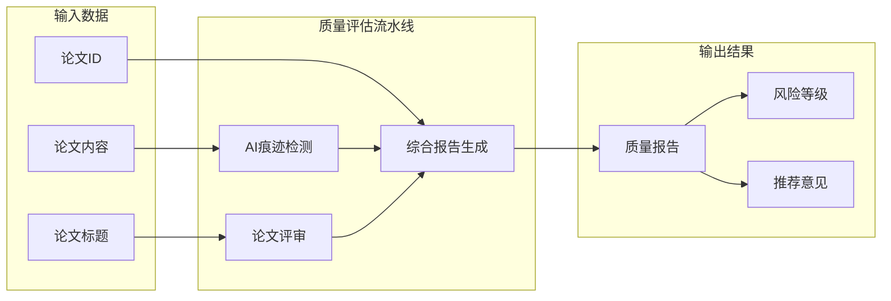

**图表来源**
- [src/tools/quality_pipeline.py:748-807](file://src/tools/quality_pipeline.py#L748-L807)

**实现特点：**
- 多维度质量评估
- AI痕迹检测（Fast-DetectGPT）
- 论文评审（Claude API）
- 综合评分和建议

**章节来源**
- [src/tools/quality_pipeline.py:1-807](file://src/tools/quality_pipeline.py#L1-L807)

### 回测引擎 (BacktestEngine)

回测引擎基于Backtrader框架，提供量化策略的回测功能：

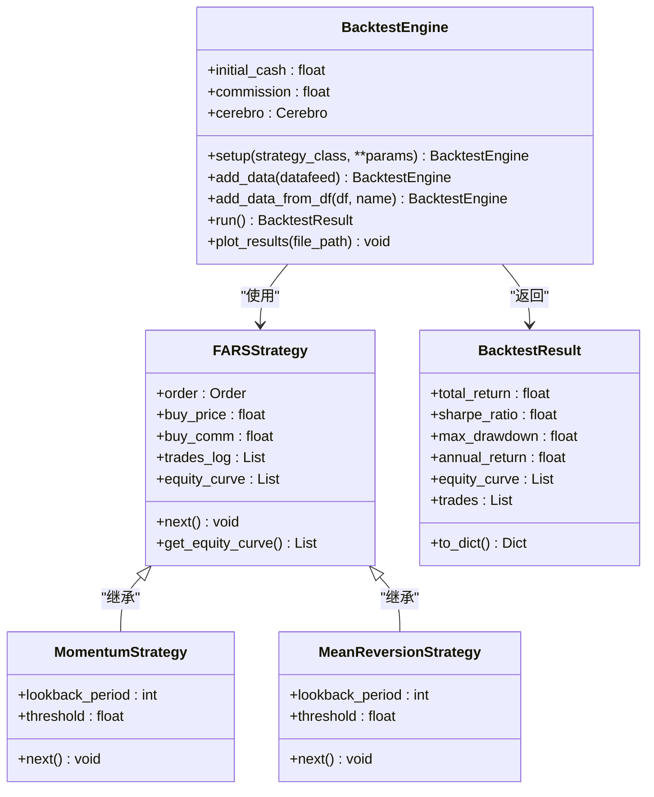

**图表来源**
- [src/tools/backtest.py:23-53](file://src/tools/backtest.py#L23-L53)
- [src/tools/backtest.py:55-123](file://src/tools/backtest.py#L55-L123)
- [src/tools/backtest.py:181-433](file://src/tools/backtest.py#L181-L433)

**实现特点：**
- 基于Backtrader的专业回测框架
- 支持多种策略类型
- 完整的风险指标计算
- 可视化结果输出

**章节来源**
- [src/tools/backtest.py:1-433](file://src/tools/backtest.py#L1-L433)

### 论文提交工具 (PaperReviewSubmitter)

PaperReviewSubmitter提供了与PaperReview.ai服务的集成：

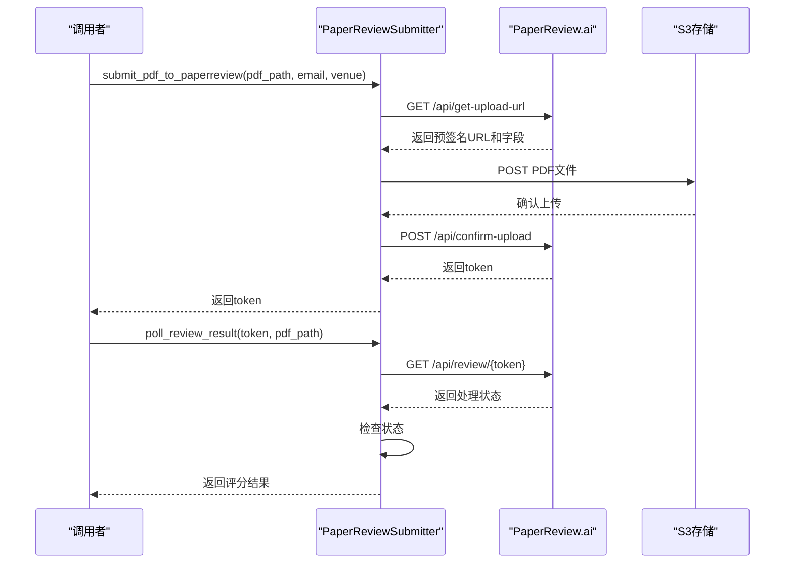

**图表来源**
- [src/tools/paperreview_submitter.py:71-284](file://src/tools/paperreview_submitter.py#L71-L284)

**实现特点：**
- 支持PDF文件上传
- 异步评分处理
- 轮询机制监控进度
- 结果持久化存储

**章节来源**
- [src/tools/paperreview_submitter.py:1-461](file://src/tools/paperreview_submitter.py#L1-L461)

## 依赖分析

### 外部依赖关系

paperwriterAI的工具模块依赖于多个第三方库，形成了复杂的依赖网络：

```mermaid
graph TB
subgraph "LLM提供商"
A[openai>=1.0.0]
B[anthropic>=0.20.0]
end
subgraph "学术数据库"
C[arxiv>=0.6.2]
D[requests>=2.31.0]
end
subgraph "数据处理"
E[pandas>=2.0.0]
F[numpy>=1.24.0]
G[matplotlib>=3.7.0]
H[seaborn>=0.12.0]
end
subgraph "市场数据"
I[yfinance>=0.2.0]
J[akshare>=1.12.0]
end
subgraph "回测框架"
K[backtrader>=1.9.0]
L[backtesting>=0.2.0]
end
subgraph "AI检测"
M[transformers>=4.35.0]
N[torch>=2.0.0]
end
subgraph "质量评估"
O[scikit-learn>=1.3.0]
end
subgraph "数据库"
P[pymongo>=4.5.0]
end
Q[requirements.txt] --> A
Q --> B
Q --> C
Q --> D
Q --> E
Q --> F
Q --> G
Q --> H
Q --> I
Q --> J
Q --> K
Q --> L
Q --> M
Q --> N
Q --> O
Q --> P
```

**图表来源**
- [requirements.txt:1-39](file://requirements.txt#L1-L39)

### 内部模块依赖

工具模块之间存在特定的依赖关系，确保功能的正确组合：

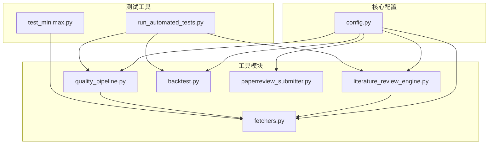

**图表来源**
- [src/core/config.py:462-508](file://src/core/config.py#L462-L508)
- [src/tools/literature_review_engine.py:42-63](file://src/tools/literature_review_engine.py#L42-L63)

**章节来源**
- [requirements.txt:1-39](file://requirements.txt#L1-L39)
- [src/core/config.py:462-508](file://src/core/config.py#L462-L508)

## 性能考虑

### 缓存策略

工具模块实现了多层次的缓存机制来提升性能：

1. **文件系统缓存：**
   - 论文PDF文件缓存
   - LLM调用历史记录
   - 中间结果临时文件

2. **内存缓存：**
   - LLM调用统计信息
   - 模型权重缓存
   - 频繁访问的数据

3. **数据库缓存：**
   - 配置信息缓存
   - 用户偏好设置
   - 历史操作记录

### 异步处理

对于耗时的操作，工具模块采用了异步处理策略：

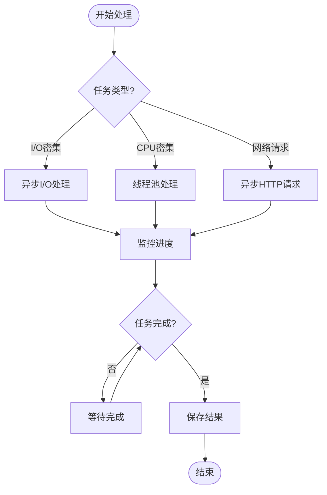

### 资源管理

工具模块实现了严格的资源管理策略：

1. **连接池管理：**
   - 数据库连接池
   - HTTP客户端连接池
   - 文件句柄管理

2. **内存使用控制：**
   - 大数据分批处理
   - 内存使用监控
   - 自动垃圾回收触发

3. **并发控制：**
   - 任务队列管理
   - 线程安全保证
   - 资源竞争避免

## 故障排除指南

### 常见问题诊断

**LLM调用失败：**
1. 检查API密钥配置
2. 验证网络连接
3. 查看调用日志
4. 尝试备用提供商

**论文获取失败：**
1. 验证arXiv API可用性
2. 检查网络代理设置
3. 查看请求频率限制
4. 确认论文ID格式

**回测引擎异常：**
1. 检查数据格式兼容性
2. 验证策略参数有效性
3. 查看Broker配置
4. 确认数据完整性

### 调试工具

工具模块提供了丰富的调试和监控功能：

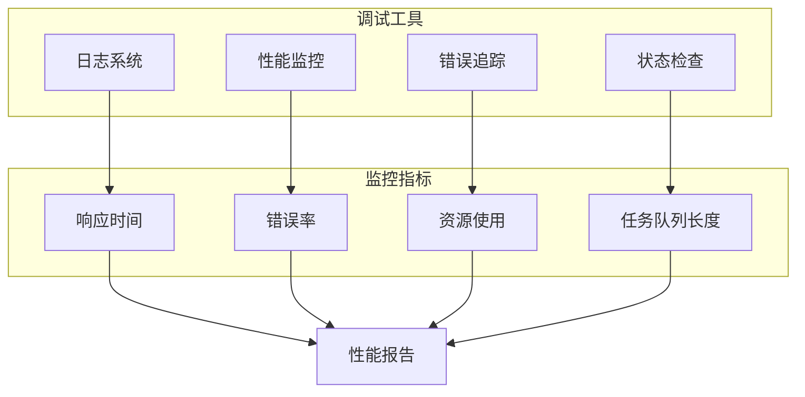

**章节来源**
- [src/tools/fetchers.py:324-389](file://src/tools/fetchers.py#L324-L389)
- [src/tools/literature_review_engine.py:65-87](file://src/tools/literature_review_engine.py#L65-L87)

## 结论

paperwriterAI的工具模块扩展指南提供了完整的开发框架和最佳实践。通过遵循本文档中定义的接口规范、设计模式和生命周期管理原则，开发者可以创建高质量的工具模块，无缝集成到现有的系统架构中。

关键要点包括：
- 统一的接口规范确保模块间的互操作性
- 清晰的生命周期管理保证系统的稳定性
- 完善的异常处理机制提升用户体验
- 灵活的配置管理支持不同的部署场景
- 丰富的测试工具确保代码质量

这些设计原则和实践为paperwriterAI的持续发展奠定了坚实的基础，也为未来的功能扩展提供了清晰的指导。

## 附录

### 开发最佳实践

1. **接口设计：**
   - 始终遵循统一的输入输出格式
   - 提供完整的参数验证
   - 实现优雅的错误处理

2. **代码组织：**
   - 使用清晰的模块划分
   - 保持高内聚低耦合
   - 编写详细的文档注释

3. **测试策略：**
   - 单元测试覆盖核心逻辑
   - 集成测试验证模块交互
   - 性能测试确保响应时间

4. **部署考虑：**
   - 考虑资源使用限制
   - 实现监控和告警
   - 提供配置灵活性

### 扩展开发模板

```python
class NewTool:
    """新工具开发模板"""
    
    def __init__(self, config: dict = None):
        """初始化工具"""
        self.config = config or {}
        self.logger = setup_logging(__name__)
        
    def initialize(self, config: dict) -> bool:
        """初始化阶段"""
        try:
            # 初始化资源
            return True
        except Exception as e:
            self.logger.error(f"初始化失败: {e}")
            return False
    
    def execute(self, input_data: dict) -> dict:
        """执行阶段"""
        try:
            # 执行核心逻辑
            return {"status": "success", "result": {}}
        except Exception as e:
            self.logger.error(f"执行失败: {e}")
            return {"status": "error", "error": str(e)}
    
    def cleanup(self) -> bool:
        """清理阶段"""
        try:
            # 释放资源
            return True
        except Exception as e:
            self.logger.error(f"清理失败: {e}")
            return False
```

这个模板提供了新工具开发的标准框架，确保新工具能够与现有系统无缝集成。