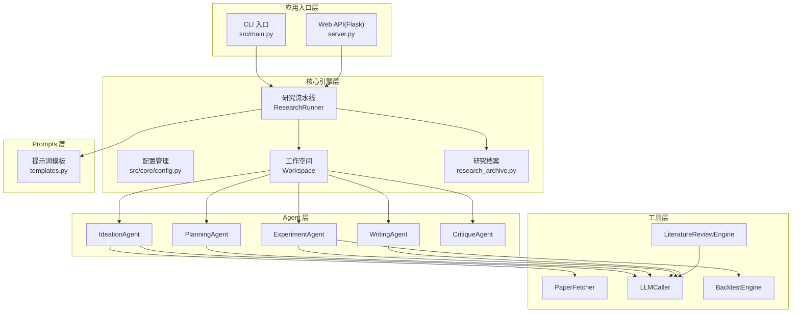
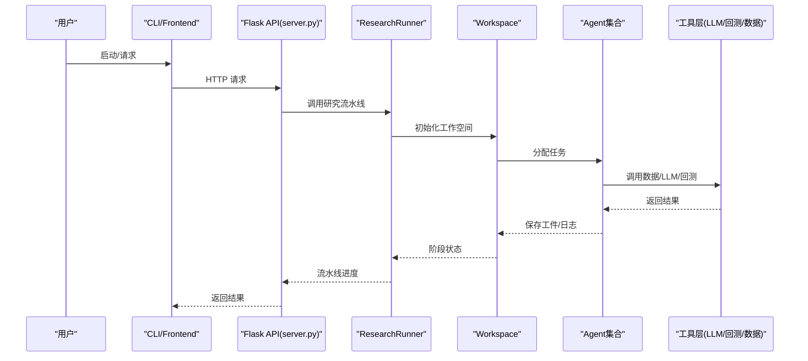
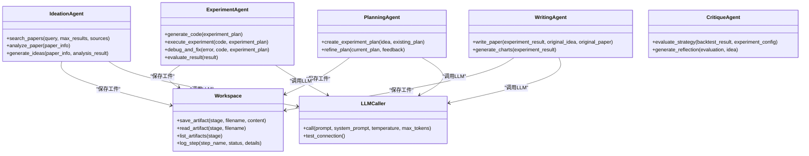
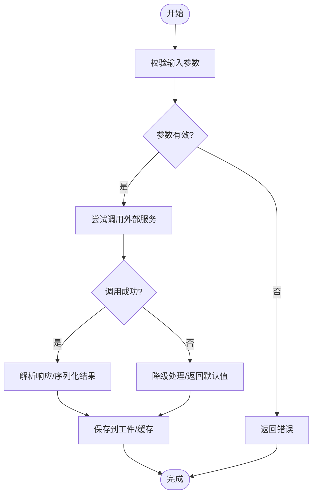
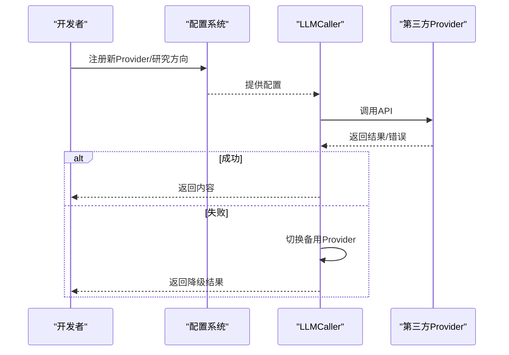
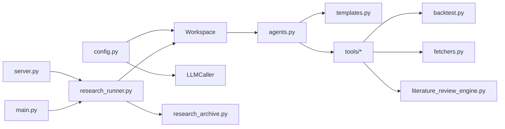

# 扩展开发指南

<cite>
**本文档引用的文件**
- [src/main.py](file://src/main.py)
- [src/agents/agents.py](file://src/agents/agents.py)
- [src/core/config.py](file://src/core/config.py)
- [src/tools/fetchers.py](file://src/tools/fetchers.py)
- [src/prompts/templates.py](file://src/prompts/templates.py)
- [src/tools/literature_review_engine.py](file://src/tools/literature_review_engine.py)
- [src/tools/backtest.py](file://src/tools/backtest.py)
- [src/core/research_runner.py](file://src/core/research_runner.py)
- [src/core/research_archive.py](file://src/core/research_archive.py)
- [server.py](file://server.py)
- [AGENTS.md](file://AGENTS.md)
- [requirements.txt](file://requirements.txt)
</cite>

## 目录
1. [简介](#简介)
2. [项目结构](#项目结构)
3. [核心组件](#核心组件)
4. [架构总览](#架构总览)
5. [详细组件分析](#详细组件分析)
6. [依赖关系分析](#依赖关系分析)
7. [性能考虑](#性能考虑)
8. [故障排除指南](#故障排除指南)
9. [结论](#结论)
10. [附录](#附录)

## 简介
本指南面向希望为 paperwriterAI 扩展开发的工程师，系统阐述如何添加新的 Agent 智能体、开发新的工具模块、扩展插件系统，并建立清晰的代码组织原则与最佳实践。文档基于现有代码库进行深入分析，提供可操作的扩展路径与可视化架构图。

## 项目结构
项目采用分层架构，核心分为以下层次：
- 应用入口层：CLI 与 Web API（Flask）
- 核心引擎层：研究流水线、工作空间、配置与数据管理
- Agent 层：四大智能体（Ideation/Planning/Experiment/Writing）
- 工具层：数据获取、回测、文献综述、质量流水线
- 服务层：AI 检测、论文评审等外部服务封装
- Prompts 层：统一的提示词模板

**图表来源**
- [src/main.py:35-100](file://src/main.py#L35-L100)
- [src/core/research_runner.py:278-327](file://src/core/research_runner.py#L278-L327)
- [src/core/config.py:256-384](file://src/core/config.py#L256-L384)
- [src/agents/agents.py:23-195](file://src/agents/agents.py#L23-L195)
- [src/tools/fetchers.py:20-163](file://src/tools/fetchers.py#L20-L163)
- [src/tools/backtest.py:181-347](file://src/tools/backtest.py#L181-L347)
- [src/tools/literature_review_engine.py:18-125](file://src/tools/literature_review_engine.py#L18-L125)
- [src/prompts/templates.py:1-50](file://src/prompts/templates.py#L1-L50)

**章节来源**
- [AGENTS.md:18-57](file://AGENTS.md#L18-L57)
- [src/core/config.py:18-57](file://src/core/config.py#L18-L57)

## 核心组件
- 配置与工作空间：统一管理 LLM Provider、研究方向、日志与备份、工作目录结构
- 四大 Agent：负责文献分析、实验计划、回测执行与论文撰写
- LLM 调用器：统一封装多 Provider 的调用与降级策略
- 数据与回测：论文抓取、市场数据获取、回测引擎
- 文献综述引擎：STORM 风格的视角生成、问题生成、证据收集与大纲生成
- 研究流水线：断点续跑、阶段推进、状态持久化

**章节来源**
- [src/core/config.py:204-251](file://src/core/config.py#L204-L251)
- [src/agents/agents.py:23-738](file://src/agents/agents.py#L23-L738)
- [src/tools/fetchers.py:290-800](file://src/tools/fetchers.py#L290-L800)
- [src/tools/literature_review_engine.py:18-125](file://src/tools/literature_review_engine.py#L18-L125)
- [src/core/research_runner.py:278-427](file://src/core/research_runner.py#L278-L427)

## 架构总览
系统通过 CLI 与 Web API 启动，统一调度研究流水线；Agent 通过 Workspace 协作，使用 LLM 调用器与工具层完成任务；配置与数据管理贯穿整个流程。

**图表来源**
- [src/main.py:443-517](file://src/main.py#L443-L517)
- [server.py:1-200](file://server.py#L1-L200)
- [src/core/research_runner.py:301-427](file://src/core/research_runner.py#L301-L427)
- [src/core/config.py:256-384](file://src/core/config.py#L256-L384)
- [src/agents/agents.py:23-195](file://src/agents/agents.py#L23-L195)

## 详细组件分析

### Agent 智能体扩展指南
- Agent 接口定义
  - 统一职责：每个 Agent 通常包含初始化、执行特定任务的方法与结果保存
  - 依赖注入：通过构造函数接收 LLMCaller、Workspace 等依赖
  - 工件保存：使用 Workspace.save_artifact 将中间结果持久化
- 生命周期管理
  - 初始化：加载配置、创建日志与备份管理器
  - 执行：按阶段推进，记录步骤日志
  - 结束：汇总状态，触发后续 Agent 或保存最终产物
- Agent 间交互模式
  - 通过 Workspace 协作：不同 Agent 读写同一工作空间的不同阶段目录
  - 通过提示词模板传递上下文：使用 templates.py 中的模板函数填充提示
  - 通过 LLM 调用器共享 Provider 配置：LLMCaller 支持主备 Provider 自动切换

**图表来源**
- [src/core/config.py:256-384](file://src/core/config.py#L256-L384)
- [src/tools/fetchers.py:290-800](file://src/tools/fetchers.py#L290-L800)
- [src/agents/agents.py:23-738](file://src/agents/agents.py#L23-L738)

**章节来源**
- [src/agents/agents.py:23-738](file://src/agents/agents.py#L23-L738)
- [src/core/config.py:256-384](file://src/core/config.py#L256-L384)
- [src/prompts/templates.py:677-758](file://src/prompts/templates.py#L677-L758)

### 工具模块开发指南
- 工具接口规范
  - 统一异常处理：对外抛出明确的错误信息，便于上层捕获与降级
  - 可选依赖：对可选库（如 backtrader、yfinance）进行条件导入与降级提示
  - 配置注入：通过构造函数或工厂函数注入配置，避免硬编码
- 数据处理流程
  - 输入清洗：统一清理文本、标准化字段
  - 结果序列化：优先使用 JSON，必要时保存为文件
  - 失败重试：对网络请求与外部 API 调用设置超时与重试
- 错误处理机制
  - 降级策略：API 不可用时返回结构化降级响应
  - 详细日志：记录调用参数、耗时、错误堆栈
  - 失败回滚：对关键写入操作进行备份与回滚

**图表来源**
- [src/tools/fetchers.py:290-800](file://src/tools/fetchers.py#L290-L800)
- [src/tools/literature_review_engine.py:89-95](file://src/tools/literature_review_engine.py#L89-L95)

**章节来源**
- [src/tools/fetchers.py:20-163](file://src/tools/fetchers.py#L20-L163)
- [src/tools/backtest.py:181-347](file://src/tools/backtest.py#L181-L347)
- [src/tools/literature_review_engine.py:18-125](file://src/tools/literature_review_engine.py#L18-L125)

### 插件开发指南
- 配置系统扩展
  - 新增 Provider：在 LLMProvider 枚举与 LLM_PROVIDER_CONFIG 中注册
  - 新增研究方向：在 ResearchDirection 与描述映射中添加
  - 配置加载优先级：config.local.json > config.json > 环境变量
- LLM 提供商集成
  - 统一接口：在 LLMCaller 中新增 Provider 的调用方法
  - 令牌统计：返回 prompt_tokens/completion_tokens/total_tokens
  - 失败降级：自动切换到备用 Provider
- 数据源适配
  - 新增数据源：在 PaperFetcher 或 MarketDataFetcher 中扩展
  - 标准化输出：统一字段与数据类型
  - 缓存与去重：避免重复抓取与存储

**图表来源**
- [src/core/config.py:204-251](file://src/core/config.py#L204-L251)
- [src/tools/fetchers.py:451-501](file://src/tools/fetchers.py#L451-L501)

**章节来源**
- [src/core/config.py:462-508](file://src/core/config.py#L462-L508)
- [src/tools/fetchers.py:290-800](file://src/tools/fetchers.py#L290-L800)

### 代码组织原则与命名规范
- 目录结构
  - src/core：核心配置、工作空间、研究流水线、数据管理
  - src/agents：智能体实现
  - src/tools：工具模块（数据获取、回测、文献综述）
  - src/prompts：提示词模板
  - src/services：外部服务封装
- 命名规范
  - 类名：首字母大写驼峰（如 Workspace、LLMCaller）
  - 方法名：小写下划线（如 save_artifact、fetch_from_arxiv）
  - 常量：全大写+下划线（如 MAX_TOKENS）
  - 文件名：小写+下划线（如 research_runner.py）
- 模块依赖关系
  - Agent 依赖 Workspace 与 LLMCaller
  - 工具层依赖配置与日志
  - 研究流水线协调各模块并持久化状态

**章节来源**
- [AGENTS.md:18-57](file://AGENTS.md#L18-L57)
- [src/core/config.py:256-384](file://src/core/config.py#L256-L384)

## 依赖关系分析

**图表来源**
- [src/core/config.py:256-384](file://src/core/config.py#L256-L384)
- [src/agents/agents.py:23-195](file://src/agents/agents.py#L23-L195)
- [src/tools/fetchers.py:290-800](file://src/tools/fetchers.py#L290-L800)
- [src/tools/backtest.py:181-347](file://src/tools/backtest.py#L181-L347)
- [src/tools/literature_review_engine.py:18-125](file://src/tools/literature_review_engine.py#L18-L125)
- [src/core/research_runner.py:278-427](file://src/core/research_runner.py#L278-L427)
- [src/core/research_archive.py:296-335](file://src/core/research_archive.py#L296-L335)
- [server.py:1-200](file://server.py#L1-L200)
- [src/main.py:35-100](file://src/main.py#L35-L100)

**章节来源**
- [requirements.txt:1-39](file://requirements.txt#L1-L39)

## 性能考虑
- LLM 调用
  - 统一超时与重试：避免阻塞与资源浪费
  - 令牌统计：监控成本与上下文窗口
  - 多 Provider 自动切换：提升可用性
- 回测性能
  - 数据预处理：减少重复计算
  - 指标计算：批量化与缓存
- 研究流水线
  - 断点续跑：避免重复计算
  - 并发控制：避免资源争用

[本节为通用指导，无需特定文件引用]

## 故障排除指南
- LLM 连接失败
  - 检查 API Key 与 Base URL 配置
  - 观察备用 Provider 是否生效
  - 查看 LLM 调用日志文件
- 回测异常
  - 检查数据格式与字段映射
  - 确认交易日历与停牌处理
  - 查看交易记录与权益曲线
- 文献综述生成失败
  - 检查提示词模板是否正确填充
  - 确认 JSON 解析与降级逻辑
- 研究档案异常
  - 检查目录权限与磁盘空间
  - 确认断点文件完整性

**章节来源**
- [src/tools/fetchers.py:324-390](file://src/tools/fetchers.py#L324-L390)
- [src/tools/backtest.py:248-327](file://src/tools/backtest.py#L248-L327)
- [src/tools/literature_review_engine.py:89-95](file://src/tools/literature_review_engine.py#L89-L95)
- [src/core/research_archive.py:107-115](file://src/core/research_archive.py#L107-L115)

## 结论
通过遵循本文档的扩展指南，开发者可以安全地为 paperwriterAI 添加新的 Agent、工具与插件，同时保持代码结构清晰、配置可扩展、错误可控。建议在扩展前先熟悉现有 Agent 的协作模式与 Workspace 的工件管理机制，确保新功能与现有系统无缝集成。

[本节为总结性内容，无需特定文件引用]

## 附录
- 快速开始
  - 安装依赖：pip install -r requirements.txt
  - 配置 API Key：config.local.json 或环境变量
  - 启动服务：python server.py
  - CLI 模式：python src/main.py --direction quant_finance --topic "LLM in trading"
- 常用端点
  - POST /api/research/full/<id>：端到端研究
  - POST /api/research/resume/<id>：断点续跑
  - POST /api/research/literature-review：STORM 文献综述
  - POST /api/quality/pipeline：质量流水线

**章节来源**
- [AGENTS.md:117-148](file://AGENTS.md#L117-L148)