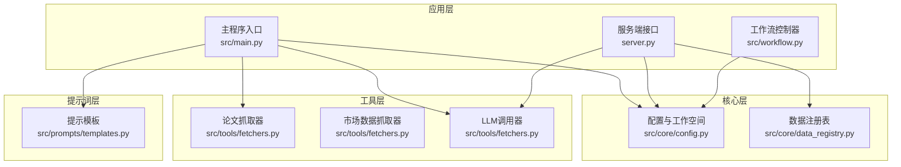
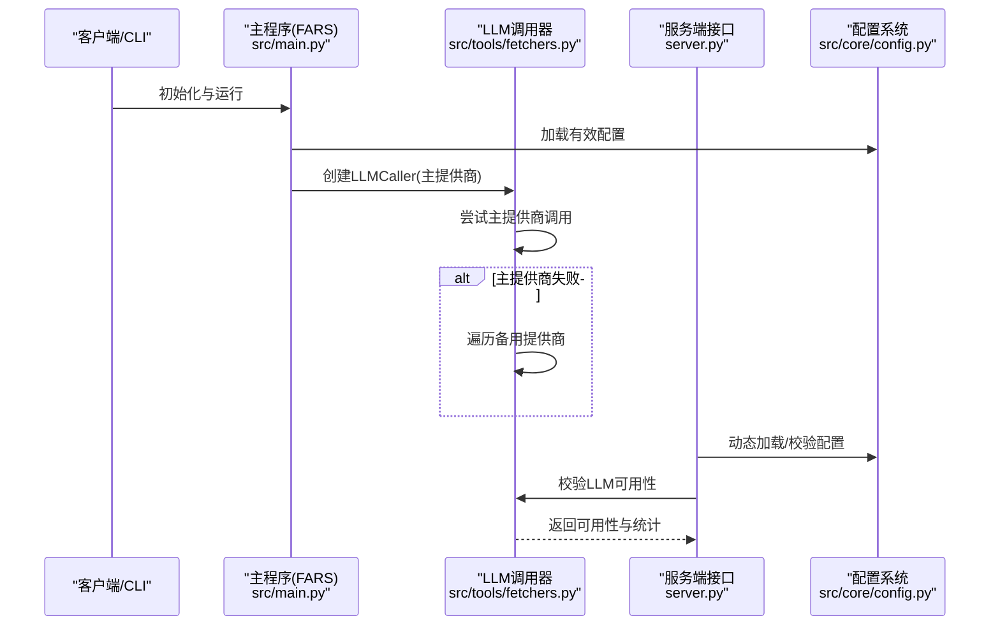
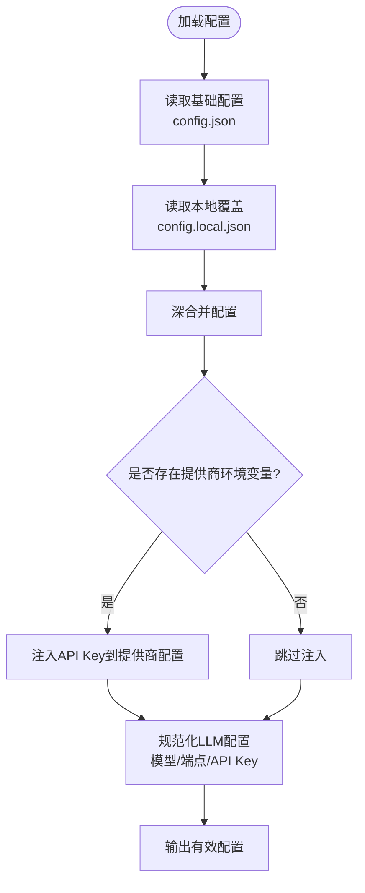
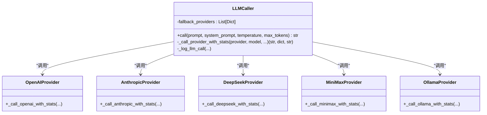
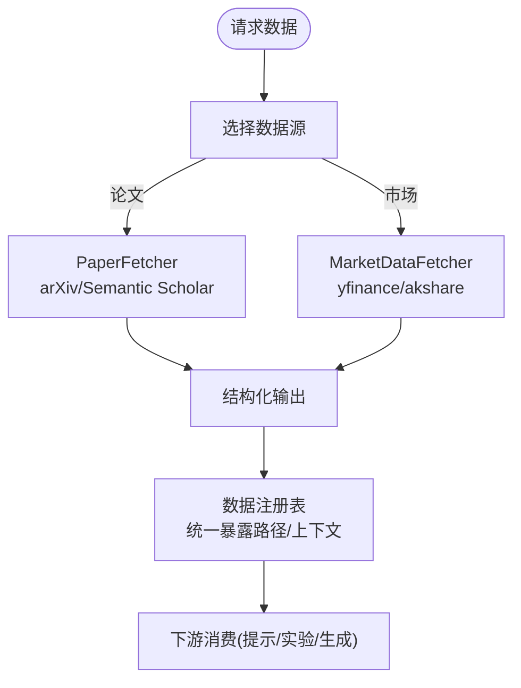
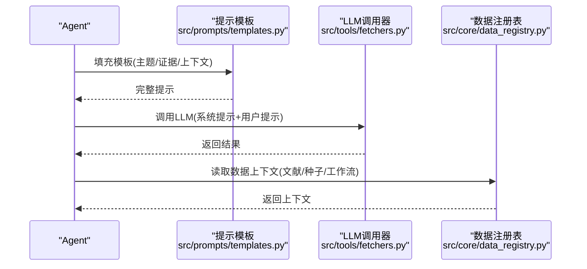
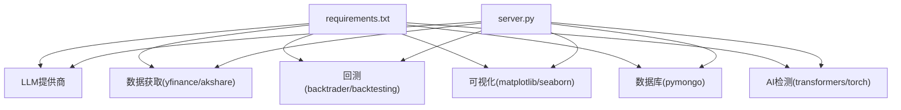

# 插件开发指南

<cite>
**本文档引用的文件**
- [src/main.py](file://src/main.py)
- [src/core/config.py](file://src/core/config.py)
- [src/core/data_registry.py](file://src/core/data_registry.py)
- [src/tools/fetchers.py](file://src/tools/fetchers.py)
- [src/prompts/templates.py](file://src/prompts/templates.py)
- [src/workflow.py](file://src/workflow.py)
- [server.py](file://server.py)
- [requirements.txt](file://requirements.txt)
- [src/core/__init__.py](file://src/core/__init__.py)
- [src/tools/__init__.py](file://src/tools/__init__.py)
</cite>

## 目录
1. [简介](#简介)
2. [项目结构](#项目结构)
3. [核心组件](#核心组件)
4. [架构总览](#架构总览)
5. [详细组件分析](#详细组件分析)
6. [依赖关系分析](#依赖关系分析)
7. [性能考量](#性能考量)
8. [故障排查指南](#故障排查指南)
9. [结论](#结论)
10. [附录](#附录)

## 简介
本指南面向希望为 paperwriterAI 扩展插件能力的开发者，系统阐述插件系统的架构设计、扩展点与接口规范，涵盖配置系统扩展、LLM 提供商插件、数据源适配器的开发模式；解释插件接口规范与注册机制（生命周期、依赖解析、版本兼容性）；提供具体开发示例（新增 LLM 提供商、第三方 API 适配、自定义数据源接入）；并给出安全、性能优化与错误隔离的最佳实践，以及打包、发布与版本管理建议。

## 项目结构
paperwriterAI 采用模块化分层设计：
- 核心层：配置与工作空间管理、数据注册表、数据库与PDF编译工具
- 工具层：论文抓取、市场数据抓取、LLM 调用器、回测引擎
- 应用层：主程序入口、工作流控制器、服务端接口
- 提示词层：多Agent专用提示模板

**图表来源**
- [src/main.py:35-100](file://src/main.py#L35-L100)
- [src/core/config.py:256-384](file://src/core/config.py#L256-L384)
- [src/core/data_registry.py:48-97](file://src/core/data_registry.py#L48-L97)
- [src/tools/fetchers.py:20-163](file://src/tools/fetchers.py#L20-L163)
- [src/workflow.py:19-56](file://src/workflow.py#L19-L56)
- [server.py:75-120](file://server.py#L75-L120)

**章节来源**
- [src/main.py:35-100](file://src/main.py#L35-L100)
- [src/core/config.py:256-384](file://src/core/config.py#L256-L384)
- [src/core/data_registry.py:48-97](file://src/core/data_registry.py#L48-L97)
- [src/tools/fetchers.py:20-163](file://src/tools/fetchers.py#L20-L163)
- [src/workflow.py:19-56](file://src/workflow.py#L19-L56)
- [server.py:75-120](file://server.py#L75-L120)

## 核心组件
- 配置与工作空间：集中管理全局配置、研究方向、日志与备份、项目工作区与工件存储
- 数据注册表：统一暴露数据目录、种子论文清单、工作流状态、MongoDB配置等
- LLM 调用器：抽象多提供商调用，支持主备切换、统计与调用日志
- 论文/市场数据抓取器：统一论文检索与下载、多数据源市场数据获取
- 提示模板：为多Agent设计的标准化提示词模板
- 工作流控制器：论文生成与投稿全流程自动化
- 服务端接口：REST API，动态加载配置、LLM可用性校验、运行指标统计

**章节来源**
- [src/core/config.py:388-514](file://src/core/config.py#L388-L514)
- [src/core/data_registry.py:48-189](file://src/core/data_registry.py#L48-L189)
- [src/tools/fetchers.py:290-800](file://src/tools/fetchers.py#L290-L800)
- [src/prompts/templates.py:1-758](file://src/prompts/templates.py#L1-L758)
- [src/workflow.py:19-286](file://src/workflow.py#L19-L286)
- [server.py:224-426](file://server.py#L224-L426)

## 架构总览
paperwriterAI 的插件化扩展围绕“配置-调用-存储”三要素展开：
- 配置系统扩展：通过配置文件与环境变量合并，支持多提供商参数与端点列表
- LLM 提供商插件：在 LLM 调用器中以统一接口注册新提供商，支持主备切换与统计
- 数据源适配器：在数据注册表与抓取器中扩展新数据源，统一对外暴露路径与上下文
- 服务端接口：动态加载配置、校验可用性、聚合运行指标

**图表来源**
- [src/main.py:62-100](file://src/main.py#L62-L100)
- [src/tools/fetchers.py:290-450](file://src/tools/fetchers.py#L290-L450)
- [server.py:392-426](file://server.py#L392-L426)
- [src/core/config.py:462-514](file://src/core/config.py#L462-L514)

**章节来源**
- [src/main.py:62-100](file://src/main.py#L62-L100)
- [src/tools/fetchers.py:290-450](file://src/tools/fetchers.py#L290-L450)
- [server.py:392-426](file://server.py#L392-L426)
- [src/core/config.py:462-514](file://src/core/config.py#L462-L514)

## 详细组件分析

### 配置系统扩展（插件化配置）
- 配置来源与合并：基础配置与本地覆盖配置深合并，支持按提供商覆盖参数
- 环境变量注入：按提供商映射环境变量，自动注入API Key
- LLM配置规范化：支持单一提供商或端点列表，统一输出有效配置
- 数据源配置：MongoDB URI/DB/Collections统一暴露，便于插件读取

**图表来源**
- [src/core/config.py:462-514](file://src/core/config.py#L462-L514)
- [src/core/config.py:427-484](file://src/core/config.py#L427-L484)
- [src/core/config.py:447-460](file://src/core/config.py#L447-L460)

**章节来源**
- [src/core/config.py:427-514](file://src/core/config.py#L427-L514)

### LLM 提供商插件（统一调用接口）
- 接口规范：LLM 调用器以统一方法调用不同提供商，内部封装消息构造与响应解析
- 主备切换：主提供商失败时自动遍历备用提供商列表，支持不同base_url与模型
- 统计与日志：记录调用ID、tokens、延迟、状态与错误详情，持久化至JSON
- 新提供商接入：在调用器中新增分支，遵循统一的消息格式与异常处理

**图表来源**
- [src/tools/fetchers.py:290-450](file://src/tools/fetchers.py#L290-L450)
- [src/tools/fetchers.py:503-666](file://src/tools/fetchers.py#L503-L666)

**章节来源**
- [src/tools/fetchers.py:290-450](file://src/tools/fetchers.py#L290-L450)
- [src/tools/fetchers.py:503-666](file://src/tools/fetchers.py#L503-L666)

### 数据源适配器（论文/市场数据）
- 论文数据源：支持 arXiv、Semantic Scholar，统一输出结构化字段
- 市场数据源：支持 yfinance、akshare，统一输出OHLCV与元信息
- 数据注册表：统一暴露数据目录、种子论文清单、工作流状态、MongoDB配置
- 插件扩展点：在抓取器中新增数据源分支，在注册表中补充路径与上下文

**图表来源**
- [src/tools/fetchers.py:20-163](file://src/tools/fetchers.py#L20-L163)
- [src/tools/fetchers.py:167-270](file://src/tools/fetchers.py#L167-L270)
- [src/core/data_registry.py:48-189](file://src/core/data_registry.py#L48-L189)

**章节来源**
- [src/tools/fetchers.py:20-163](file://src/tools/fetchers.py#L20-L163)
- [src/tools/fetchers.py:167-270](file://src/tools/fetchers.py#L167-L270)
- [src/core/data_registry.py:48-189](file://src/core/data_registry.py#L48-L189)

### 提示模板与工作流（插件交互点）
- 提示模板：为多Agent设计的标准化模板，便于插件替换或扩展
- 工作流：论文生成与投稿自动化，插件可在提示模板与数据上下文中扩展

**图表来源**
- [src/prompts/templates.py:677-758](file://src/prompts/templates.py#L677-L758)
- [src/tools/fetchers.py:391-450](file://src/tools/fetchers.py#L391-L450)
- [src/core/data_registry.py:100-189](file://src/core/data_registry.py#L100-L189)

**章节来源**
- [src/prompts/templates.py:677-758](file://src/prompts/templates.py#L677-L758)
- [src/tools/fetchers.py:391-450](file://src/tools/fetchers.py#L391-L450)
- [src/core/data_registry.py:100-189](file://src/core/data_registry.py#L100-L189)

## 依赖关系分析
- 第三方依赖集中在 LLM、数据获取、回测、可视化与AI检测等模块
- 服务端接口依赖工具模块与核心配置，动态加载配置并校验可用性
- 插件扩展应尽量复用现有接口，减少耦合

**图表来源**
- [requirements.txt:1-39](file://requirements.txt#L1-L39)
- [server.py:224-426](file://server.py#L224-L426)

**章节来源**
- [requirements.txt:1-39](file://requirements.txt#L1-L39)
- [server.py:224-426](file://server.py#L224-L426)

## 性能考量
- LLM调用统计与缓存：记录tokens与延迟，便于成本控制与性能优化
- 备用提供商：主提供商失败时快速切换，提升可用性
- 数据上下文聚合：通过数据注册表统一上下文，减少重复IO
- 回测与可视化：合理拆分步骤，避免一次性加载大量数据

[本节为通用指导，无需特定文件引用]

## 故障排查指南
- LLM可用性校验：服务端接口提供可用性检查与端点列表校验
- 调用日志：LLM调用器记录调用详情与错误堆栈，便于定位问题
- 配置热更新：服务端动态加载配置文件，检测mtime变化后重新加载
- 工作流日志：工作流控制器记录步骤状态与人工干预提示

**章节来源**
- [server.py:456-465](file://server.py#L456-L465)
- [src/tools/fetchers.py:324-390](file://src/tools/fetchers.py#L324-L390)
- [server.py:224-239](file://server.py#L224-L239)
- [src/workflow.py:30-56](file://src/workflow.py#L30-L56)

## 结论
paperwriterAI 的插件体系以“配置-调用-存储”为核心，通过统一的接口与规范，实现了LLM提供商与数据源的灵活扩展。开发者可基于现有接口快速接入新提供商或数据源，并通过配置系统与服务端接口实现动态加载与监控。建议在扩展时遵循接口规范、做好错误隔离与性能优化，并通过数据注册表统一暴露上下文，确保插件与核心系统的低耦合高内聚。

[本节为总结，无需特定文件引用]

## 附录

### 插件开发示例

#### 示例1：新增 LLM 提供商
- 在 LLM 调用器中新增提供商分支，实现消息构造与响应解析
- 在配置系统中添加提供商配置项与端点列表
- 在服务端接口中校验可用性与统计信息

**章节来源**
- [src/tools/fetchers.py:477-501](file://src/tools/fetchers.py#L477-L501)
- [src/core/config.py:462-514](file://src/core/config.py#L462-L514)
- [server.py:392-426](file://server.py#L392-L426)

#### 示例2：第三方 API 适配（论文/市场数据）
- 在抓取器中新增数据源分支，统一输出结构化字段
- 在数据注册表中补充路径与上下文，供提示与生成使用

**章节来源**
- [src/tools/fetchers.py:20-163](file://src/tools/fetchers.py#L20-L163)
- [src/tools/fetchers.py:167-270](file://src/tools/fetchers.py#L167-L270)
- [src/core/data_registry.py:48-189](file://src/core/data_registry.py#L48-L189)

#### 示例3：自定义数据源接入
- 在数据注册表中新增数据源路径与配置
- 在提示模板中引用数据上下文，确保插件透明接入

**章节来源**
- [src/core/data_registry.py:48-189](file://src/core/data_registry.py#L48-L189)
- [src/prompts/templates.py:172-189](file://src/prompts/templates.py#L172-L189)

### 安全、性能与错误隔离最佳实践
- 安全：严格校验API Key格式与长度，避免明文存储敏感信息
- 性能：记录tokens与延迟，限制调用历史数量，合理使用备用提供商
- 错误隔离：捕获异常并记录详细错误堆栈，区分主备提供商失败原因

**章节来源**
- [server.py:241-277](file://server.py#L241-L277)
- [src/tools/fetchers.py:324-390](file://src/tools/fetchers.py#L324-L390)

### 打包、发布与版本管理
- 依赖声明：在 requirements 中声明第三方依赖
- 版本兼容：通过深合并配置与环境变量注入，保证不同版本配置兼容
- 发布建议：遵循PEP 517/518，提供清晰的安装与配置文档

**章节来源**
- [requirements.txt:1-39](file://requirements.txt#L1-L39)
- [src/core/config.py:427-484](file://src/core/config.py#L427-L484)