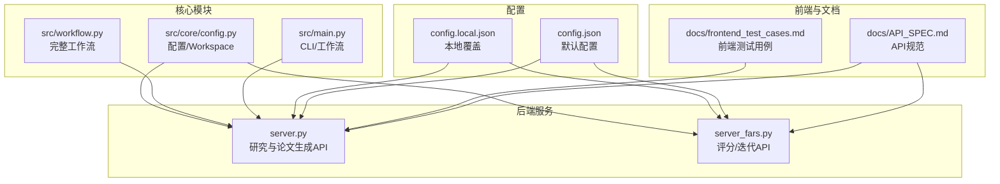
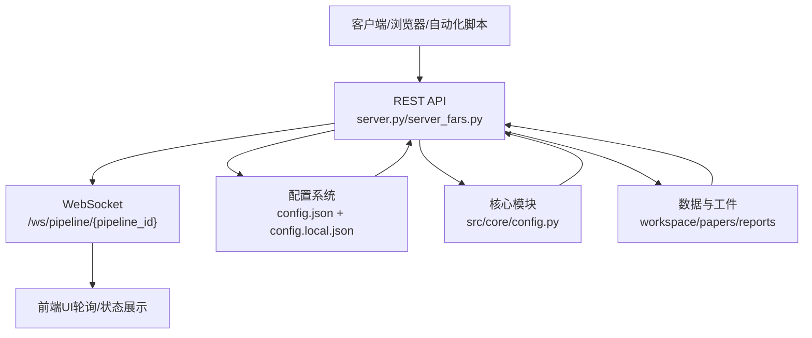
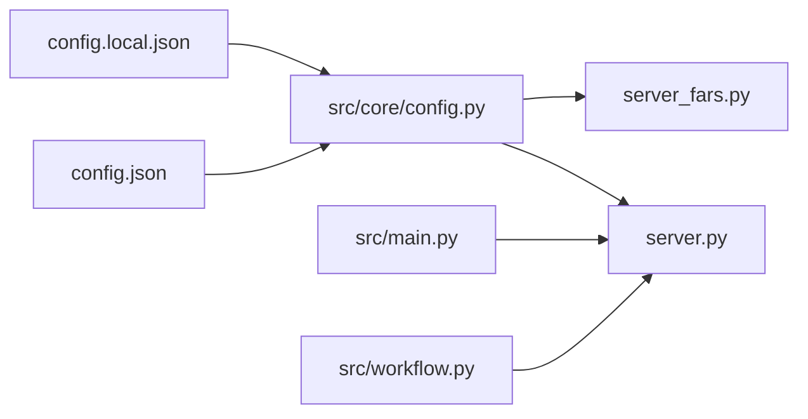

# API测试

<cite>
**本文引用的文件**
- [server.py](file://server.py)
- [server_fars.py](file://server_fars.py)
- [API_SPEC.md](file://docs/API_SPEC.md)
- [frontend_test_cases.md](file://docs/frontend_test_cases.md)
- [config.json](file://config.json)
- [config.local.json](file://config.local.json)
- [src/main.py](file://src/main.py)
- [src/workflow.py](file://src/workflow.py)
- [src/core/config.py](file://src/core/config.py)
</cite>

## 目录
1. [简介](#简介)
2. [项目结构](#项目结构)
3. [核心组件](#核心组件)
4. [架构总览](#架构总览)
5. [详细组件分析](#详细组件分析)
6. [依赖分析](#依赖分析)
7. [性能考虑](#性能考虑)
8. [故障排查指南](#故障排查指南)
9. [结论](#结论)
10. [附录](#附录)

## 简介
本文件面向paperwriterAI项目的API测试，覆盖RESTful API端点测试、请求/响应验证、错误处理测试；同时结合现有前端测试用例，给出WebSocket通信测试、实时状态同步测试与数据一致性验证的方法；并提供Postman测试套件与自动化API测试脚本的编写指南，以及性能、负载与安全测试的实施方案。

## 项目结构
- 后端服务分为两个入口：
  - 主研究流程与论文生成服务：server.py
  - FARS论文评分与迭代重生成服务：server_fars.py
- 文档与规范：
  - API规范：docs/API_SPEC.md
  - 前端测试用例：docs/frontend_test_cases.md
- 配置：
  - 默认配置：config.json
  - 本地覆盖配置：config.local.json
- 核心模块：
  - src/main.py：CLI与工作流入口
  - src/workflow.py：完整工作流编排
  - src/core/config.py：配置与Workspace管理

图表来源
- [server.py](file://server.py)
- [server_fars.py](file://server_fars.py)
- [API_SPEC.md](file://docs/API_SPEC.md)
- [frontend_test_cases.md](file://docs/frontend_test_cases.md)
- [config.json](file://config.json)
- [config.local.json](file://config.local.json)
- [src/main.py](file://src/main.py)
- [src/workflow.py](file://src/workflow.py)
- [src/core/config.py](file://src/core/config.py)

章节来源
- [server.py](file://server.py)
- [server_fars.py](file://server_fars.py)
- [API_SPEC.md](file://docs/API_SPEC.md)
- [frontend_test_cases.md](file://docs/frontend_test_cases.md)
- [config.json](file://config.json)
- [config.local.json](file://config.local.json)
- [src/main.py](file://src/main.py)
- [src/workflow.py](file://src/workflow.py)
- [src/core/config.py](file://src/core/config.py)

## 核心组件
- RESTful API端点
  - server.py：研究状态、分支、LLM调用记录、生成控制等
  - server_fars.py：论文评分、重生成、相关论文检索、迭代流程、历史记录等
- WebSocket
  - API规范中定义了基于WebSocket的实时进度推送（WS /ws/pipeline/{pipeline_id}）
- 配置与认证
  - 默认与本地配置合并机制
  - 认证字段标注为Bearer Token（待实现）

章节来源
- [server.py](file://server.py)
- [server_fars.py](file://server_fars.py)
- [API_SPEC.md](file://docs/API_SPEC.md)
- [config.json](file://config.json)
- [config.local.json](file://config.local.json)

## 架构总览
paperwriterAI的API层由两个Flask应用构成，分别承载不同的业务域。API规范文档提供了统一的REST接口契约，前端测试用例体现了与后端的交互与状态同步需求。配置系统支持默认配置与本地覆盖，并通过环境变量注入敏感信息。

图表来源
- [server.py](file://server.py)
- [server_fars.py](file://server_fars.py)
- [API_SPEC.md](file://docs/API_SPEC.md)
- [config.json](file://config.json)
- [config.local.json](file://config.local.json)
- [src/core/config.py](file://src/core/config.py)

## 详细组件分析

### REST API端点测试清单与验证要点
- server.py 关键端点
  - GET /api/research/state：获取研究状态（生成中/暂停/设置/当前分支/队列长度/日志）
  - POST /api/generate/start：开始生成
  - POST /api/generate/pause：暂停
  - POST /api/generate/resume：继续
  - POST /api/generate/stop：停止
  - POST /api/generate/next：下一篇文章
  - GET /api/branches：分支列表
  - GET /api/llm-calls：LLM调用记录列表（分页/过滤）
  - GET /api/llm-calls/<call_id>：LLM调用详情
  - GET /api/research/author-network/latest：作者网络
  - GET /api/research/citation-network/latest：引用网络
- server_fars.py 关键端点
  - POST /api/score：论文评分
  - POST /api/regenerate：重生成
  - POST /api/find_papers：查找相关论文
  - POST /api/iterate：完整迭代流程
  - GET /api/history：历史记录列表
  - GET /api/history/<id>：历史记录详情

验证要点
- 请求参数校验：必填项、类型、范围
- 响应结构一致性：success字段、data结构、错误对象格式
- 状态码映射：2xx/4xx/5xx与错误码对应
- 数据一致性：LLM调用记录与研究状态联动

章节来源
- [server.py](file://server.py)
- [server_fars.py](file://server_fars.py)
- [API_SPEC.md](file://docs/API_SPEC.md)

### WebSocket通信测试与实时状态同步
- WebSocket端点：/ws/pipeline/{pipeline_id}
- 消息类型：stage_update、stage_complete、error、complete
- 前端轮询策略：前端测试用例指出状态区每2秒自动刷新，可作为WebSocket订阅的对照验证

测试步骤
- 连接WS，订阅指定pipeline_id
- 观察消息到达顺序与内容完整性
- 对比WS消息与HTTP状态接口的最终一致性
- 断网/重连后，验证重连与状态同步

章节来源
- [API_SPEC.md](file://docs/API_SPEC.md)
- [frontend_test_cases.md](file://docs/frontend_test_cases.md)

### 错误处理测试
- 统一错误响应格式：success=false，包含error.code/message/details
- 常见错误码：VALIDATION_ERROR、UNAUTHORIZED、FORBIDDEN、NOT_FOUND、INTERNAL_ERROR、LLM_ERROR、BACKTEST_ERROR
- LLM错误：当LLM未就绪或调用失败时，需返回明确错误信息
- 数据库/文件异常：对数据库查询与文件读写失败进行边界测试

章节来源
- [API_SPEC.md](file://docs/API_SPEC.md)
- [server.py](file://server.py)
- [server_fars.py](file://server_fars.py)

### 请求/响应验证
- 请求体结构：遵循API规范中的JSON Schema
- 响应体结构：success=true时返回data；否则返回error对象
- 分页与过滤：/api/llm-calls支持limit/offset/agent/status/research_id过滤
- 历史记录：/api/history返回预览列表，/api/history/<id>返回完整记录

章节来源
- [API_SPEC.md](file://docs/API_SPEC.md)
- [server_fars.py](file://server_fars.py)

### 数据一致性验证
- 研究状态与LLM调用记录：LLM调用统计应与研究活动阶段一致
- 分支与论文：分支切换后，当前分支与论文归属应一致
- 历史记录：评分/重生成/迭代流程应写入历史并可查询

章节来源
- [server.py](file://server.py)
- [server_fars.py](file://server_fars.py)

### Postman测试套件编写指南
- 集成集合
  - server.py集合：研究状态、生成控制、分支、LLM调用记录、网络图
  - server_fars.py集合：评分/重生成/查找相关论文/迭代/历史
- 环境变量
  - BASE_URL、BEARER_TOKEN（待实现）、PIPELINE_ID、CALL_ID等
- 预请求脚本
  - 动态设置BEARER_TOKEN占位
  - 生成随机pipeline_id或call_id
- 测试脚本
  - 响应体结构断言
  - 状态码断言
  - WebSocket消息类型与字段断言（连接后逐条验证）

章节来源
- [API_SPEC.md](file://docs/API_SPEC.md)
- [server.py](file://server.py)
- [server_fars.py](file://server_fars.py)

### 自动化API测试脚本编写指南
- 推荐框架：pytest + requests 或 httpx
- 测试组织
  - conftest.py：初始化BASE_URL、认证、pipeline_id
  - test_server.py：server.py端点测试
  - test_fars.py：server_fars.py端点测试
  - test_websocket.py：WebSocket消息验证
- 断言策略
  - JSON Schema校验
  - 状态码与业务状态一致性
  - WebSocket消息序列与最终状态一致性
- 失败重试与超时
  - 对LLM调用与外部服务设置合理超时与重试

章节来源
- [server.py](file://server.py)
- [server_fars.py](file://server_fars.py)
- [API_SPEC.md](file://docs/API_SPEC.md)

### 性能测试、负载测试与安全测试
- 性能测试
  - 基准场景：单次评分/重生成/迭代流程的P95/P99延迟
  - 资源占用：CPU/内存/磁盘IO
- 负载测试
  - 并发请求：多用户同时发起评分/迭代
  - LLM限流：模拟上游限流，验证降级与重试
- 安全测试
  - 认证：Bearer Token（待实现）的鉴权与越权
  - 输入验证：SQL注入/命令注入/路径穿越（如下载/导出）
  - 敏感信息：避免在日志/响应中泄露API Key

章节来源
- [API_SPEC.md](file://docs/API_SPEC.md)
- [config.json](file://config.json)
- [config.local.json](file://config.local.json)

## 依赖分析
- 配置依赖
  - config.json提供默认配置，config.local.json用于本地覆盖
  - src/core/config.py负责配置合并与环境变量注入
- 模块依赖
  - server.py与server_fars.py均依赖核心模块与配置系统
  - src/main.py与src/workflow.py提供CLI与完整工作流，与API层协同

图表来源
- [config.json](file://config.json)
- [config.local.json](file://config.local.json)
- [src/core/config.py](file://src/core/config.py)
- [server.py](file://server.py)
- [server_fars.py](file://server_fars.py)
- [src/main.py](file://src/main.py)
- [src/workflow.py](file://src/workflow.py)

章节来源
- [config.json](file://config.json)
- [config.local.json](file://config.local.json)
- [src/core/config.py](file://src/core/config.py)
- [server.py](file://server.py)
- [server_fars.py](file://server_fars.py)
- [src/main.py](file://src/main.py)
- [src/workflow.py](file://src/workflow.py)

## 性能考虑
- LLM调用超时与降载：后端对LLM超时具备降载与续写能力，前端应避免因单次504导致崩溃
- 分页与过滤：LLM调用记录支持limit/offset与多条件过滤，避免一次性拉取过多数据
- 前端轮询：每2秒刷新策略与WebSocket订阅相结合，减少不必要的HTTP请求

章节来源
- [frontend_test_cases.md](file://docs/frontend_test_cases.md)
- [server_fars.py](file://server_fars.py)

## 故障排查指南
- LLM未就绪
  - 检查配置文件与环境变量，确认api_key/provider/model/base_url
  - 观察按钮状态与状态区提示
- WebSocket连接失败
  - 确认WS端点与pipeline_id
  - 对比WS消息与HTTP状态，定位不同步点
- 历史记录缺失
  - 检查历史记录保存逻辑与查询条件
- LLM调用记录异常
  - 校验过滤参数与分页参数
  - 对比LLM调用统计与研究阶段指标

章节来源
- [frontend_test_cases.md](file://docs/frontend_test_cases.md)
- [server.py](file://server.py)
- [server_fars.py](file://server_fars.py)

## 结论
本文给出了paperwriterAI的API测试全景：端点测试、请求/响应验证、错误处理、WebSocket与实时同步、数据一致性、Postman与自动化脚本、性能/负载/安全测试。建议在CI中集成自动化测试，并结合WebSocket与前端轮询策略，持续验证系统稳定性与一致性。

## 附录
- API规范速览：参见docs/API_SPEC.md
- 前端测试用例：参见docs/frontend_test_cases.md
- 配置文件：config.json、config.local.json
- 核心模块：src/core/config.py、src/main.py、src/workflow.py