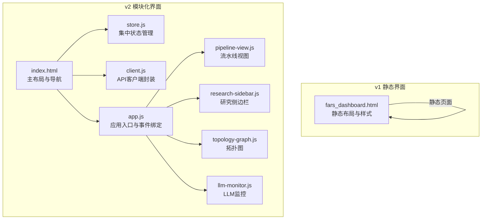
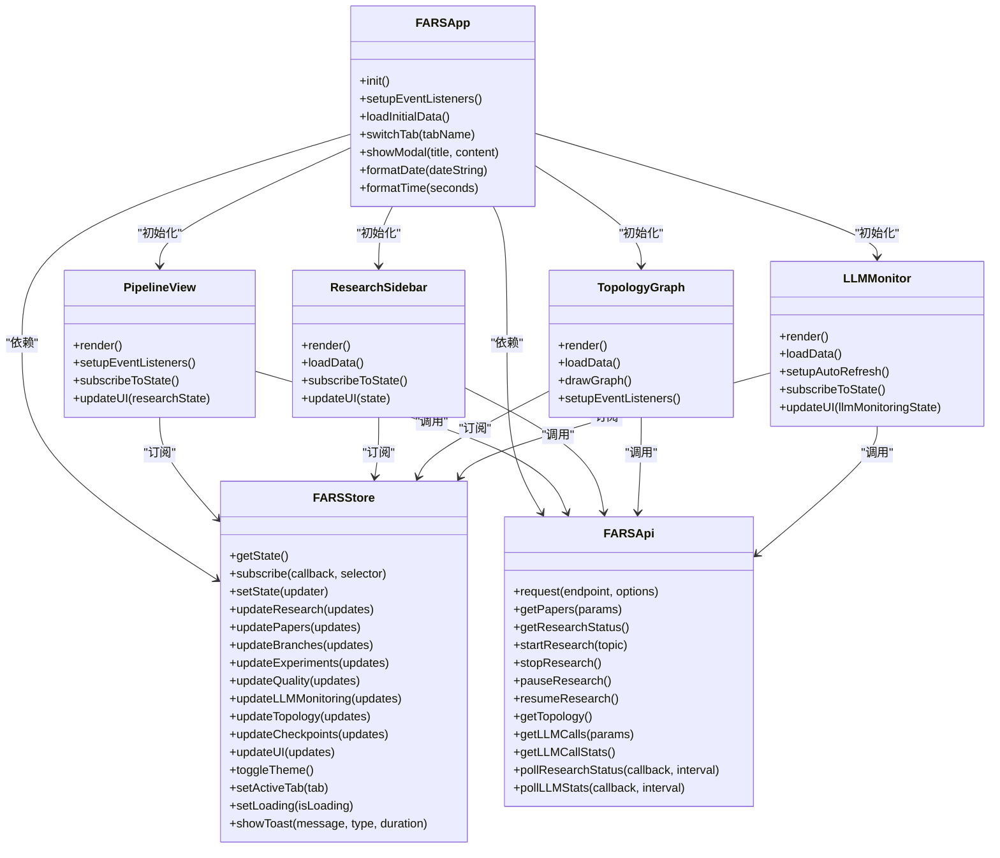
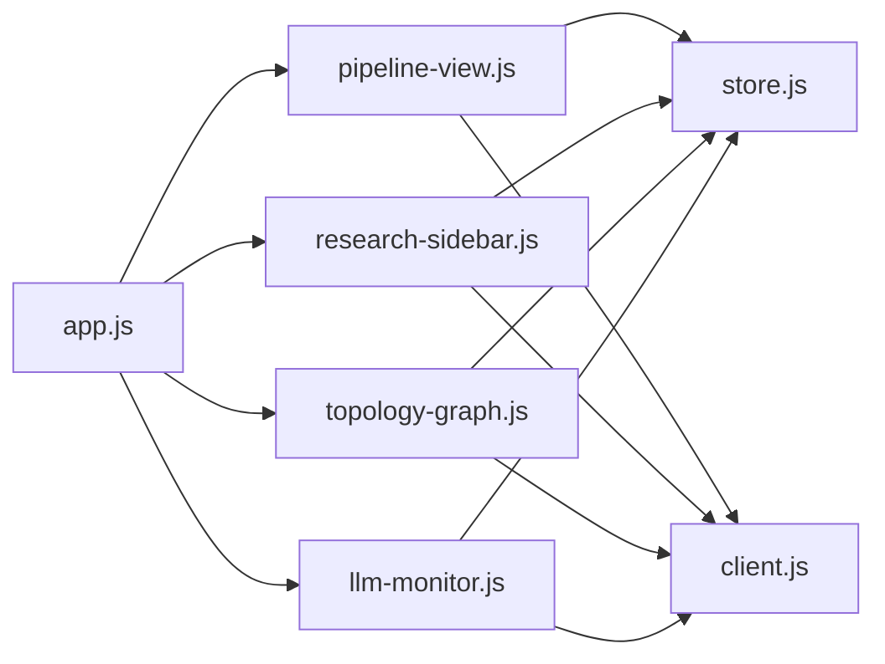

# 前端测试

<cite>
**本文档引用的文件**
- [frontend_test_cases.md](file://docs/frontend_test_cases.md)
- [fars_dashboard.html](file://docs/fars_dashboard.html)
- [index.html（v2主界面）](file://docs/v2/index.html)
- [test.html（v2测试页）](file://docs/v2/test.html)
- [app.js（v2主应用）](file://docs/v2/app.js)
- [store.js（v2状态管理）](file://docs/v2/state/store.js)
- [client.js（v2 API客户端）](file://docs/v2/api/client.js)
- [pipeline-view.js（v2流水线组件）](file://docs/v2/components/pipeline-view.js)
- [research-sidebar.js（v2侧边栏组件）](file://docs/v2/components/research-sidebar.js)
- [topology-graph.js（v2拓扑图组件）](file://docs/v2/components/topology-graph.js)
- [llm-monitor.js（v2 LLM监控组件）](file://docs/v2/components/llm-monitor.js)
</cite>

## 目录
1. [简介](#简介)
2. [项目结构](#项目结构)
3. [核心组件](#核心组件)
4. [架构总览](#架构总览)
5. [详细组件分析](#详细组件分析)
6. [依赖分析](#依赖分析)
7. [性能考虑](#性能考虑)
8. [故障排查指南](#故障排查指南)
9. [结论](#结论)
10. [附录](#附录)

## 简介
本文件面向paperwriterAI的前端测试，基于现有测试用例与源码，系统化梳理Dashboard界面的手动测试方法、轮询校验机制、用户交互验证，并扩展至Vue.js组件测试、WebSocket通信测试、状态同步测试的实施建议。同时提供浏览器兼容性、响应式设计、用户体验的测试指南，帮助测试人员高效覆盖关键路径与边界场景。

## 项目结构
- 前端采用双代系架构：
  - v1：静态HTML页面（fars_dashboard.html），用于演示与回归测试
  - v2：模块化组件架构（index.html + 多个组件JS），通过集中状态管理与API客户端驱动
- 测试用例来源：docs/frontend_test_cases.md，覆盖LLM配置、控制按钮、实验记录、拓扑图、作者-机构网络图、下载中心等关键功能域

**图表来源**
- [index.html（v2主界面）:1-118](file://docs/v2/index.html#L1-L118)
- [store.js（v2状态管理）:1-371](file://docs/v2/state/store.js#L1-L371)
- [client.js（v2 API客户端）:1-274](file://docs/v2/api/client.js#L1-L274)
- [app.js（v2主应用）:1-259](file://docs/v2/app.js#L1-L259)
- [pipeline-view.js（v2流水线组件）:1-233](file://docs/v2/components/pipeline-view.js#L1-L233)
- [research-sidebar.js（v2侧边栏组件）:1-299](file://docs/v2/components/research-sidebar.js#L1-L299)
- [topology-graph.js（v2拓扑图组件）:1-348](file://docs/v2/components/topology-graph.js#L1-L348)
- [llm-monitor.js（v2 LLM监控组件）:1-391](file://docs/v2/components/llm-monitor.js#L1-L391)

**章节来源**
- [frontend_test_cases.md:1-188](file://docs/frontend_test_cases.md#L1-L188)
- [fars_dashboard.html:1-800](file://docs/fars_dashboard.html#L1-L800)
- [index.html（v2主界面）:1-118](file://docs/v2/index.html#L1-L118)

## 核心组件
- 应用入口与事件绑定：负责初始化组件、注册事件、加载初始数据、主题与通知容器管理
- 状态管理：集中存储研究状态、论文、分支、实验、质量、LLM监控、拓扑、断点、UI等切片，支持订阅/发布与历史回放
- API客户端：封装40+ REST端点，统一请求配置与错误处理，并提供轮询工具方法
- 组件层：流水线视图、研究侧边栏、拓扑图、LLM监控等，均通过状态订阅驱动UI更新

**章节来源**
- [app.js:6-259](file://docs/v2/app.js#L6-L259)
- [store.js:6-371](file://docs/v2/state/store.js#L6-L371)
- [client.js:6-274](file://docs/v2/api/client.js#L6-L274)

## 架构总览
v2前端采用“应用入口 + 状态管理 + API客户端 + 组件”的分层架构。应用入口负责生命周期与事件绑定；状态管理提供单一可信数据源；API客户端封装网络请求与轮询；各组件通过订阅状态实现解耦更新。

**图表来源**
- [app.js:6-259](file://docs/v2/app.js#L6-L259)
- [store.js:6-371](file://docs/v2/state/store.js#L6-L371)
- [client.js:6-274](file://docs/v2/api/client.js#L6-L274)
- [pipeline-view.js:6-233](file://docs/v2/components/pipeline-view.js#L6-L233)
- [research-sidebar.js:6-299](file://docs/v2/components/research-sidebar.js#L6-L299)
- [topology-graph.js:6-348](file://docs/v2/components/topology-graph.js#L6-L348)
- [llm-monitor.js:6-391](file://docs/v2/components/llm-monitor.js#L6-L391)

## 详细组件分析

### LLM配置（配置面板）
- 测试目标：读取生效配置、保存配置并生效、未就绪时按钮禁用
- 关键点：
  - 展示内容需与后端 GET /api/config/llm 一致
  - api_key 不回显明文
  - 本地覆盖优先级高于全局配置
  - 未配置完整时，控制按钮禁用并提示原因

**章节来源**
- [frontend_test_cases.md:11-41](file://docs/frontend_test_cases.md#L11-L41)

### 控制按钮（开始/暂停/继续/停止/从0开始）
- 测试目标：从0开始、开始生成、暂停/继续、停止
- 关键点：
  - “从0开始”不删除 archives 与下载中心
  - 开始后状态区与实验记录区每2秒自动刷新
  - 暂停/继续按钮状态切换与 is_paused/is_generating 一致
  - 停止后恢复“开始”可用

**章节来源**
- [frontend_test_cases.md:42-81](file://docs/frontend_test_cases.md#L42-L81)

### 实验记录（研究流程阶段三卡片）
- 测试目标：初始展示、阶段推进与时间戳、指标字段、LLM超时降载
- 关键点：
  - 初始固定3张卡片（文献综述/引用图谱/写作落盘）
  - 进行中/完成阶段状态与时间戳写入
  - 指标包含进度%/LLM调用/Token/失败，阶段1额外含种子论文/假设数，阶段3额外含产物论文
  - 单次504不崩溃，自动降载并继续

**章节来源**
- [frontend_test_cases.md:82-134](file://docs/frontend_test_cases.md#L82-L134)

### 拓扑图（论文引用/关系图）
- 测试目标：节点显示短标题
- 关键点：
  - 节点显示论文标题短截断文本
  - hover/点击可见全称与 research_id

**章节来源**
- [frontend_test_cases.md:135-145](file://docs/frontend_test_cases.md#L135-L145)

### 作者-机构网络图
- 测试目标：节点类型与边、合作边权重渲染
- 关键点：
  - 包含作者节点、机构节点、作者-作者合作边、作者-机构隶属边
  - 合作次数越多的边越“粗/亮”

**章节来源**
- [frontend_test_cases.md:146-166](file://docs/frontend_test_cases.md#L146-L166)

### 下载中心
- 测试目标：种子文献可下载、研究产物可下载
- 关键点：
  - 种子论文PDF可下载且重启后仍可下载
  - 论文markdown/指标数据/回测数据下载链接有效且内容一致

**章节来源**
- [frontend_test_cases.md:167-187](file://docs/frontend_test_cases.md#L167-L187)

### Vue.js组件测试（实施建议）
- 单元测试
  - 使用Jest + Vue Test Utils对组件进行快照与行为测试
  - 针对props、events、slots进行断言
- 集成测试
  - 通过Mock Store与Mock API，模拟状态变更与异步数据流
  - 验证组件订阅状态后的UI更新逻辑
- 端到端测试
  - 使用Cypress/Puppeteer在真实DOM中验证交互链路

[本节为通用测试方法建议，不直接分析具体文件]

### WebSocket通信测试（实施建议）
- 连接建立与心跳
  - 验证连接建立、心跳间隔、断线重连
- 数据推送
  - 模拟后端推送研究状态、LLM调用统计、拓扑图增量更新
  - 校验前端接收与状态合并
- 错误处理
  - 模拟网络异常、协议错误、消息格式错误

[本节为通用测试方法建议，不直接分析具体文件]

### 状态同步测试（实施建议）
- 订阅一致性
  - 验证组件订阅的slice是否与实际状态一致
- 历史回放
  - 使用undo/redo验证状态历史与UI回滚
- 并发更新
  - 多个组件并发更新同一slice，验证最终一致性

[本节为通用测试方法建议，不直接分析具体文件]

## 依赖分析
- 组件间依赖
  - app.js 初始化多个组件，组件之间通过全局store与api交互
- 外部依赖
  - D3用于拓扑图绘制
  - Chart.js用于v2图表（index.html引入）

**图表来源**
- [app.js:240-259](file://docs/v2/app.js#L240-L259)
- [pipeline-view.js:6-233](file://docs/v2/components/pipeline-view.js#L6-L233)
- [research-sidebar.js:6-299](file://docs/v2/components/research-sidebar.js#L6-L299)
- [topology-graph.js:6-348](file://docs/v2/components/topology-graph.js#L6-L348)
- [llm-monitor.js:6-391](file://docs/v2/components/llm-monitor.js#L6-L391)
- [store.js:6-371](file://docs/v2/state/store.js#L6-L371)
- [client.js:6-274](file://docs/v2/api/client.js#L6-L274)

**章节来源**
- [index.html（v2主界面）:105-117](file://docs/v2/index.html#L105-L117)

## 性能考虑
- 轮询频率
  - 研究状态轮询建议2秒，LLM统计轮询建议5秒，避免过度请求
- 图表渲染
  - 拓扑图节点/边较多时，采用虚拟滚动或分批渲染
- 状态更新
  - 使用浅比较与选择器订阅，减少不必要的重渲染
- 缓存策略
  - 对静态资源与API结果进行合理缓存，降低重复请求

[本节提供通用指导，不直接分析具体文件]

## 故障排查指南
- 服务端未启动或端口占用
  - 确认Flask服务在8080端口运行
- CORS与跨域
  - 检查后端CORS配置，确保前端域名与端口允许
- 轮询失败
  - 检查轮询回调是否正确处理错误并终止轮询
- UI不更新
  - 确认组件已订阅对应状态slice，且状态更新通过setState触发

**章节来源**
- [frontend_test_cases.md:5-10](file://docs/frontend_test_cases.md#L5-L10)
- [client.js:244-270](file://docs/v2/api/client.js#L244-L270)

## 结论
本文基于现有测试用例与源码，建立了v2前端的测试体系：以状态管理为核心，围绕轮询机制与用户交互进行系统化验证；同时给出Vue.js组件测试、WebSocket通信测试与状态同步测试的实施建议，并提供浏览器兼容性、响应式设计与用户体验的测试要点。建议在CI中集成自动化测试，结合手动回归测试，确保Dashboard的稳定性与可用性。

## 附录

### 浏览器兼容性测试
- 支持范围：Chrome、Firefox、Safari、Edge最新版本
- 关键特性验证：fetch、Promise、ES6模块、SVG、CSS Grid/Flexbox
- 降级策略：对不支持的特性使用polyfill或替代方案

[本节为通用指导，不直接分析具体文件]

### 响应式设计测试
- 断点验证：1024px、640px以下布局适配
- 交互验证：触摸手势、键盘导航、缩放操作
- 性能验证：小屏设备上的渲染性能

**章节来源**
- [fars_dashboard.html:452-634](file://docs/fars_dashboard.html#L452-L634)
- [index.html（v2主界面）:36-45](file://docs/v2/index.html#L36-L45)

### 用户体验测试
- 可用性：按钮状态、提示信息、加载指示、错误反馈
- 无障碍：ARIA属性、键盘可达性、屏幕阅读器友好
- 一致性：视觉风格、交互模式、文案规范

[本节为通用指导，不直接分析具体文件]