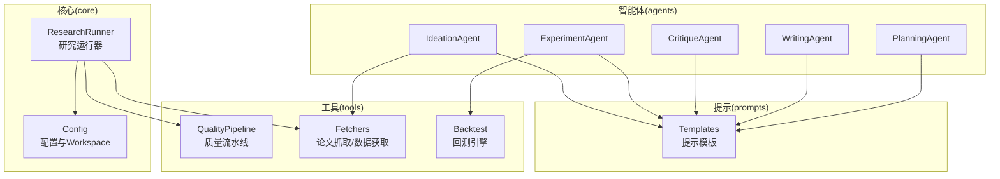
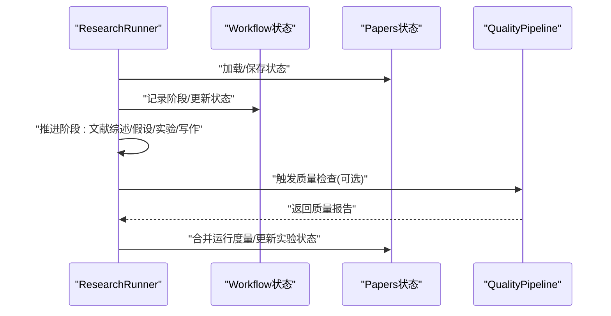
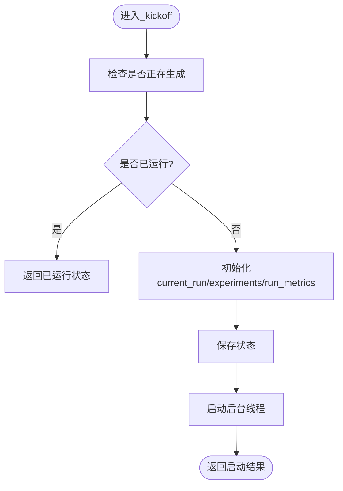
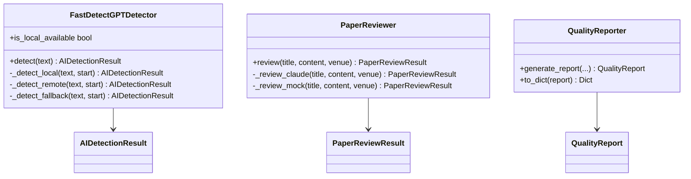
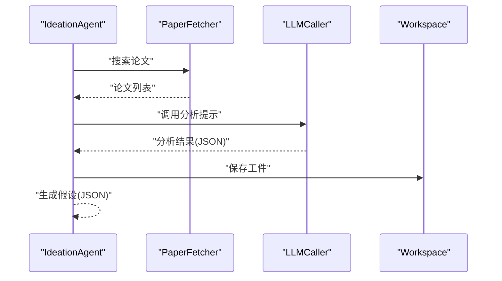
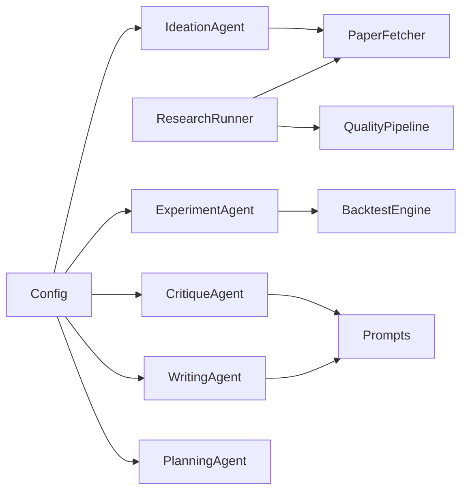

# 单元测试

<cite>
**本文档引用的文件**
- [src/core/research_runner.py](file://src/core/research_runner.py)
- [src/tools/quality_pipeline.py](file://src/tools/quality_pipeline.py)
- [src/agents/agents.py](file://src/agents/agents.py)
- [src/tools/fetchers.py](file://src/tools/fetchers.py)
- [src/tools/backtest.py](file://src/tools/backtest.py)
- [src/prompts/templates.py](file://src/prompts/templates.py)
- [src/core/config.py](file://src/core/config.py)
- [scripts/test_minimax.py](file://scripts/test_minimax.py)
- [requirements-dev.txt](file://requirements-dev.txt)
</cite>

## 目录
1. [简介](#简介)
2. [项目结构](#项目结构)
3. [核心组件](#核心组件)
4. [架构总览](#架构总览)
5. [详细组件分析](#详细组件分析)
6. [依赖分析](#依赖分析)
7. [性能考虑](#性能考虑)
8. [故障排查指南](#故障排查指南)
9. [结论](#结论)
10. [附录](#附录)

## 简介
本文件面向paperwriterAI项目，提供系统性的单元测试文档，重点覆盖以下核心模块的测试策略与实施要点：
- ResearchRunner：研究流水线的主控与状态机，负责启动、暂停、恢复、阶段推进与错误处理。
- QualityPipeline：论文质量流水线，包含AI痕迹检测、论文评审与综合报告生成。
- Agents：四个核心Agent（Ideation、Planning、Experiment、Writing、Critique），涵盖论文检索、假设生成、实验计划、回测执行、论文撰写与评估反思。

测试目标包括：
- 针对单个函数与类方法编写可重复、可隔离的测试用例。
- 合理准备测试数据与Mock对象，覆盖正常路径、边界条件与异常分支。
- 明确pytest配置、运行方式与覆盖率要求，并给出最佳实践。

## 项目结构
项目采用“功能域+层次”混合组织方式：
- src/core：核心配置、数据注册、数据库、研究图谱、研究运行器等。
- src/tools：工具模块（论文抓取、回测、质量流水线等）。
- src/agents：智能体模块（四个Agent及其提示模板）。
- src/prompts：提示模板。
- scripts：辅助脚本（如LLM连接测试）。
- requirements-dev.txt：开发依赖（如Playwright）。

**图表来源**
- [src/core/research_runner.py](file://src/core/research_runner.py)
- [src/tools/quality_pipeline.py](file://src/tools/quality_pipeline.py)
- [src/agents/agents.py](file://src/agents/agents.py)
- [src/tools/fetchers.py](file://src/tools/fetchers.py)
- [src/tools/backtest.py](file://src/tools/backtest.py)
- [src/prompts/templates.py](file://src/prompts/templates.py)
- [src/core/config.py](file://src/core/config.py)

**章节来源**
- [src/core/research_runner.py](file://src/core/research_runner.py)
- [src/tools/quality_pipeline.py](file://src/tools/quality_pipeline.py)
- [src/agents/agents.py](file://src/agents/agents.py)
- [src/tools/fetchers.py](file://src/tools/fetchers.py)
- [src/tools/backtest.py](file://src/tools/backtest.py)
- [src/prompts/templates.py](file://src/prompts/templates.py)
- [src/core/config.py](file://src/core/config.py)

## 核心组件
本节概述各模块的关键职责与测试关注点：
- ResearchRunner：状态机驱动、并发控制、阶段推进、异常处理、日志与度量合并。
- QualityPipeline：Fast-DetectGPT本地/远程检测、统计降级、Claude/PaperReview评审、综合报告生成。
- Agents：PaperFetcher、LLMCaller、CodeExecutor、BacktestEngine等外部依赖需Mock；各Agent方法的输入输出结构化JSON解析与异常分支。
- 工具与配置：PaperFetcher、MarketDataFetcher、BacktestEngine、Workspace、BackupManager、配置加载与环境变量注入。

**章节来源**
- [src/core/research_runner.py](file://src/core/research_runner.py)
- [src/tools/quality_pipeline.py](file://src/tools/quality_pipeline.py)
- [src/agents/agents.py](file://src/agents/agents.py)
- [src/tools/fetchers.py](file://src/tools/fetchers.py)
- [src/tools/backtest.py](file://src/tools/backtest.py)
- [src/core/config.py](file://src/core/config.py)

## 架构总览
下图展示研究运行器与质量流水线的交互关系及关键依赖：

**图表来源**
- [src/core/research_runner.py](file://src/core/research_runner.py)
- [src/tools/quality_pipeline.py](file://src/tools/quality_pipeline.py)

## 详细组件分析

### ResearchRunner 测试策略
- 关注点
  - 状态机与并发控制：is_running、全局锁、_running标志。
  - 启动与恢复：kickoff、_run_writing_resume、_run_pipeline。
  - 阶段推进：文献综述、假设生成、实验与写作阶段的状态同步。
  - 异常处理：捕获异常、设置活动状态、记录日志、清理资源。
  - 度量与日志：_merge_run_phase_metrics、_record_phase、add_log。
- 测试要点
  - Mock存储接口(load_papers/save_papers/load_workflow/save_workflow/create_paper/add_log)以隔离IO。
  - 使用threading.Lock与daemon线程，注意并发竞态与停止信号。
  - 覆盖resume路径、暂停/恢复、错误路径与完成路径。
  - 验证阶段推进顺序与实验状态同步。
- 推荐用例
  - 正常启动与完成。
  - 暂停/恢复流程。
  - 重复启动与already_running。
  - 异常中断与错误状态。
  - 阶段推进与度量合并。

**图表来源**
- [src/core/research_runner.py](file://src/core/research_runner.py)

**章节来源**
- [src/core/research_runner.py](file://src/core/research_runner.py)

### QualityPipeline 测试策略
- 关注点
  - Fast-DetectGPT检测器：本地可用性判断、本地/远程/降级分支。
  - 论文评审器：Claude API可用性与降级模拟。
  - 报告生成：综合判定、星级评分、建议与摘要。
- 测试要点
  - Mock requests/anthropic/transformers以覆盖不同分支。
  - 本地可用性：虚拟环境路径、模型缓存存在与否。
  - 远程API：超时、异常、返回格式不匹配。
  - 评审模拟：基于内容特征的评分分布。
  - 报告生成：阈值判定、风险等级、推荐项。
- 推荐用例
  - 本地模型可用/不可用路径。
  - 远程API可用/不可用路径。
  - 评审API可用/不可用路径。
  - 综合报告阈值边界与星级计算。

**图表来源**
- [src/tools/quality_pipeline.py](file://src/tools/quality_pipeline.py)

**章节来源**
- [src/tools/quality_pipeline.py](file://src/tools/quality_pipeline.py)

### Agents 测试策略
- 关注点
  - PaperFetcher：arXiv/Semantic Scholar抓取、PDF下载、文本清洗。
  - LLMCaller：不同Provider调用、系统提示、温度与最大token。
  - CodeExecutor：沙箱执行、错误捕获、结果解析。
  - BacktestEngine：策略回测、指标计算、交易记录。
  - Workspace：工件保存/读取、备份、日志。
- 测试要点
  - Mock外部API与文件系统，保证可重复性。
  - 验证JSON解析与异常分支（找不到JSON、格式错误）。
  - 回测引擎的指标边界与异常情况。
  - Workspace的备份与恢复行为。
- 推荐用例
  - PaperFetcher：正常/异常抓取、PDF下载、解析。
  - IdeationAgent：搜索、分析、假设生成、保存工件。
  - PlanningAgent：实验计划生成与优化。
  - ExperimentAgent：代码生成、执行、调试修复、评估。
  - WritingAgent：论文生成、图表代码生成、工件保存。
  - CritiqueAgent：策略评估与反思。

**图表来源**
- [src/agents/agents.py](file://src/agents/agents.py)
- [src/tools/fetchers.py](file://src/tools/fetchers.py)
- [src/prompts/templates.py](file://src/prompts/templates.py)
- [src/core/config.py](file://src/core/config.py)

**章节来源**
- [src/agents/agents.py](file://src/agents/agents.py)
- [src/tools/fetchers.py](file://src/tools/fetchers.py)
- [src/prompts/templates.py](file://src/prompts/templates.py)
- [src/core/config.py](file://src/core/config.py)

### 工具与配置测试策略
- PaperFetcher：arXiv/Semantic Scholar抓取、PDF下载、文本清洗。
- MarketDataFetcher：yfinance/akshare可用性与数据获取。
- BacktestEngine：策略回测、指标计算、交易记录。
- Workspace：工件保存/读取、备份、日志、上传。
- Config：配置加载、环境变量注入、有效配置合并。

**章节来源**
- [src/tools/fetchers.py](file://src/tools/fetchers.py)
- [src/tools/backtest.py](file://src/tools/backtest.py)
- [src/core/config.py](file://src/core/config.py)

## 依赖分析
- 外部依赖
  - requests、arxiv、anthropic、transformers、torch、backtrader等。
- 内部依赖
  - ResearchRunner依赖fetchers、paper_extractor、research_graphs等。
  - Agents依赖fetchers、backtest、prompts、config、workspace。
  - QualityPipeline依赖Fast-DetectGPT、PaperReviewer、QualityReporter。
- 耦合与内聚
  - 各模块通过接口（回调/工厂）解耦，便于Mock与测试。
  - 建议在测试中显式注入依赖，避免全局状态影响。

**图表来源**
- [src/core/research_runner.py](file://src/core/research_runner.py)
- [src/agents/agents.py](file://src/agents/agents.py)
- [src/tools/fetchers.py](file://src/tools/fetchers.py)
- [src/tools/backtest.py](file://src/tools/backtest.py)
- [src/prompts/templates.py](file://src/prompts/templates.py)
- [src/core/config.py](file://src/core/config.py)

**章节来源**
- [src/core/research_runner.py](file://src/core/research_runner.py)
- [src/agents/agents.py](file://src/agents/agents.py)
- [src/tools/fetchers.py](file://src/tools/fetchers.py)
- [src/tools/backtest.py](file://src/tools/backtest.py)
- [src/prompts/templates.py](file://src/prompts/templates.py)
- [src/core/config.py](file://src/core/config.py)

## 性能考虑
- 测试执行速度
  - 优先使用Mock减少网络与磁盘IO。
  - 对大型模型（如transformers）仅做轻量级校验，避免实际推理。
- 并发与竞态
  - 研究运行器涉及多线程与全局状态，测试中应覆盖竞态场景与停止信号。
- 资源占用
  - 回测与PDF生成等操作在测试中尽量缩短数据规模或使用合成数据。

## 故障排查指南
- LLM连接测试
  - 可参考scripts/test_minimax.py，验证MiniMax API连通性与系统提示调用。
- 常见问题
  - API Key缺失导致远程服务不可用，应切换至降级方案或模拟响应。
  - 网络超时/异常，需在测试中模拟超时与异常返回。
  - 文件系统权限与路径问题，确保测试临时目录可写。

**章节来源**
- [scripts/test_minimax.py](file://scripts/test_minimax.py)

## 结论
通过为ResearchRunner、QualityPipeline与Agents建立完善的单元测试，可显著提升系统的可靠性与可维护性。建议遵循“隔离外部依赖、覆盖关键分支、验证边界条件”的原则，并结合pytest与覆盖率工具持续改进测试质量。

## 附录

### pytest配置与运行指南
- 安装开发依赖
  - 使用requirements-dev.txt安装Playwright等开发工具。
- 基本运行
  - 使用pytest命令运行测试套件，默认扫描tests/与根目录下的test_*.py。
- 覆盖率要求
  - 建议核心模块（如ResearchRunner、QualityPipeline、Agents）达到中等以上覆盖率（例如≥70%），关键分支与异常路径应100%覆盖。
- 最佳实践
  - 使用pytest fixtures管理Mock与临时目录。
  - 为每个模块建立独立的测试包，命名与源码对应。
  - 对并发逻辑使用线程安全的Mock与锁。
  - 对外部API调用使用有限超时与重试策略。

### 测试数据与Mock清单
- 存储接口Mock
  - load_papers/save_papers/load_workflow/save_workflow/create_paper/add_log
- 外部服务Mock
  - requests（PaperFetcher/Semantic Scholar）、anthropic（PaperReviewer）、transformers/torch（Fast-DetectGPT）
- 文件系统Mock
  - Workspace保存/读取、备份、上传
- 合成数据
  - 回测引擎使用小规模合成数据，确保指标可预期

### 示例用例路径（不展示具体代码）
- ResearchRunner
  - [src/core/research_runner.py](file://src/core/research_runner.py)
- QualityPipeline
  - [src/tools/quality_pipeline.py](file://src/tools/quality_pipeline.py)
- Agents
  - [src/agents/agents.py](file://src/agents/agents.py)
- 工具与配置
  - [src/tools/fetchers.py](file://src/tools/fetchers.py)
  - [src/tools/backtest.py](file://src/tools/backtest.py)
  - [src/core/config.py](file://src/core/config.py)
- LLM连接测试
  - [scripts/test_minimax.py](file://scripts/test_minimax.py)