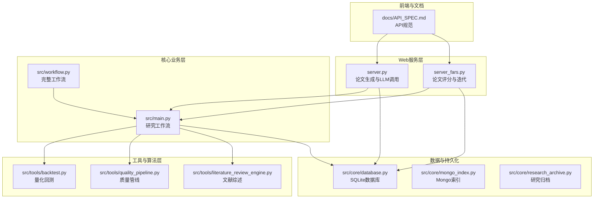
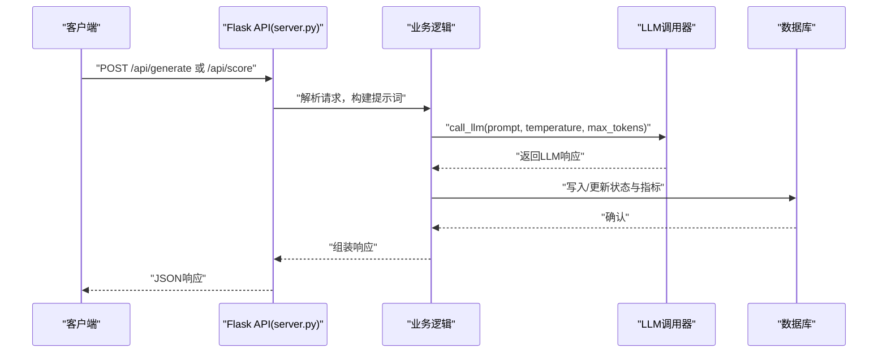
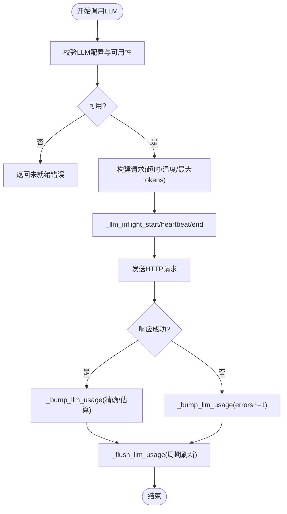
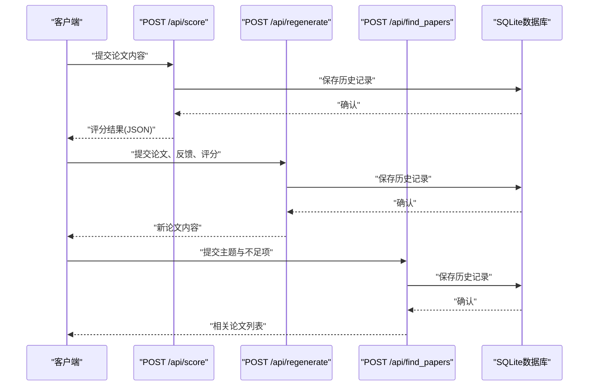
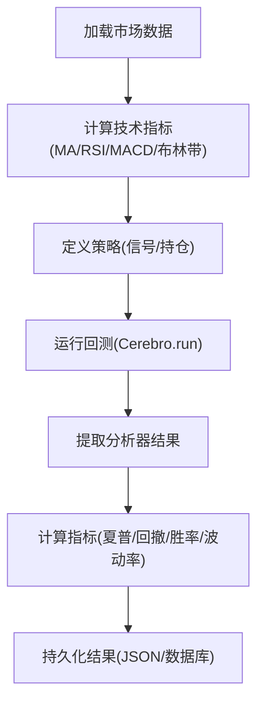
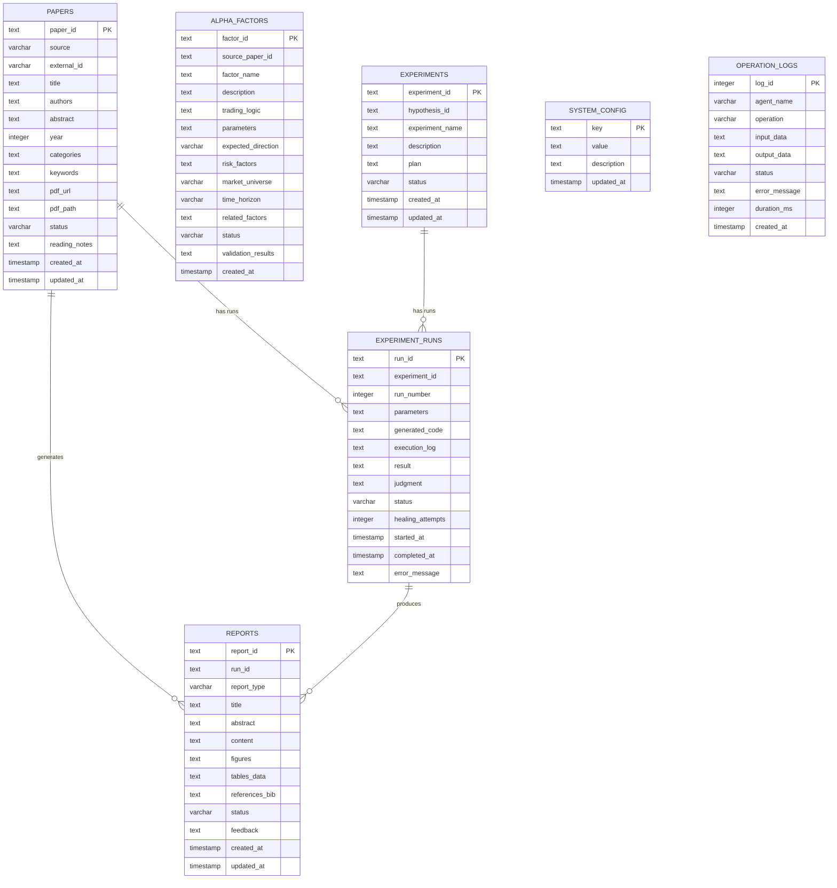
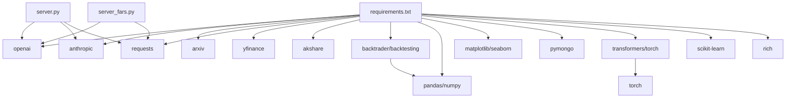

# 性能测试

<cite>
**本文档引用的文件**
- [server.py](file://server.py)
- [server_fars.py](file://server_fars.py)
- [src/main.py](file://src/main.py)
- [src/workflow.py](file://src/workflow.py)
- [src/tools/backtest.py](file://src/tools/backtest.py)
- [src/core/database.py](file://src/core/database.py)
- [docs/API_SPEC.md](file://docs/API_SPEC.md)
- [requirements.txt](file://requirements.txt)
- [data/bac/20260620_172525/research/RS-20260620-001_Automate_Strategy_Finding_with_LLM_in_Qu/code/RS-20260620-001_experiment.py](file://data/bac/20260620_172525/research/RS-20260620-001_Automate_Strategy_Finding_with_LLM_in_Qu/code/RS-20260620-001_experiment.py)
</cite>

## 目录
1. [简介](#简介)
2. [项目结构](#项目结构)
3. [核心组件](#核心组件)
4. [架构概览](#架构概览)
5. [详细组件分析](#详细组件分析)
6. [依赖关系分析](#依赖关系分析)
7. [性能考量](#性能考量)
8. [故障排查指南](#故障排查指南)
9. [结论](#结论)
10. [附录](#附录)

## 简介
本性能测试文档面向paperwriterAI系统，提供系统化的性能基准测试方法与实施方案，涵盖响应时间测试、吞吐量测试、并发用户测试、量化回测性能测试、LLM调用性能监控、内存使用监控、压力与稳定性测试、瓶颈识别与优化建议等。文档结合代码库中的实际实现，给出可操作的测试流程与工具使用指南。

## 项目结构
paperwriterAI采用前后端分离与模块化设计：
- Web服务层：Flask应用（server.py、server_fars.py），提供论文评分、重生成、LLM调用记录等API。
- 核心业务层：src/main.py、src/workflow.py，负责研究工作流、论文生成、实验执行等。
- 工具与算法层：src/tools/backtest.py（量化回测）、src/tools/quality_pipeline.py（质量管线）、src/tools/literature_review_engine.py（文献综述）等。
- 数据与持久化：src/core/database.py（SQLite数据库）、src/core/mongo_index.py（Mongo索引）、src/core/research_archive.py（研究归档）。
- 前端与文档：docs/（前端页面与API规范）。

**图表来源**
- [server.py:1-120](file://server.py#L1-L120)
- [server_fars.py:13-50](file://server_fars.py#L13-L50)
- [src/main.py:35-120](file://src/main.py#L35-L120)
- [src/workflow.py:19-40](file://src/workflow.py#L19-L40)
- [src/tools/backtest.py:181-220](file://src/tools/backtest.py#L181-L220)
- [src/core/database.py:15-40](file://src/core/database.py#L15-L40)
- [docs/API_SPEC.md:1-40](file://docs/API_SPEC.md#L1-L40)

**章节来源**
- [server.py:1-120](file://server.py#L1-L120)
- [server_fars.py:1-80](file://server_fars.py#L1-L80)
- [src/main.py:1-120](file://src/main.py#L1-L120)
- [src/workflow.py:1-60](file://src/workflow.py#L1-L60)
- [src/tools/backtest.py:1-60](file://src/tools/backtest.py#L1-L60)
- [src/core/database.py:1-60](file://src/core/database.py#L1-L60)
- [docs/API_SPEC.md:1-60](file://docs/API_SPEC.md#L1-L60)

## 核心组件
- LLM调用与监控：server.py中封装了LLM配置、可用性检查、调用超时控制、并发调用跟踪与使用统计（令牌用量、调用次数、错误计数、进行中的请求快照）。
- 论文评分与迭代：server_fars.py提供评分、重生成、查找相关论文的API，并记录LLM调用日志。
- 量化回测：src/tools/backtest.py提供基于Backtrader的回测引擎、策略实现与指标计算。
- 数据库与索引：src/core/database.py创建论文、实验、报告、操作日志等表及索引；mongo_index.py提供MongoDB索引与查询。
- 研究工作流：src/main.py与src/workflow.py串联搜索、分析、生成、编译、投稿等阶段。
- API规范：docs/API_SPEC.md定义REST API端点、参数与响应格式。

**章节来源**
- [server.py:489-666](file://server.py#L489-L666)
- [server_fars.py:261-393](file://server_fars.py#L261-L393)
- [src/tools/backtest.py:181-327](file://src/tools/backtest.py#L181-L327)
- [src/core/database.py:23-189](file://src/core/database.py#L23-L189)
- [src/main.py:353-427](file://src/main.py#L353-L427)
- [src/workflow.py:233-278](file://src/workflow.py#L233-L278)
- [docs/API_SPEC.md:19-120](file://docs/API_SPEC.md#L19-L120)

## 架构概览
paperwriterAI的性能测试应覆盖以下关键路径：
- API请求链路：客户端 → Flask路由 → 业务逻辑（搜索、分析、生成、回测）→ LLM调用 → 数据库/文件系统。
- LLM调用链路：调用器 → LLM提供商（OpenAI、Minimax、Gemini、自定义）→ 超时与重试 → 使用统计与错误上报。
- 回测链路：数据获取 → 指标计算 → 策略回测 → 指标汇总 → 结果持久化。

**图表来源**
- [server.py:773-800](file://server.py#L773-L800)
- [server.py:489-666](file://server.py#L489-L666)
- [src/core/database.py:15-40](file://src/core/database.py#L15-L40)

**章节来源**
- [server.py:773-800](file://server.py#L773-L800)
- [server.py:489-666](file://server.py#L489-L666)
- [src/core/database.py:15-40](file://src/core/database.py#L15-L40)

## 详细组件分析

### LLM调用性能监控
- 配置与可用性：动态合并配置、校验API密钥、提供多端点支持与环境变量覆盖。
- 调用超时：统一请求超时（论文生成场景默认较长），支持环境变量覆盖。
- 并发与进行中请求：维护进行中请求快照，心跳更新耗时，便于实时观测LLM排队与等待。
- 使用统计：缓冲区聚合调用次数、错误数、令牌用量（精确与估算），周期性刷新至运行指标。

**图表来源**
- [server.py:392-425](file://server.py#L392-L425)
- [server.py:498-553](file://server.py#L498-L553)
- [server.py:568-666](file://server.py#L568-L666)

**章节来源**
- [server.py:392-425](file://server.py#L392-L425)
- [server.py:498-553](file://server.py#L498-L553)
- [server.py:568-666](file://server.py#L568-L666)

### 论文评分与迭代性能
- 评分API：构造评分提示词，调用LLM，解析JSON，记录历史与评分结果。
- 重生成API：基于评审反馈与各项指标生成新论文。
- 查找相关论文API：推荐有助于改进的参考文献。
- LLM调用记录API：查询llm_call_logs表，支持分页、筛选agent/status/research_id。

**图表来源**
- [server_fars.py:440-593](file://server_fars.py#L440-L593)
- [server_fars.py:676-800](file://server_fars.py#L676-L800)
- [src/core/database.py:23-189](file://src/core/database.py#L23-L189)

**章节来源**
- [server_fars.py:440-593](file://server_fars.py#L440-L593)
- [server_fars.py:676-800](file://server_fars.py#L676-L800)
- [src/core/database.py:23-189](file://src/core/database.py#L23-L189)

### 量化回测性能
- 回测引擎：基于Backtrader，支持策略注册、数据注入、分析器（夏普比率、最大回撤、收益、交易分析）。
- 指标计算：总收益、年化收益、年化波动率、卡玛比率、索提诺比率、胜率、盈利因子等。
- 实战实验：使用真实A股数据（baostock）与技术指标（MA、RSI、MACD、布林带），计算策略收益与指标，保存结果。

**图表来源**
- [src/tools/backtest.py:181-327](file://src/tools/backtest.py#L181-L327)
- [data/bac/20260620_172525/research/RS-20260620-001_Automate_Strategy_Finding_with_LLM_in_Qu/code/RS-20260620-001_experiment.py:105-168](file://data/bac/20260620_172525/research/RS-20260620-001_Automate_Strategy_Finding_with_LLM_in_Qu/code/RS-20260620-001_experiment.py#L105-L168)

**章节来源**
- [src/tools/backtest.py:181-327](file://src/tools/backtest.py#L181-L327)
- [data/bac/20260620_172525/research/RS-20260620-001_Automate_Strategy_Finding_with_LLM_in_Qu/code/RS-20260620-001_experiment.py:1-120](file://data/bac/20260620_172525/research/RS-20260620-001_Automate_Strategy_Finding_with_LLM_in_Qu/code/RS-20260620-001_experiment.py#L1-L120)

### 数据库与索引性能
- 表结构：论文、因子、实验、实验运行、报告、系统配置、操作日志等。
- 索引：为常用查询字段建立索引（如papers.source/year/status、experiments/status等）。
- 示例数据：初始化示例论文与系统配置，便于测试与演示。

**图表来源**
- [src/core/database.py:28-189](file://src/core/database.py#L28-L189)

**章节来源**
- [src/core/database.py:23-189](file://src/core/database.py#L23-L189)

## 依赖关系分析
- 外部依赖：OpenAI、Anthropic、Arxiv、Requests、yfinance、akshare、Backtrader、Backtesting、Pandas、NumPy、Matplotlib、Seaborn、MongoDB、Transformers、Torch、Scikit-learn、Rich等。
- 关键性能依赖：LLM提供商（OpenAI、Minimax、Gemini、自定义）、量化回测框架（Backtrader/Backtesting）、数据获取（baostock/yfinance/akshare）。

**图表来源**
- [requirements.txt:1-39](file://requirements.txt#L1-L39)
- [server.py:6-31](file://server.py#L6-L31)
- [server_fars.py:6-11](file://server_fars.py#L6-L11)

**章节来源**
- [requirements.txt:1-39](file://requirements.txt#L1-L39)
- [server.py:6-31](file://server.py#L6-L31)
- [server_fars.py:6-11](file://server_fars.py#L6-L11)

## 性能考量

### 响应时间测试
- 目标：测量API端点（/api/score、/api/regenerate、/api/find_papers、/api/iterate）的P50/P90/P95响应时间。
- 方法：使用wrk或Apache Bench发起固定并发与持续时间的请求，采集响应时间分布。
- 关注点：LLM调用超时、网络延迟、数据库写入、文件系统IO。

**章节来源**
- [docs/API_SPEC.md:440-593](file://docs/API_SPEC.md#L440-L593)
- [server.py:773-800](file://server.py#L773-L800)

### 吞吐量测试
- 目标：测量单位时间内处理的请求数（QPS/RPS）。
- 方法：逐步增加并发数，观察吞吐量变化与错误率上升点。
- 关注点：LLM限流、数据库连接池、线程阻塞、磁盘IO。

**章节来源**
- [server.py:489-666](file://server.py#L489-L666)
- [src/core/database.py:15-40](file://src/core/database.py#L15-L40)

### 并发用户测试
- 目标：模拟多用户同时访问，验证系统稳定性与资源占用。
- 方法：使用JMeter或Locust，配置恒定并发与随机think time。
- 关注点：内存泄漏、线程安全、LLM配额限制、数据库锁竞争。

**章节来源**
- [server.py:489-666](file://server.py#L489-L666)
- [server_fars.py:676-800](file://server_fars.py#L676-L800)

### 量化回测性能测试
- 目标：评估回测引擎在不同数据规模下的执行时间与内存占用。
- 方法：使用不同长度的历史数据（如1K/10K/100K条）运行相同策略，记录CPU/内存/时间指标。
- 关注点：指标计算复杂度、回测框架性能、数据预处理开销。

**章节来源**
- [src/tools/backtest.py:248-327](file://src/tools/backtest.py#L248-L327)
- [data/bac/20260620_172525/research/RS-20260620-001_Automate_Strategy_Finding_with_LLM_in_Qu/code/RS-20260620-001_experiment.py:124-168](file://data/bac/20260620_172525/research/RS-20260620-001_Automate_Strategy_Finding_with_LLM_in_Qu/code/RS-20260620-001_experiment.py#L124-L168)

### LLM调用性能测试
- 目标：测量LLM调用延迟、成功率、令牌用量与错误率。
- 方法：批量触发LLM调用，记录请求耗时、使用统计、错误堆栈。
- 关注点：超时配置、重试策略、并发上限、提供商限流。

**章节来源**
- [server.py:489-666](file://server.py#L489-L666)
- [server.py:773-800](file://server.py#L773-L800)

### 内存使用监控
- 目标：监控进程内存峰值与GC行为，识别内存泄漏与热点。
- 方法：使用psutil或系统工具（top、htop、valgrind）采集内存曲线。
- 关注点：长生命周期对象、缓存增长、回测中间数据、LLM响应缓存。

**章节来源**
- [server.py:489-666](file://server.py#L489-L666)
- [src/tools/backtest.py:181-327](file://src/tools/backtest.py#L181-L327)

### 压力与稳定性测试
- 目标：在极限负载下验证系统崩溃点与恢复能力。
- 方法：逐步放大并发与数据规模，观察错误率、重启频率、慢查询比例。
- 关注点：数据库连接池耗尽、LLM配额耗尽、文件句柄泄露。

**章节来源**
- [src/core/database.py:15-40](file://src/core/database.py#L15-L40)
- [server.py:489-666](file://server.py#L489-L666)

## 故障排查指南
- LLM未就绪：检查配置合并、API密钥有效性、端点规范化与环境变量覆盖。
- LLM调用异常：查看进行中请求快照与使用统计，定位超时、错误与排队等待。
- 数据库问题：确认表结构与索引是否存在，查询是否命中索引，必要时重建索引。
- 回测异常：检查数据预处理、指标计算边界条件、回测框架版本兼容性。

**章节来源**
- [server.py:224-239](file://server.py#L224-L239)
- [server.py:241-277](file://server.py#L241-L277)
- [server.py:489-666](file://server.py#L489-L666)
- [src/core/database.py:23-189](file://src/core/database.py#L23-L189)

## 结论
通过系统化的性能测试与监控，paperwriterAI可在LLM密集型与数据密集型场景下实现稳定高效运行。建议将LLM调用监控、数据库索引优化、回测引擎性能调优与并发压力测试纳入持续集成流程，确保在生产环境中维持可预期的性能与稳定性。

## 附录

### 性能测试工具使用指南
- 响应时间与吞吐量：使用wrk或Apache Bench进行基准测试。
- 并发测试：使用JMeter或Locust模拟多用户场景。
- 内存监控：使用psutil或系统工具采集内存曲线。
- 回测性能：针对不同数据规模运行策略，记录CPU/内存/时间指标。

**章节来源**
- [docs/API_SPEC.md:440-593](file://docs/API_SPEC.md#L440-L593)
- [src/tools/backtest.py:248-327](file://src/tools/backtest.py#L248-L327)