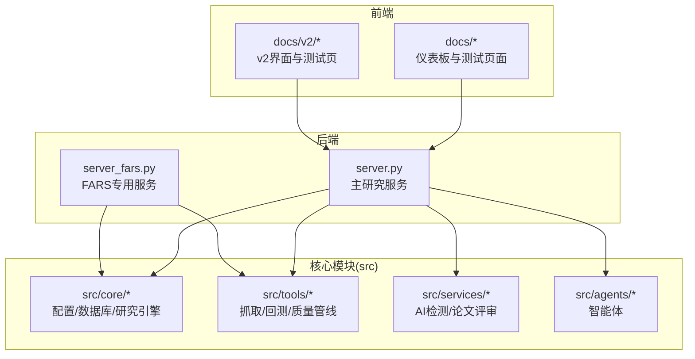
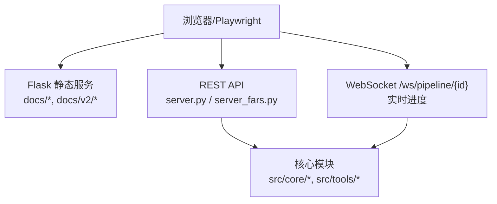
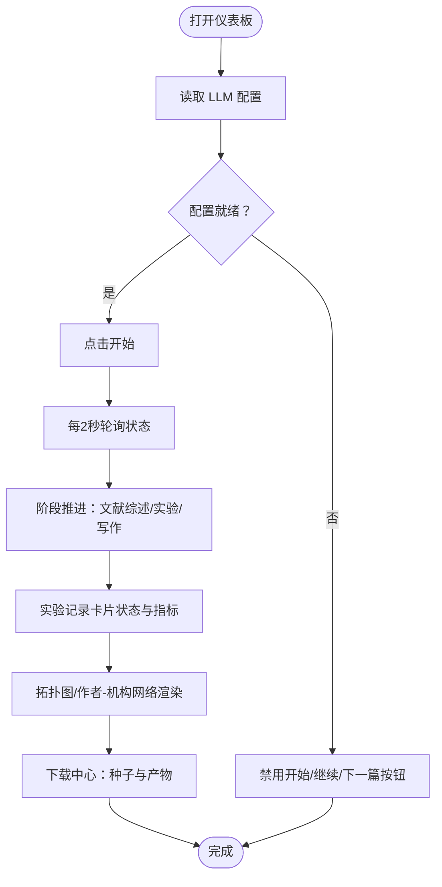
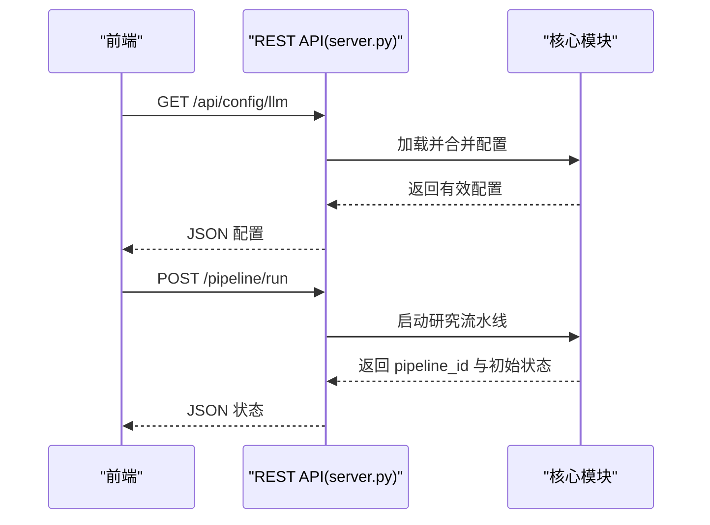
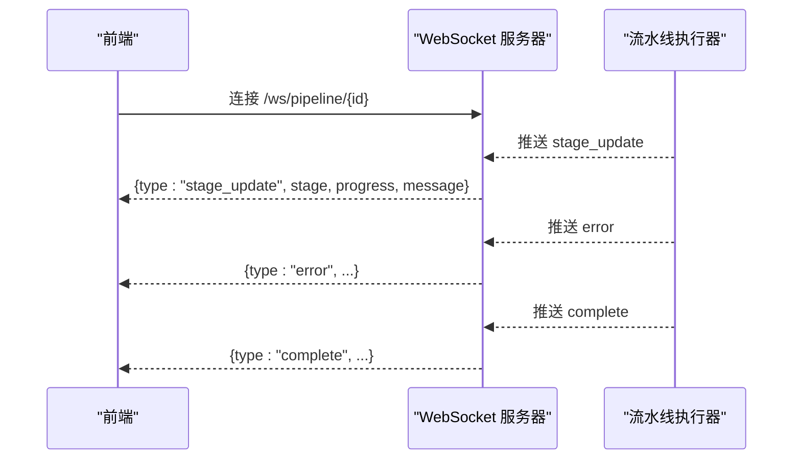
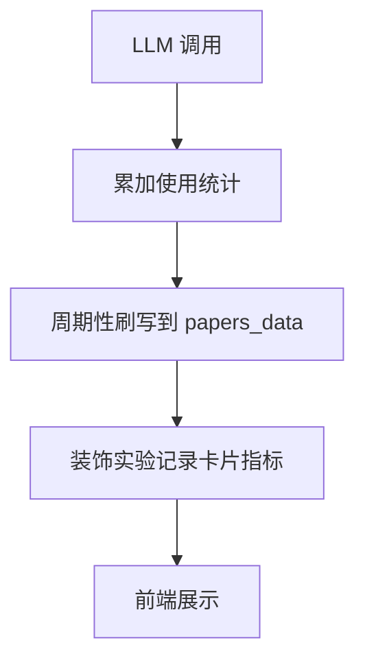
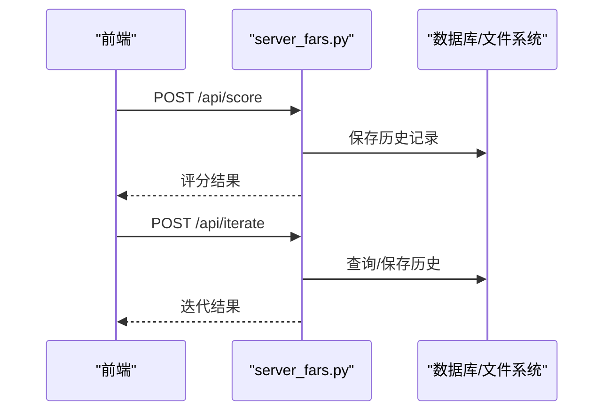
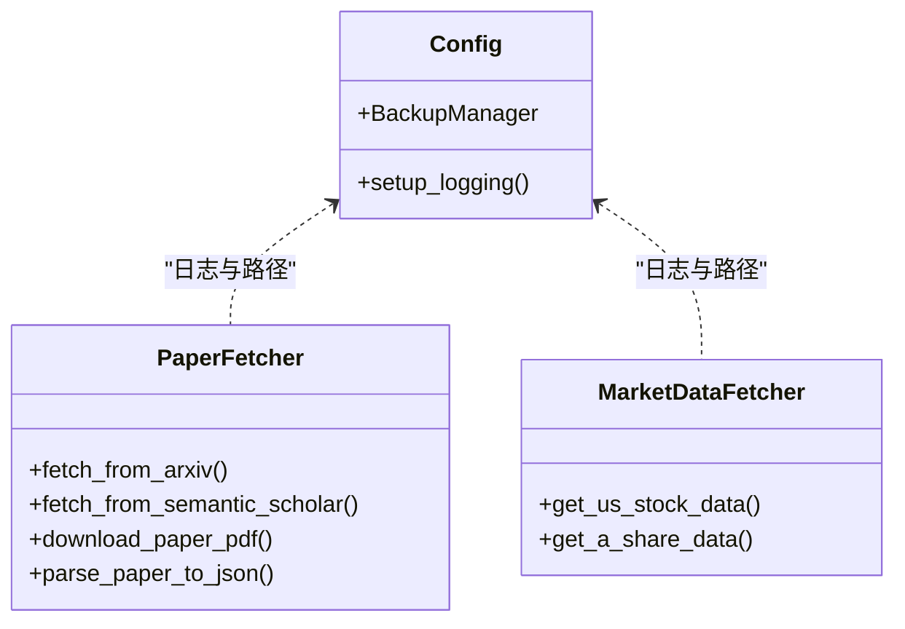
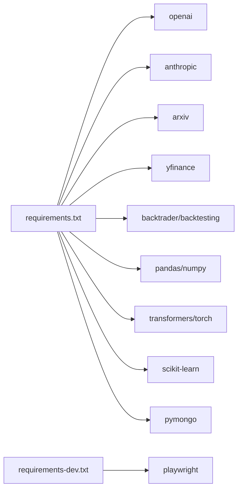

# 测试策略

<cite>
**本文引用的文件**
- [frontend_test_cases.md](file://docs/frontend_test_cases.md)
- [API_SPEC.md](file://docs/API_SPEC.md)
- [server.py](file://server.py)
- [server_fars.py](file://server_fars.py)
- [src/main.py](file://src/main.py)
- [src/core/config.py](file://src/core/config.py)
- [src/tools/fetchers.py](file://src/tools/fetchers.py)
- [requirements.txt](file://requirements.txt)
- [requirements-dev.txt](file://requirements-dev.txt)
- [setup-fast-detectgpt.sh](file://setup-fast-detectgpt.sh)
- [docs/v2/test.html](file://docs/v2/test.html)
</cite>

## 目录
1. [引言](#引言)
2. [项目结构](#项目结构)
3. [核心组件](#核心组件)
4. [架构总览](#架构总览)
5. [详细组件分析](#详细组件分析)
6. [依赖分析](#依赖分析)
7. [性能考虑](#性能考虑)
8. [故障排查指南](#故障排查指南)
9. [结论](#结论)
10. [附录](#附录)

## 引言
本测试策略面向 paperwriterAI 项目，覆盖前端仪表板、后端 REST API、WebSocket 实时通信、数据一致性、性能与压力、安全与合规等方面。文档基于现有 API 规范与后端实现，结合前端测试用例清单，给出可落地的测试方法、数据准备、环境搭建与自动化流程建议。

## 项目结构
项目采用前后端分离与多模块组织：
- 前端静态资源与测试页面位于 docs 与 docs/v2 子目录
- 后端提供两个服务入口：主研究服务 server.py 与 FARS 专用服务 server_fars.py
- 核心业务逻辑分布在 src 下的 core、tools、services、agents 等子包
- 测试与开发依赖分别在 requirements.txt 与 requirements-dev.txt 中声明

图表来源
- [server.py:1-120](file://server.py#L1-L120)
- [server_fars.py:1-60](file://server_fars.py#L1-L60)
- [src/core/config.py:1-60](file://src/core/config.py#L1-L60)
- [src/tools/fetchers.py:1-40](file://src/tools/fetchers.py#L1-L40)

章节来源
- [server.py:1-120](file://server.py#L1-L120)
- [server_fars.py:1-60](file://server_fars.py#L1-L60)
- [src/core/config.py:1-60](file://src/core/config.py#L1-L60)
- [src/tools/fetchers.py:1-40](file://src/tools/fetchers.py#L1-L40)

## 核心组件
- 前端仪表板与测试页面：提供 LLM 配置、控制按钮、实验记录、拓扑图、作者-机构网络、下载中心等功能区域，并配套手工+轮询校验的测试用例
- 主研究服务 server.py：提供研究状态、LLM 配置合并、实验记录装饰、LLM 调用统计与流量控制、WebSocket 实时进度推送等
- FARS 专用服务 server_fars.py：提供评分、重生成、相关论文检索、分支研究状态、LLM 调用记录查询等 API
- 核心模块：配置与日志、备份管理、PaperFetcher、MarketDataFetcher 等
- 测试与依赖：Playwright 测试框架、Fast-DetectGPT 安装脚本、Python 依赖清单

章节来源
- [frontend_test_cases.md:1-188](file://docs/frontend_test_cases.md#L1-L188)
- [API_SPEC.md:1-120](file://docs/API_SPEC.md#L1-L120)
- [server.py:200-420](file://server.py#L200-L420)
- [server_fars.py:440-620](file://server_fars.py#L440-L620)
- [src/core/config.py:60-120](file://src/core/config.py#L60-L120)
- [src/tools/fetchers.py:20-140](file://src/tools/fetchers.py#L20-L140)
- [requirements-dev.txt:1-2](file://requirements-dev.txt#L1-L2)
- [setup-fast-detectgpt.sh:1-60](file://setup-fast-detectgpt.sh#L1-L60)

## 架构总览
后端通过 Flask 提供 REST API 与静态资源服务，前端通过轮询与 WebSocket 获取状态更新。核心业务围绕“研究流水线”展开，涉及 LLM 调用、实验执行、报告生成与下载。

图表来源
- [server.py:75-120](file://server.py#L75-L120)
- [API_SPEC.md:410-436](file://docs/API_SPEC.md#L410-L436)
- [docs/v2/test.html:110-120](file://docs/v2/test.html#L110-L120)

章节来源
- [server.py:75-120](file://server.py#L75-L120)
- [API_SPEC.md:410-436](file://docs/API_SPEC.md#L410-L436)
- [docs/v2/test.html:110-120](file://docs/v2/test.html#L110-L120)

## 详细组件分析

### 前端测试策略（Dashboard 与 v2）
- 测试目标：验证 LLM 配置读取/保存、控制按钮状态切换、实验记录卡片指标、拓扑图与作者-机构网络渲染、下载中心可用性
- 前置条件：本地服务已启动，浏览器可访问 LLM 提供商地址，建议先执行“从0开始”以保证状态干净
- 关键测试用例要点
  - LLM 配置：读取与保存、覆盖生效、未就绪时按钮禁用
  - 控制按钮：从0开始、开始/暂停/继续/停止、状态同步
  - 实验记录：初始展示、阶段推进与时间戳、指标字段、LLM 超时降载可用性
  - 图表：拓扑图节点短标题、作者-机构网络节点与边权重
  - 下载中心：种子文献与研究产物下载、跨阶段可下载性

图表来源
- [frontend_test_cases.md:11-188](file://docs/frontend_test_cases.md#L11-L188)

章节来源
- [frontend_test_cases.md:1-188](file://docs/frontend_test_cases.md#L1-L188)

### 后端 REST API 测试指南
- 基础信息：基础 URL、认证方式、响应格式
- 关键接口
  - 论文搜索/详情/下载/分析
  - 假设生成/列表/详情
  - 实验创建/运行/结果/日志
  - 报告生成/获取/下载
  - 完整流程运行/状态/取消
- 错误响应格式与常见错误码
- 测试建议
  - 单元测试：针对具体函数（如 LLM 配置合并、实验记录装饰、LLM 使用统计）编写最小化输入输出断言
  - 集成测试：组合接口链路（搜索→分析→生成假设→创建实验→运行→报告→下载）
  - 端到端测试：Playwright 驱动浏览器，模拟用户操作并断言 UI 状态与后端状态一致

图表来源
- [API_SPEC.md:11-120](file://docs/API_SPEC.md#L11-L120)
- [server.py:224-240](file://server.py#L224-L240)
- [server.py:392-426](file://server.py#L392-L426)

章节来源
- [API_SPEC.md:11-436](file://docs/API_SPEC.md#L11-L436)
- [server.py:224-240](file://server.py#L224-L240)
- [server.py:392-426](file://server.py#L392-L426)

### WebSocket 通信测试
- 端点：/ws/pipeline/{pipeline_id}
- 消息类型：阶段更新、阶段完成、错误、完成
- 测试要点
  - 连接建立与心跳
  - 接收阶段进度更新并映射到 UI
  - 错误场景：上游 504、网络中断后的重连与状态同步
  - 性能：高并发下消息去重与顺序保证

图表来源
- [API_SPEC.md:410-436](file://docs/API_SPEC.md#L410-L436)
- [server.py:498-553](file://server.py#L498-L553)

章节来源
- [API_SPEC.md:410-436](file://docs/API_SPEC.md#L410-L436)
- [server.py:498-553](file://server.py#L498-L553)

### 数据一致性验证
- LLM 使用统计：按阶段汇总调用次数、Token 消耗、错误计数，定期刷写到研究状态
- 实验记录装饰：将阶段指标映射到卡片 metrics，确保进度%、Token、失败数、阶段耗时等字段一致
- 状态同步：UI 轮询与 WebSocket 推送应保持一致，避免竞态

图表来源
- [server.py:568-666](file://server.py#L568-L666)
- [server.py:668-771](file://server.py#L668-L771)

章节来源
- [server.py:568-666](file://server.py#L568-L666)
- [server.py:668-771](file://server.py#L668-L771)

### 后端服务端点与数据层（FARS 专用）
- 评分、重生成、相关论文检索、迭代流程
- 分支研究状态、论文队列与当前论文标题
- LLM 调用记录查询（分页、过滤）

图表来源
- [server_fars.py:440-594](file://server_fars.py#L440-L594)
- [server_fars.py:627-761](file://server_fars.py#L627-L761)

章节来源
- [server_fars.py:440-594](file://server_fars.py#L440-L594)
- [server_fars.py:627-761](file://server_fars.py#L627-L761)

### 核心模块与工具测试
- 配置与日志：验证配置合并、备份管理、日志输出
- 论文抓取：arXiv/Semantic Scholar 搜索、PDF 下载、文本清洗
- 市场数据：yfinance/akshare 可用性与数据格式

图表来源
- [src/core/config.py:60-120](file://src/core/config.py#L60-L120)
- [src/tools/fetchers.py:20-140](file://src/tools/fetchers.py#L20-L140)

章节来源
- [src/core/config.py:60-120](file://src/core/config.py#L60-L120)
- [src/tools/fetchers.py:20-140](file://src/tools/fetchers.py#L20-L140)

## 依赖分析
- 生产依赖：OpenAI、Anthropic、arxiv、yfinance、backtrader/backtesting、pandas/numpy/matplotlib/seaborn、MongoDB、transformers/torch/scikit-learn 等
- 开发依赖：Playwright
- 安装与环境：Fast-DetectGPT 安装脚本支持不同模型与 GPU/Apple Silicon/CPU 场景

图表来源
- [requirements.txt:1-39](file://requirements.txt#L1-L39)
- [requirements-dev.txt:1-2](file://requirements-dev.txt#L1-L2)
- [setup-fast-detectgpt.sh:66-90](file://setup-fast-detectgpt.sh#L66-L90)

章节来源
- [requirements.txt:1-39](file://requirements.txt#L1-L39)
- [requirements-dev.txt:1-2](file://requirements-dev.txt#L1-L2)
- [setup-fast-detectgpt.sh:66-90](file://setup-fast-detectgpt.sh#L66-L90)

## 性能考虑
- LLM 超时与降载：当上游偶发 504 时，后端应自动降低单次输出 token 并继续分段续写，避免一次性失败导致流程中断
- Token 估算与统计：按阶段累计调用次数、prompt/completion/total tokens，以及错误计数，用于成本与性能监控
- WebSocket 压力：在高并发下确保消息去重、顺序与断线重连机制
- 前端轮询：合理设置轮询间隔，避免频繁请求造成后端压力

章节来源
- [frontend_test_cases.md:125-134](file://docs/frontend_test_cases.md#L125-L134)
- [server.py:568-666](file://server.py#L568-L666)

## 故障排查指南
- LLM 未就绪：检查 provider/model/base_url/api_key 配置，确认已覆盖生效
- API 响应异常：核对错误码与错误信息格式，定位上游服务（arXiv/Semantic Scholar/OpenAI/Anthropic）
- WebSocket 断连：检查连接 URL、消息类型、重连策略与状态同步
- 文件下载失败：确认下载中心路径、文件存在性与权限
- Fast-DetectGPT 安装：根据 GPU/Apple Silicon/CPU 选择合适模型与依赖，确保 HuggingFace 授权（如需）

章节来源
- [frontend_test_cases.md:33-41](file://docs/frontend_test_cases.md#L33-L41)
- [API_SPEC.md:383-407](file://docs/API_SPEC.md#L383-L407)
- [setup-fast-detectgpt.sh:1-60](file://setup-fast-detectgpt.sh#L1-L60)

## 结论
本测试策略以现有 API 规范与后端实现为基础，结合前端测试用例清单，给出了覆盖单元、集成与端到端的测试方法。通过合理的测试数据准备、环境搭建与自动化流程，可有效保障系统稳定性、一致性与用户体验。

## 附录

### 测试数据准备
- 前端：使用 docs/v2/test.html 与 docs/frontend_test_cases.md 中的步骤进行手工验证
- 后端：准备最小化配置（config.json/config.local.json）、种子论文与实验数据，确保 LLM 提供商可用
- 性能：构造高并发请求与长流水线任务，记录延迟与吞吐

章节来源
- [docs/v2/test.html:110-120](file://docs/v2/test.html#L110-L120)
- [frontend_test_cases.md:5-10](file://docs/frontend_test_cases.md#L5-L10)

### 测试环境搭建
- 安装生产与开发依赖
- 启动 Flask 服务（server.py 与 server_fars.py）
- 准备 LLM 提供商密钥与网络访问
- 运行 Fast-DetectGPT（可选）

章节来源
- [requirements.txt:1-39](file://requirements.txt#L1-L39)
- [requirements-dev.txt:1-2](file://requirements-dev.txt#L1-L2)
- [server.py:75-120](file://server.py#L75-L120)
- [server_fars.py:13-42](file://server_fars.py#L13-L42)
- [setup-fast-detectgpt.sh:1-60](file://setup-fast-detectgpt.sh#L1-L60)

### 自动化测试流程建议
- 单元测试：pytest + unittest.mock，覆盖配置合并、使用统计、实验记录装饰等
- 集成测试：pytest + requests，组合 REST API 链路
- 端到端测试：Playwright，驱动浏览器执行前端测试用例并断言 UI 与后端状态一致性

章节来源
- [requirements-dev.txt:1-2](file://requirements-dev.txt#L1-L2)
- [frontend_test_cases.md:1-188](file://docs/frontend_test_cases.md#L1-L188)
- [API_SPEC.md:11-120](file://docs/API_SPEC.md#L11-L120)