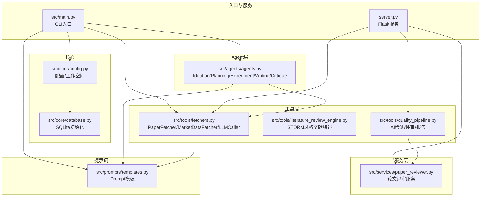
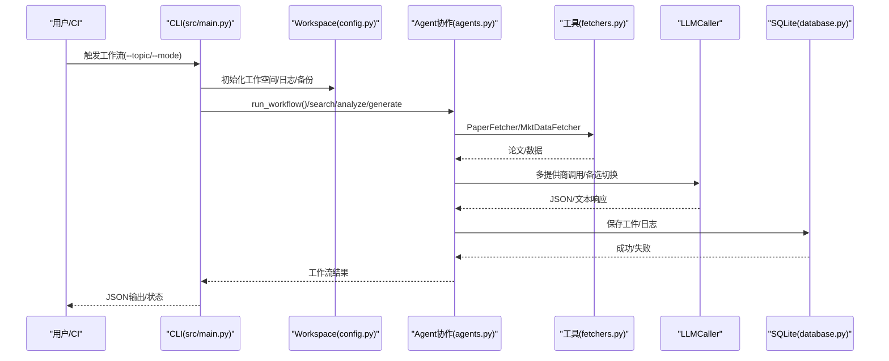
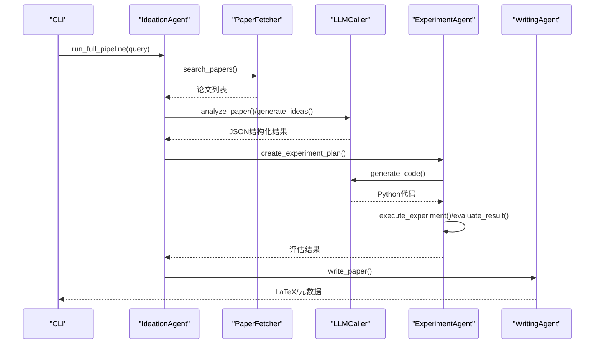
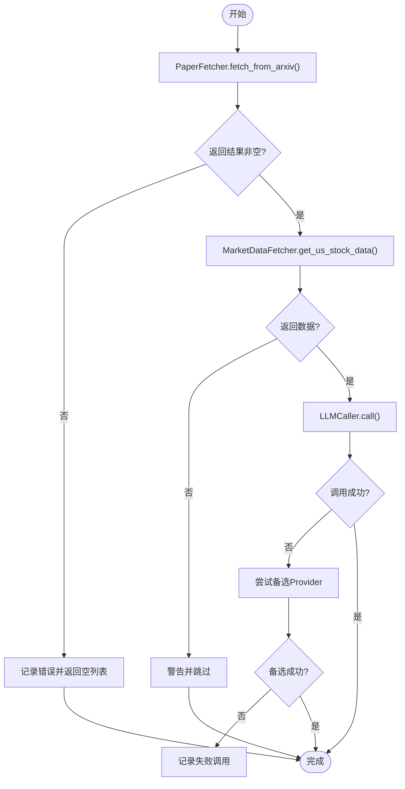
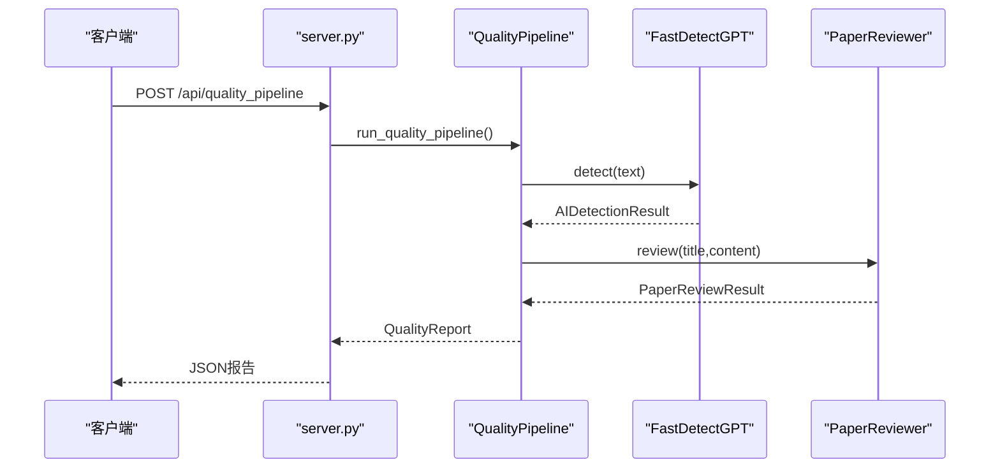
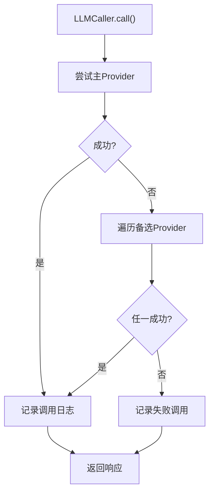
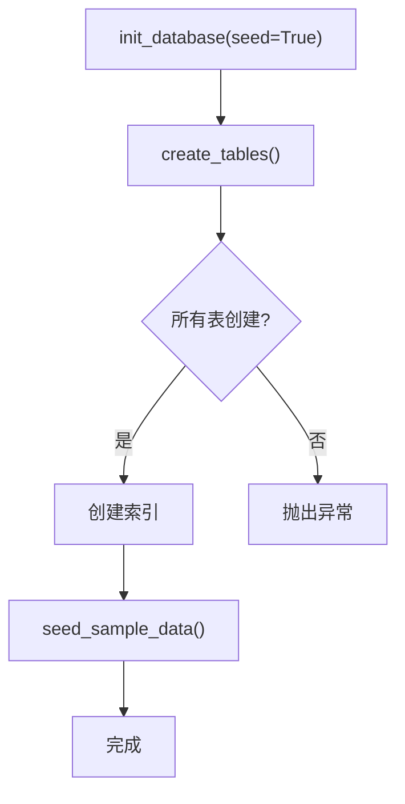
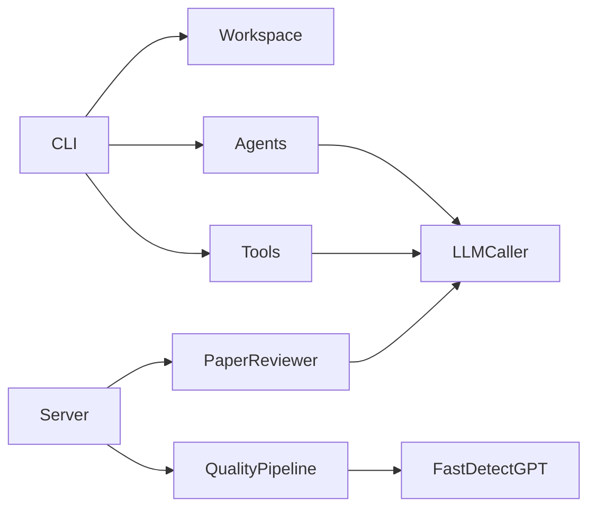

# 集成测试

<cite>
**本文档引用的文件**
- [src/main.py](file://src/main.py)
- [server.py](file://server.py)
- [src/core/config.py](file://src/core/config.py)
- [src/core/database.py](file://src/core/database.py)
- [src/agents/agents.py](file://src/agents/agents.py)
- [src/tools/fetchers.py](file://src/tools/fetchers.py)
- [src/tools/literature_review_engine.py](file://src/tools/literature_review_engine.py)
- [src/tools/quality_pipeline.py](file://src/tools/quality_pipeline.py)
- [src/services/paper_reviewer.py](file://src/services/paper_reviewer.py)
- [src/prompts/templates.py](file://src/prompts/templates.py)
- [requirements.txt](file://requirements.txt)
</cite>

## 目录
1. [简介](#简介)
2. [项目结构](#项目结构)
3. [核心组件](#核心组件)
4. [架构总览](#架构总览)
5. [详细组件分析](#详细组件分析)
6. [依赖关系分析](#依赖关系分析)
7. [性能考虑](#性能考虑)
8. [故障排查指南](#故障排查指南)
9. [结论](#结论)
10. [附录](#附录)

## 简介
本文件面向paperwriterAI项目的集成测试，系统性阐述模块间集成测试的实施方法，覆盖Agent协作测试、工具模块集成测试、API接口集成测试，并解释如何测试LLM提供商集成、数据库连接、文件系统操作等跨模块功能。同时提供测试环境搭建、测试数据管理、测试流程自动化的最佳实践，帮助开发者在不同环境下稳定地验证端到端工作流。

## 项目结构
paperwriterAI采用分层架构：CLI入口负责用户交互与工作流编排；核心模块提供配置、工作空间、数据库与日志；Agent层负责业务智能体协作；工具层封装论文抓取、市场数据、LLM调用与质量流水线；服务层提供论文评审与检测能力；Prompts层提供统一的提示词模板。

**图示来源**
- [src/main.py:35-428](file://src/main.py#L35-L428)
- [server.py:75-80](file://server.py#L75-L80)
- [src/core/config.py:256-384](file://src/core/config.py#L256-L384)
- [src/core/database.py:23-189](file://src/core/database.py#L23-L189)
- [src/agents/agents.py:23-738](file://src/agents/agents.py#L23-L738)
- [src/tools/fetchers.py:20-800](file://src/tools/fetchers.py#L20-L800)
- [src/tools/literature_review_engine.py:18-800](file://src/tools/literature_review_engine.py#L18-L800)
- [src/tools/quality_pipeline.py:1-807](file://src/tools/quality_pipeline.py#L1-L807)
- [src/services/paper_reviewer.py:1-473](file://src/services/paper_reviewer.py#L1-L473)
- [src/prompts/templates.py:1-758](file://src/prompts/templates.py#L1-L758)

**章节来源**
- [src/main.py:1-521](file://src/main.py#L1-L521)
- [server.py:1-800](file://server.py#L1-L800)
- [src/core/config.py:1-563](file://src/core/config.py#L1-L563)
- [src/core/database.py:1-278](file://src/core/database.py#L1-L278)
- [src/agents/agents.py:1-738](file://src/agents/agents.py#L1-L738)
- [src/tools/fetchers.py:1-899](file://src/tools/fetchers.py#L1-L899)
- [src/tools/literature_review_engine.py:1-850](file://src/tools/literature_review_engine.py#L1-L850)
- [src/tools/quality_pipeline.py:1-807](file://src/tools/quality_pipeline.py#L1-L807)
- [src/services/paper_reviewer.py:1-473](file://src/services/paper_reviewer.py#L1-L473)
- [src/prompts/templates.py:1-758](file://src/prompts/templates.py#L1-L758)

## 核心组件
- CLI入口与工作流编排：负责解析命令行参数、初始化FARS系统、协调Agent与工具模块、执行端到端工作流。
- 配置与工作空间：统一管理研究方向、LLM提供商配置、项目目录结构、日志与备份。
- Agent协作：Ideation/Planning/Experiment/Writing/Critique Agent协同完成从论文到论文的完整闭环。
- 工具模块：PaperFetcher、MarketDataFetcher、LLMCaller提供论文检索、数据获取与多提供商LLM调用能力。
- 质量流水线：Fast-DetectGPT检测、论文评审、综合报告生成，形成可重复的质量评估流程。
- 服务模块：PaperReviewer提供多维评审与雷达图数据，支持外部API与本地降级。
- 提示词模板：统一的提示词模板保证Agent与工具的一致性输出格式。

**章节来源**
- [src/main.py:35-428](file://src/main.py#L35-L428)
- [src/core/config.py:256-384](file://src/core/config.py#L256-L384)
- [src/agents/agents.py:23-738](file://src/agents/agents.py#L23-L738)
- [src/tools/fetchers.py:290-800](file://src/tools/fetchers.py#L290-L800)
- [src/tools/quality_pipeline.py:87-807](file://src/tools/quality_pipeline.py#L87-L807)
- [src/services/paper_reviewer.py:1-473](file://src/services/paper_reviewer.py#L1-L473)
- [src/prompts/templates.py:1-758](file://src/prompts/templates.py#L1-L758)

## 架构总览
paperwriterAI的集成测试应覆盖以下关键路径：
- CLI到Agent的端到端工作流
- LLM提供商切换与降级机制
- 论文抓取与解析
- 实验执行与回测
- 质量流水线（AI检测、评审、报告）
- 文件系统与数据库交互
- Flask服务端API集成

**图示来源**
- [src/main.py:353-427](file://src/main.py#L353-L427)
- [src/core/config.py:256-384](file://src/core/config.py#L256-L384)
- [src/agents/agents.py:164-194](file://src/agents/agents.py#L164-L194)
- [src/tools/fetchers.py:20-163](file://src/tools/fetchers.py#L20-L163)
- [src/core/database.py:15-189](file://src/core/database.py#L15-L189)

## 详细组件分析

### Agent协作测试
目标：验证四个Agent在真实工作流中的协作与数据传递，包括论文搜索、分析、假设生成、实验执行与论文生成。

- 测试场景
  - 搜索与分析：验证PaperFetcher与LLMCaller在论文分析阶段的配合。
  - 假设生成：验证提示词模板与LLM输出解析的稳定性。
  - 实验执行：验证代码生成、沙箱执行、错误修复与评估。
  - 论文生成：验证LaTeX输出与图表生成。

- 关键断言
  - 搜索阶段返回非空论文列表。
  - 分析与假设生成阶段返回结构化JSON。
  - 实验执行阶段返回评估指标与图表路径。
  - 论文生成阶段返回LaTeX内容与参考文献。

**图示来源**
- [src/agents/agents.py:42-194](file://src/agents/agents.py#L42-L194)
- [src/tools/fetchers.py:20-163](file://src/tools/fetchers.py#L20-L163)
- [src/prompts/templates.py:28-155](file://src/prompts/templates.py#L28-L155)

**章节来源**
- [src/agents/agents.py:23-738](file://src/agents/agents.py#L23-L738)
- [src/prompts/templates.py:1-758](file://src/prompts/templates.py#L1-L758)

### 工具模块集成测试
目标：验证PaperFetcher、MarketDataFetcher、LLMCaller在真实网络环境下的可用性与降级策略。

- 测试场景
  - arXiv/Semantic Scholar抓取：验证请求参数、异常处理与返回结构。
  - 市场数据获取：验证yfinance/akshare可用性与数据格式。
  - LLM调用：验证主提供商与备选提供商切换、错误记录与统计上报。

- 关键断言
  - 抓取接口返回非空论文列表且字段完整。
  - 市场数据接口返回标准化字典结构。
  - LLM调用记录包含tokens与latency统计。

**图示来源**
- [src/tools/fetchers.py:27-163](file://src/tools/fetchers.py#L27-L163)
- [src/tools/fetchers.py:167-270](file://src/tools/fetchers.py#L167-L270)
- [src/tools/fetchers.py:391-450](file://src/tools/fetchers.py#L391-L450)

**章节来源**
- [src/tools/fetchers.py:1-899](file://src/tools/fetchers.py#L1-L899)

### API接口集成测试
目标：验证Flask服务端API在论文评审与质量流水线场景下的可用性与稳定性。

- 测试场景
  - AI痕迹检测：Fast-DetectGPT本地/远程/降级路径。
  - 论文评审：Claude/PaperReview.ai外部评审与本地降级。
  - 综合报告：生成质量报告与推荐建议。

- 关键断言
  - 检测接口返回ai_probability与suspicious_segments。
  - 评审接口返回维度分数与详细反馈。
  - 报告接口返回overall_pass与quality_stars。

**图示来源**
- [server.py:75-80](file://server.py#L75-L80)
- [src/tools/quality_pipeline.py:748-807](file://src/tools/quality_pipeline.py#L748-L807)
- [src/tools/quality_pipeline.py:87-435](file://src/tools/quality_pipeline.py#L87-L435)
- [src/services/paper_reviewer.py:159-303](file://src/services/paper_reviewer.py#L159-L303)

**章节来源**
- [server.py:1-800](file://server.py#L1-L800)
- [src/tools/quality_pipeline.py:1-807](file://src/tools/quality_pipeline.py#L1-L807)
- [src/services/paper_reviewer.py:1-473](file://src/services/paper_reviewer.py#L1-L473)

### LLM提供商集成测试
目标：验证多提供商切换与降级策略、API Key注入、环境变量覆盖与统计上报。

- 测试场景
  - 主提供商调用：OpenAI/Anthropic/DeepSeek/MiniMax/Ollama。
  - 备选Provider切换：当主提供商失败时自动切换。
  - 环境变量注入：OPENAI_API_KEY等环境变量生效。
  - 统计上报：llm_call_logs.json记录tokens与latency。

- 关键断言
  - 主提供商调用成功或触发备选切换。
  - 调用记录包含provider/model/tokens/status。
  - 环境变量覆盖配置文件中的API Key。

**图示来源**
- [src/tools/fetchers.py:391-450](file://src/tools/fetchers.py#L391-L450)
- [src/tools/fetchers.py:451-667](file://src/tools/fetchers.py#L451-L667)

**章节来源**
- [src/tools/fetchers.py:290-800](file://src/tools/fetchers.py#L290-L800)
- [src/core/config.py:462-514](file://src/core/config.py#L462-L514)

### 数据库连接与文件系统操作测试
目标：验证SQLite初始化、表结构创建、索引建立与文件上传/保存/备份。

- 测试场景
  - 数据库初始化：papers/alpha_factors/experiments/reports/system_config/operation_logs表创建与索引。
  - 示例数据播种：插入样例论文与系统配置。
  - 文件系统：Workspace.save_artifact/upload_file/backup_manager备份恢复。

- 关键断言
  - create_tables()成功执行并创建所有表与索引。
  - seed_sample_data()插入样例数据且不重复。
  - 上传文件后可读取并备份旧版本。

**图示来源**
- [src/core/database.py:23-189](file://src/core/database.py#L23-L189)
- [src/core/database.py:192-256](file://src/core/database.py#L192-L256)
- [src/core/config.py:256-384](file://src/core/config.py#L256-L384)

**章节来源**
- [src/core/database.py:1-278](file://src/core/database.py#L1-L278)
- [src/core/config.py:256-384](file://src/core/config.py#L256-L384)

## 依赖关系分析
- 组件耦合
  - CLI依赖Workspace、Agent与工具模块，耦合度适中，便于测试隔离。
  - Agent依赖LLMCaller与Workspace，提示词模板提供统一格式。
  - 服务端依赖质量流水线与评审服务，对外暴露REST接口。
- 外部依赖
  - LLM提供商：OpenAI、Anthropic、DeepSeek、MiniMax、Ollama。
  - 数据源：arXiv、Semantic Scholar、yfinance、akshare。
  - 检测模型：Fast-DetectGPT本地/远程模型。

**图示来源**
- [src/main.py:35-100](file://src/main.py#L35-L100)
- [src/agents/agents.py:23-738](file://src/agents/agents.py#L23-L738)
- [src/tools/fetchers.py:290-800](file://src/tools/fetchers.py#L290-L800)
- [server.py:75-80](file://server.py#L75-L80)
- [src/tools/quality_pipeline.py:748-807](file://src/tools/quality_pipeline.py#L748-L807)
- [src/services/paper_reviewer.py:159-303](file://src/services/paper_reviewer.py#L159-L303)

**章节来源**
- [requirements.txt:1-39](file://requirements.txt#L1-L39)

## 性能考虑
- LLM调用统计：记录prompt_tokens/completion_tokens/total_tokens与latency，便于成本与性能监控。
- 本地降级：当外部API不可用时，优先使用本地模型或统计方法，保障系统可用性。
- 数据缓存：Fast-DetectGPT模型与提示词模板可缓存至本地，减少重复加载开销。
- 并发与超时：为外部API调用设置合理超时与重试策略，避免阻塞主线程。

## 故障排查指南
- LLM调用失败
  - 检查API Key与base_url配置，确认环境变量覆盖。
  - 查看llm_call_logs.json中的错误详情与traceback。
- 数据库初始化失败
  - 确认workspace目录权限与SQLite可用性。
  - 检查create_tables()执行日志与索引创建状态。
- 文件上传/备份异常
  - 确认目标路径存在且具备写权限。
  - 检查BackupManager的备份文件列表与恢复流程。
- 服务端API错误
  - 查看server日志与请求参数，确认Anthropic/DeepSeek API Key配置。
  - 验证Fast-DetectGPT本地环境与远程API连通性。

**章节来源**
- [src/tools/fetchers.py:324-390](file://src/tools/fetchers.py#L324-L390)
- [src/core/database.py:15-189](file://src/core/database.py#L15-L189)
- [src/core/config.py:98-187](file://src/core/config.py#L98-L187)
- [server.py:1-800](file://server.py#L1-L800)

## 结论
通过分层的集成测试策略，paperwriterAI可以在不同环境与依赖条件下稳定验证端到端工作流。重点覆盖Agent协作、工具模块、LLM提供商切换、数据库与文件系统、以及服务端API。建议在CI中自动化执行这些测试，结合日志与统计上报持续优化系统可靠性与性能。

## 附录
- 测试环境搭建
  - 安装依赖：pip install -r requirements.txt
  - 配置LLM API Key（OPENAI_API_KEY等）或使用Ollama本地模型
  - 初始化数据库：python -m src.core.database
- 测试数据管理
  - 使用样例数据播种：init_database(seed=True)
  - 上传测试文件至uploads目录，验证Workspace上传/备份流程
- 测试流程自动化
  - CLI工作流：python src/main.py --topic "测试主题" --mode all
  - 服务端API：启动server.py后调用质量流水线接口
  - LLM提供商测试：python src/main.py --test-llm