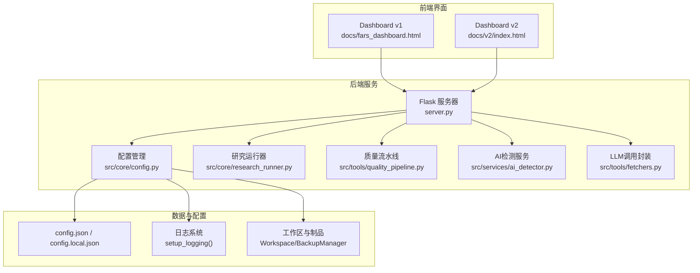
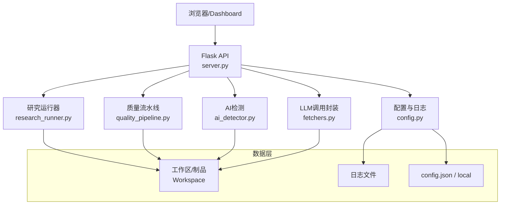
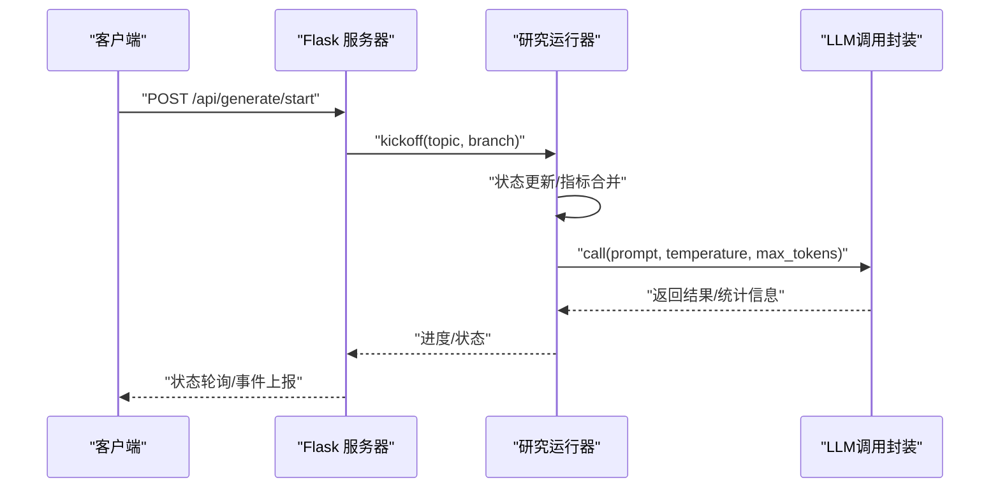
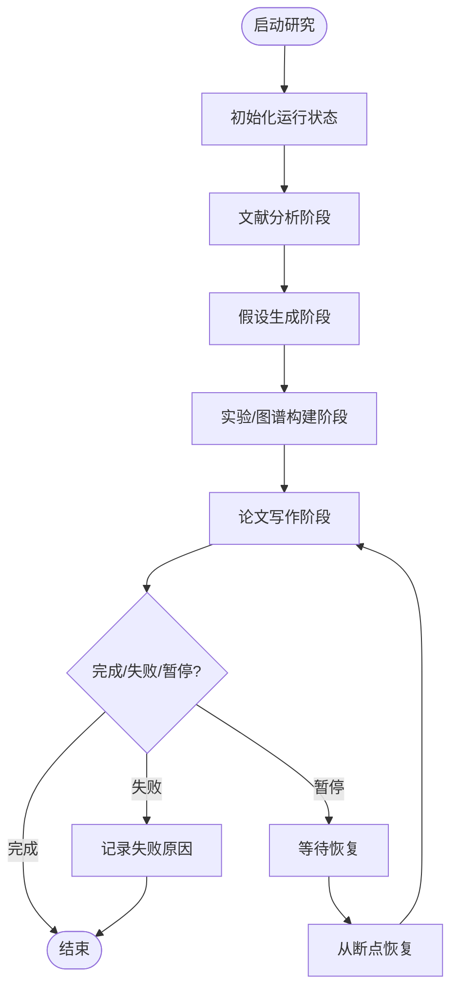
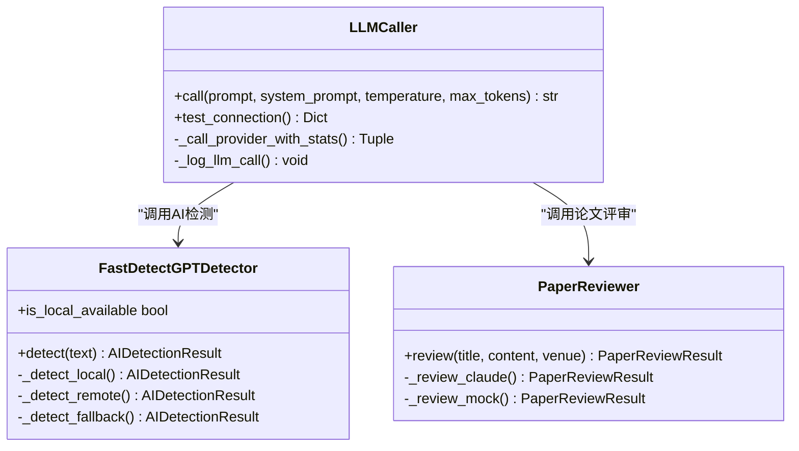
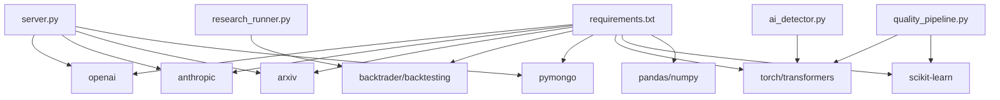

# 调试与性能优化

<cite>
**本文档引用的文件**
- [server.py](file://server.py)
- [src/main.py](file://src/main.py)
- [src/core/config.py](file://src/core/config.py)
- [src/tools/fetchers.py](file://src/tools/fetchers.py)
- [src/services/ai_detector.py](file://src/services/ai_detector.py)
- [src/core/research_runner.py](file://src/core/research_runner.py)
- [src/tools/quality_pipeline.py](file://src/tools/quality_pipeline.py)
- [README.md](file://README.md)
- [debug-writing-078-stuck.md](file://debug-writing-078-stuck.md)
- [debug-writing-stuck-078.md](file://debug-writing-stuck-078.md)
- [docs/API_SPEC.md](file://docs/API_SPEC.md)
- [requirements.txt](file://requirements.txt)
</cite>

## 目录
1. [简介](#简介)
2. [项目结构](#项目结构)
3. [核心组件](#核心组件)
4. [架构概览](#架构概览)
5. [详细组件分析](#详细组件分析)
6. [依赖分析](#依赖分析)
7. [性能考虑](#性能考虑)
8. [故障排查指南](#故障排查指南)
9. [结论](#结论)
10. [附录](#附录)

## 简介
本指南面向paperwriterAI项目的开发者与运维人员，提供系统化的调试与性能优化方法。内容涵盖：
- 调试技巧：日志分析、错误追踪、状态监控
- 性能瓶颈识别：内存使用、CPU占用、I/O优化
- 常见问题诊断：LLM调用异常、API响应超时、前端渲染问题
- 性能优化策略：缓存机制、并发处理、资源管理
- 开发工具与环境配置、性能基准测试方法

## 项目结构
项目采用前后端分离与模块化设计，后端基于Flask提供REST API，前端由Dashboard v1/v2提供可视化交互。核心模块包括研究流水线、LLM调用封装、质量流水线与AI检测。

**图表来源**
- [server.py](file://server.py)
- [src/core/config.py](file://src/core/config.py)
- [src/core/research_runner.py](file://src/core/research_runner.py)
- [src/tools/quality_pipeline.py](file://src/tools/quality_pipeline.py)
- [src/services/ai_detector.py](file://src/services/ai_detector.py)
- [src/tools/fetchers.py](file://src/tools/fetchers.py)

**章节来源**
- [README.md](file://README.md)
- [server.py](file://server.py)
- [src/core/config.py](file://src/core/config.py)

## 核心组件
- Flask API服务器：提供REST端点、状态管理、LLM调用与质量流水线集成
- 研究运行器：多阶段流水线（文献分析→假设→实验→写作→评审），支持断点与续传
- LLM调用封装：多Provider自动切换、调用统计、降级策略
- 质量流水线：AI痕迹检测（Fast-DetectGPT）、论文评审（Claude/PaperReview.ai）、综合报告
- 配置与日志：统一配置加载、日志格式化、备份管理
- 前端Dashboard：v1/v2双版本，状态轮询与可视化展示

**章节来源**
- [server.py](file://server.py)
- [src/core/research_runner.py](file://src/core/research_runner.py)
- [src/tools/fetchers.py](file://src/tools/fetchers.py)
- [src/tools/quality_pipeline.py](file://src/tools/quality_pipeline.py)
- [src/core/config.py](file://src/core/config.py)

## 架构概览
系统采用“服务端渲染+前后端分离”的架构，后端负责业务逻辑与数据处理，前端负责状态展示与用户交互。

**图表来源**
- [server.py](file://server.py)
- [src/core/research_runner.py](file://src/core/research_runner.py)
- [src/tools/quality_pipeline.py](file://src/tools/quality_pipeline.py)
- [src/services/ai_detector.py](file://src/services/ai_detector.py)
- [src/tools/fetchers.py](file://src/tools/fetchers.py)
- [src/core/config.py](file://src/core/config.py)

## 详细组件分析

### Flask API服务器与调试设施
- 调试上报：内置调试服务器集成，支持事件上报、心跳日志与上下文记录
- LLM使用统计：并发请求跟踪、调用次数与Token统计、错误计数
- 配置热加载：配置文件变更自动重载，避免重启
- 状态监控：研究活动、实验指标、LLM在途请求快照

**图表来源**
- [server.py](file://server.py)
- [src/core/research_runner.py](file://src/core/research_runner.py)
- [src/tools/fetchers.py](file://src/tools/fetchers.py)

**章节来源**
- [server.py](file://server.py)
- [debug-writing-078-stuck.md](file://debug-writing-078-stuck.md)
- [debug-writing-stuck-078.md](file://debug-writing-stuck-078.md)

### 研究运行器与断点机制
- 多阶段流水线：starting → literature_review → hypothesis → experimenting → writing → completed/paused/error
- 断点与恢复：每个阶段完成后持久化，支持从断点续传
- 状态同步：实验面板与阶段进度联动更新
- 异常处理：捕获异常并写入失败状态与原因，确保UI一致性

**图表来源**
- [src/core/research_runner.py](file://src/core/research_runner.py)

**章节来源**
- [src/core/research_runner.py](file://src/core/research_runner.py)
- [debug-writing-078-stuck.md](file://debug-writing-078-stuck.md)

### LLM调用封装与性能统计
- 多Provider支持：OpenAI、Anthropic、DeepSeek、MiniMax、Ollama
- 自动降级：主Provider失败时按顺序尝试备选
- 调用统计：prompt/completion/total tokens、延迟、状态记录
- 历史记录：调用日志上限控制，便于审计与分析

**图表来源**
- [src/tools/fetchers.py](file://src/tools/fetchers.py)
- [src/tools/quality_pipeline.py](file://src/tools/quality_pipeline.py)
- [src/services/ai_detector.py](file://src/services/ai_detector.py)

**章节来源**
- [src/tools/fetchers.py](file://src/tools/fetchers.py)
- [src/tools/quality_pipeline.py](file://src/tools/quality_pipeline.py)
- [src/services/ai_detector.py](file://src/services/ai_detector.py)

### 配置与日志系统
- 统一日志：控制台与文件双通道，格式化输出
- 备份管理：文件与配置备份、恢复
- 环境变量：API Key通过环境变量注入，避免明文存储
- 配置合并：基础配置与本地配置深合并，支持动态更新

**章节来源**
- [src/core/config.py](file://src/core/config.py)
- [README.md](file://README.md)

## 依赖分析
- 第三方依赖：OpenAI、Anthropic、Arxiv、Backtrader、PyMongo、Transformers、Scikit-learn等
- 模块间耦合：API服务器聚合多个模块，运行器与质量流水线通过统一状态接口交互
- 外部集成：LLM提供商API、Fast-DetectGPT本地模型、PaperReview.ai评审

**图表来源**
- [requirements.txt](file://requirements.txt)
- [server.py](file://server.py)
- [src/core/research_runner.py](file://src/core/research_runner.py)
- [src/tools/quality_pipeline.py](file://src/tools/quality_pipeline.py)
- [src/services/ai_detector.py](file://src/services/ai_detector.py)

**章节来源**
- [requirements.txt](file://requirements.txt)

## 性能考虑
- LLM调用优化
  - 设置合理超时（默认600秒，可通过环境变量覆盖）
  - 使用指数退避重试，避免瞬时峰值
  - 合理控制prompt长度与max_tokens，减少Token消耗
- I/O与并发
  - 写文件与制品生成采用异步或分步执行，避免阻塞主线程
  - 使用线程锁与原子更新，确保状态一致性
- 内存与CPU
  - Fast-DetectGPT本地检测在CPU上运行，避免GPU内存不足
  - 统计降级方案作为后备，降低模型依赖
- 缓存与资源管理
  - 配置与模型缓存目录位于用户家目录，减少重复下载
  - 备份与日志文件按需清理，避免磁盘膨胀

[本节为通用指导，无需具体文件引用]

## 故障排查指南

### LLM调用异常
- 现象：UI进度停滞、LLM在途队列为空、日志无心跳
- 排查要点：
  - 检查LLM Provider配置与API Key环境变量
  - 查看调用统计与错误计数，定位失败阶段
  - 启用调试上报，收集事件序列与心跳日志
- 处理建议：
  - 增加重试与超时配置
  - 切换至备选Provider或本地Ollama
  - 分步拆解提示词，降低上下文窗口压力

**章节来源**
- [server.py](file://server.py)
- [src/tools/fetchers.py](file://src/tools/fetchers.py)
- [debug-writing-stuck-078.md](file://debug-writing-stuck-078.md)

### API响应超时
- 现象：/api/research/state等端点响应缓慢或超时
- 排查要点：
  - 检查后端线程池与阻塞I/O
  - 监控LLM请求超时与重试链路
  - 核对数据库连接与索引状态
- 处理建议：
  - 为长任务增加异步处理与进度回调
  - 优化查询与索引，减少数据库压力
  - 增加反向代理缓存与限流策略

**章节来源**
- [server.py](file://server.py)
- [docs/API_SPEC.md](file://docs/API_SPEC.md)

### 前端渲染问题
- 现象：Dashboard v2页面空白或状态不同步
- 排查要点：
  - 检查静态资源路径与CORS配置
  - 确认WebSocket连接与事件推送
  - 核对状态管理与组件订阅机制
- 处理建议：
  - 使用浏览器开发者工具检查网络与控制台错误
  - 确保后端状态轮询与前端订阅一致
  - 逐步禁用组件定位问题范围

**章节来源**
- [README.md](file://README.md)

### 写作阶段卡死（writing=0.78）
- 现象：进度固定在0.78，updated_at不再变化
- 排查要点：
  - 检查llm_inflight与心跳日志
  - 确认落盘与制品生成是否阻塞
  - 核对异常路径是否正确回写失败状态
- 处理建议：
  - 增加“写作阶段关键步骤”与心跳打点
  - 强制失败回写与resume/retry路径
  - 将提示词拆分为多步，便于定位阻塞点

**章节来源**
- [debug-writing-078-stuck.md](file://debug-writing-078-stuck.md)
- [debug-writing-stuck-078.md](file://debug-writing-stuck-078.md)

## 结论
通过完善的日志体系、状态监控与调试上报，paperwriterAI能够有效定位与解决运行期问题。配合合理的性能优化策略（超时与重试、分步执行、缓存与降级），可在复杂研究流程中保持稳定与高效。建议持续完善断点与恢复机制，加强异常路径的可观测性与可恢复性。

[本节为总结性内容，无需具体文件引用]

## 附录

### 开发工具与环境配置
- 环境变量
  - MINIMAX_API_KEY / OPENAI_API_KEY / GOOGLE_API_KEY / CUSTOM_API_KEY
  - LLM_REQUEST_TIMEOUT_S：覆盖默认600秒超时
  - DEBUG_SERVER_URL / DEBUG_SESSION_ID：调试上报配置
- 本地模型
  - Ollama：本地模型作为备选，避免网络依赖
- 日志与备份
  - 统一日志格式化输出
  - 自动备份配置与文件，支持恢复

**章节来源**
- [src/core/config.py](file://src/core/config.py)
- [src/tools/fetchers.py](file://src/tools/fetchers.py)
- [README.md](file://README.md)

### 性能基准测试方法
- LLM调用基准
  - 固定prompt长度与max_tokens，测量延迟与Token消耗
  - 多Provider对比，记录成功率与错误类型
- I/O基准
  - 文件写入/读取吞吐量测试
  - 数据库写入/查询延迟与QPS
- 前端基准
  - 页面首屏渲染时间、组件更新频率
  - WebSocket事件推送延迟

[本节为通用指导，无需具体文件引用]