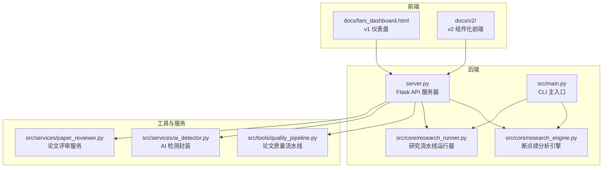
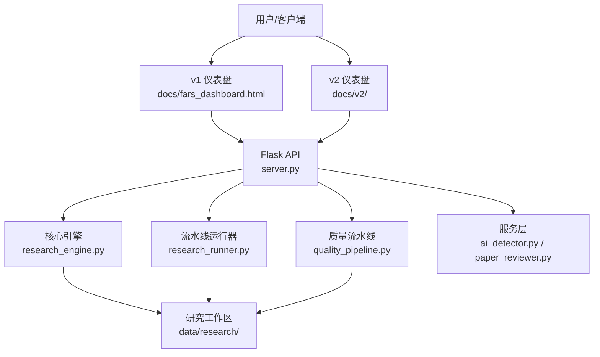
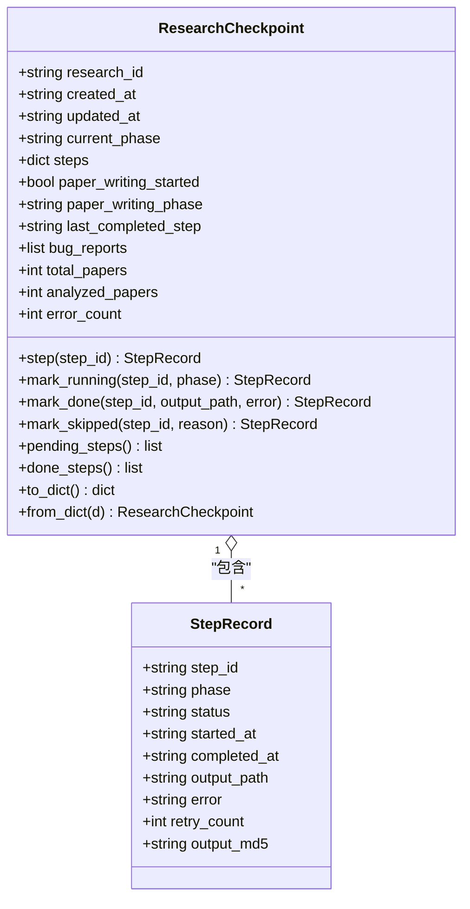
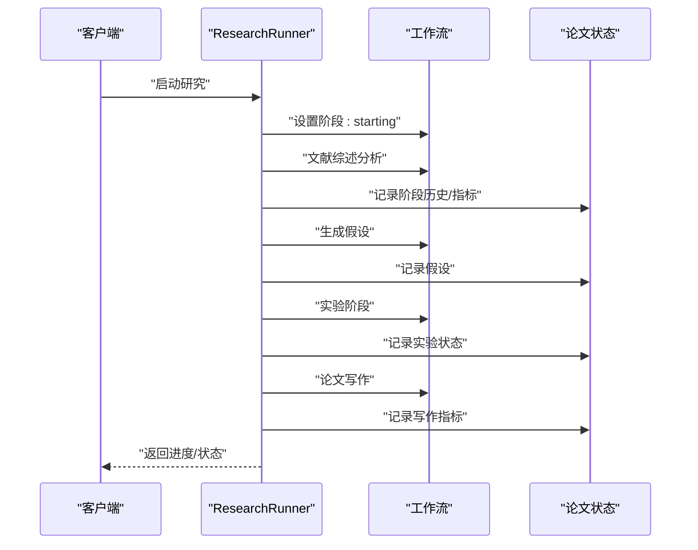
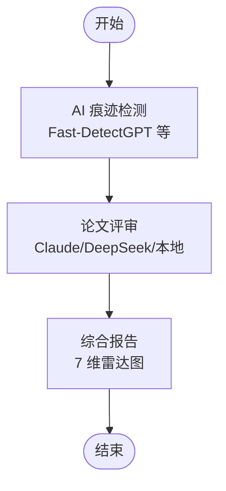
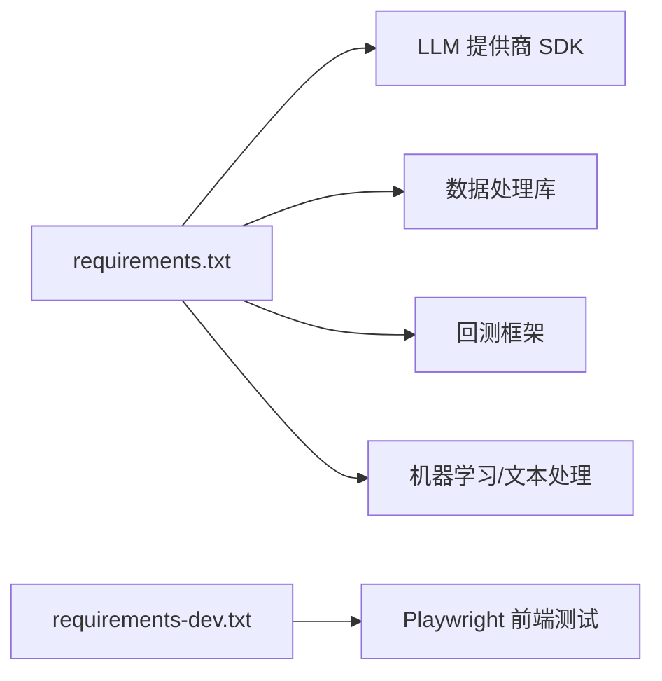
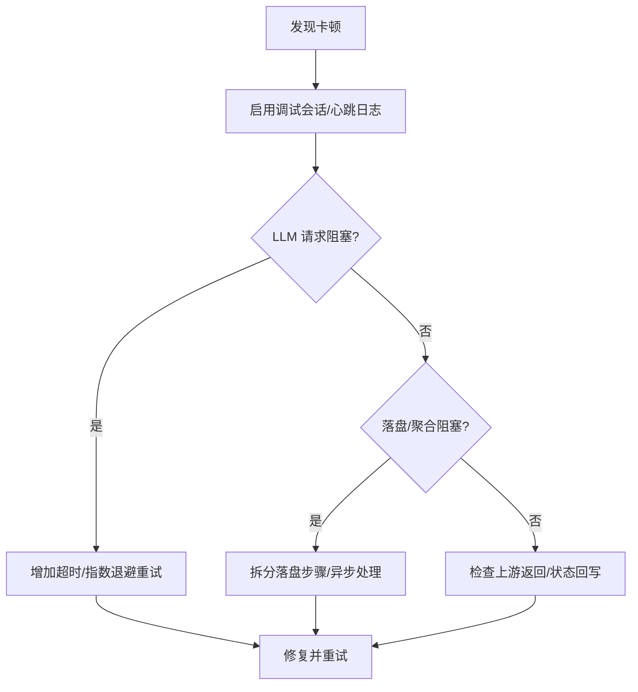

# 贡献指南

<cite>
**本文档引用的文件**
- [README.md](file://README.md)
- [AGENTS.md](file://AGENTS.md)
- [server.py](file://server.py)
- [src/core/research_engine.py](file://src/core/research_engine.py)
- [src/core/research_runner.py](file://src/core/research_runner.py)
- [src/main.py](file://src/main.py)
- [docs/AI_PAPER_FULL_WORKFLOW.md](file://docs/AI_PAPER_FULL_WORKFLOW.md)
- [docs/FARS_LITERATURE_REVIEW_PLAN.md](file://docs/FARS_LITERATURE_REVIEW_PLAN.md)
- [debug-writing-078-stuck.md](file://debug-writing-078-stuck.md)
- [debug-writing-stuck-078.md](file://debug-writing-stuck-078.md)
- [requirements.txt](file://requirements.txt)
- [requirements-dev.txt](file://requirements-dev.txt)
- [setup-fast-detectgpt.sh](file://setup-fast-detectgpt.sh)
</cite>

## 目录
1. [简介](#简介)
2. [项目结构](#项目结构)
3. [核心组件](#核心组件)
4. [架构总览](#架构总览)
5. [详细组件分析](#详细组件分析)
6. [依赖分析](#依赖分析)
7. [性能考量](#性能考量)
8. [故障排查指南](#故障排查指南)
9. [结论](#结论)
10. [附录](#附录)

## 简介
本指南面向希望为 paperwriterAI（FARS）做出贡献的开发者，提供从代码提交、分支管理、Pull Request（PR）流程，到代码审查标准、质量检查要求、文档更新规范的完整说明。同时涵盖开发工作流程（Issue 创建、功能开发、测试验证、合并流程）、社区参与方式、问题反馈渠道、功能建议流程、行为准则与沟通规范、协作原则，以及新贡献者入门指导与常见问题解答。

## 项目结构
paperwriterAI 是一个以 Flask 为核心、Python 为主要后端语言的全自动学术论文生成系统。核心模块包括研究引擎、流水线运行器、质量控制流水线、前端仪表盘等。项目采用“核心引擎 + 工具层 + 服务层 + 前端”的分层架构，便于模块化维护与扩展。

图表来源
- [server.py](file://server.py)
- [src/core/research_engine.py](file://src/core/research_engine.py)
- [src/core/research_runner.py](file://src/core/research_runner.py)
- [src/main.py](file://src/main.py)
- [docs/AI_PAPER_FULL_WORKFLOW.md](file://docs/AI_PAPER_FULL_WORKFLOW.md)

章节来源
- [README.md](file://README.md)
- [AGENTS.md](file://AGENTS.md)

## 核心组件
- 研究引擎（Checkpoint 状态机、优雅降级、断点续分析、作者/引用网络）
- 研究流水线运行器（多阶段推进、实验状态同步、运行指标）
- 质量流水线（AI 痕迹检测、论文评审、综合报告）
- 前端仪表盘（v1 单文件 + v2 组件化）

章节来源
- [src/core/research_engine.py](file://src/core/research_engine.py)
- [src/core/research_runner.py](file://src/core/research_runner.py)
- [docs/AI_PAPER_FULL_WORKFLOW.md](file://docs/AI_PAPER_FULL_WORKFLOW.md)

## 架构总览
系统通过 Flask API 提供统一入口，后端模块负责研究流程编排、断点管理、质量控制与产物落盘；前端通过 v1/v2 两种界面展示研究状态、可视化图表与质量报告。

图表来源
- [server.py](file://server.py)
- [src/core/research_engine.py](file://src/core/research_engine.py)
- [src/core/research_runner.py](file://src/core/research_runner.py)
- [docs/AI_PAPER_FULL_WORKFLOW.md](file://docs/AI_PAPER_FULL_WORKFLOW.md)

## 详细组件分析

### 研究引擎（断点续分析）
研究引擎提供每步持久化的 Checkpoint 状态机、优雅降级机制、断点续分析与作者/引用网络构建。其关键特性包括：
- 每步完成后立即写入 checkpoint.json，支持从断点恢复
- MD5 防重机制，避免重复写入或状态冲突
- 降级写作：在卡顿时并发写论文并生成 Bug 报告
- 多论文比对与增量报告生成

图表来源
- [src/core/research_engine.py](file://src/core/research_engine.py)

章节来源
- [src/core/research_engine.py](file://src/core/research_engine.py)

### 研究流水线运行器（多阶段推进）
运行器负责在后台推进“文献→假设→实验→论文”的完整流程，维护阶段历史、实验状态与运行指标，并与前端状态保持同步。

图表来源
- [src/core/research_runner.py](file://src/core/research_runner.py)

章节来源
- [src/core/research_runner.py](file://src/core/research_runner.py)

### 质量流水线（AI 检测 + 论文评审 + 综合报告）
质量流水线提供 AI 痕迹检测、论文评审与综合报告生成，支持多种检测器与评审服务的集成。

图表来源
- [docs/AI_PAPER_FULL_WORKFLOW.md](file://docs/AI_PAPER_FULL_WORKFLOW.md)

章节来源
- [docs/AI_PAPER_FULL_WORKFLOW.md](file://docs/AI_PAPER_FULL_WORKFLOW.md)

### 前端仪表盘（v1/v2）
前后端通过 Flask API 共享接口，v1 为单文件页面，v2 采用组件化架构，提供研究总览、流水线视图、实验日志、质量分析与论文对比等功能。

章节来源
- [README.md](file://README.md)

## 依赖分析
项目依赖包括 LLM 提供商 SDK、数据处理库、回测框架、AI 检测与质量控制工具等。开发依赖包含前端自动化测试工具。

图表来源
- [requirements.txt](file://requirements.txt)
- [requirements-dev.txt](file://requirements-dev.txt)

章节来源
- [requirements.txt](file://requirements.txt)
- [requirements-dev.txt](file://requirements-dev.txt)

## 性能考量
- LLM 调用超时与重试策略：统一超时时间与重试次数，避免卡死
- 并发与资源限制：在批量分析与并行章节生成时控制并发度
- I/O 与落盘：在论文生成与产物落盘阶段避免阻塞，必要时拆分为多步
- 指标监控：记录阶段耗时、Token 使用与错误统计，便于性能优化

章节来源
- [AGENTS.md](file://AGENTS.md)
- [src/core/research_runner.py](file://src/core/research_runner.py)

## 故障排查指南
针对“写作阶段卡住（progress=0.78）”等典型问题，建议：
- 使用调试会话与心跳日志定位阻塞点
- 检查 LLM 请求是否超时或返回非预期响应
- 确认落盘与产物聚合步骤是否阻塞
- 在异常路径强制回写失败状态与原因，提供恢复/重试路径

图表来源
- [debug-writing-078-stuck.md](file://debug-writing-078-stuck.md)
- [debug-writing-stuck-078.md](file://debug-writing-stuck-078.md)

章节来源
- [debug-writing-078-stuck.md](file://debug-writing-078-stuck.md)
- [debug-writing-stuck-078.md](file://debug-writing-stuck-078.md)

## 结论
本指南提供了从开发流程、代码规范、分支管理到质量控制与故障排查的完整实践路径。建议贡献者严格遵循提交规范与审查标准，确保变更的稳定性与可维护性，并通过完善的文档与测试提升系统的可靠性与用户体验。

## 附录

### 代码提交规范
- 提交信息应简洁明确，说明变更目的与范围
- 涉及核心引擎（研究流程、断点机制）的改动需附带测试与回归说明
- 新增 API 或重大行为变更需同步更新 API 文档与前端集成

章节来源
- [server.py](file://server.py)
- [src/core/research_engine.py](file://src/core/research_engine.py)
- [src/core/research_runner.py](file://src/core/research_runner.py)

### 分支管理策略
- 主分支（main/master）用于发布稳定版本
- 开发分支（develop）用于集成新功能与重构
- 功能分支（feature/*）用于短期功能开发
- 修复分支（hotfix/*）用于紧急修复

章节来源
- [README.md](file://README.md)

### Pull Request（PR）流程
- PR 描述需包含：变更动机、影响范围、测试验证、风险评估
- 至少一名维护者审查通过后方可合并
- 合并前确保 CI 通过、文档更新、必要时进行回归测试

章节来源
- [AGENTS.md](file://AGENTS.md)

### 代码审查标准
- 正确性：逻辑正确、边界条件处理完备
- 可读性：命名规范、注释清晰、模块职责单一
- 性能：避免不必要的 I/O 与并发阻塞
- 安全性：敏感信息不硬编码、输入校验与防注入
- 兼容性：保持向后兼容或提供迁移指引

章节来源
- [AGENTS.md](file://AGENTS.md)

### 质量检查要求
- 单元测试与集成测试覆盖率：关键模块不低于 80%
- LLM 调用：统一超时与重试、日志与指标采集
- 前端：组件化与状态管理清晰，样式与交互符合设计规范
- 文档：API、流程、配置与部署文档及时更新

章节来源
- [requirements.txt](file://requirements.txt)
- [requirements-dev.txt](file://requirements-dev.txt)

### 文档更新规范
- 新增/变更 API：同步更新 API 参考与示例
- 架构变更：更新架构图与模块关系说明
- 用户指南：随功能更新提供使用说明与最佳实践

章节来源
- [README.md](file://README.md)
- [docs/AI_PAPER_FULL_WORKFLOW.md](file://docs/AI_PAPER_FULL_WORKFLOW.md)
- [docs/FARS_LITERATURE_REVIEW_PLAN.md](file://docs/FARS_LITERATURE_REVIEW_PLAN.md)

### 开发工作流程
- Issue 创建：描述问题现象、期望行为、复现步骤与影响范围
- 功能开发：在功能分支上开发，遵循代码规范与审查标准
- 测试验证：本地测试 + 集成测试 + 性能与回归测试
- 合并流程：创建 PR → 审查 → CI 通过 → 合并 → 发布

章节来源
- [AGENTS.md](file://AGENTS.md)

### 社区参与与沟通
- 问题反馈：通过 Issue 模板填写必要信息，附带日志与截图
- 功能建议：提供背景、需求与可行性分析
- 行为准则：尊重、包容、建设性沟通，遵守开源社区礼仪
- 沟通渠道：Issue 区域、邮件列表或即时通讯群组（如有）

章节来源
- [README.md](file://README.md)

### 新贡献者入门
- 环境准备：安装依赖、配置 API Key、启动服务器
- 快速上手：运行 CLI 示例、访问 v1/v2 仪表盘
- 贡献路径：从小修复与文档入手，逐步参与核心模块开发

章节来源
- [README.md](file://README.md)
- [src/main.py](file://src/main.py)
- [setup-fast-detectgpt.sh](file://setup-fast-detectgpt.sh)

### 常见问题（FAQ）
- 如何配置 LLM API Key：通过环境变量或本地配置文件
- 如何安装 Fast-DetectGPT：使用安装脚本并授权访问所需模型
- 如何排查写作卡顿：启用调试会话、观察心跳与日志、定位阻塞点

章节来源
- [AGENTS.md](file://AGENTS.md)
- [setup-fast-detectgpt.sh](file://setup-fast-detectgpt.sh)
- [debug-writing-stuck-078.md](file://debug-writing-stuck-078.md)